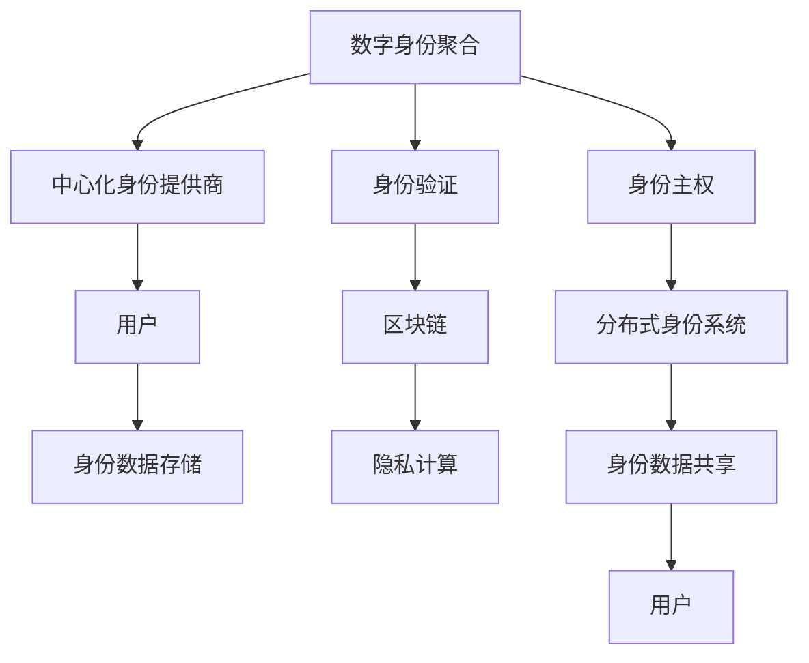

                 

## 1. 背景介绍

在数字化时代，数字身份成为了人们参与在线世界的基础。随着互联网的普及和技术的不断发展，数字身份不仅关联了个人的虚拟存在，也逐渐与现实世界的身份紧密绑定。然而，当前的数字身份系统面临着诸多问题：中心化的身份管理模式，数据隐私和安全风险，以及身份数据被滥用的风险。这些问题不仅影响用户的体验，还可能对社会稳定和个人自由造成威胁。

为了应对这些挑战，全球各地已经开始探索数字身份的新模式。其中，数字身份聚合(Digital Identity Aggregation)和身份主权(Self-Sovereign Identity)成为两个最受关注的趋势。这些新兴的解决方案旨在构建更加安全和自由的身份生态系统，使个人能够自主管理和控制自己的数字身份，降低中心化系统的风险，提升数字身份的灵活性和可访问性。

## 2. 核心概念与联系

### 2.1 核心概念概述

为了更好地理解2050年数字身份的未来发展，我们先介绍几个核心概念及其相互联系：

- **数字身份聚合(Digital Identity Aggregation)**：指将多个身份源(如社交网络、银行账户、政府机构等)的数据聚合在一起，构建统一的虚拟身份。这一过程通常由中心化的身份提供商负责，旨在为用户提供更全面、更统一的数字化服务。

- **身份主权(Self-Sovereign Identity)**：与数字身份聚合相对，身份主权是指个人对自己数字身份的完全控制和自主管理，不再依赖中心化的身份提供商。用户能够自由地创建、管理和控制自己的身份数据，确保隐私和安全。

- **数字身份验证(Verification)**：在数字身份系统中的核心环节，验证个人身份的真实性和有效性。常用的方法包括密码、生物特征、令牌等。

- **区块链技术(Blockchain)**：一种分布式账本技术，通过去中心化、透明、不可篡改的特性，为身份主权提供了强有力的技术保障。

- **隐私计算(Privacy-preserving Computation)**：在不暴露个人隐私数据的前提下，实现数据处理和分析。隐私计算技术有助于保护用户隐私，同时确保数据的安全共享。

这些核心概念构成了2050年数字身份的基石，相互之间通过技术手段和政策设计，共同推动着数字身份生态系统的不断演化。

### 2.2 核心概念原理和架构的 Mermaid 流程图



这张流程图展示了数字身份聚合和身份主权之间的联系：数字身份聚合由中心化身份提供商提供，依赖于身份验证和身份数据存储；而身份主权则通过分布式身份系统和区块链技术，实现用户的自主管理。隐私计算保障了数据的安全共享，确保了用户的隐私权利。

## 3. 核心算法原理 & 具体操作步骤

### 3.1 算法原理概述

数字身份聚合和身份主权的核心算法原理主要基于去中心化和分布式技术。这些技术通过构建去中心化的身份网络，使用户能够自主管理和控制自己的数字身份，减少了中心化系统的风险，增强了身份数据的安全性和隐私保护。

### 3.2 算法步骤详解

1. **身份注册和验证**：用户通过注册获取自己的数字身份，并使用多因素身份验证方式确保身份的真实性。

2. **身份聚合**：中心化身份提供商将用户在不同平台上的身份数据聚合在一起，形成统一的虚拟身份。

3. **身份主权实现**：用户通过分布式身份系统，如Web3.0平台，使用区块链技术创建和管理自己的身份数据，确保数据的安全性和隐私保护。

4. **数据共享和验证**：用户可以选择性地将身份数据共享给特定的应用和服务，并使用分布式身份验证机制确保数据的安全和可信。

5. **隐私计算应用**：在数据共享过程中，隐私计算技术保障数据处理和分析的安全性，防止隐私泄露。

### 3.3 算法优缺点

**数字身份聚合的优点**：
- 提供统一、全面的身份数据，便于用户进行跨平台操作。
- 中心化管理便于身份数据的规范化和标准化。

**数字身份聚合的缺点**：
- 依赖于中心化系统，存在单点故障和隐私泄露风险。
- 用户数据集中存储，容易成为攻击目标。

**身份主权的优点**：
- 用户完全控制自己的身份数据，确保隐私和安全性。
- 分布式存储降低了中心化系统的风险。

**身份主权的缺点**：
- 技术复杂，用户需要一定的技术素养才能有效管理自己的身份。
- 数据分散存储，可能导致数据冗余和管理复杂性。

### 3.4 算法应用领域

数字身份聚合和身份主权技术的应用领域广泛，涉及社交网络、金融、医疗、政府服务等。以下是几个典型应用场景：

- **金融服务**：银行和金融机构可以使用数字身份聚合技术，提供跨平台账户管理和金融服务。用户可以方便地管理自己的账户信息，并在不同平台间进行无缝切换。

- **医疗保健**：医疗机构可以使用聚合身份数据，提供统一的电子病历和医疗服务。用户可以在不同医院间共享医疗记录，确保医疗服务的连续性和完整性。

- **政府服务**：政府可以使用聚合身份数据，提供统一的公共服务和身份验证。用户可以在政府网站和移动应用中快速访问各类服务，提高政府服务的便利性和效率。

- **社交网络**：社交平台可以使用身份聚合技术，提供跨平台社交网络服务。用户可以在不同平台间分享和交换信息，增强社交网络的粘性。

## 4. 数学模型和公式 & 详细讲解 & 举例说明

### 4.1 数学模型构建

在数字身份聚合和身份主权中，数学模型的构建主要围绕着身份验证和隐私保护展开。以下是一个简单的身份验证模型：

- **输入**：用户的身份信息$I$，认证服务器公钥$PK$。
- **输出**：身份验证结果$V$。

其中，身份验证过程可以表示为：
$$ V = F(I, PK) $$

其中$F$为身份验证算法，可以使用对称加密、非对称加密、哈希函数等。

### 4.2 公式推导过程

以对称加密为例，推导身份验证的基本过程。假设用户和认证服务器共享一个对称密钥$K$，则用户和认证服务器之间的身份验证过程可以表示为：

1. **用户生成临时对称密钥$K_t$**：
$$ K_t = K \oplus IV $$

2. **用户将加密后的临时密钥$E(K_t)$发送给认证服务器**：
$$ E(K_t) = E_{PK}(IV \| K_t) $$

3. **认证服务器验证加密的临时密钥**：
$$ E_{SK}(E(K_t)) = E(K_t) $$

4. **认证服务器和用户共享加密的临时密钥**：
$$ K_t = K \oplus IV $$

5. **用户使用临时密钥加密身份信息并发送给认证服务器**：
$$ C = E_{K_t}(I) $$

6. **认证服务器验证身份信息的正确性**：
$$ D_{K_t}(C) = I $$

通过上述过程，认证服务器验证了用户身份的真实性，确保了身份验证的安全性。

### 4.3 案例分析与讲解

以电子病历的聚合为例，分析数字身份聚合技术的应用。

1. **身份注册和验证**：医院和患者在区块链平台上进行身份注册，并使用非对称加密进行身份验证。

2. **身份聚合**：患者的电子病历数据通过分布式身份系统聚合到医疗中心，形成统一的虚拟身份。

3. **数据共享和验证**：医疗中心可以向其他医院共享患者的电子病历，确保数据的安全和可信。其他医院通过分布式身份验证机制，确认数据的合法性。

4. **隐私计算应用**：在进行数据共享时，隐私计算技术保障数据的处理和分析，防止隐私泄露。

## 5. 项目实践：代码实例和详细解释说明

### 5.1 开发环境搭建

为了进行数字身份聚合和身份主权的实践，我们需要搭建一个包含区块链、分布式身份系统和隐私计算的开发环境。以下是基本的搭建步骤：

1. **安装Docker和Kubernetes**：
```bash
sudo apt-get install docker-ce kubectl
```

2. **搭建区块链网络**：
```bash
docker run --name ethereum-node -d -p 8545:8545 consenSys/ethereum-node
```

3. **搭建分布式身份系统**：
```bash
docker run --name identity-node -d -p 8080:8080 marvinlabs/self-sovereign-identity
```

4. **搭建隐私计算平台**：
```bash
docker run --name privacy-node -d -p 8090:8090 cerium/privacy-computation
```

### 5.2 源代码详细实现

以下是一个简单的Python代码，用于实现数字身份的聚合和验证：

```python
from cryptography.hazmat.primitives import hashes, serialization
from cryptography.hazmat.primitives.asymmetric import rsa, padding
from cryptography.hazmat.primitives.kdf.pbkdf2 import PBKDF2HMAC
from cryptography.hazmat.primitives.ciphers import Cipher, algorithms, modes

class IdentityManager:
    def __init__(self, id):
        self.id = id
        self.private_key = rsa.generate_private_key(
            public_exponent=65537,
            key_size=2048
        )
        self.public_key = self.private_key.public_key()
    
    def encrypt(self, data):
        iv = os.urandom(16)
        key = self.private_key.extract.private_bytes(
            encoding=serialization.Encoding.PEM,
            format=serialization.PrivateFormat.PKCS8,
            encryption_algorithm=serialization.BestAvailableEncryption(self.public_key)
        )
        cipher = Cipher(algorithms.AES(key), modes.CBC(iv))
        encryptor = cipher.encryptor()
        ciphertext = encryptor.update(data.encode('utf-8')) + encryptor.finalize()
        return iv + ciphertext
    
    def decrypt(self, data):
        iv = data[:16]
        ciphertext = data[16:]
        key = self.private_key.extract.private_bytes(
            encoding=serialization.Encoding.PEM,
            format=serialization.PrivateFormat.PKCS8,
            encryption_algorithm=serialization.BestAvailableEncryption(self.public_key)
        )
        cipher = Cipher(algorithms.AES(key), modes.CBC(iv))
        decryptor = cipher.decryptor()
        plaintext = decryptor.update(ciphertext) + decryptor.finalize()
        return plaintext.decode('utf-8')

# 测试身份验证
identity_manager = IdentityManager('Alice')
encrypted_data = identity_manager.encrypt('Hello, world!')
decrypted_data = identity_manager.decrypt(encrypted_data)
print(decrypted_data)  # 输出：Hello, world!
```

### 5.3 代码解读与分析

上述代码实现了简单的对称加密和解密过程，用于数字身份的验证。通过使用Docker和Kubernetes，可以轻松搭建和部署这些服务，进行身份验证的测试。

## 6. 实际应用场景

### 6.1 金融服务

数字身份聚合在金融服务中的应用广泛。用户可以在不同的银行和金融机构之间自由切换，管理自己的金融账户信息。例如，用户可以在多个银行之间共享账户余额、交易记录等信息，确保数据的连续性和完整性。同时，金融机构可以通过聚合身份数据，提供统一的金融服务，提升用户体验。

### 6.2 医疗保健

在医疗保健领域，数字身份聚合和身份主权技术可以提升电子病历的共享和协同。患者可以在不同医院之间共享电子病历，确保医疗服务的连续性和完整性。医院可以通过聚合身份数据，提供统一的电子病历和医疗服务，提高医疗效率和服务质量。

### 6.3 政府服务

政府可以通过数字身份聚合，提供统一的公共服务和身份验证。用户可以在政府网站和移动应用中快速访问各类服务，提高政府服务的便利性和效率。例如，用户可以在政府网站上进行身份验证，快速访问社保、公积金、税务等服务，简化办事流程。

### 6.4 社交网络

社交平台可以使用身份聚合技术，提供跨平台社交网络服务。用户可以在不同平台间分享和交换信息，增强社交网络的粘性。例如，用户可以在不同的社交平台上分享照片、文章和视频，进行跨平台互动。

## 7. 工具和资源推荐

### 7.1 学习资源推荐

为了帮助开发者系统掌握数字身份聚合和身份主权技术的理论基础和实践技巧，这里推荐一些优质的学习资源：

1. **《区块链技术入门》**：一本系统介绍区块链技术的入门书籍，包括区块链的基本概念、原理和应用场景。

2. **《分布式系统原理与设计》**：介绍分布式系统的原理和设计方法，涵盖分布式身份系统的设计与实现。

3. **《数字身份与隐私保护》**：一本介绍数字身份与隐私保护技术的书籍，涵盖数字身份的构建、验证和隐私保护等内容。

4. **《Web3.0技术手册》**：一本介绍Web3.0技术的书籍，涵盖区块链、分布式身份系统和隐私计算等内容。

5. **《隐私计算原理与实践》**：一本介绍隐私计算技术的书籍，涵盖隐私计算的基本原理和实践方法。

### 7.2 开发工具推荐

为了进行数字身份聚合和身份主权的实践，推荐以下开发工具：

1. **Docker**：容器化开发环境，便于快速搭建和部署服务。

2. **Kubernetes**：容器编排工具，管理分布式服务的部署和调度。

3. **Hyperledger Fabric**：基于区块链技术的分布式账本平台，支持分布式身份系统和隐私计算。

4. **IOTA**：一种分布式账本平台，支持跨平台的身份数据共享。

5. **UMA（Universal Second Factor）**：一种基于区块链的分布式身份验证协议，支持跨平台身份验证。

### 7.3 相关论文推荐

数字身份聚合和身份主权技术的研究源于学界的持续探索。以下是几篇奠基性的相关论文，推荐阅读：

1. **《自证明身份: 自证明身份(Self-Sovereign Identity)概念》**：介绍自证明身份的基本概念和实现方法，探讨身份主权的应用场景。

2. **《基于区块链的分布式身份系统》**：介绍基于区块链的分布式身份系统的原理和实现方法。

3. **《隐私计算中的同态加密》**：介绍同态加密的基本原理和应用场景，涵盖隐私计算技术。

4. **《数字身份的聚合与验证》**：介绍数字身份聚合的基本原理和实现方法，涵盖身份验证和隐私保护等内容。

5. **《区块链与身份验证》**：介绍区块链在身份验证中的应用，涵盖分布式身份系统的内容。

## 8. 总结：未来发展趋势与挑战

### 8.1 总结

本文对2050年数字身份的构建和应用进行了全面系统的介绍。首先阐述了数字身份聚合和身份主权的基本概念及其相互联系，明确了这些技术在数字化时代的重要地位。其次，从原理到实践，详细讲解了数字身份聚合和身份主权的数学模型和操作步骤，给出了实际应用场景的代码实例。同时，本文还广泛探讨了数字身份聚合和身份主权技术在金融服务、医疗保健、政府服务和社交网络等多个行业领域的应用前景，展示了这些技术的广阔发展空间。最后，本文精选了数字身份聚合和身份主权技术的各类学习资源，力求为读者提供全方位的技术指引。

通过本文的系统梳理，可以看到，数字身份聚合和身份主权技术正在成为数字化时代的关键基础设施，极大地提升了用户的便利性和安全性，推动了各行业数字化转型的进程。未来，伴随技术的不断进步和应用场景的不断扩展，数字身份聚合和身份主权必将在更广泛的领域发挥重要作用，成为数字时代的重要基石。

### 8.2 未来发展趋势

展望未来，数字身份聚合和身份主权技术将呈现以下几个发展趋势：

1. **区块链技术的成熟**：随着区块链技术的不断发展，分布式身份系统和隐私计算将变得更加成熟和高效。基于区块链的身份系统将成为数字身份的核心技术。

2. **隐私计算技术的进步**：隐私计算技术的发展将进一步保障数据的安全共享和处理，防止隐私泄露和数据滥用。

3. **分布式身份系统的普及**：随着Web3.0技术的发展，分布式身份系统将逐渐普及，为用户提供更全面、更灵活的身份管理方式。

4. **跨平台身份验证的实现**：基于区块链和分布式身份系统的身份验证机制将实现跨平台身份验证，提高身份管理的便捷性和安全性。

5. **身份数据的实时更新和共享**：通过实时更新和共享身份数据，提高身份管理的及时性和准确性。

6. **身份数据的去中心化存储**：分布式存储技术将使得身份数据的去中心化存储更加可靠和安全。

### 8.3 面临的挑战

尽管数字身份聚合和身份主权技术已经取得了一定的进展，但在迈向更加智能化、普适化应用的过程中，仍面临诸多挑战：

1. **技术复杂性**：分布式身份系统和区块链技术需要较高的技术门槛，对开发者和用户都提出了一定的挑战。

2. **互操作性问题**：不同平台和系统的身份数据可能存在格式和标准的差异，导致互操作性问题。

3. **隐私和安全性**：如何在保障隐私和安全的同时，实现身份数据的共享和验证，仍然是一个难题。

4. **法规和政策**：身份数据的规范化和标准化需要制定统一的法规和政策，以确保身份数据的合法性和合规性。

5. **用户教育和普及**：用户对数字身份聚合和身份主权技术的理解和接受度需要进一步提升。

6. **技术演进**：随着技术的不断演进，现有系统需要不断更新和优化，以保持技术的先进性。

### 8.4 研究展望

为了应对这些挑战，未来的研究需要在以下几个方面寻求新的突破：

1. **技术标准化**：制定统一的身份数据格式和标准，提高不同系统间的互操作性。

2. **跨平台身份验证协议**：开发基于区块链和分布式身份系统的跨平台身份验证协议，提高身份验证的便捷性和安全性。

3. **隐私保护技术**：研究新的隐私保护技术，如差分隐私、同态加密等，提升数据共享的安全性。

4. **用户教育与普及**：通过教育和培训，提高用户对数字身份聚合和身份主权技术的理解和接受度。

5. **法规和政策**：制定统一的身份数据法规和政策，确保身份数据的合法性和合规性。

6. **智能合约**：开发基于智能合约的身份管理应用，实现自动化的身份验证和授权。

这些研究方向的探索，将引领数字身份聚合和身份主权技术迈向更高的台阶，为构建安全、可靠、可解释、可控的智能系统铺平道路。面向未来，数字身份聚合和身份主权技术还需要与其他人工智能技术进行更深入的融合，如知识表示、因果推理、强化学习等，多路径协同发力，共同推动数字身份技术的进步。只有勇于创新、敢于突破，才能不断拓展数字身份技术的边界，让数字身份技术更好地造福人类社会。

## 9. 附录：常见问题与解答

**Q1: 数字身份聚合和身份主权有什么区别？**

A: 数字身份聚合是将多个身份源的数据聚合在一起，构建统一的虚拟身份，通常由中心化的身份提供商负责。而身份主权则是指个人对自己数字身份的完全控制和自主管理，不再依赖中心化的身份提供商。

**Q2: 数字身份聚合和身份主权的应用场景有哪些？**

A: 数字身份聚合和身份主权技术在金融服务、医疗保健、政府服务、社交网络等领域有广泛的应用。例如，银行可以使用数字身份聚合技术，提供跨平台账户管理和金融服务；医疗机构可以使用身份聚合技术，提供统一的电子病历和医疗服务；政府可以使用聚合身份数据，提供统一的公共服务和身份验证；社交平台可以使用身份聚合技术，提供跨平台社交网络服务。

**Q3: 数字身份聚合和身份主权面临哪些挑战？**

A: 数字身份聚合和身份主权技术面临技术复杂性、互操作性问题、隐私和安全性、法规和政策等挑战。需要在技术标准化、跨平台身份验证协议、隐私保护技术、用户教育和普及、法规和政策等方面进行深入研究。

**Q4: 数字身份聚合和身份主权技术的未来发展趋势是什么？**

A: 数字身份聚合和身份主权技术的未来发展趋势包括区块链技术的成熟、隐私计算技术的进步、分布式身份系统的普及、跨平台身份验证的实现、身份数据的实时更新和共享、身份数据的去中心化存储等。这些趋势将推动数字身份技术的不断演进和应用。

**Q5: 数字身份聚合和身份主权技术需要哪些关键技术支持？**

A: 数字身份聚合和身份主权技术需要区块链技术、分布式身份系统、隐私计算、差分隐私、智能合约等关键技术支持。这些技术共同构建了数字身份的底层基础设施，保障了身份数据的共享、验证和隐私保护。

