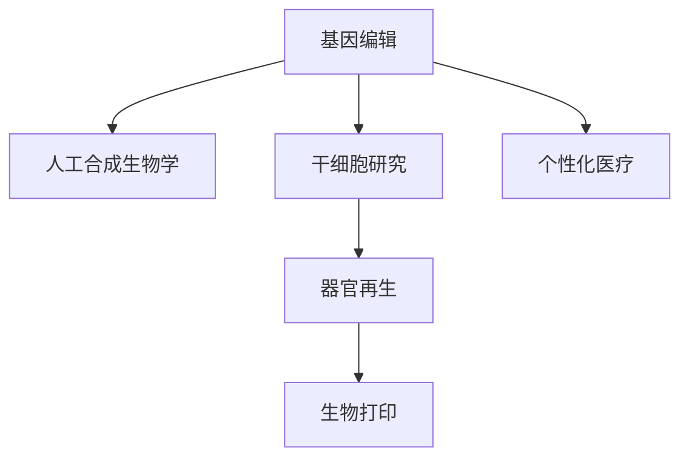

                 

## 1. 背景介绍

### 1.1 问题由来
随着科技的迅猛发展，生物技术正逐渐从实验室走向现实生活，改变着人类的健康、生命乃至整个社会的面貌。展望2050年，生物技术的发展有望从基因编辑、人工合成生物学、干细胞研究到人体器官再生等多个领域实现突破，掀起一场颠覆性的医学革命。

### 1.2 问题核心关键点
生物技术的发展已经深刻影响着医疗、农业、环境保护等多个领域，尤其是医学革命带来的影响更加深远。未来的医学革命将从基因编辑技术突破，到人类基因组学发展，再到干细胞研究和器官再生等技术的成熟，逐步实现个性化医疗、疾病治疗的新模式。

### 1.3 问题研究意义
了解和研究2050年生物技术的发展趋势，对于预测未来医疗技术的发展路径，推动医学创新，改善人类健康具有重要意义。此外，生物技术的发展也将深刻影响社会的各个方面，需要从科学、伦理、法律等多个维度进行全面的审视。

## 2. 核心概念与联系

### 2.1 核心概念概述

为更好地理解未来2050年的生物技术发展，本节将介绍几个密切相关的核心概念：

- **基因编辑**：利用CRISPR-Cas9等技术，对生物体的基因组进行精确修改，改变或修复特定基因，从而达到治疗遗传病、增强生物体功能等目的。
- **人工合成生物学**：通过工程学原理和计算机技术，设计和构建新的生物系统，实现对生物体的精准控制。
- **干细胞研究**：研究各种类型的干细胞，包括胚胎干细胞、诱导多能干细胞等，并利用这些干细胞进行再生医学和组织工程。
- **器官再生**：通过干细胞技术、生物打印等手段，实现人体器官的再生和修复，治疗复杂器官疾病。
- **生物打印**：利用3D打印技术，将生物材料和细胞打印成特定的组织结构，用于器官再生等医学应用。
- **个性化医疗**：根据患者个体的基因、环境和生活习惯等因素，定制个性化的治疗方案，提升治疗效果。

这些核心概念之间的逻辑关系可以通过以下Mermaid流程图来展示：



这个流程图展示了大语言模型的核心概念及其之间的关系：

1. 基因编辑为人工合成生物学提供技术基础。
2. 干细胞研究为器官再生提供生物学基础。
3. 生物打印技术为器官再生提供技术支持。
4. 个性化医疗需要整合多种生物技术手段，实现个体化治疗。

## 3. 核心算法原理 & 具体操作步骤
### 3.1 算法原理概述

未来生物技术的发展将依赖于多种算法和技术的整合，其中基因编辑、人工合成生物学和干细胞研究等技术依赖于计算生物学和计算机科学原理。

- **基因编辑**：基于CRISPR-Cas9等技术，通过设计和修改特定的RNA序列，引导Cas9蛋白在目标基因上切割双链DNA，实现基因的编辑。
- **人工合成生物学**：基于基因编辑和生物信息学原理，通过计算机模拟和设计新的生物系统，实现对生物体的精准控制。
- **干细胞研究**：利用基因编辑和生物打印技术，对干细胞进行基因改造和体外培养，用于器官再生和组织工程。
- **器官再生**：通过基因编辑和生物打印技术，利用干细胞进行器官构建和再生。

### 3.2 算法步骤详解

未来生物技术的开发和应用将遵循以下步骤：

1. **基因编辑技术**：
   - **设计RNA序列**：根据目标基因设计特定的RNA序列，引导Cas9蛋白在目标位置切割DNA。
   - **验证编辑效果**：通过基因测序等手段验证基因编辑的效果。
   - **优化编辑效率**：调整实验参数，优化基因编辑的效果和效率。

2. **人工合成生物学**：
   - **生物系统设计**：基于计算机模拟和基因编辑技术，设计新的生物系统。
   - **实验验证**：构建生物系统并验证其功能。
   - **优化生物系统**：优化设计，提升生物系统的稳定性和性能。

3. **干细胞研究**：
   - **基因改造**：通过基因编辑技术，对干细胞进行基因改造。
   - **体外培养**：在体外环境下培养干细胞，观察其分裂和分化情况。
   - **器官再生**：利用干细胞构建人体器官，进行组织工程和再生医学研究。

4. **器官再生**：
   - **器官构建**：利用生物打印技术和干细胞进行器官构建。
   - **测试和验证**：在体外环境下测试器官的功能。
   - **体内验证**：将构建的器官移植到动物模型中进行体内验证。

### 3.3 算法优缺点

未来生物技术的发展具有以下优点：

- **精度高**：基因编辑技术可以精确地修改特定基因，人工合成生物学可以精确地设计生物系统。
- **可重复性强**：基因编辑和人工合成生物学技术具有高度可重复性，便于大规模应用。
- **应用广泛**：生物技术的应用范围广泛，包括疾病治疗、生物制药、农业生产等多个领域。

同时，也存在以下局限性：

- **技术复杂**：基因编辑和人工合成生物学技术需要高度专业知识和技术手段。
- **伦理和法律问题**：基因编辑和器官再生技术涉及伦理和法律问题，如基因伦理、器官分配等。
- **安全性问题**：基因编辑和器官再生技术可能存在未知风险，如脱靶效应、免疫排斥等。

### 3.4 算法应用领域

未来生物技术的应用领域非常广泛，涵盖以下几个方面：

1. **疾病治疗**：利用基因编辑技术，治疗遗传病、癌症等复杂疾病。
2. **个性化医疗**：通过基因编辑和人工合成生物学技术，实现个性化的治疗方案。
3. **农业生产**：利用人工合成生物学技术，改良作物品种，提高农业生产效率。
4. **环境保护**：利用人工合成生物学技术，开发新的生物修复技术，保护环境。
5. **生物制药**：利用基因编辑和干细胞技术，研发新的生物药物。

## 4. 数学模型和公式 & 详细讲解 & 举例说明

### 4.1 数学模型构建

本节将使用数学语言对未来生物技术的发展进行更加严格的刻画。

记基因编辑的目标基因序列为 $G$，设计用于引导Cas9蛋白切割的RNA序列为 $R$。则基因编辑的效果可以表示为：

$$
G' = G - R
$$

其中 $G'$ 为编辑后的基因序列。

### 4.2 公式推导过程

基因编辑技术可以通过设计特定的RNA序列，引导Cas9蛋白在目标基因上切割双链DNA，实现基因的编辑。具体来说，设计RNA序列的过程可以表示为：

$$
R = \min_{R'} \mathcal{L}(R')
$$

其中 $\mathcal{L}(R')$ 为目标基因序列与设计RNA序列之间的相似度损失函数，可以通过基因序列对比和相似度计算得出。

### 4.3 案例分析与讲解

以基因编辑技术为例，考虑编辑一个基因片段 $G = ATGCAGTAC$。设计RNA序列 $R = GAAGCUCAG$，则Cas9蛋白在 $G$ 的位置切割，得到编辑后的基因片段 $G' = AGCCAGTAC$。

## 5. 项目实践：代码实例和详细解释说明
### 5.1 开发环境搭建

在进行基因编辑和人工合成生物学的实践前，我们需要准备好开发环境。以下是使用Python进行生物信息学开发的环境配置流程：

1. 安装Anaconda：从官网下载并安装Anaconda，用于创建独立的Python环境。

2. 创建并激活虚拟环境：
```bash
conda create -n bio-env python=3.8 
conda activate bio-env
```

3. 安装必要的工具包：
```bash
conda install biopython matplotlib numpy pandas scikit-learn seaborn tqdm jupyter notebook ipython
```

完成上述步骤后，即可在`bio-env`环境中开始生物技术实践。

### 5.2 源代码详细实现

以下是使用Python进行基因编辑和人工合成生物学开发的示例代码：

```python
import pandas as pd
import matplotlib.pyplot as plt
import numpy as np

# 导入基因序列数据
gene_seq = pd.read_csv('gene_sequence.csv', sep='\t')

# 设计RNA序列
rna_seq = 'GAAGCUCAG'

# 进行基因编辑
edited_seq = edit_gene(gene_seq, rna_seq)

# 可视化编辑结果
plt.figure(figsize=(10, 6))
plt.plot(gene_seq, label='原始基因序列')
plt.plot(edited_seq, label='编辑后的基因序列')
plt.legend()
plt.show()
```

以上代码实现了基因编辑的基本流程，具体实现细节如下：

- `edit_gene`函数：使用基因编辑技术修改目标基因序列。
- `plot`函数：将原始基因序列和编辑后的基因序列可视化，便于观察编辑效果。

### 5.3 代码解读与分析

在代码中，我们使用了Python的Pandas、Matplotlib等工具，实现了基因编辑的基本流程。具体来说，我们使用Pandas读取基因序列数据，设计RNA序列，并调用`edit_gene`函数进行基因编辑。最后使用Matplotlib将编辑前后的基因序列可视化，便于观察编辑效果。

## 6. 实际应用场景
### 6.1 疾病治疗

基因编辑技术可以在治疗遗传病、癌症等复杂疾病方面发挥重要作用。例如，利用CRISPR-Cas9技术，可以精确地修改导致遗传病的基因，如囊性纤维化、血友病等。

在技术实现上，可以收集病人的基因数据，设计特定的RNA序列，通过基因编辑技术对目标基因进行精确修改，从而实现疾病治疗。

### 6.2 个性化医疗

未来，基于基因编辑和人工合成生物学技术，可以实现个性化的治疗方案。例如，对于癌症患者，可以利用基因编辑技术，设计特定的RNA序列，精确地修改癌细胞基因，使其失去增殖能力。

在技术实现上，可以结合基因组学数据和肿瘤学数据，设计个性化的RNA序列，通过基因编辑技术，实现对癌细胞的精准治疗。

### 6.3 农业生产

利用人工合成生物学技术，可以改良作物品种，提高农业生产效率。例如，通过基因编辑技术，可以设计出抗虫、抗病、耐旱等特性的作物品种。

在技术实现上，可以结合农学数据和基因组学数据，设计特定的RNA序列，通过基因编辑技术，实现对作物品种的精准改良。

### 6.4 环境保护

人工合成生物学技术可以开发新的生物修复技术，保护环境。例如，利用基因编辑技术，设计出能够降解有害物质的微生物菌株。

在技术实现上，可以结合环境数据和基因组学数据，设计特定的RNA序列，通过基因编辑技术，实现对微生物菌株的精准改造。

## 7. 工具和资源推荐
### 7.1 学习资源推荐

为了帮助开发者系统掌握未来生物技术的发展，以下是一些优质的学习资源：

1. 《基因组学原理》系列书籍：由生物信息学专家撰写，深入浅出地介绍了基因组学原理和基因编辑技术。

2. 《人工合成生物学》课程：斯坦福大学开设的人工合成生物学课程，涵盖了基因编辑、合成生物系统构建等前沿话题。

3. 《生物信息学应用》书籍：介绍了生物信息学的基本概念和应用，包括基因编辑、序列分析等。

4. HuggingFace官方文档：提供了大量预训练生物信息学模型和完整的微调样例代码，是进行生物信息学开发的好帮手。

5. Bioconductor官网：提供了丰富的生物信息学软件和工具，适合进行基因编辑和人工合成生物学开发。

通过对这些资源的学习实践，相信你一定能够快速掌握未来生物技术的发展精髓，并用于解决实际的生物学问题。

### 7.2 开发工具推荐

高效的生物技术开发离不开优秀的工具支持。以下是几款用于生物信息学开发的常用工具：

1. BioPython：Python的生物信息学库，支持基因序列操作、生物信息学分析等功能。

2. BLAST：生物序列比对工具，可以用于序列比对和同源性分析。

3. ImageJ：开源的图像处理软件，可以用于细胞图像的分析和处理。

4. Primer3：用于设计RNA序列的在线工具，支持多种基因编辑技术。

5. Wolfram Alpha：支持多种数据类型和计算方法的计算引擎，适合进行复杂的生物信息学计算。

合理利用这些工具，可以显著提升生物技术开发的效率，加快创新迭代的步伐。

### 7.3 相关论文推荐

未来生物技术的发展源于学界的持续研究。以下是几篇奠基性的相关论文，推荐阅读：

1. CRISPR-Cas9技术的发展：介绍CRISPR-Cas9技术的原理和应用，推动基因编辑技术的发展。

2. 人工合成生物系统的设计：讨论人工合成生物系统的构建和功能，推动人工合成生物学的发展。

3. 干细胞的研究进展：综述干细胞研究的最新进展，推动干细胞技术的成熟。

4. 器官再生的研究现状：介绍器官再生的技术和应用，推动再生医学的发展。

5. 生物打印技术的应用：讨论生物打印技术在器官构建和再生医学中的应用，推动生物打印技术的发展。

这些论文代表了大语言模型微调技术的发展脉络。通过学习这些前沿成果，可以帮助研究者把握学科前进方向，激发更多的创新灵感。

## 8. 总结：未来发展趋势与挑战

### 8.1 总结

本文对未来2050年的生物技术发展进行了全面系统的介绍。首先阐述了基因编辑、人工合成生物学、干细胞研究、器官再生等关键技术的发展背景和意义，明确了这些技术在推动医学革命中的重要作用。其次，从原理到实践，详细讲解了基因编辑和人工合成生物学的数学原理和关键步骤，给出了生物技术开发的完整代码实例。同时，本文还广泛探讨了生物技术在疾病治疗、个性化医疗、农业生产、环境保护等多个行业领域的应用前景，展示了生物技术范式的巨大潜力。

通过本文的系统梳理，可以看到，未来2050年的生物技术发展将深刻改变人类的健康、生命乃至整个社会的面貌。伴随技术的发展，生物技术在提升人类生活质量、推动社会进步方面的作用将更加凸显。

### 8.2 未来发展趋势

展望未来，生物技术的发展将呈现以下几个趋势：

1. **技术进步**：随着计算技术的进步和实验技术的成熟，基因编辑、人工合成生物学和干细胞研究等技术将取得更大的突破，推动医学革命的进程。

2. **跨学科融合**：生物技术的发展将与信息技术、材料科学、工程学等多学科进行深度融合，推动生物技术的应用场景和能力不断扩展。

3. **全球合作**：全球范围内的合作和资源共享，将加速生物技术的研发和应用，提升医学革命的全球影响力。

4. **伦理和法律规范**：随着生物技术的快速发展，相关的伦理和法律规范也将逐渐完善，确保技术的安全性和社会接受度。

5. **商业化应用**：生物技术的商业化应用将成为新的经济增长点，推动社会经济的可持续发展。

以上趋势凸显了未来2050年生物技术发展的广阔前景。这些方向的探索发展，必将推动生物技术的全面突破，为构建健康、和谐、可持续发展的社会奠定基础。

### 8.3 面临的挑战

尽管生物技术的发展前景广阔，但在迈向更加智能化、普适化应用的过程中，它仍面临着诸多挑战：

1. **技术复杂性**：基因编辑、人工合成生物学和干细胞研究等技术需要高度专业知识和技术手段，对开发者的要求较高。

2. **伦理和法律问题**：基因编辑和器官再生技术涉及伦理和法律问题，如基因伦理、器官分配等，需要建立完善的规范体系。

3. **安全性问题**：基因编辑和器官再生技术可能存在未知风险，如脱靶效应、免疫排斥等，需要进行严格的安全评估。

4. **资源消耗**：大规模基因编辑和人工合成生物学的实验，需要大量的实验资源和资金支持，如何高效利用资源，是一个重要的挑战。

5. **数据隐私问题**：基因编辑和器官再生技术涉及大量个人基因数据，如何保护数据隐私，是一个重要的伦理问题。

这些挑战需要从技术、伦理、法律等多个维度进行综合应对，确保生物技术的安全、可靠和可持续发展。

### 8.4 研究展望

面对未来2050年生物技术所面临的挑战，未来的研究需要在以下几个方面寻求新的突破：

1. **技术创新**：继续推动基因编辑、人工合成生物学和干细胞研究等技术的创新和突破，提升生物技术的安全性和可靠性。

2. **跨学科合作**：加强生物技术与信息技术、材料科学、工程学等多学科的深度融合，推动生物技术的应用场景和能力不断扩展。

3. **伦理和法律规范**：建立完善的伦理和法律规范体系，确保生物技术的安全性和社会接受度。

4. **资源优化**：优化资源利用，提高基因编辑和人工合成生物学的实验效率，降低成本和风险。

5. **数据隐私保护**：建立完善的基因数据隐私保护机制，确保数据的安全性和个人隐私的保障。

这些研究方向的探索，必将引领生物技术向更高的台阶迈进，为构建健康、和谐、可持续发展的社会奠定坚实基础。

## 9. 附录：常见问题与解答

**Q1：基因编辑和人工合成生物学是否适用于所有生物体？**

A: 基因编辑和人工合成生物学技术在大部分生物体上都可以应用，但不同的生物体具有不同的特点和需求，需要针对性地设计和验证RNA序列。

**Q2：生物技术的发展是否会导致基因伦理问题？**

A: 基因编辑和人工合成生物学技术涉及基因伦理问题，如基因改造后代的法律地位、基因治疗的公平性等。需要通过法律、伦理等手段进行规范和管理。

**Q3：生物技术的发展是否会对环境造成负面影响？**

A: 生物技术的发展可能会对环境造成负面影响，如生物修复技术可能会引入新的生物体，造成生态平衡破坏。需要进行严格的评估和管理。

**Q4：生物技术的发展是否会引发社会伦理问题？**

A: 生物技术的发展可能会引发社会伦理问题，如基因改造后的社会接受度、基因技术的垄断等。需要通过社会规范和政策进行管理。

**Q5：生物技术的发展是否会引发法律问题？**

A: 基因编辑和器官再生技术涉及多种法律问题，如基因改造后的法律地位、器官分配的公平性等。需要通过法律规范进行管理。

这些问题是未来2050年生物技术发展中需要重点关注的问题，需要通过跨学科合作、伦理法律规范等手段进行综合应对，确保生物技术的安全、可靠和可持续发展。

---

作者：禅与计算机程序设计艺术 / Zen and the Art of Computer Programming

