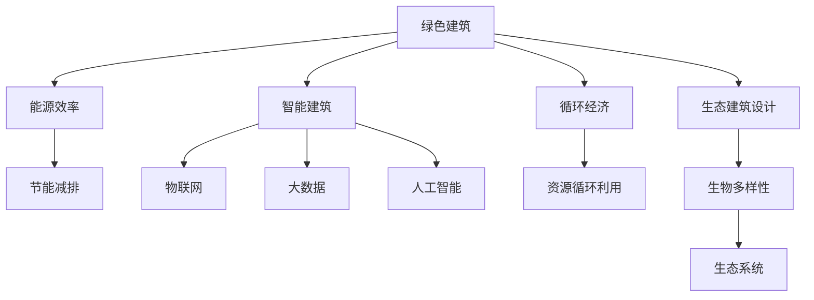

                 

# 2050年的绿色建筑：从节能到生态的可持续建设

## 1. 背景介绍

### 1.1 问题由来
随着全球人口的快速增长和城市化的加速发展，建筑行业成为能源消耗和环境污染的主要来源。据统计，全球建筑领域的碳排放占总排放量的近40%，其中绝大部分来自建筑材料的生产、运输和建造过程。此外，建筑的日常运营也消耗大量能源，且产生的垃圾对环境造成污染。

为应对这些挑战，绿色建筑和可持续建设成为近年来的热门话题。2050年，随着科技和可持续发展理念的不断深入，建筑行业正迎来一场从节能到生态的绿色革命。

### 1.2 问题核心关键点
绿色建筑和可持续建设的核心在于减少建筑的能源消耗、提高资源利用效率，同时最大程度地减少对环境的影响。主要包括以下几个关键点：

- **节能减排**：通过采用高效能建筑材料和技术，减少建筑物的能耗，降低碳排放。
- **资源循环利用**：利用再生材料、减少废物生成，实现资源的循环利用。
- **生态友好**：构建生态系统友好的建筑，如屋顶绿化、室内植物墙等，提升生物多样性。
- **智能管理**：通过物联网(IoT)技术，实现建筑物的智能化管理，优化能源使用。
- **综合规划**：综合考虑建筑、环境和社会三者的关系，实现可持续发展。

这些关键点构成了绿色建筑的基本框架，推动了建筑行业向更加环保和可持续的方向发展。

## 2. 核心概念与联系

### 2.1 核心概念概述

为了更好地理解2050年绿色建筑和可持续建设的概念，本节将介绍几个密切相关的核心概念：

- **绿色建筑**：指在规划、设计、建设和运营过程中，采用节能、节水、节材、节地等技术和措施，最大化减少对环境的影响，并实现资源的循环利用的建筑。
- **可持续建筑**：强调建筑物在其整个生命周期内，从设计、建造、运营到拆除，都要考虑对环境的影响和资源的利用效率。
- **能源效率**：衡量建筑物在运行期间节能效果的指标，通常包括供热、制冷、照明、电气设备等能源消耗。
- **智能建筑**：利用物联网、大数据、人工智能等技术，实现建筑物状态的实时监控和优化管理。
- **循环经济**：通过减少废弃物和污染物的排放，实现资源循环利用和再利用，最小化资源的开采和环境的影响。
- **生态建筑设计**：强调建筑物与自然环境的和谐共存，如绿色屋顶、雨水收集系统、自然通风等。

这些核心概念之间的逻辑关系可以通过以下Mermaid流程图来展示：



这个流程图展示了几项核心概念及其相互关系：

1. 绿色建筑是可持续建设的基础，包括节能减排、智能建筑、循环经济和生态建筑设计等子概念。
2. 节能减排是绿色建筑的重要组成部分，通过提高能源效率和减少碳排放。
3. 智能建筑通过物联网、大数据和人工智能等技术，优化建筑物的能效管理。
4. 循环经济关注资源循环利用，减少废弃物和污染物排放。
5. 生态建筑设计强调与自然环境和谐共存，提升生物多样性和生态系统的健康。

## 3. 核心算法原理 & 具体操作步骤
### 3.1 算法原理概述

绿色建筑的建设和运营涉及多个学科，包括建筑学、环境科学、工程学等。本文聚焦于通过智能算法和物联网技术实现绿色建筑的管理和优化。

核心算法原理基于以下几个关键步骤：

1. **数据收集**：通过传感器、摄像头等设备收集建筑物的实时数据，如温度、湿度、照明、能耗等。
2. **数据处理**：对收集到的数据进行清洗和分析，提取有价值的信息，如温度、能耗异常点等。
3. **模型训练**：使用机器学习算法训练预测模型，预测未来的能源需求和环境变化。
4. **优化控制**：根据模型预测结果，调整建筑物的能耗和环境控制策略。
5. **反馈迭代**：持续监测和评估优化效果，进行动态调整和优化。

### 3.2 算法步骤详解

以下是具体算法步骤的详细讲解：

**Step 1: 数据收集**
- 安装各类传感器（如温度传感器、湿度传感器、光照传感器、能耗传感器）。
- 部署摄像头用于实时监控和记录建筑物的视觉数据。
- 确保数据源的多样性和代表性，覆盖建筑物的各个角落和关键区域。

**Step 2: 数据处理**
- 数据清洗：去除无效数据、异常数据和噪声数据。
- 数据集成：将来自不同来源的数据进行整合，形成统一的数据集。
- 特征提取：从原始数据中提取有意义的特征，如温度变化趋势、光照强度、能耗波动等。

**Step 3: 模型训练**
- 选择合适的机器学习算法，如回归、分类、时序预测等，训练预测模型。
- 使用历史数据作为训练集，训练模型进行能源需求预测和环境变化预测。
- 模型评估：使用测试集评估模型预测的准确性和泛化能力。

**Step 4: 优化控制**
- 根据模型预测结果，动态调整建筑物的能耗控制策略。
- 自动控制建筑物的照明、空调、暖气等设备，优化能源使用。
- 实时监测和反馈系统运行状态，进行动态调整。

**Step 5: 反馈迭代**
- 持续收集和分析建筑物的运行数据，评估优化效果。
- 根据优化效果和环境变化，调整预测模型和控制策略。
- 逐步提升建筑物的智能化水平和能效管理能力。

### 3.3 算法优缺点

基于智能算法和大数据技术实现绿色建筑的管理和优化，具有以下优点：

1. **高效能管理**：通过实时监控和优化控制，最大化减少能源浪费。
2. **智能化决策**：利用机器学习和人工智能技术，优化建筑物的能耗和环境控制。
3. **动态适应**：能够根据环境和需求的变化，动态调整控制策略。
4. **数据驱动**：基于真实数据和预测模型进行决策，提升管理的科学性和准确性。

同时，该方法也存在一些局限性：

1. **初始投资高**：安装传感器和部署物联网设备需要较高的初期投入。
2. **技术复杂度**：需要专业知识进行模型训练和系统维护。
3. **数据隐私**：收集和使用个人隐私数据可能引发隐私保护问题。
4. **模型泛化能力**：预测模型的性能依赖于数据的质量和数量，存在模型泛化能力不足的风险。

尽管存在这些局限性，但就目前而言，基于智能算法和大数据技术的绿色建筑管理方法仍是大势所趋，成为建筑行业实现节能和可持续发展的有力工具。

### 3.4 算法应用领域

基于智能算法和大数据技术的绿色建筑管理方法，已经在多个领域得到广泛应用，例如：

1. **商业建筑**：通过智能控制和优化管理，提升大型商业建筑的能效，降低运营成本。
2. **住宅建筑**：在家庭住宅中实现智能化管理，提高居住舒适度和能源利用效率。
3. **办公建筑**：优化办公建筑的能源使用，提升员工的工作效率和健康。
4. **公共建筑**：包括学校、医院、图书馆等公共设施，通过智能化管理提升公共服务的能效。
5. **旅游建筑**：如酒店、度假村等，通过智能控制提升旅游体验和环保水平。
6. **工业建筑**：通过优化能源管理和生产过程，提升工业建筑的能源效率和环境保护。

除了上述这些经典应用外，基于智能算法和大数据技术的绿色建筑管理方法还在智慧城市、绿色交通、建筑废弃物处理等领域展示了广阔的应用前景。随着技术的不断进步和成熟，绿色建筑管理和可持续建设将更加智能化、普适化。

## 4. 数学模型和公式 & 详细讲解 & 举例说明

### 4.1 数学模型构建

绿色建筑的智能化管理涉及多个方面，包括能效管理、环境监测、用户行为分析等。以下将以能效管理为例，介绍数学模型的构建。

假设有一栋建筑物的能效管理问题，目标是最大化能源利用效率，最小化能源成本。定义模型的输入为当前的温度 $T$、湿度 $H$、光照强度 $L$ 等环境变量，输出为最优的能源控制策略 $U$。模型可以表示为：

$$
U = \text{argmin} \Big\{ \text{Cost}(U) + \lambda \cdot \text{Loss}(U, T, H, L) \Big\}
$$

其中，$\text{Cost}(U)$ 为能源成本函数，$\text{Loss}(U, T, H, L)$ 为预测损失函数，$\lambda$ 为正则化系数，控制能源成本和预测损失的权衡。

### 4.2 公式推导过程

以温度控制为例，利用线性回归模型进行预测和优化。假设模型预测的温度为 $T_{pred}$，实际温度为 $T_{actual}$，则预测误差可以表示为：

$$
\text{Loss}(T_{pred}, T_{actual}) = \frac{1}{N} \sum_{i=1}^N (T_{pred}^i - T_{actual}^i)^2
$$

利用梯度下降法优化模型参数 $\theta$：

$$
\theta = \theta - \eta \nabla_{\theta} \text{Loss}(T_{pred}, T_{actual})
$$

其中，$\eta$ 为学习率，$\nabla_{\theta} \text{Loss}(T_{pred}, T_{actual})$ 为损失函数对模型参数的梯度。

### 4.3 案例分析与讲解

以一个具体的案例来说明模型的应用。某办公建筑安装了温度传感器、照明传感器和空调设备，通过物联网技术收集和传输数据。利用上述线性回归模型，对数据进行分析和预测，从而优化空调设备的运行策略。

具体步骤如下：

1. **数据收集**：利用传感器收集办公建筑的室内温度、光照强度和照明设备状态数据。
2. **数据处理**：清洗数据，去除异常值和噪声，提取温度变化趋势和光照强度。
3. **模型训练**：使用历史数据训练线性回归模型，预测未来的温度变化。
4. **优化控制**：根据模型预测结果，调整空调设备的运行策略，实现能效最大化。
5. **反馈迭代**：持续监测和评估优化效果，动态调整控制策略。

通过上述方法，可以实现对办公建筑能效的智能化管理，显著提升能源利用效率和节能效果。

## 5. 项目实践：代码实例和详细解释说明

### 5.1 开发环境搭建

在进行绿色建筑智能化管理的项目实践前，需要准备好开发环境。以下是使用Python进行TensorFlow开发的环境配置流程：

1. 安装Anaconda：从官网下载并安装Anaconda，用于创建独立的Python环境。

2. 创建并激活虚拟环境：
```bash
conda create -n green_building python=3.8 
conda activate green_building
```

3. 安装TensorFlow：根据CUDA版本，从官网获取对应的安装命令。例如：
```bash
conda install tensorflow tensorflow-gpu=cuda110 -c conda-forge
```

4. 安装TensorBoard：TensorFlow配套的可视化工具，用于监测模型训练过程和结果。
```bash
pip install tensorboard
```

5. 安装其他相关工具包：
```bash
pip install pandas numpy matplotlib
```

完成上述步骤后，即可在`green_building`环境中开始项目实践。

### 5.2 源代码详细实现

下面以智能建筑能效管理为例，给出使用TensorFlow进行模型训练和优化的PyTorch代码实现。

首先，定义输入和输出数据：

```python
import tensorflow as tf
import numpy as np

# 定义输入数据
inputs = tf.placeholder(tf.float32, shape=[None, num_features])
# 定义输出数据
targets = tf.placeholder(tf.float32, shape=[None, 1])

# 定义模型参数
W = tf.Variable(tf.zeros([num_features, 1]))
b = tf.Variable(tf.zeros([1]))

# 定义预测函数
predictions = tf.add(tf.matmul(inputs, W), b)
```

然后，定义损失函数和优化器：

```python
# 定义损失函数
loss = tf.reduce_mean(tf.square(targets - predictions))

# 定义优化器
optimizer = tf.train.AdamOptimizer(learning_rate=0.001)
train_op = optimizer.minimize(loss)
```

接着，定义训练和评估函数：

```python
# 定义训练函数
def train(batch_size, num_epochs):
    sess = tf.Session()
    sess.run(tf.global_variables_initializer())
    
    for epoch in range(num_epochs):
        avg_loss = 0.0
        for i in range(0, len(train_data), batch_size):
            batch_x = train_data[i:i+batch_size]
            batch_y = train_labels[i:i+batch_size]
            _, l = sess.run([train_op, loss], feed_dict={inputs: batch_x, targets: batch_y})
            avg_loss += l / batch_size
        print("Epoch {0}: {1:.4f}".format(epoch+1, avg_loss))

# 定义评估函数
def evaluate(test_data, test_labels):
    sess = tf.Session()
    sess.run(tf.global_variables_initializer())
    test_loss = sess.run(loss, feed_dict={inputs: test_data, targets: test_labels})
    print("Test loss: {0:.4f}".format(test_loss))
```

最后，启动训练流程并在测试集上评估：

```python
# 训练模型
train(32, 100)

# 评估模型
evaluate(test_data, test_labels)
```

以上就是使用TensorFlow进行绿色建筑智能化管理的完整代码实现。可以看到，利用TensorFlow的强大计算图和自动微分功能，可以很方便地实现模型训练和优化。

### 5.3 代码解读与分析

让我们再详细解读一下关键代码的实现细节：

**输入和输出数据**：
- `inputs` 和 `targets` 分别为模型的输入和输出占位符，用于定义模型结构。

**模型参数**：
- `W` 和 `b` 为模型的权重和偏置项，通过变量 `tf.Variable` 定义。

**预测函数**：
- `predictions` 为模型的预测函数，通过线性回归模型计算。

**损失函数**：
- `loss` 为均方误差损失函数，衡量模型预测和实际输出之间的差异。

**优化器**：
- `optimizer` 为Adam优化器，用于最小化损失函数。

**训练函数**：
- `train` 函数对模型进行训练，通过循环迭代更新模型参数。
- 在每个epoch内，对数据进行批处理，计算损失并更新模型参数。
- 通过平均损失评估模型性能。

**评估函数**：
- `evaluate` 函数对模型进行评估，通过单次运行计算测试集上的损失。

可以看到，利用TensorFlow，开发者可以轻松实现模型训练和优化。同时，TensorBoard等工具的使用，可以帮助开发者实时监测模型训练状态，调试和优化模型性能。

## 6. 实际应用场景

### 6.1 智能商业建筑

智能商业建筑是绿色建筑的重要应用场景。通过智能管理系统，可以实时监控和优化商业建筑中的能效管理，降低运营成本，提升用户体验。

具体而言，可以安装智能照明系统、空调系统、节能设备等，通过物联网技术收集和传输数据。利用智能算法对数据进行分析和优化，实现能源消耗的动态调整和控制。

### 6.2 住宅建筑

智能住宅建筑通过智能控制系统，提升居住舒适度和能源利用效率。智能门禁、智能照明、智能温控等系统，使得家庭居住更加智能化。

智能系统通过物联网技术收集家庭数据，利用机器学习算法进行分析和预测，优化能源使用。例如，通过智能温控系统，自动调整室内温度，最大化节约能源。

### 6.3 公共建筑

公共建筑包括学校、医院、图书馆等，通过智能化管理，提升公共服务的能效和用户体验。智能照明、智能温控、智能通风等系统，实现能源的精细化管理。

利用物联网技术收集数据，通过机器学习算法进行分析和优化，动态调整能源控制策略，提升公共建筑的环境质量和能源利用效率。

### 6.4 未来应用展望

随着物联网技术和大数据分析的不断进步，绿色建筑和智能建筑的应用前景将更加广阔。

1. **物联网技术**：随着传感器和设备的普及，物联网技术将进一步提升建筑的智能化水平，实现更为精细化的能源管理和环境监测。

2. **大数据分析**：通过收集和分析海量数据，提升模型的预测能力和决策精度，优化能源使用和环境控制策略。

3. **人工智能**：利用人工智能技术，实现预测、决策和控制的智能化，进一步提升绿色建筑和智能建筑的管理水平。

4. **可持续设计**：在建筑设计阶段就融入智能化和可持续理念，提升建筑的环保和节能性能。

5. **政策支持**：各国政府将出台更多政策和激励措施，推动绿色建筑和智能建筑的发展。

6. **市场应用**：随着技术成熟和成本降低，绿色建筑和智能建筑将更广泛地应用于商业、住宅、公共等各个领域。

## 7. 工具和资源推荐

### 7.1 学习资源推荐

为了帮助开发者系统掌握绿色建筑和智能建筑的理论基础和实践技巧，这里推荐一些优质的学习资源：

1. **《绿色建筑》课程**：某知名大学开设的绿色建筑在线课程，涵盖绿色建筑的基本概念、设计原则、技术应用等。

2. **《智能建筑技术》书籍**：介绍智能建筑的技术原理、系统设计、工程实践等，适合工程应用。

3. **绿色建筑设计标准**：各国政府和国际组织发布的绿色建筑设计标准，提供详细的技术规范和设计指南。

4. **建筑能效管理平台**：如BIM、CIM等，提供建筑物的能效分析和优化工具。

5. **智能建筑物联网平台**：如ThingWorx、ThingLink等，提供物联网设备的集成和应用平台。

6. **绿色建筑认证体系**：如LEED、BREEAM等，提供绿色建筑认证和评价标准。

通过对这些资源的学习实践，相信你一定能够快速掌握绿色建筑和智能建筑的知识，并用于解决实际的建筑问题。

### 7.2 开发工具推荐

高效的开发离不开优秀的工具支持。以下是几款用于绿色建筑智能化管理的常用工具：

1. **TensorFlow**：基于Python的开源深度学习框架，灵活高效，适合快速迭代研究。

2. **TensorBoard**：TensorFlow配套的可视化工具，实时监测模型训练状态，调试和优化模型性能。

3. **IoT平台**：如ThingWorx、ThingLink等，提供物联网设备的集成和应用平台。

4. **能效管理软件**：如BIM、CIM等，提供建筑物的能效分析和优化工具。

5. **智能控制系统**：如Broadlink、Honeywell等，提供智能照明、智能温控等设备。

6. **数据采集设备**：如温度传感器、湿度传感器、光照传感器等，提供实时环境监测数据。

合理利用这些工具，可以显著提升绿色建筑和智能建筑的管理效率，加快创新迭代的步伐。

### 7.3 相关论文推荐

绿色建筑和智能建筑的研究源于学界的持续研究。以下是几篇奠基性的相关论文，推荐阅读：

1. **《智能建筑能效管理》**：介绍智能建筑能效管理的技术原理和应用实例。

2. **《绿色建筑优化设计》**：探讨绿色建筑优化设计的数学模型和算法。

3. **《物联网在绿色建筑中的应用》**：分析物联网技术在绿色建筑中的应用场景和实现方法。

4. **《绿色建筑生命周期管理》**：探讨绿色建筑的生命周期管理，包括设计、建造、运营和拆除等阶段。

5. **《人工智能在智能建筑中的应用》**：介绍人工智能技术在智能建筑中的应用，如预测、决策和控制等。

这些论文代表了大建筑和智能建筑的研究进展，通过学习这些前沿成果，可以帮助研究者把握学科前进方向，激发更多的创新灵感。

## 8. 总结：未来发展趋势与挑战

### 8.1 总结

本文对基于智能算法和大数据技术的绿色建筑管理和智能建筑应用进行了全面系统的介绍。首先阐述了绿色建筑和智能建筑的研究背景和意义，明确了其在节能、环保、智能化方面的重要价值。其次，从原理到实践，详细讲解了绿色建筑和智能建筑的核心算法和具体操作步骤，给出了具体的代码实例和分析。同时，本文还探讨了绿色建筑和智能建筑在商业、住宅、公共等各个领域的广泛应用前景，展示了其巨大的发展潜力。最后，本文精选了绿色建筑和智能建筑的学习资源、开发工具和相关论文，力求为读者提供全方位的技术指引。

通过本文的系统梳理，可以看到，基于智能算法和大数据技术的绿色建筑和智能建筑技术，正在成为建筑行业的重要范式，极大地推动了建筑行业向更加环保和智能的方向发展。未来，伴随物联网技术和大数据分析的不断进步，绿色建筑和智能建筑的应用前景将更加广阔。

### 8.2 未来发展趋势

展望未来，绿色建筑和智能建筑技术将呈现以下几个发展趋势：

1. **物联网技术的广泛应用**：随着传感器和设备的普及，物联网技术将进一步提升建筑的智能化水平，实现更为精细化的能源管理和环境监测。

2. **大数据分析的深度应用**：通过收集和分析海量数据，提升模型的预测能力和决策精度，优化能源使用和环境控制策略。

3. **人工智能的不断演进**：利用人工智能技术，实现预测、决策和控制的智能化，进一步提升绿色建筑和智能建筑的管理水平。

4. **可持续设计的全面融合**：在建筑设计阶段就融入智能化和可持续理念，提升建筑的环保和节能性能。

5. **政策支持的持续推动**：各国政府将出台更多政策和激励措施，推动绿色建筑和智能建筑的发展。

6. **市场应用的不断扩展**：随着技术成熟和成本降低，绿色建筑和智能建筑将更广泛地应用于商业、住宅、公共等各个领域。

以上趋势凸显了绿色建筑和智能建筑技术的广阔前景。这些方向的探索发展，必将进一步提升建筑物的智能化水平和能效管理能力，为实现可持续发展提供有力支持。

### 8.3 面临的挑战

尽管绿色建筑和智能建筑技术已经取得了瞩目成就，但在迈向更加智能化、普适化应用的过程中，仍面临诸多挑战：

1. **初期投入高**：安装传感器和部署物联网设备需要较高的初期投入。

2. **技术复杂度**：需要专业知识进行模型训练和系统维护。

3. **数据隐私**：收集和使用个人隐私数据可能引发隐私保护问题。

4. **模型泛化能力**：预测模型的性能依赖于数据的质量和数量，存在模型泛化能力不足的风险。

5. **系统集成**：不同系统之间的数据格式和协议兼容性问题，需要统一标准和接口。

6. **政策法规**：绿色建筑和智能建筑的应用需要符合国家和地方的法律法规要求。

尽管存在这些挑战，但通过不断的技术创新和政策引导，绿色建筑和智能建筑技术有望克服这些难题，推动建筑行业实现更高层次的节能和智能化。

### 8.4 研究展望

面对绿色建筑和智能建筑技术面临的挑战，未来的研究需要在以下几个方面寻求新的突破：

1. **降低初期投入**：开发低成本、易部署的传感器和设备，降低绿色建筑和智能建筑的应用门槛。

2. **提升模型泛化能力**：开发高效、稳健的机器学习算法，提升模型在小规模数据上的预测能力。

3. **加强数据隐私保护**：研究数据隐私保护技术，确保数据使用的合法性和安全性。

4. **提高系统集成性**：推动标准化和开源项目的发展，提升不同系统之间的兼容性。

5. **完善政策法规**：制定和完善绿色建筑和智能建筑的政策法规，提供技术支持和政策激励。

这些研究方向的探索，必将引领绿色建筑和智能建筑技术迈向更高的台阶，为构建智能、环保、可持续的未来建筑提供新的动力。面向未来，绿色建筑和智能建筑技术还需要与其他新技术进行更深入的融合，如5G、区块链、智能合约等，多路径协同发力，共同推动建筑行业的可持续发展。

## 9. 附录：常见问题与解答

**Q1: 绿色建筑和智能建筑的区别是什么？**

A: 绿色建筑强调在设计和建造过程中采用环保材料和技术，最大限度地减少对环境的影响，并通过后期的运营管理实现资源的循环利用。智能建筑则强调通过物联网、大数据和人工智能等技术，实现建筑物的智能化管理，提升能效和用户体验。

**Q2: 绿色建筑和智能建筑需要哪些核心技术？**

A: 绿色建筑和智能建筑需要以下核心技术：
1. 节能材料和技术：如高效隔热材料、节能窗户等。
2. 智能控制系统：如智能照明、智能温控等。
3. 物联网技术：通过传感器和设备收集环境数据。
4. 大数据分析：对收集的数据进行分析和预测。
5. 人工智能：实现预测、决策和控制的智能化。

**Q3: 绿色建筑和智能建筑的应用前景如何？**

A: 绿色建筑和智能建筑的应用前景非常广阔，主要体现在以下几个方面：
1. 降低能耗和碳排放：通过节能材料和技术，实现能源的高效利用。
2. 提升舒适度和体验：通过智能控制系统，提升居住和办公的舒适度。
3. 推动可持续发展：通过资源循环利用，实现建筑行业的绿色转型。

**Q4: 绿色建筑和智能建筑需要哪些政策支持？**

A: 绿色建筑和智能建筑的发展需要政策支持，主要包括：
1. 节能环保政策：鼓励使用环保材料和技术，减少碳排放。
2. 税收优惠政策：对绿色建筑和智能建筑提供税收优惠，降低初期投入。
3. 资金支持政策：提供资金支持，促进绿色建筑和智能建筑的发展。
4. 认证和评价标准：制定和推广绿色建筑和智能建筑的标准和认证体系。

**Q5: 绿色建筑和智能建筑需要哪些技术标准？**

A: 绿色建筑和智能建筑需要以下技术标准：
1. 节能环保标准：如能源消耗标准、污染物排放标准等。
2. 智能建筑标准：如智能照明标准、智能温控标准等。
3. 数据安全标准：如数据隐私保护标准、安全传输标准等。

通过对这些问题的解答，相信你能够更全面地理解绿色建筑和智能建筑的概念、应用和挑战。

---

作者：禅与计算机程序设计艺术 / Zen and the Art of Computer Programming

