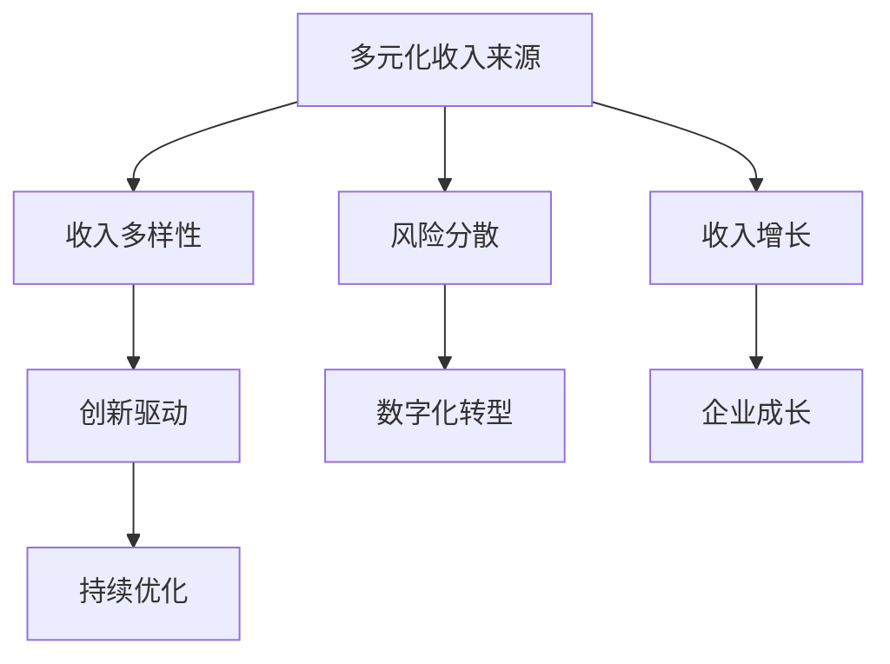

                 

# 建立多元化收入来源的重要性

> 关键词：多元化收入来源、收入多样性、风险分散、创新驱动、数字化转型、技术变革

## 1. 背景介绍

在当今快速变化的商业环境中，企业面临越来越多的不确定性和挑战。如何确保长期稳定的收入增长，是每个企业必须解决的核心问题。传统单一业务模式下的收入来源，容易受到市场波动、政策变化、竞争压力等因素的影响，一旦出现问题，可能对企业造成巨大冲击。因此，构建多元化收入来源体系，已成为企业提升竞争力和适应市场变化的重要策略。

### 1.1 背景由来

在过去的几十年里，许多企业之所以能够保持长期的增长，很大程度上依赖于它们的核心业务或产品。例如，科技巨头依靠其专有的软件和服务，消费品牌依赖于其独特的品牌价值，制造企业依靠其产品线的稳定性。然而，随着市场和技术的发展，这种单一收入来源的模式已经无法应对日益复杂多变的市场需求。

全球金融危机、新冠疫情、供应链问题、市场竞争加剧等事件的发生，更是使得依赖单一收入来源的企业面临巨大风险。因此，构建多元化的收入来源体系，不仅能够分散风险，还能为企业带来新的增长点和发展机会。

## 2. 核心概念与联系

### 2.1 核心概念概述

为了更好地理解构建多元化收入来源的重要性，本节将介绍几个关键概念及其相互关系：

- **多元化收入来源(Multiple Revenue Streams)**：指企业从多个业务线或产品线获得收入，以分散市场和产品风险。
- **收入多样性(Revenue Diversification)**：指企业通过引入不同的业务模式和收入渠道，实现收入来源的多元化和分散化。
- **风险分散(Risk Mitigation)**：指通过构建多元化的收入来源体系，降低单一业务或产品线的风险，增强企业应对市场变化的能力。
- **创新驱动(Innovation Driven)**：指企业通过不断创新业务模式和技术手段，推动多元化收入来源的构建和优化。
- **数字化转型(Digital Transformation)**：指企业利用信息技术提升业务流程、产品和服务，实现收入来源的多样化和创新。

这些概念之间的逻辑关系可以通过以下Mermaid流程图来展示：



这个流程图展示了多元化收入来源体系的构建过程：

1. **收入多样性**：通过引入新的业务模式和收入渠道，实现收入来源的多元化。
2. **风险分散**：通过构建多元化的收入来源体系，降低单一业务或产品线的风险，增强企业应对市场变化的能力。
3. **创新驱动**：通过不断创新业务模式和技术手段，推动多元化收入来源的构建和优化。
4. **数字化转型**：利用信息技术提升业务流程、产品和服务，实现收入来源的多样化和创新。

## 3. 核心算法原理 & 具体操作步骤

### 3.1 算法原理概述

构建多元化收入来源体系，本质上是一种基于市场分析和战略规划的多目标优化问题。其核心思想是：在分析市场需求、竞争态势和企业资源的基础上，设计不同的业务模式和收入渠道，以实现收入来源的多元化和风险分散。

形式化地，假设企业有$n$种业务模式，每种业务模式在市场$M$上的潜在收入为$R_i(M)$。企业需要设计一种业务组合$(X_1, X_2, ..., X_n)$，使得总收入最大化，同时满足收入来源的多元化和风险分散目标。

企业需要优化的问题可以表示为：

$$
\max_{X} \sum_{i=1}^n R_i(X_i)
$$

其中，$X$表示企业对不同业务模式的投入和资源配置，$R_i(X_i)$表示在第$i$个市场$M_i$上，业务模式$X_i$的潜在收入。

### 3.2 算法步骤详解

构建多元化收入来源体系，通常需要以下关键步骤：

**Step 1: 市场分析和需求预测**

- 进行市场调研，收集行业数据和竞争对手信息。
- 分析市场需求，预测未来趋势。
- 确定目标市场和潜在客户群体。

**Step 2: 业务模式设计**

- 根据市场需求和自身资源，设计不同的业务模式和收入渠道。
- 对每种业务模式进行可行性分析和评估，确定投入和资源配置。
- 设计业务的定价策略和营销渠道。

**Step 3: 风险评估和应对策略**

- 评估每种业务模式的潜在风险，包括市场风险、技术风险、运营风险等。
- 制定风险应对策略，如市场多样化、技术储备、资金管理等。
- 设定风险预警机制，及时调整业务策略。

**Step 4: 资源优化和配置**

- 在资源有限的情况下，优化不同业务模式的资源配置，实现资源的最优利用。
- 引入优化算法，如线性规划、整数规划等，求解最优解。
- 定期评估业务模式的效果，动态调整资源配置。

**Step 5: 持续优化和创新**

- 根据市场反馈和业务效果，持续优化业务模式和收入渠道。
- 引入新的技术手段，如大数据分析、人工智能等，提升业务效率和收入增长。
- 探索新的业务机会和市场空间，推动企业不断创新和突破。

### 3.3 算法优缺点

构建多元化收入来源体系的方法具有以下优点：

- **风险分散**：通过引入多种业务模式和收入渠道，降低单一业务或产品线的风险，增强企业应对市场变化的能力。
- **收入增长**：多元化收入来源体系能够为企业带来新的增长点和发展机会，提升整体收入水平。
- **市场竞争力**：通过多元化业务模式和收入渠道，增强企业的市场竞争力和客户粘性。

同时，该方法也存在一定的局限性：

- **成本投入高**：多元化业务模式和收入渠道的引入，需要较高的初始投入和资源配置。
- **协调复杂**：不同业务模式之间的协调和管理较为复杂，需要较强的组织和执行能力。
- **不确定性**：新业务模式和收入渠道的引入，存在较大的市场和政策不确定性。
- **执行难度**：多元化收入来源体系的构建和优化，需要企业具备较强的战略规划和执行能力。

尽管存在这些局限性，但构建多元化收入来源体系是企业应对市场变化、提升竞争力的重要策略。未来相关研究的重点在于如何进一步降低多元化引入的成本，提高系统的灵活性和执行效率，同时兼顾市场风险的防控。

### 3.4 算法应用领域

构建多元化收入来源体系的方法，在多个行业领域已经得到了广泛的应用，包括但不限于：

- **科技和互联网**：通过引入云服务、订阅模式、广告收入等多种业务模式，实现收入来源的多元化。
- **消费品**：利用自有品牌、联名品牌、特许经营等多种方式，拓展产品线和收入渠道。
- **金融**：发展银行、保险、投资等多种业务模式，实现收入来源的多元化和风险分散。
- **制造业**：通过产品多样化、服务定制化等方式，提升产品附加值和客户满意度。
- **医疗健康**：开发药品、医疗设备、健康管理等多种业务模式，实现收入来源的多元化。

除了上述这些经典领域外，多元化收入来源体系还被创新性地应用到更多场景中，如教育、旅游、物流等，为企业的市场扩展和技术升级提供了新的思路。

## 4. 数学模型和公式 & 详细讲解

### 4.1 数学模型构建

构建多元化收入来源体系的数学模型，可以表示为：

$$
\max_{X} \sum_{i=1}^n R_i(X_i)
$$

其中，$R_i(X_i)$表示在第$i$个市场$M_i$上，业务模式$X_i$的潜在收入。

为了更好地理解这个模型，我们还需要考虑收入的预测和不确定性问题。假设每个市场的潜在收入$R_i(X_i)$服从某种概率分布，模型的目标可以进一步表示为：

$$
\max_{X} \mathbb{E}[\sum_{i=1}^n R_i(X_i)]
$$

其中，$\mathbb{E}$表示期望值，即在给定市场分布和业务模式$X_i$下的平均收入。

### 4.2 公式推导过程

为了求解上述最大化问题，我们可以引入拉格朗日乘子法。假设$\lambda$为拉格朗日乘子，则优化问题可以转化为求解以下拉格朗日函数的最小化问题：

$$
\mathcal{L}(X, \lambda) = -\sum_{i=1}^n R_i(X_i) + \lambda (\sum_{i=1}^n R_i(X_i) - \mathbb{E}[\sum_{i=1}^n R_i(X_i)])
$$

求解上述优化问题的拉格朗日乘子法步骤为：

1. 求出拉格朗日函数的偏导数：
   $$
   \frac{\partial \mathcal{L}}{\partial X_i} = -\frac{\partial R_i(X_i)}{\partial X_i} + \lambda
   $$
   $$
   \frac{\partial \mathcal{L}}{\partial \lambda} = \sum_{i=1}^n R_i(X_i) - \mathbb{E}[\sum_{i=1}^n R_i(X_i)]
   $$

2. 求解方程组，得到最优的$X$和$\lambda$：
   $$
   \frac{\partial R_i(X_i)}{\partial X_i} = \lambda, i = 1, 2, ..., n
   $$
   $$
   \sum_{i=1}^n R_i(X_i) = \mathbb{E}[\sum_{i=1}^n R_i(X_i)]
   $$

### 4.3 案例分析与讲解

假设某科技公司希望从以下两个业务模式中做出选择：

- 传统软件销售模式：每套软件售价100元。
- 云服务订阅模式：每月订阅费50元，用户可以按需使用。

公司需要预测两个市场的潜在收入，并决定最优的资源配置。假设市场$M_1$的潜在收入$R_1$服从均值为100，方差为10的分布，市场$M_2$的潜在收入$R_2$服从均值为50，方差为5的分布。公司可以投入$x_1$和$x_2$的资源在两个市场。

首先，我们计算市场$M_1$和市场$M_2$的潜在收入：

- 市场$M_1$的潜在收入：$R_1(x_1) = 100x_1$
- 市场$M_2$的潜在收入：$R_2(x_2) = 50x_2$

然后，计算总潜在收入的期望值：

$$
\mathbb{E}[R_1(x_1)] = 100x_1, \quad \mathbb{E}[R_2(x_2)] = 50x_2
$$
$$
\mathbb{E}[\sum_{i=1}^n R_i(X_i)] = 100x_1 + 50x_2
$$

最后，求解拉格朗日函数的最小化问题，得到最优的$x_1$和$x_2$：

$$
\frac{\partial R_1(x_1)}{\partial x_1} = 100 = \lambda
$$
$$
\frac{\partial R_2(x_2)}{\partial x_2} = 50 = \lambda
$$
$$
\sum_{i=1}^n R_i(X_i) = 100x_1 + 50x_2 = \mathbb{E}[\sum_{i=1}^n R_i(X_i)]
$$

通过解方程组，可以得到：

$$
x_1 = \frac{\lambda}{100}, \quad x_2 = \frac{\lambda}{50}
$$

代入市场$M_1$和市场$M_2$的潜在收入表达式，可以得到最优的资源配置：

$$
R_1(x_1) = 100 \times \frac{\lambda}{100} = \lambda
$$
$$
R_2(x_2) = 50 \times \frac{\lambda}{50} = \lambda
$$

因此，公司可以将相同的资源分配到两个市场，最大化期望总收入。

## 5. 项目实践：代码实例和详细解释说明

### 5.1 开发环境搭建

在进行收入来源多元化的实践前，我们需要准备好开发环境。以下是使用Python进行Python开发的环境配置流程：

1. 安装Anaconda：从官网下载并安装Anaconda，用于创建独立的Python环境。

2. 创建并激活虚拟环境：
```bash
conda create -n revenue-env python=3.8 
conda activate revenue-env
```

3. 安装Python库：
```bash
pip install numpy pandas scikit-learn matplotlib
```

4. 安装相关模块：
```bash
pip install scipy stats
```

5. 安装Jupyter Notebook：
```bash
pip install jupyterlab
```

完成上述步骤后，即可在`revenue-env`环境中开始收入来源多元化的实践。

### 5.2 源代码详细实现

接下来，我们将使用Python编写一个简单的示例，展示如何通过统计分析和优化算法，构建多元化的收入来源体系。

首先，定义市场潜在收入的概率分布函数：

```python
import numpy as np
from scipy.stats import norm

def market_income_distribution(mean, std):
    return norm(mean, std)
```

然后，定义业务模式的潜在收入和成本：

```python
def business_mode_income(mean, std, x):
    return mean * x

def business_mode_cost(mean, std, x):
    return mean * x
```

接下来，定义求解优化问题的函数：

```python
from scipy.optimize import minimize

def optimize_revenue(mean1, std1, mean2, std2, cost1, cost2, budget):
    def objective(x):
        return -np.sum([business_mode_income(mean1, std1, x[0]), business_mode_income(mean2, std2, x[1])])
    
    def constraint(x):
        return budget - np.sum([business_mode_cost(mean1, std1, x[0]), business_mode_cost(mean2, std2, x[1])])
    
    result = minimize(objective, np.array([0, 0]), method='SLSQP', bounds=[(0, budget), (0, budget)], constraints={'type': 'ineq', 'fun': constraint})
    
    return result.x, result.fun
```

最后，调用优化函数，得到最优的资源配置和期望总收入：

```python
mean1 = 100
std1 = 10
mean2 = 50
std2 = 5
cost1 = 100
cost2 = 50
budget = 1000

x_opt, revenue_opt = optimize_revenue(mean1, std1, mean2, std2, cost1, cost2, budget)
print(f"Optimal allocation: x1={x_opt[0]}, x2={x_opt[1]}")
print(f"Optimal revenue: {revenue_opt}")
```

以上就是使用Python实现收入来源多元化决策的完整代码示例。通过优化函数，我们可以根据市场的潜在收入和成本，求解最优的资源配置和期望总收入。

### 5.3 代码解读与分析

让我们再详细解读一下关键代码的实现细节：

**market_income_distribution函数**：
- 定义了一个概率分布函数，用于计算市场潜在收入的分布。

**business_mode_income和business_mode_cost函数**：
- 分别计算了业务模式的潜在收入和成本。

**optimize_revenue函数**：
- 使用scipy库中的优化算法，求解多目标优化问题。
- 优化目标函数为两个业务模式的收入之和。
- 约束条件为总成本不超过预算。

**调用optimize_revenue函数**：
- 根据市场的潜在收入和成本，求解最优的资源配置和期望总收入。

可以看到，通过Python代码，我们可以高效地进行收入来源多元化的决策分析。开发者可以将这些代码作为基础，进一步扩展和优化，构建更加复杂的收入来源多元化体系。

## 6. 实际应用场景

### 6.1 智能制造

智能制造行业正面临着转型升级的巨大挑战。传统的制造企业往往依赖单一产品线，一旦市场需求变化，容易遭受重大打击。通过构建多元化的收入来源体系，制造企业可以更好地应对市场波动，提升企业韧性。

具体而言，制造企业可以从以下几个方面入手：

- 产品多样化：开发多种类型的产品，满足不同客户的需求。
- 服务定制化：提供定制化的售后服务和技术支持，增加客户粘性。
- 销售渠道多元化：发展线上线下多渠道销售，拓展市场空间。

通过多元化收入来源体系，制造企业可以在产品和服务上形成互补，提升整体收入水平和市场竞争力。

### 6.2 医疗健康

医疗健康行业同样面临着较高的风险和不确定性。传统的医疗服务模式往往依赖单一收入来源，如药品销售、医疗服务收费等。一旦市场需求变化或政策调整，容易对企业造成重大影响。通过构建多元化的收入来源体系，医疗机构可以更好地分散风险，提升收入稳定性。

具体而言，医疗机构可以从以下几个方面入手：

- 发展医疗设备、健康管理等多业务线，形成多收入来源。
- 引入互联网医疗、远程医疗等新模式，拓展市场空间。
- 加强与医药企业、科研机构的合作，提升业务创新能力。

通过多元化收入来源体系，医疗机构可以更好地应对市场变化，提升整体收入水平和市场竞争力。

### 6.3 互联网

互联网行业是典型的多元化收入来源的受益者。互联网公司可以从广告、订阅、电商等多个领域获取收入，形成多元化的收入体系。通过构建多元化的收入来源体系，互联网公司可以更好地应对市场波动，提升企业韧性。

具体而言，互联网公司可以从以下几个方面入手：

- 发展云服务、大数据等新兴业务，拓展收入来源。
- 推出订阅服务、付费内容等新模式，增加用户粘性。
- 加强与第三方企业的合作，拓展市场空间。

通过多元化收入来源体系，互联网公司可以更好地应对市场变化，提升整体收入水平和市场竞争力。

### 6.4 未来应用展望

随着技术的发展和市场的变化，构建多元化收入来源体系将成为更多行业的重要趋势。未来的多元化收入来源体系将更加注重数字化转型和创新驱动，利用大数据、人工智能等技术，提升业务效率和收入增长。

- **大数据分析**：通过分析市场数据和用户行为，预测市场趋势，优化资源配置。
- **人工智能**：利用机器学习、深度学习等技术，提升业务自动化水平和运营效率。
- **区块链**：通过区块链技术，提高业务透明度和安全性，增强市场信任。
- **物联网**：通过物联网技术，提升业务数字化水平，优化资源配置。

通过这些技术手段，构建的多元化收入来源体系将更加高效、灵活，能够更好地应对市场变化和竞争压力，提升企业的市场竞争力和业务可持续性。

## 7. 工具和资源推荐

### 7.1 学习资源推荐

为了帮助企业掌握构建多元化收入来源体系的理论基础和实践技巧，这里推荐一些优质的学习资源：

1. **《收入增长之道》**：一本系统讲解企业多元化收入来源战略的书籍，涵盖市场分析、业务模式设计、资源优化等多个方面。
2. **《多元收入来源构建》系列课程**：由知名专家主讲，系统介绍多元收入来源体系的构建方法和应用案例。
3. **《企业数字化转型》**：涵盖企业数字化转型的各个方面，包括大数据、人工智能、物联网等技术应用。
4. **《区块链与企业发展》**：介绍区块链技术在企业中的应用，提升企业的业务透明度和安全性。
5. **《物联网应用实战》**：提供物联网技术的实战案例，提升企业的业务数字化水平。

通过对这些资源的学习实践，相信企业可以更好地掌握构建多元化收入来源体系的理论基础和实践技巧，推动企业发展。

### 7.2 开发工具推荐

构建多元化收入来源体系，需要利用多种技术和工具进行数据分析、优化和执行。以下是几款常用的开发工具：

1. **Python**：Python是构建多元化收入来源体系的主要编程语言，具有丰富的库和框架支持，如NumPy、Pandas、SciPy等。
2. **Jupyter Notebook**：Jupyter Notebook是Python编程的常用环境，支持代码和数据可视化的结合，便于数据处理和模型优化。
3. **SciPy**：SciPy是Python的科学计算库，提供各种数学和统计函数，方便进行数据处理和优化。
4. **Optimization Libraries**：如SciPy、Scikit-Optimize等库，提供多种优化算法，方便进行多目标优化和资源配置。

合理利用这些工具，可以显著提升构建多元化收入来源体系的开发效率，加快创新迭代的步伐。

### 7.3 相关论文推荐

构建多元化收入来源体系的研究始于学界的持续探索。以下是几篇奠基性的相关论文，推荐阅读：

1. **《多元化收入来源构建》**：一篇系统介绍多元化收入来源体系的构建方法和应用案例的论文。
2. **《风险分散与收入增长》**：讨论风险分散对收入增长的影响，提出多种风险管理策略。
3. **《数字技术驱动下的收入来源多元化》**：介绍数字技术在收入来源多元化中的应用，提升业务效率和收入增长。
4. **《区块链与企业发展》**：探讨区块链技术在企业中的应用，提升企业的业务透明度和安全性。
5. **《物联网与企业数字化转型》**：讨论物联网技术在企业中的应用，提升企业的业务数字化水平。

这些论文代表了大语言模型微调技术的发展脉络。通过学习这些前沿成果，可以帮助企业把握学科前进方向，激发更多的创新灵感。

## 8. 总结：未来发展趋势与挑战

### 8.1 总结

本文对构建多元化收入来源体系的方法进行了全面系统的介绍。首先阐述了多元化收入来源体系的重要性和构建过程，明确了其对企业竞争力和市场风险防控的关键作用。其次，从原理到实践，详细讲解了构建多元化收入来源体系的数学模型和优化算法，给出了具体的代码实现和案例分析。同时，本文还广泛探讨了多元化收入来源体系在智能制造、医疗健康、互联网等诸多行业领域的应用前景，展示了其广泛的应用价值。

通过本文的系统梳理，可以看到，构建多元化收入来源体系是企业应对市场变化、提升竞争力的重要策略。其成功的关键在于市场分析、业务模式设计、资源优化和风险管理等方面的全面考虑和系统实施。企业需要在实际应用中不断迭代和优化，才能真正实现收入来源的多元化和风险分散，推动企业持续增长。

### 8.2 未来发展趋势

展望未来，多元化收入来源体系的构建将呈现以下几个发展趋势：

1. **数字化转型深入**：随着数字技术的发展，企业将更加注重利用大数据、人工智能等技术，提升业务自动化水平和运营效率。
2. **业务模式创新**：企业将更加注重业务模式的创新，探索新的收入渠道和业务形态，推动业务增长。
3. **市场多元化**：企业将更加注重全球市场的拓展，提高市场多元化和国际化水平。
4. **风险管理加强**：企业将更加注重风险管理，采用多种风险管理策略，提高市场适应能力。
5. **技术融合加速**：企业将更加注重技术融合，将大数据、人工智能、区块链、物联网等技术进行协同应用，提升业务效率和收入增长。

以上趋势凸显了多元化收入来源体系的广阔前景。这些方向的探索发展，必将进一步提升企业的市场竞争力和业务可持续性，为企业带来新的发展机会。

### 8.3 面临的挑战

尽管构建多元化收入来源体系具有广阔的发展前景，但在实施过程中仍面临诸多挑战：

1. **市场变化快速**：市场环境的变化不确定性高，企业需要快速适应变化，进行业务调整。
2. **资源配置复杂**：多元化收入来源体系的构建和优化需要企业具备较强的战略规划和执行能力。
3. **技术融合难度大**：不同技术和业务模式的融合，需要企业具备较高的技术实力和管理能力。
4. **市场风险高**：多元化收入来源体系引入的新业务和市场，存在较大的风险，需要企业具备较强的风险管理能力。
5. **执行难度大**：多元化收入来源体系的构建和优化，需要企业具备较强的执行能力，进行系统实施和优化。

正视这些挑战，积极应对并寻求突破，将是多元化收入来源体系走向成熟的重要保障。企业需要在市场分析、业务模式设计、资源优化和风险管理等方面进行全面考虑和系统实施，才能真正实现多元化收入来源体系的构建和优化，推动企业持续增长。

### 8.4 研究展望

未来的研究需要在以下几个方面寻求新的突破：

1. **多元化收入来源的评估**：提出新的评估方法，衡量多元化收入来源体系的效率和风险管理能力。
2. **市场趋势预测**：利用大数据和人工智能技术，提升市场趋势预测的准确性，指导业务调整和资源优化。
3. **业务模式创新**：探索新的业务模式和收入渠道，推动企业业务增长和市场拓展。
4. **技术融合策略**：提出多种技术融合策略，提升不同技术和业务模式的协同应用能力。
5. **风险管理优化**：提出新的风险管理策略，提高市场适应能力和企业韧性。

这些研究方向的探索，将引领多元化收入来源体系迈向更高的台阶，为企业的市场扩展和技术升级提供新的思路和方法。面向未来，多元化收入来源体系的研究和应用将为企业的持续增长和市场竞争力提升提供重要保障。

## 9. 附录：常见问题与解答

**Q1：构建多元化收入来源体系是否需要大量前期投入？**

A: 构建多元化收入来源体系的确需要一定的前期投入，包括市场调研、业务模式设计、技术开发等。但相比于单一业务模式，多元化收入来源体系能够带来更多的长期收益和市场机会。因此，企业需要在评估后做出明智的决策。

**Q2：多元化收入来源体系如何应对市场变化？**

A: 多元化收入来源体系可以通过市场分析、业务模式设计和风险管理，提高企业对市场变化的适应能力。具体而言，企业需要：
1. 定期进行市场调研和数据分析，了解市场趋势和需求变化。
2. 设计灵活的业务模式和收入渠道，提升市场适应能力。
3. 采用多种风险管理策略，降低市场波动对企业的影响。

**Q3：企业如何利用大数据技术提升多元化收入来源体系的效果？**

A: 大数据技术可以通过以下方式提升多元化收入来源体系的效果：
1. 利用大数据分析市场趋势和用户行为，指导业务调整和资源优化。
2. 通过机器学习和大数据分析，提升业务自动化水平和运营效率。
3. 利用大数据技术，进行市场细分和精准营销，提升市场占有率。

**Q4：多元化收入来源体系如何降低市场风险？**

A: 多元化收入来源体系可以通过以下方式降低市场风险：
1. 设计多种业务模式和收入渠道，降低单一业务或产品线的风险。
2. 采用多种风险管理策略，如市场多样化、技术储备、资金管理等，增强企业应对市场变化的能力。
3. 加强业务组合管理，确保不同业务模式之间的协同作用，降低整体风险。

**Q5：企业如何选择合适的多元化收入来源体系构建方法？**

A: 企业在选择多元化收入来源体系构建方法时，需要考虑多个因素，包括企业资源、市场环境、业务需求等。具体而言，企业可以从以下几个方面进行选择：
1. 企业资源：评估企业的技术实力、管理能力和市场资源，选择适合的方法。
2. 市场环境：分析市场环境和市场需求，选择适合的多元化收入来源体系构建方法。
3. 业务需求：根据企业的业务需求和发展目标，选择适合的方法。

通过这些选择和优化，企业可以更好地构建多元化收入来源体系，推动企业持续增长。

---

作者：禅与计算机程序设计艺术 / Zen and the Art of Computer Programming

