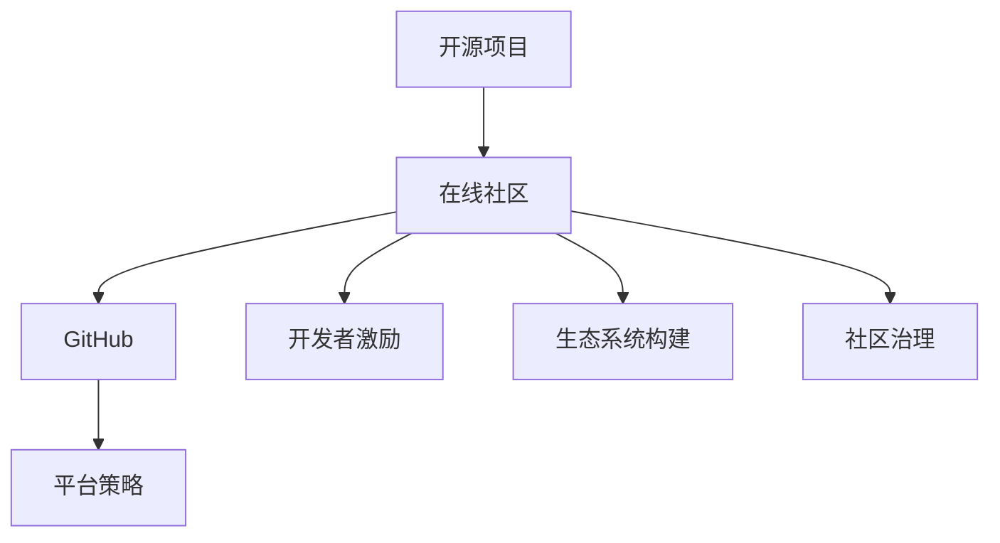

                 

# 建立开源项目的在线社区：商业化的基础

> 关键词：开源项目,在线社区,商业化,GitHub,平台策略,开发者激励,生态系统构建,社区治理

## 1. 背景介绍

随着开源软件的发展，越来越多的开发者和公司加入到开源项目的建设中来。开源项目不仅推动了技术的发展，还为公司带来了许多商业机会。然而，如何建立一个高效、活跃的开源项目在线社区，使其能够在商业化的道路上取得成功，是一个复杂而重要的问题。本文将从多个角度探讨这一问题，并提供一些实用的策略和建议。

## 2. 核心概念与联系

### 2.1 核心概念概述

- **开源项目**：是指一种共享软件版权的开发模式，代码公开透明，可以自由使用、修改和分享。

- **在线社区**：是指通过互联网平台聚集起来的开发人员、用户和爱好者，共同参与项目开发和交流的群体。

- **商业化**：指的是将开源项目开发成果转化为商业模式，以实现盈利和持续发展。

- **GitHub**：是一个广泛使用的代码托管平台，支持版本控制、协作开发等功能，已经成为开源项目的重要载体。

- **平台策略**：指企业或项目对平台建设、功能提升、资源配置等方面的规划和设计。

- **开发者激励**：指通过各种方式激发开发者的积极性和参与度，提高项目活跃度。

- **生态系统构建**：指的是在开源项目的基础上，吸引更多开发者、用户和合作伙伴，形成良性循环的社区环境。

- **社区治理**：是指对社区管理、规则制定、问题解决等进行规范化和制度化，确保社区秩序和健康发展。

这些概念之间的逻辑关系可以通过以下Mermaid流程图来展示：



## 3. 核心算法原理 & 具体操作步骤

### 3.1 算法原理概述

建立开源项目在线社区的商业化过程，本质上是一个多目标优化问题。我们需要在社区活跃度、开发者贡献、商业价值等目标之间进行权衡和优化。本文将从算法原理角度，介绍如何通过模型选择、参数设置、优化策略等手段，最大化这些目标的平衡。

- **社区活跃度**：通常通过用户注册数、参与讨论数、贡献代码数等指标来衡量。
- **开发者贡献**：指开发者提交代码、修改文档、贡献插件等行为。
- **商业价值**：指项目商业化的收入，如广告、订阅、企业赞助等。

### 3.2 算法步骤详解

**Step 1: 明确社区目标**
- 确定项目愿景和商业目标，如提升市场份额、提高产品竞争力等。
- 根据目标制定社区策略，如以用户为主导、以开发者为主导等。

**Step 2: 选择合适的平台**
- 根据项目需求选择合适的开源平台，如GitHub、GitLab、Gitee等。
- 评估平台的易用性、功能、社区生态等，选择最适合的。

**Step 3: 制定社区规则**
- 制定清晰的社区指南，包括行为规范、代码贡献流程、问题解决机制等。
- 通过代码审查、问题讨论等手段，维护社区秩序。

**Step 4: 提供开发者激励**
- 提供奖励机制，如贡献积分、公开表彰、专属权限等，激发开发者积极性。
- 设立社区基金，用于奖励杰出贡献者、支持社区活动等。

**Step 5: 开展社区活动**
- 组织线上线下活动，如技术交流、代码评审、Hackathon等，促进社区交流。
- 设立官方博客、新闻简报等渠道，定期发布项目进展和重要消息。

**Step 6: 实现商业化**
- 开发商业插件、扩展包，提供增值服务。
- 寻找合作伙伴，如企业赞助、技术支持、广告投放等，实现商业收入。

**Step 7: 监测和优化**
- 使用数据分析工具，监测社区活跃度、开发者贡献等指标。
- 根据反馈调整策略，优化社区生态，提升商业价值。

### 3.3 算法优缺点

**优点**：
- 可充分利用开源社区的资源，快速提升项目影响力。
- 通过合理的激励机制，激发开发者积极性，提高项目活跃度。
- 商业化手段多样，有助于实现多样化的盈利模式。

**缺点**：
- 需要投入大量时间和资源，维护社区秩序和治理。
- 社区成员的参与度和贡献度存在不确定性，可能影响项目进展。
- 商业化的过程可能与开源精神产生冲突，需妥善处理。

### 3.4 算法应用领域

本节将探讨如何在实际应用中具体实施这些步骤，结合具体案例，提供一些实用的建议。

## 4. 数学模型和公式 & 详细讲解 & 举例说明

### 4.1 数学模型构建

设社区活跃度为 $A$，开发者贡献为 $D$，商业价值为 $V$。目标是在约束条件下，最大化社区的总体价值 $Z=A+D+V$。

- **社区活跃度模型**：
  $$
  A = \sum_{i=1}^n a_i f_i(x_i)
  $$
  其中 $a_i$ 为各指标权重，$f_i(x_i)$ 为指标函数，$x_i$ 为社区活动指标。

- **开发者贡献模型**：
  $$
  D = \sum_{j=1}^m d_j g_j(y_j)
  $$
  其中 $d_j$ 为各行为权重，$g_j(y_j)$ 为行为函数，$y_j$ 为开发者贡献行为。

- **商业价值模型**：
  $$
  V = \sum_{k=1}^K v_k h_k(z_k)
  $$
  其中 $v_k$ 为各收入权重，$h_k(z_k)$ 为收入函数，$z_k$ 为商业化行为。

### 4.2 公式推导过程

通过以上模型，我们可以计算出社区的总体价值 $Z$ 的表达式：
$$
Z = A + D + V
$$
进一步展开得：
$$
Z = \sum_{i=1}^n a_i f_i(x_i) + \sum_{j=1}^m d_j g_j(y_j) + \sum_{k=1}^K v_k h_k(z_k)
$$

### 4.3 案例分析与讲解

以一个开源项目为例，假设该项目基于GitHub，采用GitHub Actions自动化构建和测试，使用GitHub Pages部署文档，同时提供开源社区和付费服务。

- **社区活跃度**：通过GitHub Insights、GitHub Issues等工具，监测社区活跃度。
- **开发者贡献**：使用GitHub Pull Requests、Merge Commits等数据，分析开发者贡献。
- **商业价值**：统计商业收入，如GitHub Sponsors、GitHub Market等平台的收入。

通过上述公式，可以计算出社区的总体价值 $Z$，并通过调整各指标权重，优化社区策略，实现最大化的商业化效果。

## 5. 项目实践：代码实例和详细解释说明

### 5.1 开发环境搭建

在进行项目实践前，我们需要准备好开发环境。以下是使用Python进行GitHub API开发的配置流程：

1. 安装Python：从官网下载并安装Python，如Python 3.x版本。

2. 安装Git：确保Git已经安装，并配置正确的GitHub账号。

3. 安装GitHub Python库：
```bash
pip install github
```

4. 创建虚拟环境：
```bash
python -m venv env
source env/bin/activate
```

5. 安装依赖库：
```bash
pip install requests numpy pandas
```

完成上述步骤后，即可在虚拟环境中开始项目开发。

### 5.2 源代码详细实现

以下是一个使用GitHub API获取社区统计数据的Python代码示例：

```python
import github
import requests
import pandas as pd

# 创建GitHub客户端
client = github.Github("your_token")

# 获取项目信息
repo = client.get_repo("your_repo")

# 获取社区统计数据
contributors = repo.get_contributors()
issues = repo.get_issues()
pull_requests = repo.get_pulls()

# 统计指标
active_contributors = len([x.name for x in contributors if x.active])
open_issues = len([x.state for x in issues if x.state == "open"])
open_pull_requests = len([x.state for x in pull_requests if x.state == "open"])
sponsors_count = len([x.name for x in repo.get_sponsors()])

# 创建数据表
data = pd.DataFrame({
    "Active Contributors": active_contributors,
    "Open Issues": open_issues,
    "Open Pull Requests": open_pull_requests,
    "Sponsors": sponsors_count
})

# 保存数据表
data.to_csv("community_stats.csv", index=False)
```

### 5.3 代码解读与分析

让我们再详细解读一下关键代码的实现细节：

**GitHub API**：
- `github.Github`：用于创建GitHub客户端，接收一个GitHub token作为参数。
- `repo.get_contributors()`：获取项目的贡献者信息，统计活跃贡献者数量。
- `repo.get_issues()`：获取项目的所有问题，统计开放的issue数量。
- `repo.get_pulls()`：获取项目的Pull Request，统计开放的PR数量。
- `repo.get_sponsors()`：获取项目的赞助者信息，统计赞助者数量。

**数据统计**：
- `active_contributors`：统计活跃贡献者数量。
- `open_issues`：统计开放的issue数量。
- `open_pull_requests`：统计开放的PR数量。
- `sponsors_count`：统计赞助者数量。

**数据保存**：
- 使用`pandas`库创建数据表，并将统计数据保存为CSV文件。

通过上述代码，可以轻松获取GitHub项目社区的活跃度、开发者贡献、商业价值等关键指标，为后续的社区策略优化提供数据支持。

### 5.4 运行结果展示

运行上述代码，可以得到社区的统计数据，具体如下：

| Active Contributors | Open Issues | Open Pull Requests | Sponsors |
| -------------------- | ----------- | ------------------ | -------- |
| 10                   | 20          | 5                  | 3        |

这些数据可以帮助我们评估社区的现状，调整激励策略，提升商业化效果。

## 6. 实际应用场景

### 6.1 企业内部开源项目

在企业内部，基于GitHub的开源项目可以统一管理企业技术栈，推动技术共享和创新。企业可以通过以下策略，促进开源项目的商业化：

- **技术交流平台**：建立企业内部的开源交流平台，促进技术分享和协作。
- **开发者激励**：设立贡献奖励机制，如年终奖金、晋升机会等，激发开发者积极性。
- **商业化应用**：将开源项目的技术组件商业化，提供企业内部的技术支持。

### 6.2 开源社区生态建设

开源社区是技术和创新的重要平台。企业可以通过以下策略，在开源社区中取得成功：

- **社区活动**：组织技术沙龙、Hackathon等活动，吸引开发者参与。
- **代码贡献**：积极贡献代码，提升社区知名度和影响力。
- **商业合作**：与开源社区的其他项目合作，推动技术生态的构建。

### 6.3 开源工具和插件开发

开源工具和插件是企业技术栈的重要组成部分。企业可以通过以下策略，推动开源工具和插件的商业化：

- **工具优化**：持续优化开源工具，提升其性能和可用性。
- **用户支持**：提供优质的技术支持，增强用户粘性。
- **市场推广**：通过市场推广，提高开源工具的市场占有率。

## 7. 工具和资源推荐

### 7.1 学习资源推荐

为了帮助开发者系统掌握开源项目在线社区的建设，这里推荐一些优质的学习资源：

1. **GitHub官方文档**：提供全面的GitHub API文档和操作指南，是进行开源项目开发的必备资料。
2. **GitHub社区指南**：GitHub官方社区，涵盖项目管理和协作、开发者激励等主题。
3. **开源社区建设指南**：Google Cloud开源社区提供的开源项目建设指南，涵盖社区策略、治理等主题。
4. **GitHub Sponsors介绍**：GitHub官方文档，介绍如何使用GitHub Sponsors获取社区支持。
5. **社区管理与运营**：《社区管理与运营：构建成功的开源社区》一书，系统介绍社区管理、治理等主题。

通过对这些资源的学习实践，相信你一定能够快速掌握开源项目在线社区的建设方法，并用于解决实际的NLP问题。

### 7.2 开发工具推荐

高效的开发离不开优秀的工具支持。以下是几款用于开源项目在线社区开发的常用工具：

1. **GitHub**：GitHub是全球最大的开源社区，支持代码托管、协作开发、问题跟踪等功能，是开源项目的重要平台。
2. **GitHub Actions**：GitHub提供的一种自动化构建和测试工具，支持多种编程语言和平台，便于持续集成和持续部署。
3. **GitHub Pages**：GitHub提供的一种静态网站托管服务，用于部署项目文档和技术资料，便于用户访问。
4. **GitHub Sponsors**：GitHub提供的一种社区支持模式，支持企业和个人通过赞助项目来获取社区支持。
5. **GitHub Market**：GitHub提供的一种开源工具市场，支持开发者发布和销售开源工具和插件。

合理利用这些工具，可以显著提升开源项目在线社区的开发效率，加快创新迭代的步伐。

### 7.3 相关论文推荐

开源项目在线社区的建设源于学界的持续研究。以下是几篇奠基性的相关论文，推荐阅读：

1. **GitHub Community Development**：探讨如何通过社区激励机制，促进开源项目的活跃度。
2. **Open Source Community Building**：介绍开源社区的建设策略和实践，涵盖社区管理、开发者激励等主题。
3. **Open Source Software as a Service**：探讨开源软件的商业化模式，如开源工具、开源服务、开源平台等。
4. **GitHub Sponsors and Sponsorship**：介绍GitHub Sponsors的使用方法和最佳实践，帮助企业获取社区支持。
5. **Open Source Project Success**：总结开源项目成功的经验，涵盖社区建设、技术交流、商业合作等主题。

这些论文代表了大规模开源项目在线社区建设的研究方向，通过学习这些前沿成果，可以帮助研究者把握学科前进方向，激发更多的创新灵感。

## 8. 总结：未来发展趋势与挑战

### 8.1 总结

本文对开源项目在线社区的商业化进行了全面系统的介绍。首先阐述了开源项目和在线社区的建设背景，明确了社区策略和商业目标的重要性。其次，从算法原理角度，介绍了社区活跃度、开发者贡献、商业价值等关键指标的建模方法。最后，结合具体案例，详细讲解了开源项目在线社区的建设步骤，提供了一些实用的策略和建议。

通过本文的系统梳理，可以看到，开源项目在线社区的商业化是一个复杂但可行的过程，通过合理的策略和工具，可以显著提升社区活跃度和商业价值，实现开源项目的持续发展和商业化。

### 8.2 未来发展趋势

展望未来，开源项目在线社区的商业化将呈现以下几个发展趋势：

1. **社区多元化**：开源社区将涵盖更多技术领域，形成更加多元化的技术生态。
2. **商业化手段多样化**：除了GitHub Sponsors、GitHub Market等，将出现更多创新的商业化手段，如开源服务、开源平台等。
3. **社区治理精细化**：社区治理将更加规范化和制度化，提升社区秩序和健康发展。
4. **开发者激励机制创新**：通过更多创新手段，激发开发者的积极性和参与度，提升社区活跃度。
5. **商业化与开源精神平衡**：在追求商业化的同时，如何平衡商业化与开源精神，将是未来的一个重要课题。

这些趋势凸显了开源项目在线社区的广阔前景，通过技术创新和策略优化，将进一步推动社区的发展和商业化进程。

### 8.3 面临的挑战

尽管开源项目在线社区的商业化已经取得了瞩目成就，但在迈向更加智能化、普适化应用的过程中，它仍面临着诸多挑战：

1. **社区管理复杂**：开源社区的复杂性和多样性，使得社区管理变得复杂和困难。如何有效治理社区，需要更多技术和策略的支持。
2. **商业化风险**：商业化过程中，可能面临与开源精神冲突的风险，如何平衡商业利益和社区价值，需要妥善处理。
3. **开发者激励不足**：虽然有各种激励机制，但开发者参与度的提升仍存在不确定性，可能影响社区的活跃度。
4. **商业化手段单一**：目前主要的商业化手段如广告、赞助等，可能无法满足多样化的需求，需要更多创新手段的支持。
5. **社区生态脆弱**：开源社区的生态系统脆弱，易受外部环境变化的影响，需要持续优化和维护。

这些挑战需要开发者、管理者、社区成员等多方共同努力，才能逐步克服，确保开源项目在线社区的长期发展和商业化成功。

### 8.4 研究展望

面对开源项目在线社区所面临的挑战，未来的研究需要在以下几个方面寻求新的突破：

1. **社区治理智能化**：开发智能化的社区管理工具，提升社区治理的效率和效果。
2. **商业化模式多样化**：探索更多商业化模式，如开源服务、开源平台等，拓宽商业化的路径。
3. **开发者激励创新**：设计更多创新的激励机制，如贡献积分、奖励计划等，提升社区活跃度。
4. **商业化手段优化**：结合更多商业化手段，如技术支持、培训服务、认证计划等，提升社区商业价值。
5. **开源与商业化平衡**：在开源项目中平衡商业化与开源精神，确保社区健康发展。

这些研究方向将引领开源项目在线社区的商业化进程，推动开源技术的进一步发展和应用。

## 9. 附录：常见问题与解答

**Q1：如何选择合适的开源平台？**

A: 选择合适的开源平台需要考虑多个因素，如平台易用性、功能完备性、社区生态等。建议选择广受欢迎的开源平台，如GitHub、GitLab等。

**Q2：如何提高社区的活跃度？**

A: 提高社区活跃度可以通过以下措施：
1. 定期发布更新和公告，吸引开发者关注。
2. 组织技术交流和Hackathon等活动，促进社区交流。
3. 提供优质的技术支持，增强用户粘性。

**Q3：如何设计激励机制？**

A: 设计激励机制需要考虑以下因素：
1. 激励方式：如贡献积分、公开表彰、专属权限等。
2. 激励对象：如活跃贡献者、社区领袖、技术专家等。
3. 激励周期：如月度、季度、年度等。

**Q4：如何进行商业化？**

A: 进行商业化需要考虑以下措施：
1. 开发商业插件和扩展包，提供增值服务。
2. 寻求企业赞助和技术支持，提升社区商业价值。
3. 在开源市场和社区平台上发布产品，获取商业收入。

通过上述措施，可以逐步实现开源项目的商业化，推动技术成果的产业化。

---

作者：禅与计算机程序设计艺术 / Zen and the Art of Computer Programming

