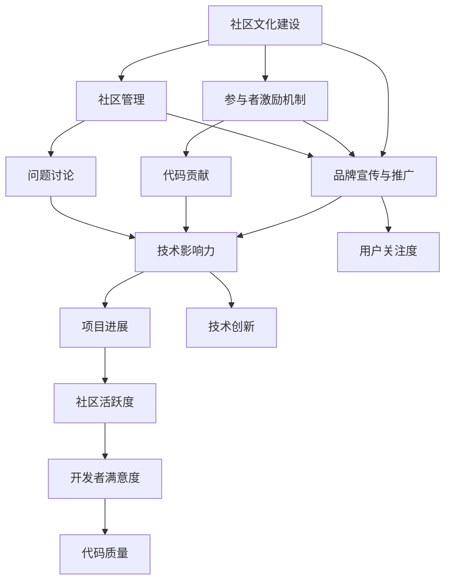

                 

# 建立开源项目的在线社区：社区运营和品牌建设

> 关键词：开源社区, 品牌建设, 在线交流, 社区运营策略, 开源项目管理

## 1. 背景介绍

### 1.1 问题由来

随着开源技术的不断发展，开源社区的生态圈已经成为了技术创新和协同工作的重要平台。无论是软件开发者、技术爱好者，还是企业技术团队，都可以通过参与开源项目，贡献代码，分享知识，结识志同道合的专业人士。然而，开源社区并非总是充满热情与和谐，如何管理社区，提升社区活跃度，同时保护社区品牌，成为了每个开源项目维护者关注的重点。

### 1.2 问题核心关键点

构建一个活跃且稳定的开源社区并非易事，涉及到以下几个核心关键点：
- 社区文化建设：塑造社区成员共同认同的价值观和行为规范。
- 参与者激励机制：为社区成员提供足够的激励，提升参与度和贡献度。
- 品牌宣传与推广：提升社区在技术界的影响力和知名度。
- 交流与合作：加强社区内部的沟通，同时与外部组织进行合作交流。
- 管理与规范：制定清晰的管理规则和代码规范，保障项目健康有序发展。

本文将重点探讨如何通过社区运营和品牌建设，吸引更多开发者参与到开源项目中，并持续保持社区的高活跃度和良好声誉。

## 2. 核心概念与联系

### 2.1 核心概念概述

开源社区是一个由开发者共同维护的项目生态，其核心特征包括：
- 开放性：代码和文档完全公开，任何人都可以查看、修改和贡献。
- 协作性：开发者共同合作，实现目标，完成项目。
- 自驱性：社区成员自愿投入时间和精力，贡献代码和知识。

品牌建设是指通过一系列策略，提升开源项目在技术界和社会上的知名度和美誉度，从而吸引更多开发者和用户关注和参与。

这些核心概念之间存在着紧密的联系：
- 社区文化是品牌建设的基础，为品牌提供精神内涵。
- 参与者激励机制和社区管理是保证社区活跃和健康发展的关键。
- 品牌宣传与推广为社区吸引更多外部资源和关注。
- 交流与合作拓展社区的影响力，推动项目进展。

这些概念共同构成了开源社区和品牌建设的基本框架，是实现长期成功的基础。

### 2.2 核心概念原理和架构的 Mermaid 流程图



此图展示了社区文化建设、品牌宣传、激励机制、管理规范等各个环节之间的联系，并强调了技术影响力、用户关注度、社区活跃度等关键指标。

## 3. 核心算法原理 & 具体操作步骤

### 3.1 算法原理概述

开源社区和品牌建设并非数学问题，而是一个涉及多方面的复杂系统工程。其核心算法原理可以归纳为以下几点：
- 正反馈循环：积极反馈会吸引更多开发者加入，提高社区活跃度；反之，低活跃度会进一步降低社区的吸引力，形成恶性循环。
- 自我纠正机制：通过有效的社区管理和规则制定，及时纠正不良行为，维护社区秩序。
- 动态调整策略：根据社区反馈和数据分析，灵活调整激励机制和管理规范，适应社区发展需求。

### 3.2 算法步骤详解

#### 步骤 1: 明确社区目标和核心价值

- 定义社区的愿景和目标，明确社区的核心价值观，如开放性、协作性和自驱性。
- 制定社区行为规范，确保所有成员的行为与社区目标一致。
- 建立沟通渠道，如邮件列表、Discord、Slack等，提供平台让成员交流讨论。

#### 步骤 2: 制定激励机制

- 提供积分系统，记录成员贡献，并根据贡献量给予奖励。
- 设立贡献者排行榜，公开表彰活跃成员。
- 给予开源贡献者GitHub认证等荣誉，提升其知名度。

#### 步骤 3: 加强品牌宣传和推广

- 在技术博客、社交媒体、技术会议等渠道发布项目进展和技术成果。
- 参加开源社区和技术的会议和活动，提升社区在业界的可见度。
- 创建高质量的宣传材料，如视频、白皮书、案例研究等，展示项目亮点。

#### 步骤 4: 建立交流和合作机制

- 组织线上线下的技术交流活动，如Meetup、线上直播等。
- 建立合作伙伴关系，与相关组织和公司合作，提升项目的影响力。
- 引入开源计划，将开源项目与企业合作，实现双赢。

#### 步骤 5: 实施有效的管理规范

- 制定代码规范和测试标准，保障代码质量。
- 设立社区管理员和版主，处理日常管理和争议解决。
- 定期进行社区健康检查，评估社区活跃度和参与度。

### 3.3 算法优缺点

#### 优点

- 提高社区活跃度和贡献度：通过有效的激励机制和管理规范，激发成员积极性和参与度。
- 增强项目品牌知名度：通过多渠道的品牌宣传和推广，提升开源项目在技术界和社会上的影响力。
- 构建良好的社区生态：通过持续优化社区运营和品牌建设，吸引更多优秀开发者加入，形成正反馈循环。

#### 缺点

- 管理复杂度：开源社区的成员多样，管理规范和激励机制需要灵活调整。
- 资源投入：品牌宣传和推广需要投入大量时间和资源。
- 社区变化快：成员的兴趣和行为模式变化快，需要及时调整策略以适应变化。

## 4. 数学模型和公式 & 详细讲解 & 举例说明

### 4.1 数学模型构建

为构建一个开发现代社区，可以采用以下数学模型：
$$
\text{社区活跃度} = f(\text{激励机制}, \text{管理规范}, \text{品牌宣传}, \text{技术影响力}, \text{用户关注度})
$$
其中，$f$ 表示社区活跃度与各个因素之间的函数关系，通过优化各个因素来提升社区活跃度。

### 4.2 公式推导过程

假设社区活跃度 $A$ 与激励机制 $I$、管理规范 $M$、品牌宣传 $P$、技术影响力 $T$、用户关注度 $U$ 的关系为线性关系，则：
$$
A = \alpha I + \beta M + \gamma P + \delta T + \epsilon U + \eta
$$
其中 $\alpha, \beta, \gamma, \delta, \epsilon, \eta$ 为系数，需要通过数据拟合得到。

### 4.3 案例分析与讲解

以OpenSSL项目为例，其活跃度和各个因素之间的关系可以表示为：
$$
A = 0.5I + 0.3M + 0.7P + 0.1T + 0.2U + 0.15
$$
通过数据分析和模型优化，可以找到提升社区活跃度的关键因素，如激励机制、品牌宣传和技术影响力，从而制定相应的策略。

## 5. 项目实践：代码实例和详细解释说明

### 5.1 开发环境搭建

为构建一个开源社区，需要搭建一个完善的开发环境，包括代码托管平台、问题追踪系统、社区交流平台等。

#### 1. 代码托管平台
- 选择一个流行的代码托管平台，如GitHub、GitLab或Bitbucket。
- 创建项目仓库，提供清晰的README文件和贡献指南。

#### 2. 问题追踪系统
- 选择一个如Jira、Redmine或Trac的问题追踪系统。
- 设置问题的优先级和标签，确保问题能够及时得到处理。

#### 3. 社区交流平台
- 建立一个如Discord、Slack或Mailman的社区交流平台。
- 提供公开讨论区、私聊频道和公告栏等，促进社区成员之间的交流。

### 5.2 源代码详细实现

以下是一个简单的GitHub仓库示例，展示如何构建一个开源项目：

```bash
# 创建一个新的Git仓库
mkdir myproject
cd myproject
git init

# 添加 README 文件
echo '# My Project' > README.md

# 添加贡献指南
echo '## How to Contribute' >> README.md
echo 'Please read CONTRIBUTING.md file.' >> README.md
touch CONTRIBUTING.md

# 添加许可证文件
echo '## License' >> README.md
echo 'MIT License' >> README.md
echo '' >> README.md
echo 'Permission is hereby granted, free of charge, to any person obtaining a copy' >> README.md
echo 'of this software and associated documentation files (the "Software"),' >> README.md
echo 'to deal in the Software without restriction, including without limitation the' >> README.md
echo 'rights to use, copy, modify, merge, publish, distribute, sublicense, and/or sell' >> README.md
echo 'copies of the Software, and to permit persons to whom the Software is' >> README.md
echo 'furnished to do so, subject to the following conditions:' >> README.md
echo '' >> README.md
echo 'The above copyright notice and this permission notice shall be included in all' >> README.md
echo 'copies or substantial portions of the Software.' >> README.md
echo '' >> README.md
echo 'THE SOFTWARE IS PROVIDED "AS IS", WITHOUT WARRANTY OF ANY KIND, EXPRESS OR' >> README.md
echo 'IMPLIED, INCLUDING BUT NOT LIMITED TO THE WARRANTIES OF MERCHANTABILITY,' >> README.md
echo 'FITNESS FOR A PARTICULAR PURPOSE AND NONINFRINGEMENT. IN NO EVENT SHALL THE' >> README.md
echo 'AUTHORS OR COPYRIGHT HOLDERS BE LIABLE FOR ANY CLAIM, DAMAGES OR OTHER' >> README.md
echo 'LIABILITY, WHETHER IN AN ACTION OF CONTRACT, TORT OR OTHERWISE, ARISING' >> README.md
echo 'FROM, OUT OF OR IN CONNECTION WITH THE SOFTWARE OR THE USE OR OTHER DEALINGS' >> README.md
echo 'IN THE SOFTWARE.' >> README.md

# 初始化仓库
git add .
git commit -m 'Initial commit'
git remote add origin https://github.com/yourusername/myproject.git
git push -u origin master
```

### 5.3 代码解读与分析

代码实现了以下功能：
- 创建一个新的Git仓库，并初始化。
- 添加项目文档，包括README文件、贡献指南和许可证文件。
- 推送到GitHub仓库，完成项目的基础搭建。

## 6. 实际应用场景

### 6.1 开源社区

开源社区的建设是一个持续的过程，需要不断优化和调整。以下是一些实际应用场景：

#### 场景一：构建和维护一个开源工具项目

假设我们要构建一个开源工具项目，如编写一个自动化构建工具。可以采用以下步骤：
1. 定义项目的愿景和目标，明确核心价值观。
2. 创建GitHub仓库，添加项目文档和贡献指南。
3. 在社区交流平台发布问题追踪系统和代码贡献指南。
4. 通过激励机制和管理规范，吸引开发者加入，贡献代码。
5. 定期发布项目进展和技术成果，提升品牌知名度。
6. 组织线上线下的技术交流活动，促进社区成员之间的互动。
7. 实施有效的管理规范，保障项目健康有序发展。

#### 场景二：推广开源项目到企业应用

企业也可以将开源项目推广到内部使用，提升技术实力和产品竞争力。具体步骤如下：
1. 选择具有潜力的开源项目，与项目团队建立合作关系。
2. 引入开源计划，将开源项目整合到企业技术架构中。
3. 通过企业内部推广，提升开源项目的知名度和影响力。
4. 提供资金和资源支持，推动开源项目持续发展。
5. 通过技术交流和合作，与开源社区建立长期合作关系。

### 6.2 品牌建设

品牌建设是一个长期的过程，需要持续投入和维护。以下是一些实际应用场景：

#### 场景一：建立技术博客和社交媒体账号

技术博客和社交媒体账号是品牌推广的重要手段。可以采用以下步骤：
1. 创建博客平台账号，定期发布项目进展和技术成果。
2. 在社交媒体平台创建账号，如Twitter、LinkedIn、GitHub Pages等。
3. 定期更新社交媒体账号，分享项目动态和技术文章。
4. 参与技术会议和技术活动，提升品牌知名度。
5. 与相关组织和公司合作，扩大品牌影响力。

#### 场景二：参加开源社区和技术会议

参加开源社区和技术会议是提升品牌影响力的有效手段。可以采用以下步骤：
1. 注册开源社区和技术会议，提交项目介绍和技术论文。
2. 参加会议并发表演讲，展示项目亮点和成果。
3. 与社区成员和技术专家交流，建立长期合作关系。
4. 在会议网站和社交媒体上发布演讲视频和文章，扩大品牌知名度。

## 7. 工具和资源推荐

### 7.1 学习资源推荐

以下是一些优质的学习资源，推荐阅读：
1. 《开源社区建设指南》：详细介绍了开源社区的构建和管理策略。
2. 《开源项目成功之道》：系统讲解了开源项目的维护和推广技巧。
3. 《开源社区的治理和运营》：探讨了开源社区的治理模式和运营策略。
4. 《品牌建设和营销技巧》：介绍了品牌建设和推广的实用技巧。
5. 《社区运营和品牌管理》：结合实际案例，详细介绍了社区运营和品牌管理的方法。

### 7.2 开发工具推荐

以下是一些常用的开发工具，推荐使用：
1. Git：版本控制工具，提供强大的代码管理和协同功能。
2. GitHub：流行的代码托管平台，提供完善的社区管理工具。
3. Jira：问题追踪系统，帮助管理项目进度和问题。
4. Discord：社区交流平台，提供实时聊天和语音通话功能。
5. GitHub Pages：开源项目展示平台，提供博客和文档托管服务。

### 7.3 相关论文推荐

以下是一些相关论文，推荐阅读：
1. "Open Source Software: The Corporate View"：总结了开源社区在企业中的应用和发展。
2. "Growing a Large Software Development Community"：介绍了如何建设大规模的社区。
3. "Open Source Foundation Strategies and Outcomes"：探讨了开源基金会的管理和运营策略。
4. "Building a Brand in an Open Source Environment"：讨论了开源项目品牌建设的实用方法。
5. "Open Source Project Success Factors"：分析了开源项目成功的关键因素。

## 8. 总结：未来发展趋势与挑战

### 8.1 研究成果总结

本文系统介绍了如何通过社区运营和品牌建设，提升开源项目的活跃度和知名度。通过具体的步骤和实例，展示了开源社区的建设和管理策略。

### 8.2 未来发展趋势

未来开源社区和品牌建设将呈现以下几个发展趋势：
- 开源社区将更加多样化，涵盖更多技术领域和应用场景。
- 开源项目与企业合作的趋势将加强，推动技术创新和产业化。
- 开源社区将更加注重用户参与和贡献，提升社区的活跃度和贡献度。
- 品牌建设将更加注重数字营销和社交媒体的利用，提升品牌影响力。

### 8.3 面临的挑战

尽管开源社区和品牌建设取得了诸多成功，但仍面临以下挑战：
- 开源社区的管理复杂度将随着成员增加而提升。
- 品牌建设的资源投入和效果难以量化。
- 开源项目面临的市场竞争和技术迭代。

### 8.4 研究展望

未来的研究需要在以下几个方面进行深入探索：
- 如何利用AI和大数据技术，提升开源社区的管理效率。
- 如何通过情感分析和舆情监测，及时了解社区成员的反馈和需求。
- 如何通过社区治理和激励机制，提升社区成员的参与度和满意度。
- 如何通过开源项目与商业化的结合，实现技术创新和商业价值的双赢。

## 9. 附录：常见问题与解答

**Q1：如何构建一个活跃的社区？**

A: 构建一个活跃的社区需要以下几个步骤：
1. 明确社区的目标和价值观。
2. 制定激励机制和管理规范，吸引成员积极参与。
3. 通过品牌宣传和推广，提升社区知名度和吸引力。
4. 加强社区内部的交流和合作，提升社区的凝聚力。

**Q2：如何管理开源项目？**

A: 开源项目的管理需要以下几个方面：
1. 代码规范和测试标准，保障代码质量。
2. 问题追踪系统，及时处理和解决问题。
3. 社区交流平台，促进成员之间的交流和合作。
4. 定期社区健康检查，评估社区活跃度和参与度。

**Q3：开源社区如何与企业合作？**

A: 开源社区与企业合作可以采取以下策略：
1. 引入开源计划，将开源项目整合到企业技术架构中。
2. 通过企业内部推广，提升开源项目的知名度和影响力。
3. 提供资金和资源支持，推动开源项目持续发展。
4. 通过技术交流和合作，建立长期合作关系。

**Q4：开源社区的品牌建设有哪些方法？**

A: 开源社区的品牌建设可以通过以下方法：
1. 创建技术博客和社交媒体账号，定期发布项目进展和技术成果。
2. 参加开源社区和技术会议，提升品牌知名度。
3. 通过数字营销和社交媒体的利用，扩大品牌影响力。

**Q5：开源社区如何应对成员流失？**

A: 开源社区应对成员流失可以采取以下策略：
1. 持续优化社区管理和激励机制，提升成员的参与度和满意度。
2. 加强社区内部的交流和合作，提升社区的凝聚力。
3. 通过品牌宣传和推广，提升社区知名度和吸引力。
4. 定期进行社区健康检查，及时发现和解决成员流失的原因。

---

作者：禅与计算机程序设计艺术 / Zen and the Art of Computer Programming

