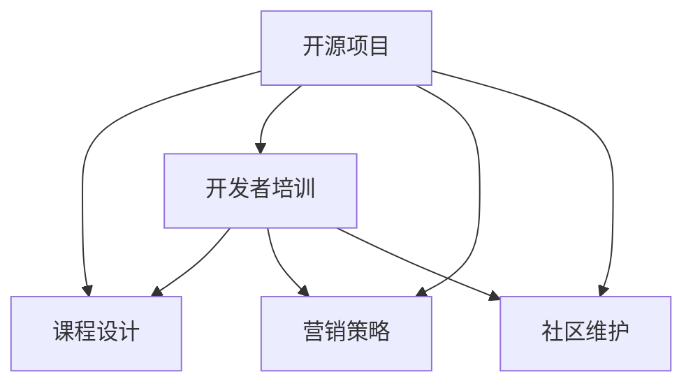

                 

# 建立开源项目的培训课程：从设计到营销

> 关键词：开源项目, 课程设计, 开发者培训, 营销策略, 社区维护

## 1. 背景介绍

随着开源软件和协作开发模式的日益流行，越来越多的企业和组织开始通过开源项目来推动技术创新和社区建设。开源项目不仅是技术的展示平台，也是构建开发者社区、推动软件生态发展的有效途径。然而，建立一个成功且受欢迎的开源项目绝非易事，它需要精心规划和系统设计。本博客将通过一系列深入分析，探讨如何设计、实施和推广一个开源项目。

## 2. 核心概念与联系

### 2.1 核心概念概述

- **开源项目**：指任何代码和设计都公开可访问的软件项目。通常，开源项目提供源代码，允许任何人查看、修改、分发代码，推动共同开发。

- **课程设计**：指在教育和培训过程中，针对特定目标群体和知识水平，设计出科学、有效的教学方案。这包括课程结构、教学内容、教学方法等。

- **开发者培训**：指通过培训课程、文档、示例等方式，帮助开发者掌握项目的技术栈、工作流程和最佳实践，提升开发者技能和项目贡献度。

- **营销策略**：指在推广开源项目时，通过各种手段（如社交媒体、博客、邮件等）提升项目知名度、吸引开发者参与，以及建立社区和生态系统。

- **社区维护**：指对开源项目的维护和发展，包括管理代码、文档、问题跟踪、社区互动等，确保项目的持续活跃和健康发展。

这些概念之间的联系可以通过以下Mermaid流程图来展示：



这个流程图展示了开源项目的建设过程：

1. 开源项目通过课程设计来培训开发者。
2. 培训提升开发者的贡献能力，通过营销策略吸引更多的开发者。
3. 社区维护确保项目持续活跃和发展，提升项目影响力。

## 3. 核心算法原理 & 具体操作步骤

### 3.1 算法原理概述

建立开源项目的设计与营销过程，本质上是多维度、动态迭代的过程。其核心算法原理包括以下几个方面：

- **需求分析**：明确项目的定位、目标和价值，以及所需的核心功能和特性。
- **课程设计**：根据需求分析，设计出适合不同层次开发者的课程体系和内容。
- **开发者培训**：通过课程设计实施培训，提升开发者技能，增加项目贡献度。
- **营销策略**：使用适当的营销手段，吸引更多开发者加入项目，形成社区效应。
- **社区维护**：持续管理和维护项目，鼓励社区成员活跃参与，保持项目活力。

### 3.2 算法步骤详解

#### 3.2.1 项目定位与目标设定

1. **项目定位**：
   - 定义项目的领域、功能和技术栈，明确项目的核心价值。
   - 考虑目标用户群体、市场需求和技术趋势，确保项目有明确的方向。

2. **目标设定**：
   - 设定具体、可衡量、可实现的目标，如功能开发进度、社区成员增长等。
   - 确定项目的里程碑和阶段性目标，确保项目进展顺利。

#### 3.2.2 课程设计

1. **课程结构设计**：
   - 根据项目的需求和目标，设计出课程的层次结构和内容布局。
   - 课程应包括基础知识、实践技能、高级技巧等不同层次的内容。

2. **教学内容制定**：
   - 根据目标受众的不同层次，制定相应的教学内容。
   - 包含编程语言、开发工具、框架、设计模式等方面的知识。

3. **教学方法选择**：
   - 选择合适的教学方法，如在线视频、文档教程、编程作业等。
   - 设计互动环节，鼓励开发者讨论和分享经验。

#### 3.2.3 开发者培训

1. **实施培训课程**：
   - 通过在线平台或线下活动，组织开发者参与培训。
   - 根据课程结构，系统讲解项目背景、技术栈、开发流程等。

2. **技能提升和项目实践**：
   - 提供实践机会，如代码审查、项目贡献等，帮助开发者提升技能。
   - 通过实际项目的参与，让开发者深入理解项目需求和开发流程。

#### 3.2.4 营销策略

1. **选择合适的营销渠道**：
   - 根据目标受众的分布，选择合适的营销渠道，如社交媒体、开发者社区、博客等。
   - 建立官方的社交媒体账号和博客，发布项目进展和技术文章。

2. **制定营销计划**：
   - 制定详细的营销计划，包括推广活动的时间表、目标和预算。
   - 考虑使用事件、研讨会、直播等形式，吸引开发者关注和参与。

#### 3.2.5 社区维护

1. **社区建设和管理**：
   - 建立项目的官方网站、GitHub页面等，方便开发者访问和使用。
   - 提供文档和指南，帮助开发者快速上手。

2. **问题跟踪与反馈**：
   - 使用问题跟踪工具（如GitHub Issues）管理开发者反馈和问题。
   - 及时响应开发者的问题和建议，提升项目的透明度和信任度。

3. **社区互动与激励**：
   - 定期举办社区活动，如线上讨论、线下聚会等。
   - 提供奖励机制，如徽章、贡献排名等，激励开发者积极参与。

### 3.3 算法优缺点

#### 3.3.1 优点

1. **广泛覆盖**：通过系统的培训和营销，能够覆盖更多开发者，提升项目的知名度和影响力。
2. **社区互动**：通过社区建设和维护，增强开发者之间的互动和协作，提升项目的活跃度。
3. **技术提升**：通过有针对性的培训，提升开发者的技术水平，促进项目质量的提升。
4. **持续发展**：通过持续的社区维护和反馈机制，确保项目能够持续活跃和创新。

#### 3.3.2 缺点

1. **资源投入**：设计、实施和维护开源项目需要大量的资源投入，包括人力、时间和资金等。
2. **复杂度提升**：随着项目的进展和扩展，管理和维护的复杂度会逐步增加。
3. **用户期望管理**：在推广和社区建设过程中，如何管理用户的期望和需求，是一个复杂的问题。

### 3.4 算法应用领域

开源项目的设计与营销方法，可以应用于各种技术和领域，如软件开发、数据科学、人工智能、硬件开发等。通过系统化的课程设计和有效的营销策略，可以提升项目的贡献度、社区活跃度和技术影响力。

## 4. 数学模型和公式 & 详细讲解 & 举例说明

### 4.1 数学模型构建

假设有一个开源项目 $P$，其目标为 $T$，定义需求为 $D$，课程设计为 $C$，营销策略为 $M$，社区维护为 $C_m$。则项目成功建立的过程可以建模为：

$$
P = T \cap D \cap C \cap M \cap C_m
$$

其中 $T$ 和 $D$ 是项目成功的必要条件，$C$、$M$ 和 $C_m$ 是成功的充分条件。

### 4.2 公式推导过程

- **项目定位公式**：
  $$
  T = \{项目定位明确，功能清晰\}
  $$
- **课程设计公式**：
  $$
  C = \{课程结构合理，内容科学，方法有效\}
  $$
- **营销策略公式**：
  $$
  M = \{渠道选择合适，计划详细，活动多样化\}
  $$
- **社区维护公式**：
  $$
  C_m = \{社区建设良好，互动活跃，反馈及时\}
  $$

### 4.3 案例分析与讲解

以Apache Kafka项目为例，分析其成功建立的过程。

- **项目定位**：开源分布式流处理平台。
- **课程设计**：
  - 课程结构：基础入门、高级应用、社区贡献等。
  - 教学内容：Kafka架构、编程接口、性能优化等。
  - 教学方法：在线视频、文档教程、编程作业等。
- **营销策略**：
  - 通过Twitter、GitHub等平台宣传和推广。
  - 定期发布技术文章和案例分析，吸引开发者关注。
- **社区维护**：
  - 建立官方网站和GitHub页面，提供文档和指南。
  - 使用GitHub Issues管理开发者反馈和问题。
  - 定期举办社区活动，如线上讨论、线下聚会等。

通过系统的课程设计和有效的营销策略，Kafka项目吸引了大量开发者参与，形成了强大的社区效应，推动了项目的持续发展。

## 5. 项目实践：代码实例和详细解释说明

### 5.1 开发环境搭建

#### 5.1.1 环境配置

- **操作系统**：
  - Linux：推荐Ubuntu 20.04及以上版本。
  - Windows：推荐Windows 10及以上版本。
  - MacOS：推荐macOS 10.14及以上版本。

- **编程语言**：
  - Python：版本3.8及以上。
  - Java：版本8及以上。

- **开发工具**：
  - IDE：如IntelliJ IDEA、Eclipse等。
  - Git：版本2.28及以上。
  - GitLab：版本13及以上。

### 5.2 源代码详细实现

#### 5.2.1 课程设计

假设项目名为 `MyProject`，首先需要定义课程结构和内容，这里以Java开发为例。

1. **课程结构设计**：
   - 基础入门：Java基础、开发工具、版本控制等。
   - 高级应用：设计模式、架构、性能优化等。
   - 社区贡献：社区规则、问题跟踪、版本发布等。

2. **教学内容制定**：
   - 基础入门：Java基础教程、Git入门、Maven配置等。
   - 高级应用：Spring Boot实战、MyBatis使用、性能调优等。
   - 社区贡献：GitHub使用、Issue管理、版本发布等。

3. **教学方法选择**：
   - 在线视频：录制教学视频，发布到YouTube、Bilibili等平台。
   - 文档教程：编写详细的教程，发布到GitHub Wiki和官方文档网站。
   - 编程作业：设计具体的编程作业，发布到GitHub Issue和GitLab CI中。

#### 5.2.2 开发者培训

1. **实施培训课程**：
   - 在线平台：创建学习账户，设置课程体系和进度。
   - 线下活动：组织开发者参与线下技术沙龙、黑客马拉松等活动。

2. **技能提升和项目实践**：
   - 代码审查：通过GitLab合并请求功能，让开发者参与代码审查。
   - 项目贡献：提供项目开发任务，鼓励开发者参与贡献。

### 5.3 代码解读与分析

#### 5.3.1 课程设计示例

```python
# 定义课程结构
class CourseStructure:
    def __init__(self):
        self.entries = []

    def add(self, entry):
        self.entries.append(entry)

    def list(self):
        for entry in self.entries:
            print(entry.name, entry.status)

# 定义课程内容
class CourseEntry:
    def __init__(self, name, status):
        self.name = name
        self.status = status

# 创建课程结构
course_structure = CourseStructure()
course_structure.add(CourseEntry("Java基础入门", "完成"))
course_structure.add(CourseEntry("Spring Boot实战", "进行中"))
course_structure.add(CourseEntry("社区贡献指南", "待发布"))

# 列出课程内容
course_structure.list()
```

#### 5.3.2 开发者培训示例

```python
# 定义培训课程
class TrainingCourse:
    def __init__(self, name, description):
        self.name = name
        self.description = description

    def enroll(self):
        print(f"开发者 {name} 已报名参加 {self.name} 课程。")

# 创建培训课程
course = TrainingCourse("Java基础入门", "该课程介绍Java基础和开发工具。")
course.enroll()
```

### 5.4 运行结果展示

#### 5.4.1 课程结构展示

```plaintext
Java基础入门  已完成
Spring Boot实战  进行中
社区贡献指南  待发布
```

#### 5.4.2 培训报名展示

```plaintext
开发者张三已报名参加Java基础入门课程。
```

## 6. 实际应用场景

### 6.1 智能制造

开源项目在智能制造领域有着广泛的应用。以工业物联网(IoT)为例，通过建立开源的IoT平台，可以实现设备间的数据共享和协同控制。以下是一个实际应用场景：

1. **项目定位**：开源工业物联网平台，支持设备间的通信和数据采集。
2. **课程设计**：
   - 基础入门：工业物联网基础、设备通信协议等。
   - 高级应用：数据采集与处理、设备协同控制等。
   - 社区贡献：问题跟踪、版本发布、用户文档等。
3. **营销策略**：
   - 通过IoT开发者社区推广，吸引设备制造商和开发者参与。
   - 发布技术文章和案例分析，提升项目的知名度和影响力。
4. **社区维护**：
   - 建立官方网站和GitHub页面，提供文档和指南。
   - 使用GitHub Issues管理开发者反馈和问题。
   - 定期举办社区活动，如线上讨论、线下聚会等。

### 6.2 数字农业

开源项目在数字农业领域也有着巨大的应用潜力。以智慧农场为例，通过建立开源的智慧农场平台，可以实现对农作物的精准监控和智能管理。以下是一个实际应用场景：

1. **项目定位**：开源智慧农场平台，支持农作物生长监控和智能管理。
2. **课程设计**：
   - 基础入门：智慧农场基础、传感器安装与配置等。
   - 高级应用：数据分析与处理、智能灌溉系统等。
   - 社区贡献：问题跟踪、版本发布、用户文档等。
3. **营销策略**：
   - 通过农业开发者社区推广，吸引农业科技公司和开发者参与。
   - 发布技术文章和案例分析，提升项目的知名度和影响力。
4. **社区维护**：
   - 建立官方网站和GitHub页面，提供文档和指南。
   - 使用GitHub Issues管理开发者反馈和问题。
   - 定期举办社区活动，如线上讨论、线下聚会等。

### 6.3 开放教育

开源项目在开放教育领域也有着广泛的应用。以在线教育平台为例，通过建立开源的在线教育平台，可以实现课程资源共享和在线互动。以下是一个实际应用场景：

1. **项目定位**：开源在线教育平台，支持课程资源共享和在线互动。
2. **课程设计**：
   - 基础入门：在线教育基础、课程设计和开发等。
   - 高级应用：课程资源共享、在线互动等。
   - 社区贡献：问题跟踪、版本发布、用户文档等。
3. **营销策略**：
   - 通过教育开发者社区推广，吸引教育机构和开发者参与。
   - 发布技术文章和案例分析，提升项目的知名度和影响力。
4. **社区维护**：
   - 建立官方网站和GitHub页面，提供文档和指南。
   - 使用GitHub Issues管理开发者反馈和问题。
   - 定期举办社区活动，如线上讨论、线下聚会等。

## 7. 工具和资源推荐

### 7.1 学习资源推荐

#### 7.1.1 官方文档和教程

- **GitHub**：官方GitHub文档和教程，提供详细的开源项目管理指南。
- **GitLab**：官方GitLab文档和教程，提供协作开发和版本控制的最佳实践。
- **GitHub Actions**：官方GitHub Actions文档和教程，提供持续集成和部署的自动化解决方案。

#### 7.1.2 在线学习平台

- **Coursera**：提供各类编程和开源项目管理课程，适合初学者和进阶开发者。
- **Udacity**：提供专业的开源项目管理和开发课程，涵盖Java、Python等多种编程语言。
- **edX**：提供各类计算机科学和软件开发课程，涵盖开源项目管理的基础知识和高级技能。

#### 7.1.3 书籍和手册

- **《The Art of the Kernel》**：Kerning反编译的经典书籍，涵盖内核开发和开源项目管理。
- **《Pro Git》**：Git版本控制系统的经典手册，适合开发者和项目管理者。
- **《Open Source Success Factor》**：开源项目管理最佳实践手册，提供开源项目的成功经验。

### 7.2 开发工具推荐

#### 7.2.1 IDE和代码编辑器

- **IntelliJ IDEA**：跨平台Java开发IDE，提供丰富的插件和集成工具。
- **Visual Studio Code**：跨平台代码编辑器，支持多种编程语言和版本控制工具。
- **Atom**：开源代码编辑器，提供可扩展的插件和定制化的功能。

#### 7.2.2 问题跟踪工具

- **Jira**：广泛使用的项目管理工具，支持敏捷开发和问题跟踪。
- **Trello**：简单易用的项目管理工具，适合小型团队和敏捷开发。
- **GitHub Issues**：开源项目的问题跟踪工具，提供详细的issue管理和评论功能。

#### 7.2.3 社区管理工具

- **Discord**：流行的社区交流工具，支持文本、语音、视频等多种沟通方式。
- **Slack**：企业级社区交流工具，提供丰富的集成插件和第三方应用。
- **Meetup**：组织和参与线下活动的工具，支持活动安排和参与管理。

### 7.3 相关论文推荐

#### 7.3.1 开源项目管理

- **《Effective Open Source Software Management》**：关于开源项目管理的研究综述，涵盖开源项目的最佳实践和挑战。
- **《Sustainable Open Source Software》**：关于开源项目可持续发展的研究，探讨开源项目的维护和管理策略。
- **《Open Source Software in Practice》**：关于开源项目实际应用的研究，提供丰富的开源项目管理案例。

#### 7.3.2 开发者社区管理

- **《Community Management in Open Source》**：关于开源社区管理的研究，涵盖社区建设和管理的最佳实践。
- **《Building and Managing Developer Communities》**：关于开发者社区管理的指南，提供社区互动和激励的策略。
- **《Open Source Community Success Stories》**：关于开源社区成功案例的研究，提供可借鉴的社区管理经验。

## 8. 总结：未来发展趋势与挑战

### 8.1 研究成果总结

开源项目的设计与营销是一个系统化的工程，需要不断迭代和优化。通过上述分析，我们可以总结出以下研究成果：

- **系统化设计**：设计开源项目需要系统化的思考，明确项目定位、目标和价值。
- **科学培训**：通过系统的课程设计和培训，提升开发者的技能和项目贡献度。
- **有效营销**：选择合适的营销渠道和策略，提升开源项目的知名度和影响力。
- **社区建设**：通过社区建设和管理，增强开发者之间的互动和协作，提升项目的活跃度。

### 8.2 未来发展趋势

1. **多技术融合**：未来的开源项目将更加注重多技术融合，如云计算、大数据、人工智能等，推动技术创新和应用。
2. **社区生态构建**：开源项目将更加注重社区生态的构建，通过社区活动和合作，提升项目的参与度和活跃度。
3. **开发者赋能**：开源项目将更加注重开发者赋能，通过培训和支持，提升开发者的技能和贡献能力。
4. **持续改进**：开源项目将更加注重持续改进，通过反馈和迭代，不断优化项目功能和社区管理。

### 8.3 面临的挑战

1. **资源投入**：设计和维护开源项目需要大量的资源投入，包括人力、时间和资金等。
2. **技术迭代**：开源项目需要持续更新和迭代，以保持技术的领先性和竞争力。
3. **社区管理**：如何管理社区成员的需求和期望，增强社区的凝聚力和活跃度，是一个复杂的问题。
4. **市场竞争**：在开源项目的竞争中，如何吸引开发者和用户，提升项目的市场份额，是一个长期挑战。

### 8.4 研究展望

1. **自动化和工具化**：探索自动化和工具化的方法，提升开源项目的设计和维护效率。
2. **智能化和人性化**：结合人工智能和自然语言处理技术，提供智能化的开发者培训和管理。
3. **国际化和社会化**：推动开源项目的国际化和社会化，吸引全球开发者参与和贡献。
4. **可扩展和模块化**：设计可扩展和模块化的开源项目架构，支持未来技术的扩展和集成。

## 9. 附录：常见问题与解答

### 9.1 问题与解答

#### Q1: 如何选择合适的开源项目进行贡献？

A: 选择合适的开源项目需要考虑以下几个因素：
- 项目定位和目标是否符合自己的兴趣和技术方向。
- 项目的活跃度和社区支持是否良好。
- 项目的代码质量和技术栈是否成熟。

#### Q2: 如何提升开源项目的知名度和影响力？

A: 提升开源项目的知名度和影响力需要以下措施：
- 在社交媒体和开发者社区积极宣传项目进展和技术成果。
- 发布技术文章和案例分析，提供有价值的内容和资源。
- 参加和组织技术会议和活动，与开发者和用户进行互动。

#### Q3: 如何管理开源项目的社区反馈和问题？

A: 管理开源项目的社区反馈和问题需要以下措施：
- 使用问题跟踪工具（如GitHub Issues）收集和整理开发者反馈。
- 定期更新项目文档和指南，解决已知问题。
- 组织社区活动，如线上讨论、线下聚会等，增强社区互动和信任。

#### Q4: 如何激励开发者积极参与开源项目？

A: 激励开发者积极参与开源项目需要以下措施：
- 提供有吸引力的贡献奖励，如徽章、贡献排名等。
- 定期发布项目进展和技术成果，展示开发者的成就。
- 组织社区活动，增强开发者之间的互动和协作。

---

作者：禅与计算机程序设计艺术 / Zen and the Art of Computer Programming

