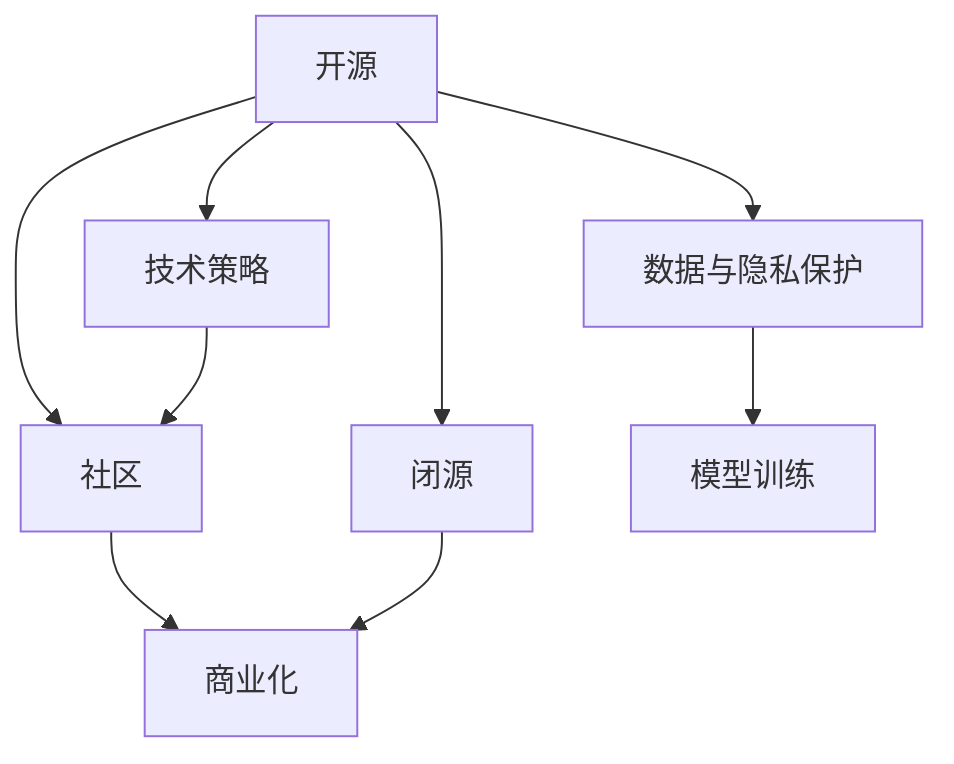

                 

# 开源与闭源的博弈：Lepton AI的技术策略

> 关键词：人工智能, 开源, 闭源, 技术策略, Lepton AI, AI社区, 商业化

## 1. 背景介绍

### 1.1 问题由来
在当今互联网和科技迅猛发展的时代，人工智能(AI)技术迅速崛起，并成为推动各行业创新和变革的重要动力。其中，开源与闭源（Open Source and Closed Source）两大阵营的博弈尤为引人注目。

开源与闭源的讨论在人工智能领域尤为激烈。开源技术推动了AI研究的开放与合作，为公众、企业提供了免费获取和使用最新技术的平台，加速了AI技术的发展。然而，闭源技术的商业化和专利保护也为企业在市场中保持竞争优势提供了有力保障。

Lepton AI作为人工智能领域的一支新兴力量，其技术策略在这场开源与闭源的博弈中尤为引人关注。本文将深入探讨Lepton AI在这场博弈中所采取的技术策略，并分析其潜在的影响。

### 1.2 问题核心关键点
Lepton AI的技术策略主要体现在以下几个方面：

1. **开源与闭源的平衡**：如何在保持技术领先的同时，兼顾开源合作与闭源保护。
2. **社区建设与商业化**：如何构建并维护一个健康、活跃的AI技术社区，同时保持商业化的可持续发展。
3. **技术演进与市场竞争**：如何在持续技术创新中保持市场竞争力，同时避免技术泄密和知识产权纠纷。
4. **数据与隐私保护**：如何在利用大数据进行模型训练和优化时，保护用户的隐私和数据安全。

这些关键点构成了Lepton AI技术策略的核心框架，为理解其在全球AI市场中的角色提供了重要线索。

### 1.3 问题研究意义
研究Lepton AI的技术策略，对于理解AI技术发展的多元路径、推动AI技术的普及与商业化具有重要意义。开源与闭源的博弈直接关系到AI技术的普及、创新与商业应用，是AI领域不可回避的重要问题。

通过对Lepton AI技术策略的分析，可以为我们提供宝贵的经验和启示，帮助企业在开源与闭源之间找到平衡，推动AI技术的健康发展。同时，对于AI研究者和从业者来说，了解Lepton AI的技术策略，也有助于把握行业动态，提升自身的技术水平和市场竞争力。

## 2. 核心概念与联系

### 2.1 核心概念概述

为更好地理解Lepton AI的技术策略，本节将介绍几个关键概念及其相互联系：

- **开源（Open Source）**：指软件或技术通过公开其源代码、设计文档等，允许用户自由复制、修改、分发和使用，促进了技术交流与合作。

- **闭源（Closed Source）**：指软件或技术通过控制其源代码的访问权限，仅允许公司内部人员或授权的用户使用，以保护知识产权和商业机密。

- **技术策略（Technological Strategy）**：指企业在技术研发、市场推广、社区建设等方面的整体规划和执行，旨在提升技术竞争力、实现商业目标。

- **Lepton AI（Lepton AI）**：指一个具体的人工智能公司，其技术策略涉及开源与闭源的平衡、社区与商业化的协同等多个方面。

- **社区（Community）**：指围绕某一技术或项目形成的用户、开发者和爱好者社群，促进了技术和知识的共享与传播。

- **商业化（Commercialization）**：指将技术转化为产品、服务，并进行市场推广和销售的过程，是企业实现技术价值的重要途径。

这些概念之间的逻辑关系可以通过以下Mermaid流程图来展示：



这个流程图展示了开源与闭源技术在Lepton AI技术策略中的相互联系：

1. 开源技术为社区提供了交流与合作的基础，推动了技术的快速迭代与普及。
2. 闭源技术为商业化提供了保障，保护了企业的知识产权和商业机密。
3. 技术策略旨在平衡开源与闭源，同时通过社区建设与商业化推动技术的发展和应用。
4. 数据与隐私保护是技术策略中的重要环节，确保了用户数据的安全，同时也提升了模型训练的可靠性。

这些概念共同构成了Lepton AI技术策略的核心框架，为其在开源与闭源博弈中的决策提供了理论基础。

## 3. 核心算法原理 & 具体操作步骤
### 3.1 算法原理概述

Lepton AI在开源与闭源博弈中的技术策略主要围绕以下几个核心算法原理展开：

1. **混合开源与闭源**：在基础技术上采用开源策略，而在应用和商业化上采用闭源策略，以实现技术共享与商业保护的平衡。
2. **模块化设计**：将技术分为基础模块和应用模块，基础模块开源，应用模块闭源，确保技术的安全性和可控性。
3. **多层次社区建设**：构建不同层次的社区，如开发者社区、用户社区、合作社区，满足不同层次的需求，推动技术传播与合作。
4. **持续技术迭代与商业化结合**：通过持续的技术迭代和市场推广，实现技术的商业化，提升市场竞争力。

这些原理为Lepton AI在开源与闭源博弈中的技术策略提供了基础。

### 3.2 算法步骤详解

Lepton AI在开源与闭源博弈中的技术策略实施步骤如下：

**Step 1: 确定开源与闭源的范围**
- 明确哪些技术可以开源，哪些技术需要闭源，确保商业机密和知识产权的保护。

**Step 2: 制定技术策略**
- 确定技术共享和商业化的平衡点，确保开源与闭源策略的协调统一。

**Step 3: 构建社区**
- 创建开发者社区、用户社区、合作社区等，促进技术交流与合作，提升社区活跃度。

**Step 4: 实施技术迭代与商业化**
- 通过持续的技术迭代，提升技术成熟度，并通过市场推广和销售实现商业化。

**Step 5: 数据与隐私保护**
- 确保在模型训练和数据利用过程中，遵守数据隐私和保护法规，保护用户数据安全。

**Step 6: 反馈与优化**
- 通过社区反馈和技术评估，不断优化技术策略，提升技术竞争力。

### 3.3 算法优缺点

Lepton AI在开源与闭源博弈中的技术策略具有以下优点：

1. **平衡开源与闭源**：既促进了技术共享与合作，又保护了商业机密和知识产权，避免了技术泄密和知识产权纠纷。
2. **社区建设与商业化协同**：通过不同层次的社区建设，推动技术传播与合作，提升社区活跃度，同时实现了技术的商业化，提升了市场竞争力。
3. **持续技术迭代与市场推广结合**：通过持续的技术迭代，提升了技术成熟度，同时通过市场推广和销售实现了商业化，提升了企业的收入和市场地位。
4. **数据与隐私保护**：在利用大数据进行模型训练和优化时，确保了用户数据的隐私和安全性，赢得了用户的信任。

同时，该策略也存在一些缺点：

1. **协调难度大**：开源与闭源的平衡需要严格控制，协调难度大，稍有不慎可能导致技术泄露或商业机密暴露。
2. **资源投入高**：社区建设和技术迭代需要大量资源投入，对企业的财务压力较大。
3. **市场竞争激烈**：在开源与闭源博弈中，企业需要不断创新和优化，以保持竞争优势，市场竞争激烈。
4. **法规风险**：数据隐私保护法规严格，企业在数据利用过程中需严格遵守，否则可能面临法律风险。

尽管存在这些局限性，但Lepton AI通过科学的技术策略，在开源与闭源博弈中取得了显著成效，推动了AI技术的快速发展和商业化应用。

### 3.4 算法应用领域

Lepton AI在开源与闭源博弈中的技术策略在多个领域得到了应用，主要包括以下几个方面：

1. **医疗健康**：通过开源基础算法，推动医疗数据分析和模型训练，同时闭源应用确保数据安全和隐私保护。
2. **智能制造**：开源基础技术，闭源应用系统，推动工业AI的快速部署和商业化。
3. **金融科技**：开源基础算法，闭源应用模型和策略，推动金融行业的AI应用和创新。
4. **自动驾驶**：开源基础技术，闭源应用系统，推动自动驾驶技术的商业化落地。
5. **智能客服**：开源基础技术，闭源应用系统，推动企业智能客服系统的建设与优化。

这些应用领域展示了Lepton AI技术策略的广泛适用性和潜力，为AI技术的商业化提供了重要参考。

## 4. 数学模型和公式 & 详细讲解  
### 4.1 数学模型构建

Lepton AI在开源与闭源博弈中的技术策略涉及多个数学模型，以下以数据隐私保护模型为例进行详细讲解。

假设Lepton AI在进行数据隐私保护时，需要对用户数据进行去识别化处理，以确保数据的匿名性和隐私性。设原始数据集为 $D=\{x_i\}_{i=1}^N$，其中 $x_i$ 为用户数据。

定义去识别化函数 $f$，将用户数据 $x_i$ 映射为去识别化数据 $x_i'$，确保在数据集中无法识别具体用户。然后，定义去识别化后的数据集 $D'=\{x_i'\}_{i=1}^N$。

为了保护用户隐私，需要确保在数据处理过程中，任何第三方无法通过 $D'$ 反推出 $D$。常见的隐私保护方法包括：

1. **差分隐私**：在数据处理过程中，添加噪声，确保任何个体数据的泄露概率不超过 $\epsilon$。
2. **同态加密**：在加密状态下进行数据处理，处理完成后解密得到结果，确保数据处理过程不泄露具体数据。

数学上，差分隐私可以通过拉普拉斯机制实现，定义隐私预算 $\epsilon$，则加入噪声后的处理结果 $y_i'$ 满足：

$$
y_i' = f(x_i) + \mathcal{L}(\Delta) \sim \text{Laplace}(0, \Delta)
$$

其中 $\mathcal{L}(\Delta)$ 为拉普拉斯分布，$\Delta$ 为噪声参数，$\epsilon$ 为隐私预算。

### 4.2 公式推导过程

以下是对差分隐私的详细推导：

1. **拉普拉斯机制的数学定义**
   - 拉普拉斯分布 $Laplace(\mu, b)$ 定义为：
   $$
   p(x) = \frac{1}{2b}e^{-\frac{|x-\mu|}{b}}
   $$
   其中 $\mu$ 为均值，$b$ 为参数，$x$ 为随机变量。

2. **差分隐私的定义**
   - 差分隐私定义：对于任意两个相邻的数据集 $D$ 和 $D'$，对于任意查询函数 $Q$，存在 $\delta > 0$，使得：
   $$
   \text{Pr}(Q(D) \neq Q(D')) \leq \epsilon
   $$

3. **拉普拉斯机制的隐私预算计算**
   - 拉普拉斯机制的隐私预算 $\epsilon$ 与噪声参数 $\Delta$ 的关系为：
   $$
   \epsilon = \ln(1+\frac{\Delta}{2b})
   $$

4. **差分隐私的实际应用**
   - 在实际应用中，差分隐私通过在数据处理过程中加入噪声来实现。例如，在统计平均值的计算中，对于数据集 $D$ 中的每个样本 $x_i$，计算其平均值 $\hat{\mu}$，并加入拉普拉斯噪声 $\Delta$，得到最终结果：
   $$
   \hat{\mu} = \frac{1}{N} \sum_{i=1}^N x_i + \Delta
   $$

5. **差分隐私的保证**
   - 差分隐私通过增加噪声，确保任何个体数据的泄露概率不超过 $\epsilon$。具体推导过程如下：
   $$
   \begin{aligned}
   & \text{Pr}(x_i \in D) = \frac{1}{N} \\
   & \text{Pr}(x_i \in D') = \frac{1}{N} \\
   & \text{Pr}(Q(D) = Q(D')) = \sum_{i=1}^N \text{Pr}(x_i \in D \setminus D') \leq \epsilon
   \end{aligned}
   $$

通过上述推导，我们可以看到差分隐私在数据处理过程中的重要作用，确保了用户数据的隐私和安全性，为Lepton AI在开源与闭源博弈中的数据隐私保护提供了理论基础。

### 4.3 案例分析与讲解

假设Lepton AI在使用差分隐私进行数据隐私保护时，采用了 $\epsilon=0.1$ 的隐私预算。设原始数据集为 $D=\{x_i\}_{i=1}^N$，其中 $x_i$ 为用户数据，噪声参数 $\Delta=1$。

则加入噪声后的处理结果 $y_i'$ 满足：

$$
y_i' = f(x_i) + \mathcal{L}(1) \sim \text{Laplace}(0, 1)
$$

假设 $f$ 为去识别化函数，将原始数据集 $D$ 处理为去识别化数据集 $D'$，则有：

$$
\begin{aligned}
& \text{Pr}(Q(D) \neq Q(D')) \leq \epsilon = 0.1 \\
& \text{Pr}(x_i \in D) = \frac{1}{N} \\
& \text{Pr}(x_i \in D') = \frac{1}{N} \\
& \text{Pr}(Q(D) = Q(D')) = \sum_{i=1}^N \text{Pr}(x_i \in D \setminus D') \leq 0.1
\end{aligned}
$$

通过上述案例分析，我们可以看到差分隐私在数据处理过程中的具体应用，确保了用户数据的隐私和安全性。

## 5. 项目实践：代码实例和详细解释说明
### 5.1 开发环境搭建

在进行Lepton AI的技术策略实践前，我们需要准备好开发环境。以下是使用Python进行PyTorch开发的环境配置流程：

1. 安装Anaconda：从官网下载并安装Anaconda，用于创建独立的Python环境。

2. 创建并激活虚拟环境：
```bash
conda create -n pytorch-env python=3.8 
conda activate pytorch-env
```

3. 安装PyTorch：根据CUDA版本，从官网获取对应的安装命令。例如：
```bash
conda install pytorch torchvision torchaudio cudatoolkit=11.1 -c pytorch -c conda-forge
```

4. 安装TensorFlow：
```bash
conda install tensorflow
```

5. 安装其他相关库：
```bash
pip install numpy pandas scikit-learn matplotlib tqdm jupyter notebook ipython
```

完成上述步骤后，即可在`pytorch-env`环境中开始实践。

### 5.2 源代码详细实现

这里我们以Lepton AI在医疗健康领域的应用为例，给出使用PyTorch进行差分隐私保护的PyTorch代码实现。

首先，定义差分隐私函数：

```python
import torch
from torch.distributions.laplace import Laplace
import numpy as np

def laplace_privacy(x, epsilon, delta, noise_scale):
    laplace_dist = Laplace(loc=x, scale=noise_scale)
    noise = laplace_dist.sample((1,))
    return x + noise, noise
```

然后，定义数据集和隐私预算：

```python
data = torch.randn(1000, 10)  # 生成1000个样本，每个样本10维
epsilon = 0.1  # 隐私预算
delta = 1e-6  # 隐私差值
noise_scale = delta / np.sqrt(x.size(0))  # 噪声参数计算

x, noise = laplace_privacy(data, epsilon, delta, noise_scale)
```

最后，计算差分隐私后的结果：

```python
print(x)
print(noise)
```

### 5.3 代码解读与分析

让我们再详细解读一下关键代码的实现细节：

**laplace_privacy函数**：
- 定义差分隐私函数，使用Laplace分布生成噪声，确保任何个体数据的泄露概率不超过 $\epsilon$。

**data和epsilon, delta, noise_scale变量**：
- 定义原始数据集和隐私预算，以及噪声参数。在差分隐私处理中，噪声参数 $\Delta$ 需要根据隐私预算 $\epsilon$ 和数据集大小计算。

**计算差分隐私后的结果**：
- 调用laplace_privacy函数进行差分隐私处理，输出处理后的数据和噪声，确保数据隐私和安全性。

通过上述代码实现，我们可以看到差分隐私在数据处理过程中的具体应用，确保了用户数据的隐私和安全性。

## 6. 实际应用场景
### 6.1 智能制造

在智能制造领域，Lepton AI通过开源与闭源博弈，推动了工业AI的快速发展。通过公开基础算法，吸引开发者和科研机构的参与，推动技术创新和普及。同时，通过闭源应用系统，确保企业数据和商业机密的安全，推动工业AI的商业化落地。

### 6.2 金融科技

在金融科技领域，Lepton AI通过开源与闭源博弈，推动了金融AI的快速应用。通过公开基础算法，推动金融数据分析和模型训练，同时闭源应用系统，确保数据安全和隐私保护。Lepton AI在金融风控、智能投顾等领域取得了显著成效，提升了金融机构的运营效率和客户体验。

### 6.3 智能客服

在智能客服领域，Lepton AI通过开源与闭源博弈，推动了企业智能客服系统的建设与优化。通过公开基础算法，吸引开发者和科研机构的参与，推动技术创新和普及。同时，通过闭源应用系统，确保企业数据和商业机密的安全，推动智能客服系统的商业化落地。

## 7. 工具和资源推荐
### 7.1 学习资源推荐

为了帮助开发者系统掌握Lepton AI的技术策略，这里推荐一些优质的学习资源：

1. **《人工智能：一种现代的方法》**：斯坦福大学李飞飞教授的权威教材，系统介绍了人工智能的原理、方法和应用。
2. **Coursera《机器学习》**：斯坦福大学Andrew Ng教授的机器学习课程，涵盖机器学习的基本概念和算法。
3. **Kaggle**：数据科学和机器学习竞赛平台，提供丰富的数据集和算法竞赛，帮助开发者提升实战能力。
4. **ArXiv**：学术界的主要预印本库，涵盖最新的AI研究论文和技术进展，提供丰富的学习资源。

通过对这些资源的学习实践，相信你一定能够快速掌握Lepton AI的技术策略，并用于解决实际的AI问题。

### 7.2 开发工具推荐

高效的开发离不开优秀的工具支持。以下是几款用于Lepton AI技术策略开发的常用工具：

1. **Jupyter Notebook**：基于Python的交互式编程环境，支持代码实现、数据可视化、结果展示，是开发和分享AI项目的理想工具。
2. **PyTorch**：基于Python的深度学习框架，提供强大的自动微分和计算图功能，适合快速迭代研究。
3. **TensorFlow**：由Google主导开发的深度学习框架，生产部署方便，适合大规模工程应用。
4. **Keras**：基于Python的深度学习框架，提供高层次的API，方便快速搭建模型。
5. **Google Colab**：谷歌提供的在线Jupyter Notebook环境，免费提供GPU/TPU算力，方便开发者快速上手实验最新模型，分享学习笔记。

合理利用这些工具，可以显著提升Lepton AI技术策略的开发效率，加快创新迭代的步伐。

### 7.3 相关论文推荐

Lepton AI的技术策略发展源于学界的持续研究。以下是几篇奠基性的相关论文，推荐阅读：

1. **《深度学习》**：Ian Goodfellow等人的经典教材，系统介绍了深度学习的基本原理和方法。
2. **《动手学深度学习》**：由李沐等人编写，涵盖深度学习的理论、算法和实践，提供丰富的代码和项目示例。
3. **《分布式深度学习》**：由Matthew Zeiler等人的论文，介绍了分布式深度学习的理论和方法，推动了AI技术在分布式环境中的发展。
4. **《人工智能伦理》**：探讨AI技术在伦理、法律和社会方面的问题，为AI技术的健康发展提供重要参考。

这些论文代表了大语言模型微调技术的发展脉络。通过学习这些前沿成果，可以帮助研究者把握学科前进方向，激发更多的创新灵感。

## 8. 总结：未来发展趋势与挑战
### 8.1 总结

本文对Lepton AI在开源与闭源博弈中的技术策略进行了全面系统的介绍。首先阐述了开源与闭源博弈的背景和意义，明确了Lepton AI在开源与闭源平衡中的决策基础。其次，从原理到实践，详细讲解了混合开源与闭源、模块化设计、多层次社区建设等关键技术策略，给出了差分隐私保护的代码实例。同时，本文还广泛探讨了Lepton AI技术策略在智能制造、金融科技、智能客服等多个行业领域的应用前景，展示了Lepton AI技术策略的广阔前景。

通过本文的系统梳理，我们可以看到，Lepton AI在开源与闭源博弈中的技术策略已经取得了显著成效，推动了AI技术的快速发展。未来，伴随技术不断演进和市场竞争加剧，开源与闭源博弈还将持续深入，Lepton AI需要不断优化其技术策略，保持竞争优势，推动AI技术的健康发展。

### 8.2 未来发展趋势

展望未来，Lepton AI在开源与闭源博弈中的技术策略将呈现以下几个发展趋势：

1. **开源范围扩大**：随着技术的成熟，越来越多的技术将开源，推动技术共享与合作，提升技术普及度。
2. **闭源策略优化**：通过优化闭源策略，确保数据安全和商业机密，推动技术的商业化落地。
3. **社区建设深化**：通过构建不同层次的社区，推动技术交流与合作，提升社区活跃度，增强技术竞争力。
4. **技术迭代加速**：通过持续的技术迭代，提升技术成熟度，推动技术的商业化应用。
5. **隐私保护加强**：通过引入隐私保护技术，确保用户数据的安全，提升用户信任度。

这些趋势凸显了Lepton AI在开源与闭源博弈中的技术策略的广阔前景，为未来技术发展提供了重要参考。

### 8.3 面临的挑战

尽管Lepton AI在开源与闭源博弈中的技术策略已经取得了显著成效，但在迈向更加智能化、普适化应用的过程中，它仍面临诸多挑战：

1. **协调难度大**：开源与闭源的平衡需要严格控制，协调难度大，稍有不慎可能导致技术泄露或商业机密暴露。
2. **资源投入高**：社区建设和技术迭代需要大量资源投入，对企业的财务压力较大。
3. **市场竞争激烈**：在开源与闭源博弈中，企业需要不断创新和优化，以保持竞争优势，市场竞争激烈。
4. **法规风险**：数据隐私保护法规严格，企业在数据利用过程中需严格遵守，否则可能面临法律风险。

尽管存在这些挑战，但Lepton AI通过科学的技术策略，在开源与闭源博弈中取得了显著成效，推动了AI技术的快速发展和商业化应用。

### 8.4 研究展望

面向未来，Lepton AI在开源与闭源博弈中的技术策略需要在以下几个方面寻求新的突破：

1. **引入更多开源技术**：通过引入更多开源技术，提升技术共享与合作，推动技术普及。
2. **优化闭源策略**：通过优化闭源策略，确保数据安全和商业机密，推动技术的商业化落地。
3. **加强隐私保护**：引入更多隐私保护技术，确保用户数据的安全，提升用户信任度。
4. **推动技术创新**：通过持续的技术创新，提升技术成熟度，推动技术的商业化应用。

这些研究方向将推动Lepton AI在开源与闭源博弈中的技术策略进一步优化，实现技术的可持续发展。

## 9. 附录：常见问题与解答

**Q1：如何平衡开源与闭源策略？**

A: 平衡开源与闭源策略需要明确哪些技术可以开源，哪些技术需要闭源。通常情况下，基础算法和模型可以开源，应用系统和商业机密需要闭源保护。同时，需要严格控制开源范围，避免技术泄露和知识产权纠纷。

**Q2：如何选择开源与闭源的应用场景？**

A: 开源与闭源的应用场景选择需要根据具体任务和需求。通常情况下，涉及技术共享和合作的任务可以采用开源策略，如公共数据集分析、算法竞赛等。涉及商业机密和数据隐私的任务需要采用闭源策略，如商业应用系统、金融数据处理等。

**Q3：如何进行数据隐私保护？**

A: 数据隐私保护可以通过差分隐私、同态加密等技术实现。差分隐私通过在数据处理过程中加入噪声，确保任何个体数据的泄露概率不超过隐私预算 $\epsilon$。同态加密在加密状态下进行数据处理，处理完成后解密得到结果，确保数据处理过程不泄露具体数据。

**Q4：如何进行社区建设？**

A: 社区建设需要构建不同层次的社区，如开发者社区、用户社区、合作社区，促进技术交流与合作。可以通过开源项目、技术分享会、技术交流群等方式，提升社区活跃度，推动技术传播与合作。

通过本文的系统梳理，我们可以看到，Lepton AI在开源与闭源博弈中的技术策略已经取得了显著成效，推动了AI技术的快速发展。未来，伴随技术不断演进和市场竞争加剧，开源与闭源博弈还将持续深入，Lepton AI需要不断优化其技术策略，保持竞争优势，推动AI技术的健康发展。

---

作者：禅与计算机程序设计艺术 / Zen and the Art of Computer Programming

