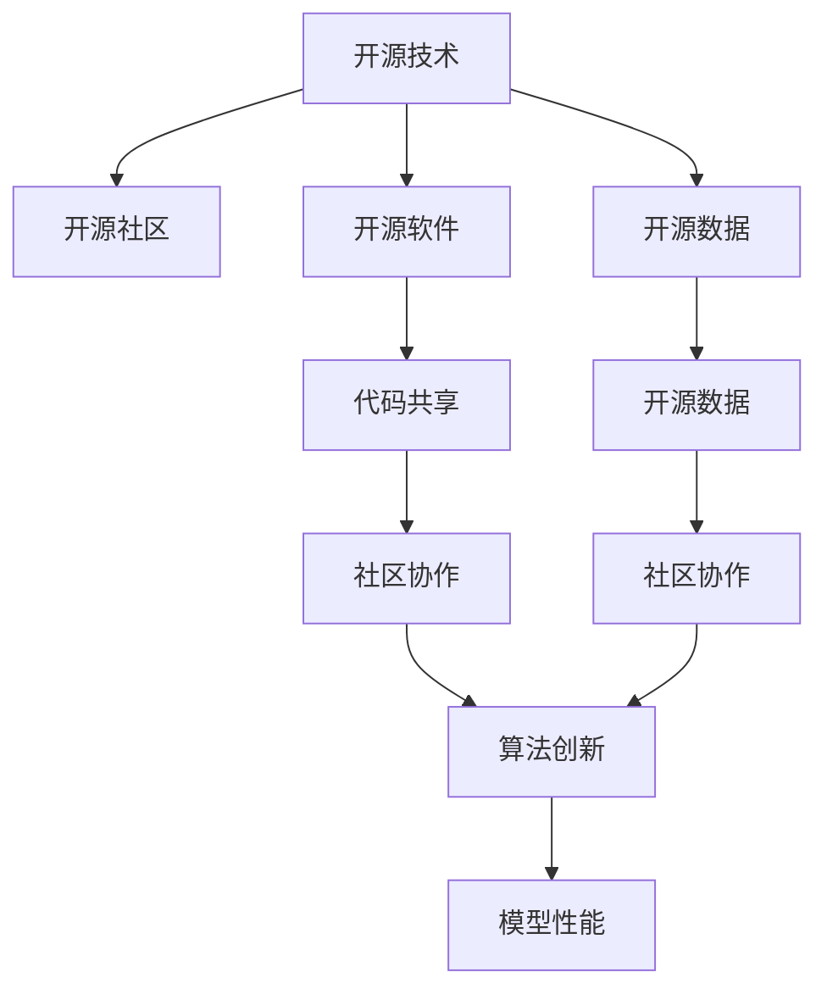

                 

# 开源技术在AI进步中的作用

> 关键词：开源技术,人工智能,代码共享,社区协作,算法创新,模型性能

## 1. 背景介绍

### 1.1 问题由来
人工智能(AI)技术正在迅速发展，成为推动社会进步和产业革新的重要力量。然而，AI的发展面临高昂的成本、复杂的技术壁垒和难以解决的数据隐私问题。开源技术的出现，极大地降低了AI开发的门槛，加快了技术的迭代和普及。

### 1.2 问题核心关键点
开源技术是指将软件源代码公开，供任何人自由使用、修改和共享的技术。在AI领域，开源技术通过以下方式对AI进步产生了深远影响：

- **降低开发门槛**：开源代码使得AI开发者能够快速上手，构建复杂的AI系统。
- **加速技术迭代**：开放的环境促进了算法和模型创新，提升了AI技术的整体水平。
- **提升透明性和可追溯性**：开源项目通常有完整的代码记录和贡献历史，便于追踪和理解。
- **增强社区协作**：开放的源代码吸引了全球的开发者参与，形成大规模的协作网络。

### 1.3 问题研究意义
开源技术在AI进步中的作用不容忽视，对AI技术的普及和商业应用具有重要意义：

1. **降低成本**：开源项目免费提供，减少了企业的研发投入。
2. **促进创新**：开放的代码和数据鼓励更多的实验和探索，推动AI技术的创新。
3. **提升效率**：开源项目提供现成的算法和工具，减少了重复劳动，提升了开发效率。
4. **保障安全**：开源社区的监督和审查机制有助于发现和修复漏洞，保障AI系统的安全性。
5. **推动公平**：开源技术降低了技术和知识的门槛，促进了技术公平和普惠。

本文将系统探讨开源技术在AI进步中的作用，并从开源社区、开源软件和开源数据三个维度，详细分析其对AI发展的贡献和影响。

## 2. 核心概念与联系

### 2.1 核心概念概述

为更好地理解开源技术对AI进步的作用，本节将介绍几个核心概念：

- **开源技术**：是指源代码公开，允许自由使用、修改和共享的软件技术。
- **开源社区**：是由开发者组成的网络，通过共同协作开发和维护开源项目。
- **开源软件**：是指在开源协议下分发和使用，源代码公开的软件。
- **开源数据**：是指在开源许可下发布，可自由使用和再利用的数据集。
- **代码共享**：是指通过网络共享代码和算法，促进知识传播和技术发展。
- **社区协作**：是指在开源社区中，开发者通过合作实现共同目标。
- **算法创新**：是指在开源环境中，开发者不断尝试新的算法和模型。
- **模型性能**：是指AI模型在各种任务上的表现和精度。

这些概念之间的逻辑关系可以通过以下Mermaid流程图来展示：



这个流程图展示了开源技术的主要组成及其关系：

1. 开源技术由开源社区维护，提供开源软件和开源数据。
2. 开源社区通过代码共享和社区协作，实现算法创新。
3. 算法创新提升了模型性能，推动AI技术进步。

## 3. 核心算法原理 & 具体操作步骤
### 3.1 算法原理概述

开源技术在AI领域的应用，主要体现在以下几个方面：

- **代码共享和协作**：通过开源代码的共享和协作，实现知识的快速传播和积累。
- **算法和模型创新**：开源社区中大量的算法和模型，为AI技术的创新提供了丰富的资源。
- **数据共享和利用**：开源数据集为AI模型的训练提供了大量样本，提升了模型的泛化能力。
- **工具和框架支持**：开源软件工具和框架为AI开发提供了高效、便捷的开发环境。

### 3.2 算法步骤详解

开源技术在AI进步中的具体实现步骤包括：

1. **代码共享和协作**：开发者在开源平台上发布自己的代码，其他开发者可以在此基础上进行修改和改进。
2. **算法和模型创新**：开源社区中不断涌现新的算法和模型，通过实验验证和优化，提升AI技术水平。
3. **数据共享和利用**：开放的数据集和标注数据被广泛应用，为AI模型的训练提供了数据支持。
4. **工具和框架支持**：开源社区开发了多种AI开发工具和框架，如TensorFlow、PyTorch等，为AI开发提供了便利。

### 3.3 算法优缺点

开源技术在推动AI进步的过程中，也存在一些局限性：

- **质量和可靠性**：开源项目的质量和可靠性参差不齐，部分项目可能存在漏洞和问题。
- **版本和维护**：开源项目的版本管理较为复杂，开发者需要定期更新和维护。
- **知识产权**：开源许可协议可能限制商业应用，影响商业化进程。
- **知识鸿沟**：开源社区中存在知识门槛，部分技术可能难以普及。

尽管存在这些缺点，但总体而言，开源技术对AI发展的贡献是巨大的，它促进了知识的共享、技术的创新和社区的协作，推动了AI技术的整体进步。

### 3.4 算法应用领域

开源技术在AI领域的应用非常广泛，涵盖以下几个主要方向：

- **计算机视觉**：开源项目如OpenCV、TensorFlow提供了丰富的计算机视觉算法和工具，推动了图像识别、目标检测等技术的发展。
- **自然语言处理**：开源工具如NLTK、SpaCy提供了自然语言处理的基础功能，促进了文本分析、情感分析等任务的发展。
- **机器人技术**：开源平台如Robot Operating System (ROS)提供了机器人操作的解决方案，加速了机器人技术的普及。
- **物联网**：开源协议如MQTT、Apache Kafka提供了数据传输和处理的标准，推动了物联网技术的应用。
- **生物信息学**：开源项目如BioPython、GROMACS提供了生物信息学的算法和工具，推动了生物科学的研究。

## 4. 数学模型和公式 & 详细讲解 & 举例说明

### 4.1 数学模型构建

开源技术在AI中通常以代码和工具的形式出现，数学模型作为AI技术的重要组成部分，在开源项目中也得到了广泛应用。

- **深度学习模型**：开源项目如TensorFlow、PyTorch提供了深度学习模型的实现，通过代码和工具支持深度学习的开发和训练。
- **强化学习模型**：开源项目如Reinforcement Learning Toolkit (RLTK)提供了强化学习的算法和工具，支持智能体在环境中的学习。
- **优化算法**：开源项目如OpenOpt、JuMP提供了优化算法的实现，支持机器学习模型的训练和优化。

### 4.2 公式推导过程

以深度学习中的反向传播算法为例，介绍其开源实现：

$$
\frac{\partial \mathcal{L}}{\partial \theta} = \frac{\partial \mathcal{L}}{\partial y} \frac{\partial y}{\partial z} \frac{\partial z}{\partial \theta}
$$

其中，$\mathcal{L}$ 为损失函数，$y$ 为模型输出，$z$ 为模型输入。开源项目中通常通过自动微分技术实现上述公式的计算，如TensorFlow中的`tf.GradientTape`和PyTorch中的`torch.autograd`。

### 4.3 案例分析与讲解

以TensorFlow为例，介绍开源技术在深度学习模型中的应用：

1. **模型构建**：使用`tf.keras`模块构建神经网络模型，如`Sequential`模型、`Conv2D`层、`Dense`层等。
2. **数据处理**：使用`tf.data.Dataset`模块加载和预处理数据集。
3. **训练和优化**：使用`tf.keras.Model.fit`方法进行模型训练，并设置优化器和损失函数。
4. **评估和推理**：使用`tf.keras.Model.evaluate`和`tf.keras.Model.predict`方法评估和推理模型。

## 5. 项目实践：代码实例和详细解释说明
### 5.1 开发环境搭建

在进行开源项目实践前，我们需要准备好开发环境。以下是使用Python进行TensorFlow开发的环境配置流程：

1. 安装Anaconda：从官网下载并安装Anaconda，用于创建独立的Python环境。

2. 创建并激活虚拟环境：
```bash
conda create -n tf-env python=3.8 
conda activate tf-env
```

3. 安装TensorFlow：根据CUDA版本，从官网获取对应的安装命令。例如：
```bash
conda install tensorflow -c conda-forge -c pypi
```

4. 安装各类工具包：
```bash
pip install numpy pandas scikit-learn matplotlib tqdm jupyter notebook ipython
```

完成上述步骤后，即可在`tf-env`环境中开始开源项目实践。

### 5.2 源代码详细实现

下面我们以图像分类任务为例，给出使用TensorFlow对ResNet模型进行微调的PyTorch代码实现。

首先，定义图像分类任务的数据处理函数：

```python
import tensorflow as tf
from tensorflow.keras.preprocessing.image import ImageDataGenerator

def load_and_preprocess_data(data_dir, batch_size):
    train_datagen = ImageDataGenerator(rescale=1./255)
    test_datagen = ImageDataGenerator(rescale=1./255)
    
    train_generator = train_datagen.flow_from_directory(
        data_dir,
        target_size=(224, 224),
        batch_size=batch_size,
        class_mode='categorical'
    )
    
    test_generator = test_datagen.flow_from_directory(
        data_dir,
        target_size=(224, 224),
        batch_size=batch_size,
        class_mode='categorical',
        shuffle=False
    )
    
    return train_generator, test_generator
```

然后，定义模型和优化器：

```python
from tensorflow.keras.applications.resnet50 import ResNet50
from tensorflow.keras.layers import Dense
from tensorflow.keras.optimizers import Adam

model = ResNet50(include_top=False, weights='imagenet')
for layer in model.layers:
    layer.trainable = False

model.add(Dense(256, activation='relu'))
model.add(Dense(10, activation='softmax'))

optimizer = Adam(lr=0.001)
```

接着，定义训练和评估函数：

```python
def train_epoch(model, train_generator, batch_size, optimizer):
    model.compile(optimizer=optimizer, loss='categorical_crossentropy', metrics=['accuracy'])
    model.fit(train_generator, epochs=10, validation_data=test_generator)
    
    test_loss, test_acc = model.evaluate(test_generator)
    print(f'Test loss: {test_loss}, Test accuracy: {test_acc}')
    
def evaluate(model, test_generator):
    test_loss, test_acc = model.evaluate(test_generator)
    print(f'Test loss: {test_loss}, Test accuracy: {test_acc}')
```

最后，启动训练流程并在测试集上评估：

```python
data_dir = 'path/to/dataset'
batch_size = 32

train_generator, test_generator = load_and_preprocess_data(data_dir, batch_size)

train_epoch(model, train_generator, batch_size, optimizer)
evaluate(model, test_generator)
```

以上就是使用TensorFlow对ResNet模型进行图像分类任务微调的完整代码实现。可以看到，得益于TensorFlow的强大封装，我们可以用相对简洁的代码完成模型的构建和微调。

### 5.3 代码解读与分析

让我们再详细解读一下关键代码的实现细节：

**load_and_preprocess_data函数**：
- 定义图像数据增强器，对训练数据进行缩放、归一化等预处理。
- 使用`flow_from_directory`方法加载数据集，并划分为训练集和测试集。

**ResNet50模型**：
- 使用预训练的ResNet50模型，将其顶层分类器替换为新的全连接层。
- 通过`include_top=False`参数，避免使用预训练的图像分类器。
- 冻结预训练模型的权重，只训练新增的全连接层。

**train_epoch函数**：
- 编译模型，设置损失函数和优化器。
- 使用`fit`方法训练模型，并在测试集上进行评估。

**evaluate函数**：
- 使用`evaluate`方法对模型进行评估，输出测试集上的损失和准确率。

**训练流程**：
- 定义数据集路径和批大小，加载和预处理数据集。
- 在训练集上训练模型，并在测试集上评估性能。

可以看到，TensorFlow提供的高级API使得深度学习模型的构建和微调变得非常便捷。开发者可以将更多精力放在算法和模型设计上，而不必过多关注底层实现细节。

当然，工业级的系统实现还需考虑更多因素，如模型的保存和部署、超参数的自动搜索、更灵活的任务适配层等。但核心的开源项目实践流程基本与此类似。

## 6. 实际应用场景
### 6.1 开源技术的广泛应用

开源技术在各个行业中都得到了广泛应用，以下是一些典型的应用场景：

- **自动驾驶**：开源平台如CrowdAI提供了自动驾驶的工具箱，支持多传感器融合、路径规划等任务。
- **医疗健康**：开源项目如OpenMRI提供了医学图像分析工具，支持疾病诊断和图像增强。
- **金融科技**：开源软件如TensorFlow金融库提供了金融数据分析和交易策略的工具。
- **智能家居**：开源平台如Home Assistant提供了智能家居设备的集中管理和控制。
- **教育和培训**：开源工具如Kaggle提供了数据分析和机器学习竞赛平台，支持教育和培训项目。

### 6.2 开源技术推动的行业变革

开源技术通过促进技术共享和社区协作，推动了多个行业的变革：

- **汽车行业**：开源自动驾驶技术的普及，加速了无人驾驶汽车的商业化进程。
- **医疗行业**：开源医学影像工具的应用，提高了疾病诊断的准确性和效率。
- **金融行业**：开源金融科技工具的使用，降低了金融产品的开发成本。
- **教育行业**：开源教育资源的应用，推动了在线教育和远程学习的普及。

## 7. 工具和资源推荐
### 7.1 学习资源推荐

为了帮助开发者系统掌握开源技术在AI中的作用，这里推荐一些优质的学习资源：

1. **《Python深度学习》**：深度介绍TensorFlow和Keras等开源框架，是学习深度学习的好书。
2. **《深度学习框架TensorFlow实战》**：详细讲解TensorFlow的使用和实践，是TensorFlow初学者的好资源。
3. **《PyTorch深度学习》**：全面介绍PyTorch框架，是学习深度学习的权威书籍。
4. **《机器学习实战》**：介绍了多种机器学习算法和开源工具的实现，适合初学者。
5. **《Github开发指南》**：介绍了如何使用Github托管和管理开源项目，是开源开发的好资源。

通过对这些资源的学习实践，相信你一定能够系统掌握开源技术在AI中的作用，并用于解决实际的AI问题。
###  7.2 开发工具推荐

高效的开发离不开优秀的工具支持。以下是几款用于开源项目开发的常用工具：

1. **Jupyter Notebook**：用于编写和运行代码，支持丰富的数据可视化功能。
2. **Git**：版本控制系统，支持代码的托管和协作开发。
3. **Github**：代码托管平台，支持开源项目的发布和协作。
4. **Docker**：容器化技术，支持应用的无缝部署和迁移。
5. **Kubernetes**：容器编排工具，支持大规模应用的自动化部署和管理。
6. **Apache Spark**：大数据处理框架，支持大规模数据集的处理和分析。

合理利用这些工具，可以显著提升开源项目开发和管理的效率，加速创新迭代的步伐。

### 7.3 相关论文推荐

开源技术在AI领域的发展源于学界的持续研究。以下是几篇奠基性的相关论文，推荐阅读：

1. **“A Survey of Recent Advances in Deep Learning: Tutorial and Survey”**：综述了深度学习领域的最新进展，是理解深度学习的重要文献。
2. **“Open Source Software: Cooperative Software Development in the Open Source and Open Source Intelligence Communities”**：介绍了开源软件的发展历程和社区协作模式，是理解开源技术的重要文献。
3. **“Deep Learning with Python”**：介绍了深度学习框架的实现和使用，是深度学习的经典教材。
4. **“The Apache Hadoop Software Foundation”**：介绍了Apache Hadoop生态系统的实现和使用，是大数据处理的重要文献。
5. **“Open Source Projects in Scientific Research and Software Engineering”**：介绍了开源项目在科研和工程中的应用，是理解开源技术的重要文献。

这些论文代表了大数据和人工智能领域的最新进展，是理解开源技术的重要参考。

## 8. 总结：未来发展趋势与挑战
### 8.1 总结

本文对开源技术在AI进步中的作用进行了全面系统的介绍。首先阐述了开源技术在降低开发门槛、加速技术迭代、提升透明性和可追溯性等方面的作用，明确了开源技术在推动AI发展中的重要价值。其次，从开源社区、开源软件和开源数据三个维度，详细讲解了开源技术对AI发展的贡献和影响。最后，通过对实际应用场景和未来发展趋势的探讨，展示了开源技术在AI领域的广泛应用和潜力。

通过本文的系统梳理，可以看到，开源技术在AI发展中的关键作用，为AI技术的普及和商业应用提供了重要保障。未来，伴随开源社区和技术的进一步发展，开源技术必将在更多领域发挥更大作用，推动AI技术的持续进步。

### 8.2 未来发展趋势

展望未来，开源技术在AI进步中的作用将呈现以下几个趋势：

1. **社区协作更加紧密**：开源社区将更加活跃，开发者之间的协作和交流将更加频繁，推动技术快速迭代。
2. **开源工具和框架更加丰富**：开源项目将不断涌现，提供更多的工具和框架支持，推动AI技术的普及。
3. **开源数据集更加多样化**：开源数据集将更加丰富，涵盖更多领域和任务，支持更广泛的应用。
4. **开源生态系统更加完善**：开源生态系统将更加完善，支持从研发到生产的全链条应用。
5. **开源技术与AI技术的深度融合**：开源技术与AI技术的深度融合将更加深入，推动AI技术的全面发展。

这些趋势凸显了开源技术在AI进步中的重要地位，预示着开源技术将进一步推动AI技术的普及和应用。

### 8.3 面临的挑战

尽管开源技术在AI发展中取得了显著成就，但仍面临一些挑战：

1. **质量控制和稳定性**：开源项目的质量控制和稳定性较差，部分项目可能存在漏洞和问题。
2. **知识产权和法律问题**：开源许可协议可能限制商业应用，影响商业化进程。
3. **技术门槛和知识鸿沟**：部分开源项目存在技术门槛，可能难以普及。
4. **资源消耗和维护成本**：开源项目需要大量资源进行维护和管理，可能增加成本。
5. **社区分裂和碎片化**：开源社区可能出现分裂和碎片化现象，影响协同合作。

这些挑战需要开源社区和技术的进一步发展来解决，才能充分发挥开源技术在AI进步中的作用。

### 8.4 研究展望

面对开源技术在AI发展中面临的挑战，未来的研究需要在以下几个方面寻求新的突破：

1. **开源项目的质量控制**：建立更加严格的质量控制机制，保障开源项目的稳定性和安全性。
2. **知识产权和商业化**：制定更加灵活的许可协议，支持商业化应用。
3. **降低技术门槛**：提供更多的工具和教程，降低技术门槛，普及开源技术。
4. **开源生态系统的完善**：构建更加完善的开源生态系统，支持从研发到生产的全链条应用。
5. **社区协作和治理**：建立更加有效的社区协作和治理机制，避免分裂和碎片化现象。

这些研究方向和突破，将进一步推动开源技术在AI领域的普及和应用，为AI技术的进步和应用提供坚实的基础。

## 9. 附录：常见问题与解答

**Q1：开源技术是否适用于所有AI项目？**

A: 开源技术在许多AI项目中都得到了广泛应用，特别是对于那些需要共享知识和协作的项目。然而，一些高度专业化的AI项目可能更依赖于特定的商业解决方案。

**Q2：如何选择合适的开源项目？**

A: 选择合适的开源项目需要考虑多个因素，包括项目的稳定性、社区活跃度、适用性和可扩展性。可以参考开源社区的评价和推荐，选择符合自己需求的项目。

**Q3：开源技术在商业应用中面临哪些问题？**

A: 开源技术在商业应用中可能面临一些问题，包括知识产权风险、质量控制和稳定性问题、成本和维护问题等。需要在项目评估和选择中综合考虑这些问题。

**Q4：开源技术如何与商业解决方案结合？**

A: 开源技术和商业解决方案可以结合使用，发挥各自的优势。例如，开源工具可以提供基础功能，商业解决方案可以提供更好的用户体验和支持。

**Q5：开源技术如何支持大规模应用？**

A: 开源技术通过分布式计算和云计算平台，支持大规模应用的部署和运行。例如，Apache Spark支持大规模数据处理，Kubernetes支持大规模应用的自动化部署和管理。

本文通过系统介绍开源技术在AI进步中的作用，为AI开发者提供了全面的指导和参考。开源技术为AI技术的发展提供了强大的支持，通过社区协作和工具支持，推动了AI技术的不断进步和普及。未来，伴随开源社区和技术的进一步发展，开源技术必将在更多领域发挥更大作用，推动AI技术的持续进步。

