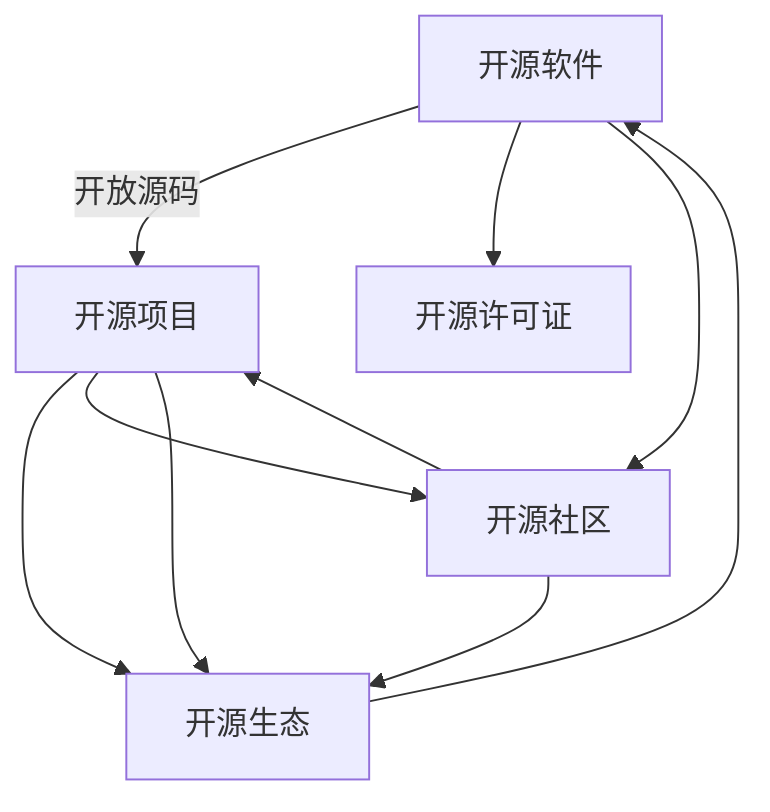

                 

# 开源技术：共享创新，加速进步

开源技术作为一种重要的创新模式，不仅在软件行业中发挥了巨大的推动作用，也在人工智能、大数据、区块链等前沿领域取得了广泛应用。通过共享代码、数据、工具和知识，开源技术极大地加速了技术的演进和应用落地，推动了全球科技创新的发展。本文将对开源技术的核心理念、关键概念、实践案例、发展趋势及未来挑战进行全面系统的介绍。

## 1. 背景介绍

### 1.1 问题由来

开源技术的兴起始于软件行业。20世纪90年代，开源软件运动（Open Source Initiative, OSI）的兴起，使得软件代码以开放共享的形式供全球开发者自由使用和改进。开源模式的核心思想是，通过集众人之力，共同推动技术的发展和优化。

开源技术的优点主要体现在以下几个方面：
1. **代码共享**：源码开放，可以自由使用、修改和分发。
2. **社区协作**：开源项目依赖广泛的社区支持，开发者可以互相协作，分享经验和技术。
3. **技术创新**：大量的开源项目提供了丰富的技术组件和工具，加速了技术的迭代和创新。
4. **成本降低**：使用开源技术可以避免昂贵的商业授权费用，降低了技术应用的门槛。

### 1.2 问题核心关键点

开源技术的核心理念是"开放共享、协作创新"，这使得技术的发展更加快速、高效和民主化。其核心关键点包括：

- **开放源码**：代码以免费的形式提供，任何人都可以查看、修改和使用。
- **社区参与**：开发者可以自由加入开源项目，贡献代码、文档、测试等。
- **版本控制**：通过版本控制系统（如Git）管理代码，支持多人协作和版本迭代。
- **灵活应用**：开源软件和工具可以无缝集成到各种应用场景中，灵活性高。

## 2. 核心概念与联系

### 2.1 核心概念概述

为了更好地理解开源技术的工作原理和价值，下面将介绍几个关键概念及其相互之间的联系。

- **开源软件（Open Source Software, OSS）**：指代码开放共享的软件产品，如Linux、Apache Web Server等。
- **开源项目（Open Source Project, OSP）**：指旨在共同开发和维护某项技术的在线社区，如Apache、Kubernetes等。
- **开源许可证（Open Source License, OSL）**：规定开源软件使用、分发、修改的协议，如GPL、MIT等。
- **开源社区（Open Source Community, OSC）**：指围绕开源项目聚集的开发者群体，如Apache、Linux Foundation等。
- **开源生态（Open Source Ecosystem, OSE）**：指由开源软件、工具、项目、社区构成的生态系统，如Linux、Apache Hadoop等。

这些概念之间相互关联，构成了一个完整而动态的开源技术体系，推动着技术的不断进步和应用。

### 2.2 核心概念原理和架构的 Mermaid 流程图

以下是开源技术核心概念之间的联系图示，展示了开源技术从代码共享到生态系统的演变过程。



这个流程图展示了开源技术从软件代码的开放共享，到社区的协作、项目的迭代，最终形成生态系统的整体过程。开源技术正是通过这一连串的环节，不断演进和完善，推动了技术的创新与应用。

## 3. 核心算法原理 & 具体操作步骤

### 3.1 算法原理概述

开源技术的核心算法原理主要基于分布式协作和版本控制。分布式协作通过社区的贡献和反馈，不断优化和完善代码和工具。版本控制则通过记录和管理代码变更，确保软件的稳定性和可追溯性。

具体而言，开源技术依赖以下几个关键原理：

- **代码共享和复用**：通过开放源码，代码可以被多个开发者共同使用和改进，促进了技术创新和迭代。
- **版本控制和迭代管理**：版本控制系统如Git，记录代码的每一次变更，支持多人协作和版本迭代，确保软件的稳定性和可追溯性。
- **社区反馈和改进**：社区中的开发者通过代码评论、测试报告等形式提供反馈，帮助改进和优化代码。
- **文档和知识共享**：开源项目通常包含详细的文档和教程，帮助新用户快速上手，促进知识的共享和传播。

### 3.2 算法步骤详解

开源技术从项目启动到社区维护的完整步骤可以概括为以下几个关键环节：

1. **项目规划**：确定项目目标和需求，设计项目架构和技术栈。
2. **代码贡献**：开发者将代码提交到版本控制系统中，记录变更历史。
3. **社区审核**：社区中的成员对代码进行审核和反馈，确保代码质量和规范性。
4. **测试验证**：通过自动化测试和人工测试验证代码的正确性和稳定性。
5. **版本发布**：定期发布软件的新版本，满足用户需求。
6. **生态扩展**：与其他开源项目和工具进行集成，丰富生态系统。

### 3.3 算法优缺点

开源技术的优点包括：
- **快速迭代**：社区的协作和反馈加速了代码的优化和迭代。
- **资源丰富**：开源社区提供了丰富的技术组件和工具，降低了技术入门的门槛。
- **成本低廉**：使用开源技术可以避免昂贵的商业授权费用，降低了技术应用的成本。

但开源技术也存在一些缺点：
- **质量参差不齐**：开源项目质量往往依赖社区的协作和维护，可能存在不稳定性和兼容性问题。
- **安全风险**：开源代码可能存在安全漏洞，需开发者自行维护。
- **版本混乱**：开源项目的版本管理有时较为混乱，可能导致用户使用不稳定的版本。

### 3.4 算法应用领域

开源技术已经广泛应用于各种技术领域，推动了技术的发展和创新。

- **软件领域**：开源软件如Linux、Apache HTTP Server、MySQL等，已经成为行业标准。
- **大数据领域**：开源大数据工具如Hadoop、Spark、Flink等，提供了强大的数据处理和分析能力。
- **人工智能领域**：开源AI框架如TensorFlow、PyTorch、Scikit-learn等，为机器学习、深度学习等技术提供了丰富的组件和工具。
- **云计算领域**：开源云平台如Kubernetes、Docker、OpenStack等，提供了灵活的云服务管理和部署能力。
- **物联网领域**：开源物联网协议如MQTT、CoAP等，推动了物联网设备和系统的互联互通。

开源技术在多个领域的应用，不仅促进了技术的演进和创新，也为各行各业带来了巨大的经济效益和社会效益。

## 4. 数学模型和公式 & 详细讲解 & 举例说明

### 4.1 数学模型构建

开源技术在数学模型和公式方面并没有统一的标准，但在某些特定领域，开源项目会引入数学模型以提升技术性能。

以Apache Hadoop为例，其分布式文件系统采用了PageRank算法来优化数据块的存储和分配。PageRank算法是一种基于链接分析的排序算法，通过计算网页的重要性来确定其在网络中的排名。

### 4.2 公式推导过程

PageRank算法的核心公式为：

$$
PR(p) = \frac{1-c}{c} + \sum_{p \in M(p)} \frac{PR(p')}{L(p')} \times \frac{1}{k} \times \frac{E(p)}{D(p)}
$$

其中：
- $PR(p)$ 表示网页 $p$ 的PageRank值。
- $M(p)$ 表示网页 $p$ 的链接集合。
- $L(p')$ 表示网页 $p'$ 的链接数。
- $k$ 表示所有链接的总数。
- $E(p)$ 表示网页 $p$ 的入度（即指向 $p$ 的链接数量）。
- $D(p)$ 表示网页 $p$ 的出度（即从 $p$ 发出的链接数量）。
- $c$ 表示阻尼因子，通常取0.85。

PageRank算法通过计算每个网页的重要性，优化了数据块的存储和分配，提高了Hadoop的性能和可用性。

### 4.3 案例分析与讲解

以Apache Kafka为例，其分布式消息队列采用了分布式锁（Zookeeper）和异步复制（Replica）等技术，确保了系统的稳定性和高可用性。Kafka采用了Zookeeper作为其元数据存储和集群管理工具，使用异步复制机制来保证数据的一致性和可靠性。

## 5. 项目实践：代码实例和详细解释说明

### 5.1 开发环境搭建

开源技术的发展离不开开发环境的搭建和管理。以下是搭建Kubernetes开发环境的步骤：

1. **安装Kubernetes**：在Linux服务器上安装Kubernetes集群，包括Master节点和多个Worker节点。
2. **配置网络**：为Kubernetes集群配置私有网络，确保节点之间的通信。
3. **配置DNS**：为Kubernetes集群配置域名系统，方便容器间和服务间的访问。
4. **部署应用**：将应用容器打包成Docker镜像，并使用Kubernetes Deployment部署到集群中。

### 5.2 源代码详细实现

以下是一个简单的Kubernetes Deployment配置文件示例：

```yaml
apiVersion: apps/v1
kind: Deployment
metadata:
  name: app-deployment
spec:
  replicas: 3
  selector:
    matchLabels:
      app: app-label
  template:
    metadata:
      labels:
        app: app-label
    spec:
      containers:
      - name: app-container
        image: app-image:latest
        ports:
        - containerPort: 8080
```

该配置文件定义了一个名为`app-deployment`的Deployment，包含3个ReplicaSet副本，并指定了应用的容器镜像、端口和服务标签。

### 5.3 代码解读与分析

在Kubernetes中，Deployment是最基本的资源类型，用于部署和管理应用。通过YAML格式的配置文件，用户可以灵活地定义和管理应用的副本、镜像、端口等参数。这种灵活性和可配置性，使得Kubernetes成为部署和管理分布式应用的最佳选择。

### 5.4 运行结果展示

部署完成后，可以通过Kubectl命令行工具检查应用的状态：

```bash
$ kubectl get pods
NAME                    READY   STATUS    RESTARTS   AGE
app-deployment-7d5zf     1/1     Running   0          17m
app-deployment-7d5zg     1/1     Running   0          17m
app-deployment-7d5zh     1/1     Running   0          17m
```

可以看到，应用已经成功部署并运行，具备了高可用性和可伸缩性。

## 6. 实际应用场景

### 6.1 企业级云服务

开源技术在企业级云服务中的应用已经非常广泛。例如，Apache Hadoop、Spark等大数据工具，已经成为许多企业数据处理的基石。企业可以利用开源工具构建高性能、高可靠性的数据仓库和分析平台，满足大规模数据处理需求。

### 6.2 科研和学术研究

开源技术在科研和学术研究中的应用也不断增多。例如，GitHub、GitLab等代码托管平台，为科研工作者提供了丰富的开源代码和资源。科研团队可以利用开源工具，高效地管理和协作科研项目，加速科研创新。

### 6.3 教育培训

开源技术在教育培训中的应用也日益重要。例如，Kaggle等数据科学竞赛平台，提供了丰富的开源数据集和竞赛任务，吸引了大批数据科学家参与。学生和教师可以利用这些资源，进行实践和教学。

### 6.4 未来应用展望

未来，开源技术将在更多领域发挥重要作用，推动技术创新和社会进步。

1. **全栈式开源平台**：开源平台将涵盖软件开发、数据处理、人工智能等多个领域，形成一个完整的技术生态。
2. **开源技术的民主化**：开源技术将进一步降低技术应用的门槛，使得更多企业和开发者可以参与到技术创新中。
3. **开源技术的标准化**：开源技术将推动技术标准化和规范化，提高技术应用的效率和可靠性。
4. **开源技术的可持续发展**：开源技术将为社会的可持续发展提供技术支持和动力。

## 7. 工具和资源推荐

### 7.1 学习资源推荐

为了帮助开发者系统掌握开源技术的理论基础和实践技巧，这里推荐一些优质的学习资源：

1. **《开源之道：开源社区协作指南》**：介绍了开源社区的协作方式和最佳实践，帮助开发者更好地参与开源项目。
2. **《Kubernetes权威指南》**：详细介绍了Kubernetes的架构和部署方法，是学习Kubernetes的最佳参考书。
3. **《深入浅出TensorFlow》**：介绍了TensorFlow的基本原理和应用场景，适合初学者和高级开发者。
4. **《Apache Hadoop实战》**：提供了Apache Hadoop的实战教程，帮助开发者深入理解Hadoop的部署和管理。
5. **GitHub官方文档**：GitHub是全球最大的开源代码托管平台，官方文档提供了丰富的学习资源和实践示例。

通过对这些资源的学习实践，相信你一定能够快速掌握开源技术的精髓，并用于解决实际的开发和应用问题。

### 7.2 开发工具推荐

高效的开发离不开优秀的工具支持。以下是几款用于开源技术开发和管理的常用工具：

1. **Git**：版本控制系统，是开源项目的基础设施，支持代码的存储、管理和分发。
2. **Docker**：容器化平台，可以方便地打包和管理应用容器，支持跨平台部署。
3. **Jenkins**：开源的CI/CD工具，支持自动化构建、测试和部署，提高开发效率。
4. **JIRA**：开源项目管理工具，提供丰富的任务和缺陷管理功能，支持敏捷开发。
5. **Prometheus**：开源监控和报警系统，可以实时监控应用性能和资源使用情况，确保系统稳定运行。

### 7.3 相关论文推荐

开源技术的发展源于学界的持续研究。以下是几篇奠基性的相关论文，推荐阅读：

1. **《The Promise of Open Source》**：论文探讨了开源技术对软件行业的影响和未来发展趋势。
2. **《Open Source Software Management》**：介绍了开源项目的最佳实践和项目管理方法。
3. **《Kubernetes: A Scheduling and Resource Management System for Linux Containers》**：Kubernetes的原始论文，介绍了其架构和设计思想。
4. **《Apache Hadoop: A Distributed Computing System》**：Apache Hadoop的原始论文，介绍了其分布式文件系统和计算模型。
5. **《Docker: The Future of Computing》**：Docker的创始人提出的开源技术未来发展方向。

这些论文代表了大规模开源技术的发展脉络。通过学习这些前沿成果，可以帮助研究者把握学科前进方向，激发更多的创新灵感。

## 8. 总结：未来发展趋势与挑战

### 8.1 研究成果总结

本文对开源技术的核心理念、关键概念、实践案例、发展趋势及未来挑战进行了全面系统的介绍。开源技术通过开放共享、社区协作和版本控制，极大地推动了技术的演进和应用落地。从软件到大数据、人工智能、云计算等领域，开源技术的应用范围不断扩大，推动了全球科技创新的发展。

### 8.2 未来发展趋势

开源技术的发展将呈现以下几个趋势：

1. **开源生态的壮大**：开源生态将涵盖软件开发、数据处理、人工智能等多个领域，形成一个完整的技术体系。
2. **开源技术的民主化**：开源技术将进一步降低技术应用的门槛，使得更多企业和开发者可以参与到技术创新中。
3. **开源技术的标准化**：开源技术将推动技术标准化和规范化，提高技术应用的效率和可靠性。
4. **开源技术的可持续发展**：开源技术将为社会的可持续发展提供技术支持和动力。

### 8.3 面临的挑战

尽管开源技术已经取得了瞩目成就，但在迈向更加智能化、普适化应用的过程中，它仍面临着诸多挑战：

1. **质量控制**：开源项目的质量依赖社区的协作和维护，可能存在不稳定性和兼容性问题。
2. **安全风险**：开源代码可能存在安全漏洞，需开发者自行维护。
3. **版本混乱**：开源项目的版本管理有时较为混乱，可能导致用户使用不稳定的版本。
4. **社区参与**：开源项目的成功依赖社区的积极参与和贡献，如何吸引和保持社区活跃度是一个挑战。

### 8.4 研究展望

面对开源技术面临的挑战，未来的研究需要在以下几个方面寻求新的突破：

1. **提高代码质量**：通过代码审查和自动化测试，提高开源项目代码的质量和稳定性。
2. **增强安全性**：引入安全扫描和防护机制，确保开源项目的安全性和可靠性。
3. **优化版本管理**：引入分布式版本控制系统，简化版本迭代和管理。
4. **促进社区参与**：建立良好的社区文化和激励机制，吸引更多开发者参与开源项目。

这些研究方向凸显了开源技术的发展潜力，为开源技术未来提供广阔的前景。相信随着学界和产业界的共同努力，开源技术将迎来更加美好的未来。

## 9. 附录：常见问题与解答

**Q1：开源技术是否只适用于软件开发？**

A: 开源技术的应用不仅限于软件开发。从数据处理、人工智能到云计算、区块链等领域，开源技术都有广泛应用。

**Q2：如何评估开源技术的质量？**

A: 开源技术的质量主要依赖社区的协作和维护。可以通过代码审查、自动化测试、社区反馈等方式评估和改进开源项目的质量。

**Q3：开源技术如何与其他技术集成？**

A: 开源技术通常提供了API和SDK，可以方便地与其他技术集成。例如，Kubernetes可以与Docker、Prometheus等开源工具集成，构建高效、可扩展的分布式系统。

**Q4：开源技术的未来发展方向是什么？**

A: 开源技术的未来发展方向包括开源生态的壮大、技术的民主化、标准化和可持续发展。未来的开源技术将继续推动技术创新和社会进步。

---

作者：禅与计算机程序设计艺术 / Zen and the Art of Computer Programming

