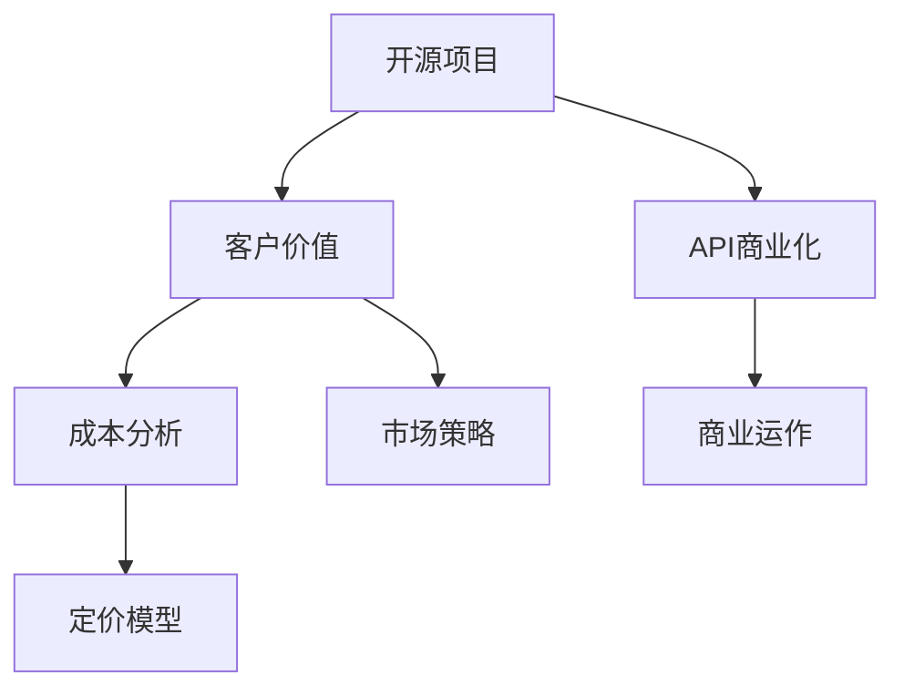

                 

# 开源项目的API商业化：策略和定价模型

> 关键词：开源项目, API商业化, 策略, 定价模型, 商业评估, 客户价值, 成本分析, 市场策略, 定价决策

## 1. 背景介绍

### 1.1 问题由来

在当今数字化和信息化时代，开源项目以其开放性和社区驱动的特点，成为了技术创新和普及的重要驱动力。然而，开源项目往往面临资金匮乏和商业化的困境。商业化的核心问题之一是如何通过商业化手段将开源项目中的价值最大化，同时兼顾社区贡献和用户利益。

特别是对于那些拥有广泛用户基础和核心技术的开源项目，商业化不仅是保持项目可持续发展的关键，也是推动技术进步和产业升级的重要路径。比如Linux内核、Apache Hadoop等项目的商业化，就为整个软件生态注入了强大的活力和创新动力。

在众多开源项目的商业化策略中，API商业化成为一种越来越受欢迎的方式。API（Application Programming Interface，应用编程接口）作为项目与外部世界的接口，是项目核心价值的外现形式。通过合理的API商业化策略，可以将项目中蕴含的技术、数据和算法价值转化为实际的商业收入，同时保持社区的健康和活跃。

本文将从策略和定价模型两个维度，系统阐述开源项目API商业化的思路和实现方法。

## 2. 核心概念与联系

### 2.1 核心概念概述

为更好地理解开源项目API商业化的过程，本节将介绍几个关键概念及其相互关系：

- **开源项目**：指由开发者社区共同贡献和维护，遵循特定的开源协议（如GPL、MIT等），允许任何人使用、修改和分发的软件项目。

- **API商业化**：指将开源项目中的API作为付费服务或产品进行商业运作，以实现项目可持续发展的过程。

- **定价模型**：指确定API产品或服务价格的方法和策略，涉及成本、市场、用户价值等多方面的考量。

- **客户价值**：指客户对API产品或服务的满意度和实际受益，通常通过用户留存率、活跃度、收入增长等指标进行衡量。

- **成本分析**：指对API产品或服务开发、运维、营销等各个环节的成本进行细致评估，以合理定价。

- **市场策略**：指基于目标市场和用户群体的特点，制定相应的市场定位和推广策略，以最大化商业价值。

这些概念之间的逻辑关系可以通过以下Mermaid流程图来展示：



这个流程图展示了几者之间的关联关系：开源项目是API商业化的基础；API商业化的核心是定价模型，定价模型依赖于客户价值和成本分析；同时，市场策略也是影响定价模型的重要因素。

## 3. 核心算法原理 & 具体操作步骤
### 3.1 算法原理概述

开源项目API商业化的本质是利用开源项目的价值，通过市场化运作实现经济回报。其核心原理包括：

1. **识别价值**：评估开源项目中具有商业化潜力的API，如功能丰富、性能卓越、市场需要等。
2. **用户研究**：通过用户调研和市场分析，了解目标用户群体对API的需求、支付意愿和接受度。
3. **成本评估**：对API产品的开发、运维、营销等成本进行细致评估，包括固定成本和变动成本。
4. **定价策略**：基于用户价值和成本分析，制定合理的定价策略，包括免费试用、分级定价、动态调整等。
5. **市场推广**：通过多种渠道和手段，推广API产品，吸引更多用户和合作伙伴。

以上五个步骤构成了开源项目API商业化的基本框架，每个步骤都直接影响最终的定价模型和商业运作效果。

### 3.2 算法步骤详解

开源项目API商业化的具体步骤包括：

**Step 1: 价值识别与评估**
- 梳理开源项目中所有的API接口，评估其功能、性能、安全性、扩展性等。
- 识别出具有高用户价值和高商业潜力的API，作为商业化的重点。

**Step 2: 用户需求调研**
- 设计调查问卷，了解目标用户群体的行业背景、技术水平、业务需求等。
- 分析用户调研结果，确定用户对API的关键需求和痛点。

**Step 3: 成本分析**
- 列出API产品开发、运维、市场营销等各个环节的成本项，包括人力、服务器、开发工具、法律费用等。
- 区分固定成本和变动成本，进行详细成本预测和评估。

**Step 4: 定价模型构建**
- 基于用户调研和成本分析，制定初步的定价策略，包括免费试用、分级定价、动态定价等。
- 使用数学模型和经济学原理，对定价策略进行优化和调整。

**Step 5: 市场推广与优化**
- 根据市场策略，选择合适的推广渠道，如社交媒体、技术论坛、行业展会等。
- 根据用户反馈和市场反应，持续优化API产品和服务，提升用户体验。

### 3.3 算法优缺点

开源项目API商业化的优缺点如下：

**优点**：
1. **提高项目可持续性**：通过商业化收入，开源项目可以获得资金支持，保持技术创新和社区活跃。
2. **最大化用户价值**：通过合理定价和市场推广，提高API的用户覆盖率和实际收益。
3. **降低市场进入门槛**：API商业化降低了技术门槛，使得更多用户能够方便地使用和集成开源项目。

**缺点**：
1. **社区利益冲突**：商业化可能与社区贡献产生冲突，需要平衡两者之间的关系。
2. **市场竞争激烈**：商业化需要应对其他云服务提供商的竞争，保持API的市场份额。
3. **用户期望管理**：商业化可能导致用户对价格的敏感度增加，需要有效管理用户期望。

### 3.4 算法应用领域

开源项目API商业化的应用领域广泛，涵盖了技术基础设施、行业应用、云服务等各个方面：

- **云服务提供商**：如AWS、阿里云、腾讯云等，通过API商业化提供丰富的云服务产品。
- **开源技术公司**：如Red Hat、SUSE、JFrog等，利用开源项目的核心技术进行商业化运作。
- **行业应用场景**：如金融、医疗、交通等，通过API商业化推动行业应用创新和升级。

## 4. 数学模型和公式 & 详细讲解 & 举例说明

### 4.1 数学模型构建

本节将使用数学语言对开源项目API商业化的定价模型进行详细解释。

设开源项目API产品的单位成本为 $C$，单位销售价格为 $P$，总用户数量为 $U$，单个用户的购买量为 $V$，则总收入为 $R = P \times U \times V$。

我们需要最大化总收入 $R$，同时考虑成本 $C$ 和用户需求。因此，目标函数为：

$$
\max R = P \times U \times V \\
\text{s.t.} \quad C \times V \leq R
$$

### 4.2 公式推导过程

对于分级定价策略，我们可以设每个价格层级为 $p_i$，每个层级的用户数量为 $u_i$，则总收入可以表示为：

$$
R = \sum_i p_i \times u_i
$$

成本约束可以表示为：

$$
\sum_i C_i \times u_i \leq R
$$

其中 $C_i$ 为第 $i$ 个价格层级的固定成本。

为了求解最优价格 $p_i$ 和最优用户数量 $u_i$，可以使用拉格朗日乘数法。引入拉格朗日乘子 $\lambda$，构造拉格朗日函数：

$$
\mathcal{L}(p_i, u_i, \lambda) = \sum_i p_i \times u_i - \lambda (\sum_i C_i \times u_i - R)
$$

对 $p_i$ 和 $u_i$ 求偏导，并令其等于0，得：

$$
\frac{\partial \mathcal{L}}{\partial p_i} = u_i - \lambda C_i = 0 \\
\frac{\partial \mathcal{L}}{\partial u_i} = p_i - \lambda C_i = 0
$$

解得：

$$
p_i = \frac{C_i}{1 - u_i}
$$

将 $p_i$ 代入总收入公式，得：

$$
R = \sum_i \frac{C_i}{1 - u_i} \times u_i
$$

### 4.3 案例分析与讲解

假设某开源项目提供三级定价的API服务，每个层级的固定成本和目标用户数量如下：

| 价格层级 | 固定成本 $C_i$ | 目标用户数量 $u_i$ |
| --- | --- | --- |
| 低级 | $C_1 = 10$ | $u_1 = 10000$ |
| 中级 | $C_2 = 20$ | $u_2 = 5000$ |
| 高级 | $C_3 = 30$ | $u_3 = 2000$ |

根据公式 $p_i = \frac{C_i}{1 - u_i}$，计算每个价格层级的最优价格：

| 价格层级 | 最优价格 $p_i$ |
| --- | --- |
| 低级 | $p_1 = \frac{10}{1 - 0.1} = 11.11$ |
| 中级 | $p_2 = \frac{20}{1 - 0.05} = 21.05$ |
| 高级 | $p_3 = \frac{30}{1 - 0.02} = 31.25$ |

### 4.4 客户价值分析

客户价值分析是定价模型的重要组成部分，主要包括用户留存率、活跃度、收入增长等指标。以留存率为例，假设一个API服务的留存率为 $R_0$，则其在第 $t$ 期的留存率可以表示为：

$$
R_t = R_0 \times (1 - \alpha)^t
$$

其中 $\alpha$ 为留存率衰减系数，$0 < \alpha < 1$。

## 5. 项目实践：代码实例和详细解释说明
### 5.1 开发环境搭建

在进行开源项目API商业化实践前，我们需要准备好开发环境。以下是使用Python进行Django开发的环境配置流程：

1. 安装Anaconda：从官网下载并安装Anaconda，用于创建独立的Python环境。

2. 创建并激活虚拟环境：
```bash
conda create -n django-env python=3.8 
conda activate django-env
```

3. 安装Django：
```bash
pip install django
```

4. 安装其他相关库：
```bash
pip install Pillow psycopg2-binary django-cors-headers
```

5. 安装SQLite：
```bash
pip install pysqlite3
```

完成上述步骤后，即可在`django-env`环境中开始项目开发。

### 5.2 源代码详细实现

下面以一个简化的开源项目API商业化项目为例，展示Django框架下API商业化的基本实现流程。

首先，创建一个Django项目：

```bash
django-admin startproject myproject
cd myproject
```

在项目中创建App：

```bash
python manage.py startapp api
```

在App中创建必要的模型、视图、URL配置等：

```python
# models.py
from django.db import models

class User(models.Model):
    name = models.CharField(max_length=100)
    email = models.EmailField(unique=True)
    subscription_level = models.CharField(max_length=50, choices=[('free', 'Free'), ('premium', 'Premium'), ('ultimate', 'Ultimate')])

# views.py
from django.shortcuts import render
from .models import User

def home(request):
    return render(request, 'home.html')

def subscribe(request):
    user = User.objects.get(email=request.POST['email'])
    if request.POST['subscription_level'] == 'free':
        user.subscription_level = 'free'
    elif request.POST['subscription_level'] == 'premium':
        user.subscription_level = 'premium'
    else:
        user.subscription_level = 'ultimate'
    user.save()
    return render(request, 'subscription_success.html')
```

创建相应的URL配置：

```python
# urls.py
from django.urls import path
from . import views

urlpatterns = [
    path('', views.home, name='home'),
    path('subscribe/', views.subscribe, name='subscribe'),
]
```

最后，在App中创建相应的模板：

```html
<!-- home.html -->
<!DOCTYPE html>
<html>
<head>
    <title>Open Source API Commercialization</title>
</head>
<body>
    <h1>Welcome to Open Source API Commercialization</h1>
    <a href="">Subscribe Now</a>
</body>
</html>

<!-- subscription_success.html -->
<!DOCTYPE html>
<html>
<head>
    <title>Subscription Success</title>
</head>
<body>
    <h1>Subscription Successful!</h1>
</body>
</html>
```

### 5.3 代码解读与分析

以下是关键代码的实现细节：

**User模型**：
- 定义了用户的名称、邮箱和订阅等级三个字段，通过`choices`参数限制了订阅等级的可选值。

**views.py**：
- 定义了`home`视图，展示欢迎页面。
- 定义了`subscribe`视图，处理用户订阅请求。根据提交的订阅等级，更新用户的订阅等级，并保存至数据库中。

**urls.py**：
- 定义了`home`和`subscribe`两个URL路径，对应`views.py`中的相应视图函数。

通过上述代码实现，可以初步展示一个简单的开源项目API商业化框架。开发者可以通过进一步扩展功能，如用户认证、API计费、市场推广等，构建完整的商业化系统。

### 5.4 运行结果展示

运行项目，访问`http://127.0.0.1:8000/`，即可展示欢迎页面，点击订阅链接`Subscribe Now`，跳转到订阅成功页面。

## 6. 实际应用场景

### 6.1 开源数据库服务

开源数据库服务如PostgreSQL、MySQL等，是IT行业的重要基础设施。通过API商业化，这些开源数据库服务可以提供更加灵活和高级的功能，如高可用性、自动备份、数据分析等。

具体而言，可以设计多个层级的订阅服务，根据用户需求和使用量定价。低级服务仅提供基本功能，如读写操作、简单查询等；中级服务提供高级功能，如分区表、索引优化等；高级服务提供全栈支持，包括备份恢复、性能监控、数据仓库等服务。通过合理定价和市场推广，开源数据库服务可以吸引更多用户，提升商业价值。

### 6.2 开源云平台

开源云平台如OpenStack、Kubernetes等，是云计算生态的重要组成部分。通过API商业化，开源云平台可以提供更加丰富和稳定的云服务，如云存储、云网络、云数据库等。

例如，OpenStack可以提供基础计算、存储和网络服务，中级服务提供负载均衡、CDN加速等高级功能，高级服务提供全栈云平台支持，包括DevOps自动化、云安全、云治理等。通过设计合理的定价策略，吸引企业客户使用开源云平台，降低云服务成本，提升用户体验。

### 6.3 开源软件即服务

开源软件即服务(SaaS)是软件行业的重要创新模式。通过API商业化，SaaS提供商可以提供更加个性化和定制化的解决方案，满足不同客户的需求。

例如，某个开源CRM系统可以提供基本功能，如客户管理、销售分析等；中级服务提供高级功能，如多渠道销售、智能推荐等；高级服务提供全栈支持，包括市场营销自动化、客户服务支持等。通过合理定价和市场推广，开源SaaS提供商可以吸引更多企业客户，提升商业价值。

### 6.4 未来应用展望

随着开源项目商业化的不断深入，API商业化将成为一种更为成熟和普遍的商业模式。未来，开源项目API商业化可能呈现以下趋势：

1. **服务化和微服务架构**：更多开源项目将采用服务化和微服务架构，提供更加灵活和高效的API服务。
2. **API市场和生态系统**：构建API市场和生态系统，吸引更多第三方开发者和企业用户，提升API的活跃度和市场影响力。
3. **多模态和跨平台支持**：API商业化将进一步拓展到多模态和跨平台场景，如云服务、移动端、物联网等，实现更广泛的业务覆盖。
4. **数据分析和用户洞察**：通过API商业化获得的数据，进行用户行为分析，提供更加精准的市场推广和客户服务。
5. **安全性与合规性**：API商业化将更加注重数据安全和合规性，制定更加严格的安全策略和隐私保护措施。

## 7. 工具和资源推荐
### 7.1 学习资源推荐

为了帮助开发者系统掌握开源项目API商业化的理论基础和实践技巧，这里推荐一些优质的学习资源：

1. **《Python Web Development with Django》**：介绍Django框架的基本使用方法和Web开发技巧，是开源项目商业化项目开发的好帮手。

2. **《Open Source Software Development》**：介绍开源软件开发的流程、工具和最佳实践，适合了解开源项目商业化的基本框架。

3. **《API Economy》**：探讨API经济的模式、策略和应用，提供丰富的案例和实践指南。

4. **《Cloud Computing with Python》**：介绍使用Python进行云服务开发和商业化的方法和工具，适合理解开源云平台商业化的具体实现。

5. **《Django for Data Science》**：介绍如何使用Django开发数据分析和API商业化应用，适合学习开源项目数据分析和商业化的综合应用。

通过对这些资源的学习实践，相信你一定能够快速掌握开源项目API商业化的精髓，并用于解决实际的商业问题。

### 7.2 开发工具推荐

高效的开发离不开优秀的工具支持。以下是几款用于开源项目API商业化开发的常用工具：

1. **Django**：开源的Web框架，提供了丰富的模型、视图、URL等组件，方便快速开发API商业化项目。

2. **SQLite**：轻量级的关系型数据库，适用于小型项目的数据存储需求。

3. **Pillow**：Python的图像处理库，适用于需要对API服务进行数据展示和图形化的场景。

4. **psycopg2-binary**：Python的PostgreSQL库，适用于开源数据库服务API商业化的实现。

5. **django-cors-headers**：Django中间件，用于解决跨域请求问题，适用于API服务的跨域调用。

6. **Google Colab**：免费的在线Jupyter Notebook环境，支持Python开发，适用于快速原型开发和测试。

合理利用这些工具，可以显著提升开源项目API商业化任务的开发效率，加快创新迭代的步伐。

### 7.3 相关论文推荐

开源项目API商业化领域的研究已经取得了一些重要成果，以下是几篇代表性的论文，推荐阅读：

1. **《An Empirical Study of Open Source Software Commercialization Models》**：通过对多个开源项目的商业化模式进行实证分析，探讨不同商业化策略的效果。

2. **《Open Source Software Commercialization: A Review and Roadmap》**：总结了开源项目商业化的主要方法、策略和挑战，并提出了未来发展方向。

3. **《Cost Analysis and Pricing Models for Open Source Software》**：研究开源项目商业化中的成本分析和定价模型，提供详细的理论框架和实际案例。

4. **《The Economics of Open Source Software》**：分析开源软件经济的理论基础和实践应用，探讨开源项目商业化的经济学背景和商业价值。

这些论文代表了大语言模型微调技术的发展脉络。通过学习这些前沿成果，可以帮助研究者把握学科前进方向，激发更多的创新灵感。

## 8. 总结：未来发展趋势与挑战

### 8.1 研究成果总结

本文对开源项目API商业化的策略和定价模型进行了全面系统的介绍。首先阐述了开源项目API商业化的背景和意义，明确了API商业化在开源项目中的重要性和价值。其次，从策略和定价模型两个维度，详细讲解了开源项目API商业化的核心原理和操作步骤。最后，通过实践案例和实际应用场景，展示了开源项目API商业化的成功应用。

通过本文的系统梳理，可以看到，开源项目API商业化不仅能够实现项目的可持续性，还能最大化用户价值和商业收益。合理定价和市场推广策略，将使得开源项目商业化更加可行和有效。未来，随着开源项目和API市场的进一步发展，开源项目API商业化将展现出更广阔的应用前景和商业潜力。

### 8.2 未来发展趋势

展望未来，开源项目API商业化将呈现以下几个发展趋势：

1. **云原生和微服务架构**：更多开源项目将采用云原生和微服务架构，提供更加灵活和高效的API服务。
2. **API市场和生态系统**：构建API市场和生态系统，吸引更多第三方开发者和企业用户，提升API的活跃度和市场影响力。
3. **多模态和跨平台支持**：API商业化将进一步拓展到多模态和跨平台场景，如云服务、移动端、物联网等，实现更广泛的业务覆盖。
4. **数据分析和用户洞察**：通过API商业化获得的数据，进行用户行为分析，提供更加精准的市场推广和客户服务。
5. **安全性与合规性**：API商业化将更加注重数据安全和合规性，制定更加严格的安全策略和隐私保护措施。

以上趋势凸显了开源项目API商业化的广阔前景。这些方向的探索发展，必将进一步提升开源项目商业化的可行性和效果，为开源项目持续发展注入新的动力。

### 8.3 面临的挑战

尽管开源项目API商业化已经取得了一定的进展，但在迈向更加智能化、普适化应用的过程中，它仍面临着诸多挑战：

1. **社区贡献与商业化冲突**：如何平衡社区贡献和商业化需求，避免对社区产生负面影响。
2. **市场竞争激烈**：开源项目面临其他云服务提供商的竞争，需要保持API的市场份额。
3. **用户期望管理**：如何有效管理用户对API价格的期望，避免过度涨价导致用户流失。
4. **数据安全和隐私保护**：API商业化涉及大量用户数据，如何保障数据安全和隐私保护，是一个重要问题。
5. **成本控制和定价优化**：如何在控制成本的同时，实现最优定价，提升商业价值。

### 8.4 研究展望

面对开源项目API商业化所面临的挑战，未来的研究需要在以下几个方面寻求新的突破：

1. **社区贡献和商业化平衡**：研究如何实现社区贡献和商业化的双赢，建立更加和谐的生态系统。
2. **市场策略优化**：研究更加有效的市场推广策略，提升API的市场覆盖率和用户满意度。
3. **定价模型优化**：研究更加灵活和动态的定价模型，适应不同的用户需求和市场变化。
4. **数据安全和隐私保护**：研究如何制定严格的数据安全和隐私保护措施，保障用户数据的安全。
5. **用户行为分析**：研究用户行为分析方法，提供更加精准的市场推广和客户服务。

这些研究方向的探索，必将引领开源项目API商业化技术迈向更高的台阶，为开源项目商业化带来更大的成功和突破。面向未来，开源项目API商业化技术还需要与其他人工智能技术进行更深入的融合，如知识表示、因果推理、强化学习等，多路径协同发力，共同推动自然语言理解和智能交互系统的进步。只有勇于创新、敢于突破，才能不断拓展开源项目商业化的边界，让开源项目商业化技术更好地造福社会。

## 9. 附录：常见问题与解答

**Q1：开源项目商业化过程中，如何平衡社区贡献和商业化需求？**

A: 平衡社区贡献和商业化需求是开源项目商业化的关键。以下是一些建议：

1. **透明沟通**：保持与社区的透明沟通，解释商业化的原因和目标，获得社区的理解和支持。
2. **灵活定价**：设计灵活的定价策略，如基础服务免费，高级服务收费，或者按使用量收费等，兼顾社区和商业化需求。
3. **社区回馈**：通过商业化收入，反哺社区，如支持社区活动、提供开发工具、发布开源资源等。
4. **用户教育**：教育用户理解商业化的价值，如使用API带来的便利、高效和高质量服务，获得用户的认可和支持。
5. **开源文化和价值观**：坚持开源文化和价值观，确保商业化行为符合开源精神，避免过度商业化。

**Q2：如何有效管理用户对API价格的期望？**

A: 用户对API价格的期望管理是开源项目商业化中的重要问题。以下是一些建议：

1. **价格透明**：保持价格的透明和公开，让用户在购买前了解价格结构和服务内容。
2. **按需定价**：根据用户需求和市场反馈，动态调整价格，避免过度涨价导致用户流失。
3. **提供试用期**：提供免费试用期，让用户亲身体验API的实际价值，降低其对价格的敏感度。
4. **灵活套餐**：设计灵活的套餐和订阅计划，满足不同用户的需求，降低用户对价格的抵触情绪。
5. **用户教育**：教育用户理解API商业化的必要性，如保证项目的可持续发展和社区的健康，提高用户对价格的接受度。

**Q3：如何处理API商业化中的成本控制和定价优化问题？**

A: 成本控制和定价优化是开源项目API商业化的核心问题。以下是一些建议：

1. **成本分析**：对API产品或服务的开发、运维、营销等各个环节的成本进行细致评估，区分固定成本和变动成本。
2. **服务优化**：通过优化API服务质量，提升用户体验，减少运营成本。
3. **差异化定价**：根据用户需求和使用量，设计差异化定价策略，提高定价的合理性和用户满意度。
4. **市场调研**：通过市场调研，了解竞争对手和用户需求，制定合理的定价策略。
5. **灵活定价模型**：引入动态定价模型，根据市场变化和用户反馈，灵活调整定价策略。

**Q4：如何保障用户数据安全和隐私保护？**

A: 用户数据安全和隐私保护是开源项目API商业化中的重要问题。以下是一些建议：

1. **数据加密**：对用户数据进行加密处理，防止数据泄露和非法访问。
2. **权限控制**：通过权限控制和访问审计，确保只有授权用户能够访问和处理用户数据。
3. **隐私政策**：制定严格的隐私政策，明确用户数据的使用范围和保护措施。
4. **合规审查**：定期进行合规审查，确保API服务符合相关的法律法规和行业标准。
5. **用户教育**：教育用户了解数据安全和隐私保护的重要性，增强用户的安全意识和保护能力。

**Q5：如何设计合理的定价策略？**

A: 设计合理的定价策略是开源项目API商业化的关键。以下是一些建议：

1. **成本分析**：对API产品或服务的开发、运维、营销等各个环节的成本进行细致评估，确保定价的合理性和可持续性。
2. **用户调研**：通过用户调研，了解用户需求和支付意愿，制定合理的定价策略。
3. **市场调研**：通过市场调研，了解竞争对手和市场趋势，制定灵活的定价策略。
4. **分级定价**：设计分级定价策略，满足不同用户的需求，提高用户满意度。
5. **动态定价**：引入动态定价模型，根据市场变化和用户反馈，灵活调整定价策略。

**Q6：如何实现API商业化的长期成功？**

A: 实现API商业化的长期成功需要从多个方面进行综合考虑。以下是一些建议：

1. **用户教育**：教育用户理解API商业化的价值，如提高API的覆盖率和用户满意度。
2. **市场推广**：通过多种渠道和手段，推广API产品，吸引更多用户和合作伙伴。
3. **持续创新**：持续改进和创新API服务，提升用户体验和商业价值。
4. **社区贡献**：保持社区的活跃和贡献，确保项目的持续发展和创新。
5. **商业化透明**：保持商业化的透明和公开，让社区和用户了解商业化的目标和效果。

通过本文的系统梳理，可以看到，开源项目API商业化不仅能够实现项目的可持续性，还能最大化用户价值和商业收益。合理定价和市场推广策略，将使得开源项目商业化更加可行和有效。未来，随着开源项目和API市场的进一步发展，开源项目API商业化将展现出更广阔的应用前景和商业潜力。

---

作者：禅与计算机程序设计艺术 / Zen and the Art of Computer Programming

