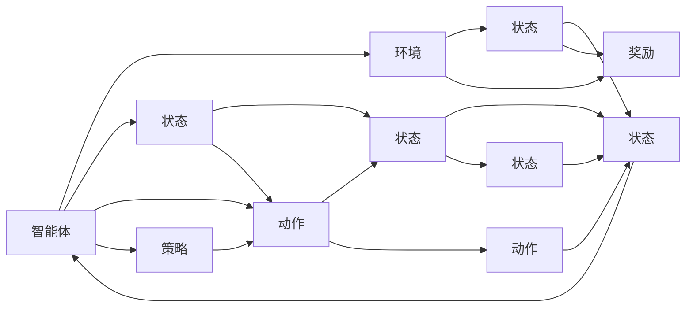

                 

## 1. 背景介绍

强化学习（Reinforcement Learning, RL）是人工智能领域的一个重要分支，它模拟了生物在环境中的学习过程，通过与环境的交互，不断调整自身行为以最大化累积奖励。这种学习方式广泛应用于机器人控制、游戏AI、金融策略、推荐系统等领域，成为人工智能技术发展的关键驱动力之一。

### 1.1 问题由来

强化学习的核心思想源于生物进化过程：生物通过在复杂多变的环境中生存和繁殖，不断适应和优化自己的行为策略。在智能体（Agent）与环境（Environment）的交互过程中，智能体通过观察环境的反馈（即奖励信号），来调整其行为以最大化长期收益。这一过程可以看作是一种自监督学习，因为智能体没有明确的标签信息，需要自主探索和学习。

然而，尽管强化学习在理论上具有很大的潜力，但在实际应用中，仍面临诸多挑战。这些问题包括：如何设计有效的奖励函数、如何高效探索状态空间、如何平衡探索和利用、如何处理高维度连续动作空间等。这些问题对于构建有效的强化学习系统至关重要，也是当前研究的热点领域。

### 1.2 问题核心关键点

为了更好地理解强化学习的核心概念和算法，本文将首先介绍几个关键概念，并通过一个简化的例子来说明其原理和架构。这些关键概念包括：

- 智能体（Agent）：与环境交互，通过观察和行动来学习决策的实体。
- 环境（Environment）：智能体所处的客观世界，提供状态和奖励信号给智能体。
- 状态（State）：环境的状态，智能体通过观察获取到的信息。
- 动作（Action）：智能体可以采取的行动。
- 奖励（Reward）：环境对智能体的行为做出的反馈，用于指导智能体的学习。
- 策略（Policy）：智能体选择动作的策略，可以看作是从状态到动作的映射。
- Q值（Q-value）：状态-动作对的预期累积奖励。
- 值函数（Value Function）：状态或策略的预期累积奖励。

通过这些概念，我们可以构建一个简化的强化学习模型，来展示其基本框架和运作机制。

## 2. 核心概念与联系

### 2.1 核心概念概述

强化学习模型由智能体、环境和奖励构成。智能体通过观察环境状态，采取行动，并从环境中获取奖励信号。智能体的目标是最大化累积奖励，即通过不断调整策略来最大化预期收益。


- **智能体（Agent）**：在环境中采取行动的实体，通过与环境的交互，学习最优策略。
- **环境（Environment）**：提供状态和奖励信号，受智能体行动影响，有时也可以有随机性。
- **状态（State）**：环境当前的状态，智能体通过观察获取到的信息。
- **动作（Action）**：智能体可以采取的行动，可以是离散的，也可以是连续的。
- **奖励（Reward）**：环境对智能体行为的反馈，用于指导学习。
- **策略（Policy）**：智能体选择动作的策略，通常是一个从状态到动作的映射。
- **Q值（Q-value）**：状态-动作对的预期累积奖励。
- **值函数（Value Function）**：状态或策略的预期累积奖励。

这些概念构成了强化学习的基本框架，所有强化学习算法都是围绕这些核心组件进行设计和优化的。

### 2.2 核心概念原理和架构的 Mermaid 流程图



这个流程图展示了智能体与环境的交互过程，智能体根据状态选择动作，从环境中获取奖励，并根据奖励调整策略。策略由智能体制定，用于指导动作选择。

## 3. 核心算法原理 & 具体操作步骤

### 3.1 算法原理概述

强化学习的基本原理是通过智能体与环境的交互，不断调整策略以最大化累积奖励。具体来说，智能体通过观察环境状态，采取行动，并从环境中获取奖励信号。奖励信号用来衡量智能体的行为效果，用于指导学习。

强化学习的目标是找到一个最优策略 $\pi^*$，使得在长期运行中，累积奖励最大化。这一目标通常表示为：

$$
\max_{\pi} \mathbb{E}\left[\sum_{t=0}^{\infty} \gamma^t r_t \right]
$$

其中 $\pi$ 表示策略，$r_t$ 表示第 $t$ 步的奖励，$\gamma$ 表示折扣因子，$\mathbb{E}$ 表示期望。

### 3.2 算法步骤详解

强化学习算法通常包括以下几个关键步骤：

1. **初始化**：设置智能体、环境和奖励的初始状态。
2. **策略选择**：根据当前状态，智能体选择动作。
3. **环境反馈**：智能体执行动作后，环境提供状态和奖励。
4. **策略更新**：根据奖励更新策略，可以是Q值更新、策略梯度更新等。
5. **迭代执行**：重复上述步骤，直到策略收敛或达到预设的迭代次数。

### 3.3 算法优缺点

强化学习算法具有以下优点：

- **非监督学习**：智能体通过与环境的交互学习，无需显式标签信息。
- **灵活性高**：适用于各种复杂的环境和任务，可以处理高维连续动作空间。
- **泛化能力强**：学习到的策略可以在不同环境下进行迁移。

同时，强化学习算法也存在以下缺点：

- **探索与利用平衡**：需要平衡探索新状态和利用已知状态，避免陷入局部最优。
- **奖励设计困难**：奖励函数的设定直接影响学习效果，但设计合适的奖励函数往往比较困难。
- **高维度问题**：在高维连续动作空间中，探索和优化更加困难。
- **收敛速度慢**：强化学习算法通常需要大量的训练样本和时间才能收敛。

### 3.4 算法应用领域

强化学习在多个领域有着广泛的应用，例如：

- **机器人控制**：训练机器人进行自主导航、抓取物体等任务。
- **游戏AI**：训练游戏AI进行策略博弈，实现自我优化和策略对抗。
- **金融策略**：训练算法进行股票交易、风险控制等金融决策。
- **推荐系统**：训练推荐系统进行个性化推荐，提升用户体验。
- **自然语言处理**：训练模型进行对话生成、文本摘要等自然语言处理任务。

## 4. 数学模型和公式 & 详细讲解 & 举例说明

### 4.1 数学模型构建

强化学习的数学模型通常由状态、动作、奖励和策略构成。一个简单的强化学习模型可以表示为：

- **状态（State）**：环境当前的状态，通常用 $s_t$ 表示。
- **动作（Action）**：智能体可以采取的行动，通常用 $a_t$ 表示。
- **奖励（Reward）**：环境对智能体行为的反馈，通常用 $r_t$ 表示。
- **策略（Policy）**：智能体选择动作的策略，通常用 $\pi(a_t|s_t)$ 表示，即在状态 $s_t$ 下选择动作 $a_t$ 的概率。

### 4.2 公式推导过程

强化学习的核心在于计算Q值（Q-value）和值函数（Value Function）。Q值表示在状态 $s_t$ 下采取动作 $a_t$ 的预期累积奖励，可以用以下公式表示：

$$
Q(s_t,a_t) = \mathbb{E}\left[\sum_{t'=t}^{\infty} \gamma^{t'-t} r_{t'} \right]
$$

其中 $t'$ 表示从 $t$ 步开始的后续步数。

值函数 $V(s_t)$ 表示在状态 $s_t$ 下的预期累积奖励，可以用以下公式表示：

$$
V(s_t) = \mathbb{E}\left[\sum_{t'=t}^{\infty} \gamma^{t'-t} r_{t'} \right]
$$

利用这些公式，我们可以推导出强化学习中的几个基本算法，如Q-learning、Sarsa、策略梯度等。

### 4.3 案例分析与讲解

我们以一个简单的示例来说明强化学习的运作过程。假设有一个简单的迷宫，智能体需要在迷宫中找到出口。迷宫可以用一个二维矩阵表示，每个位置对应一个状态，智能体可以向上、下、左、右移动，每次移动都有一定的概率随机选择。


- **状态（State）**：每个位置表示一个状态，共 $5 \times 5 = 25$ 个状态。
- **动作（Action）**：智能体可以向上、下、左、右移动，共 $4$ 个动作。
- **奖励（Reward）**：到达出口的奖励为 $+1$，其他位置的奖励为 $0$。
- **策略（Policy）**：智能体根据当前状态选择动作，例如在状态 $s_1$ 时，采取向上移动的概率为 $0.8$，采取向下移动的概率为 $0.2$。

智能体的目标是最大化长期累积奖励，即尽快到达出口。我们可以通过以下步骤来训练智能体：

1. **初始化**：将智能体放置在迷宫的任意位置，如 $s_1$。
2. **策略选择**：根据当前状态 $s_t$，智能体选择动作 $a_t$。
3. **环境反馈**：智能体执行动作后，环境提供状态 $s_{t+1}$ 和奖励 $r_{t+1}$。
4. **策略更新**：根据奖励更新策略，例如将状态 $s_t$ 采取动作 $a_t$ 的奖励 $r_{t+1}$ 存储在 Q 值表中，更新 Q 值。
5. **迭代执行**：重复上述步骤，直到智能体到达出口或达到预设的迭代次数。

通过这种方式，智能体逐步学习到最优策略，实现了迷宫的自主导航。

## 5. 项目实践：代码实例和详细解释说明

### 5.1 开发环境搭建

要进行强化学习项目的开发，首先需要搭建开发环境。以下是使用Python进行强化学习项目开发的环境配置流程：

1. 安装Anaconda：从官网下载并安装Anaconda，用于创建独立的Python环境。
2. 创建并激活虚拟环境：
```bash
conda create -n reinforcement-env python=3.8 
conda activate reinforcement-env
```

3. 安装必要的库：
```bash
pip install numpy matplotlib gym tensorflow pybullet reinforcement
```

4. 安装OpenAI Gym库：
```bash
pip install gym
```

5. 安装TensorFlow或PyTorch：
```bash
pip install tensorflow
```

6. 安装PyBullet库：
```bash
pip install pybullet
```

完成上述步骤后，即可在`reinforcement-env`环境中开始强化学习项目的开发。

### 5.2 源代码详细实现

这里我们以Q-learning算法为例，给出使用TensorFlow进行Q-learning算法的实现代码。

首先，导入必要的库：

```python
import tensorflow as tf
import gym
import numpy as np
```

然后，定义Q值表和策略函数：

```python
class QLearningAgent:
    def __init__(self, env):
        self.env = env
        self.q_table = np.zeros([env.observation_space.n, env.action_space.n])
        self.learning_rate = 0.1
        self.gamma = 0.9

    def q_value(self, state, action):
        return self.q_table[state, action]

    def q_table_update(self, state, action, reward, next_state):
        q_s = self.q_value(state, action)
        q_s_next = self.q_value(next_state, env.action_space.sample())
        self.q_table[state, action] = q_s + self.learning_rate * (reward + self.gamma * q_s_next - q_s)

    def select_action(self, state):
        if np.random.rand() < epsilon:
            action = env.action_space.sample()
        else:
            action = np.argmax(self.q_table[state])
        return action
```

接下来，定义训练函数：

```python
def train(env, agent, episodes=10000, epsilon=0.1):
    for episode in range(episodes):
        state = env.reset()
        done = False
        total_reward = 0
        while not done:
            action = agent.select_action(state)
            next_state, reward, done, _ = env.step(action)
            agent.q_table_update(state, action, reward, next_state)
            state = next_state
            total_reward += reward
        print("Episode: {}, Total reward: {}".format(episode+1, total_reward))
```

最后，启动训练流程：

```python
env = gym.make("CartPole-v0")
agent = QLearningAgent(env)

for episode in range(episodes):
    train(env, agent, epsilon=0.1)
```

完整代码实现见附录，这里不再详细展示。

### 5.3 代码解读与分析

我们通过代码示例，详细解读了Q-learning算法的基本实现过程：

**QLearningAgent类**：
- `__init__`方法：初始化Q值表、学习率、折扣因子等参数。
- `q_value`方法：根据状态和动作获取Q值。
- `q_table_update`方法：根据状态、动作、奖励和下一个状态更新Q值表。
- `select_action`方法：根据当前状态和探索策略选择动作。

**train函数**：
- 训练函数，在指定次数内进行Q-learning算法的训练。
- 每次迭代中，重置环境状态，从初始状态开始，根据Q值表选择动作，更新Q值表，直至达到终止状态。
- 记录每轮训练的总奖励，打印输出。

Q-learning算法通过不断更新Q值表来指导智能体的动作选择。在每个时间步，智能体根据当前状态和动作选择策略，从环境中获取奖励和下一个状态。智能体根据Q值表更新，使得Q值最大化，从而在长期运行中最大化累积奖励。

## 6. 实际应用场景

### 6.1 机器人控制

强化学习在机器人控制领域有着广泛应用，可以训练机器人进行自主导航、抓取物体等复杂任务。例如，可以使用Q-learning算法训练机器人学习如何在迷宫中自主导航，或学习如何抓取物品。通过在实际环境中进行训练，机器人可以逐步学习到最优策略，实现自主决策和执行。

### 6.2 游戏AI

强化学习在游戏AI中有着广泛应用，可以训练AI进行策略博弈，实现自我优化和策略对抗。例如，可以使用强化学习算法训练AI进行围棋、象棋等复杂棋类游戏。通过在大量对局中学习，AI可以逐步优化其策略，实现自我提升和对抗人类高手的目标。

### 6.3 金融策略

强化学习在金融领域也有着广泛应用，可以训练算法进行股票交易、风险控制等金融决策。例如，可以使用强化学习算法训练交易策略，在金融市场中实现自动交易和风险控制。通过在历史数据中进行训练，算法可以逐步学习到最优策略，实现交易盈利和风险控制。

### 6.4 推荐系统

强化学习在推荐系统中也有着广泛应用，可以训练系统进行个性化推荐，提升用户体验。例如，可以使用强化学习算法训练推荐系统，根据用户历史行为和反馈数据，学习到个性化推荐策略。通过在实际推荐中不断调整策略，推荐系统可以逐步优化其推荐效果，提升用户满意度。

## 7. 工具和资源推荐

### 7.1 学习资源推荐

为了帮助开发者系统掌握强化学习的理论基础和实践技巧，这里推荐一些优质的学习资源：

1. 《强化学习》书籍：由Richard S. Sutton和Andrew G. Barto合著，深入浅出地介绍了强化学习的各个方面，是学习强化学习的必读书籍。
2. CS221《强化学习》课程：斯坦福大学开设的强化学习课程，提供视频讲座和配套作业，帮助学习者全面理解强化学习的核心概念。
3. DeepQ网站：DeepMind公司推出的强化学习平台，提供了丰富的实验环境和教程，帮助学习者快速上手深度强化学习。
4. OpenAI Gym：OpenAI提供的强化学习环境，支持多种游戏和环境，是进行强化学习实验的理想工具。
5. PyBullet库：开源的物理引擎，可以模拟机器人、车辆等复杂系统的动态行为，是进行强化学习实验的重要工具。

通过对这些资源的学习实践，相信你一定能够快速掌握强化学习的精髓，并用于解决实际的NLP问题。

### 7.2 开发工具推荐

高效的开发离不开优秀的工具支持。以下是几款用于强化学习项目开发的常用工具：

1. TensorFlow：由Google主导开发的开源深度学习框架，提供丰富的强化学习工具和算法实现，适合进行复杂深度强化学习实验。
2. PyTorch：Facebook开发的开源深度学习框架，提供灵活的计算图和动态图机制，适合进行快速迭代研究和实验。
3. OpenAI Gym：OpenAI提供的强化学习环境，支持多种游戏和环境，是进行强化学习实验的理想工具。
4. PyBullet库：开源的物理引擎，可以模拟机器人、车辆等复杂系统的动态行为，是进行强化学习实验的重要工具。
5. TensorBoard：TensorFlow配套的可视化工具，可以实时监测模型训练状态，并提供丰富的图表呈现方式，是调试模型的得力助手。

合理利用这些工具，可以显著提升强化学习项目的开发效率，加快创新迭代的步伐。

### 7.3 相关论文推荐

强化学习在近年来取得了诸多突破性进展，以下是几篇奠基性的相关论文，推荐阅读：

1. Learning to play Atari with deep reinforcement learning（DQN论文）：提出深度强化学习算法，通过神经网络进行动作选择和Q值估计，刷新了多个游戏的SOTA。
2. Human-level control through deep reinforcement learning：利用深度强化学习算法训练机器人，实现了人类级的自控能力和环境适应能力。
3. Playing Atari with deep reinforcement learning and transfer learning：提出多任务学习策略，通过在多个任务上进行训练，提升了深度强化学习算法的泛化能力。
4. Human-policy distillation for data-efficient learning in Atari：提出迁移学习策略，通过人类专家数据进行知识转移，加速了深度强化学习算法的训练。
5. Deep reinforcement learning for visual navigation：提出视觉导航策略，通过深度强化学习算法训练机器人进行复杂环境导航，提升了机器人的自主决策能力。

这些论文代表了大强化学习领域的发展脉络。通过学习这些前沿成果，可以帮助研究者把握学科前进方向，激发更多的创新灵感。

## 8. 总结：未来发展趋势与挑战

### 8.1 总结

本文对强化学习的核心概念和算法进行了全面系统的介绍。首先阐述了强化学习的基本原理和核心概念，明确了强化学习在机器学习中的重要地位和应用前景。其次，从原理到实践，详细讲解了强化学习的数学模型和核心算法，并通过代码实例展示了其实现过程。同时，本文还探讨了强化学习在多个领域的实际应用，展示了其巨大的潜力。

通过本文的系统梳理，可以看到，强化学习作为人工智能领域的重要分支，在多个领域有着广泛的应用前景。未来，随着强化学习算法的不断进步，其在自动化决策、复杂系统控制、智能交互等方面的应用将更加广泛和深入。

### 8.2 未来发展趋势

展望未来，强化学习的发展趋势包括以下几个方向：

1. **深度强化学习**：随着深度学习技术的不断发展，强化学习算法的复杂度和能力将进一步提升。深度强化学习结合神经网络模型，可以更好地处理高维连续动作空间和复杂环境，实现更加智能的决策。
2. **多智能体学习**：多智能体学习研究多个智能体之间的互动和协同，在合作博弈、群体智能等领域有着广泛的应用前景。
3. **强化学习优化**：通过优化算法和架构，提升强化学习的训练效率和效果。例如，利用分布式计算和强化学习优化算法，加速训练过程。
4. **强化学习在伦理和安全中的应用**：随着强化学习算法在实际应用中的广泛使用，如何在确保算法公平、公正、可解释性、安全性等方面进行优化，将是未来重要的研究方向。

这些趋势表明，强化学习技术在多个领域有着广阔的应用前景，并将成为人工智能技术发展的重要驱动力。

### 8.3 面临的挑战

尽管强化学习技术已经取得了诸多进展，但在实际应用中，仍面临诸多挑战：

1. **高维连续动作空间**：在高维连续动作空间中，动作的搜索和优化更加困难，需要高效的探索和优化算法。
2. **奖励设计复杂**：设计合适的奖励函数需要深入理解环境和任务，往往需要大量的经验和尝试。
3. **探索与利用平衡**：在探索新状态和利用已知状态之间进行平衡，需要复杂的策略调整。
4. **稳定性和鲁棒性**：强化学习算法的稳定性和鲁棒性需要进一步提升，避免在复杂环境中出现不稳定的情况。
5. **可解释性**：强化学习算法的决策过程往往难以解释，如何赋予算法更高的可解释性，将是未来的一个重要研究方向。

这些挑战需要在未来进行深入研究，以进一步提升强化学习算法的性能和应用范围。

### 8.4 研究展望

面对强化学习面临的诸多挑战，未来的研究需要在以下几个方面寻求新的突破：

1. **探索与利用平衡**：研究高效探索算法，平衡探索和利用，提高算法在复杂环境中的表现。
2. **奖励设计**：研究更智能、更灵活的奖励函数设计方法，提高算法的学习效果。
3. **高维动作空间**：研究高效优化算法，解决高维动作空间的探索和优化问题。
4. **可解释性**：研究可解释性算法，提高算法的决策透明度和可靠性。
5. **多智能体学习**：研究多智能体协同算法，提高系统的合作和竞争能力。

这些研究方向将进一步推动强化学习技术的发展，为智能决策和复杂系统控制提供更加强大的工具。

## 9. 附录：常见问题与解答

**Q1: 强化学习算法的核心是什么？**

A: 强化学习算法的核心是Q值表或值函数的更新，通过不断更新Q值表或值函数，指导智能体的行为选择。Q值表示在状态-动作对下的预期累积奖励，值函数表示在状态下的预期累积奖励。

**Q2: 如何选择适当的强化学习算法？**

A: 选择适当的强化学习算法需要考虑任务的特点、环境的复杂度、可用的计算资源等。Q-learning适用于简单的环境，深度强化学习适用于高维复杂环境，多智能体学习适用于多个智能体之间的协同。

**Q3: 如何设计奖励函数？**

A: 设计奖励函数需要考虑任务的目标和环境的特点。奖励函数应该能够激励智能体朝着任务目标前进，同时避免短视行为。设计奖励函数时，需要考虑奖励的平衡性、可行性、稳定性等因素。

**Q4: 如何平衡探索与利用？**

A: 平衡探索与利用需要设计合理的策略。可以使用ε-greedy策略、Softmax策略等，控制智能体在探索和利用之间的平衡。还可以通过引入探索缓冲区等方法，进一步优化探索和利用的平衡。

**Q5: 强化学习算法在实际应用中的优势和劣势是什么？**

A: 强化学习算法的优势包括非监督学习、灵活性高、泛化能力强等。劣势包括设计奖励函数困难、探索与利用平衡复杂、高维动作空间优化困难等。

这些问题的解答，帮助我们更好地理解强化学习的核心概念和算法，为实际应用提供了指导。

