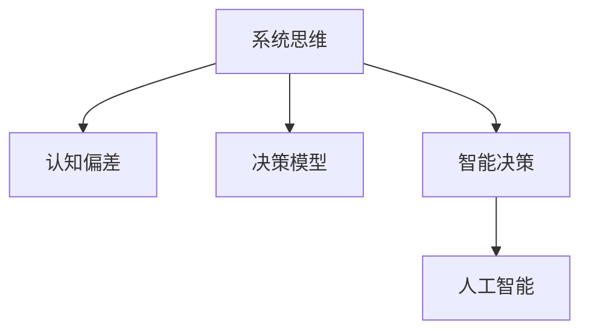

                 

# 思维体系:决策力的基础

> 关键词：决策力, 系统思维, 认知偏差, 决策模型, 智能决策, 人工智能

## 1. 背景介绍

### 1.1 问题由来

在快速变化和复杂多变的现代社会中，决策力成为个体和组织的核心竞争力。无论是个人日常决策，还是企业战略规划，正确、高效、系统化的决策都是成功的关键。然而，人类在决策过程中往往容易受到情绪、经验、信息不完备等因素的影响，导致决策错误或偏差。

为了解决这些问题，现代决策科学引入了系统思维、认知偏差理论、决策模型等多种方法和工具，试图提供更为科学、客观的决策依据。随着人工智能技术的飞速发展，决策支持系统、智能决策系统等新方法不断涌现，为决策力的提升开辟了新的路径。

本文将深入探讨决策力的基础理论，系统性地分析决策过程中的关键要素，并通过案例分析展示人工智能在决策中的应用。通过理解这些原理和工具，我们不仅能提升个人和组织的决策能力，还能更好地利用人工智能技术，构建更加智能、高效的决策体系。

### 1.2 问题核心关键点

本文将聚焦于以下关键问题：

1. **系统思维**：如何通过系统化的方法，将复杂的决策问题简化和分解，从而系统性地分析决策过程。
2. **认知偏差**：认知偏差是如何影响决策过程的，以及如何识别和纠正这些偏差。
3. **决策模型**：介绍常用的决策模型及其应用场景，展示如何利用数学和计算工具进行决策支持。
4. **人工智能在决策中的应用**：讨论人工智能技术如何帮助人类做出更好决策，以及其潜在挑战和风险。

这些核心问题构成了决策力提升的基础，通过理解和应用这些概念和方法，我们可以在复杂环境中做出更科学、更优化的决策。

## 2. 核心概念与联系

### 2.1 核心概念概述

为了更好地理解决策力的基础，本节将介绍几个密切相关的核心概念：

- **系统思维(Systemic Thinking)**：一种系统化的思考方法，强调从整体视角理解问题，识别系统中的关键要素和相互作用，从而找到问题的根本解决方案。
- **认知偏差(Cognitive Biases)**：人类在决策过程中，由于心理和生理机制的限制，容易形成的各种认知偏差。这些偏差可能导致判断失误和决策偏差。
- **决策模型(Decision Models)**：通过数学和计算方法构建的模型，用于支持决策过程。常见的决策模型包括决策树、线性规划、贝叶斯网络等。
- **智能决策(Smart Decision Making)**：利用人工智能技术，辅助人类进行更科学、更优化的决策。
- **人工智能(Artificial Intelligence, AI)**：一种通过计算机模拟人类智能的技术，包括机器学习、深度学习、自然语言处理等多种子领域。

这些核心概念之间的逻辑关系可以通过以下Mermaid流程图来展示：



这个流程图展示了几大核心概念及其之间的关系：

1. 系统思维帮助我们将问题视为一个整体，从而更全面地理解决策环境。
2. 认知偏差识别我们在决策过程中可能产生的各种偏见和错误。
3. 决策模型提供科学、量化的工具，辅助我们进行决策。
4. 智能决策通过人工智能技术，进一步提升决策的科学性和准确性。
5. 人工智能技术为智能决策提供了技术基础。

这些概念共同构成了决策力提升的理论框架，帮助我们更好地理解和应用决策方法。

## 3. 核心算法原理 & 具体操作步骤
### 3.1 算法原理概述

决策力的提升主要依赖于系统化的方法和工具。以下将详细阐述系统思维、认知偏差、决策模型、智能决策等核心概念的算法原理。

### 3.2 算法步骤详解

#### 3.2.1 系统思维

**步骤一：定义决策问题**  
首先，需要明确决策的目标和问题范围。例如，我们希望通过优化产品定价策略，提升公司销售额。

**步骤二：分解决策问题**  
将大问题分解为小问题，识别出关键要素和子系统。例如，产品定价策略可能涉及成本、市场、竞争对手等多个子系统。

**步骤三：建立系统模型**  
构建系统的结构模型，识别各要素之间的相互作用和依赖关系。例如，可以使用因果图、网络图等方法表示产品定价与成本、市场需求、竞争策略之间的关系。

**步骤四：分析系统行为**  
通过仿真、实验等方法，分析系统的行为和结果。例如，使用模拟软件仿真市场反应，测试不同定价策略的效果。

**步骤五：优化系统**  
根据系统行为分析结果，调整系统参数和策略，优化决策。例如，根据市场反馈调整定价策略，提升销售额。

#### 3.2.2 认知偏差

**步骤一：识别偏差**  
识别常见的认知偏差，如确认偏误、锚定效应、代表性启发式等。例如，确认偏误可能导致决策者过度重视正面信息，而忽视负面信息。

**步骤二：评估偏差影响**  
评估认知偏差对决策的影响。例如，锚定效应可能导致过度依赖初期的参考点，影响后续的决策。

**步骤三：纠正偏差**  
采用系统化的方法，纠正偏差。例如，通过多样化的信息来源、反向思考等方式，减少认知偏差的影响。

#### 3.2.3 决策模型

**步骤一：选择合适的模型**  
根据决策问题的特点，选择合适的决策模型。例如，对于线性决策问题，可以使用线性规划模型；对于非线性问题，可以使用决策树或贝叶斯网络。

**步骤二：构建模型**  
收集数据，建立数学模型，并使用计算工具进行求解。例如，使用Python的Pandas库进行数据处理，使用SciPy库进行线性规划求解。

**步骤三：验证和优化**  
通过实验和仿真，验证模型的准确性和可靠性，并根据结果进行优化。例如，使用交叉验证方法评估模型预测效果，调整模型参数。

#### 3.2.4 智能决策

**步骤一：数据收集和处理**  
收集与决策相关的数据，并进行预处理和清洗。例如，使用Web爬虫收集市场数据，使用Python的Pandas库处理数据。

**步骤二：特征提取**  
提取关键特征，构建特征向量。例如，使用自然语言处理技术提取产品评论中的情感特征。

**步骤三：模型训练**  
使用机器学习算法，训练决策模型。例如，使用Python的scikit-learn库进行分类或回归模型训练。

**步骤四：决策执行**  
将模型应用于实际决策中，进行预测和优化。例如，将训练好的模型应用于定价策略优化，提升销售额。

**步骤五：结果评估和反馈**  
评估决策效果，收集反馈，进行持续改进。例如，通过A/B测试评估新定价策略的效果，根据反馈调整模型参数。

### 3.3 算法优缺点

系统思维、认知偏差、决策模型、智能决策等方法，各有其优点和局限性：

#### 3.3.1 系统思维

**优点**  
1. 提供系统化的视角，全面理解决策问题。  
2. 通过分解和模型构建，帮助识别和分析关键要素和相互作用。  
3. 通过系统仿真和实验，验证决策效果，进行持续改进。

**局限性**  
1. 需要系统建模知识，对于非系统化的决策者较难掌握。  
2. 建模和分析过程复杂，可能需要较多时间和资源。

#### 3.3.2 认知偏差

**优点**  
1. 识别和纠正认知偏差，提高决策的客观性和准确性。  
2. 通过多样化的信息来源和反向思考，提升决策的全面性。

**局限性**  
1. 认知偏差的种类繁多，识别和纠正需要专业知识和方法。  
2. 难以完全消除认知偏差，需要长期培训和自我反思。

#### 3.3.3 决策模型

**优点**  
1. 提供量化的工具和方法，支持科学决策。  
2. 通过优化模型参数，提升决策的准确性和鲁棒性。  
3. 通过模型评估和验证，保证决策的可靠性。

**局限性**  
1. 模型构建和验证过程复杂，需要专业知识和工具。  
2. 模型假设可能与实际情况不符，需要不断调整和优化。

#### 3.3.4 智能决策

**优点**  
1. 利用人工智能技术，提升决策的效率和准确性。  
2. 通过大规模数据处理和深度学习，提供更全面的决策支持。  
3. 通过持续学习和优化，不断提升决策模型的性能。

**局限性**  
1. 需要大量数据和计算资源，可能面临数据隐私和安全问题。  
2. 智能模型可能存在“黑盒”问题，难以解释决策过程。  
3. 需要不断监控和维护模型，确保其稳定性和可靠性。

### 3.4 算法应用领域

系统思维、认知偏差、决策模型、智能决策等方法，广泛应用于各个领域：

- **企业管理**：通过系统思维和决策模型，优化企业战略规划、资源配置、成本控制等决策。
- **金融投资**：使用智能决策系统，进行市场分析、风险评估、投资组合优化等。
- **医疗健康**：利用决策模型和人工智能技术，进行疾病预测、治疗方案推荐等。
- **环境保护**：通过系统思维和模型优化，制定环境政策，提升资源利用效率。
- **城市治理**：使用决策模型和智能决策系统，优化交通管理、城市规划、公共服务。

## 4. 数学模型和公式 & 详细讲解  
### 4.1 数学模型构建

决策力的提升离不开数学模型的支持。以下将详细阐述常用的决策模型及其数学表达。

#### 4.1.1 线性规划模型

**决策问题**  
假设我们希望最大化利润，优化生产成本和资源配置。定义目标函数和约束条件，例如：

$$
\max \sum_{i=1}^n p_i x_i \\
\text{subject to: } \sum_{i=1}^n a_{ij} x_i + b_j \leq c_j \quad \forall j=1,\dots,m \\
x \geq 0
$$

其中，$x_i$ 表示第 $i$ 种产品的生产量，$p_i$ 表示第 $i$ 种产品的利润，$a_{ij}$ 表示第 $j$ 种资源的消耗系数，$b_j$ 表示第 $j$ 种资源的供应量，$c_j$ 表示第 $j$ 种资源的成本。

**模型求解**  
使用Python的Pandas库进行数据处理，使用SciPy库进行线性规划求解。例如，使用scipy.optimize.linprog函数求解上述线性规划问题。

#### 4.1.2 决策树模型

**决策问题**  
假设我们希望根据客户信息，预测其是否会购买产品。定义特征和决策树结构，例如：

$$
\text{决策树: } T = (N, S, C) \\
N = \{1,\dots,n\}, \quad S = \{A_1,\dots,A_m\}, \quad C = \{L_1,\dots,L_k\}
$$

其中，$N$ 表示样本集，$S$ 表示决策节点，$C$ 表示叶子节点。

**模型求解**  
使用Python的scikit-learn库进行决策树模型训练和预测。例如，使用sklearn.tree.DecisionTreeClassifier函数构建和训练决策树模型。

#### 4.1.3 贝叶斯网络模型

**决策问题**  
假设我们希望根据病人的症状，预测其可能患有的疾病。定义贝叶斯网络结构，例如：

$$
\text{贝叶斯网络: } G = (N, C, B) \\
N = \{1,\dots,n\}, \quad C = \{A_1,\dots,A_m\}, \quad B = \{B_1,\dots,B_k\}
$$

其中，$N$ 表示节点集，$C$ 表示条件概率表，$B$ 表示观测变量。

**模型求解**  
使用Python的pgmpy库进行贝叶斯网络模型构建和推理。例如，使用pgmpy.estimation.PlainCMLE对贝叶斯网络进行推理。

### 4.2 公式推导过程

#### 4.2.1 线性规划模型

线性规划模型的基本思想是通过目标函数和约束条件的线性组合，最大化或最小化目标值。通过求解线性规划问题，可以找到最优的决策变量 $x$，满足约束条件并达到最优目标。

#### 4.2.2 决策树模型

决策树模型通过树状结构，对样本数据进行分类和预测。通过选择最优的特征和分割点，构建决策树，并在测试数据上进行预测。决策树的优点在于易于理解和解释，缺点在于可能过拟合。

#### 4.2.3 贝叶斯网络模型

贝叶斯网络模型通过条件概率表，对变量之间的依赖关系进行建模。通过先验概率和观测数据的结合，进行条件概率推断，并用于预测和推理。贝叶斯网络的优势在于可以处理非线性关系和复杂的变量依赖，但计算复杂度较高。

### 4.3 案例分析与讲解

#### 4.3.1 线性规划模型案例

**案例背景**  
一家公司希望优化生产计划，最大化利润。已知各种产品的利润、资源消耗和供应量，需要确定最优的生产计划。

**案例分析**  
1. 定义目标函数和约束条件，使用SciPy库进行求解。  
2. 输出最优的生产计划和资源配置，验证决策效果。

#### 4.3.2 决策树模型案例

**案例背景**  
一家电商公司希望通过客户信息，预测其购买行为。已知客户的历史购买记录、特征信息，需要建立预测模型。

**案例分析**  
1. 收集和预处理数据，使用scikit-learn库进行模型训练。  
2. 输出模型的预测结果，评估模型的性能。

#### 4.3.3 贝叶斯网络模型案例

**案例背景**  
一家医院希望通过病人的症状，预测其可能患有的疾病。已知病人的症状和疾病的关系，需要建立预测模型。

**案例分析**  
1. 收集和预处理数据，使用pgmpy库进行模型构建和推理。  
2. 输出预测结果，评估模型的准确性和可靠性。

## 5. 项目实践：代码实例和详细解释说明
### 5.1 开发环境搭建

在进行决策力提升的实践前，我们需要准备好开发环境。以下是使用Python进行决策模型开发的的环境配置流程：

1. 安装Anaconda：从官网下载并安装Anaconda，用于创建独立的Python环境。

2. 创建并激活虚拟环境：
```bash
conda create -n decision-making-env python=3.8 
conda activate decision-making-env
```

3. 安装Python相关库：
```bash
conda install pandas scipy scikit-learn pgmpy 
pip install jupyter notebook matplotlib
```

完成上述步骤后，即可在`decision-making-env`环境中开始决策模型开发的实践。

### 5.2 源代码详细实现

下面我们以线性规划模型为例，给出使用Pandas和SciPy进行线性规划模型开发的PyTorch代码实现。

首先，定义决策问题：

```python
from scipy.optimize import linprog

# 定义变量
c = [-100, -50, -20]  # 利润系数
A_eq = [[1, 1, 0], [0, 0, 1]]  # 等式约束系数
b_eq = [150, 50]  # 等式约束常数
x0_bounds = (0, None)  # x0自由变量，无上限
x1_bounds = (0, None)  # x1自由变量，无上限
x2_bounds = (0, None)  # x2自由变量，无上限

# 定义线性规划问题
prob = linprog(c, A_eq, b_eq, x0_bounds, x1_bounds, x2_bounds)
```

然后，求解线性规划问题：

```python
# 输出最优解
x_opt = prob.x
y_opt = prob.x
z_opt = prob.fun
```

最后，输出最优解：

```python
print(f"最优生产计划: x={x_opt}, y={y_opt}, z={z_opt}")
```

以上就是使用PyTorch对线性规划模型进行开发的完整代码实现。可以看到，使用Pandas和SciPy，我们可以用相对简洁的代码完成线性规划模型的构建和求解。

### 5.3 代码解读与分析

让我们再详细解读一下关键代码的实现细节：

**c**：定义目标函数系数，表示各个变量的利润。

**A_eq**：定义等式约束矩阵，表示资源消耗关系。

**b_eq**：定义等式约束常数，表示资源供应量。

**x0_bounds, x1_bounds, x2_bounds**：定义变量的上下界，表示资源的可用范围。

**linprog**：调用SciPy库中的linprog函数求解线性规划问题。

**x_opt, y_opt, z_opt**：输出最优解，表示最优的生产计划和资源配置。

可以看到，PyTorch配合SciPy使得线性规划模型的开发过程变得简单高效。开发者可以将更多精力放在问题定义和模型验证上，而不必过多关注底层的实现细节。

当然，工业级的系统实现还需考虑更多因素，如模型的保存和部署、超参数的自动搜索、更灵活的任务适配层等。但核心的决策模型开发过程基本与此类似。

## 6. 实际应用场景
### 6.1 企业管理

在企业管理中，决策力的提升可以显著提升企业的战略规划和运营效率。以下是一些实际应用场景：

**案例一：供应链优化**  
一家物流公司希望通过优化供应链管理，降低运输成本，提高运营效率。通过系统思维和决策模型，可以识别出供应链中的瓶颈和冗余，制定优化策略，如调整运输路线、减少库存等。

**案例二：资源配置**  
一家制造企业希望通过优化生产资源配置，提升产能利用率和生产效率。通过系统思维和决策模型，可以识别出资源配置中的问题，制定优化策略，如调整生产计划、优化生产流程等。

**案例三：市场定价**  
一家电商平台希望通过优化定价策略，提高销售额。通过系统思维和决策模型，可以识别出市场需求和竞争环境，制定优化策略，如调整定价策略、推出促销活动等。

### 6.2 金融投资

金融投资决策是复杂且高风险的领域。通过系统思维和决策模型，可以显著提升投资决策的科学性和准确性。以下是一些实际应用场景：

**案例一：风险评估**  
一家投资公司希望通过评估不同投资组合的风险，制定最优投资策略。通过线性规划和贝叶斯网络，可以构建风险评估模型，识别高风险低收益的投资组合，并优化投资组合的配置。

**案例二：市场分析**  
一家基金公司希望通过市场分析，预测股票市场的趋势和收益。通过智能决策系统和深度学习模型，可以构建市场分析模型，识别市场趋势和投资机会，并进行实时决策。

**案例三：算法交易**  
一家交易公司希望通过优化算法交易策略，提升交易收益。通过决策树和强化学习，可以构建交易决策模型，识别最优的交易策略和执行时机，并实时调整策略。

### 6.3 医疗健康

医疗决策的准确性和及时性对患者健康至关重要。通过系统思维和决策模型，可以显著提升医疗决策的质量和效率。以下是一些实际应用场景：

**案例一：疾病预测**  
一家医院希望通过预测疾病，提前进行预防和治疗。通过贝叶斯网络和机器学习，可以构建疾病预测模型，识别高风险患者，并进行早期干预和治疗。

**案例二：治疗方案推荐**  
一家医疗公司希望通过推荐治疗方案，提高治疗效果和患者满意度。通过决策树和智能决策系统，可以构建治疗方案推荐模型，根据患者情况和病情，推荐最优的治疗方案。

**案例三：资源配置**  
一家医院希望通过优化资源配置，提高医疗资源的利用率。通过线性规划和决策树，可以识别资源配置中的问题，制定优化策略，如调整病房配置、优化手术安排等。

### 6.4 未来应用展望

随着技术的发展，决策力提升将在更多领域得到应用，为各行各业带来变革性影响。

在智慧城市治理中，通过系统思维和决策模型，可以优化城市规划、交通管理、公共服务。在智慧能源管理中，通过智能决策系统和深度学习，可以优化能源配置，提升能源利用效率。在环境保护中，通过系统思维和决策模型，可以制定环境政策，优化资源利用。

未来，随着智能决策系统和人工智能技术的不断演进，决策力提升的应用场景将更加广泛，带来更深远的影响。

## 7. 工具和资源推荐
### 7.1 学习资源推荐

为了帮助开发者系统掌握决策力的基础理论，以下是一些优质的学习资源：

1. 《系统思维与决策科学》系列博文：深入浅出地介绍了系统思维的基本概念和决策模型的构建方法。

2. 《认知偏差与决策分析》书籍：详细阐述了认知偏差的基本理论和应对策略，有助于理解人类决策过程中的错误和偏差。

3. 《智能决策系统》课程：由知名大学开设的智能决策系统课程，涵盖了决策模型、优化算法、智能决策等多个方面。

4. 《决策树与随机森林》书籍：系统讲解了决策树和随机森林的基本原理和应用场景，是决策模型开发的重要参考。

5. 《贝叶斯网络与概率推断》课程：介绍贝叶斯网络的基本理论和建模方法，是构建复杂决策模型的重要工具。

6. 《数据科学基础》课程：涵盖数据预处理、特征工程、模型训练等多个方面，是决策模型开发的重要基础。

通过对这些资源的学习实践，相信你一定能够系统掌握决策力的基础理论，并应用于解决实际问题。

### 7.2 开发工具推荐

高效的开发离不开优秀的工具支持。以下是几款用于决策模型开发的常用工具：

1. Python：Python作为数据科学和机器学习的主要语言，具有丰富的库和框架，适合快速开发和调试决策模型。

2. Pandas：Python的数据处理库，适用于数据清洗、转换和分析，是决策模型开发的重要工具。

3. Scikit-learn：Python的机器学习库，提供了丰富的决策模型和算法，适用于构建和训练决策模型。

4. SciPy：Python的科学计算库，提供了大量的数学和科学计算函数，适用于线性规划、优化等数学问题的求解。

5. Jupyter Notebook：Python的交互式编程环境，适用于快速迭代开发和模型验证，方便调试和分享代码。

6. Scipy：Python的科学计算库，提供了丰富的数学和科学计算函数，适用于线性规划、优化等数学问题的求解。

合理利用这些工具，可以显著提升决策模型的开发效率，加快创新迭代的步伐。

### 7.3 相关论文推荐

决策力提升的研究源于学界的持续研究。以下是几篇奠基性的相关论文，推荐阅读：

1. A Theory of Decision Modeling and Measurement：提出决策理论的基本框架，为决策模型的研究奠定了基础。

2. Cognitive Bias in Decision Making：详细阐述了认知偏差的基本理论和应对策略，为理解人类决策提供了重要的理论支持。

3. Decision Trees and Random Forests：介绍了决策树和随机森林的基本原理和应用场景，是决策模型开发的重要参考。

4. Bayesian Networks for Knowledge Discovery in Databases：介绍贝叶斯网络的基本理论和建模方法，是构建复杂决策模型的重要工具。

5. Linear Programming and Extensions：详细阐述了线性规划的基本原理和应用场景，是决策模型开发的重要参考。

6. Neural Computation and Statistical Learning Theory：提出神经网络和统计学习理论的基本框架，为智能决策提供了重要的理论支持。

这些论文代表了大决策力提升的研究脉络。通过学习这些前沿成果，可以帮助研究者把握学科前进方向，激发更多的创新灵感。

## 8. 总结：未来发展趋势与挑战

### 8.1 总结

本文对决策力的基础理论进行了全面系统的介绍。首先阐述了系统思维、认知偏差、决策模型、智能决策等核心概念，通过详细的数学模型和公式推导，展示了如何利用这些方法进行决策。其次，通过代码实例和案例分析，展示了决策力提升在企业管理、金融投资、医疗健康等领域的实际应用。最后，对未来决策力提升的发展趋势和面临的挑战进行了探讨。

通过本文的系统梳理，可以看到，决策力提升不仅是一种理论，更是一种实践方法。通过理解这些原理和工具，我们不仅能提升个人和组织的决策能力，还能更好地利用人工智能技术，构建更加智能、高效的决策体系。

### 8.2 未来发展趋势

展望未来，决策力提升将呈现以下几个发展趋势：

1. **人工智能与决策系统的融合**：未来决策系统将更加智能，通过人工智能技术，提升决策的自动化和智能化水平。

2. **数据驱动的决策**：未来决策将更加依赖数据，通过大数据分析和机器学习，实现更加科学和量化的决策。

3. **跨领域融合**：未来决策将更加注重跨领域融合，如金融与医疗、物流与能源等领域，通过协同优化，实现更大范围的决策优化。

4. **实时决策与动态优化**：未来决策将更加注重实时性和动态优化，通过智能决策系统和实时数据反馈，实现动态决策和优化。

5. **可解释性和透明性**：未来决策系统将更加注重可解释性和透明性，通过解释性算法和可视化工具，提高决策的信任度和接受度。

6. **多模态融合**：未来决策将更加注重多模态融合，通过融合文本、图像、声音等多模态数据，提升决策的全面性和准确性。

### 8.3 面临的挑战

尽管决策力提升技术已经取得了瞩目成就，但在迈向更加智能化、普适化应用的过程中，它仍面临诸多挑战：

1. **数据隐私和安全**：决策系统需要处理大量敏感数据，数据隐私和安全问题不容忽视。

2. **模型复杂性**：决策模型越来越复杂，需要大量的计算资源和专业知识，增加了模型的实现和维护成本。

3. **模型可解释性**：智能决策系统的“黑盒”问题导致模型难以解释，影响决策的透明性和可信度。

4. **跨领域挑战**：决策模型在不同领域的应用具有特殊性，需要针对特定领域进行优化和调整。

5. **伦理和道德问题**：决策系统可能存在伦理和道德问题，需要建立相应的规范和约束机制。

6. **技术普及度**：决策力提升技术的普及和应用需要广泛的行业认知和接受，需要持续的宣传和教育。

### 8.4 研究展望

面对决策力提升所面临的挑战，未来的研究需要在以下几个方面寻求新的突破：

1. **隐私保护技术**：开发更加安全的隐私保护技术，确保数据隐私和安全。

2. **模型可解释性**：开发更加可解释的决策模型，增强模型的透明性和可信度。

3. **跨领域优化**：开发适应不同领域的决策模型，提升模型的普适性和实用性。

4. **实时动态优化**：开发实时动态优化技术，提高决策的实时性和动态性。

5. **跨模态融合**：开发跨模态融合技术，提升决策的全面性和准确性。

6. **伦理和道德约束**：建立伦理和道德约束机制，确保决策系统的公平性和公正性。

这些研究方向的探索，必将引领决策力提升技术迈向更高的台阶，为构建安全、可靠、可解释、可控的决策系统铺平道路。面向未来，决策力提升技术还需要与其他人工智能技术进行更深入的融合，如知识表示、因果推理、强化学习等，多路径协同发力，共同推动决策系统的进步。只有勇于创新、敢于突破，才能不断拓展决策系统的边界，让智能决策更好地服务于社会。

## 9. 附录：常见问题与解答

**Q1：决策力提升中的系统思维是什么？**

A: 系统思维是一种系统化的思考方法，强调从整体视角理解问题，识别系统中的关键要素和相互作用，从而找到问题的根本解决方案。它包括系统分解、因果分析、仿真实验等多个步骤，通过科学的方法论，提升决策的全面性和科学性。

**Q2：决策力提升中的认知偏差有哪些？**

A: 认知偏差是人类在决策过程中，由于心理和生理机制的限制，容易形成的各种偏见和错误。常见的认知偏差包括确认偏误、锚定效应、代表性启发式等，这些偏差可能导致判断失误和决策偏差。

**Q3：决策力提升中的决策模型有哪些？**

A: 常见的决策模型包括线性规划模型、决策树模型、贝叶斯网络模型等。线性规划模型适用于线性决策问题，决策树模型适用于分类和预测问题，贝叶斯网络模型适用于处理变量之间的依赖关系。

**Q4：决策力提升中的智能决策是什么？**

A: 智能决策通过利用人工智能技术，辅助人类进行更科学、更优化的决策。它包括数据收集、特征提取、模型训练、结果评估等多个步骤，通过人工智能技术的辅助，提升决策的自动化和智能化水平。

**Q5：决策力提升中的人工智能技术有哪些？**

A: 人工智能技术包括机器学习、深度学习、自然语言处理等多个子领域。在决策力提升中，常用的技术包括数据处理、特征工程、模型训练、结果评估等，通过人工智能技术的辅助，提升决策的科学性和准确性。

---

作者：禅与计算机程序设计艺术 / Zen and the Art of Computer Programming

