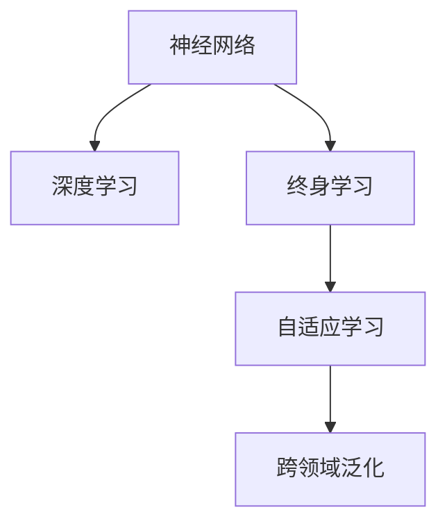

                 

# 思维的可塑性：终身学习的神经基础

> 关键词：可塑性, 神经基础, 终身学习, 认知神经科学, 深度学习, 人工智能

## 1. 背景介绍

### 1.1 问题由来
随着人工智能技术的快速发展，终身学习这一概念在认知科学和机器学习领域引起了广泛的关注。终身学习强调了学习的重要性，不仅限于儿童和青少年，也适用于成年人甚至是老年人的学习。这一理念与当前人工智能技术的进展相契合，尤其是深度学习领域。深度学习模型的复杂性和可塑性使其具备强大的学习能力，能够随着时间推移逐渐提升性能。

### 1.2 问题核心关键点
深度学习模型的可塑性源自其复杂的结构和大规模的参数，这种特性使其能够通过持续的训练和学习不断提升性能。这一过程被称为"终身学习"，其核心在于模型能够在不断接受新数据的同时，自我优化和更新，适应新的环境和任务。

终身学习的关键点包括：
1. **数据驱动的更新**：模型能够从不断更新的数据中学习，调整内部参数以提高性能。
2. **自适应学习机制**：深度学习模型能够自动调整学习率、优化器等参数，以适应数据的变化。
3. **跨领域泛化**：模型能够在不同的领域和任务上进行泛化，提升其通用性。

终身学习在人工智能的应用中具有重要意义，能够提升模型的适应性和鲁棒性，推动技术在更多领域的应用。

### 1.3 问题研究意义
研究终身学习对于提升人工智能技术的泛化能力、适应性和长期性能具有重要意义：

1. **提升模型性能**：终身学习使得模型能够不断从新数据中学习，适应新的环境，从而提升模型的泛化能力和性能。
2. **降低开发成本**：通过终身学习，模型能够在不断迭代中逐渐优化，减少了从头开发所需的成本和时间。
3. **增强系统可维护性**：终身学习模型能够自动适应新数据和环境变化，减少维护成本。
4. **推动技术进步**：终身学习为深度学习模型的长期演进提供了新的思路，推动了人工智能技术的进一步发展。
5. **拓展应用场景**：终身学习模型能够适应更多场景，推动人工智能技术在各行业中的应用。

## 2. 核心概念与联系

### 2.1 核心概念概述

为更好地理解终身学习的神经基础，本节将介绍几个密切相关的核心概念：

- **神经网络**：由人工神经元（节点）组成的计算模型，通过反向传播算法进行参数更新，能够执行复杂的计算和模式识别任务。
- **深度学习**：利用多层神经网络结构，通过梯度下降等优化算法，自动学习和提取数据的高级特征。
- **终身学习**：神经网络能够在其生命周期中，持续从新数据中学习，优化自身参数以适应新环境。
- **自适应学习**：神经网络能够根据输入数据的变化，自动调整学习参数，优化自身的性能。
- **跨领域泛化**：神经网络能够将在一个领域中学到的知识，泛化应用到另一个领域中，提升模型的通用性。

这些概念之间的逻辑关系可以通过以下Mermaid流程图来展示：



这个流程图展示了几大核心概念及其之间的关系：

1. 神经网络是深度学习的基础，通过多层神经网络结构进行复杂的计算和模式识别。
2. 深度学习通过反向传播算法优化神经网络参数，自动学习数据的高级特征。
3. 终身学习使得神经网络能够在持续的数据流中学习，不断优化自身性能。
4. 自适应学习机制使神经网络能够根据输入数据的变化，自动调整学习参数。
5. 跨领域泛化能力使得神经网络能够将在一个领域中学到的知识，应用到其他领域中。

这些概念共同构成了深度学习模型的基础，使得模型能够在不断更新的环境中保持高性能和通用性。

## 3. 核心算法原理 & 具体操作步骤
### 3.1 算法原理概述

终身学习的大致流程如下：
1. 初始化神经网络模型。
2. 收集并准备数据集，包含训练集和测试集。
3. 设置学习率、优化器等超参数，进行模型训练。
4. 在测试集上评估模型性能，进行模型优化。
5. 重复上述步骤，持续更新模型参数，实现终身学习。

### 3.2 算法步骤详解

终身学习的具体步骤如下：

**Step 1: 初始化模型参数**
- 设置神经网络的基本架构，如层数、节点数等。
- 初始化模型的权重和偏置参数，通常采用随机初始化。
- 设定学习率和优化器，如Adam、SGD等。

**Step 2: 数据准备**
- 收集训练数据集，通常需要划分训练集、验证集和测试集。
- 对数据进行预处理，包括数据增强、标准化等。

**Step 3: 模型训练**
- 在训练集上使用优化算法更新模型参数。
- 在每个epoch中，通过前向传播和反向传播计算损失函数，更新模型权重。
- 使用验证集评估模型性能，防止过拟合。

**Step 4: 模型评估**
- 在测试集上评估模型性能，计算准确率、召回率、F1分数等指标。
- 根据测试集性能，调整模型参数和超参数。

**Step 5: 持续学习**
- 在新的数据集上重复训练和评估，更新模型参数。
- 持续收集新数据，进行模型微调，保持模型性能。

### 3.3 算法优缺点

终身学习的优点包括：
1. **自适应性强**：能够在不断更新的数据中学习，自动调整参数以适应新环境。
2. **泛化能力强**：通过跨领域泛化，能够将在一个领域中学到的知识应用到其他领域。
3. **灵活性高**：模型可以根据新的数据和任务，自动进行微调，提升性能。
4. **减少开发成本**：无需从头开发新模型，能够通过持续学习提升性能。

同时，终身学习也存在一些缺点：
1. **计算资源消耗大**：需要不断收集新数据并重新训练，计算资源消耗较大。
2. **模型复杂度高**：终身学习模型通常具有较大的参数量，复杂度高。
3. **易受干扰**：模型可能会受到输入数据的干扰，导致性能波动。
4. **依赖数据质量**：训练数据的质量和多样性直接影响模型性能。

尽管存在这些缺点，但终身学习在人工智能中的应用前景广阔，是提升模型性能和通用性的重要方法。

### 3.4 算法应用领域

终身学习的应用领域广泛，包括但不限于：

- **计算机视觉**：在图像识别、目标检测、图像生成等领域，持续学习能够提升模型的泛化能力和识别精度。
- **自然语言处理**：在机器翻译、文本分类、情感分析等领域，持续学习能够提升模型的理解和生成能力。
- **语音识别**：在语音识别、语音合成等领域，持续学习能够提升模型的鲁棒性和泛化能力。
- **推荐系统**：在推荐系统、广告投放等领域，持续学习能够提升模型的个性化推荐能力。
- **医疗健康**：在医疗诊断、个性化医疗等领域，持续学习能够提升模型的诊断准确性和患者个性化治疗。

## 4. 数学模型和公式 & 详细讲解 & 举例说明

### 4.1 数学模型构建

终身学习的数学模型可以表示为：
- 神经网络结构：$N$层，每层包含$n_i$个节点。
- 输入数据：$x \in \mathbb{R}^d$。
- 输出数据：$y \in \mathbb{R}^k$。
- 模型参数：$\theta = \{\omega_i, b_i\}_{i=1}^N$，其中$\omega_i \in \mathbb{R}^{n_{i+1} \times n_i}$，$b_i \in \mathbb{R}^{n_{i+1}}$。

其中，$\omega_i$表示第$i$层神经元的权重矩阵，$b_i$表示第$i$层神经元的偏置向量。

### 4.2 公式推导过程

设神经网络模型在输入$x$上的输出为$y=\hat{y}$，模型在训练数据集$D$上的损失函数为$\mathcal{L}$。训练过程通过梯度下降算法进行参数更新：

$$
\theta \leftarrow \theta - \eta \nabla_{\theta}\mathcal{L}(\theta)
$$

其中，$\eta$为学习率，$\nabla_{\theta}\mathcal{L}(\theta)$为损失函数对模型参数的梯度。

在实际应用中，损失函数通常为均方误差（MSE）或交叉熵（CE）。以均方误差为例，目标是最小化均方误差损失函数：

$$
\mathcal{L}(\theta) = \frac{1}{2N} \sum_{i=1}^N \|y_i - \hat{y}_i\|^2
$$

其中，$y_i$和$\hat{y}_i$分别为输入数据$x_i$的真实标签和模型预测值。

### 4.3 案例分析与讲解

以图像分类任务为例，展示终身学习的应用。

**Step 1: 数据准备**
- 收集图像数据集，如CIFAR-10、MNIST等。
- 将数据集划分为训练集、验证集和测试集。

**Step 2: 模型初始化**
- 使用PyTorch搭建卷积神经网络（CNN）模型。
- 设置优化器为Adam，学习率为0.001。

**Step 3: 模型训练**
- 在训练集上，使用前向传播计算损失函数，并使用反向传播更新模型参数。
- 在每个epoch中，使用验证集评估模型性能，防止过拟合。
- 重复训练，直到模型收敛。

**Step 4: 模型评估**
- 在测试集上评估模型性能，计算准确率和损失函数。
- 根据测试集性能，调整模型参数和超参数。

**Step 5: 持续学习**
- 收集新的图像数据集，重新训练模型。
- 持续收集新数据，进行模型微调，保持模型性能。

## 5. 项目实践：代码实例和详细解释说明

### 5.1 开发环境搭建

在进行终身学习项目实践前，我们需要准备好开发环境。以下是使用Python进行PyTorch开发的环境配置流程：

1. 安装Anaconda：从官网下载并安装Anaconda，用于创建独立的Python环境。

2. 创建并激活虚拟环境：
```bash
conda create -n pytorch-env python=3.8 
conda activate pytorch-env
```

3. 安装PyTorch：根据CUDA版本，从官网获取对应的安装命令。例如：
```bash
conda install pytorch torchvision torchaudio cudatoolkit=11.1 -c pytorch -c conda-forge
```

4. 安装Transformers库：
```bash
pip install transformers
```

5. 安装各类工具包：
```bash
pip install numpy pandas scikit-learn matplotlib tqdm jupyter notebook ipython
```

完成上述步骤后，即可在`pytorch-env`环境中开始终身学习实践。

### 5.2 源代码详细实现

这里我们以图像分类任务为例，给出使用PyTorch进行卷积神经网络（CNN）终身学习的PyTorch代码实现。

首先，定义数据加载函数：

```python
from torch.utils.data import DataLoader
import torchvision.transforms as transforms
from torchvision.datasets import CIFAR10

train_transform = transforms.Compose([
    transforms.ToTensor(),
    transforms.Normalize((0.5, 0.5, 0.5), (0.5, 0.5, 0.5))
])

train_dataset = CIFAR10(root='./data', train=True, download=True, transform=train_transform)
test_dataset = CIFAR10(root='./data', train=False, download=True, transform=train_transform)

train_loader = DataLoader(train_dataset, batch_size=64, shuffle=True, num_workers=4)
test_loader = DataLoader(test_dataset, batch_size=64, shuffle=False, num_workers=4)
```

然后，定义模型和优化器：

```python
import torch.nn as nn
import torch.nn.functional as F
import torch.optim as optim

class Net(nn.Module):
    def __init__(self):
        super(Net, self).__init__()
        self.conv1 = nn.Conv2d(3, 64, kernel_size=3, padding=1)
        self.conv2 = nn.Conv2d(64, 128, kernel_size=3, padding=1)
        self.pool = nn.MaxPool2d(kernel_size=2, stride=2)
        self.fc1 = nn.Linear(128 * 8 * 8, 256)
        self.fc2 = nn.Linear(256, 10)

    def forward(self, x):
        x = F.relu(self.conv1(x))
        x = self.pool(x)
        x = F.relu(self.conv2(x))
        x = self.pool(x)
        x = x.view(-1, 128 * 8 * 8)
        x = F.relu(self.fc1(x))
        x = self.fc2(x)
        return x

model = Net()
optimizer = optim.Adam(model.parameters(), lr=0.001)
```

接着，定义训练和评估函数：

```python
import torch.nn as nn
import torch.optim as optim

def train_epoch(model, optimizer, train_loader):
    model.train()
    for batch_idx, (data, target) in enumerate(train_loader):
        optimizer.zero_grad()
        output = model(data)
        loss = F.cross_entropy(output, target)
        loss.backward()
        optimizer.step()
        if batch_idx % 10 == 0:
            print('Train Epoch: {} [{}/{} ({:.0f}%)]\tLoss: {:.6f}'.format(
                epoch + 1, batch_idx * len(data), len(train_loader.dataset),
                100. * batch_idx / len(train_loader), loss.data.item()))

def evaluate(model, test_loader):
    model.eval()
    total_correct = 0
    total_sample = 0
    with torch.no_grad():
        for data, target in test_loader:
            output = model(data)
            _, predicted = torch.max(output.data, 1)
            total_correct += (predicted == target).sum().item()
            total_sample += target.size(0)
    print('\nTest set: Accuracy: {}/{} ({:.0f}%)\n'.format(
        total_correct, total_sample,
        100. * total_correct / total_sample))
```

最后，启动训练流程并在测试集上评估：

```python
import torch

epochs = 10

for epoch in range(epochs):
    train_epoch(model, optimizer, train_loader)
    evaluate(model, test_loader)

print('\nFinished Training')
```

以上就是使用PyTorch对卷积神经网络（CNN）进行终身学习的完整代码实现。可以看到，借助PyTorch的强大封装能力，终身学习的实现变得简洁高效。

### 5.3 代码解读与分析

让我们再详细解读一下关键代码的实现细节：

**数据加载函数**：
- 定义训练集和测试集的加载函数，进行数据增强和标准化。
- 使用`DataLoader`进行数据批处理，方便模型训练和评估。

**模型定义和优化器**：
- 定义卷积神经网络（CNN）模型结构，包括卷积层、池化层、全连接层等。
- 使用Adam优化器进行模型参数更新，设置学习率。

**训练和评估函数**：
- 定义训练函数`train_epoch`，对模型进行前向传播、反向传播和参数更新。
- 定义评估函数`evaluate`，计算模型在测试集上的准确率。
- 在每个epoch中，进行模型训练和评估。

**训练流程**：
- 定义总的epoch数，进行模型训练。
- 在每个epoch中，进行模型训练和评估。
- 最后输出模型训练完成信息。

可以看到，PyTorch提供了强大的框架支持，使终身学习的代码实现变得简单高效。

## 6. 实际应用场景

### 6.1 智能推荐系统

在智能推荐系统中，终身学习的应用能够不断从用户行为数据中学习，更新推荐模型，提升推荐精度。传统推荐系统主要依赖用户的历史行为数据进行推荐，难以捕捉用户即时兴趣和动态变化。而终身学习的推荐系统能够实时收集和分析用户行为，动态调整推荐策略，提升推荐效果。

例如，电商平台可以通过终身学习模型，持续从用户浏览、购买、评价等行为中学习，更新推荐模型，提升推荐的个性化和准确性。

### 6.2 医疗诊断系统

在医疗诊断系统中，终身学习的应用能够从患者的历史数据和新入院数据中学习，不断优化诊断模型。传统的医疗诊断系统主要依赖专家知识和经验进行诊断，难以应对新出现的病情和复杂病例。而终身学习的诊断系统能够持续从新的病例数据中学习，更新诊断模型，提升诊断准确性和泛化能力。

例如，智慧医院可以通过终身学习模型，从患者的历史诊断数据和新入院数据中学习，动态调整诊断模型，提升诊断准确性和医生工作效率。

### 6.3 智能交通系统

在智能交通系统中，终身学习的应用能够从交通流量数据中学习，优化交通管理策略。传统的交通管理系统主要依赖静态数据进行决策，难以应对交通流量的动态变化。而终身学习的交通管理系统能够持续从实时交通数据中学习，优化交通管理策略，提升交通效率和安全性。

例如，智能交通系统可以通过终身学习模型，从实时交通流量数据中学习，动态调整交通信号灯和路线规划，减少交通拥堵，提升交通效率。

### 6.4 未来应用展望

随着终身学习技术的发展，未来将有更多领域应用终身学习，带来新的变革和突破。

在智慧城市中，终身学习的应用能够从城市运行数据中学习，优化城市管理和服务。例如，智能城市可以通过终身学习模型，从实时运行数据中学习，优化能源消耗、交通管理、环境监测等，提升城市智能化水平。

在教育领域，终身学习的应用能够从学生学习数据中学习，个性化推荐学习资源。例如，在线教育平台可以通过终身学习模型，从学生的学习行为和成绩中学习，个性化推荐学习资源，提升学习效果。

## 7. 工具和资源推荐

### 7.1 学习资源推荐

为了帮助开发者系统掌握终身学习的理论基础和实践技巧，这里推荐一些优质的学习资源：

1. **《深度学习》课程**：斯坦福大学的在线课程，涵盖深度学习的基本概念和应用，是入门终身学习的重要资源。

2. **《动手学深度学习》书籍**：由李沐等人编写，深入浅出地介绍了深度学习的理论和实践，涵盖深度学习的基本原理和算法。

3. **TensorFlow官方文档**：提供丰富的深度学习资源，包括模型训练、优化器、学习率调度等，是深度学习开发的必备参考资料。

4. **Kaggle竞赛平台**：提供大量实际数据集和模型竞赛，是深度学习实践和应用的重要平台。

5. **arXiv和IEEE Xplore**：顶级学术期刊和会议论文库，提供最新的深度学习研究成果和应用案例，是深度学习研究的必备资源。

通过对这些资源的学习实践，相信你一定能够快速掌握终身学习的精髓，并用于解决实际的深度学习问题。

### 7.2 开发工具推荐

高效的开发离不开优秀的工具支持。以下是几款用于终身学习开发的常用工具：

1. **PyTorch**：基于Python的开源深度学习框架，灵活动态的计算图，适合快速迭代研究。

2. **TensorFlow**：由Google主导开发的开源深度学习框架，生产部署方便，适合大规模工程应用。

3. **Keras**：高级神经网络API，支持多种深度学习框架，易于使用，适合快速原型开发。

4. **Jupyter Notebook**：交互式开发环境，支持Python、R等多种语言，便于快速实验和代码共享。

5. **Google Colab**：谷歌提供的免费在线Jupyter Notebook环境，免费提供GPU/TPU算力，方便开发者快速上手实验最新模型，分享学习笔记。

合理利用这些工具，可以显著提升终身学习的开发效率，加快创新迭代的步伐。

### 7.3 相关论文推荐

终身学习的研究源于学界的持续研究。以下是几篇奠基性的相关论文，推荐阅读：

1. **《 lifelong learning with overparametrized neural networks》**：提出在过参数化的神经网络中实现终身学习，通过反向传播算法更新模型参数。

2. **《 A Meta-Learning Framework for Lifelong Inference》**：提出元学习框架，通过自我更新机制，实现终身学习的预测能力。

3. **《 Adaptive Lifelong Deep Learning in Atari》**：提出AdaLoRA算法，通过低秩适应，实现终身学习在特定任务上的适应性。

4. **《 Meta-Learning as Program Synthesis》**：提出Meta-Learning即程序合成，通过学习生成程序，实现终身学习的知识迁移。

5. **《 Continual Learning with Deep Convolutional Neural Networks》**：提出深度卷积神经网络在终身学习中的应用，实现模型在特定任务上的自适应更新。

这些论文代表了大终身学习的研究方向，通过学习这些前沿成果，可以帮助研究者把握学科前进方向，激发更多的创新灵感。

## 8. 总结：未来发展趋势与挑战

### 8.1 总结

本文对终身学习的神经基础进行了全面系统的介绍。首先阐述了终身学习的背景和意义，明确了终身学习在深度学习中的重要价值。其次，从原理到实践，详细讲解了终身学习的数学原理和关键步骤，给出了终身学习任务开发的完整代码实例。同时，本文还广泛探讨了终身学习在智能推荐、医疗诊断、智能交通等多个领域的应用前景，展示了终身学习范式的巨大潜力。此外，本文精选了终身学习的各类学习资源，力求为读者提供全方位的技术指引。

通过本文的系统梳理，可以看到，终身学习在深度学习中的应用前景广阔，能够提升模型的泛化能力和适应性，推动深度学习技术的长期演进。未来，伴随深度学习模型的不断进步，终身学习必将在更多领域得到应用，为深度学习技术带来新的突破。

### 8.2 未来发展趋势

展望未来，终身学习技术将呈现以下几个发展趋势：

1. **模型结构自适应**：未来终身学习模型将具备更强的自适应能力，能够自动调整结构以适应新任务。

2. **多任务学习**：终身学习模型将支持多任务学习，同时处理多个任务，提升性能和资源利用率。

3. **跨领域迁移**：终身学习模型将具备更强的跨领域迁移能力，能够在不同领域间进行知识迁移和泛化。

4. **自监督学习**：终身学习模型将更多地应用自监督学习，从无标签数据中学习，提升泛化能力。

5. **元学习**：元学习作为终身学习的重要分支，将进一步发展，通过学习如何学习，提升模型的学习和适应能力。

6. **联邦学习**：联邦学习将与终身学习结合，实现分布式学习和模型更新，提升数据隐私和安全。

以上趋势凸显了终身学习技术的前景，通过不断探索和优化，终身学习将在深度学习中发挥更大的作用，推动人工智能技术的长期演进。

### 8.3 面临的挑战

尽管终身学习技术已经取得了显著进展，但在迈向更加智能化、普适化应用的过程中，仍面临诸多挑战：

1. **计算资源消耗大**：终身学习模型需要持续收集新数据和重新训练，计算资源消耗较大，需要优化资源利用。

2. **模型复杂度高**：终身学习模型通常具有较大的参数量，复杂度高，需要优化模型结构以提升性能。

3. **易受干扰**：终身学习模型可能会受到输入数据的干扰，导致性能波动，需要优化模型鲁棒性。

4. **依赖数据质量**：训练数据的质量和多样性直接影响模型性能，需要优化数据采集和预处理。

5. **自适应机制复杂**：终身学习模型的自适应机制复杂，需要进一步研究和优化。

6. **模型公平性**：终身学习模型可能存在偏见，需要优化模型公平性和鲁棒性。

正视终身学习面临的这些挑战，积极应对并寻求突破，将是大终身学习走向成熟的必由之路。相信随着学界和产业界的共同努力，这些挑战终将一一被克服，终身学习必将在构建人机协同的智能时代中扮演越来越重要的角色。

### 8.4 研究展望

面对终身学习面临的种种挑战，未来的研究需要在以下几个方面寻求新的突破：

1. **优化计算资源利用**：研究高效的计算图和分布式学习算法，优化终身学习模型的计算资源利用。

2. **简化模型结构**：研究模型压缩和稀疏化技术，简化终身学习模型的结构，提高资源利用率和性能。

3. **提升模型鲁棒性**：研究对抗训练和正则化技术，提升终身学习模型的鲁棒性和抗干扰能力。

4. **优化数据质量**：研究数据增强和预处理技术，优化终身学习模型的数据采集和预处理。

5. **增强自适应机制**：研究元学习和自监督学习技术，增强终身学习模型的自适应能力和泛化能力。

6. **提升模型公平性**：研究模型公平性优化算法，提升终身学习模型的公平性和鲁棒性。

这些研究方向的探索，必将引领终身学习技术迈向更高的台阶，为构建安全、可靠、可解释、可控的智能系统铺平道路。面向未来，终身学习技术还需要与其他人工智能技术进行更深入的融合，如知识表示、因果推理、强化学习等，多路径协同发力，共同推动人工智能技术的进步。

## 9. 附录：常见问题与解答

**Q1：终身学习与传统机器学习有什么区别？**

A: 终身学习与传统机器学习的主要区别在于：

1. **学习方式**：终身学习能够持续学习新数据，优化模型参数，而传统机器学习通常需要重新训练模型。
2. **数据驱动**：终身学习更加依赖数据驱动，能够从新数据中学习，而传统机器学习通常依赖已标注数据。
3. **可解释性**：终身学习模型能够通过前向传播和反向传播，解释其决策过程，而传统机器学习模型可能缺乏可解释性。
4. **适应性**：终身学习模型能够适应数据分布的变化，而传统机器学习模型可能难以适应数据分布的变化。

总之，终身学习强调了模型的持续学习能力和数据驱动性，能够更好地适应新数据和环境变化。

**Q2：终身学习需要哪些资源支持？**

A: 终身学习需要以下资源支持：

1. **计算资源**：需要持续收集新数据和重新训练模型，计算资源消耗较大。
2. **存储资源**：需要存储和读取大量的训练数据和模型参数。
3. **数据资源**：需要收集高质量的数据，进行数据增强和预处理。
4. **算法资源**：需要优化算法和模型结构，提升终身学习模型的性能和鲁棒性。
5. **人力资源**：需要专业的研究团队，持续进行模型训练和优化。

这些资源是实现终身学习的必备条件，需要合理利用和管理。

**Q3：终身学习模型如何避免过拟合？**

A: 终身学习模型需要采取以下措施避免过拟合：

1. **数据增强**：通过对输入数据进行扩充，增加数据多样性，减少过拟合。
2. **正则化**：使用L2正则、Dropout等技术，防止模型过拟合。
3. **对抗训练**：引入对抗样本，提高模型鲁棒性，减少过拟合。
4. **模型裁剪**：去除不必要的层和参数，减小模型尺寸，减少过拟合风险。
5. **自适应学习**：根据数据的变化，自动调整学习率和学习策略，减少过拟合。

通过以上措施，可以有效地避免终身学习模型在训练过程中出现过拟合问题。

**Q4：终身学习模型如何提高泛化能力？**

A: 终身学习模型可以通过以下方法提高泛化能力：

1. **数据多样性**：收集多样性的数据，进行数据增强，增加模型的泛化能力。
2. **跨领域泛化**：将模型在不同领域上进行训练和测试，提升模型的泛化能力。
3. **模型结构优化**：优化模型结构，简化模型复杂度，提升泛化能力。
4. **迁移学习**：通过迁移学习，将在其他领域中学到的知识迁移到目标领域，提升泛化能力。
5. **对抗训练**：引入对抗样本，提高模型鲁棒性，提升泛化能力。

通过以上措施，可以提高终身学习模型的泛化能力和鲁棒性，提升其应用效果。

**Q5：终身学习模型如何优化性能？**

A: 终身学习模型的性能优化可以从以下几个方面入手：

1. **算法优化**：优化优化器和学习率调度策略，提升训练效率。
2. **模型压缩**：通过模型压缩和稀疏化，减少模型参数量，提升性能。
3. **资源利用**：优化计算资源和存储资源，提高模型训练和推理效率。
4. **数据预处理**：优化数据预处理和增强技术，提升模型泛化能力。
5. **模型微调**：根据任务需求，进行模型微调，优化模型性能。

通过以上优化措施，可以提升终身学习模型的性能和鲁棒性，实现更好的应用效果。

---

作者：禅与计算机程序设计艺术 / Zen and the Art of Computer Programming

