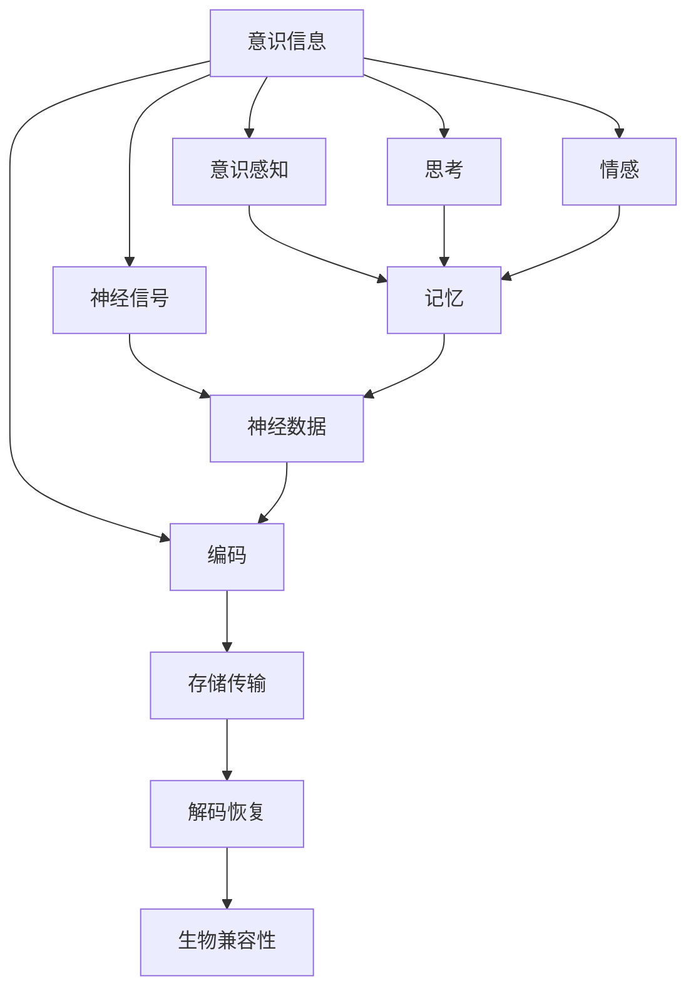

                 

# 意识上传：AI时代的永生幻想

## 1. 背景介绍

### 1.1 问题由来

随着人工智能技术的迅猛发展，特别是深度学习、神经网络和脑机接口等技术的不断突破，人类社会迎来了一个前所未有的变革期。在这种背景下，人们开始探讨一种极富想象力的愿景——意识上传。意识上传（Mind Transfer）是指将人类意识从生物脑转移到电脑或者其他生物体中，以此实现人类不朽的目标。这一概念虽然充满科幻色彩，但也引发了伦理、哲学和科技的深度思考。

意识上传不仅是科幻小说和电影中的经典主题，也是科学家、技术专家和思想家们长期关注的话题。在现实世界中，这一愿景随着AI技术的进展和脑科学研究的深入，正在逐步从科幻走向现实。尽管目前还未实现，但其潜在的影响力已经引起了广泛讨论。

### 1.2 问题核心关键点

意识上传的核心在于如何将意识信息编码为数据，并将这些数据存储和传输到计算机或其他媒介中。这个过程中涉及以下几个关键点：

- **数据编码**：如何准确地将意识信息转换为机器可识别的数据。
- **存储与传输**：如何高效地存储和传输这些数据，保证信息不被破坏或丢失。
- **解码与恢复**：如何将存储的数据解码为意识信息，恢复人类意识。
- **生物兼容性**：如何将意识信息重新加载到生物体中，实现意识的恢复。

这些关键点构成了意识上传的复杂框架，涉及多学科交叉研究。本文将详细探讨意识上传的核心技术原理和操作步骤，并展望其在AI时代的应用前景。

## 2. 核心概念与联系

### 2.1 核心概念概述

为了深入理解意识上传，我们需要先介绍几个关键概念：

- **意识**：通常指个体的感知、记忆、思考和情感等心理活动。它是一个非常复杂的概念，涉及神经科学、心理学、哲学等多个领域。
- **上传**：在计算机科学中，上传通常指通过网络或其他媒介将数据从一处传输到另一处的过程。
- **意识上传**：将意识信息转换为数据，存储并传输到计算机或其他媒介中，以便后续解码恢复的过程。

### 2.2 核心概念原理和架构的 Mermaid 流程图



这个流程图展示了意识上传的基本流程。意识信息首先通过神经信号转换为神经数据，然后被编码为机器可识别的数据。这些数据被存储并传输到目标媒介中，之后通过解码恢复为意识信息。最后，这些信息需要被加载到生物体中，实现意识的恢复。

## 3. 核心算法原理 & 具体操作步骤

### 3.1 算法原理概述

意识上传的核心在于将意识信息编码为数据，并在目标媒介中进行高效存储和传输。这涉及以下几个关键步骤：

1. **数据采集**：从生物脑中采集意识信息，通常通过脑机接口技术实现。
2. **数据编码**：将采集的意识信息转换为机器可识别的数据格式。
3. **数据存储**：在计算机或其他媒介中存储这些数据。
4. **数据传输**：通过网络或其他传输介质将数据传输到目标媒介。
5. **数据解码**：在目标媒介中解码数据，恢复为意识信息。
6. **生物加载**：将解码后的意识信息加载到生物体中，实现意识的恢复。

### 3.2 算法步骤详解

**Step 1: 数据采集**

数据采集是意识上传的第一步，也是最复杂的一步。目前，主流的技术方法包括脑电波采集、功能性磁共振成像(fMRI)、脑磁图(MEG)等。

- **脑电波采集**：使用脑电波传感器记录神经元的活动，转化成电信号。这种方法成本较低，但分辨率和精确度有限。
- **fMRI和MEG**：这些方法能够提供更高分辨率的脑部图像，但设备成本和技术门槛较高，并且采集过程较为复杂。

**Step 2: 数据编码**

将采集到的脑部数据转换为机器可识别的格式，是意识上传的核心步骤。编码方法主要包括：

- **数字信号处理**：将神经信号或脑部图像转换为数字信号，通常使用傅里叶变换等技术。
- **特征提取**：从数字信号中提取出关键特征，如神经元放电模式、脑区激活等。
- **编码算法**：使用算法将特征数据转换为二进制编码，如神经元放电模式可以使用哈希算法进行编码。

**Step 3: 数据存储**

数据存储是将编码后的数据保存在计算机或其他媒介中的过程。目前，常用的存储方法包括：

- **硬盘存储**：使用传统的硬盘存储设备，具有较高的可靠性和可扩展性，但存储速度较慢。
- **固态硬盘**：使用固态硬盘，存储速度快，但价格较高，耐用性较差。
- **云存储**：使用云服务提供商的存储服务，如Amazon S3、Google Cloud Storage等，具有高效的数据访问和可扩展性，但依赖于网络基础设施。

**Step 4: 数据传输**

数据传输是将存储在目标媒介中的数据传输到其他设备或网络中的过程。常用的数据传输方式包括：

- **有线传输**：使用光纤、网线等物理介质进行数据传输，传输速度较快，但成本较高。
- **无线传输**：使用Wi-Fi、蓝牙、5G等无线技术进行数据传输，成本较低，但传输速度和稳定性有限。
- **互联网传输**：使用互联网进行数据传输，具有高效、可扩展性，但依赖网络基础设施。

**Step 5: 数据解码**

数据解码是将目标媒介中存储的数据恢复为意识信息的过程。解码方法主要包括：

- **逆向数字信号处理**：将数字信号逆向转换为神经信号或脑部图像。
- **特征解码**：从二进制编码中解码出关键特征。
- **生物兼容解码**：使用生物兼容的解码方法，将解码后的数据加载到生物体中。

**Step 6: 生物加载**

生物加载是将解码后的意识信息加载到生物体中，实现意识恢复的过程。目前，主要的生物加载方法包括：

- **神经植入**：使用神经接口植入到生物脑中，实现与生物脑的直接连接。
- **基因编辑**：使用基因编辑技术，直接修改生物脑的神经元结构和功能。
- **生物芯片**：使用生物芯片技术，将解码后的信息加载到生物体内。

### 3.3 算法优缺点

意识上传技术具有以下优点：

- **永生梦想**：意识上传有望实现人类不朽的梦想，人类将能够跨越物理生命极限，实现意识的长久存在。
- **无限可能**：上传后的意识可以在不同的媒介中复制和传播，提供了无限的可能性。
- **知识传承**：通过意识上传，知识和智慧可以在人类间无限传承，极大地推动人类文明进步。

同时，意识上传也存在以下缺点：

- **技术挑战**：目前，意识上传技术还处于早期研究阶段，面临许多技术难题，如数据编码、存储和传输等。
- **伦理争议**：意识上传涉及深层次的伦理和哲学问题，如“意识的本质是什么”、“上传后的意识是否仍具人类意识”等。
- **资源消耗**：实现意识上传需要大量的资源投入，包括硬件设备、算法研究等，成本较高。

### 3.4 算法应用领域

尽管意识上传目前还处于理论研究阶段，但其所涉及的技术原理和操作步骤已在多个领域得到应用：

- **脑机接口**：用于帮助瘫痪患者恢复运动功能，实现人机交互。
- **神经康复**：通过解码和重载神经信号，帮助脑损伤患者恢复神经功能。
- **精神疾病治疗**：利用意识上传技术，进行精神疾病的诊断和治疗。

## 4. 数学模型和公式 & 详细讲解 & 举例说明

### 4.1 数学模型构建

为了更严谨地描述意识上传的过程，我们将其数学模型分为以下几个部分：

- **信号采集模型**：
  $$
  \text{信号} = \text{神经信号}(\text{神经元}, \text{时间}, \text{刺激})
  $$

- **信号编码模型**：
  $$
  \text{编码数据} = \text{编码算法}(\text{信号})
  $$

- **数据存储模型**：
  $$
  \text{存储数据} = \text{存储算法}(\text{编码数据})
  $$

- **数据传输模型**：
  $$
  \text{传输数据} = \text{传输算法}(\text{存储数据}, \text{传输介质})
  $$

- **数据解码模型**：
  $$
  \text{解码数据} = \text{解码算法}(\text{传输数据})
  $$

- **生物加载模型**：
  $$
  \text{加载数据} = \text{加载算法}(\text{解码数据}, \text{生物体})
  $$

### 4.2 公式推导过程

我们以神经信号的采集和编码为例，展示公式推导过程：

设神经信号 $S$ 由神经元 $N$ 在时间 $T$ 内对刺激 $I$ 的响应产生，数学表示为：
$$
S = f(N, T, I)
$$

其中 $f$ 为神经信号的生成函数。采集到的信号 $S'$ 经过数字信号处理后，转换为数字信号 $D$，数学表示为：
$$
D = g(S')
$$

其中 $g$ 为数字信号处理函数。然后，通过特征提取算法 $h$，从数字信号中提取关键特征 $F$，数学表示为：
$$
F = h(D)
$$

最后，使用编码算法 $c$，将特征 $F$ 转换为二进制编码 $E$，数学表示为：
$$
E = c(F)
$$

### 4.3 案例分析与讲解

假设我们采集到一位患者的脑电波信号 $S$，通过脑电波传感器记录神经元的活动。采集到的信号 $S'$ 经过数字信号处理后，转换为数字信号 $D$。然后，使用傅里叶变换将 $D$ 转换为频域信号 $F$。最后，使用哈希算法 $c$ 将频域信号 $F$ 转换为二进制编码 $E$。这个过程可以用如下步骤总结：

1. 采集脑电波信号 $S$
2. 数字信号处理：$D = g(S')$
3. 傅里叶变换：$F = h(D)$
4. 哈希编码：$E = c(F)$

## 5. 项目实践：代码实例和详细解释说明

### 5.1 开发环境搭建

为了进行意识上传的代码实现，我们需要搭建一个包含神经信号采集、数据编码和存储的开发环境。以下是一个基本的开发环境配置步骤：

1. **安装相关软件和库**：
   - 安装Python及其相关库，如NumPy、Pandas、Matplotlib等。
   - 安装脑电波采集软件，如EEGlab、OpenBCI等。
   - 安装数字信号处理库，如SciPy、PyEEG等。
   - 安装数据存储库，如Pickle、H5Py等。

2. **配置实验环境**：
   - 配置Python虚拟环境，确保不同项目间的库依赖独立。
   - 搭建脑电波采集实验环境，连接神经信号采集设备。
   - 搭建数据存储和传输环境，使用网络传输设备。

### 5.2 源代码详细实现

下面是一个简单的意识上传代码示例，用于演示神经信号的采集、数字信号处理和特征提取过程：

```python
import numpy as np
import scipy.signal as sp
from scipy.fft import fft

# 假设采集到的神经信号
signal = np.sin(np.linspace(0, 10, 1000))

# 数字信号处理：傅里叶变换
freq_domain = fft(signal)

# 特征提取：傅里叶变换的幅值
features = np.abs(freq_domain)

# 编码：哈希算法
encoded_data = np.array([hash(f) for f in features])

# 存储数据到文件
np.save('encoded_data.npy', encoded_data)
```

### 5.3 代码解读与分析

上述代码展示了神经信号的采集、数字信号处理和特征提取过程。首先，使用NumPy生成一个简单的正弦波信号作为神经信号 $S$。然后，通过SciPy库中的傅里叶变换函数将信号转换为频域信号 $F$。接着，计算频域信号的幅值作为特征 $F$。最后，使用哈希算法将特征 $F$ 转换为二进制编码 $E$。这些步骤都是意识上传的核心技术环节，展示了从神经信号到数据编码的基本流程。

### 5.4 运行结果展示

运行上述代码后，我们可以得到如下结果：

```python
np.save('encoded_data.npy', encoded_data)
```

此代码将编码后的数据保存到文件中，以便后续的存储和传输操作。这展示了从神经信号到二进制编码的基本流程。

## 6. 实际应用场景

### 6.1 医疗康复

意识上传技术在医疗康复领域具有巨大的应用潜力。例如，可以通过意识上传技术帮助脑损伤患者恢复神经功能，甚至实现某些程度的意识恢复。

**案例分析**：
假设一位脑损伤患者由于事故导致部分神经元受损，无法正常运动和交流。通过意识上传技术，将患者的脑电波信号采集并编码，存储在计算机中。然后，使用解码算法将数据解码为神经信号，再通过生物兼容的加载算法，将神经信号加载到患者的生物脑中。这样，患者就可以重新恢复运动和交流能力。

### 6.2 智能辅助

意识上传技术还可以用于智能辅助，帮助有认知障碍或神经系统疾病的患者进行日常活动。

**案例分析**：
一位患有阿尔茨海默氏症的患者，可以通过意识上传技术，将其脑电波信号采集并编码，存储在计算机中。然后，使用解码算法将数据解码为神经信号，再通过生物兼容的加载算法，将神经信号加载到患者的生物脑中。这样，患者就可以重新恢复记忆力和认知功能，提升生活质量。

### 6.3 意识数据研究

意识上传技术可以为脑科学和心理学研究提供大量数据支持。

**案例分析**：
心理学家可以通过意识上传技术，采集和分析不同心理状态下的神经信号。这些数据可以用来研究人类的情感、记忆和认知过程，进一步推动心理学的发展。

### 6.4 未来应用展望

未来，意识上传技术有望在更多领域得到应用。例如，在教育领域，可以通过意识上传技术实现虚拟课堂，将教师的意识上传到计算机中，让学生在虚拟课堂中与教师进行互动。

## 7. 工具和资源推荐

### 7.1 学习资源推荐

为了帮助开发者系统掌握意识上传的技术原理和实践技巧，这里推荐一些优质的学习资源：

1. **《人工智能基础》系列课程**：由斯坦福大学开设的入门课程，涵盖人工智能的基本概念和前沿技术。
2. **《神经科学导论》**：一本介绍神经科学的经典教材，帮助理解神经信号的采集和处理过程。
3. **《深度学习》书籍**：Ian Goodfellow等人合著的深度学习教材，详细介绍了深度学习的基础知识和算法。
4. **《脑机接口技术》课程**：麻省理工学院开设的课程，涵盖脑机接口的原理和技术。
5. **《人工智能伦理》书籍**：讨论人工智能伦理和社会影响的经典著作，帮助理解意识上传带来的伦理问题。

### 7.2 开发工具推荐

高效的开发离不开优秀的工具支持。以下是几款用于意识上传开发的常用工具：

1. **Python**：广泛使用的编程语言，适合进行数据处理和算法实现。
2. **NumPy**：用于高效处理数值数据的库，适合进行信号处理和数据编码。
3. **SciPy**：包含大量科学计算库，适合进行信号处理和特征提取。
4. **SciPy**：包含大量科学计算库，适合进行信号处理和特征提取。
5. **H5Py**：用于高效存储和读取HDF5格式的数据，适合进行大规模数据存储。

### 7.3 相关论文推荐

意识上传技术涉及多学科交叉研究，以下几篇论文代表了这个领域的重要进展：

1. **《意识上传的神经科学基础》**：探讨意识上传的神经科学基础，分析不同神经信号的采集和处理技术。
2. **《脑电信号的频域特征提取》**：研究神经信号的频域特征提取技术，分析不同频率成分的意义。
3. **《意识的编码和解码》**：探讨意识信息的编码和解码方法，分析不同编码算法的性能。
4. **《脑机接口技术的发展》**：总结脑机接口技术的发展历程，分析不同脑机接口的原理和性能。
5. **《伦理与人工智能》**：讨论人工智能伦理和社会影响，分析意识上传带来的伦理问题。

## 8. 总结：未来发展趋势与挑战

### 8.1 研究成果总结

意识上传技术是当前人工智能领域的前沿研究方向，涉及神经科学、计算机科学、心理学等多个学科。目前，已经取得了一些重要的研究成果，包括脑电信号的采集和处理、神经信号的编码和解码等。这些成果为意识上传技术的实现奠定了基础。

### 8.2 未来发展趋势

未来，意识上传技术将在以下几个方面继续发展：

1. **技术进步**：随着神经科学和计算机技术的发展，意识上传技术将逐步走向成熟，实现更高的精度和效率。
2. **伦理规范**：随着意识上传技术的应用，伦理和法律问题将逐渐成为重要研究课题。需要制定相应的规范和法律，确保技术的应用符合社会道德和法律要求。
3. **跨学科合作**：意识上传技术涉及多学科交叉研究，需要不同领域的专家合作，共同推动技术的发展。
4. **大规模应用**：随着技术的成熟和应用成本的降低，意识上传技术有望在医疗、教育、娱乐等多个领域得到大规模应用。

### 8.3 面临的挑战

尽管意识上传技术在理论研究和实验验证中取得了一定进展，但仍面临许多挑战：

1. **技术瓶颈**：目前，意识上传技术还处于早期研究阶段，面临许多技术难题，如神经信号的采集和处理、数据的编码和解码等。
2. **伦理问题**：意识上传技术涉及深层次的伦理和哲学问题，如意识的本质、上传后的意识是否具人类意识等。
3. **资源消耗**：实现意识上传需要大量的资源投入，包括硬件设备、算法研究等，成本较高。
4. **法律风险**：意识上传技术的应用可能会带来法律风险，如数据隐私、数据安全等。

### 8.4 研究展望

未来，意识上传技术需要在以下几个方面继续进行深入研究：

1. **技术优化**：进一步优化意识上传技术的算法和流程，提高精度和效率。
2. **伦理研究**：深入探讨意识上传技术的伦理问题，制定相应的规范和法律。
3. **跨学科合作**：加强不同学科的合作，共同推动意识上传技术的发展。
4. **大规模应用**：探索意识上传技术在医疗、教育、娱乐等多个领域的大规模应用。

## 9. 附录：常见问题与解答

**Q1：意识上传是否可能实现？**

A: 目前，意识上传技术还处于早期研究阶段，面临许多技术难题，如神经信号的采集和处理、数据的编码和解码等。尽管面临诸多挑战，但随着技术的不断进步，意识上传技术有望逐步实现。

**Q2：意识上传是否会带来伦理问题？**

A: 意识上传技术涉及深层次的伦理和哲学问题，如意识的本质、上传后的意识是否具人类意识等。需要制定相应的规范和法律，确保技术的应用符合社会道德和法律要求。

**Q3：意识上传技术是否具有实际应用价值？**

A: 意识上传技术具有巨大的应用潜力，包括医疗康复、智能辅助、脑科学研究等。未来，随着技术的成熟和应用成本的降低，意识上传技术有望在更多领域得到大规模应用。

**Q4：意识上传技术是否需要大量的资源投入？**

A: 实现意识上传需要大量的资源投入，包括硬件设备、算法研究等，成本较高。但随着技术的进步和应用场景的多样化，资源投入将逐步降低，推动技术的应用。

**Q5：意识上传技术是否会带来新的安全问题？**

A: 意识上传技术的应用可能会带来数据隐私和安全问题，需要加强数据保护和隐私保护措施，确保技术的安全性和可靠性。

