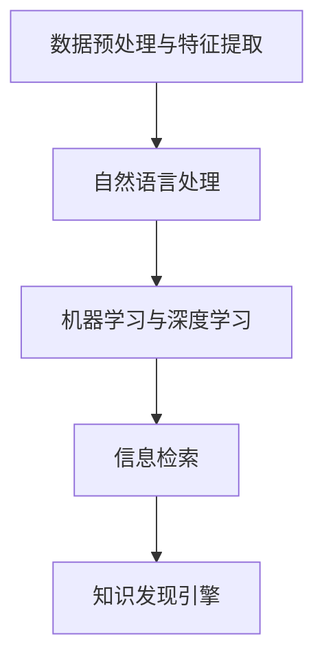

                 

# 打造个人知识发现引擎：程序员的必备技能

> 关键词：知识发现引擎, 数据挖掘, 自然语言处理, 机器学习, 算法, 深度学习, 信息检索

## 1. 背景介绍

### 1.1 问题由来

随着信息技术的飞速发展，程序员需要不断更新自己的知识体系，以应对快速变化的技术环境。然而，面对海量的技术文档、博客、论坛，如何高效地获取并整理相关知识，成为了每个程序员面临的难题。为了解决这一问题，开发出了一款名为“知识发现引擎”的软件，它能够根据用户的历史行为和查询记录，智能推荐最相关的知识和资源。本文将详细介绍知识发现引擎的核心原理、实现步骤以及它在实际中的应用场景。

### 1.2 问题核心关键点

知识发现引擎的核心在于能够自动从大量无结构化的数据中提取出有用的知识，并将其结构化展示给用户。这主要依赖于以下几个关键点：

- 数据预处理与特征提取：将非结构化数据转换为机器可读的形式，提取出有意义的特征。
- 自然语言处理(NLP)：理解用户查询的意图，提取文本中的关键信息。
- 机器学习与深度学习：构建推荐模型，预测用户可能感兴趣的知识资源。
- 信息检索：在庞大的知识库中快速检索到最相关的资源。

接下来，本文将从这些关键点出发，详细介绍知识发现引擎的构建方法。

## 2. 核心概念与联系

### 2.1 核心概念概述

为了更好地理解知识发现引擎的构建原理，本文将介绍几个核心概念：

- **知识发现(Knowledge Discovery)**：指从大量数据中自动或半自动地发现、识别和抽取有用的信息和知识的过程。
- **数据挖掘(Data Mining)**：使用各种统计、机器学习等技术，从数据中发现知识或信息的过程。
- **自然语言处理(NLP)**：研究计算机如何理解、处理和生成人类语言的技术。
- **信息检索(Information Retrieval)**：通过自动检索文档，找到与查询相关的内容的过程。
- **机器学习与深度学习(Machine Learning & Deep Learning)**：通过算法从数据中学习规律，并进行预测或决策的过程。

这些概念之间的关系可以通过以下Mermaid流程图来展示：



这个流程图展示了知识发现引擎的核心工作流程：先对数据进行预处理和特征提取，再利用NLP技术理解用户查询意图，然后通过机器学习或深度学习模型推荐最相关的知识资源，最后利用信息检索技术在知识库中检索出具体的内容。

## 3. 核心算法原理 & 具体操作步骤
### 3.1 算法原理概述

知识发现引擎的核心算法原理基于机器学习和深度学习，其主要流程如下：

1. **数据预处理与特征提取**：将原始的非结构化数据转换为机器可读的形式，并提取出有意义的特征。
2. **自然语言处理**：通过文本清洗、词性标注、命名实体识别等技术，理解用户查询的意图，提取文本中的关键信息。
3. **机器学习与深度学习**：构建推荐模型，预测用户可能感兴趣的知识资源。常见的推荐模型包括协同过滤、基于内容的推荐、深度学习中的序列推荐模型等。
4. **信息检索**：在庞大的知识库中快速检索到最相关的资源。

### 3.2 算法步骤详解

以下是知识发现引擎的具体实现步骤：

**Step 1: 数据收集与预处理**

1. **数据收集**：从各种渠道收集技术文档、博客、论坛帖子等非结构化数据，并存储在知识库中。
2. **数据清洗**：去除无关数据、噪声数据，保证数据质量。
3. **数据标准化**：将数据转换为统一的格式，如统一编程语言、统一数据格式等。
4. **特征提取**：从清洗后的数据中提取出有意义的特征，如关键词、话题、作者等。

**Step 2: 自然语言处理**

1. **文本清洗**：去除停用词、标点符号等无用信息。
2. **词性标注**：标注文本中每个词的词性，如名词、动词、形容词等。
3. **命名实体识别**：识别文本中的人名、地名、机构名等实体。
4. **意图理解**：使用机器学习模型（如BERT、RNN等）理解用户查询的意图。

**Step 3: 机器学习与深度学习**

1. **模型选择**：选择合适的推荐模型，如协同过滤、基于内容的推荐、深度学习中的序列推荐模型等。
2. **特征工程**：选择合适的特征，并对其进行工程化处理，如向量表示、特征降维等。
3. **模型训练**：在标注数据上训练推荐模型，调整模型参数。
4. **模型评估**：使用交叉验证等方法评估模型的性能。

**Step 4: 信息检索**

1. **构建索引**：将知识库中的数据构建索引，提高检索效率。
2. **相似度计算**：计算查询与知识库中每个资源的相似度。
3. **结果排序**：根据相似度对检索结果进行排序，选择最相关的资源。

### 3.3 算法优缺点

知识发现引擎的优点在于能够高效地从海量数据中提取有用的知识，并为用户推荐最相关的资源。然而，它也存在以下缺点：

- **数据依赖**：知识发现引擎的性能很大程度上依赖于数据的质量和数量，获取高质量数据是关键。
- **模型复杂**：机器学习和深度学习模型相对复杂，需要大量的计算资源和时间。
- **效果可解释性不足**：推荐模型往往是一个"黑盒"系统，难以解释其内部工作机制。
- **对新知识适应性差**：当新知识不断涌现时，知识库需要不断更新，以保持其时效性和相关性。

尽管存在这些局限性，但知识发现引擎在信息获取、知识管理、智能推荐等方面仍然具有重要的应用价值。

### 3.4 算法应用领域

知识发现引擎在多个领域中都有广泛的应用，例如：

- **技术学习**：程序员可以利用知识发现引擎快速获取最新的技术知识，学习新的编程语言、框架等。
- **项目管理**：项目管理团队可以通过知识发现引擎获取相关的项目管理工具、方法论等，提高工作效率。
- **技术交流**：技术论坛、社区可以通过知识发现引擎推荐最相关的技术文章、讨论，促进社区成员之间的交流。
- **知识管理**：企业可以通过知识发现引擎整理和共享知识资源，提升整体知识水平。
- **个性化推荐**：根据用户的历史行为和查询记录，知识发现引擎可以推荐个性化的知识资源，提高用户的学习效果。

## 4. 数学模型和公式 & 详细讲解 & 举例说明

### 4.1 数学模型构建

知识发现引擎的数学模型主要涉及自然语言处理和机器学习。本文将以一个简单的文本推荐系统为例，介绍其数学模型的构建过程。

假设有一个文本推荐系统，其输入为文本 $x$，输出为用户对文本的评分 $y$。模型的目标是找到一个函数 $f(x)$，使得 $f(x)$ 与用户评分 $y$ 尽可能接近。常见的模型包括线性回归模型、逻辑回归模型、支持向量机模型等。

**线性回归模型**：
$$
y = \theta^T x + b
$$

其中 $\theta$ 为模型的参数，$x$ 为文本特征向量，$b$ 为截距项。

**逻辑回归模型**：
$$
\log \frac{p(y=1|x)}{1-p(y=1|x)} = \theta^T x
$$

其中 $p(y=1|x)$ 为模型预测的概率，$\theta$ 为模型的参数，$x$ 为文本特征向量。

**支持向量机模型**：
$$
f(x) = \sum_{i=1}^n \alpha_i y_i \Phi(x) + b
$$

其中 $\alpha_i$ 为模型的参数，$y_i$ 为训练样本的标签，$\Phi(x)$ 为核函数，$b$ 为截距项。

### 4.2 公式推导过程

以逻辑回归模型为例，其推导过程如下：

1. **数据准备**：将文本 $x$ 转换为特征向量 $X$，用户评分 $y$ 转换为二分类标签 $Y$。
2. **模型训练**：使用逻辑回归模型对数据进行拟合，得到模型参数 $\theta$。
3. **模型评估**：使用交叉验证等方法评估模型的性能，选择最优的模型参数。
4. **结果预测**：使用训练好的模型对新的文本 $x$ 进行预测，得到用户评分 $y$。

### 4.3 案例分析与讲解

假设有一个机器学习课程的讨论区，用户可以上传文本记录和评分，知识发现引擎可以根据这些数据为用户推荐最相关的课程。

1. **数据收集**：收集用户上传的文本记录和评分数据，存储在数据库中。
2. **数据预处理**：清洗文本数据，去除无关信息，提取关键词。
3. **特征提取**：将文本转换为向量表示，如使用TF-IDF、Word2Vec等技术。
4. **模型训练**：使用逻辑回归模型对数据进行拟合，得到模型参数 $\theta$。
5. **模型评估**：使用交叉验证等方法评估模型的性能，选择最优的模型参数。
6. **结果预测**：将用户的新文本记录输入模型，得到预测评分，推荐最相关的课程。

## 5. 项目实践：代码实例和详细解释说明
### 5.1 开发环境搭建

在进行知识发现引擎的开发前，需要准备好开发环境。以下是使用Python进行TensorFlow开发的环境配置流程：

1. 安装Anaconda：从官网下载并安装Anaconda，用于创建独立的Python环境。

2. 创建并激活虚拟环境：
```bash
conda create -n tensorflow-env python=3.7 
conda activate tensorflow-env
```

3. 安装TensorFlow：根据CUDA版本，从官网获取对应的安装命令。例如：
```bash
conda install tensorflow -c tf -c conda-forge
```

4. 安装其他工具包：
```bash
pip install numpy pandas scikit-learn nltk
```

完成上述步骤后，即可在`tensorflow-env`环境中开始知识发现引擎的开发。

### 5.2 源代码详细实现

我们以知识发现引擎中的文本推荐系统为例，给出使用TensorFlow进行代码实现。

首先，定义数据集：

```python
import tensorflow as tf
import pandas as pd
from sklearn.feature_extraction.text import TfidfVectorizer
from sklearn.model_selection import train_test_split

# 读取数据集
data = pd.read_csv('data.csv', sep='\t')

# 将文本转换为向量表示
vectorizer = TfidfVectorizer(max_features=5000)
X = vectorizer.fit_transform(data['text'])

# 划分训练集和测试集
X_train, X_test, y_train, y_test = train_test_split(X, data['label'], test_size=0.2, random_state=42)
```

然后，定义模型：

```python
from tensorflow.keras.layers import Dense, Input
from tensorflow.keras.models import Model

# 定义模型输入和输出
input = Input(shape=(X_train.shape[1],))
hidden = Dense(64, activation='relu')(input)
output = Dense(1, activation='sigmoid')(hidden)

# 构建模型
model = Model(inputs=input, outputs=output)

# 编译模型
model.compile(optimizer='adam', loss='binary_crossentropy', metrics=['accuracy'])
```

接着，进行模型训练：

```python
# 训练模型
model.fit(X_train, y_train, epochs=10, batch_size=32, validation_data=(X_test, y_test))
```

最后，进行模型评估：

```python
# 评估模型
loss, accuracy = model.evaluate(X_test, y_test)
print(f'Loss: {loss:.2f}, Accuracy: {accuracy:.2f}')
```

以上就是使用TensorFlow进行文本推荐系统的完整代码实现。可以看到，TensorFlow提供了灵活高效的框架，使得模型的构建和训练过程非常便捷。

### 5.3 代码解读与分析

让我们再详细解读一下关键代码的实现细节：

**数据预处理与特征提取**：
- `TfidfVectorizer`：使用TF-IDF技术将文本转换为向量表示。
- `train_test_split`：将数据集划分为训练集和测试集，用于模型训练和评估。

**模型构建**：
- `Dense`：定义全连接层，用于特征提取和分类。
- `Input`：定义模型输入，用于连接多个输入特征。
- `Model`：定义模型结构，包括输入层、隐藏层和输出层。

**模型训练**：
- `compile`：编译模型，指定优化器、损失函数和评估指标。
- `fit`：训练模型，指定训练数据、批次大小和迭代轮数。

**模型评估**：
- `evaluate`：评估模型，指定测试数据，返回损失和准确率。

以上代码展示了知识发现引擎中文本推荐系统的实现流程。在实际应用中，还需要考虑更多的细节，如模型调参、超参数选择、模型优化等，以进一步提升推荐效果。

## 6. 实际应用场景
### 6.1 技术学习

程序员可以利用知识发现引擎快速获取最新的技术知识，学习新的编程语言、框架等。例如，在机器学习领域，程序员可以通过知识发现引擎获取最新的算法论文、代码实现、应用案例等，快速了解和学习最新的技术趋势。

### 6.2 项目管理

项目管理团队可以通过知识发现引擎获取相关的项目管理工具、方法论等，提高工作效率。例如，在项目管理中，知识发现引擎可以推荐最相关的项目管理工具（如JIRA、Trello等）、方法论（如敏捷开发、DevOps等），帮助团队提升项目管理水平。

### 6.3 技术交流

技术论坛、社区可以通过知识发现引擎推荐最相关的技术文章、讨论，促进社区成员之间的交流。例如，在开源社区中，知识发现引擎可以推荐最相关的开源项目、代码示例、讨论论坛，帮助社区成员更好地理解和使用开源项目。

### 6.4 知识管理

企业可以通过知识发现引擎整理和共享知识资源，提升整体知识水平。例如，在企业内部，知识发现引擎可以推荐最相关的技术文档、案例分析、培训课程，帮助员工快速掌握新知识，提高工作效率。

### 6.5 个性化推荐

根据用户的历史行为和查询记录，知识发现引擎可以推荐个性化的知识资源，提高用户的学习效果。例如，在在线教育平台中，知识发现引擎可以推荐最相关的课程、资料、视频等，帮助用户更高效地学习。

## 7. 工具和资源推荐
### 7.1 学习资源推荐

为了帮助开发者系统掌握知识发现引擎的理论基础和实践技巧，这里推荐一些优质的学习资源：

1. 《机器学习实战》书籍：由Peter Harrington撰写，详细介绍机器学习的基本概念和实现方法，适合初学者入门。
2. 《深度学习》书籍：由Ian Goodfellow等撰写，全面介绍深度学习的基本原理和算法，适合进阶学习。
3. 《自然语言处理综论》书籍：由Daniel Jurafsky和James H. Martin撰写，介绍自然语言处理的基本原理和应用，适合深入学习。
4. TensorFlow官方文档：TensorFlow的官方文档，提供丰富的学习资源和示例代码，适合实战学习。
5. Scikit-Learn官方文档：Scikit-Learn的官方文档，提供各种机器学习算法的实现和应用，适合深入学习。

通过对这些资源的学习实践，相信你一定能够快速掌握知识发现引擎的精髓，并用于解决实际的NLP问题。

### 7.2 开发工具推荐

高效的开发离不开优秀的工具支持。以下是几款用于知识发现引擎开发的常用工具：

1. TensorFlow：基于Python的开源深度学习框架，灵活动态的计算图，适合快速迭代研究。
2. PyTorch：基于Python的开源深度学习框架，灵活高效的动态计算图，适合快速原型开发。
3. NLTK：自然语言处理工具包，提供各种文本处理功能，如词性标注、命名实体识别等。
4. Scikit-Learn：Python机器学习库，提供各种机器学习算法的实现和应用。
5. Pandas：数据处理库，提供高效的数据读取、处理和分析功能。

合理利用这些工具，可以显著提升知识发现引擎的开发效率，加快创新迭代的步伐。

### 7.3 相关论文推荐

知识发现引擎的研究涉及多个领域，以下是几篇奠基性的相关论文，推荐阅读：

1. "A Survey of the Machine Learning Approaches for Information Retrieval"：介绍机器学习在信息检索中的应用，适合了解知识发现引擎的理论基础。
2. "Semantic Search in Content Aggregators: Techniques and Challenges"：介绍语义搜索技术在内容聚合器中的应用，适合了解知识发现引擎的实际应用。
3. "Knowledge Discovery in Databases: A Guide to the State of the Art"：介绍知识发现技术的发展历程和前沿研究方向，适合了解知识发现引擎的最新进展。
4. "Adaptive Multi-context Information Retrieval"：介绍多语境信息检索技术，适合了解知识发现引擎的多模态应用。
5. "Knowledge Discovery in Massive Unstructured Text Databases"：介绍在大规模文本数据库中进行知识发现的挑战和解决方案，适合了解知识发现引擎的实际应用。

这些论文代表了大语言模型微调技术的发展脉络。通过学习这些前沿成果，可以帮助研究者把握学科前进方向，激发更多的创新灵感。

## 8. 总结：未来发展趋势与挑战
### 8.1 总结

本文对知识发现引擎的核心原理、实现步骤以及它在实际中的应用场景进行了全面系统的介绍。首先阐述了知识发现引擎在信息获取、知识管理、智能推荐等方面的重要应用价值。其次，从数据预处理与特征提取、自然语言处理、机器学习与深度学习、信息检索等几个关键点，详细讲解了知识发现引擎的构建方法。最后，介绍了知识发现引擎在不同领域的实际应用场景，以及其未来的发展趋势和面临的挑战。

通过本文的系统梳理，可以看到，知识发现引擎是一个多学科交叉的复杂系统，涉及数据预处理、自然语言处理、机器学习、信息检索等多个领域的知识。它通过自动从海量数据中提取有用的知识，并为用户推荐最相关的资源，极大地提升了信息获取和知识管理的效率。然而，知识发现引擎在实际应用中仍面临数据依赖、模型复杂、效果可解释性不足、对新知识适应性差等挑战，未来需要在这些方面进行进一步的研究和优化。

### 8.2 未来发展趋势

展望未来，知识发现引擎将呈现以下几个发展趋势：

1. **多模态知识发现**：知识发现引擎将扩展到多模态数据，如文本、图像、视频、音频等，进行更加全面和深入的知识发现。
2. **自适应知识发现**：知识发现引擎将能够根据用户的行为和偏好，自动调整推荐策略，实现个性化的知识发现。
3. **跨领域知识发现**：知识发现引擎将能够跨领域进行知识发现，例如从技术文档、社交媒体、学术论文等多源数据中发现知识。
4. **知识图谱**：知识发现引擎将与知识图谱技术结合，构建更加丰富的知识结构，支持更加复杂和深入的查询。
5. **联邦学习**：知识发现引擎将采用联邦学习技术，保护用户隐私的同时进行知识发现。

这些趋势凸显了知识发现引擎在信息获取、知识管理、智能推荐等方面的巨大潜力，未来将在更多领域得到广泛应用，为人类社会的知识创新和信息获取带来革命性的变革。

### 8.3 面临的挑战

尽管知识发现引擎已经取得了许多进展，但在迈向更加智能化、普适化应用的过程中，它仍面临诸多挑战：

1. **数据依赖**：知识发现引擎的性能很大程度上依赖于数据的质量和数量，获取高质量数据是关键。然而，对于长尾应用场景，难以获得充足的高质量标注数据，成为制约知识发现引擎性能的瓶颈。
2. **模型复杂**：知识发现引擎涉及多种算法和技术，需要大量的计算资源和时间。如何在保证效果的同时，优化算法和模型，提高计算效率，是一个重要挑战。
3. **效果可解释性不足**：推荐模型往往是一个"黑盒"系统，难以解释其内部工作机制。如何赋予知识发现引擎更强的可解释性，将是一个重要的研究方向。
4. **对新知识适应性差**：当新知识不断涌现时，知识发现引擎需要不断更新知识库，以保持其时效性和相关性。然而，如何高效地处理和整合新知识，是一个挑战。

尽管存在这些挑战，但知识发现引擎在信息获取、知识管理、智能推荐等方面仍然具有重要的应用价值。未来需要在数据获取、模型优化、效果可解释性等方面进行进一步的研究和优化。

### 8.4 研究展望

知识发现引擎的研究方向将进一步扩展到多模态数据、跨领域知识发现、自适应知识发现等领域，提升其在信息获取、知识管理、智能推荐等方面的应用价值。同时，知识发现引擎的研究也将更加注重效果可解释性和对新知识的适应性，以构建更加全面、灵活、高效的知识发现系统。

总之，知识发现引擎在信息获取、知识管理、智能推荐等方面具有重要的应用价值，未来将在更多领域得到广泛应用，为人类社会的知识创新和信息获取带来革命性的变革。尽管面临诸多挑战，但随着技术的不断进步和研究的深入，知识发现引擎必将在构建智能社会中扮演越来越重要的角色。

## 9. 附录：常见问题与解答

**Q1：知识发现引擎在实际应用中面临哪些挑战？**

A: 知识发现引擎在实际应用中面临以下挑战：
1. **数据依赖**：知识发现引擎的性能很大程度上依赖于数据的质量和数量，获取高质量数据是关键。然而，对于长尾应用场景，难以获得充足的高质量标注数据，成为制约知识发现引擎性能的瓶颈。
2. **模型复杂**：知识发现引擎涉及多种算法和技术，需要大量的计算资源和时间。如何在保证效果的同时，优化算法和模型，提高计算效率，是一个重要挑战。
3. **效果可解释性不足**：推荐模型往往是一个"黑盒"系统，难以解释其内部工作机制。如何赋予知识发现引擎更强的可解释性，将是一个重要的研究方向。
4. **对新知识适应性差**：当新知识不断涌现时，知识发现引擎需要不断更新知识库，以保持其时效性和相关性。然而，如何高效地处理和整合新知识，是一个挑战。

**Q2：如何提高知识发现引擎的性能？**

A: 提高知识发现引擎的性能可以从以下几个方面入手：
1. **数据预处理**：清洗和标准化数据，去除无关信息，提高数据质量。
2. **特征工程**：选择合适的特征，并进行工程化处理，如向量表示、特征降维等，提升模型效果。
3. **模型优化**：选择合适的模型，并进行调参和优化，提高模型精度和泛化能力。
4. **多模态融合**：将文本、图像、视频、音频等多模态数据融合，进行更加全面和深入的知识发现。
5. **自适应学习**：根据用户的行为和偏好，自动调整推荐策略，实现个性化的知识发现。

**Q3：知识发现引擎在实际应用中如何保证用户隐私？**

A: 知识发现引擎在实际应用中可以通过以下方式保证用户隐私：
1. **数据匿名化**：对用户数据进行匿名化处理，去除敏感信息，保护用户隐私。
2. **差分隐私**：在数据收集和处理过程中，加入噪声，保护用户隐私。
3. **联邦学习**：将数据分布式存储在多个设备上，不集中处理，保护用户隐私。
4. **访问控制**：对知识发现引擎的接口和功能进行访问控制，限制非授权访问。
5. **安全传输**：采用加密传输技术，保护数据在传输过程中的安全。

这些措施可以综合应用，构建更加安全、可靠的知识发现系统，保护用户隐私。

**Q4：知识发现引擎在实际应用中如何保证推荐效果？**

A: 知识发现引擎在实际应用中可以通过以下方式保证推荐效果：
1. **数据预处理与特征提取**：清洗和标准化数据，提取有意义的特征，提升数据质量。
2. **模型选择与调参**：选择合适的推荐模型，并进行调参和优化，提高模型精度和泛化能力。
3. **效果评估**：使用交叉验证等方法评估模型的性能，选择最优的模型参数。
4. **多模态融合**：将文本、图像、视频、音频等多模态数据融合，进行更加全面和深入的知识发现。
5. **自适应学习**：根据用户的行为和偏好，自动调整推荐策略，实现个性化的知识发现。

这些措施可以综合应用，构建更加精准、高效的知识发现系统，提高推荐效果。

**Q5：知识发现引擎在实际应用中如何保证可解释性？**

A: 知识发现引擎在实际应用中可以通过以下方式保证可解释性：
1. **透明算法**：选择透明、易于理解的算法，如线性回归、逻辑回归等。
2. **特征可视化**：可视化模型的特征重要性，帮助用户理解模型决策过程。
3. **模型解释工具**：使用模型解释工具，如LIME、SHAP等，帮助用户理解模型预测。
4. **多模型集成**：将多个模型的预测结果进行集成，提高模型的可解释性和稳定性。
5. **用户反馈**：收集用户对推荐结果的反馈，不断优化推荐策略，提升模型的可解释性。

这些措施可以综合应用，构建更加可解释、可信的知识发现系统，提升用户体验和信任度。

**Q6：知识发现引擎在实际应用中如何保证推荐的时效性？**

A: 知识发现引擎在实际应用中可以通过以下方式保证推荐的时效性：
1. **实时数据采集**：实时采集用户行为数据，及时更新知识库。
2. **缓存机制**：对常用的推荐结果进行缓存，提高推荐效率。
3. **异步更新**：采用异步更新机制，避免对用户的影响，提高系统的可用性。
4. **模型压缩**：对模型进行压缩和优化，提高推理速度和效率。
5. **联邦学习**：采用联邦学习技术，在保护用户隐私的同时，快速更新模型。

这些措施可以综合应用，构建更加高效、可靠的知识发现系统，提高推荐的时效性和用户体验。

以上是知识发现引擎的相关问题与解答，希望能帮助你对知识发现引擎有更深入的理解。

---

作者：禅与计算机程序设计艺术 / Zen and the Art of Computer Programming

