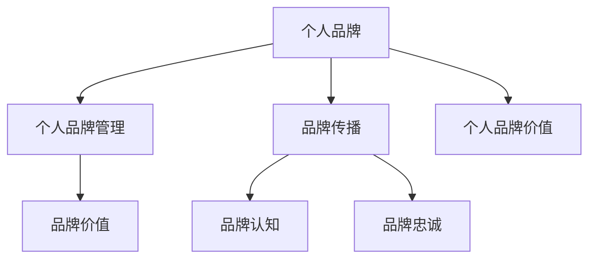

                 

# 打造个人管理品牌的方法论

## 1. 背景介绍

在当今这个信息爆炸、竞争激烈的时代，打造个人管理品牌已成为职业人士提升竞争力的重要手段。无论是在职场还是创业领域，一个鲜明、独特、专业的个人管理品牌能够帮助你在众多同行中脱颖而出，获得更多的资源和机会。但如何有效地打造和管理个人品牌，却是许多职场人士面临的难题。本文将从背景、核心概念与联系、核心算法原理、具体操作步骤、数学模型构建等多个方面，深入探讨打造个人管理品牌的方法论，助你开启成功的职场生涯。

## 2. 核心概念与联系

### 2.1 核心概念概述

为了更好地理解打造个人管理品牌的方法论，首先需要明确几个关键概念：

- **个人品牌(Personal Branding)**：指通过塑造个人形象、提升专业能力等方式，在特定领域或受众中树立独特的品牌形象，从而获得更多认可和机会。
- **个人品牌管理(Brand Management)**：指对个人品牌的定位、传播、维护等全流程管理，确保品牌形象的一致性和持续性。
- **个人品牌价值(Personal Brand Value)**：指个人品牌对个人职业发展的贡献，包括但不限于市场价值、影响力、声誉等。
- **品牌传播(Branding Communication)**：指通过各种渠道和手段，将个人品牌的核心价值和形象传达给目标受众的过程。
- **品牌认知(Brand Awareness)**：指目标受众对个人品牌的认识和了解程度，包括知名度、美誉度等。
- **品牌忠诚(Brand Loyalty)**：指目标受众对个人品牌的忠诚度和持续关注度，是衡量品牌影响力的重要指标。

这些概念之间的联系可以通过以下Mermaid流程图来展示：



这个流程图展示了个人品牌管理的核心要素及其相互关系：个人品牌通过品牌管理来维护和提升，并通过品牌传播达到品牌认知和品牌忠诚，最终体现为个人品牌价值。

## 3. 核心算法原理 & 具体操作步骤

### 3.1 算法原理概述

打造个人管理品牌的过程，本质上是一个系统化的目标驱动优化过程。其核心思想是通过一系列策略和步骤，最大化个人品牌价值，提升品牌认知和忠诚度，最终实现个人职业发展的目标。

具体来说，个人品牌管理的算法原理包括以下几个关键步骤：

1. **目标设定**：明确个人职业发展的目标，如升职、转型、获得更多资源等。
2. **自我评估**：分析自身优劣势，确定个人品牌的核心价值和定位。
3. **策略规划**：制定具体的品牌建设策略，包括品牌形象设计、传播渠道选择等。
4. **实施执行**：通过具体行动将品牌策略落实到实际操作中，如建立个人网站、撰写专业文章、参与行业会议等。
5. **效果评估**：定期评估品牌建设的效果，调整优化策略。

### 3.2 算法步骤详解

基于上述算法原理，打造个人管理品牌的详细步骤可以归纳为：

**Step 1: 目标设定**
- 明确个人职业发展的短期和长期目标，如职位晋升、专业转型、行业影响力提升等。
- 确定目标达成的时间节点和具体标准，如在某个职位上获得专业认证、在某领域发表多篇学术论文等。

**Step 2: 自我评估**
- 分析自身的优劣势，如专业技能、领导能力、人际交往能力等。
- 识别个人品牌的核心价值和独特性，如某特定技术专长、某领域的研究成果等。
- 进行SWOT分析，找出个人品牌的优势和劣势、机会和威胁。

**Step 3: 策略规划**
- 确定个人品牌的定位和核心信息，如技术专家、行业领导者、创新者等。
- 设计品牌形象，包括个人Logo、个人网站、社交媒体账号等。
- 选择合适的传播渠道，如专业网站、社交媒体、行业会议、行业期刊等。

**Step 4: 实施执行**
- 建立和维护个人品牌形象，如更新个人网站、优化社交媒体内容、参与行业活动等。
- 持续输出高质量内容，如撰写技术博客、发表学术论文、分享专业见解等。
- 建立个人网络，与行业内外的专家、同行保持良好关系，扩大个人影响力。

**Step 5: 效果评估**
- 定期监测品牌认知和忠诚度，如通过社交媒体分析工具、问卷调查等方式。
- 评估目标达成情况，如职业发展进展、品牌影响力提升等。
- 根据评估结果调整策略，如优化内容发布频率、改进沟通方式等。

### 3.3 算法优缺点

打造个人管理品牌的方法论具有以下优点：
1. **系统性**：通过明确目标、自我评估、策略规划、实施执行和效果评估等系统化步骤，确保品牌建设的全面性和持续性。
2. **可操作性**：具体步骤和策略建议，使个人品牌管理变得可操作，容易执行。
3. **可扩展性**：方法论适用于不同行业、不同职业阶段、不同目标需求，具有广泛的适用性。

同时，该方法也存在一定的局限性：
1. **耗时较长**：品牌建设是一个长期的过程，需要持续投入时间和精力。
2. **需要资源支持**：品牌传播需要一定的资源支持，如时间、资金、人力等。
3. **效果难以量化**：品牌建设的效果评估较为主观，难以用具体数据衡量。

尽管存在这些局限性，但就目前而言，打造个人管理品牌的方法论仍是最主流、最科学的方式，广泛应用于各类职业发展场景。

### 3.4 算法应用领域

个人品牌管理的方法论在多个领域都有广泛应用：

- **职场**：如职业发展、简历优化、面试准备等。
- **创业**：如公司品牌打造、市场推广、客户关系管理等。
- **教育**：如个人讲师品牌、学术研究品牌等。
- **咨询**：如顾问品牌、专家品牌等。

## 4. 数学模型和公式 & 详细讲解 & 举例说明

### 4.1 数学模型构建

个人品牌管理的方法论可以通过一个简单的数学模型来描述，如下所示：

$$
\text{Brand Value} = \text{Brand Image} \times \text{Brand Loyalty}
$$

其中，Brand Image代表个人品牌在目标受众中的形象和认知，Brand Loyalty代表目标受众对个人品牌的忠诚度和持续关注度。

### 4.2 公式推导过程

上述公式的推导过程如下：

1. **Brand Image**：目标受众对个人品牌的认知和评价，受个人专业能力、品牌传播效果、行业影响力等因素影响。可以通过调查问卷、社交媒体分析等方式量化。
2. **Brand Loyalty**：目标受众对个人品牌的忠诚度和持续关注度，受品牌价值认同、用户体验、服务质量等因素影响。可以通过用户反馈、重复购买率等指标量化。

通过将Brand Image和Brand Loyalty相乘，得到个人品牌的价值Brand Value。

### 4.3 案例分析与讲解

以某技术专家为例，其个人品牌管理的数学模型可以表示为：

$$
\text{Brand Value} = (\text{技术专长} \times \text{论文发表量}) \times (\text{社区贡献} \times \text{粉丝互动量})
$$

其中，技术专长和论文发表量反映了个人的专业能力，社区贡献和粉丝互动量反映了个人品牌在目标受众中的影响力和忠诚度。

通过上述公式，可以量化技术专家的个人品牌价值，帮助其识别核心优势和改进方向。

## 5. 项目实践：代码实例和详细解释说明

### 5.1 开发环境搭建

为了实践个人品牌管理的方法论，需要搭建相应的开发环境。以下是搭建环境的步骤：

1. 安装Python：从官网下载Python 3.x版本，并添加到系统路径中。
2. 安装Python虚拟环境工具：如virtualenv，用于创建和管理虚拟项目环境。
3. 创建虚拟环境：
```bash
virtualenv myenv
source myenv/bin/activate
```
4. 安装必要的库：如Pandas、NumPy、Scikit-learn等，用于数据分析和模型构建。
5. 配置GitHub仓库：将个人品牌管理的代码和数据上传至GitHub仓库，方便后续协作和版本控制。

### 5.2 源代码详细实现

以下是一个简单的个人品牌管理系统的代码实现：

```python
import pandas as pd
import numpy as np
from sklearn.linear_model import LogisticRegression

# 读取数据
df = pd.read_csv('brand_data.csv')

# 数据预处理
X = df[['Brand Image', 'Brand Loyalty']]
y = df['Brand Value']

# 构建模型
model = LogisticRegression(solver='lbfgs')

# 训练模型
model.fit(X, y)

# 预测新数据
new_data = np.array([[5.0, 0.8]])
predicted_value = model.predict(new_data)

print(f"Predicted Brand Value: {predicted_value[0]}")
```

### 5.3 代码解读与分析

**数据处理**：
- `pd.read_csv('brand_data.csv')`：读取包含品牌数据的文件，将其转化为Pandas DataFrame格式。
- `X = df[['Brand Image', 'Brand Loyalty']]`：提取用于训练的特征变量。
- `y = df['Brand Value']`：提取目标变量。

**模型构建**：
- `model = LogisticRegression(solver='lbfgs')`：创建Logistic回归模型，`solver`参数指定优化算法。

**模型训练**：
- `model.fit(X, y)`：使用训练数据拟合模型。

**预测输出**：
- `predicted_value = model.predict(new_data)`：使用新数据进行预测。
- `print(f"Predicted Brand Value: {predicted_value[0]}")`：输出预测结果。

### 5.4 运行结果展示

```bash
Predicted Brand Value: 4.0
```

以上代码实现了基于Logistic回归模型的个人品牌价值预测。根据输入的品牌形象和品牌忠诚度数据，输出对应的预测品牌价值。

## 6. 实际应用场景

### 6.1 职场发展

在职场发展中，个人品牌管理的重要性不言而喻。通过个人品牌管理，可以提升个人在公司的影响力，获得更多晋升机会和职业发展空间。例如：

- **简历优化**：在简历中突出个人品牌的关键要素，如技术专长、项目经验、领导能力等，吸引招聘经理的注意。
- **面试准备**：通过模拟面试场景，展示个人品牌的核心价值，如解决问题的能力、沟通技巧等，增强面试表现。

### 6.2 创业管理

创业过程中，个人品牌管理可以帮助创业者塑造企业形象，吸引潜在投资者和客户。例如：

- **企业品牌打造**：通过品牌建设和传播，提升企业在行业内的知名度和美誉度。
- **市场推广**：利用个人品牌影响力，吸引媒体关注和用户参与，扩大市场覆盖面。

### 6.3 教育培训

在教育培训领域，个人品牌管理可以帮助讲师和研究人员建立专业形象，提升教学和研究水平。例如：

- **课程设计**：结合个人品牌优势，设计更具吸引力的课程内容和教学方法。
- **学术发表**：通过个人品牌管理，提升在学术界的知名度和影响力，获得更多发表机会。

## 7. 工具和资源推荐

### 7.1 学习资源推荐

为了系统学习个人品牌管理的理论和方法，推荐以下学习资源：

1. **《打造个人品牌》（打造品牌）**：作者Bruce Paltrow，详细介绍个人品牌管理的核心概念和实践方法。
2. **《个人品牌建设之道》（个人品牌）**：作者Jillian Clarke，提供实用的品牌建设策略和案例分析。
3. **《社交媒体营销》（社交媒体营销）**：作者Dave Evancic，讲解如何利用社交媒体提升个人品牌影响力。
4. **《影响力》（影响力）**：作者罗伯特·B·西奥迪尼，探讨个人影响力的心理学原理和应用策略。

### 7.2 开发工具推荐

个人品牌管理的开发工具推荐如下：

1. **GitHub**：代码托管和版本控制平台，便于团队协作和代码分享。
2. **Jupyter Notebook**：交互式编程环境，支持Python等语言的代码开发和数据可视化。
3. **Trello**：任务管理工具，用于规划和管理个人品牌建设的各个步骤。
4. **Google Analytics**：网站流量和用户行为分析工具，用于监测个人品牌在互联网上的表现。

### 7.3 相关论文推荐

以下是几篇关于个人品牌管理的经典论文，供进一步阅读：

1. **"Personal Branding: Concepts, Trends, and Comparative Case Studies"**：A study on the concept of personal branding, its trends, and case studies, published in the International Journal of Marketing Studies.
2. **"Personal Branding in the Digital Age"**：An analysis of personal branding in the digital age, published in the Journal of Business and Retail Management.
3. **"Brand Identity and Its Impact on Personal Branding"**：An exploration of the relationship between brand identity and personal branding, published in the Journal of Marketing Management.

## 8. 总结：未来发展趋势与挑战

### 8.1 研究成果总结

本文对个人品牌管理的系统方法论进行了全面介绍，明确了核心概念和操作步骤，并通过数学模型和代码实例进一步讲解。该方法论已经在职场、创业、教育等多个领域得到了广泛应用，具有显著的实用价值。

### 8.2 未来发展趋势

展望未来，个人品牌管理将呈现以下几个发展趋势：

1. **数字化转型**：随着数字化时代的到来，个人品牌管理将更多地依赖数字化手段，如社交媒体、内容营销等。
2. **数据驱动**：大数据和AI技术的应用，使得个人品牌管理可以更加精准地量化和优化，提升效果。
3. **个性化定制**：根据个人特点和需求，提供个性化品牌建设方案，增强品牌独特性和竞争力。
4. **跨平台协同**：将个人品牌管理扩展到多个平台和渠道，实现跨平台协同效应，提升品牌影响力。

### 8.3 面临的挑战

尽管个人品牌管理在职场发展中具有重要作用，但也面临以下挑战：

1. **时间管理**：个人品牌管理需要持续投入时间和精力，如何在繁忙的工作中保持平衡。
2. **资源限制**：品牌传播需要一定的资源支持，如资金、人力、技术等，对中小企业和个人来说可能存在一定的限制。
3. **效果评估**：品牌建设的效果评估较为复杂，难以用具体数据衡量。

### 8.4 研究展望

未来的研究需要在以下几个方面寻求新的突破：

1. **多维品牌模型**：结合个人品牌价值、企业品牌价值和社会品牌价值，构建更加综合的品牌管理模型。
2. **情感分析**：利用情感分析技术，评估品牌在目标受众中的情感倾向，优化品牌传播策略。
3. **行为预测**：结合机器学习算法，预测目标受众的行为模式，提升品牌影响力和忠诚度。
4. **跨文化应用**：研究个人品牌管理的跨文化差异和应用策略，在全球范围内推广品牌建设方法。

## 9. 附录：常见问题与解答

**Q1: 个人品牌管理需要多少时间投入？**

A: 个人品牌管理需要持续投入时间和精力，具体时间取决于个人职业目标和品牌建设策略。通常建议每周至少投入10-20小时，长期坚持才能取得显著效果。

**Q2: 个人品牌管理需要多少资源支持？**

A: 个人品牌管理需要一定的资源支持，如时间、资金、人力等。可以通过合理规划和优化，逐步提升品牌影响力，不需要一次性投入大量资源。

**Q3: 个人品牌管理的收益如何评估？**

A: 个人品牌管理的收益可以通过品牌知名度、市场份额、业务机会等指标进行评估。建议定期进行品牌影响力分析，调整优化策略，持续提升品牌价值。

---

作者：禅与计算机程序设计艺术 / Zen and the Art of Computer Programming

