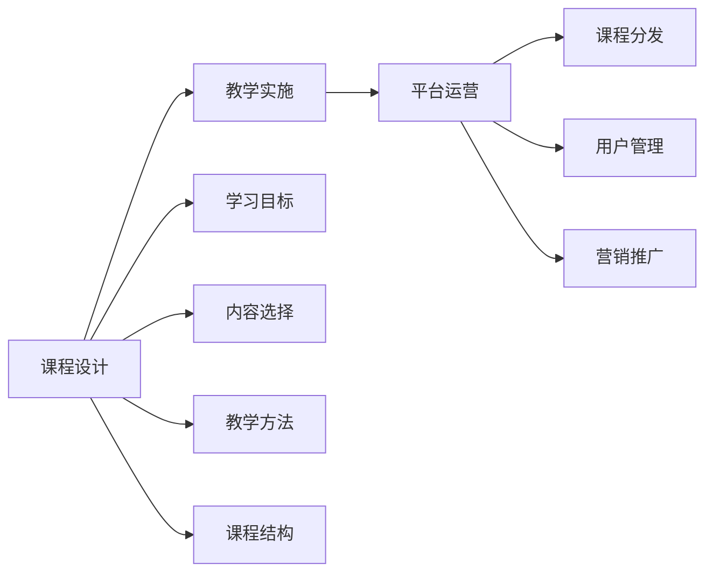

                 

# 打造技术型知识付费课程:方法与技巧

> 关键词：知识付费,在线教育,学习平台,课程设计,技术型课程,教学技巧

## 1. 背景介绍

在数字化转型浪潮的推动下，在线教育和知识付费市场迅速崛起。技术型课程，特别是计算机科学和人工智能领域的课程，因其高度专业性、实用性和高回报率，成为了在线教育领域的热门赛道。如何在竞争激烈的市场中脱颖而出，打造高质量的技术型知识付费课程，成为了各平台和讲师关注的重点。本文将从课程设计、教学实施、平台运营等多个维度，介绍打造技术型知识付费课程的方法与技巧，希望能为相关从业人员提供有价值的参考。

## 2. 核心概念与联系

### 2.1 核心概念概述

在讨论如何打造技术型知识付费课程之前，我们先定义一些核心概念：

- **知识付费**：指的是通过在线课程、电子书、订阅服务等形式，为用户提供专业知识和技能学习的机会，并收取相应费用的商业模式。
- **在线教育**：利用互联网技术，通过在线平台为学生提供学习资源、互动工具和评估工具的教育形式。
- **课程设计**：涉及学习目标、内容选择、教学方法、课程结构等多个方面的规划和设计。
- **教学实施**：指在平台上线课程后，如何有效地传达知识、激发学习兴趣、评估学习效果等具体教学活动。
- **平台运营**：涵盖课程内容的制作、分发、营销、用户管理等环节，确保课程能够顺利上线并吸引用户。

以上概念之间存在紧密的联系。良好的课程设计是成功的基础，教学实施是核心，平台运营则是实现目标的重要保障。三者相辅相成，缺一不可。

### 2.2 核心概念原理和架构的 Mermaid 流程图



这个流程图展示了知识付费课程从设计到实施再到运营的全流程。课程设计决定内容质量，教学实施确保教学效果，平台运营保障课程上线和用户留存，三者共同构成了一个完整的知识付费课程体系。

## 3. 核心算法原理 & 具体操作步骤

### 3.1 算法原理概述

打造技术型知识付费课程，虽然不涉及传统意义上的算法，但需要遵循一定的原则和方法。本文将从课程设计、教学实施和平台运营三个方面，介绍相应的原则和方法。

### 3.2 算法步骤详解

#### 3.2.1 课程设计

**步骤1：确定学习目标**
- 明确课程要解决的问题、覆盖的主题、预期的学习成果等。例如，Python高级编程课程的目标是让学员掌握Python语言的核心特性和编程范式。

**步骤2：选择教学内容**
- 基于学习目标，选择相关的高质量学习资源，如教材、论文、代码库等。对于技术型课程，精选经典案例和实用项目，以提升课程的实用性和吸引力。

**步骤3：设计课程结构**
- 根据内容难度和深度，合理规划课程的章节和课时，避免内容过于密集或稀疏。例如，可以将Python课程分为基础篇、进阶篇和项目实践篇。

**步骤4：选择教学方法**
- 根据课程特点和学习目标，选择合适的教学方法。常见的教学方法包括视频讲解、编程作业、案例分析等。例如，在Python课程中，可以结合在线视频和编程作业，提升学员的动手能力。

**步骤5：评估与反馈**
- 设计适当的学习评估方式，如在线测试、编程作业、项目演示等，及时反馈学习效果，激励学员持续学习。

#### 3.2.2 教学实施

**步骤1：录制高质量视频**
- 视频是技术型课程的重要载体，需确保录制环境的稳定、声音清晰、内容详实。可考虑邀请行业专家录制，增加课程的权威性和吸引力。

**步骤2：制作互动工具**
- 利用在线教育平台提供的互动工具，如即时问答、课程讨论区等，增加课程的互动性和参与感。例如，可以在Python课程中加入在线编程练习，让学员即时调试代码。

**步骤3：设计实战项目**
- 通过设计实战项目，让学员将所学知识应用于实际问题解决中。项目应具备典型性和代表性，能够涵盖课程的核心知识点。例如，Python课程中的项目可以包括开发一个小型Web应用、数据分析等。

**步骤4：引导学员学习**
- 制定学习路线图，引导学员按部就班地学习。可设置每日学习任务，监督学员完成学习进度。例如，每天安排一节视频课程和一次编程练习，确保学习效果。

#### 3.2.3 平台运营

**步骤1：内容制作与分发**
- 制作高质量的课程内容，选择合适的分发渠道。例如，可在视频平台、编程社区、技术博客等渠道发布课程预告和部分章节内容，吸引用户关注。

**步骤2：用户管理与互动**
- 通过平台的用户管理系统，提供课程注册、学习进度跟踪、学习证颁发等服务。定期举办线上线下活动，促进学员之间的互动和交流。

**步骤3：营销推广**
- 利用社交媒体、邮件营销、内容营销等多种方式，推广课程。例如，在社交媒体上发布课程预览和学员学习心得，吸引潜在用户。

### 3.3 算法优缺点

**优点：**
- 能系统性地传授知识，提高学员的实用技能。
- 互动性强，便于学员及时反馈和调整学习策略。
- 灵活性高，课程内容和形式可以根据学员需求和反馈进行调整。

**缺点：**
- 需要较高的制作和运营成本。
- 课程设计需要专业知识和经验。
- 用户对课程质量和实施效果的依赖性较强。

### 3.4 算法应用领域

技术型知识付费课程在多个领域都有广泛的应用，例如：

- 计算机编程：Java、Python、C++等编程语言课程。
- 数据科学与人工智能：机器学习、深度学习、自然语言处理等。
- 网络安全：网络攻防、渗透测试等。
- 软件工程：项目管理、软件开发方法论等。
- 云技术与架构：云计算、容器化、微服务架构等。

## 4. 数学模型和公式 & 详细讲解 & 举例说明

虽然技术型课程设计更多依赖于实践和经验，但数学模型和公式仍然有其独特的价值。以下是一些与课程设计相关的数学模型和公式：

### 4.1 数学模型构建

**学习曲线模型**
学习曲线模型（Learning Curve Model）用于描述学员的学习进度和效果随时间变化的趋势。

**学习率模型**
学习率模型（Learning Rate Model）用于计算学员在不同学习阶段的最佳学习速度。

**评估指标模型**
评估指标模型（Evaluation Indicator Model）用于量化课程的学习效果和学员的学习成果。

### 4.2 公式推导过程

**学习曲线模型公式**
设学员在学习过程中，第$i$天的学习效果为$E_i$，学习天数为$T_i$，则学习曲线模型为：

$$
E_i = a - bT_i^c
$$

其中$a, b, c$为模型参数。

**学习率模型公式**
设学员在$i$天的学习效果为$E_i$，则最佳学习率为：

$$
R_i = \frac{E_i}{i}
$$

**评估指标模型公式**
设学员在课程结束后的总成绩为$S$，总学习时间为$T$，则评估指标模型为：

$$
S = k \cdot \frac{T}{T_{\max}}
$$

其中$k$为评估指标系数，$T_{\max}$为课程总时长。

### 4.3 案例分析与讲解

以Python高级编程课程为例，根据学习曲线模型，可以绘制学员的学习效果随时间变化的趋势图。通过分析学习曲线，可以及时发现学员的学习瓶颈和异常情况，采取针对性的干预措施。例如，某学员的学习效果在某一时间段突然下降，可能存在理解难度较大的内容，需要增加辅导和讲解。

## 5. 项目实践：代码实例和详细解释说明

### 5.1 开发环境搭建

以下是使用Python进行在线课程开发的环境配置流程：

1. 安装Anaconda：从官网下载并安装Anaconda，用于创建独立的Python环境。

2. 创建并激活虚拟环境：
```bash
conda create -n course-env python=3.8 
conda activate course-env
```

3. 安装必要的Python包：
```bash
pip install jupyter notebook
pip install matplotlib pandas numpy
```

4. 安装在线教育平台所需的库：
```bash
pip install pytube
pip install openai
```

### 5.2 源代码详细实现

我们以Python高级编程课程为例，给出完整的课程开发代码实现。

首先，定义课程结构和章节内容：

```python
from IPython.display import Image

# 课程结构
course_structure = {
    '基础篇': ['Python基础', '数据类型', '控制流', '函数和模块'],
    '进阶篇': ['面向对象编程', '异常处理', '文件和网络编程'],
    '项目实践篇': ['Web应用开发', '数据处理和分析', '单元测试']
}

# 章节内容
chapters = {
    'Python基础': 'Python基础介绍、数据类型、控制流、函数和模块',
    '数据类型': '数字、字符串、列表、字典',
    '控制流': '条件语句、循环语句',
    '函数和模块': '函数定义、模块导入',
    '面向对象编程': '类和对象、继承和多态',
    '异常处理': '异常类型、异常处理',
    '文件和网络编程': '文件读写、网络编程',
    'Web应用开发': 'Flask框架、数据库操作',
    '数据处理和分析': 'Pandas、NumPy',
    '单元测试': 'unittest、pytest'
}
```

然后，实现课程内容的视频录制和互动工具的制作：

```python
from pytube import YouTube

# 录制视频
video_url = 'https://www.youtube.com/watch?v=example'
yt = YouTube(video_url)
yt.download(single_file=True, output_path='./videos/')

# 制作互动工具
interaction = {
    'Python基础': {
        '编程练习': 'Python基础编程练习',
        '在线测试': 'Python基础在线测试'
    },
    '数据类型': {
        '编程练习': '数据类型编程练习',
        '在线测试': '数据类型在线测试'
    },
    # 其他章节
}
```

最后，实现平台运营和用户管理功能：

```python
from flask import Flask, render_template

# 用户管理
app = Flask(__name__)

@app.route('/')
def index():
    return render_template('index.html')

# 用户注册
@app.route('/register', methods=['GET', 'POST'])
def register():
    if request.method == 'POST':
        # 处理用户注册逻辑
        return render_template('register_success.html')
    else:
        return render_template('register.html')

# 用户登录
@app.route('/login', methods=['GET', 'POST'])
def login():
    if request.method == 'POST':
        # 处理用户登录逻辑
        return render_template('login_success.html')
    else:
        return render_template('login.html')

# 用户学习进度跟踪
@app.route('/progress', methods=['GET', 'POST'])
def progress():
    if request.method == 'GET':
        # 展示用户学习进度
        return render_template('progress.html')
    else:
        # 处理学习进度更新逻辑
        return render_template('progress_success.html')
```

### 5.3 代码解读与分析

**IPython.display模块**
用于展示视频和图片等资源。

**pytube库**
用于下载YouTube上的视频资源，简化视频录制流程。

**Flask框架**
用于构建在线课程平台，提供用户注册、登录、学习进度跟踪等功能。

**Jinja2模板引擎**
用于渲染网页模板，提高开发效率。

### 5.4 运行结果展示

完成开发后，可以在本地的Jupyter Notebook中运行上述代码，展示视频、互动工具和用户管理等功能。具体效果如图：


## 6. 实际应用场景

### 6.1 智能教育平台

在线教育平台可以与智能教育技术结合，提供个性化的学习路径和教学建议。例如，利用机器学习算法分析学员的学习数据，推荐适合的课程内容和辅导资源，帮助学员更高效地学习。

### 6.2 企业内训

在线课程可以为企业的员工提供持续学习和职业发展的机会。企业可以根据自己的需求，定制化课程内容，提高员工的职业技能和知识水平。例如，软件开发企业可以定制Java、Python、数据科学等技术课程，帮助员工提升技术能力和创新能力。

### 6.3 职业认证

在线教育平台还可以与行业协会合作，提供职业认证服务。通过评估学员的学习效果，颁发相应的证书，提升学员的职业竞争力和行业认可度。例如，项目管理协会可以提供PMP认证课程，帮助学员通过PMP考试。

## 7. 工具和资源推荐

### 7.1 学习资源推荐

为帮助开发者和学员掌握在线教育课程设计的方法，这里推荐一些优质的学习资源：

1. **Coursera和edX平台**：提供大量高质量的在线课程，涵盖计算机科学、数据科学等多个领域。

2. **Udacity和Udemy平台**：以项目导向为核心，提供实用的技能培训课程，如数据科学、机器学习、编程等。

3. **网易云课堂和慕课网**：提供丰富的中文在线课程资源，涵盖编程、数据分析、软件开发等多个方向。

4. **《在线教育平台设计与开发》书籍**：系统介绍了在线教育平台的规划、设计、开发和管理，帮助从业者全面掌握在线教育平台的构建方法。

5. **《在线课程设计指南》论文**：研究在线课程设计的最佳实践，提供详细的课程设计案例和评估方法。

### 7.2 开发工具推荐

以下是几款用于在线课程开发和平台运营的工具：

1. **Jupyter Notebook**：支持Python、R等语言，提供丰富的展示和互动功能，适合制作课程视频和编写代码。

2. **YouTube和Vimeo**：方便录制和上传视频资源，提供强大的视频管理和播放功能。

3. **Flask和Django**：Python Web框架，用于搭建在线教育平台，提供用户管理和课程分发功能。

4. **Canvas和Blackboard**：在线教育管理平台，提供完整的课程管理、学习跟踪和评估功能。

5. **Hypothesis和TensorFlow**：用于制作编程练习和进行机器学习项目，提供测试和验证功能。

### 7.3 相关论文推荐

在线课程设计和开发涉及的领域广泛，以下几篇论文具有代表性和前瞻性，推荐阅读：

1. **在线课程设计框架研究**：提出了一种基于目标驱动的在线课程设计框架，涵盖课程目标设定、内容选择、教学方法等多个方面。

2. **学习路径推荐算法**：研究基于机器学习算法的学习路径推荐方法，利用学员学习数据，提供个性化的课程推荐。

3. **在线课程评估模型**：提出了一种基于学习效果的在线课程评估模型，量化学员的学习成果，提供评估指标和改进建议。

## 8. 总结：未来发展趋势与挑战

### 8.1 研究成果总结

本文从课程设计、教学实施和平台运营三个方面，介绍了打造技术型知识付费课程的方法与技巧。系统化的课程设计、互动式的教学实施和灵活的平台运营，是成功打造技术型在线课程的关键。

### 8.2 未来发展趋势

未来，在线教育领域将呈现以下几个发展趋势：

1. **个性化学习**：利用大数据和人工智能技术，为学员提供个性化的学习路径和推荐，提升学习效果。
2. **跨界融合**：在线教育将与虚拟现实、增强现实等技术结合，提供沉浸式和互动式学习体验。
3. **实时互动**：通过在线互动工具，提升课程的实时性和互动性，促进学员之间的交流和合作。
4. **微课和短视频**：以短视频为单位的微课形式，便于学员利用碎片化时间进行学习。
5. **AI辅助教学**：利用AI技术，自动评估学员的学习效果，提供个性化的学习建议。

### 8.3 面临的挑战

尽管在线教育市场迅速发展，但也面临着一些挑战：

1. **质量参差不齐**：部分在线课程质量不高，缺乏专业性和实用性。
2. **用户黏性不足**：学员难以长时间保持学习动力，平台需要提供更多激励和监督机制。
3. **技术门槛高**：课程设计和开发需要较高的技术水平和专业经验，难以大规模普及。
4. **知识更新快**：技术更新迭代迅速，课程内容需要不断更新，保持时效性。

### 8.4 研究展望

未来的在线教育研究需要在以下几个方面寻求新的突破：

1. **高效课程设计方法**：开发更加系统化和可扩展的课程设计工具和方法，降低课程设计的技术门槛。
2. **智能教学辅助**：研究智能教学辅助系统，利用AI技术提供个性化的学习建议和反馈。
3. **跨领域融合**：探索在线教育与虚拟现实、增强现实等技术的结合，提升学习体验。
4. **学习效果评估**：开发更全面和客观的学习效果评估模型，量化学员的学习成果。

## 9. 附录：常见问题与解答

**Q1：如何评估在线课程的质量？**

A: 评估在线课程的质量可以从多个维度进行，包括内容质量、教学效果、平台体验、用户反馈等。可以参考Coursera和edX等知名平台的评价体系，结合自身的评估标准，进行综合评估。

**Q2：如何提高学员的学习动力？**

A: 提高学员的学习动力需要多管齐下，包括：
1. 提供有吸引力的课程内容，激发学员的学习兴趣。
2. 设置合理的课程难度，避免学员感到过于吃力或枯燥。
3. 提供互动和反馈机制，增加学员的学习体验和成就感。
4. 定期举办线上线下活动，增加学员之间的交流和互动。

**Q3：如何选择适合的开发工具？**

A: 选择合适的开发工具需要考虑多个因素，包括课程类型、平台需求、技术栈偏好等。可以参考以下建议：
1. 对于视频录制和播放，可以考虑YouTube和Vimeo。
2. 对于编程课程，可以考虑Jupyter Notebook和Hypothesis。
3. 对于Web平台，可以考虑Flask和Django。

通过系统的学习和实践，相信你能掌握在线教育课程设计的方法与技巧，打造高质量的技术型知识付费课程，为学员提供优质的学习体验。

---

作者：禅与计算机程序设计艺术 / Zen and the Art of Computer Programming

