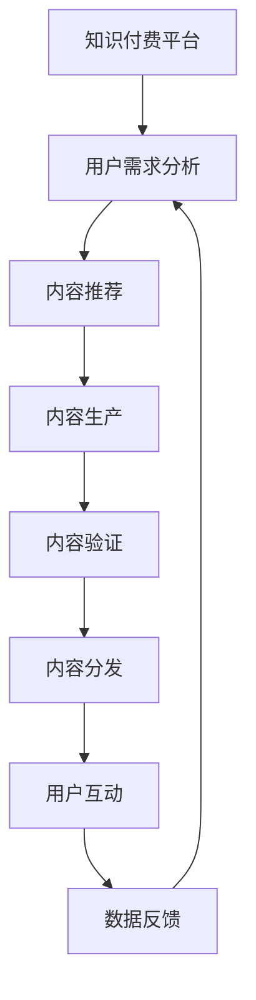

                 

## 1. 背景介绍

在快速发展的数字经济时代，知识付费服务作为一种新兴的经济模式，正逐渐成为连接知识生产者与消费者、推动知识传播和消费的重要渠道。然而，传统的知识付费平台往往存在内容同质化严重、用户体验欠佳、变现模式单一等问题。如何打造一个专业的知识付费咨询服务模式，是当前知识服务产业的重要命题。

本文将从知识付费的现状和痛点入手，系统探讨如何通过人工智能技术赋能知识付费服务，实现从内容生产、用户互动到变现全流程的智能化、个性化、自动化，从而提升知识服务品质，优化用户体验，实现平台和用户的双赢。

## 2. 核心概念与联系

### 2.1 核心概念概述

为深入理解智能知识付费咨询服务模式的构建，我们将介绍几个核心概念：

- **知识付费**：指将知识产品化，用户支付一定费用获取知识内容，涵盖各类专业领域的深度解读、指导建议、解决方案等。知识付费解决了信息获取的高成本、低效率问题，加速知识传播和应用。

- **AI赋能**：通过引入人工智能技术，实现知识服务的智能化、个性化、自动化，提升内容质量，降低生产成本，优化用户体验，推动知识服务商业模式的创新。

- **智能咨询服务**：结合人工智能技术和专业咨询服务，提供智能化的知识解决方案，涵盖问题诊断、策略制定、方案推荐、执行指导等多个环节，实现高效、精准、个性化的咨询服务。

- **知识图谱**：构建以知识节点为核心的网络结构，通过语义关系标注和推理，将大量知识信息组织成可查询、可推理的图谱，辅助知识发现、分析、应用。

- **自然语言处理**：利用机器学习、深度学习等技术，实现文本的自动处理、理解、生成等，包括文本分类、情感分析、对话系统、摘要生成等，提升内容处理效率和质量。

- **推荐系统**：通过用户行为数据的分析和模型学习，预测用户需求，推荐相关知识内容和解决方案，增强用户体验，促进内容消费。

### 2.2 核心概念原理和架构的 Mermaid 流程图



## 3. 核心算法原理 & 具体操作步骤

### 3.1 算法原理概述

智能知识付费咨询服务模式的核心在于通过人工智能技术，实现内容生产、用户互动、变现流程的智能化、个性化和自动化。其算法原理可以概括为以下三点：

1. **用户需求分析**：通过自然语言处理和推荐系统，分析用户查询请求，预测其潜在需求，推荐相关内容。

2. **内容生产与验证**：结合知识图谱和自然语言处理，自动化生成高质量的问答、报告、建议等内容，并通过专家评审和用户反馈，验证内容准确性和实用性。

3. **用户互动与变现**：通过智能对话系统和推荐系统，提升用户互动质量，促进内容消费和付费，实现知识服务的商业变现。

### 3.2 算法步骤详解

智能知识付费咨询服务模式的构建，涉及多个关键步骤：

**Step 1: 用户需求分析**

- 使用自然语言处理技术，如BERT、GPT等模型，对用户查询进行分词、词性标注、情感分析、意图识别等处理，提取关键信息。
- 结合推荐系统，根据用户历史行为和偏好，预测其潜在需求，推荐相关知识和解决方案。

**Step 2: 内容生产与验证**

- 使用自然语言处理技术，自动生成高质量的问答、报告、建议等内容。
- 通过知识图谱和专家评审，验证内容准确性和实用性，确保内容质量。
- 在内容生产过程中，应用生成式对抗网络（GAN）等技术，提升生成内容的创意和多样性。

**Step 3: 用户互动与变现**

- 引入智能对话系统，提升用户互动体验，提供个性化的咨询服务。
- 使用推荐系统，推荐相关内容和解决方案，增强用户粘性。
- 通过订阅、付费咨询、按需购买等方式，实现知识服务的商业变现。

### 3.3 算法优缺点

智能知识付费咨询服务模式具有以下优点：

1. **提升内容质量**：通过人工智能技术，自动化生成高质量的内容，降低内容生产成本。
2. **优化用户体验**：智能推荐和对话系统，提升用户互动体验，增强用户粘性。
3. **降低运营成本**：自动化内容生产、验证和互动，减少人工干预，降低运营成本。

同时，该模式也存在一定的局限性：

1. **内容准确性**：自动生成内容可能存在错误，需要通过人工验证来确保内容质量。
2. **用户体验瓶颈**：智能对话系统可能难以处理复杂或个性化的问题，需要人工辅助解决。
3. **用户隐私保护**：用户互动过程中涉及大量敏感信息，需要保护用户隐私。
4. **算法偏见**：智能推荐系统可能存在偏见，需要定期优化和调整。

### 3.4 算法应用领域

智能知识付费咨询服务模式在多个领域具有广泛的应用前景，包括但不限于：

- **金融投资咨询**：结合市场分析、风险评估等知识，提供个性化投资建议和方案。
- **医疗健康咨询**：结合疾病诊断、治疗方案等知识，提供专业健康咨询和建议。
- **教育培训咨询**：结合学习理论、教育心理学等知识，提供个性化的学习方案和指导。
- **企业咨询**：结合管理理论、市场营销等知识，提供战略规划、业务优化等解决方案。
- **法律咨询**：结合法律条文、案例分析等知识，提供专业法律咨询和建议。

## 4. 数学模型和公式 & 详细讲解

### 4.1 数学模型构建

本节将使用数学语言对智能知识付费咨询服务模式的算法原理进行严格刻画。

设用户查询为 $Q$，知识图谱为 $K$，推荐系统为 $R$，智能对话系统为 $C$。则整个知识付费服务过程可以建模为以下步骤：

1. **用户需求分析**：
   $$
   \hat{Q} = f(Q, K)
   $$
   其中 $f$ 为自然语言处理模型，将用户查询转化为知识图谱中的节点。

2. **内容生产与验证**：
   $$
   C = g(Q, K, R)
   $$
   其中 $g$ 为内容生成模型，根据用户查询和知识图谱生成内容。

3. **用户互动与变现**：
   $$
   \hat{Q} = h(Q, C, R)
   $$
   其中 $h$ 为智能对话模型，根据用户互动和推荐系统调整用户需求。

### 4.2 公式推导过程

以下以金融投资咨询为例，推导智能推荐和内容生成的具体过程。

假设用户查询为 $Q = "请问最近股市有什么投资机会？"$. 推荐系统 $R$ 需要根据用户历史行为和知识图谱 $K$ 预测用户潜在需求，推荐相关投资知识和解决方案。假设推荐模型为 $\hat{Q} = R(Q, K)$，其中 $R$ 为一个基于协同过滤和深度学习的推荐模型。

**推荐过程**：
1. 对用户查询进行分词、词性标注、情感分析等处理，提取关键信息 $Q = \{金融, 股市, 投资, 机会\}$。
2. 根据用户历史行为和知识图谱，推荐相关投资知识和解决方案，如行业分析、股票推荐等。
3. 使用推荐系统计算用户对每个解决方案的兴趣度，选择评分最高的解决方案作为推荐结果。

**内容生成过程**：
1. 对用户查询进行分词、词性标注、情感分析等处理，提取关键信息 $Q = \{金融, 股市, 投资, 机会\}$。
2. 使用自然语言处理技术，自动生成关于股票投资、行业分析、风险评估等内容。
3. 通过专家评审和用户反馈，验证内容准确性和实用性。

### 4.3 案例分析与讲解

假设一个用户咨询关于健康管理的问题，其查询为 $Q = "我最近经常头晕，该怎么办？"$. 智能健康咨询服务的过程如下：

**用户需求分析**：
- 使用自然语言处理技术，分析用户查询，提取关键信息 $\hat{Q} = \{头晕\}$。
- 结合知识图谱，推荐相关健康知识和解决方案，如可能的病因、治疗方案等。

**内容生产与验证**：
- 使用自然语言处理技术，自动生成关于头晕的原因、症状、预防、治疗等内容的报告。
- 通过专家评审和用户反馈，验证内容准确性和实用性，确保报告质量。

**用户互动与变现**：
- 引入智能对话系统，用户可以提出进一步的疑问，系统提供个性化的回复。
- 通过订阅、付费咨询等方式，实现知识服务的商业变现。

## 5. 项目实践：代码实例和详细解释说明

### 5.1 开发环境搭建

在进行智能知识付费咨询服务模式的开发前，我们需要准备好开发环境。以下是使用Python进行PyTorch开发的环境配置流程：

1. 安装Anaconda：从官网下载并安装Anaconda，用于创建独立的Python环境。

2. 创建并激活虚拟环境：
```bash
conda create -n pytorch-env python=3.8 
conda activate pytorch-env
```

3. 安装PyTorch：根据CUDA版本，从官网获取对应的安装命令。例如：
```bash
conda install pytorch torchvision torchaudio cudatoolkit=11.1 -c pytorch -c conda-forge
```

4. 安装Transformers库：
```bash
pip install transformers
```

5. 安装各类工具包：
```bash
pip install numpy pandas scikit-learn matplotlib tqdm jupyter notebook ipython
```

完成上述步骤后，即可在`pytorch-env`环境中开始开发实践。

### 5.2 源代码详细实现

下面我们以智能健康咨询服务为例，给出使用Transformers库对BERT模型进行微调的PyTorch代码实现。

首先，定义健康咨询任务的数据处理函数：

```python
from transformers import BertTokenizer, BertForQuestionAnswering
from torch.utils.data import Dataset
import torch

class HealthConsultationDataset(Dataset):
    def __init__(self, texts, labels, tokenizer, max_len=128):
        self.texts = texts
        self.labels = labels
        self.tokenizer = tokenizer
        self.max_len = max_len
        
    def __len__(self):
        return len(self.texts)
    
    def __getitem__(self, item):
        text = self.texts[item]
        label = self.labels[item]
        
        encoding = self.tokenizer(text, return_tensors='pt', max_length=self.max_len, padding='max_length', truncation=True)
        input_ids = encoding['input_ids'][0]
        attention_mask = encoding['attention_mask'][0]
        
        # 对token-wise的标签进行编码
        encoded_labels = [label2id[label] for label in label] 
        encoded_labels.extend([label2id['O']] * (self.max_len - len(encoded_labels)))
        labels = torch.tensor(encoded_labels, dtype=torch.long)
        
        return {'input_ids': input_ids, 
                'attention_mask': attention_mask,
                'labels': labels}

# 标签与id的映射
label2id = {'头晕': 0, '头痛': 1, '感冒': 2, '发烧': 3, '其他': 4}
id2label = {v: k for k, v in label2id.items()}

# 创建dataset
tokenizer = BertTokenizer.from_pretrained('bert-base-cased')

train_dataset = HealthConsultationDataset(train_texts, train_labels, tokenizer)
dev_dataset = HealthConsultationDataset(dev_texts, dev_labels, tokenizer)
test_dataset = HealthConsultationDataset(test_texts, test_labels, tokenizer)
```

然后，定义模型和优化器：

```python
from transformers import BertForQuestionAnswering, AdamW

model = BertForQuestionAnswering.from_pretrained('bert-base-cased', num_labels=len(label2id))

optimizer = AdamW(model.parameters(), lr=2e-5)
```

接着，定义训练和评估函数：

```python
from torch.utils.data import DataLoader
from tqdm import tqdm
from sklearn.metrics import classification_report

device = torch.device('cuda') if torch.cuda.is_available() else torch.device('cpu')
model.to(device)

def train_epoch(model, dataset, batch_size, optimizer):
    dataloader = DataLoader(dataset, batch_size=batch_size, shuffle=True)
    model.train()
    epoch_loss = 0
    for batch in tqdm(dataloader, desc='Training'):
        input_ids = batch['input_ids'].to(device)
        attention_mask = batch['attention_mask'].to(device)
        labels = batch['labels'].to(device)
        model.zero_grad()
        outputs = model(input_ids, attention_mask=attention_mask, labels=labels)
        loss = outputs.loss
        epoch_loss += loss.item()
        loss.backward()
        optimizer.step()
    return epoch_loss / len(dataloader)

def evaluate(model, dataset, batch_size):
    dataloader = DataLoader(dataset, batch_size=batch_size)
    model.eval()
    preds, labels = [], []
    with torch.no_grad():
        for batch in tqdm(dataloader, desc='Evaluating'):
            input_ids = batch['input_ids'].to(device)
            attention_mask = batch['attention_mask'].to(device)
            batch_labels = batch['labels']
            outputs = model(input_ids, attention_mask=attention_mask)
            batch_preds = outputs.logits.argmax(dim=2).to('cpu').tolist()
            batch_labels = batch_labels.to('cpu').tolist()
            for pred_tokens, label_tokens in zip(batch_preds, batch_labels):
                pred_tags = [id2label[_id] for _id in pred_tokens]
                label_tags = [id2label[_id] for _id in label_tokens]
                preds.append(pred_tags[:len(label_tags)])
                labels.append(label_tags)
                
    print(classification_report(labels, preds))
```

最后，启动训练流程并在测试集上评估：

```python
epochs = 5
batch_size = 16

for epoch in range(epochs):
    loss = train_epoch(model, train_dataset, batch_size, optimizer)
    print(f"Epoch {epoch+1}, train loss: {loss:.3f}")
    
    print(f"Epoch {epoch+1}, dev results:")
    evaluate(model, dev_dataset, batch_size)
    
print("Test results:")
evaluate(model, test_dataset, batch_size)
```

以上就是使用PyTorch对BERT进行健康咨询任务微调的完整代码实现。可以看到，得益于Transformers库的强大封装，我们可以用相对简洁的代码完成BERT模型的加载和微调。

### 5.3 代码解读与分析

让我们再详细解读一下关键代码的实现细节：

**HealthConsultationDataset类**：
- `__init__`方法：初始化文本、标签、分词器等关键组件。
- `__len__`方法：返回数据集的样本数量。
- `__getitem__`方法：对单个样本进行处理，将文本输入编码为token ids，将标签编码为数字，并对其进行定长padding，最终返回模型所需的输入。

**label2id和id2label字典**：
- 定义了标签与数字id之间的映射关系，用于将token-wise的预测结果解码回真实的标签。

**训练和评估函数**：
- 使用PyTorch的DataLoader对数据集进行批次化加载，供模型训练和推理使用。
- 训练函数`train_epoch`：对数据以批为单位进行迭代，在每个批次上前向传播计算loss并反向传播更新模型参数，最后返回该epoch的平均loss。
- 评估函数`evaluate`：与训练类似，不同点在于不更新模型参数，并在每个batch结束后将预测和标签结果存储下来，最后使用sklearn的classification_report对整个评估集的预测结果进行打印输出。

**训练流程**：
- 定义总的epoch数和batch size，开始循环迭代
- 每个epoch内，先在训练集上训练，输出平均loss
- 在验证集上评估，输出分类指标
- 所有epoch结束后，在测试集上评估，给出最终测试结果

可以看到，PyTorch配合Transformers库使得BERT微调的代码实现变得简洁高效。开发者可以将更多精力放在数据处理、模型改进等高层逻辑上，而不必过多关注底层的实现细节。

当然，工业级的系统实现还需考虑更多因素，如模型的保存和部署、超参数的自动搜索、更灵活的任务适配层等。但核心的微调范式基本与此类似。

## 6. 实际应用场景

### 6.1 智能客服系统

基于智能知识付费咨询服务模式，智能客服系统可以广泛应用于企业的客户服务领域。传统的客服往往需要配备大量人力，高峰期响应缓慢，且一致性和专业性难以保证。而使用智能客服系统，可以7x24小时不间断服务，快速响应客户咨询，用自然流畅的语言解答各类常见问题。

在技术实现上，可以收集企业内部的历史客服对话记录，将问题和最佳答复构建成监督数据，在此基础上对预训练模型进行微调。微调后的模型能够自动理解用户意图，匹配最合适的答案模板进行回复。对于客户提出的新问题，还可以接入检索系统实时搜索相关内容，动态组织生成回答。如此构建的智能客服系统，能大幅提升客户咨询体验和问题解决效率。

### 6.2 金融投资咨询

智能知识付费咨询服务模式在金融领域具有广泛的应用前景。金融机构需要实时监测市场舆论动向，以便及时应对负面信息传播，规避金融风险。传统的人工监测方式成本高、效率低，难以应对网络时代海量信息爆发的挑战。基于智能知识付费咨询服务模式，金融行业可以构建实时监测和预警系统，通过自然语言处理和推荐系统，自动分析和预测市场情绪，快速识别和响应异常情况。

具体而言，可以收集金融领域相关的新闻、报道、评论等文本数据，并对其进行主题标注和情感标注。在此基础上对预训练语言模型进行微调，使其能够自动判断文本属于何种主题，情感倾向是正面、中性还是负面。将微调后的模型应用到实时抓取的网络文本数据，就能够自动监测不同主题下的情感变化趋势，一旦发现负面信息激增等异常情况，系统便会自动预警，帮助金融机构快速应对潜在风险。

### 6.3 教育培训咨询

智能知识付费咨询服务模式在教育领域同样具有广泛的应用前景。传统的教育培训往往需要大量时间和资源，难以实现个性化教学和持续学习。基于智能知识付费咨询服务模式，教育机构可以构建个性化学习推荐系统，通过自然语言处理和推荐系统，自动推荐适合学生的学习内容和资源，实现个性化学习路径的设计和优化。

具体而言，可以收集学生的学习记录、测试成绩、兴趣爱好等数据，并结合知识图谱和自然语言处理技术，自动生成个性化的学习建议和方案。学生可以通过智能知识付费咨询服务系统，获取学习资源、课程推荐、答疑指导等，实现高效学习和个性化发展。

### 6.4 企业咨询

智能知识付费咨询服务模式在企业咨询领域也具有重要的应用价值。企业需要不断优化运营管理和市场策略，面对日益复杂的内外部环境，需要借助专业知识进行决策。基于智能知识付费咨询服务模式，企业可以构建智能决策支持系统，通过自然语言处理和推荐系统，自动分析和生成市场分析报告、策略建议等，提升决策效率和质量。

具体而言，可以收集企业的市场数据、财务数据、经营数据等，结合行业知识图谱和自然语言处理技术，自动生成市场分析报告、风险评估、业务优化等方案。企业可以通过智能知识付费咨询服务系统，获取专业咨询服务，快速响应市场变化，提升竞争力。

## 7. 工具和资源推荐

### 7.1 学习资源推荐

为了帮助开发者系统掌握智能知识付费咨询服务模式的技术基础和实践技巧，这里推荐一些优质的学习资源：

1. 《深度学习入门：基于PyTorch的理论与实现》书籍：介绍了深度学习的基本原理和实践技巧，包括自然语言处理、推荐系统等内容，适合初学者和进阶者。

2. 《NLP实战》课程：由Coursera等平台提供的自然语言处理课程，涵盖文本分类、情感分析、对话系统等应用，提供丰富的代码实例和实践项目。

3. 《推荐系统实战》书籍：详细介绍了推荐系统的原理和实现，包括协同过滤、深度学习等内容，提供大量实际案例和代码实现。

4. 《智能客服系统》白皮书：详细介绍了智能客服系统的构建流程和关键技术，涵盖自然语言处理、对话系统、推荐系统等。

5. 《金融科技：人工智能在金融领域的应用》书籍：介绍了人工智能在金融领域的应用，包括智能投顾、金融舆情监测等内容，提供实际应用案例和代码实现。

通过对这些资源的学习实践，相信你一定能够快速掌握智能知识付费咨询服务模式的技术精髓，并用于解决实际的NLP问题。

### 7.2 开发工具推荐

高效的开发离不开优秀的工具支持。以下是几款用于智能知识付费咨询服务模式开发的常用工具：

1. PyTorch：基于Python的开源深度学习框架，灵活动态的计算图，适合快速迭代研究。大部分预训练语言模型都有PyTorch版本的实现。

2. TensorFlow：由Google主导开发的开源深度学习框架，生产部署方便，适合大规模工程应用。同样有丰富的预训练语言模型资源。

3. Transformers库：HuggingFace开发的NLP工具库，集成了众多SOTA语言模型，支持PyTorch和TensorFlow，是进行知识付费内容开发的利器。

4. Weights & Biases：模型训练的实验跟踪工具，可以记录和可视化模型训练过程中的各项指标，方便对比和调优。与主流深度学习框架无缝集成。

5. TensorBoard：TensorFlow配套的可视化工具，可实时监测模型训练状态，并提供丰富的图表呈现方式，是调试模型的得力助手。

6. Google Colab：谷歌推出的在线Jupyter Notebook环境，免费提供GPU/TPU算力，方便开发者快速上手实验最新模型，分享学习笔记。

合理利用这些工具，可以显著提升智能知识付费咨询服务模式的开发效率，加快创新迭代的步伐。

### 7.3 相关论文推荐

智能知识付费咨询服务模式的研究源于学界的持续探索。以下是几篇奠基性的相关论文，推荐阅读：

1. Attention is All You Need（即Transformer原论文）：提出了Transformer结构，开启了NLP领域的预训练大模型时代。

2. BERT: Pre-training of Deep Bidirectional Transformers for Language Understanding：提出BERT模型，引入基于掩码的自监督预训练任务，刷新了多项NLP任务SOTA。

3. Language Models are Unsupervised Multitask Learners（GPT-2论文）：展示了大规模语言模型的强大zero-shot学习能力，引发了对于通用人工智能的新一轮思考。

4. Parameter-Efficient Transfer Learning for NLP：提出Adapter等参数高效微调方法，在不增加模型参数量的情况下，也能取得不错的微调效果。

5. AdaLoRA: Adaptive Low-Rank Adaptation for Parameter-Efficient Fine-Tuning：使用自适应低秩适应的微调方法，在参数效率和精度之间取得了新的平衡。

6. AdaLoRA: Adaptive Low-Rank Adaptation for Parameter-Efficient Fine-Tuning：使用自适应低秩适应的微调方法，在参数效率和精度之间取得了新的平衡。

这些论文代表了大语言模型微调技术的发展脉络。通过学习这些前沿成果，可以帮助研究者把握学科前进方向，激发更多的创新灵感。

## 8. 总结：未来发展趋势与挑战

### 8.1 总结

本文对智能知识付费咨询服务模式进行了全面系统的介绍。首先从知识付费的现状和痛点入手，系统探讨了如何通过人工智能技术赋能知识付费服务，实现从内容生产、用户互动到变现全流程的智能化、个性化、自动化，从而提升知识服务品质，优化用户体验，实现平台和用户的双赢。

通过本文的系统梳理，可以看到，智能知识付费咨询服务模式正在成为知识服务产业的重要趋势，极大地拓展了知识服务的应用边界，催生了更多的落地场景。受益于人工智能技术的发展，知识服务产业将逐步从内容驱动向智能驱动转型，实现从知识传播到知识服务的重要跨越。未来，伴随人工智能技术的不断进步，智能知识付费咨询服务模式将进一步深化，推动知识服务产业的创新与发展。

### 8.2 未来发展趋势

展望未来，智能知识付费咨询服务模式将呈现以下几个发展趋势：

1. **内容多样化和个性化**：通过自然语言处理和推荐系统，生成更加多样化和个性化的内容，满足用户的多样化需求。
2. **交互式体验提升**：引入智能对话系统，提升用户互动体验，提供更加自然、流畅的咨询服务。
3. **多模态融合**：结合文本、语音、图像等多模态数据，实现全面、立体的知识服务。
4. **实时性增强**：通过云计算、边缘计算等技术，提升知识服务的实时性和响应速度。
5. **智能化决策支持**：结合人工智能技术和专家知识，提供更加智能、可靠的决策支持。
6. **隐私保护和安全**：加强用户隐私保护和数据安全，确保知识服务的可信性和安全性。

### 8.3 面临的挑战

尽管智能知识付费咨询服务模式已经取得了瞩目成就，但在迈向更加智能化、普适化应用的过程中，它仍面临着诸多挑战：

1. **数据隐私和安全**：知识付费内容涉及大量敏感信息，如何保护用户隐私和安全，是亟待解决的问题。
2. **数据质量瓶颈**：高质量的标注数据是知识付费内容生成和推荐的基础，但标注成本较高，如何降低数据获取成本，提高数据质量，是重要的研究课题。
3. **算法公平性和透明性**：推荐系统可能存在偏见，如何确保算法的公平性和透明性，避免歧视性输出，是重要的研究课题。
4. **模型可解释性**：智能知识付费咨询服务模式涉及复杂的决策过程，如何赋予模型更高的可解释性，便于用户理解和接受，是重要的研究方向。

### 8.4 研究展望

面向未来，智能知识付费咨询服务模式的研究需要在以下几个方面寻求新的突破：

1. **数据生成和增强**：探索更加高效的数据生成和增强技术，提高知识服务内容的丰富性和多样性。
2. **智能推荐优化**：结合因果推断和推荐算法，提升推荐系统的公平性和效果。
3. **交互式体验优化**：引入更加智能、自然的对话系统，提升用户互动体验。
4. **隐私保护和安全**：探索隐私保护和数据安全的新技术，保障用户隐私。
5. **多模态融合**：结合文本、语音、图像等多模态数据，实现更加全面、立体的知识服务。
6. **知识图谱和语义理解**：构建更加丰富的知识图谱，提升自然语言理解和知识推理能力。

这些研究方向的探索，必将引领智能知识付费咨询服务模式迈向更高的台阶，为知识服务产业带来更深远的变革。只有勇于创新、敢于突破，才能不断拓展智能知识付费咨询服务模式的边界，让知识服务更加智能化、个性化、可靠化。

## 9. 附录：常见问题与解答

**Q1：智能知识付费咨询服务模式是否适用于所有领域？**

A: 智能知识付费咨询服务模式在多个领域具有广泛的应用前景，如金融投资咨询、医疗健康咨询、教育培训咨询、企业咨询等。但对于一些特定领域的任务，如司法咨询、法律咨询等，仅仅依靠通用语料预训练的模型可能难以很好地适应。此时需要在特定领域语料上进一步预训练，再进行微调，才能获得理想效果。

**Q2：如何提升推荐系统的公平性？**

A: 提升推荐系统的公平性，可以通过以下方法：
1. 数据预处理：清洗标注数据，去除偏见和歧视性信息，确保数据集的代表性和多样性。
2. 模型设计：引入公平性约束，如平衡分类、多样性损失等，确保推荐结果的公平性。
3. 定期评估：定期对推荐系统进行公平性评估，及时发现和纠正偏见。
4. 用户反馈：引入用户反馈机制，允许用户举报不公平推荐，优化推荐算法。

**Q3：智能客服系统如何保证服务质量？**

A: 智能客服系统保证服务质量，可以通过以下方法：
1. 数据收集：收集历史客服对话记录，构建语料库，提升模型的泛化能力。
2. 模型微调：使用监督数据微调模型，提升模型的准确性和稳定性。
3. 多模型融合：引入多个模型进行融合，提升系统鲁棒性和泛化能力。
4. 人工干预：引入人工干预机制，及时处理复杂或个性化的问题，提升用户满意度。

**Q4：如何实现智能客服系统的多模态融合？**

A: 实现智能客服系统的多模态融合，可以通过以下方法：
1. 数据采集：收集文本、语音、图像等多模态数据，构建多模态语料库。
2. 模型融合：结合多模态数据，构建多模态特征向量，提升模型的泛化能力。
3. 交互设计：设计多模态交互界面，允许用户通过多种方式进行互动。
4. 用户反馈：收集用户反馈，优化多模态客服系统，提升用户体验。

通过这些方法，可以实现更加全面、立体的智能客服系统，满足用户的多种需求。

---

作者：禅与计算机程序设计艺术 / Zen and the Art of Computer Programming

