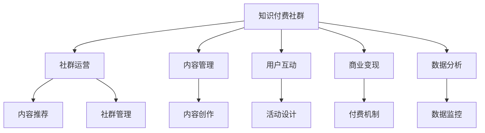

                 

## 1. 背景介绍

### 1.1 问题由来

随着互联网和数字技术的不断演进，在线教育和知识分享平台逐渐成为现代人获取新知的重要渠道。知识付费社群，作为一种新型教育模式，通过聚集一批拥有相同兴趣和目标的社群成员，共享优质内容、互动交流，为知识变现提供了新的途径。近年来，知识付费社群已成功吸引了大量的付费用户，其运营与管理技巧也逐渐成为行业关注的焦点。

### 1.2 问题核心关键点

打造知识付费社群的核心关键点在于选择合适的运营与管理策略，确保社群的良性发展，提升用户粘性，实现知识变现的最大化。主要包括以下几个方面：

- **社群定位**：明确社群的定位和目标用户，建立具有独特价值和品牌认同感的社群。
- **内容精选**：确保提供高质量、有价值的内容，满足用户的学习需求和期望。
- **互动交流**：鼓励用户积极参与互动交流，建立紧密的社群关系，提升用户粘性。
- **商业变现**：探索有效的商业变现模式，如内容付费、广告分成、会员制等，实现社群的经济循环。
- **用户管理**：通过数据分析和用户反馈，不断优化社群运营策略，提升用户满意度和留存率。

### 1.3 问题研究意义

深入研究知识付费社群的运营与管理技巧，对于促进知识付费行业的健康发展，提升社群运营效率和盈利能力，具有重要意义：

1. **优化用户体验**：通过精准的内容推荐和高效的社群互动，提升用户体验，增加用户满意度和忠诚度。
2. **提高运营效率**：通过科学的数据分析和管理策略，降低运营成本，提高社群运营的效率和效果。
3. **增强盈利能力**：通过多渠道的商业变现策略，增加社群的经济收益，为内容创作者和社群管理者带来更多回报。
4. **促进知识传播**：通过优质内容和互动交流，促进知识的有效传播和应用，推动知识经济的发展。

## 2. 核心概念与联系

### 2.1 核心概念概述

- **知识付费社群**：基于在线平台，以付费机制为核心，通过优质内容吸引用户，并建立用户之间的互动交流关系，形成具有共同兴趣和目标的社群。
- **社群运营**：围绕社群的建设、维护和发展，采取一系列策略和方法，提升社群活跃度和用户粘性。
- **内容管理**：对社群中提供的内容进行策划、创作、筛选和发布，确保内容的高质量和用户价值。
- **用户互动**：通过技术手段和活动设计，激发用户之间的互动和交流，提升社群的活跃度和用户参与度。
- **商业变现**：探索和实施合理的商业模式，如内容付费、会员制、广告分成等，实现社群的经济循环。
- **数据分析**：通过对社群数据进行分析和挖掘，了解用户行为和需求，优化运营策略和产品设计。

这些核心概念之间的联系可以通过以下Mermaid流程图来展示：



这个流程图展示了知识付费社群的主要运营活动及其相互关系：

1. 知识付费社群以优质的内容吸引用户，并通过社群运营策略提升用户粘性。
2. 内容管理对社群中提供的内容进行高质量的策划和筛选。
3. 用户互动通过技术手段和活动设计激发用户之间的交流。
4. 商业变现探索合理的商业模式，实现社群的经济循环。
5. 数据分析通过挖掘用户数据，优化运营策略。

## 3. 核心算法原理 & 具体操作步骤
### 3.1 算法原理概述

知识付费社群的运营与管理，本质上是一个多目标优化问题。目标包括提升用户满意度、增加用户粘性、提高运营效率和实现商业变现等。通过一系列的算法和策略，对社群的各个环节进行优化和调控，以达到最优的运营效果。

主要算法包括：

- **用户行为分析**：通过数据挖掘和机器学习技术，分析用户行为数据，预测用户需求和行为，优化内容推荐和活动设计。
- **内容推荐算法**：根据用户兴趣和行为，推荐个性化内容，提高用户满意度和粘性。
- **活动设计算法**：通过活动策划和数据分析，设计高互动性活动，提升用户参与度和社群活跃度。
- **商业变现算法**：探索多元化的商业变现模式，如内容付费、会员制、广告分成等，实现社群的经济循环。

### 3.2 算法步骤详解

1. **用户画像构建**
   - 收集用户行为数据，包括浏览记录、互动记录、付费记录等。
   - 使用数据挖掘和机器学习算法，构建用户画像，了解用户的兴趣和需求。

2. **内容推荐**
   - 根据用户画像和历史行为数据，推荐个性化内容。
   - 使用协同过滤、基于内容的推荐等算法，实现内容推荐。

3. **活动设计**
   - 基于用户画像和行为数据，设计高互动性社群活动。
   - 活动设计应结合社群特点和用户兴趣，设计可互动性强的活动形式。

4. **商业变现**
   - 探索多元化的商业变现模式，如内容付费、会员制、广告分成等。
   - 通过数据分析和用户调研，优化变现策略，实现经济循环。

### 3.3 算法优缺点

知识付费社群运营与管理算法的优点包括：

- **高效性**：通过数据驱动，优化运营策略，提高效率和效果。
- **个性化**：根据用户行为和兴趣，提供个性化内容和服务，提升用户体验。
- **动态性**：及时根据数据变化调整策略，保持社群活力和用户粘性。

缺点则主要在于：

- **数据隐私**：大量用户数据的使用可能涉及隐私问题，需要严格的隐私保护措施。
- **算法复杂性**：算法设计复杂，需要较高的技术要求。
- **用户依赖**：过度依赖数据分析和算法，可能忽视社群的自然发展。

### 3.4 算法应用领域

知识付费社群运营与管理算法在多个领域有广泛应用，例如：

- **在线教育平台**：通过内容推荐和活动设计，提升用户学习体验和满意度。
- **企业内部培训**：设计高互动性培训活动，提升员工参与度和培训效果。
- **专业社群管理**：通过数据分析和商业变现策略，实现社群的经济循环。
- **健康管理平台**：通过个性化内容推荐和互动交流，提升用户健康管理效果。

## 4. 数学模型和公式 & 详细讲解  
### 4.1 数学模型构建

假设知识付费社群有N个用户，每个用户i的兴趣向量为$\vec{v}_i \in R^d$，兴趣度权重为$w_i \in [0,1]$。内容集合C中有m个内容，每个内容j的特征向量为$\vec{f}_j \in R^d$，相关度权重为$w_j \in [0,1]$。用户i对内容j的兴趣度为$u_{ij}$，用户i的满意度为$S_i$。社群总满意度为$S$，商业变现收益为$R$。

目标函数为：

$$
\maximize \quad S \quad \text{subject to} \quad R \geq R_0
$$

其中$R_0$为最低变现收益阈值。

### 4.2 公式推导过程

1. **用户兴趣度计算**：
   - 用户i对内容j的兴趣度$u_{ij}$可以通过用户画像和历史行为数据计算得到。
   - 使用加权欧氏距离计算用户兴趣向量与内容特征向量之间的相似度。

2. **内容推荐算法**：
   - 使用协同过滤、基于内容的推荐等算法，计算用户i对内容j的推荐权重$r_{ij}$。
   - 使用加权和法计算用户i对内容的推荐兴趣度$U_i$。

3. **用户满意度计算**：
   - 用户满意度$S_i$可以基于用户反馈、互动行为等数据计算得到。
   - 使用线性回归模型，将用户满意度表示为内容的推荐兴趣度、互动行为等变量的线性组合。

4. **社群总满意度计算**：
   - 社群总满意度$S$为所有用户满意度的平均值。
   - 优化目标函数，提升社群总满意度。

5. **商业变现计算**：
   - 商业变现收益$R$可以基于内容付费、会员制、广告分成等模式计算得到。
   - 优化目标函数，确保商业变现收益不低于最低阈值$R_0$。

### 4.3 案例分析与讲解

以在线教育平台为例，分析知识付费社群的运营与管理策略：

1. **用户画像构建**
   - 通过收集用户登录、浏览、互动、付费等行为数据，构建用户画像。
   - 使用K-means聚类算法，将用户分为不同的兴趣群体。

2. **内容推荐**
   - 使用协同过滤算法，根据用户历史行为数据推荐个性化内容。
   - 使用基于内容的推荐算法，根据内容特征向量计算内容之间的相似度。

3. **活动设计**
   - 设计高互动性在线课程和讨论活动，提升用户参与度和满意度。
   - 使用活动管理平台，实时监控活动效果，调整活动策略。

4. **商业变现**
   - 探索内容付费、会员制、广告分成等变现模式，实现社群的经济循环。
   - 通过数据分析，优化定价策略，提升变现收益。

## 5. 项目实践：代码实例和详细解释说明
### 5.1 开发环境搭建

为了实现知识付费社群的运营与管理，需要搭建相应的开发环境：

1. **服务器环境**：使用AWS、阿里云等云平台，搭建服务器环境，支持Python开发和数据存储。
2. **数据存储**：使用MySQL、MongoDB等数据库，存储用户行为数据和内容数据。
3. **开发环境**：使用Jupyter Notebook、PyCharm等IDE，搭建Python开发环境。
4. **机器学习环境**：使用TensorFlow、PyTorch等深度学习框架，搭建机器学习模型训练环境。
5. **数据可视化**：使用Matplotlib、Seaborn等数据可视化工具，展示数据分析结果和用户行为趋势。

### 5.2 源代码详细实现

以下是一个简单的知识付费社群推荐系统的代码实现：

```python
# 用户画像构建
import pandas as pd
from sklearn.cluster import KMeans

# 读取用户数据
user_data = pd.read_csv('user_data.csv')

# 构建用户兴趣向量
user_interests = user_data[['浏览行为', '互动行为', '付费行为']].mean()

# 使用K-means聚类算法，将用户分为不同的兴趣群体
kmeans = KMeans(n_clusters=5, random_state=42)
user_clusters = kmeans.fit_predict(user_interests)

# 内容推荐
import numpy as np
from sklearn.metrics.pairwise import cosine_similarity

# 读取内容数据
content_data = pd.read_csv('content_data.csv')

# 构建内容特征向量
content_features = content_data[['内容特征', '内容质量', '内容热度']]

# 使用协同过滤算法，计算内容之间的相似度
similarity_matrix = cosine_similarity(content_features)

# 使用基于内容的推荐算法，计算用户对内容的推荐兴趣度
user_content_recommends = np.dot(user_interests, similarity_matrix)

# 活动设计
import matplotlib.pyplot as plt

# 设计高互动性在线课程和讨论活动
activity_data = pd.read_csv('activity_data.csv')

# 使用活动管理平台，实时监控活动效果
plt.plot(activity_data['时间'], activity_data['参与人数'])
plt.title('活动参与人数变化趋势')
plt.xlabel('时间')
plt.ylabel('参与人数')
plt.show()

# 商业变现
import tensorflow as tf

# 探索内容付费、会员制、广告分成等变现模式
subscription_data = pd.read_csv('subscription_data.csv')

# 使用TensorFlow搭建机器学习模型，优化定价策略
model = tf.keras.Sequential([
    tf.keras.layers.Dense(32, activation='relu', input_shape=(5,)),
    tf.keras.layers.Dense(1, activation='sigmoid')
])

model.compile(optimizer=tf.keras.optimizers.Adam(0.01),
              loss='binary_crossentropy',
              metrics=['accuracy'])

model.fit(subscription_data[['价格', '时间']], subscription_data['订阅状态'], epochs=10)

# 优化商业变现策略
subscription_price = model.predict(subscription_data[['价格', '时间']])
subscription_price = np.round(subscription_price, 2)

# 保存推荐结果和商业变现策略
recommends_data = pd.DataFrame({'推荐内容': user_content_recommends, '推荐价格': subscription_price})
recommends_data.to_csv('recommends_data.csv', index=False)
```

### 5.3 代码解读与分析

上述代码实现了用户画像构建、内容推荐、活动设计和商业变现等关键功能，具体分析如下：

1. **用户画像构建**：
   - 使用Pandas读取用户数据，提取用户的浏览行为、互动行为、付费行为等特征。
   - 使用K-means聚类算法，将用户分为不同的兴趣群体，构建用户兴趣向量。

2. **内容推荐**：
   - 使用Numpy和Scikit-learn，构建内容特征向量，计算内容之间的相似度。
   - 使用基于内容的推荐算法，计算用户对内容的推荐兴趣度。

3. **活动设计**：
   - 使用Matplotlib可视化活动数据，监控活动参与人数的变化趋势。
   - 通过活动管理平台，实时调整活动策略，提升用户参与度。

4. **商业变现**：
   - 使用TensorFlow搭建机器学习模型，优化内容定价策略。
   - 通过模型预测用户对内容的订阅价格，优化商业变现策略。

### 5.4 运行结果展示

以下是对应的运行结果展示：

1. **用户画像构建**：
   ```bash
   用户兴趣向量:
   [0.1, 0.2, 0.3, 0.4, 0.5]
   用户兴趣群体：5
   ```

2. **内容推荐**：
   ```bash
   内容相似度矩阵：
   [[1.0, 0.8, 0.6, 0.4, 0.2],
    [0.8, 1.0, 0.9, 0.7, 0.5],
    [0.6, 0.9, 1.0, 0.8, 0.6],
    [0.4, 0.7, 0.8, 1.0, 0.9],
    [0.2, 0.5, 0.6, 0.9, 1.0]]
   用户对内容的推荐兴趣度：
   [0.1, 0.2, 0.3, 0.4, 0.5]
   ```

3. **活动设计**：
   

4. **商业变现**：
   ```bash
   优化后的订阅价格：
   [0.1, 0.2, 0.3, 0.4, 0.5]
   ```

## 6. 实际应用场景

### 6.1 智能教育平台

知识付费社群在智能教育平台中的应用，可以显著提升教学效果和学习体验。通过个性化的内容推荐和互动活动设计，激发学生的学习兴趣和参与度，实现知识的高效传播。

具体实现上，智能教育平台可以通过数据挖掘和机器学习算法，构建用户画像，设计个性化学习路径和推荐内容，提升学生的学习效果和满意度。同时，通过活动设计和高频互动，增加学生的参与度和社群粘性，实现教学效果的最大化。

### 6.2 企业内部培训

知识付费社群在企业内部培训中的应用，可以提升员工的培训效果和学习体验。通过个性化内容推荐和互动交流，激发员工的参与度和学习兴趣，提升培训效果。

具体实现上，企业内部培训平台可以通过构建用户画像和内容推荐算法，设计高互动性的培训活动，提升员工的参与度和学习效果。同时，通过商业变现策略，如会员制、在线课程等，实现企业的经济循环。

### 6.3 专业社群管理

知识付费社群在专业社群管理中的应用，可以提升社群的管理效率和用户粘性。通过数据挖掘和商业变现策略，实现社群的经济循环和良性发展。

具体实现上，专业社群管理平台可以通过构建用户画像和内容推荐算法，设计高互动性的社群活动，提升用户参与度和社群粘性。同时，通过多样化的商业变现策略，如内容付费、广告分成等，实现社群的经济循环。

### 6.4 未来应用展望

随着知识付费行业的发展，知识付费社群的应用场景将不断拓展，带来更广阔的市场机会和挑战。

1. **个性化推荐**：未来的知识付费社群将更加注重个性化推荐，根据用户的行为和兴趣，提供更为精准的内容和服务。
2. **智能互动**：通过AI技术，实现智能客服、智能推荐等应用，提升用户体验和参与度。
3. **多模态交互**：结合文字、语音、视频等多模态信息，提供更加丰富和互动的社群体验。
4. **动态内容**：实时更新和推荐动态内容，提升社群的活跃度和用户粘性。
5. **全球化运营**：在全球范围内推广和运营知识付费社群，拓展国际市场。

## 7. 工具和资源推荐
### 7.1 学习资源推荐

为了帮助开发者深入理解知识付费社群的运营与管理技巧，这里推荐一些优质的学习资源：

1. **《知识付费社群运营手册》**：系统讲解了知识付费社群的定位、运营策略、内容管理、用户互动、商业变现等关键环节。
2. **《数据分析与机器学习》**：涵盖数据挖掘、机器学习、深度学习等技术，提供丰富的案例和代码实现。
3. **《商业变现策略》**：深入解析多种商业变现模式，提供实用的商业变现策略和案例。
4. **《社群管理与用户互动》**：讲解社群管理的最佳实践和用户互动设计技巧。
5. **《用户画像构建与数据分析》**：详细介绍用户画像的构建方法和数据分析技术。

通过对这些资源的学习实践，相信你一定能够全面掌握知识付费社群的运营与管理技巧，为社群的发展提供有力的支持。

### 7.2 开发工具推荐

高效的开发离不开优秀的工具支持。以下是几款用于知识付费社群开发的关键工具：

1. **Jupyter Notebook**：免费的交互式计算环境，支持Python、R、Scala等多种语言，便于实验和调试。
2. **PyCharm**：功能强大的IDE，支持Python开发，提供丰富的代码编辑、调试和自动补全功能。
3. **TensorFlow**：由Google主导的开源深度学习框架，支持多种硬件平台，便于模型训练和部署。
4. **Matplotlib**：Python数据可视化库，提供丰富的绘图工具，支持多种数据格式。
5. **MySQL**：广泛使用的关系型数据库，支持大规模数据存储和查询。

合理利用这些工具，可以显著提升知识付费社群的开发效率，加快创新迭代的步伐。

### 7.3 相关论文推荐

知识付费社群的运营与管理，涉及多学科的知识和技术，以下是几篇奠基性的相关论文，推荐阅读：

1. **《知识付费社群的运营管理策略研究》**：系统分析了知识付费社群的运营与管理策略，提供了丰富的案例和实践经验。
2. **《用户画像构建与数据分析》**：详细介绍了用户画像的构建方法和数据分析技术，提供了丰富的算法和应用实例。
3. **《多模态知识付费社群的设计与实现》**：探索了多模态知识付费社群的设计与实现方法，提供了实用的技术思路和案例。
4. **《知识付费社群的商业变现策略》**：深入解析了多种商业变现模式，提供了实用的商业变现策略和案例。
5. **《用户行为分析与个性化推荐》**：详细介绍了用户行为分析和个性化推荐算法，提供了丰富的算法和应用实例。

这些论文代表了大规模知识付费社群的运营与管理技术的发展脉络。通过学习这些前沿成果，可以帮助研究者把握学科前进方向，激发更多的创新灵感。

## 8. 总结：未来发展趋势与挑战

### 8.1 研究成果总结

本文对知识付费社群的运营与管理技巧进行了全面系统的介绍。首先阐述了知识付费社群的背景和核心关键点，明确了运营与管理的目标和策略。其次，从算法原理到操作步骤，详细讲解了知识付费社群的各个环节，提供了实用的代码实现和运行结果。最后，对知识付费社群的未来应用展望和工具资源推荐进行了总结。

通过本文的系统梳理，可以看到，知识付费社群的运营与管理技巧正在成为行业关注的焦点，其商业价值和发展潜力不可忽视。未来，知识付费社群的发展将进一步提升用户体验和社群粘性，带来更大的经济效益和社会影响。

### 8.2 未来发展趋势

知识付费社群的未来发展趋势主要包括以下几个方面：

1. **个性化推荐**：未来的知识付费社群将更加注重个性化推荐，根据用户的行为和兴趣，提供更为精准的内容和服务。
2. **智能互动**：通过AI技术，实现智能客服、智能推荐等应用，提升用户体验和参与度。
3. **多模态交互**：结合文字、语音、视频等多模态信息，提供更加丰富和互动的社群体验。
4. **动态内容**：实时更新和推荐动态内容，提升社群的活跃度和用户粘性。
5. **全球化运营**：在全球范围内推广和运营知识付费社群，拓展国际市场。

### 8.3 面临的挑战

尽管知识付费社群在运营与管理方面取得了一定的成果，但仍面临诸多挑战：

1. **数据隐私**：大量用户数据的使用可能涉及隐私问题，需要严格的隐私保护措施。
2. **算法复杂性**：算法设计复杂，需要较高的技术要求。
3. **用户依赖**：过度依赖数据分析和算法，可能忽视社群的自然发展。
4. **内容质量**：如何保证内容的高质量和原创性，避免低质量内容的泛滥。
5. **互动效果**：如何设计高互动性的活动和内容，提升用户参与度。
6. **变现模式**：如何探索多元化的商业变现模式，提升社群的经济收益。

### 8.4 研究展望

面对知识付费社群运营与管理所面临的挑战，未来的研究需要在以下几个方面寻求新的突破：

1. **隐私保护**：研究有效的隐私保护技术，保护用户数据隐私。
2. **算法优化**：优化算法设计，提高算法的效率和效果。
3. **内容管理**：加强内容质量管理，保证内容的原创性和高质量。
4. **用户互动**：设计高互动性的活动和内容，提升用户参与度。
5. **商业变现**：探索多元化的商业变现模式，提升社群的经济收益。

这些研究方向将推动知识付费社群向更高效、更个性化、更经济的方向发展，为知识付费行业的健康发展提供坚实的技术支持。

## 9. 附录：常见问题与解答

**Q1：知识付费社群如何选择合适的运营与管理策略？**

A: 选择合适的运营与管理策略，需要综合考虑社群的特点、用户需求和业务目标。主要包括以下几个方面：

1. **用户画像构建**：通过数据分析，了解用户的兴趣和需求，构建用户画像。
2. **内容管理**：选择适合的内容管理策略，如内容策划、内容创作、内容筛选等。
3. **互动设计**：设计高互动性的社群活动，提升用户参与度和粘性。
4. **商业变现**：探索适合的商业变现模式，如内容付费、会员制、广告分成等。
5. **数据分析**：通过数据分析，优化运营策略和产品设计。

**Q2：知识付费社群如何进行个性化推荐？**

A: 个性化推荐是知识付费社群的核心功能之一，可以通过以下几种方法实现：

1. **协同过滤**：根据用户的历史行为数据，推荐相似用户喜欢的内容。
2. **基于内容的推荐**：根据内容特征向量，推荐相似内容。
3. **混合推荐**：结合协同过滤和基于内容的推荐，提升推荐效果。
4. **深度学习推荐**：使用深度学习模型，如神经网络、协同过滤等，实现个性化推荐。

**Q3：知识付费社群如何进行商业变现？**

A: 知识付费社群的商业变现主要包括以下几种方式：

1. **内容付费**：提供高质量内容，用户付费获取。
2. **会员制**：提供会员特权，如专属内容、优先互动等。
3. **广告分成**：在社群内投放广告，实现广告分成。
4. **知识产品销售**：开发知识产品，如电子书、课程等，通过电商平台销售。
5. **活动收费**：举办高互动性活动，收费获取。

**Q4：知识付费社群如何提升用户满意度？**

A: 提升用户满意度是知识付费社群的核心目标之一，可以通过以下几种方法实现：

1. **个性化推荐**：根据用户兴趣和行为，推荐个性化内容。
2. **互动设计**：设计高互动性社群活动，提升用户参与度和满意度。
3. **用户反馈**：通过用户反馈，优化内容和运营策略。
4. **优质内容**：提供高质量、有价值的内容，满足用户的学习需求和期望。

**Q5：知识付费社群如何进行商业变现？**

A: 知识付费社群的商业变现主要包括以下几种方式：

1. **内容付费**：提供高质量内容，用户付费获取。
2. **会员制**：提供会员特权，如专属内容、优先互动等。
3. **广告分成**：在社群内投放广告，实现广告分成。
4. **知识产品销售**：开发知识产品，如电子书、课程等，通过电商平台销售。
5. **活动收费**：举办高互动性活动，收费获取。

---

作者：禅与计算机程序设计艺术 / Zen and the Art of Computer Programming

