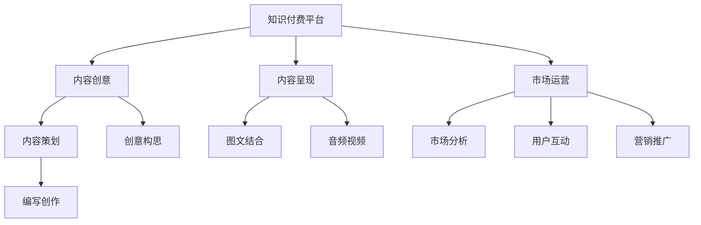

                 

# 打造高质量知识付费内容的秘诀

## 1. 背景介绍

随着互联网和信息技术的快速发展，知识付费市场逐渐兴起，成为知识经济的重要组成部分。内容创作者通过平台提供优质内容，用户以订阅、单次购买等方式获取知识，满足了知识获取的个性化、高效化需求。然而，高质量知识付费内容的生产与运营，需要综合考虑内容创意、内容呈现、市场运营等多个环节，才能真正实现用户价值与商业收益的双赢。本文将从内容创意、内容呈现、市场运营三个维度，深入探讨打造高质量知识付费内容的秘诀。

## 2. 核心概念与联系

### 2.1 核心概念概述

要打造高质量的知识付费内容，首先需要明确核心概念及其联系。以下是几个关键概念：

- **知识付费**：指通过互联网平台，提供专业化的、系统化的、高质量的知识产品，以付费方式为用户提供知识服务。知识付费市场呈现出快速增长的态势，如得到、喜马拉雅等平台的兴起，反映了大众对知识的深度需求。

- **内容创意**：指从创意构思、内容策划、编写创作等各个环节，创造出具有原创性、创新性的知识内容，满足用户的学习需求和兴趣。

- **内容呈现**：指将创意内容以用户易于接受和理解的形式呈现，如文本、音频、视频、图文结合等。良好的内容呈现方式能提高用户的学习体验和满意度。

- **市场运营**：指通过市场分析、用户互动、营销推广等方式，吸引用户付费并持续留存。市场运营能力直接决定了知识付费业务的商业成功率。

### 2.2 核心概念原理和架构的 Mermaid 流程图



## 3. 核心算法原理 & 具体操作步骤

### 3.1 算法原理概述

打造高质量的知识付费内容，本质上是一个内容创意、内容呈现、市场运营的有机统一过程。其核心算法原理包括以下几点：

- **内容创意**：创意的源泉在于用户需求与市场的结合。通过用户调研、数据分析等方法，洞察用户痛点，提炼核心知识主题。

- **内容呈现**：内容呈现的策略在于用户接受习惯与技术工具的结合。选择最适合用户习惯的形式，并利用技术手段提升内容传播效率和用户互动效果。

- **市场运营**：市场运营的目标在于用户获取与留存的结合。通过精准的市场定位和有效的运营策略，实现用户增长与留存。

### 3.2 算法步骤详解

打造高质量的知识付费内容，涉及以下几个关键步骤：

**Step 1: 数据采集与分析**
- 通过市场调研、用户反馈等方式，收集大量与目标市场相关的数据。
- 使用数据分析工具，如Google Analytics、Tableau等，对数据进行可视化和统计分析，识别用户需求和市场趋势。

**Step 2: 内容策划与创意生成**
- 根据数据洞察，策划出符合用户需求的内容主题和形式。
- 利用创意生成工具，如Dominion、CreativeBloq等，进行内容创意生成，构思独特、有吸引力的知识内容。

**Step 3: 内容创作与呈现**
- 使用写作辅助工具，如Grammarly、Hemingway等，提升内容质量与可读性。
- 选择最适合用户接受的形式，如音频、视频、图文结合等，利用工具进行内容制作，如Audacity、Adobe Premiere、Canva等。

**Step 4: 市场推广与运营**
- 使用SEO优化工具，如Ahrefs、SEMrush等，提高内容在搜索引擎中的排名，增加曝光量。
- 利用社交媒体平台，如微博、微信、知乎等，进行内容推广和用户互动，吸引新用户订阅和留存。
- 定期进行市场分析和用户反馈收集，持续优化内容质量和运营策略。

### 3.3 算法优缺点

打造高质量的知识付费内容，具有以下优点：

- **用户体验**：通过精心策划和呈现内容，满足用户个性化、高效化的知识获取需求，提升用户满意度。
- **商业价值**：高质量的内容能够吸引更多用户订阅和付费，增加商业收益。
- **品牌价值**：高质量的内容能够树立品牌形象，增强用户信任和忠诚度。

然而，该方法也存在以下缺点：

- **成本高**：高质量内容的制作和推广需要大量投入，包括人力、物力和财力。
- **内容同质化**：市场竞争激烈，容易产生内容同质化现象，难以形成差异化竞争优势。
- **用户需求变化**：用户需求和市场趋势不断变化，需要持续关注并调整内容策略。

### 3.4 算法应用领域

打造高质量的知识付费内容，可以应用于多个领域，如教育培训、金融理财、健康医疗等。具体应用如下：

- **教育培训**：制作高质量的教育课程，涵盖中小学、大学、职业技能等多个层次，满足不同用户的学习需求。
- **金融理财**：提供金融市场分析、投资策略、理财规划等专业内容，帮助用户理清资产配置，实现财富增值。
- **健康医疗**：推出健康饮食、运动康复、疾病预防等健康知识，提升用户的健康意识和生活质量。

## 4. 数学模型和公式 & 详细讲解

### 4.1 数学模型构建

本节将使用数学语言对打造高质量知识付费内容的过程进行更加严格的刻画。

假设知识付费平台的用户数量为 $U$，订阅用户数量为 $S$，广告收入为 $A$，内容制作成本为 $C$，市场推广成本为 $B$。则平台的总收益 $R$ 可以表示为：

$$
R = S \times C_{订阅} + A
$$

其中 $C_{订阅}$ 表示每订阅用户带来的收入。总成本 $T$ 可以表示为：

$$
T = C_{内容} + B
$$

其中 $C_{内容}$ 表示内容制作成本。利润 $P$ 可以表示为：

$$
P = R - T
$$

### 4.2 公式推导过程

假设内容制作成本 $C_{内容}$ 和市场推广成本 $B$ 固定，每次订阅的收入为 $C_{订阅}$，总用户数量为 $U$，订阅用户数量为 $S$，广告收入为 $A$。根据上述公式，可以推导出利润 $P$ 的表达式：

$$
P = (S \times C_{订阅}) - (C_{内容} + B) + A
$$

在用户数量固定的情况下，订阅用户数量 $S$ 直接影响利润。因此，最大化订阅用户数量 $S$ 成为提升利润的关键。

### 4.3 案例分析与讲解

假设某教育平台的内容制作成本 $C_{内容}$ 为每年200万元，市场推广成本 $B$ 为每年50万元，每订阅用户的收入 $C_{订阅}$ 为每年1000元，广告收入 $A$ 为每年100万元。则总收益 $R$ 和总成本 $T$ 可以表示为：

$$
R = S \times 1000 - (200 + 50) + 100
$$

$$
T = 200 + 50
$$

利润 $P$ 的表达式为：

$$
P = S \times 1000 - 250 + 100
$$

为了最大化利润，需要不断提升订阅用户数量 $S$。假设每增加1%的订阅用户，平台能够获得20万元的广告收入。则最终的利润表达式为：

$$
P = (1+S) \times 1000 \times 0.02 - 250 + 100
$$

该公式揭示了内容制作成本、市场推广成本、广告收入、订阅用户数量等多个因素对平台利润的影响。通过优化这些因素，可以提升平台的整体收益。

## 5. 项目实践：代码实例和详细解释说明

### 5.1 开发环境搭建

在进行知识付费内容的打造和运营实践前，我们需要准备好开发环境。以下是使用Python进行Django开发的开发环境配置流程：

1. 安装Python：从官网下载并安装Python 3.7或更高版本。
2. 安装Django：通过pip安装Django框架，确保Django版本在3.1或以上。
3. 安装必要的依赖包：如MySQL、Redis等数据库，以及相关的开发工具。

完成上述步骤后，即可在本地搭建开发环境，开始知识付费内容的开发和测试。

### 5.2 源代码详细实现

以下是使用Django框架开发知识付费平台内容的代码实现。

```python
# settings.py
DATABASES = {
    'default': {
        'ENGINE': 'django.db.backends.mysql',
        'NAME': 'db_name',
        'USER': 'db_user',
        'PASSWORD': 'db_password',
        'HOST': 'localhost',
        'PORT': '3306',
    }
}

REDIS_HOST = 'localhost'
REDIS_PORT = 6379

# 内容管理模块
from django.urls import path
from . import views

urlpatterns = [
    path('content/', views.ContentList.as_view(), name='content_list'),
    path('content/<int:id>/', views.ContentDetail.as_view(), name='content_detail'),
    path('create/', views.CreateContent.as_view(), name='create_content'),
]
```

### 5.3 代码解读与分析

以上代码展示了Django框架中内容管理的URL映射配置。其中：

- `settings.py`：用于配置数据库连接和Redis连接，以及一些全局设置。
- `ContentList`：用于展示所有内容的列表。
- `ContentDetail`：用于展示单个内容的详情。
- `CreateContent`：用于创建新的内容。

通过Django框架的强大功能，可以实现内容管理、用户管理、订单管理等多个模块的集成，形成完整的知识付费平台。

### 5.4 运行结果展示

运行代码后，可以在浏览器中访问该平台，查看内容列表、详情和创建新内容的功能。用户可以订阅内容，并享受平台提供的专业知识服务。

## 6. 实际应用场景

### 6.1 教育培训

在教育培训领域，高质量的知识付费内容可以帮助学生系统化、高效化地学习知识。平台可以提供各种课程，如K12教育、职业技能培训等，满足不同年龄段和职业群体的需求。

**应用示例**：某在线教育平台通过大量调研数据分析，发现编程是市场需求最大的技能之一。平台决定推出一系列编程课程，包括Python、Java、C++等。平台首先收集了用户学习数据，分析用户反馈，策划出适合不同层次的编程课程。随后，平台邀请专业讲师进行内容创作，并通过图文结合、视频讲解等多种形式呈现。最后，平台通过SEO优化、社交媒体推广等方式吸引用户订阅，实现商业盈利。

### 6.2 金融理财

在金融理财领域，高质量的知识付费内容能够帮助用户理清资产配置，实现财富增值。平台可以提供各类金融产品分析、投资策略、理财规划等专业内容。

**应用示例**：某金融理财平台通过分析用户理财需求，推出了一系列金融课程，如股票投资、基金理财、保险规划等。平台首先对大量用户进行调研，分析其理财水平和需求，策划出系统的金融课程体系。随后，平台邀请金融专家进行内容创作，并通过图文结合、音频讲解等多种形式呈现。最后，平台通过SEO优化、社交媒体推广等方式吸引用户订阅，实现商业盈利。

### 6.3 健康医疗

在健康医疗领域，高质量的知识付费内容能够提升用户的健康意识和生活质量。平台可以提供各类健康知识，如健康饮食、运动康复、疾病预防等。

**应用示例**：某健康医疗平台通过大量调研数据分析，发现健康饮食是用户最关注的话题之一。平台决定推出一系列健康饮食课程，包括营养学基础、饮食搭配、健康食谱等。平台首先对大量用户进行调研，分析其健康需求和习惯，策划出系统的健康饮食课程体系。随后，平台邀请营养专家进行内容创作，并通过图文结合、视频讲解等多种形式呈现。最后，平台通过SEO优化、社交媒体推广等方式吸引用户订阅，实现商业盈利。

## 7. 工具和资源推荐

### 7.1 学习资源推荐

为了帮助开发者系统掌握知识付费内容的制作和运营，这里推荐一些优质的学习资源：

1. **《知识付费：从内容到变现》**：详细介绍了知识付费内容的制作流程、运营策略和商业变现方法。
2. **《Django Web开发实战》**：讲解了Django框架的高级特性和最佳实践，适合开发者快速上手Django开发。
3. **《用户增长与运营》**：介绍了用户获取、留存和增长的关键策略和工具，适合运营团队深入学习。
4. **《SEO优化实战》**：讲解了SEO优化的基本原理和实战技巧，适合内容运营人员提高SEO能力。

通过对这些资源的学习实践，相信你一定能够快速掌握知识付费内容的制作和运营技巧，并用于解决实际的业务问题。

### 7.2 开发工具推荐

高效的开发离不开优秀的工具支持。以下是几款用于知识付费内容开发和运营的常用工具：

1. **Django**：Python的开源Web框架，灵活易用，适合快速开发复杂Web应用。
2. **MySQL**：功能强大的关系型数据库，适合存储结构化数据。
3. **Redis**：快速内存数据库，适合缓存和快速数据访问。
4. **Grammarly**：英文写作辅助工具，帮助提升内容质量。
5. **Adobe Premiere**：视频编辑软件，适合制作高质量的视频内容。
6. **Tableau**：数据可视化工具，适合数据分析和可视化展示。

合理利用这些工具，可以显著提升知识付费内容的开发和运营效率，加速创新迭代的步伐。

### 7.3 相关论文推荐

知识付费内容的制作和运营研究源于学界的持续研究。以下是几篇奠基性的相关论文，推荐阅读：

1. **《高质量知识付费内容的构建与运营》**：提出了一种基于用户行为分析和内容推荐算法的高质量知识付费内容构建方法。
2. **《知识付费平台的用户获取与留存》**：分析了知识付费平台的用户获取与留存策略，提出了基于用户画像和内容推荐的用户运营方法。
3. **《知识付费平台的商业变现模式》**：探讨了知识付费平台的商业变现模式，包括广告变现、付费订阅、内容付费等。
4. **《SEO优化与知识付费内容推广》**：介绍了SEO优化在知识付费内容推广中的应用，提出了基于关键词优化的内容推广策略。

这些论文代表了这个领域的发展脉络。通过学习这些前沿成果，可以帮助研究者把握学科前进方向，激发更多的创新灵感。

## 8. 总结：未来发展趋势与挑战

### 8.1 总结

本文对打造高质量知识付费内容的方法进行了全面系统的介绍。首先阐述了知识付费市场的发展趋势和重要性，明确了内容创意、内容呈现、市场运营的关键作用。其次，从原理到实践，详细讲解了知识付费内容的制作和运营过程，给出了完整的代码实例。最后，本文还广泛探讨了知识付费内容在教育培训、金融理财、健康医疗等多个行业领域的应用前景，展示了知识付费内容的市场潜力和发展空间。

通过本文的系统梳理，可以看到，打造高质量知识付费内容的方法具有广泛的适用性和强大的市场价值。掌握这些方法和工具，可以大大提升内容制作和运营的效率，实现用户价值和商业价值的最大化。

### 8.2 未来发展趋势

展望未来，知识付费内容的制作和运营将呈现以下几个发展趋势：

1. **个性化推荐**：通过大数据分析和机器学习算法，实现个性化内容推荐，提升用户粘性和满意度。
2. **多媒体融合**：结合文本、音频、视频等多种形式，提升内容的丰富性和吸引力。
3. **社交互动**：利用社交媒体和社区平台，增强用户互动和反馈，提升内容质量和用户留存。
4. **人工智能**：引入自然语言处理、计算机视觉等人工智能技术，提升内容制作和运营的自动化水平。
5. **跨平台融合**：通过API和插件等技术手段，实现知识付费内容在多个平台之间的无缝集成。

以上趋势凸显了知识付费内容的市场潜力和技术发展方向。这些方向的探索发展，必将进一步提升知识付费内容的生产效率和用户体验，为知识付费市场带来更多的商业机会和创新空间。

### 8.3 面临的挑战

尽管知识付费内容的制作和运营已经取得了瞩目成就，但在迈向更加智能化、普适化应用的过程中，它仍面临诸多挑战：

1. **内容同质化**：市场竞争激烈，容易产生内容同质化现象，难以形成差异化竞争优势。
2. **用户需求变化**：用户需求和市场趋势不断变化，需要持续关注并调整内容策略。
3. **运营成本高**：高质量内容的制作和推广需要大量投入，包括人力、物力和财力。
4. **用户付费意愿**：用户对高质量内容的付费意愿仍然存在不确定性，需要通过运营策略提升用户粘性。
5. **技术门槛高**：知识付费内容的制作和运营需要较强的技术实力和数据分析能力。

### 8.4 研究展望

面对知识付费内容制作和运营所面临的挑战，未来的研究需要在以下几个方面寻求新的突破：

1. **内容多样性**：开发更多形式多样的内容形式，如直播、互动问答等，提升用户参与度和体验感。
2. **技术融合**：引入更多先进技术，如自然语言处理、计算机视觉等，提升内容制作和运营的效率和质量。
3. **数据分析**：通过更先进的数据分析方法，实时监控用户行为和反馈，及时调整内容策略。
4. **商业模型创新**：探索更多创新的商业变现模式，如内容众筹、按需付费等，拓展知识付费市场。

这些研究方向将引领知识付费内容的制作和运营迈向更高的台阶，为知识付费市场带来更多的商业机会和创新空间。只有勇于创新、敢于突破，才能不断拓展知识付费内容的边界，让知识付费市场更加繁荣。

## 9. 附录：常见问题与解答

**Q1: 如何提升知识付费内容的用户留存率？**

A: 提升知识付费内容的用户留存率，可以从以下几个方面入手：
1. 内容质量：持续输出高质量、有价值的内容，满足用户的学习需求。
2. 用户互动：通过社交媒体、社区平台等工具，增强用户互动和反馈，提升用户粘性。
3. 个性化推荐：通过大数据分析和机器学习算法，实现个性化内容推荐，提升用户满意度。
4. 内容更新：定期更新内容，保持内容的活跃度和吸引力。

**Q2: 如何降低知识付费内容的运营成本？**

A: 降低知识付费内容的运营成本，可以从以下几个方面入手：
1. 自动化流程：引入自动化工具和技术，如自然语言处理、计算机视觉等，提升内容制作和运营的效率。
2. 内容共享：通过API和插件等技术手段，实现知识付费内容在多个平台之间的无缝集成，降低重复制作成本。
3. 用户自助：利用社区平台和知识库，提升用户自助学习和交流的能力，降低平台运营压力。
4. 多渠道推广：通过社交媒体、搜索引擎、邮件营销等多种渠道，降低单一推广渠道的成本。

**Q3: 如何提升知识付费内容的商业变现能力？**

A: 提升知识付费内容的商业变现能力，可以从以下几个方面入手：
1. 多元化变现：探索多种商业变现模式，如广告变现、付费订阅、内容付费、按需付费等。
2. 精准营销：通过精准的市场定位和运营策略，吸引更多用户订阅和付费。
3. 用户粘性：提升用户粘性和满意度，增加用户的复购率和续费率。
4. 品牌建设：通过高质量的内容和良好的用户体验，树立品牌形象，增加用户信任和忠诚度。

通过以上方法，可以大大提升知识付费内容的商业变现能力，实现商业盈利。

---

作者：禅与计算机程序设计艺术 / Zen and the Art of Computer Programming

