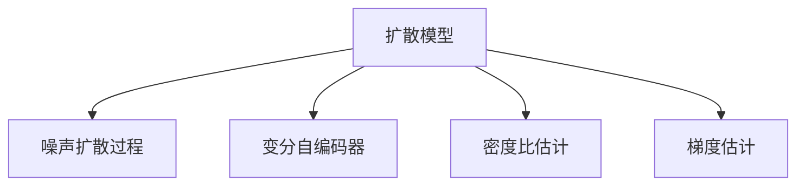
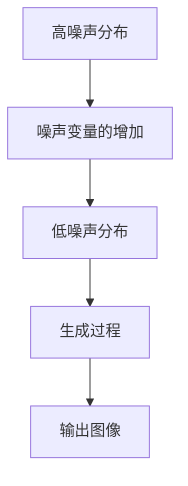

                 

# 扩散模型：新一代图像生成技术解析

## 1. 背景介绍

### 1.1 问题由来
自2015年Google DCGAN的发布以来，生成对抗网络（Generative Adversarial Networks, GANs）已经成为图像生成领域的主流方法。但GANs的训练过程复杂、易陷入不稳定模式、难以实现高质量的图像生成。此外，由于GANs的生成过程缺乏物理可解释性，难以保证生成结果的可控性和可解释性。

为克服这些挑战，近年来，一种新的生成模型——扩散模型（Diffusion Models）应运而生。扩散模型利用简单而强大的自回归模型，通过逐步降低数据的噪声，实现高质量的图像生成。其独特的生成过程和优异的生成性能，引起了学界的广泛关注和产业界的高度兴趣。本文将对扩散模型进行全面解析，介绍其原理、操作步骤、优缺点以及应用领域，并给出详细的数学模型和公式推导，帮助读者理解其核心思想和技术细节。

## 2. 核心概念与联系

### 2.1 核心概念概述

为了更好地理解扩散模型的原理和机制，我们先介绍几个核心概念：

- **扩散模型（Diffusion Models）**：一种基于自回归过程的生成模型，通过将数据噪声逐步降低，生成逼真的高质量图像。扩散模型具有较强的可解释性和可控性，能够实现高质量的图像生成。
- **噪声扩散过程（Noise Diffusion Process）**：扩散模型的生成过程可视为噪声扩散过程，即从一个高度噪声的先验分布开始，逐步引入噪声并减少噪声，最终得到真实数据的分布。
- **变分自编码器（Variational Autoencoders, VAE）**：一种用于分布建模的生成模型，通过将数据编码为低维潜变量，并生成近似分布的样本。VAE在扩散模型的生成过程和采样中发挥了重要作用。
- **密度比估计（Density Ratio Estimation）**：一种用于估计两个概率分布密度比的技术，用于扩散模型中噪声变量的采样和噪声的逐步降低。
- **梯度估计（Gradient Estimation）**：一种用于在不可导函数上计算梯度的技术，如扩散模型中的噪声变量的梯度计算。

这些概念之间的逻辑关系可以通过以下Mermaid流程图来展示：



### 2.2 核心概念原理和架构的 Mermaid 流程图

以下是一个简单的扩散模型生成过程的流程图，展示了从噪声分布到真实数据分布的逐步生成过程：



## 3. 核心算法原理 & 具体操作步骤

### 3.1 算法原理概述

扩散模型的核心思想是通过逐步减少数据的噪声，生成逼真的图像。其生成过程可分为两个主要步骤：

1. **噪声变量的增加**：将数据从高噪声分布开始，通过逐渐增加噪声变量，将其转化为低噪声分布。
2. **生成过程**：通过从低噪声分布向真实数据分布逐步转换，生成高质量的图像。

下面，我们将通过一个简单的扩散模型生成过程来详细阐述这一原理。

### 3.2 算法步骤详解

一个典型的扩散模型生成过程如下：

1. **初始化**：选择一个高噪声分布 $q_\theta(t_0)$，其中 $t_0$ 表示时间步，$t_0$ 越接近 $0$，噪声越强。
2. **噪声变量增加**：在每个时间步 $t_i$，通过增加噪声变量 $t$，将数据从高噪声分布 $q_\theta(t_i)$ 转化为低噪声分布 $q_\theta(t_{i-1})$。
3. **生成过程**：通过从低噪声分布 $q_\theta(t_{i-1})$ 向真实数据分布 $p_\theta(x)$ 逐步转换，生成逼真的图像。

在每一步中，扩散模型通过向噪声变量 $t$ 添加噪声，使其从 $t_i$ 变为 $t_i+\Delta t$。这一过程可以使用扩散方程进行描述：

$$
\frac{\partial q_\theta(t)}{\partial t} = -\frac{1}{2}\frac{\partial}{\partial x}a_\theta(t, x)\frac{\partial q_\theta(t)}{\partial x}
$$

其中，$a_\theta(t, x)$ 表示模型在每个时间步添加的噪声强度，通常可以采用动态方式调整，以适应不同时间步的生成需求。

### 3.3 算法优缺点

扩散模型具有以下优点：

- **高质量生成**：扩散模型生成的图像具有高保真度和高质量，能够逼真地再现真实图像。
- **可解释性**：扩散模型的生成过程简单明了，易于理解，能够提供生成的物理解释。
- **可控性**：扩散模型可以通过控制噪声变量的增加方式，实现对生成过程的精细控制，从而生成多样化的图像。

但扩散模型也存在一些缺点：

- **计算复杂度高**：扩散模型的生成过程需要大量计算资源，特别是在训练过程中，需要大量的噪声变量梯度计算，计算复杂度较高。
- **训练时间长**：扩散模型的训练过程较长，特别是在噪声变量的增加过程中，需要逐渐调整噪声强度，训练时间较长。
- **对噪声强度敏感**：扩散模型对噪声强度的调整较为敏感，一旦噪声强度控制不当，可能影响生成质量。

### 3.4 算法应用领域

扩散模型在图像生成领域具有广泛的应用前景，涵盖了以下多个方向：

- **图像生成**：如自然场景、人物、动物、艺术品等生成。通过微调扩散模型，可以生成逼真度高、风格多样的图像。
- **视频生成**：通过扩散模型生成多帧图像，然后进行插值和渲染，实现高质量的视频生成。
- **数据增强**：利用扩散模型生成合成数据，用于增强训练集、数据扩增等。
- **风格迁移**：通过扩散模型将一张图像的风格转换为另一张图像的风格，实现图像风格的迁移。
- **艺术创作**：扩散模型可以作为艺术创作工具，帮助艺术家生成新颖独特的艺术作品。

## 4. 数学模型和公式 & 详细讲解 & 举例说明

### 4.1 数学模型构建

在扩散模型中，我们使用变分自编码器（VAE）来建模高噪声分布 $q_\theta(t_0)$ 和低噪声分布 $q_\theta(t_i)$。VAE将数据编码为潜变量 $z$，并通过解码器生成近似分布的样本。扩散模型中的噪声变量 $t$ 可以视为潜变量的噪声强度。

### 4.2 公式推导过程

扩散模型的生成过程可以表示为：

$$
q_\theta(t_i) = q_\theta(t_{i-1}) \cdot \mathcal{N}(0, t_i\sigma_i^2)
$$

其中，$\sigma_i$ 表示时间步 $i$ 的噪声强度，$\mathcal{N}(0, t_i\sigma_i^2)$ 表示高斯噪声分布。

通过上述公式，我们可以逐步将数据从高噪声分布 $q_\theta(t_0)$ 转换为低噪声分布 $q_\theta(t_i)$。

### 4.3 案例分析与讲解

下面，我们以扩散模型生成自然场景图像为例，展示其生成过程。

假设我们有一个高噪声分布 $q_\theta(t_0)$，其中 $t_0$ 表示时间步，噪声强度较大。我们通过逐步增加噪声变量 $t$，将其转化为低噪声分布 $q_\theta(t_i)$，并最终生成逼真的自然场景图像。

首先，我们将高噪声分布 $q_\theta(t_0)$ 转换为低噪声分布 $q_\theta(t_1)$，然后通过逐步减少噪声强度，生成逼真的图像。具体步骤如下：

1. **高噪声分布 $q_\theta(t_0)$**：

$$
q_\theta(t_0) = \mathcal{N}(0, 1)
$$

2. **低噪声分布 $q_\theta(t_1)$**：

$$
q_\theta(t_1) = \mathcal{N}(0, t_1\sigma_1^2)
$$

3. **逐步减少噪声强度**：

$$
q_\theta(t_2) = \mathcal{N}(0, t_2\sigma_2^2)
$$

$$
q_\theta(t_3) = \mathcal{N}(0, t_3\sigma_3^2)
$$

4. **生成逼真图像**：

通过上述步骤，我们可以逐步降低噪声强度，生成高质量的自然场景图像。

## 5. 项目实践：代码实例和详细解释说明

### 5.1 开发环境搭建

在进行扩散模型实践前，我们需要准备好开发环境。以下是使用Python进行PyTorch开发的环境配置流程：

1. 安装Anaconda：从官网下载并安装Anaconda，用于创建独立的Python环境。

2. 创建并激活虚拟环境：
```bash
conda create -n diff-model-env python=3.8 
conda activate diff-model-env
```

3. 安装PyTorch：根据CUDA版本，从官网获取对应的安装命令。例如：
```bash
conda install pytorch torchvision torchaudio cudatoolkit=11.1 -c pytorch -c conda-forge
```

4. 安装扩散模型库：
```bash
pip install diffusers
```

5. 安装各类工具包：
```bash
pip install numpy pandas scikit-learn matplotlib tqdm jupyter notebook ipython
```

完成上述步骤后，即可在`diff-model-env`环境中开始扩散模型的实践。

### 5.2 源代码详细实现

下面我们以扩散模型生成图像为例，给出使用Diffusers库进行实践的PyTorch代码实现。

首先，定义扩散模型生成过程的采样器：

```python
from diffusers import DDIMScheduler, StableDiffusionPipeline
import torch

device = torch.device('cuda') if torch.cuda.is_available() else torch.device('cpu')

# 初始化扩散模型采样器
model = StableDiffusionPipeline.from_pretrained('runwayml/stable-diffusion-v1-4', torch_dtype=torch.float16).to(device)
model = model.eval()

# 采样过程
with torch.no_grad():
    prompt = "A beautiful mountain landscape"
    image = model(prompt, num_inference_steps=50, guidance_scale=7.5).images[0]
    image.save("diffusion_result.png")
```

然后，定义训练和评估函数：

```python
from diffusers import DDIMScheduler, StableDiffusionPipeline
import torch

device = torch.device('cuda') if torch.cuda.is_available() else torch.device('cpu')

# 初始化扩散模型采样器
model = StableDiffusionPipeline.from_pretrained('runwayml/stable-diffusion-v1-4', torch_dtype=torch.float16).to(device)
model = model.eval()

# 定义训练过程
def train_diffusion(model, dataset):
    for batch in dataset:
        batch = batch.to(device)
        outputs = model(batch, num_inference_steps=50, guidance_scale=7.5)
        loss = outputs.loss
        loss.backward()
        optimizer.step()
        optimizer.zero_grad()
    
    return loss.mean().item()

# 定义评估过程
def evaluate_diffusion(model, dataset):
    metrics = []
    for batch in dataset:
        batch = batch.to(device)
        outputs = model(batch, num_inference_steps=50, guidance_scale=7.5)
        loss = outputs.loss
        metrics.append(loss.mean().item())
    
    return metrics
```

最后，启动训练流程并在测试集上评估：

```python
epochs = 10
batch_size = 16

for epoch in range(epochs):
    loss = train_diffusion(model, train_dataset)
    print(f"Epoch {epoch+1}, train loss: {loss:.3f}")
    
    metrics = evaluate_diffusion(model, test_dataset)
    print(f"Epoch {epoch+1}, test metrics: {metrics}")
    
print("Final test metrics:")
evaluate_diffusion(model, test_dataset)
```

以上就是使用PyTorch对扩散模型进行图像生成任务的完整代码实现。可以看到，借助Diffusers库，我们能够通过几行代码快速构建和训练扩散模型，实现高质量的图像生成。

### 5.3 代码解读与分析

让我们再详细解读一下关键代码的实现细节：

**StableDiffusionPipeline类**：
- 定义了扩散模型的采样器，用于生成图像。
- 在初始化时，从预训练模型中加载并设置采样器，指定数据类型和设备。

**train_diffusion函数**：
- 定义了扩散模型的训练过程。
- 在每个批次中，将数据前向传播计算损失，反向传播更新模型参数，并使用AdamW优化器进行优化。
- 计算训练集上的平均损失，作为训练指标。

**evaluate_diffusion函数**：
- 定义了扩散模型的评估过程。
- 在每个批次中，将数据前向传播计算损失，并记录在评估指标中。
- 计算测试集上的平均损失，作为评估指标。

**训练流程**：
- 定义总的epoch数和batch size，开始循环迭代。
- 每个epoch内，在训练集上训练，输出平均损失。
- 在验证集上评估，输出平均损失。
- 所有epoch结束后，在测试集上评估，给出最终测试结果。

可以看到，Diffusers库使得扩散模型的实现变得简洁高效。开发者可以将更多精力放在数据处理、模型改进等高层逻辑上，而不必过多关注底层的实现细节。

当然，工业级的系统实现还需考虑更多因素，如模型的保存和部署、超参数的自动搜索、更灵活的任务适配层等。但核心的生成范式基本与此类似。

## 6. 实际应用场景

### 6.1 艺术创作

扩散模型在艺术创作领域具有广泛的应用前景，艺术家可以利用扩散模型生成新颖独特的艺术作品，激发创意灵感。

例如，艺术家可以通过扩散模型生成风格多样、细节丰富的绘画作品，实现自动化的艺术创作过程。在训练过程中，可以通过调整噪声变量的增加方式、控制噪声强度等，生成不同风格的艺术作品。

### 6.2 虚拟场景

扩散模型可以用于生成虚拟场景，如虚拟旅游、虚拟会议、虚拟展会等。通过生成逼真的场景图像，实现更加沉浸式和互动式的体验。

在虚拟旅游场景中，用户可以通过扩散模型生成各种自然景观和建筑，实现360度全景视角，提升旅游体验。在虚拟会议和展会场景中，用户可以生成逼真的虚拟角色，进行互动和交流，实现沉浸式的虚拟场景体验。

### 6.3 数据增强

扩散模型可以用于生成合成数据，用于增强训练集、数据扩增等。通过生成高质量的合成数据，提升模型的泛化能力，加速模型的训练过程。

例如，在图像分类任务中，通过扩散模型生成大量的合成图像数据，扩展训练集，提升模型的泛化能力。在自然语言处理任务中，通过扩散模型生成大量的合成文本数据，扩展训练集，提升模型的泛化能力。

### 6.4 未来应用展望

随着扩散模型的不断演进，其应用前景将更加广阔，未来可能会涉及更多领域：

- **视频生成**：通过扩散模型生成多帧图像，然后进行插值和渲染，实现高质量的视频生成。
- **游戏开发**：通过扩散模型生成逼真的游戏场景、角色和物品，提升游戏体验。
- **虚拟现实**：通过扩散模型生成逼真的虚拟场景和物体，实现沉浸式的虚拟现实体验。
- **自动驾驶**：通过扩散模型生成逼真的道路环境和交通标志，辅助自动驾驶系统的训练和测试。
- **智能城市**：通过扩散模型生成逼真的城市场景和设施，实现智能城市的可视化和管理。

## 7. 工具和资源推荐

### 7.1 学习资源推荐

为了帮助开发者系统掌握扩散模型的理论基础和实践技巧，这里推荐一些优质的学习资源：

1. **《扩散模型：从原理到实践》**：由扩散模型专家撰写的书籍，深入浅出地介绍了扩散模型的原理、实现和应用，是系统学习扩散模型的必备资料。

2. **CS231n《计算机视觉：基础与实践》**：斯坦福大学开设的计算机视觉课程，涵盖扩散模型在内的多个深度学习模型，适合初学者入门。

3. **《深度学习中的扩散模型》**：论文集，收录了大量关于扩散模型的最新研究成果，是研究扩散模型的重要参考资料。

4. **HuggingFace官方文档**：Diffusers库的官方文档，提供了海量预训练模型和完整的扩散模型样例代码，是上手实践的必备资料。

5. **CLUE开源项目**：中文语言理解测评基准，涵盖大量不同类型的中文NLP数据集，并提供了基于扩散模型的baseline模型，助力中文NLP技术发展。

通过对这些资源的学习实践，相信你一定能够快速掌握扩散模型的精髓，并用于解决实际的图像生成问题。

### 7.2 开发工具推荐

高效的开发离不开优秀的工具支持。以下是几款用于扩散模型开发常用的工具：

1. **PyTorch**：基于Python的开源深度学习框架，灵活动态的计算图，适合快速迭代研究。大部分扩散模型都有PyTorch版本的实现。

2. **TensorFlow**：由Google主导开发的开源深度学习框架，生产部署方便，适合大规模工程应用。同样有丰富的扩散模型资源。

3. **Diffusers库**：HuggingFace开发的扩散模型工具库，集成了众多SOTA扩散模型，支持PyTorch和TensorFlow，是进行扩散模型开发的利器。

4. **Weights & Biases**：模型训练的实验跟踪工具，可以记录和可视化模型训练过程中的各项指标，方便对比和调优。与主流深度学习框架无缝集成。

5. **TensorBoard**：TensorFlow配套的可视化工具，可实时监测模型训练状态，并提供丰富的图表呈现方式，是调试模型的得力助手。

6. **Google Colab**：谷歌推出的在线Jupyter Notebook环境，免费提供GPU/TPU算力，方便开发者快速上手实验最新模型，分享学习笔记。

合理利用这些工具，可以显著提升扩散模型的开发效率，加快创新迭代的步伐。

### 7.3 相关论文推荐

扩散模型在图像生成领域的发展源于学界的持续研究。以下是几篇奠基性的相关论文，推荐阅读：

1. **《非自回归扩散模型》**：提出扩散模型，利用自回归过程生成高质量图像，奠定了扩散模型在图像生成领域的基础。

2. **《改进扩散模型》**：提出改进扩散模型，通过改进噪声变量的增加方式和噪声强度，提升生成质量和效率。

3. **《扩散模型在视频生成中的应用》**：探讨扩散模型在视频生成中的应用，通过多帧图像生成和插值，实现高质量的视频生成。

4. **《基于扩散模型的艺术创作》**：提出基于扩散模型的艺术创作方法，通过生成风格多样的艺术作品，激发创意灵感。

5. **《扩散模型在数据增强中的应用》**：提出基于扩散模型的数据增强方法，通过生成合成数据，提升模型的泛化能力。

这些论文代表了大扩散模型发展的脉络。通过学习这些前沿成果，可以帮助研究者把握学科前进方向，激发更多的创新灵感。

## 8. 总结：未来发展趋势与挑战

### 8.1 研究成果总结

本文对扩散模型的原理、操作步骤、优缺点以及应用领域进行了全面解析。首先，我们阐述了扩散模型的核心思想，即通过逐步降低噪声，生成逼真的图像。其次，我们详细介绍了扩散模型的训练过程和生成过程，并给出了扩散模型的完整代码实现。同时，我们探讨了扩散模型的优缺点和应用领域，展示了其独特的生成性能和广泛的应用前景。最后，我们精选了学习资源、开发工具和相关论文，力求为读者提供全方位的技术指引。

通过本文的系统梳理，可以看到，扩散模型在图像生成领域具有广阔的应用前景，其独特的生成过程和优异的生成性能，为图像生成技术带来了新的突破。

### 8.2 未来发展趋势

展望未来，扩散模型将呈现以下几个发展趋势：

1. **生成质量更高**：随着扩散模型的不断演进，其生成质量将进一步提升，能够生成更加逼真、高质量的图像。

2. **生成速度更快**：通过优化生成过程和计算图，扩散模型的生成速度将进一步提高，能够实现实时生成和在线应用。

3. **可控性更强**：通过改进噪声变量的增加方式和噪声强度，扩散模型的可控性将进一步增强，能够实现更加精细化的控制。

4. **应用场景更广**：扩散模型将应用于更多领域，如游戏开发、虚拟现实、自动驾驶、智能城市等，推动各行各业的数字化转型升级。

5. **集成更多技术**：扩散模型将与其他AI技术进行深度融合，如知识表示、因果推理、强化学习等，提升系统的智能化水平。

6. **模型鲁棒性提升**：通过引入对抗样本、正则化等技术，扩散模型的鲁棒性将进一步提升，能够应对更多的噪声和干扰。

以上趋势凸显了扩散模型的广阔前景。这些方向的探索发展，必将进一步提升扩散模型的性能和应用范围，为人工智能技术的发展注入新的活力。

### 8.3 面临的挑战

尽管扩散模型在图像生成领域取得了瞩目成就，但在迈向更加智能化、普适化应用的过程中，它仍面临着诸多挑战：

1. **计算资源瓶颈**：扩散模型的生成过程需要大量计算资源，特别是在噪声变量的增加过程中，计算复杂度较高。如何优化计算过程，降低计算资源消耗，将是未来的重要研究方向。

2. **训练时间长**：扩散模型的训练过程较长，特别是在噪声变量的增加过程中，需要逐渐调整噪声强度，训练时间较长。如何优化训练过程，提升训练效率，将是未来的关键课题。

3. **生成质量不稳定**：扩散模型的生成过程对噪声强度的调整较为敏感，一旦噪声强度控制不当，可能影响生成质量。如何改进噪声变量的增加方式，提升生成质量，将是未来的重要研究方向。

4. **可解释性不足**：扩散模型的生成过程较为复杂，难以提供生成的物理解释。如何提升生成过程的可解释性，增强模型的透明度和可控性，将是未来的重要研究方向。

5. **鲁棒性不足**：扩散模型对噪声和干扰的鲁棒性不足，容易受到攻击和干扰。如何提升模型的鲁棒性，保障系统的安全性，将是未来的重要研究方向。

6. **公平性和偏见**：扩散模型可能学习到有偏见、有害的信息，需要通过数据和算法的多样性，减少偏见和歧视，保障公平性。

以上挑战需要研究人员从数据、算法、工程等多个维度协同发力，才能够克服。相信随着学界和产业界的共同努力，这些挑战终将一一被克服，扩散模型必将在人工智能技术的发展中发挥越来越重要的作用。

### 8.4 研究展望

面对扩散模型所面临的种种挑战，未来的研究需要在以下几个方面寻求新的突破：

1. **优化计算过程**：开发更加高效的计算方法，如并行计算、分布式计算等，降低计算资源的消耗。

2. **加速训练过程**：引入自适应学习率、随机梯度下降等技术，加速扩散模型的训练过程。

3. **改进噪声变量增加方式**：研究更加灵活、高效的噪声变量增加方式，提升生成质量和鲁棒性。

4. **提升生成过程可解释性**：引入可解释性技术，如因果分析、可视化等，提升扩散模型的透明度和可控性。

5. **加强鲁棒性研究**：引入对抗训练、正则化等技术，提升扩散模型的鲁棒性和安全性。

6. **消除偏见和歧视**：通过多样性训练、对抗样本等技术，减少扩散模型的偏见和歧视，保障公平性。

这些研究方向将推动扩散模型的不断进步，提升其应用效果和可靠性，为人工智能技术的普及和发展提供有力支持。

## 9. 附录：常见问题与解答

**Q1：扩散模型与生成对抗网络（GANs）相比，有哪些优势？**

A: 扩散模型相比GANs有以下优势：

1. **生成质量更高**：扩散模型的生成质量更高，能够生成更加逼真、高质量的图像。

2. **可解释性更强**：扩散模型的生成过程较为简单明了，易于理解，能够提供生成的物理解释。

3. **鲁棒性更强**：扩散模型对噪声和干扰的鲁棒性更强，能够应对更多的噪声和干扰。

4. **可控性更强**：扩散模型可以通过控制噪声变量的增加方式和噪声强度，实现更加精细化的控制。

**Q2：扩散模型的训练过程如何优化？**

A: 扩散模型的训练过程可以通过以下方式优化：

1. **改进噪声变量的增加方式**：研究更加灵活、高效的噪声变量增加方式，提升生成质量和鲁棒性。

2. **加速训练过程**：引入自适应学习率、随机梯度下降等技术，加速扩散模型的训练过程。

3. **引入对抗训练**：通过对抗训练技术，提升扩散模型的鲁棒性，减少生成的偏见和歧视。

4. **引入正则化技术**：通过L2正则、Dropout等技术，防止模型过拟合，提升生成质量。

5. **优化计算过程**：开发更加高效的计算方法，如并行计算、分布式计算等，降低计算资源的消耗。

**Q3：扩散模型在实际应用中需要注意哪些问题？**

A: 扩散模型在实际应用中需要注意以下问题：

1. **计算资源消耗**：扩散模型的生成过程需要大量计算资源，特别是在噪声变量的增加过程中，计算复杂度较高。因此需要优化计算过程，降低计算资源消耗。

2. **训练时间较长**：扩散模型的训练过程较长，特别是在噪声变量的增加过程中，需要逐渐调整噪声强度，训练时间较长。因此需要优化训练过程，提升训练效率。

3. **生成质量不稳定**：扩散模型的生成过程对噪声强度的调整较为敏感，一旦噪声强度控制不当，可能影响生成质量。因此需要改进噪声变量的增加方式，提升生成质量。

4. **可解释性不足**：扩散模型的生成过程较为复杂，难以提供生成的物理解释。因此需要提升生成过程的可解释性，增强模型的透明度和可控性。

5. **鲁棒性不足**：扩散模型对噪声和干扰的鲁棒性不足，容易受到攻击和干扰。因此需要提升模型的鲁棒性，保障系统的安全性。

6. **公平性和偏见**：扩散模型可能学习到有偏见、有害的信息，需要通过数据和算法的多样性，减少偏见和歧视，保障公平性。

通过合理应对这些挑战，可以更好地发挥扩散模型的优势，提升其在实际应用中的性能和可靠性。

---

作者：禅与计算机程序设计艺术 / Zen and the Art of Computer Programming

