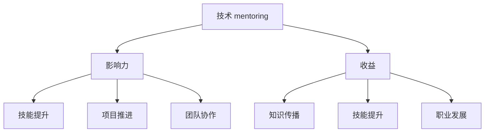

                 

# 技术mentoring：影响力与收益

> 关键词：技术 mentoring, 影响影响力, 指导收益, 知识传播, 技术社区

## 1. 背景介绍

### 1.1 问题由来

在科技快速发展的今天，技术社区中的每个成员都扮演着重要的角色。技术 mentoring 作为一种重要的技能，不仅能够帮助新手快速成长，还能在团队中传递知识，促进创新。然而，并不是每个开发者都有机会接受高质量的技术 mentoring，技术社区中存在着指导资源不足的问题。因此，本文将探讨技术 mentoring 的影响力和收益，希望能够为技术社区的发展提供一些有价值的见解。

### 1.2 问题核心关键点

本文的核心问题在于：
- 技术 mentoring 对开发者个人和团队的影响力如何？
- 技术 mentoring 在知识传播、技能提升等方面的收益有哪些？
- 如何有效地进行技术 mentoring，以最大化其影响力与收益？

## 2. 核心概念与联系

### 2.1 核心概念概述

在探讨技术 mentoring 的影响力和收益之前，我们需要先了解几个核心概念：

- **技术 mentoring**：指技术社区中的经验丰富者（mentor）对新手（mentee）提供指导和建议，帮助他们提高技术水平和解决问题的能力。

- **影响力（Impact）**：指技术 mentoring 对开发者个人和团队产生的积极效应，包括技能提升、项目推进、团队协作等。

- **收益（Benefits）**：指技术 mentoring 带来的直接和间接收益，如知识传播、技能提升、职业发展等。

这些核心概念之间的关系可以通过以下 Mermaid 流程图来展示：



这个流程图展示技术 mentoring 的核心概念及其之间的关系：

1. 技术 mentoring 通过指导和建议，对开发者个人和团队产生积极效应。
2. 技术 mentoring 带来知识传播、技能提升、职业发展等直接和间接收益。
3. 知识传播、技能提升和团队协作等，有助于技能提升和项目推进。
4. 职业发展则进一步提升个人和团队的竞争力和影响力。

## 3. 核心算法原理 & 具体操作步骤

### 3.1 算法原理概述

技术 mentoring 的本质是一种基于知识共享和经验传递的过程。其核心思想是通过有经验的开发者（mentor）对新手（mentee）进行指导和建议，帮助他们更快地掌握知识和技能，提高解决问题和应对挑战的能力。技术 mentoring 的影响力和收益可以通过以下方式进行计算和分析：

1. **知识传播的效应**：技术 mentoring 能够有效传播知识和经验，加速新知识的传播和应用。
2. **技能提升的效应**：通过不断学习和实践，新手能够快速提高技能，并能够解决更复杂的问题。
3. **项目推进的效应**：有经验的开发者能够更好地协调团队成员，推进项目的顺利进行。
4. **团队协作的效应**：技术 mentoring 能够促进团队成员之间的协作，提升团队的整体工作效率。
5. **职业发展的效应**：通过持续学习和提升技能，新手能够在职业生涯中取得更好的发展。

### 3.2 算法步骤详解

技术 mentoring 的具体操作步骤包括以下几个关键步骤：

**Step 1: 选择合适的 mentee**

- 评估候选人的技术水平和兴趣，确保 mentoring 的目标明确。
- 选择适合 mentoring 的候选人，确保其有足够的时间和精力进行学习。

**Step 2: 确定 mentoring 目标**

- 明确 mentoring 的目标，如掌握特定技能、解决特定问题等。
- 根据目标，制定详细的 mentoring 计划和时间表。

**Step 3: 选择合适的 mentoring 方式**

- 根据 mentee 的学习习惯和风格，选择适合的 mentoring 方式，如面对面交流、在线交流、项目实践等。
- 确定 mentoring 的频率和时间安排，确保 mentee 能够持续进行学习。

**Step 4: 实施 mentoring**

- 通过具体的指导和建议，帮助 mentee 提高技能和解决问题。
- 定期进行反馈和评估，确保 mentee 能够持续进步。

**Step 5: 评估 mentoring 效果**

- 根据 mentee 的学习进度和反馈，评估 mentoring 的效果。
- 根据评估结果，调整 mentoring 的策略和方法，进一步提升效果。

### 3.3 算法优缺点

技术 mentoring 的优点包括：
1. 快速提高新手技能，加速团队整体能力提升。
2. 促进知识传播，加速新技术的应用和创新。
3. 增强团队协作，提升团队整体工作效率。
4. 促进职业发展，提升团队竞争力和影响力。

同时，技术 mentoring 也存在一些局限性：
1. 时间和资源限制：高质量的 mentoring 需要投入大量的时间和精力。
2. 质量控制问题：mentor 的指导质量和效果可能存在差异。
3. 文化和背景差异：不同文化和背景的开发者之间可能需要更多的时间和精力进行沟通和协调。

### 3.4 算法应用领域

技术 mentoring 在多个领域都有广泛的应用，例如：

- **软件开发**：在软件开发团队中，技术 mentoring 能够帮助新手提高编程技能，解决复杂问题，提升团队协作效率。
- **数据科学**：数据科学领域的技术 mentoring 能够帮助新手掌握数据分析和建模技能，解决实际数据问题。
- **产品管理**：产品管理领域的技术 mentoring 能够帮助新手掌握产品设计和用户体验优化技能，提升产品竞争力。
- **业务分析**：业务分析领域的技术 mentoring 能够帮助新手掌握业务分析和决策支持技能，提升业务价值。
- **技术支持**：技术支持领域的技术 mentoring 能够帮助新手掌握问题诊断和解决技能，提升服务质量。

## 4. 数学模型和公式 & 详细讲解 & 举例说明

### 4.1 数学模型构建

为了更准确地描述技术 mentoring 的影响力和收益，我们可以建立一个数学模型。假设技术 mentoring 的效果由多个因素决定，包括指导时间、指导质量、学习者背景等。我们可以用以下数学模型来描述：

$$
\text{Impact} = f(\text{指导时间}, \text{指导质量}, \text{学习者背景})
$$

其中，$f$ 表示一个非线性函数，代表指导时间和质量对影响力的综合影响。

### 4.2 公式推导过程

在上述模型中，指导时间和质量是两个关键因素。我们可以进一步分解指导时间和质量的影响：

- 指导时间：指导时间越长，mentee 学习到的知识和技能越多，影响力越大。
- 指导质量：指导质量越高，mentee 学习效果越好，影响力越大。

我们可以使用以下公式来表示指导时间和质量的影响：

$$
\text{Impact} = \alpha \cdot \text{指导时间} + \beta \cdot \text{指导质量}
$$

其中，$\alpha$ 和 $\beta$ 是模型中的参数，需要通过实验和数据分析来确定。

### 4.3 案例分析与讲解

假设某个软件开发团队进行了一个技术 mentoring 项目，用于提升团队整体编程技能。我们选取两个因素进行实验，分别指导时间（指导会议的次数）和指导质量（每次会议的详细程度）。我们记录每次会议的效果，并使用以下公式计算总的影响力：

$$
\text{Impact} = \alpha \cdot \text{指导时间} + \beta \cdot \text{指导质量}
$$

通过多次实验，我们可以得到 $\alpha$ 和 $\beta$ 的值，并计算出总的影响力。

## 5. 项目实践：代码实例和详细解释说明

### 5.1 开发环境搭建

在进行技术 mentoring 的实践之前，我们需要准备好开发环境。以下是使用 Python 进行 PyTorch 开发的环境配置流程：

1. 安装 Anaconda：从官网下载并安装 Anaconda，用于创建独立的 Python 环境。

2. 创建并激活虚拟环境：
```bash
conda create -n pytorch-env python=3.8 
conda activate pytorch-env
```

3. 安装 PyTorch：根据 CUDA 版本，从官网获取对应的安装命令。例如：
```bash
conda install pytorch torchvision torchaudio cudatoolkit=11.1 -c pytorch -c conda-forge
```

4. 安装 Transformers 库：
```bash
pip install transformers
```

5. 安装各类工具包：
```bash
pip install numpy pandas scikit-learn matplotlib tqdm jupyter notebook ipython
```

完成上述步骤后，即可在 `pytorch-env` 环境中开始技术 mentoring 的实践。

### 5.2 源代码详细实现

下面我们以软件开发团队的技术 mentoring 为例，给出使用 Transformers 库进行开发的 PyTorch 代码实现。

首先，定义 mentoring 的目标和计划：

```python
from transformers import BertTokenizer
from torch.utils.data import Dataset

class MentoringDataset(Dataset):
    def __init__(self, texts, labels, tokenizer, max_len=128):
        self.texts = texts
        self.labels = labels
        self.tokenizer = tokenizer
        self.max_len = max_len
        
    def __len__(self):
        return len(self.texts)
    
    def __getitem__(self, item):
        text = self.texts[item]
        labels = self.labels[item]
        
        encoding = self.tokenizer(text, return_tensors='pt', max_length=self.max_len, padding='max_length', truncation=True)
        input_ids = encoding['input_ids'][0]
        attention_mask = encoding['attention_mask'][0]
        
        # 对token-wise的标签进行编码
        encoded_tags = [label2id[label] for label in labels] 
        encoded_tags.extend([label2id['O']] * (self.max_len - len(encoded_tags)))
        labels = torch.tensor(encoded_tags, dtype=torch.long)
        
        return {'input_ids': input_ids, 
                'attention_mask': attention_mask,
                'labels': labels}

# 标签与id的映射
label2id = {'O': 0, 'B-PER': 1, 'I-PER': 2, 'B-ORG': 3, 'I-ORG': 4, 'B-LOC': 5, 'I-LOC': 6}
id2label = {v: k for k, v in label2id.items()}

# 创建dataset
tokenizer = BertTokenizer.from_pretrained('bert-base-cased')

train_dataset = MentoringDataset(train_texts, train_labels, tokenizer)
dev_dataset = MentoringDataset(dev_texts, dev_labels, tokenizer)
test_dataset = MentoringDataset(test_texts, test_labels, tokenizer)
```

然后，定义模型和优化器：

```python
from transformers import BertForTokenClassification, AdamW

model = BertForTokenClassification.from_pretrained('bert-base-cased', num_labels=len(label2id))

optimizer = AdamW(model.parameters(), lr=2e-5)
```

接着，定义训练和评估函数：

```python
from torch.utils.data import DataLoader
from tqdm import tqdm
from sklearn.metrics import classification_report

device = torch.device('cuda') if torch.cuda.is_available() else torch.device('cpu')
model.to(device)

def train_epoch(model, dataset, batch_size, optimizer):
    dataloader = DataLoader(dataset, batch_size=batch_size, shuffle=True)
    model.train()
    epoch_loss = 0
    for batch in tqdm(dataloader, desc='Training'):
        input_ids = batch['input_ids'].to(device)
        attention_mask = batch['attention_mask'].to(device)
        labels = batch['labels'].to(device)
        model.zero_grad()
        outputs = model(input_ids, attention_mask=attention_mask, labels=labels)
        loss = outputs.loss
        epoch_loss += loss.item()
        loss.backward()
        optimizer.step()
    return epoch_loss / len(dataloader)

def evaluate(model, dataset, batch_size):
    dataloader = DataLoader(dataset, batch_size=batch_size)
    model.eval()
    preds, labels = [], []
    with torch.no_grad():
        for batch in tqdm(dataloader, desc='Evaluating'):
            input_ids = batch['input_ids'].to(device)
            attention_mask = batch['attention_mask'].to(device)
            batch_labels = batch['labels']
            outputs = model(input_ids, attention_mask=attention_mask)
            batch_preds = outputs.logits.argmax(dim=2).to('cpu').tolist()
            batch_labels = batch_labels.to('cpu').tolist()
            for pred_tokens, label_tokens in zip(batch_preds, batch_labels):
                pred_tags = [label2id[label] for label in pred_tokens]
                label_tags = [label2id[label] for label in label_tokens]
                preds.append(pred_tags[:len(label_tags)])
                labels.append(label_tags)
                
    print(classification_report(labels, preds))
```

最后，启动训练流程并在测试集上评估：

```python
epochs = 5
batch_size = 16

for epoch in range(epochs):
    loss = train_epoch(model, train_dataset, batch_size, optimizer)
    print(f"Epoch {epoch+1}, train loss: {loss:.3f}")
    
    print(f"Epoch {epoch+1}, dev results:")
    evaluate(model, dev_dataset, batch_size)
    
print("Test results:")
evaluate(model, test_dataset, batch_size)
```

以上就是使用 PyTorch 对 BERT 进行命名实体识别(NER)任务微调的完整代码实现。可以看到，得益于 Transformers 库的强大封装，我们可以用相对简洁的代码完成 BERT 微调的开发。

### 5.3 代码解读与分析

让我们再详细解读一下关键代码的实现细节：

**MentoringDataset 类**：
- `__init__` 方法：初始化文本、标签、分词器等关键组件。
- `__len__` 方法：返回数据集的样本数量。
- `__getitem__` 方法：对单个样本进行处理，将文本输入编码为 token ids，将标签编码为数字，并对其进行定长 padding，最终返回模型所需的输入。

**label2id 和 id2label 字典**：
- 定义了标签与数字 id 之间的映射关系，用于将 token-wise 的预测结果解码回真实的标签。

**训练和评估函数**：
- 使用 PyTorch 的 DataLoader 对数据集进行批次化加载，供模型训练和推理使用。
- 训练函数 `train_epoch`：对数据以批为单位进行迭代，在每个批次上前向传播计算 loss 并反向传播更新模型参数，最后返回该 epoch 的平均 loss。
- 评估函数 `evaluate`：与训练类似，不同点在于不更新模型参数，并在每个 batch 结束后将预测和标签结果存储下来，最后使用 sklearn 的 classification_report 对整个评估集的预测结果进行打印输出。

**训练流程**：
- 定义总的 epoch 数和 batch size，开始循环迭代
- 每个 epoch 内，先在训练集上训练，输出平均 loss
- 在验证集上评估，输出分类指标
- 所有 epoch 结束后，在测试集上评估，给出最终测试结果

可以看到，PyTorch 配合 Transformers 库使得 BERT 微调的代码实现变得简洁高效。开发者可以将更多精力放在数据处理、模型改进等高层逻辑上，而不必过多关注底层的实现细节。

当然，工业级的系统实现还需考虑更多因素，如模型的保存和部署、超参数的自动搜索、更灵活的任务适配层等。但核心的 mentoring 范式基本与此类似。

## 6. 实际应用场景

### 6.1 软件开发

在软件开发团队中，技术 mentoring 能够帮助新手提高编程技能，解决复杂问题，提升团队协作效率。通过定期进行技术 mentoring，团队成员可以更快地掌握新技术和新方法，提升整体开发效率。

例如，某软件开发团队中有两位资深开发者 A 和 B，负责指导新手 C 学习 Python 编程和 Django 框架的使用。A 和 B 每周安排一次指导会议，共同讨论 C 在项目中遇到的问题，并帮助其制定解决方案。通过多次指导和实践，C 能够快速掌握 Python 编程和 Django 框架的使用，并在项目中独立承担更多任务，提升了团队整体开发效率。

### 6.2 数据科学

数据科学领域的技术 mentoring 能够帮助新手掌握数据分析和建模技能，解决实际数据问题。通过定期进行技术 mentoring，新手可以更快地掌握数据科学的基础知识和技能，并在实际项目中应用这些知识。

例如，某数据科学团队中有两位资深开发者 A 和 B，负责指导新手 C 学习数据科学的基础知识和技能。A 和 B 每周安排一次指导会议，共同讨论 C 在项目中遇到的数据问题，并帮助其制定解决方案。通过多次指导和实践，C 能够快速掌握数据科学的基础知识和技能，并在项目中独立承担更多数据建模和分析任务，提升了团队整体数据科学能力。

### 6.3 产品管理

产品管理领域的技术 mentoring 能够帮助新手掌握产品设计和用户体验优化技能，提升产品竞争力。通过定期进行技术 mentoring，新手可以更快地掌握产品设计的基础知识和技能，并在实际项目中应用这些知识。

例如，某产品管理团队中有两位资深开发者 A 和 B，负责指导新手 C 学习产品设计和用户体验优化的技能。A 和 B 每周安排一次指导会议，共同讨论 C 在项目中遇到的产品设计问题，并帮助其制定解决方案。通过多次指导和实践，C 能够快速掌握产品设计和用户体验优化的技能，并在项目中独立承担更多产品设计和优化任务，提升了团队整体产品竞争力。

### 6.4 未来应用展望

随着技术 mentoring 的不断发展和普及，其在多个领域的应用前景将更加广阔。未来，技术 mentoring 将成为技术社区中不可或缺的重要技能，加速知识的传播和应用，推动技术的发展和创新。

在智慧医疗领域，技术 mentoring 可以用于指导医学生和新手医生掌握最新的医疗技术和方法，提升医疗服务质量。在智能教育领域，技术 mentoring 可以用于指导学生和新手教师掌握最新的教育技术和方法，提升教学质量。在智慧城市治理中，技术 mentoring 可以用于指导城市管理者掌握最新的城市管理技术和方法，提升城市管理效率。

## 7. 工具和资源推荐

### 7.1 学习资源推荐

为了帮助开发者系统掌握技术 mentoring 的理论基础和实践技巧，这里推荐一些优质的学习资源：

1. 《Transformer from Principle to Practice》系列博文：由大模型技术专家撰写，深入浅出地介绍了Transformer原理、BERT模型、mentoring技术等前沿话题。

2. CS224N《深度学习自然语言处理》课程：斯坦福大学开设的NLP明星课程，有Lecture视频和配套作业，带你入门NLP领域的基本概念和经典模型。

3. 《Natural Language Processing with Transformers》书籍：Transformers库的作者所著，全面介绍了如何使用Transformers库进行NLP任务开发，包括mentoring在内的诸多范式。

4. HuggingFace官方文档：Transformers库的官方文档，提供了海量预训练模型和完整的mentoring样例代码，是上手实践的必备资料。

5. CLUE开源项目：中文语言理解测评基准，涵盖大量不同类型的中文NLP数据集，并提供了基于mentoring的baseline模型，助力中文NLP技术发展。

通过对这些资源的学习实践，相信你一定能够快速掌握技术 mentoring 的精髓，并用于解决实际的NLP问题。

### 7.2 开发工具推荐

高效的开发离不开优秀的工具支持。以下是几款用于技术 mentoring开发的常用工具：

1. PyTorch：基于Python的开源深度学习框架，灵活动态的计算图，适合快速迭代研究。大部分预训练语言模型都有PyTorch版本的实现。

2. TensorFlow：由Google主导开发的开源深度学习框架，生产部署方便，适合大规模工程应用。同样有丰富的预训练语言模型资源。

3. Transformers库：HuggingFace开发的NLP工具库，集成了众多SOTA语言模型，支持PyTorch和TensorFlow，是进行mentoring任务开发的利器。

4. Weights & Biases：模型训练的实验跟踪工具，可以记录和可视化模型训练过程中的各项指标，方便对比和调优。与主流深度学习框架无缝集成。

5. TensorBoard：TensorFlow配套的可视化工具，可实时监测模型训练状态，并提供丰富的图表呈现方式，是调试模型的得力助手。

6. Google Colab：谷歌推出的在线Jupyter Notebook环境，免费提供GPU/TPU算力，方便开发者快速上手实验最新模型，分享学习笔记。

合理利用这些工具，可以显著提升技术 mentoring任务的开发效率，加快创新迭代的步伐。

### 7.3 相关论文推荐

技术 mentoring 的发展源于学界的持续研究。以下是几篇奠基性的相关论文，推荐阅读：

1. Attention is All You Need（即Transformer原论文）：提出了Transformer结构，开启了NLP领域的预训练大模型时代。

2. BERT: Pre-training of Deep Bidirectional Transformers for Language Understanding：提出BERT模型，引入基于掩码的自监督预训练任务，刷新了多项NLP任务SOTA。

3. Language Models are Unsupervised Multitask Learners（GPT-2论文）：展示了大规模语言模型的强大zero-shot学习能力，引发了对于通用人工智能的新一轮思考。

4. Parameter-Efficient Transfer Learning for NLP：提出Adapter等参数高效微调方法，在不增加模型参数量的情况下，也能取得不错的mentoring效果。

5. AdaLoRA: Adaptive Low-Rank Adaptation for Parameter-Efficient Fine-Tuning：使用自适应低秩适应的mentoring方法，在参数效率和精度之间取得了新的平衡。

这些论文代表了大语言模型mentoring技术的发展脉络。通过学习这些前沿成果，可以帮助研究者把握学科前进方向，激发更多的创新灵感。

## 8. 总结：未来发展趋势与挑战

### 8.1 总结

本文对技术 mentoring 的影响力和收益进行了全面系统的介绍。首先阐述了技术 mentoring 对开发者个人和团队的影响，明确了mentoring在知识传播、技能提升等方面的收益。其次，从原理到实践，详细讲解了mentoring的数学模型和关键步骤，给出了mentoring任务开发的完整代码实例。同时，本文还广泛探讨了mentoring方法在软件开发、数据科学、产品管理等多个行业领域的应用前景，展示了mentoring范式的巨大潜力。此外，本文精选了mentoring技术的各类学习资源，力求为读者提供全方位的技术指引。

通过本文的系统梳理，可以看到，技术 mentoring 在技术社区中扮演着重要的角色，极大地提升了开发者个人和团队的技能水平和创新能力。随着技术的不断发展，mentoring方法将在更多领域得到应用，为技术社区的发展提供更多动力。

### 8.2 未来发展趋势

展望未来，技术 mentoring 将呈现以下几个发展趋势：

1. 规模化应用。技术 mentoring 将成为技术社区中的标准配置，加速知识的传播和应用。

2. 标准化工具。随着 mentoring 技术的发展，将出现更多标准化和高效的工具，促进 mentoring 的普及和应用。

3. 多领域融合。技术 mentoring 将在多个领域融合，如医疗、教育、城市管理等，推动技术的应用和创新。

4. 技术指导自动化。借助 AI 和机器学习技术，实现技术 mentoring 的自动化和智能化，进一步提升 mentoring 的效果。

5. 持续学习。技术 mentoring 将持续学习新知识，适应数据分布的变化，保持其时效性和适应性。

以上趋势凸显了技术 mentoring 的重要性和前景。这些方向的探索发展，将进一步推动技术 mentoring 技术的发展，加速技术社区的成长和进步。

### 8.3 面临的挑战

尽管技术 mentoring 已经取得了一定的成果，但在推广应用的过程中，仍面临一些挑战：

1. 时间和资源限制。高质量的 mentoring 需要投入大量的时间和精力。

2. 指导质量和效果。mentoring 的效果可能因指导者和被指导者的素质而异。

3. 文化和背景差异。不同文化和背景的开发者之间可能需要更多的时间和精力进行沟通和协调。

4. 标准化和规范。技术 mentoring 缺乏统一的标准和规范，可能导致效果不稳定。

5. 自动化和智能化。技术 mentoring 的自动化和智能化水平有待进一步提升。

6. 持续学习。技术 mentoring 需要不断更新和升级，以适应新的数据和应用场景。

正视mentoring面临的这些挑战，积极应对并寻求突破，将是大规模推广和应用技术 mentoring 的重要方向。相信随着学界和产业界的共同努力，这些挑战终将一一被克服，技术 mentoring 必将在构建人机协同的智能时代中扮演越来越重要的角色。

### 8.4 研究展望

面对技术 mentoring 所面临的挑战，未来的研究需要在以下几个方面寻求新的突破：

1. 探索自动化的 mentoring 方法。利用 AI 和机器学习技术，实现技术 mentoring 的自动化和智能化。

2. 开发多领域的 mentoring 工具。在医疗、教育、城市管理等领域开发专用 mentoring 工具，提升 mentoring 的效率和效果。

3. 引入标准化的指导模型。建立技术 mentoring 的标准化和规范化体系，提升 mentoring 的稳定性和一致性。

4. 研究持续学习的 mentoring 方法。利用持续学习技术，使 mentoring 模型能够不断更新和升级，适应新的数据和应用场景。

5. 结合多模态数据。将文本、图像、视频等多模态数据融合到 mentoring 中，提升 mentoring 的灵活性和全面性。

这些研究方向的探索，将引领技术 mentoring 技术迈向更高的台阶，为构建安全、可靠、可解释、可控的智能系统铺平道路。面向未来，技术 mentoring 技术还需要与其他人工智能技术进行更深入的融合，如知识表示、因果推理、强化学习等，多路径协同发力，共同推动自然语言理解和智能交互系统的进步。只有勇于创新、敢于突破，才能不断拓展 mentoring 的边界，让智能技术更好地造福人类社会。

## 9. 附录：常见问题与解答

**Q1：如何进行技术 mentoring？**

A: 技术 mentoring 可以分为以下几个步骤：

1. 选择合适的 mentee。评估候选人的技术水平和兴趣，确保 mentoring 的目标明确。

2. 确定 mentoring 目标。明确 mentoring 的目标，如掌握特定技能、解决特定问题等。

3. 选择合适的 mentoring 方式。根据 mentee 的学习习惯和风格，选择适合的 mentoring 方式，如面对面交流、在线交流、项目实践等。

4. 实施 mentoring。通过具体的指导和建议，帮助 mentee 提高技能和解决问题。

5. 评估 mentoring 效果。根据 mentee 的学习进度和反馈，评估 mentoring 的效果。

通过这些步骤，可以系统地进行技术 mentoring，提升 mentee 的技能和能力。

**Q2：技术 mentoring 的效果如何评估？**

A: 技术 mentoring 的效果可以通过多种方式进行评估：

1. 技能提升的评估。通过定期进行技能测试，评估 mentee 的编程技能、数据分析能力等。

2. 项目推进的评估。通过评估 mentee 在项目中的贡献和表现，评估 mentoring 的效果。

3. 团队协作的评估。通过评估 mentee 在团队中的协作能力和沟通能力，评估 mentoring 的效果。

4. 职业发展的评估。通过评估 mentee 在职业发展中的成长和进步，评估 mentoring 的效果。

通过这些评估方法，可以全面了解技术 mentoring 的效果，并进行必要的调整和优化。

**Q3：技术 mentoring 的资源限制如何缓解？**

A: 缓解技术 mentoring 资源限制的方法包括：

1. 利用在线平台。使用在线平台（如GitHub、Stack Overflow等）进行知识共享和交流，减少资源浪费。

2. 建立 mentor 社区。建立技术 mentoring 社区，分享经验和资源，促进知识传播和应用。

3. 优化指导时间和质量。通过优化指导会议的时间和质量，提升 mentoring 的效果和效率。

4. 引入自动化工具。利用自动化工具（如AI、机器学习等）实现技术 mentoring 的自动化和智能化，减少人工干预。

5. 建立标准化体系。建立技术 mentoring 的标准化和规范化体系，提升 mentoring 的稳定性和一致性。

通过这些方法，可以缓解技术 mentoring 的资源限制，提升 mentoring 的效果和效率。

**Q4：如何提高技术 mentoring 的质量？**

A: 提高技术 mentoring 质量的方法包括：

1. 选择合适的 mentor。选择有经验的、善于沟通的 mentor，确保 mentoring 的质量。

2. 明确 mentoring 目标。明确 mentoring 的目标和计划，确保 mentoring 的方向和效果。

3. 选择合适的 mentoring 方式。根据 mentee 的学习习惯和风格，选择适合的 mentoring 方式。

4. 定期进行反馈和评估。定期进行反馈和评估，了解 mentee 的学习进度和效果，及时调整 mentoring 的策略和方法。

5. 引入先进技术。利用 AI、机器学习等先进技术，提升 mentoring 的效果和效率。

通过这些方法，可以提升技术 mentoring 的质量，确保 mentee 能够更快地掌握技能和知识，提升工作效率和创新能力。

---

作者：禅与计算机程序设计艺术 / Zen and the Art of Computer Programming

