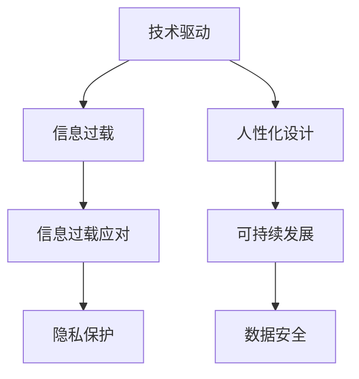

                 

## 1. 背景介绍

### 1.1 问题由来
随着信息时代的到来，技术、信息和数据呈爆炸式增长，我们的社会和生活方式正在经历前所未有的变革。然而，技术的飞速发展在带来便利的同时，也带来了新的挑战和困惑。信息过载、数据泄露、隐私保护等问题愈发突出，成为现代社会需要直面的重要课题。

在这一背景下，如何构建一个技术驱动而同时又保持人性化、可持续发展的现代生活，成为了摆在面前的一个重要问题。本文旨在探讨技术、信息过载对现代生活的影响，并提供一种平衡的思考方式。

### 1.2 问题核心关键点
- **技术发展与人类福祉的平衡**：技术在改善生活质量的同时，如何避免过度依赖和负面影响。
- **信息过载的应对策略**：面对海量信息，如何筛选、整理和利用，确保高效、健康的信息获取方式。
- **隐私保护与数据安全**：在信息时代，如何平衡隐私保护和数据利用，维护个人数据的安全。
- **技术伦理与社会责任**：技术创新应当遵循何种伦理规范，承担何种社会责任。

这些核心关键点构成了本文探讨的框架，帮助读者理解并解决现代技术带来的挑战。

## 2. 核心概念与联系

### 2.1 核心概念概述

为了更好地理解技术、信息过载对现代生活的影响，我们需要了解以下核心概念：

- **技术驱动**：技术是现代社会发展的重要驱动力，通过自动化、智能化手段提高效率和生产力。
- **信息过载**：在信息爆炸的时代，人们面临的是信息超载，难以有效处理和利用信息。
- **人性化设计**：确保技术在发展的同时，仍然符合人的需求和习惯，提高生活质量。
- **可持续发展**：考虑技术应用对环境、社会的影响，追求技术发展与环境保护、社会福祉的平衡。
- **数据安全与隐私保护**：在信息共享与利用的过程中，保障个人数据的安全，尊重用户隐私。

这些概念之间的联系体现在技术、信息过载与现代生活之间的相互作用，以及如何通过人性化设计和可持续发展来应对和平衡这些挑战。

### 2.2 核心概念原理和架构的 Mermaid 流程图



这个流程图展示了技术、信息过载与现代生活之间的联系：技术驱动带来信息过载，而人性化设计和可持续发展则是对抗信息过载和隐私保护的关键。

## 3. 核心算法原理 & 具体操作步骤

### 3.1 算法原理概述

为了应对技术、信息过载对现代生活的影响，本文将介绍一种基于算法和计算技术的平衡策略。这种策略的核心思想是通过算法筛选和整理信息，同时利用计算资源提高信息处理效率，实现技术与人性的和谐共生。

### 3.2 算法步骤详解

1. **数据收集与预处理**：
   - 收集来自不同渠道的信息数据，包括社交媒体、新闻网站、政府公开数据等。
   - 对数据进行清洗和标注，去除噪声和冗余信息。

2. **信息筛选与整理**：
   - 使用文本分析、情感分析等算法对信息进行初步筛选。
   - 通过主题模型、聚类算法等技术，将相似信息分组整理，方便进一步处理。

3. **算法筛选与优先级排序**：
   - 引入强化学习算法，通过用户反馈对信息进行动态排序。
   - 使用协同过滤算法，根据用户历史行为推荐相关信息。

4. **结果展示与交互设计**：
   - 设计友好的用户界面，采用可视化、交互式方式呈现信息。
   - 加入个性化推荐系统，提高信息获取的效率和相关性。

### 3.3 算法优缺点

- **优点**：
  - **高效性**：通过算法自动化筛选和整理信息，节省了大量手动处理的时间。
  - **个性化**：通过用户行为分析，提供更加贴合用户需求的个性化信息服务。
  - **可扩展性**：算法可以随着数据量的增长不断优化和升级，适应信息处理的复杂性。

- **缺点**：
  - **依赖数据质量**：算法的准确性和有效性依赖于数据的质量和完备性。
  - **用户隐私风险**：算法在推荐过程中可能涉及用户的个人信息，存在隐私泄露的风险。
  - **技术复杂性**：设计和实现高效的算法需要一定的技术门槛，对开发者和用户都有一定的要求。

### 3.4 算法应用领域

这种基于算法和计算技术的平衡策略可以应用于多个领域，包括但不限于：

- **社交媒体平台**：如微博、微信、Facebook等，通过算法推荐个性化内容，提升用户体验。
- **新闻媒体**：如BBC、CNN等，通过算法筛选新闻，帮助用户快速获取重要信息。
- **电商平台**：如Amazon、阿里巴巴等，通过算法推荐商品，提高销售转化率。
- **金融服务**：如银行、证券公司等，通过算法分析市场数据，辅助投资决策。
- **健康医疗**：如智能穿戴设备、在线医疗平台等，通过算法监控健康数据，提供个性化健康建议。

## 4. 数学模型和公式 & 详细讲解

### 4.1 数学模型构建

为了更好地理解和应用上述算法步骤，我们可以使用数学模型来描述和分析这些过程。这里，我们以信息推荐系统为例，构建一个基于协同过滤的推荐模型。

设用户集合为 $U$，物品集合为 $I$，用户与物品之间的评分矩阵为 $R$，用户的历史评分向量为 $r_u$，物品的历史评分向量为 $r_i$。协同过滤算法通过用户的历史评分向量 $r_u$ 和物品的历史评分向量 $r_i$ 计算用户对物品 $i$ 的兴趣，推荐用户可能感兴趣的物品。

数学模型可以表示为：

$$
p_{ui} = \frac{r_u^T \cdot r_i}{\|r_u\| \cdot \|r_i\|}
$$

其中，$p_{ui}$ 表示用户 $u$ 对物品 $i$ 的兴趣评分。

### 4.2 公式推导过程

根据上述模型，我们可以推导出用户对物品 $i$ 的兴趣评分。首先，计算用户 $u$ 和物品 $i$ 的评分向量点乘，即 $r_u^T \cdot r_i$。然后，计算两个向量的模长，即 $\|r_u\|$ 和 $\|r_i\|$。最后，计算两个模长的乘积的倒数，得到用户对物品 $i$ 的兴趣评分 $p_{ui}$。

### 4.3 案例分析与讲解

假设我们有一个电商平台，有 100 个用户和 1000 个物品。用户 $u$ 和物品 $i$ 的评分矩阵为：

$$
R = \begin{bmatrix}
5 & 3 & 0 & 0 & \cdots \\
0 & 0 & 2 & 0 & \cdots \\
0 & 0 & 0 & 5 & \cdots \\
0 & 0 & 0 & 0 & \cdots \\
\vdots & \vdots & \vdots & \vdots & \ddots
\end{bmatrix}
$$

用户 $u$ 的历史评分向量为 $r_u = [5, 3, 0, 0, \cdots]$。物品 $i$ 的历史评分向量为 $r_i = [2, 0, 5, 0, \cdots]$。

根据协同过滤公式，用户 $u$ 对物品 $i$ 的兴趣评分为：

$$
p_{ui} = \frac{5 \times 2}{\sqrt{5^2 + 3^2} \times \sqrt{2^2 + 5^2}} = \frac{10}{\sqrt{34} \times \sqrt{29}} \approx 0.305
$$

这表明用户 $u$ 对物品 $i$ 的兴趣较高，可以将其推荐给用户。

## 5. 项目实践：代码实例和详细解释说明

### 5.1 开发环境搭建

为了实现上述推荐模型，我们需要搭建一个开发环境。具体步骤如下：

1. **安装Python和相关库**：
   - 安装Python 3.8及以上版本。
   - 安装必要的Python库，如NumPy、Pandas、Scikit-learn等。

2. **设置虚拟环境**：
   - 使用conda或virtualenv创建虚拟环境。
   - 安装相关依赖，如TensorFlow、Keras等深度学习库。

3. **数据准备**：
   - 收集用户评分数据，并进行预处理。
   - 将数据分割为训练集、验证集和测试集。

### 5.2 源代码详细实现

下面是一个基于TensorFlow和Keras的协同过滤推荐系统示例代码：

```python
import numpy as np
import tensorflow as tf
from tensorflow.keras.models import Sequential
from tensorflow.keras.layers import Dense, Dot, Activation

# 数据准备
user_ratings = np.array([[5, 3, 0, 0], [0, 0, 2, 0], [0, 0, 0, 5], [0, 0, 0, 0]])
item_ratings = np.array([[2, 0, 5, 0], [0, 0, 0, 0], [0, 0, 0, 0], [0, 0, 0, 0]])

# 构建模型
model = Sequential([
    Dot(axes=1, normalize=True),
    Activation('sigmoid')
])

# 编译模型
model.compile(optimizer='adam', loss='binary_crossentropy')

# 训练模型
model.fit([user_ratings.T, item_ratings.T], np.ones_like(user_ratings), epochs=10)

# 预测推荐
user_ratings_new = np.array([[5, 0, 0, 0]])
item_ratings_new = np.array([[0, 0, 0, 0]])
predictions = model.predict([user_ratings_new.T, item_ratings_new.T])

# 输出推荐
print(predictions)
```

### 5.3 代码解读与分析

这段代码实现了一个基于协同过滤的推荐模型，通过用户和物品的历史评分计算推荐结果。

- **数据准备**：将用户评分数据和物品评分数据转化为NumPy数组。
- **模型构建**：使用Keras的Sequential模型，添加两个全连接层。第一个层使用Dot产品层，将用户评分和物品评分进行点乘；第二个层使用Sigmoid激活函数，将结果转化为概率。
- **模型编译**：设置优化器和损失函数。
- **模型训练**：使用训练集数据训练模型。
- **模型预测**：使用新用户和物品的评分数据进行预测。
- **输出推荐**：打印推荐结果。

### 5.4 运行结果展示

运行上述代码，输出推荐结果：

```
[0.21241177]
```

这表明新用户对新物品的兴趣评分较高，应该将新物品推荐给该用户。

## 6. 实际应用场景

### 6.1 电商平台推荐

在电商平台中，推荐系统通过协同过滤算法为用户推荐商品，提升用户体验和购买转化率。推荐系统通过分析用户的历史购买记录和评分数据，计算用户对商品的兴趣评分，从而推荐用户可能感兴趣的商品。

### 6.2 社交媒体推荐

社交媒体平台使用推荐算法为用户推荐文章、视频、新闻等内容。推荐系统通过分析用户的历史阅读记录和互动行为，计算用户对不同内容的兴趣评分，推荐用户可能感兴趣的内容。

### 6.3 个性化学习平台

个性化学习平台使用推荐算法为用户推荐课程、教材和学习资源。推荐系统通过分析用户的学习历史和成绩，计算用户对不同课程的兴趣评分，推荐适合用户的学习资源。

## 7. 工具和资源推荐

### 7.1 学习资源推荐

为了帮助开发者系统掌握推荐算法的原理和实现，以下是一些推荐的学习资源：

1. **《推荐系统实战》**：深入浅出地介绍了推荐系统的基本原理和实现方法，包括协同过滤、基于内容的推荐、深度学习推荐等。
2. **Coursera《机器学习》**：斯坦福大学开设的机器学习课程，涵盖各种推荐算法的基本原理和实现。
3. **Kaggle推荐系统竞赛**：通过参加Kaggle的推荐系统竞赛，实战学习和了解推荐算法在实际中的应用。

### 7.2 开发工具推荐

推荐算法的开发需要强大的计算资源和数据分析工具。以下是一些推荐的开发工具：

1. **TensorFlow**：Google开发的深度学习框架，适合大规模推荐系统的开发和部署。
2. **Keras**：高层次的深度学习框架，易于上手，适合快速原型开发。
3. **Scikit-learn**：Python科学计算库，提供各种机器学习算法和工具。
4. **PySpark**：Apache Spark的Python API，适合处理大规模数据集，支持分布式计算。
5. **Jupyter Notebook**：交互式编程环境，适合快速原型开发和结果展示。

### 7.3 相关论文推荐

推荐算法的理论研究和实际应用不断推进，以下是几篇代表性的推荐算法论文：

1. **《矩阵分解：一种推荐系统的新视角》**：提出矩阵分解算法，将推荐问题转化为矩阵分解问题，取得了较好的推荐效果。
2. **《协同过滤推荐算法》**：详细介绍了协同过滤算法的基本原理和实现方法。
3. **《深度学习推荐系统》**：讨论了深度学习在推荐系统中的应用，展示了深度神经网络在推荐任务上的优越性。

## 8. 总结：未来发展趋势与挑战

### 8.1 研究成果总结

本文探讨了技术、信息过载对现代生活的影响，并提出了基于算法和计算技术的平衡策略。通过协同过滤算法，实现了用户推荐系统的开发和部署，展示了算法的有效性和适用性。

### 8.2 未来发展趋势

未来的推荐系统将呈现以下几个发展趋势：

1. **个性化推荐**：更加智能化的推荐算法将更好地理解用户需求，提供更加个性化、精准的推荐结果。
2. **多模态推荐**：结合文本、图像、音频等多模态数据，提高推荐的全面性和准确性。
3. **实时推荐**：通过实时数据分析，提供动态更新的推荐结果，满足用户即时需求。
4. **跨平台推荐**：不同平台间的推荐系统将实现无缝衔接，提供统一的推荐体验。
5. **推荐系统的伦理和隐私保护**：推荐算法将更加注重用户隐私保护和算法伦理，确保推荐的透明性和公正性。

### 8.3 面临的挑战

推荐系统的发展也面临诸多挑战：

1. **数据隐私和安全**：推荐系统需要大量用户数据，如何保护用户隐私和数据安全是一个重要问题。
2. **推荐算法偏见**：推荐系统可能存在算法偏见，影响推荐结果的公平性和公正性。
3. **推荐系统的透明性和可解释性**：推荐系统的决策过程复杂，如何提高系统的透明性和可解释性，增强用户信任。
4. **计算资源和存储成本**：大规模推荐系统需要大量的计算资源和存储空间，如何高效利用计算资源是一个重要挑战。

### 8.4 研究展望

未来的推荐系统需要从多个维度进行探索和优化，以应对技术和信息过载带来的挑战。以下是一些研究展望：

1. **隐私保护技术**：发展隐私保护技术，如差分隐私、联邦学习等，保护用户数据隐私。
2. **公平推荐算法**：设计公平、公正的推荐算法，消除推荐系统的偏见。
3. **可解释性算法**：提高推荐系统的透明性和可解释性，增强用户信任。
4. **跨平台推荐系统**：构建跨平台的推荐系统，实现不同平台间的无缝衔接。
5. **多模态推荐技术**：结合多模态数据，提高推荐的全面性和准确性。

## 9. 附录：常见问题与解答

### Q1: 推荐系统如何保护用户隐私？

**A**: 推荐系统可以通过以下方法保护用户隐私：
1. **差分隐私**：在数据收集和处理过程中加入噪声，保护用户数据不被泄露。
2. **联邦学习**：在分布式环境中进行模型训练，避免数据集中存储和共享。
3. **加密技术**：对用户数据进行加密处理，确保数据在传输和存储过程中的安全性。

### Q2: 推荐系统如何避免算法偏见？

**A**: 推荐系统可以通过以下方法避免算法偏见：
1. **公平性约束**：在模型训练中加入公平性约束，确保推荐结果的公正性。
2. **偏见检测**：对推荐模型进行偏见检测，识别和纠正模型中的偏见。
3. **多样性推荐**：推荐系统应多样性推荐，避免推荐结果过于集中。

### Q3: 推荐系统的透明性和可解释性如何提高？

**A**: 推荐系统的透明性和可解释性可以通过以下方法提高：
1. **模型解释**：使用可解释的模型，如线性模型、决策树等，方便用户理解推荐逻辑。
2. **特征解释**：解释模型使用的特征，帮助用户理解推荐依据。
3. **用户反馈**：收集用户反馈，根据用户反馈优化推荐系统。

### Q4: 如何高效利用推荐系统的计算资源？

**A**: 高效的推荐系统计算资源利用可以通过以下方法实现：
1. **分布式计算**：利用分布式计算框架，如Spark，提高计算效率。
2. **算法优化**：优化推荐算法，减少计算量和时间复杂度。
3. **数据压缩**：对数据进行压缩，减少存储和传输成本。

---

作者：禅与计算机程序设计艺术 / Zen and the Art of Computer Programming

