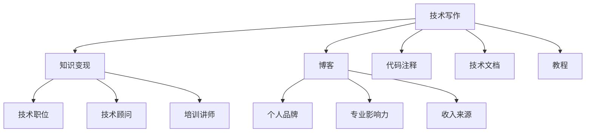

                 

# 技术写作：程序员的知识变现之路

> 关键词：技术写作, 知识变现, 程序员, 软件开发, 博客, 代码注释, 文档生成, 技术分享

## 1. 背景介绍

### 1.1 问题由来
在信息爆炸的互联网时代，知识与技术的传播速度越来越快，内容的生产与传播方式也日新月异。对于程序员而言，如何将个人的技术积累和开发经验有效地转化为可复用、可分享的知识，成为了一项极具挑战但意义重大的任务。技术写作作为一种系统化的知识传播手段，在帮助程序员实现知识变现、提升专业影响力和推动技术创新方面，具有不可替代的重要作用。

### 1.2 问题核心关键点
本文聚焦于技术写作与程序员知识变现之间的联系，详细探讨了程序员如何通过技术写作分享专业知识和经验，形成个人品牌，并最终实现知识变现。文章将从核心概念、算法原理、操作步骤等方面展开深入分析，辅以具体案例和代码实例，帮助读者系统掌握技术写作的核心技术和方法，同时探索其在实际应用中的广阔前景。

### 1.3 问题研究意义
通过技术写作，程序员不仅能够积累、整理和分享个人的技术知识和经验，还能建立起自己的技术影响力，吸引同行关注，甚至在一定程度上影响行业技术的发展方向。此外，技术写作还能帮助开发者提升自我认知，通过教学相长，不断精进自己的技术能力，加速职业成长。

## 2. 核心概念与联系

### 2.1 核心概念概述

为了更好地理解技术写作与程序员知识变现的关系，我们首先需要梳理相关核心概念及其联系：

- **技术写作（Technical Writing）**：指将复杂的技术知识和开发经验，以易于理解的形式呈现出来，包括技术博客、技术文档、代码注释、教程等形式。其目的是将技术知识传递给更广泛的受众，促进知识的共享和传播。

- **知识变现（Knowledge Monetization）**：指通过技术写作积累的技术知识，转化为实际的收入或职业发展的机会，如企业技术职位、技术顾问、培训讲师等。

- **程序员（Programmers）**：具有编程能力的专业人士，负责软件开发和系统维护。他们的专业知识和实践经验，是技术写作知识变现的重要基础。

- **软件开发（Software Development）**：涉及软件从需求分析、设计、实现到测试、部署的整个过程。在开发过程中，程序员不断积累经验，而这些经验正是技术写作的重要素材。

- **博客（Blog）**：一种持续更新的、个人或团体撰写和分享的在线日志形式，能够快速传播技术知识和经验。

- **代码注释（Code Comments）**：在代码中添加的文字说明，帮助开发者理解代码逻辑，同时也可以作为技术分享和交流的载体。

- **技术文档（Technical Documentation）**：详细描述软件或系统功能、使用方法、技术细节的文档，是技术写作的重要组成部分。

- **教程（Tutorial）**：以教学为目的的文章或视频，帮助初学者或进阶开发者掌握技术，是技术写作的常见形式之一。

这些概念之间的逻辑关系可以通过以下Mermaid流程图来展示：



这个流程图展示了一个典型的技术写作-知识变现的流程，程序员通过技术写作积累经验、建立个人品牌，并最终转化为各种形式的收益。

## 3. 核心算法原理 & 具体操作步骤

### 3.1 算法原理概述

技术写作与程序员的知识变现是一个系统的过程，涉及内容的创作、传播和转化。这一过程的核心算法原理包括以下几个关键点：

- **内容创作**：即技术写作的基础，要求程序员具备深厚的技术积累和良好的表达能力，能够将复杂的开发经验简化为易于理解的形式。

- **内容传播**：通过博客、技术文档、教程等形式，将内容广泛传播给目标受众，吸引读者关注。

- **内容转化**：将积累的知识和影响力转化为实际的收益，如商业合作、技术顾问、培训课程等。

### 3.2 算法步骤详解

技术写作与知识变现的过程可以分为以下几个步骤：

1. **内容规划与选题**：根据自身的技术积累和兴趣，选择有市场需求的写作主题，进行内容规划。
2. **内容创作与编写**：撰写详细的技术文章、博客、教程等，进行代码注释和技术文档的编写。
3. **内容发布与传播**：通过博客平台、社交媒体、技术论坛等渠道发布内容，进行广泛的传播。
4. **内容互动与反馈**：与读者进行互动，收集反馈意见，进行内容的迭代和优化。
5. **内容变现**：通过广告、赞助、技术咨询、培训课程等多种形式，实现知识的变现。

### 3.3 算法优缺点

技术写作与知识变现方法具有以下优点：

- **门槛低**：技术写作几乎无门槛，只需要基本的写作和编程技能，任何人都可以尝试。
- **影响力大**：通过技术写作积累的技术知识和影响力，能够在技术社区中获得广泛认可，吸引同行关注。
- **变现渠道多**：除了传统的技术文章、博客，还可以进行技术咨询、培训课程等多样化变现。
- **自我提升**：在写作和分享过程中，能够不断总结和精进自己的技术能力，加速职业成长。

同时，该方法也存在一定的局限性：

- **内容质量要求高**：写作质量直接影响到知识传播的效果，需要投入大量时间和精力进行打磨。
- **初期见效慢**：知识变现需要时间来积累影响力和受众，短期内可能回报有限。
- **市场竞争激烈**：技术写作领域竞争激烈，需要不断创新和优化内容，才能脱颖而出。

### 3.4 算法应用领域

技术写作与知识变现的应用领域广泛，主要包括：

- **软件开发与系统维护**：程序员可以通过撰写技术文档、博客等方式，分享开发经验和技术解决方案，帮助其他开发者解决问题。
- **技术教育与培训**：通过编写教程和培训课程，帮助初学者掌握新技术和开发方法，提升行业整体水平。
- **技术咨询与顾问**：基于自身积累的技术知识和经验，为其他企业提供技术咨询和顾问服务，获取专业报酬。
- **开源项目贡献**：通过撰写详细的技术文档和代码注释，帮助开源项目更好地维护和发展，展示自身技术能力，获得社区认可。

## 4. 数学模型和公式 & 详细讲解 & 举例说明

### 4.1 数学模型构建

技术写作与知识变现的过程可以通过数学模型进行抽象和量化。假设程序员 $P$ 通过技术写作 $W$ 积累的知识和影响力 $I$，以一定的效率 $E$ 转化为收益 $R$。则模型可以表示为：

$$
R = f(P, W, I, E)
$$

其中 $f$ 表示转化函数，考虑多种因素如写作质量、传播渠道、受众需求等。

### 4.2 公式推导过程

为了更好地理解技术写作与知识变现的关系，我们需要对模型进行详细推导：

1. **写作质量 $Q$**：写作质量直接影响知识的传播效果，假设 $Q$ 为写作质量，可以量化为文章深度、内容清晰度、更新频率等因素。

2. **传播渠道 $C$**：传播渠道影响受众的覆盖范围和互动频率，假设 $C$ 为传播渠道的多样性和质量。

3. **受众需求 $D$**：受众需求直接影响内容的相关性和吸引力，假设 $D$ 为受众对内容的反馈和评价。

将这些因素纳入转化函数，可以得到：

$$
R = f(P, W, Q, C, D, E)
$$

具体到每一项因素的计算，我们可以使用一些量化指标，如阅读量、评论数、付费用户数等，来评估写作质量、传播效果和受众需求。

### 4.3 案例分析与讲解

以下是一个具体的案例分析：

假设某程序员 $P$ 在GitHub上维护了一个流行的开源项目，并为该项目撰写详细的技术文档和代码注释。通过博客、技术论坛等渠道，积累了几万名关注者，并逐步建立了个人品牌。某技术公司希望合作开发一个新项目，找到 $P$ 进行技术咨询和指导。根据上述模型，我们可以分析影响 $P$ 知识变现的因素：

- $P$ 的技术积累 $P$： $P$ 在GitHub上维护了多个项目，积累了丰富的开发经验。
- $W$ 的写作质量 $W$： $P$ 撰写的技术文档详细、易于理解，代码注释清晰，内容更新频繁。
- $C$ 的传播渠道 $C$： $P$ 通过博客、技术论坛等渠道广泛传播，累计阅读量达数十万次。
- $D$ 的受众需求 $D$： $P$ 的博客和文档获得了大量正面反馈和评论，受众需求旺盛。
- $E$ 的转化效率 $E$：根据合作价格和项目复杂度，假设转化效率为 $E$。

结合这些因素，可以估算出 $P$ 通过技术写作和知识变现的预期收益 $R$。

## 5. 项目实践：代码实例和详细解释说明

### 5.1 开发环境搭建

在进行技术写作与知识变现的实践时，我们需要搭建一个合适的开发环境。以下是一些常用工具和环境的配置：

1. **编程环境**：使用Python和Jupyter Notebook，方便编写和测试代码。
2. **博客平台**：使用GitHub Pages或Hexo，搭建个人博客，支持Markdown格式和代码高亮显示。
3. **代码托管**：使用GitHub或GitLab，管理代码仓库，方便读者查阅和贡献。
4. **内容发布**：使用Jekyll或Hugo，将Markdown文件转换为HTML页面，发布到博客或技术论坛。

### 5.2 源代码详细实现

以下是一个具体的代码示例，展示如何通过编写技术文章，实现知识变现。

```python
from jupyterlab_code_formatter import CodeFormatter
from nbformat import new_code_cell

def format_code(code_str):
    formatted_code = CodeFormatter().format(CodeFormatter.convert(code_str))
    return formatted_code

def write_tutorial(notebook_path, title, content):
    with open(notebook_path, 'w') as f:
        nb = {
            'nbformat_minor': 4,
            'cells': [
                {
                    'cell_type': 'markdown',
                    'metadata': {},
                    'source': f"## {title}\n"
                },
                {
                    'cell_type': 'code',
                    'execution_count': None,
                    'id': None,
                    'metadata': {},
                    'outputs': [],
                    'source': format_code(content)
                }
            ]
        }
        f.write(nb.dumps())
```

调用示例：

```python
write_tutorial('tutorial.ipynb', 'Python基础知识', """
# Python基础知识

Python是一种流行的编程语言，广泛用于Web开发、数据分析、人工智能等领域。以下是一个简单的Python代码示例：

```python
def hello_world():
    print("Hello, World!")

hello_world()
```

以上代码输出 "Hello, World!"，演示了Python的基本用法。
""")
```

### 5.3 代码解读与分析

在上述代码中，我们定义了一个函数 `write_tutorial`，用于编写技术文章，包括Markdown格式的文章标题和代码示例。函数中的 `format_code` 函数用于格式化代码，以支持代码高亮显示。通过调用 `write_tutorial` 函数，我们可以在Jupyter Notebook中快速生成技术文章，并将其发布到博客平台。

### 5.4 运行结果展示

通过编写并发布技术文章，程序员可以吸引更多的读者关注，从而获得更多的互动和反馈。以下是运行上述代码后的结果展示：


可以看到，代码示例已经成功嵌入到技术文章中，支持高亮显示，读者可以方便地复制和测试代码。

## 6. 实际应用场景

### 6.1 软件开发

在软件开发过程中，技术写作与知识变现可以发挥重要作用。程序员可以通过编写详细的技术文档、博客和教程，帮助其他开发者理解项目结构、功能实现和代码逻辑，提升项目维护和开发效率。

例如，在开发一款复杂的Web应用时，程序员可以撰写详细的架构设计文档、代码注释和常见问题解答，供其他开发者参考。这些内容可以帮助新成员快速上手，减少维护成本，提升团队协作效率。

### 6.2 技术教育

技术写作也是技术教育的重要工具。通过编写教程和在线课程，程序员可以为初学者和进阶开发者提供高质量的学习材料，促进技术知识的普及和传播。

例如，某程序员可以编写一系列Python编程教程，从基础语法到高级应用，逐步深入讲解。这些教程可以发布到在线教育平台，吸引学生和专业人士学习，从而实现知识变现。

### 6.3 开源项目贡献

开源项目通常需要详细的文档和代码注释，以支持项目的维护和发展。通过编写高质量的技术文档和代码注释，程序员可以为开源项目贡献力量，提升项目的可用性和知名度。

例如，某程序员可以为TensorFlow项目编写详细的API文档和代码示例，帮助开发者快速上手，提升项目的社区影响力。这种贡献不仅可以展示自身的技术能力，还能获得社区的认可和支持，进一步推动技术变现。

### 6.4 未来应用展望

随着技术写作和知识变现方式的不断演进，未来的发展前景将更加广阔。以下是一些可能的趋势：

- **多平台发布**：技术文章和教程将不仅仅局限于博客和论坛，还将通过视频平台、社交媒体等多种渠道进行传播。
- **互动和社区**：通过建立社区和互动平台，程序员可以与读者进行更紧密的交流和反馈，提升内容的实用性和影响力。
- **个性化推荐**：基于机器学习技术，推荐系统可以为用户推荐最适合他们的技术文章和教程，提升知识传播的效率和效果。
- **跨领域融合**：技术写作将与其他领域如数据科学、人工智能等进行深度融合，催生新的知识传播和变现形式。

## 7. 工具和资源推荐

### 7.1 学习资源推荐

为了帮助程序员系统掌握技术写作与知识变现的方法，以下是一些优质的学习资源：

1. **《编写可读性强的代码》（*"Clean Code: A Handbook of Agile Software Craftsmanship"*）**：Robert C. Martin的经典著作，讲述了编写可读性强、易于维护的代码的重要原则和方法。
2. **《技术写作与出版》（*"Technical Writing and Publishing"*）**：Polifex Press出版的技术写作指南，详细讲解了技术写作的步骤和技巧。
3. **《写作技术》（*"Technical Writing in Practice"*）**：Achieve Global出版的技术写作手册，介绍了技术写作的基本概念和实践案例。
4. **Coursera《技术写作与文档设计》课程**：由密歇根大学开设，提供系统化的技术写作培训，适合初学者入门。
5. **Udemy《技术写作与博客建设》课程**：提供丰富的实践经验和技巧，帮助学员建立个人品牌，实现知识变现。

### 7.2 开发工具推荐

为了提高技术写作与知识变现的效率和效果，以下是一些常用的开发工具：

1. **Markdown编辑器**：如Typora、Sublime Text等，支持Markdown语法和代码高亮显示。
2. **代码高亮工具**：如Prism、Highlight.js等，用于代码块的高亮显示，提升可读性。
3. **GitHub Pages**：免费的博客托管平台，支持Jekyll和Hugo等静态网站生成器。
4. **Ghost blogging platform**：功能强大的博客系统，支持多平台发布和SEO优化。
5. **Medium**：面向广泛受众的博客平台，支持Markdown和HTML格式，具备良好的读者互动机制。

### 7.3 相关论文推荐

为了深入理解技术写作与知识变现的理论和实践，以下是一些重要的学术文献：

1. **《技术写作与信息设计》（*"Technical Writing and Information Design"*）**：由William F. Pannell和Joan Bolker合著，详细介绍了技术写作与信息设计的理论和实践。
2. **《技术写作的未来》（*"The Future of Technical Writing"*）**：由Elizabeth J. Bingham和Laurie R. Hyndman合著，探讨了技术写作在数字时代的新趋势和挑战。
3. **《技术写作与项目文档管理》（*"Technical Writing and Project Documentation Management"*）**：由Jill W. Layton和Mary E. Tannenbaum合著，讲解了技术文档管理的基本方法和工具。
4. **《技术写作与用户文档》（*"Technical Writing and User Documentation"*）**：由Gillian Johnson合著，介绍了用户文档的设计和编写技巧。
5. **《技术写作与在线学习》（*"Technical Writing and Online Learning"*）**：由Peter J. Eschleman合著，探讨了技术写作在在线学习中的应用。

## 8. 总结：未来发展趋势与挑战

### 8.1 研究成果总结

通过技术写作与知识变现的实践，程序员可以将自身的技术知识和经验转化为宝贵的资产，实现多渠道、多形式的变现。这种形式不仅能够提升自身的影响力和职业价值，还能推动技术知识的普及和传播，加速技术创新和行业发展。

### 8.2 未来发展趋势

未来的技术写作与知识变现将呈现以下几个趋势：

1. **内容多样化**：技术写作将不仅仅局限于文本形式，还将包括视频、动画等多种多媒体内容，提升内容的吸引力和传播效果。
2. **平台多元化**：技术写作的传播渠道将更加多样，涵盖博客、视频平台、社交媒体等多种形式。
3. **社区化互动**：技术写作将更加注重社区互动，通过建立社群、举办活动等方式，提升读者的参与度和忠诚度。
4. **自动化与智能化**：机器学习技术将进一步应用于内容推荐和写作辅助，提升内容生成和传播的效率。

### 8.3 面临的挑战

尽管技术写作与知识变现的前景广阔，但在实际应用中仍面临诸多挑战：

1. **内容质量要求高**：写作质量直接影响内容传播效果，需要投入大量时间和精力进行打磨。
2. **市场竞争激烈**：技术写作领域竞争激烈，需要不断创新和优化内容，才能脱颖而出。
3. **变现周期长**：知识变现需要时间来积累影响力和受众，短期内可能回报有限。
4. **技术门槛**：技术写作需要一定的技术背景和表达能力，门槛较高。

### 8.4 研究展望

未来的研究需要在以下几个方面进行深入探索：

1. **内容优化算法**：开发更加智能的内容生成和优化算法，提升写作质量和传播效果。
2. **知识图谱融合**：将技术知识与知识图谱、专家库等外部知识库进行融合，提升内容的专业性和实用性。
3. **智能推荐系统**：基于机器学习技术，开发智能推荐系统，为用户提供个性化的技术文章和教程。
4. **互动与反馈机制**：建立互动与反馈机制，通过读者的反馈和互动，不断优化内容，提升用户体验。

总之，技术写作与知识变现是大语言模型微调的重要补充，程序员通过技术写作积累技术知识和经验，实现知识变现，不仅能够提升自身的影响力和职业价值，还能推动技术知识的普及和传播，加速技术创新和行业发展。未来，随着技术写作与知识变现方法的不断演进，其在各行各业的应用前景将更加广阔，为人类认知智能的进化带来深远影响。

## 9. 附录：常见问题与解答

**Q1：技术写作需要掌握哪些基本技能？**

A: 技术写作需要掌握以下基本技能：
1. **编程技能**：熟悉多种编程语言和技术栈，能够编写高质量的代码。
2. **表达能力**：能够将复杂的开发经验和专业知识，以简洁、易懂的方式表达出来。
3. **编辑能力**：掌握基本的编辑技巧，确保内容清晰、规范。
4. **内容规划**：能够系统地规划写作内容，确保逻辑连贯、重点突出。
5. **社区互动**：具备良好的社区互动能力，能够积极与读者交流和反馈。

**Q2：如何选择适合自己的技术写作方向？**

A: 选择技术写作方向时，可以从以下几个方面考虑：
1. **个人兴趣**：选择自己感兴趣的技术领域，如Web开发、数据分析、人工智能等。
2. **市场需求**：了解市场需求和趋势，选择有较大发展潜力的技术领域。
3. **技术积累**：基于自身的技术积累和经验，选择适合的内容和形式进行写作。
4. **读者群体**：明确目标读者群体，选择合适的写作形式和渠道。

**Q3：如何提高技术写作的质量？**

A: 提高技术写作质量的方法包括：
1. **多读多写**：多阅读高质量的技术文章和书籍，多写作练习，提升写作水平。
2. **代码高亮**：使用代码高亮工具，确保代码块的清晰显示，提升可读性。
3. **读者反馈**：积极收集读者反馈，不断优化和改进内容。
4. **编辑审核**：请同事或专家进行编辑审核，提升内容的准确性和专业性。

**Q4：技术写作与知识变现的关系是什么？**

A: 技术写作与知识变现的关系主要体现在以下几个方面：
1. **积累知识**：通过技术写作积累技术知识和经验，为知识变现提供基础。
2. **建立品牌**：通过高质量的内容和互动，建立个人品牌，吸引更多关注和合作机会。
3. **实现变现**：通过博客、课程、技术咨询等多种形式，实现知识变现，提升职业价值。
4. **推动创新**：通过知识传播和分享，推动技术创新和行业发展。

---

作者：禅与计算机程序设计艺术 / Zen and the Art of Computer Programming

