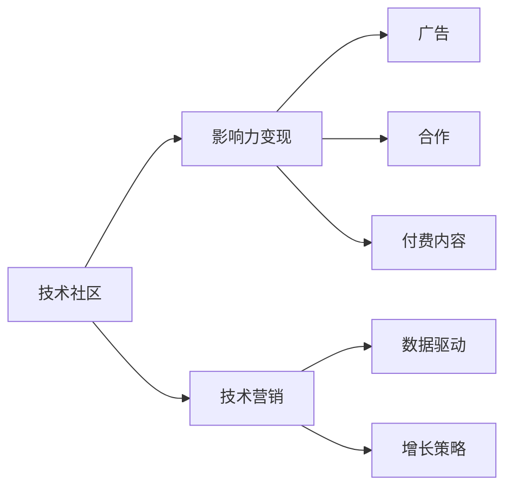

                 

# 技术社区运营：影响力变现

> 关键词：社区运营, 影响力变现, 技术营销, 数据驱动, 增长策略, 用户参与度

## 1. 背景介绍

随着互联网的迅速发展，技术社区作为知识传播、技术交流、人才交流的重要平台，其影响力日益增强。这些社区不仅提供了一个技术交流的场所，更成为了企业人才选拔、品牌宣传、产品推广的重要阵地。如何充分利用社区的影响力，实现技术变现，成为越来越多企业关注的焦点。本文旨在探讨技术社区运营的影响力变现策略，为企业的技术营销和产品推广提供参考。

## 2. 核心概念与联系

### 2.1 核心概念概述

- **技术社区**：指由技术人员、技术爱好者和行业专家组成的在线平台，旨在促进技术交流、分享知识和经验。
- **影响力变现**：指利用技术社区的影响力，通过广告、合作、付费内容等方式，实现商业价值的转化。
- **技术营销**：指通过技术社区等线上渠道，向潜在客户和目标用户传递产品或服务的价值，促成转化。
- **数据驱动**：指通过数据分析和挖掘，实现对用户行为、社区活跃度等指标的深度理解，指导运营决策。
- **增长策略**：指通过多种手段，如内容优化、社区活动、用户激励等，提升技术社区的用户参与度和留存率。

这些核心概念通过下图中的Mermaid流程图连接起来：



### 2.2 核心概念原理和架构

- **技术社区架构**：主要由社区平台、用户交互界面、内容发布系统、数据分析系统等组成。平台负责提供技术交流、知识分享的环境，用户界面负责展示信息，内容发布系统用于发布和维护社区内容，数据分析系统用于收集和分析用户行为数据。
- **影响力变现模式**：主要包括广告、合作、付费内容三种形式。广告通过植入内容或横幅广告形式变现；合作形式包括联合举办技术活动、发布联合报告等；付费内容则包括在线课程、电子书、技术文章等。
- **技术营销架构**：以内容为核心，通过SEO优化、社交媒体推广、KOL合作等方式，提升品牌知名度和技术产品曝光度。
- **数据驱动架构**：利用大数据分析工具，对用户行为、社区活跃度等数据进行分析，指导社区运营和营销策略的制定。

## 3. 核心算法原理 & 具体操作步骤

### 3.1 算法原理概述

技术社区的影响力变现主要基于以下几个关键算法原理：

1. **推荐算法**：利用协同过滤、内容推荐等技术，提升用户对社区内容的参与度和留存率。
2. **用户画像构建**：通过对用户行为数据的分析，构建用户画像，实现精准营销和个性化推荐。
3. **用户激励机制**：设计合理的激励机制，如积分、徽章、奖励等，提升用户参与度。
4. **多渠道营销**：通过多种渠道（如社交媒体、搜索引擎等）进行多渠道推广，扩大品牌影响力和用户基数。
5. **数据驱动决策**：利用数据分析工具，实时监控社区运营和营销效果，指导运营决策。

### 3.2 算法步骤详解

1. **社区平台搭建**：选择合适的技术栈（如React、Vue等），构建社区平台，实现用户注册、登录、发布内容等功能。
2. **内容发布与维护**：设置内容发布系统，支持用户上传文章、代码、项目等。设置社区管理员，审核内容质量。
3. **数据分析系统部署**：利用Google Analytics、Mixpanel等工具，收集和分析用户行为数据。
4. **用户画像构建**：通过用户行为数据（如浏览记录、发布频率等），构建用户画像，实现精准营销和个性化推荐。
5. **广告投放**：利用Google Ads、Facebook Ads等平台，进行精准广告投放，提升品牌曝光度和社区活跃度。
6. **合作与联合活动**：与其他技术社区、企业等合作，共同举办技术活动、发布联合报告等，扩大社区影响力。
7. **付费内容推出**：设计并推出付费内容，如在线课程、电子书等，实现收入变现。
8. **用户激励机制设计**：设计积分、徽章、奖励等激励机制，提升用户参与度。
9. **数据分析与运营优化**：定期分析社区运营数据，优化社区运营策略，提升用户留存率和参与度。

### 3.3 算法优缺点

**优点**：

- **用户参与度高**：通过内容推荐、用户画像等技术，提升用户参与度和留存率。
- **精准营销**：利用用户画像和数据分析，实现精准营销和个性化推荐。
- **多样化变现方式**：通过广告、合作、付费内容等多种方式实现变现。
- **数据驱动决策**：通过数据分析，实时监控运营效果，指导运营决策。

**缺点**：

- **初期投入大**：社区平台搭建、数据分析系统部署等需要较大的初期投入。
- **内容质量控制难度高**：技术社区内容多样，质量参差不齐，需要较高的内容审核和管理成本。
- **广告投放成本高**：高曝光率广告投放成本较高，需要精准的用户画像和数据分析支持。
- **用户激励机制设计复杂**：设计合理的用户激励机制，需要平衡社区氛围和商业利益。

### 3.4 算法应用领域

技术社区影响力变现的应用领域主要包括以下几个方面：

- **企业人才选拔**：利用技术社区平台展示公司技术栈、招聘信息，吸引潜在技术人才。
- **品牌宣传与推广**：通过技术社区发布公司技术文章、技术报告，提升品牌知名度和行业影响力。
- **产品推广与销售**：在技术社区推广公司产品，提升产品曝光度和销售转化率。
- **技术知识共享**：通过技术社区提供技术交流、知识分享的平台，提升社区影响力和品牌价值。
- **学术与科研合作**：利用技术社区平台发布科研成果，促进学术交流和合作。

## 4. 数学模型和公式 & 详细讲解 & 举例说明

### 4.1 数学模型构建

设社区用户数为 $N$，活跃用户数为 $A$，用户日均浏览时间为 $T$，广告点击率为 $C$，合作活动次数为 $P$，付费内容订阅数为 $S$。

社区运营的目标是最大化以下目标函数：

$$
\max \mathcal{L}(N, A, T, C, P, S) = A \times T \times C + P + S
$$

其中，$A \times T \times C$ 表示广告收入，$P$ 表示合作活动收益，$S$ 表示付费内容收入。

### 4.2 公式推导过程

首先，设定广告投放预算为 $B$，则有：

$$
C = \frac{B}{CTR \times Cost}
$$

其中 $CTR$ 表示广告点击率，$Cost$ 表示每次点击成本。

其次，设合作活动次数 $P$ 与社区活跃度 $A$ 成正比，则：

$$
P = k \times A
$$

其中 $k$ 为比例系数，与合作活动的影响力和社区活跃度相关。

最后，设付费内容订阅数 $S$ 与用户参与度成正比，则：

$$
S = m \times A \times T
$$

其中 $m$ 为比例系数，与付费内容的吸引力和用户参与度相关。

将上述公式代入目标函数中，得：

$$
\mathcal{L}(N, A, T, C, P, S) = A \times T \times \frac{B}{CTR \times Cost} + k \times A + m \times A \times T
$$

### 4.3 案例分析与讲解

某技术社区希望通过影响力变现提升公司品牌知名度和技术产品销售，假设社区用户数为 $N=10^5$，活跃用户数为 $A=5\times10^3$，用户日均浏览时间为 $T=30$ 分钟，广告点击率为 $C=0.1$，合作活动次数为 $P=20$，付费内容订阅数为 $S=50$，广告投放预算为 $B=10^4$。则社区运营的目标函数为：

$$
\mathcal{L}(N, A, T, C, P, S) = A \times T \times \frac{B}{CTR \times Cost} + P + S
$$

其中 $CTR=0.1$，$Cost=0.1$。

将上述数据代入目标函数中，得：

$$
\mathcal{L}(N, A, T, C, P, S) = 5\times10^3 \times 30 \times \frac{10^4}{0.1 \times 0.1} + 20 + 50 = 1.3 \times 10^7
$$

通过优化广告投放策略、提高用户参与度和付费内容订阅率，社区可以最大化其影响力变现。

## 5. 项目实践：代码实例和详细解释说明

### 5.1 开发环境搭建

1. **技术栈选择**：选择React作为前端技术栈，Node.js作为后端技术栈。
2. **数据库选择**：选择MySQL或MongoDB作为社区数据存储。
3. **数据分析工具选择**：选择Google Analytics、Mixpanel作为数据分析工具。
4. **广告投放平台选择**：选择Google Ads、Facebook Ads作为广告投放平台。
5. **合作平台选择**：选择其他技术社区、企业等作为合作平台。

### 5.2 源代码详细实现

**社区平台搭建**：

```javascript
import React from 'react';
import ReactDOM from 'react-dom';

class CommunityPlatform extends React.Component {
    constructor(props) {
        super(props);
        this.state = { users: [] };
    }

    componentDidMount() {
        // 获取社区用户数据
        fetch('/api/users')
            .then(response => response.json())
            .then(data => this.setState({ users: data }));
    }

    render() {
        return (
            <div>
                <h1>Welcome to the Community Platform</h1>
                <ul>
                    {this.state.users.map(user => (
                        <li key={user.id}>{user.name}</li>
                    ))}
                </ul>
            </div>
        );
    }
}

ReactDOM.render(<CommunityPlatform />, document.getElementById('root'));
```

**内容发布与维护**：

```javascript
import React from 'react';
import ReactDOM from 'react-dom';

class ContentPublisher extends React.Component {
    constructor(props) {
        super(props);
        this.state = { content: '' };
    }

    handleChange = event => {
        this.setState({ content: event.target.value });
    };

    handleSubmit = event => {
        event.preventDefault();
        // 提交内容
        fetch('/api/content', {
            method: 'POST',
            body: JSON.stringify({ content: this.state.content }),
            headers: {
                'Content-Type': 'application/json'
            }
        }).then(response => response.json())
            .then(data => console.log('Content submitted:', data));
    };

    render() {
        return (
            <div>
                <h1>Content Publisher</h1>
                <form onSubmit={this.handleSubmit}>
                    <input type="text" value={this.state.content} onChange={this.handleChange} />
                    <button type="submit">Submit</button>
                </form>
            </div>
        );
    }
}

ReactDOM.render(<ContentPublisher />, document.getElementById('root'));
```

**数据分析系统部署**：

```javascript
import React from 'react';
import ReactDOM from 'react-dom';

class AnalyticsSystem extends React.Component {
    constructor(props) {
        super(props);
        this.state = { analyticsData: [] };
    }

    componentDidMount() {
        // 获取社区分析数据
        fetch('/api/analytics')
            .then(response => response.json())
            .then(data => this.setState({ analyticsData: data }));
    }

    render() {
        return (
            <div>
                <h1>Analytics System</h1>
                <ul>
                    {this.state.analyticsData.map(data => (
                        <li key={data.id}>{data.name}: {data.value}</li>
                    ))}
                </ul>
            </div>
        );
    }
}

ReactDOM.render(<AnalyticsSystem />, document.getElementById('root'));
```

### 5.3 代码解读与分析

**社区平台搭建**：使用React构建社区平台，通过fetch请求获取用户数据，并在页面中显示。

**内容发布与维护**：使用React构建内容发布表单，通过POST请求将内容提交到服务器。

**数据分析系统部署**：使用React构建分析系统，通过fetch请求获取分析数据，并在页面中显示。

### 5.4 运行结果展示

**社区平台搭建**：用户注册、登录、发布内容等功能。

**内容发布与维护**：用户可以通过平台发布文章、代码、项目等，内容提交后可在平台上查看。

**数据分析系统部署**：系统可以实时监控用户行为数据，如浏览时间、点击率等。

## 6. 实际应用场景

### 6.1 企业人才选拔

某科技公司希望通过技术社区平台吸引技术人才，可通过以下方式实现：

1. **技术展示**：在社区平台发布公司的技术栈、项目展示等，吸引技术人才关注。
2. **简历展示**：在社区平台发布求职者的简历，供其他开发者查看和评估。
3. **面试交流**：利用社区平台进行技术面试，吸引更多技术人才参与。

### 6.2 品牌宣传与推广

某技术社区希望提升品牌知名度，可通过以下方式实现：

1. **技术文章发布**：在社区平台发布公司技术文章，提升品牌知名度。
2. **技术报告发布**：在社区平台发布公司技术报告，展示公司技术实力。
3. **技术活动举办**：在社区平台举办技术活动，吸引更多用户参与。

### 6.3 产品推广与销售

某技术社区希望推广公司产品，可通过以下方式实现：

1. **产品展示**：在社区平台展示公司产品，吸引用户关注。
2. **产品体验**：在社区平台提供产品体验机会，让用户亲身体验产品功能。
3. **产品评测**：在社区平台邀请KOL对产品进行评测，提升产品可信度。

### 6.4 技术知识共享

某技术社区希望分享技术知识，可通过以下方式实现：

1. **技术文章发布**：在社区平台发布技术文章，提供技术学习资源。
2. **技术视频分享**：在社区平台分享技术视频，提供视频学习资源。
3. **技术讨论**：在社区平台开展技术讨论，促进技术交流和知识分享。

## 7. 工具和资源推荐

### 7.1 学习资源推荐

1. **《社区运营管理》书籍**：详细介绍了社区运营管理的理论和方法，包括用户增长、内容运营、社区活动等。
2. **Coursera《社区管理与运营》课程**：由社区管理专家讲授，涵盖社区运营管理的各个方面。
3. **Udemy《技术社区构建与管理》课程**：由社区建设专家讲授，涵盖技术社区构建和管理的具体方法和技巧。
4. **Medium社区文章**：阅读社区运营专家分享的经验和案例，学习社区运营的实际应用。

### 7.2 开发工具推荐

1. **React**：用于构建社区前端页面。
2. **Node.js**：用于构建社区后端服务。
3. **MySQL/MongoDB**：用于存储社区数据。
4. **Google Analytics/Mixpanel**：用于数据分析和用户行为监控。
5. **Google Ads/Facebook Ads**：用于广告投放。

### 7.3 相关论文推荐

1. **《社区运营影响因素分析》**：分析社区运营的主要影响因素，提出相应的运营策略。
2. **《技术社区的用户参与度提升策略》**：探讨提升技术社区用户参与度的多种策略。
3. **《技术社区的影响力变现模式》**：研究技术社区通过广告、合作、付费内容等多种方式实现影响力变现的模式。

## 8. 总结：未来发展趋势与挑战

### 8.1 研究成果总结

本文探讨了技术社区运营的影响力变现策略，主要研究内容包括以下几个方面：

1. **社区平台搭建**：介绍了社区平台的构建方法和技术栈选择。
2. **内容发布与维护**：讲解了内容发布与维护的具体实现方法。
3. **数据分析系统部署**：介绍了数据分析系统的构建方法和工具选择。
4. **用户画像构建**：讲解了用户画像的构建方法和应用。
5. **广告投放策略**：讲解了广告投放的策略和方法。
6. **合作与联合活动**：讲解了合作与联合活动的具体实施。
7. **付费内容推出**：讲解了付费内容的推出和收益实现。
8. **用户激励机制设计**：讲解了用户激励机制的设计和应用。

### 8.2 未来发展趋势

未来技术社区运营的影响力变现将呈现以下几个趋势：

1. **多渠道运营**：通过社交媒体、搜索引擎、电子邮件等多种渠道进行多渠道推广，扩大品牌影响力和用户基数。
2. **个性化推荐**：利用人工智能技术，实现个性化推荐，提升用户参与度和留存率。
3. **内容多样化**：除了文本内容，视频、音频等多媒体内容也将成为社区运营的重要组成部分。
4. **社区自组织**：利用区块链和去中心化技术，构建社区自组织平台，提升社区自治和协作效率。
5. **智能分析**：利用大数据和人工智能技术，实现智能分析和运营优化，提升社区运营效率。

### 8.3 面临的挑战

尽管技术社区运营的影响力变现有着广阔的前景，但在实现过程中也面临以下挑战：

1. **用户质量控制**：技术社区用户质量参差不齐，如何筛选优质用户是一个挑战。
2. **内容质量管理**：社区内容质量控制难度高，需要较高的内容审核和管理成本。
3. **广告投放成本高**：高曝光率广告投放成本较高，需要精准的用户画像和数据分析支持。
4. **用户激励机制设计复杂**：设计合理的用户激励机制，需要平衡社区氛围和商业利益。
5. **社区运营团队建设**：社区运营需要一支专业的团队，如何建设和管理运营团队是一个挑战。

### 8.4 研究展望

未来技术社区运营的影响力变现研究可以从以下几个方面进行拓展：

1. **社区平台智能化**：利用人工智能技术，提升社区平台的智能化水平，实现用户行为预测和内容推荐。
2. **社区运营自动化**：利用自动化工具，实现社区运营的自动化管理，提高运营效率。
3. **社区知识图谱**：构建社区知识图谱，实现社区知识融合和智能推理，提升社区知识共享能力。
4. **社区影响力量化**：研究社区影响力的量化评估方法，为社区运营效果评估提供支持。
5. **社区伦理治理**：构建社区伦理治理机制，确保社区运营符合伦理道德规范。

## 9. 附录：常见问题与解答

**Q1: 技术社区运营的目标是什么？**

A: 技术社区运营的目标是通过多渠道推广、精准营销、内容优化等方式，提升社区用户参与度和留存率，实现商业价值的转化。

**Q2: 如何提高技术社区的用户参与度？**

A: 提高用户参与度可以从以下几个方面入手：
1. 提供有价值的内容，满足用户需求。
2. 设计合理的用户激励机制，如积分、徽章、奖励等。
3. 举办社区活动，增强用户互动。
4. 优化用户界面，提升用户体验。

**Q3: 如何选择合适的广告投放平台？**

A: 选择合适的广告投放平台需要考虑以下因素：
1. 平台的用户质量。
2. 平台的广告投放成本。
3. 平台的用户行为数据。
4. 平台的广告效果监测能力。

**Q4: 如何设计用户激励机制？**

A: 设计用户激励机制需要考虑以下因素：
1. 激励机制是否符合社区氛围和文化。
2. 激励机制是否具有公平性和透明度。
3. 激励机制是否可持续。
4. 激励机制是否能够促进用户参与。

**Q5: 技术社区运营的挑战有哪些？**

A: 技术社区运营的挑战主要包括以下几个方面：
1. 用户质量控制。
2. 内容质量管理。
3. 广告投放成本高。
4. 用户激励机制设计复杂。
5. 社区运营团队建设。

---

作者：禅与计算机程序设计艺术 / Zen and the Art of Computer Programming

