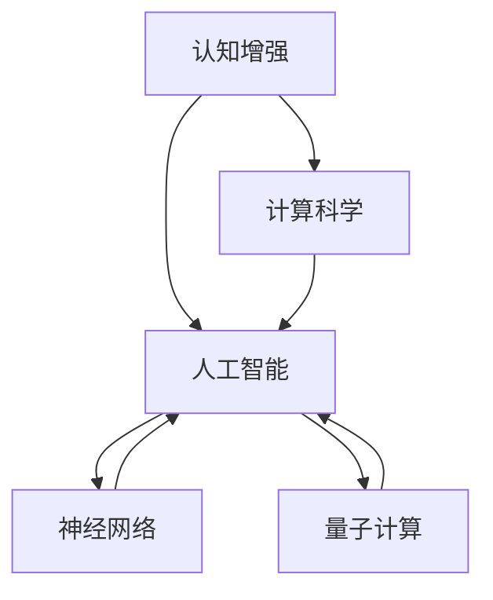

                 

# 拓展认知边界：人类计算的科学探索

> 关键词：认知增强, 计算科学, 人工智能, 人机协同, 算法优化, 神经网络, 人类计算, 量子计算

## 1. 背景介绍

### 1.1 问题由来

随着科学技术的发展，人类对自身认知能力的拓展从未停止。无论是古代的数学运算、语言交流，还是现代的电子计算、网络通信，人类总是在不断挑战新的极限。而作为现代科技的产物，人工智能(AI)正逐渐成为这一征途中的重要伙伴。

人工智能通过模拟人类大脑的工作方式，实现数据的计算、存储、处理和推理。它不仅能执行复杂任务，还能在实际应用中提供更加高效、精准的解决方案。但与此同时，AI也面临着一系列挑战，尤其是对于如何更深入地理解并拓展人类的认知边界，人工智能仍处于探索阶段。

### 1.2 问题核心关键点

本文聚焦于认知增强和人类计算的科学探索，将从以下核心关键点出发，系统探讨人工智能如何帮助我们拓展认知边界，同时也将反思在这一过程中可能面临的挑战与困境。

1. **认知增强与人类计算**：人工智能如何通过模拟人类大脑的计算方式，提升认知能力？
2. **算法优化与神经网络**：如何优化算法和构建高效神经网络以实现更强的计算力？
3. **人机协同与融合**：人工智能与人类的协作方式如何实现最优效果？
4. **量子计算与未来发展**：量子计算将如何影响认知科学的未来？
5. **伦理与安全性**：人工智能在拓展认知边界过程中如何保持伦理和安全？

### 1.3 问题研究意义

探索认知增强和人类计算，对于推动人工智能技术的发展，以及提升人类的认知能力具有重要意义：

1. **提升决策能力**：通过增强认知能力，人类能够更快速、更准确地做出决策，提高工作和生活效率。
2. **促进科学发现**：人工智能在处理大量数据时的高效性，能够帮助科学家发现隐藏在数据中的规律和模式，加速科学研究的进程。
3. **解决复杂问题**：在复杂系统的模拟、预测和优化等方面，人工智能提供了强大的计算能力。
4. **增强教育体验**：通过智能化的教育工具，可以更好地适应个性化的学习需求，提升教育质量。
5. **改善医疗健康**：在医疗诊断、药物研发等方面，人工智能能够提供更准确的辅助支持，提高医疗水平。
6. **推动创新创造**：人工智能在创意设计和艺术创作等领域的深度融合，激发了更多创新和创造力。

## 2. 核心概念与联系

### 2.1 核心概念概述

为了更好地理解认知增强和人类计算的科学探索，本节将介绍几个核心概念：

- **认知增强**：通过技术手段，提升人类的认知能力，包括记忆、思维、感知等各方面的强化。
- **计算科学**：研究如何用计算机模拟和实现人类计算方式，优化算法和数据结构。
- **人工智能**：通过机器学习、深度学习等技术，实现模拟人类智能的计算模型。
- **神经网络**：模拟人脑神经元工作方式的计算模型，广泛应用于模式识别、图像处理等领域。
- **量子计算**：利用量子态叠加和纠缠特性，实现比经典计算机更高的计算效率。

这些核心概念之间的逻辑关系可以通过以下Mermaid流程图来展示：



这个流程图展示了几者之间的逻辑联系：

1. **认知增强**：通过提升人类的认知能力，为计算科学提供更高效、更智能的输入。
2. **计算科学**：研究计算方式，为认知增强提供技术支持。
3. **人工智能**：基于计算科学原理，实现认知增强的具体应用。
4. **神经网络**：作为人工智能的基石，通过模拟人脑神经网络，实现更高效的计算。
5. **量子计算**：作为未来计算的突破点，为认知增强提供更强大的计算能力。

## 3. 核心算法原理 & 具体操作步骤
### 3.1 算法原理概述

认知增强和人类计算的核心算法之一是**神经网络**，它通过模拟人脑神经元之间的连接方式，实现数据的处理和信息的传递。神经网络由多个层次组成，每一层都有大量的神经元，通过前向传播和反向传播实现输入数据的处理和输出结果的生成。

神经网络的训练过程是通过大量的标注数据进行监督学习，不断调整神经元之间的连接权重，使得模型能够更准确地预测未知数据。常见的神经网络包括前馈神经网络、卷积神经网络、循环神经网络等，它们在不同的任务和数据类型中表现出色。

### 3.2 算法步骤详解

基于神经网络的认知增强算法通常包括以下几个关键步骤：

**Step 1: 数据预处理**
- 收集和标注训练数据，确保数据的多样性和完备性。
- 对数据进行归一化、特征提取等预处理，确保模型输入的一致性。

**Step 2: 网络构建与训练**
- 根据任务特点选择合适的神经网络结构，包括层数、神经元个数等。
- 使用深度学习框架如TensorFlow、PyTorch等构建神经网络模型。
- 定义损失函数和优化器，如交叉熵损失、Adam优化器等。
- 对模型进行训练，通过反向传播更新权重，最小化损失函数。

**Step 3: 模型评估与调优**
- 在验证集上评估模型性能，通过精度、召回率等指标判断模型效果。
- 根据评估结果调整模型参数，如调整学习率、增加正则化等。
- 重复训练和评估，直至模型达到预期性能。

**Step 4: 应用部署与优化**
- 将训练好的模型部署到实际应用场景中，如图像识别、语音识别等。
- 针对应用场景进行微调，优化模型性能。
- 采用模型压缩、量化等技术，提升推理效率。

### 3.3 算法优缺点

神经网络在认知增强和人类计算中具有以下优点：
1. 强大的数据处理能力：能够处理高维、非结构化数据，广泛应用于图像、语音、文本等领域。
2. 高效的特征学习：自动提取数据中的重要特征，提高模型泛化能力。
3. 可解释性强：可以通过可视化工具，如梯度图、权重图等，理解模型的内部工作机制。

然而，神经网络也存在一些缺点：
1. 需要大量标注数据：标注数据成本高、耗时长，限制了模型的训练规模。
2. 模型复杂度高：神经网络结构复杂，训练和推理耗时长。
3. 过度拟合风险：如果训练数据不足，模型容易过拟合。

### 3.4 算法应用领域

神经网络在多个领域得到了广泛应用，包括但不限于：

- 计算机视觉：如图像分类、目标检测、人脸识别等。
- 自然语言处理：如机器翻译、情感分析、问答系统等。
- 语音识别：如语音转文本、语音合成等。
- 推荐系统：如电商推荐、音乐推荐、视频推荐等。
- 医疗健康：如疾病诊断、药物研发、健康监测等。

## 4. 数学模型和公式 & 详细讲解 & 举例说明
### 4.1 数学模型构建

本节将使用数学语言对神经网络的构建和训练过程进行更加严格的刻画。

记神经网络为 $M_{\theta}:\mathcal{X} \rightarrow \mathcal{Y}$，其中 $\mathcal{X}$ 为输入空间，$\mathcal{Y}$ 为输出空间，$\theta$ 为神经网络参数。假设训练数据集为 $D=\{(x_i,y_i)\}_{i=1}^N, x_i \in \mathcal{X}, y_i \in \mathcal{Y}$。

定义模型 $M_{\theta}$ 在输入 $x$ 上的输出为 $\hat{y}=M_{\theta}(x)$。神经网络由多层线性变换和激活函数组成，通常可以表示为：

$$
\hat{y} = f \left( g \left( W_2 h_1 + b_2 \right) \right)
$$

其中 $h_1$ 为第一层的输出，$g$ 为激活函数，$W_2$ 和 $b_2$ 分别为第二层的权重和偏置。

### 4.2 公式推导过程

以二分类任务为例，我们推导交叉熵损失函数及其梯度的计算公式。

假设模型 $M_{\theta}$ 在输入 $x$ 上的输出为 $\hat{y}=M_{\theta}(x) \in [0,1]$，表示样本属于正类的概率。真实标签 $y \in \{0,1\}$。则二分类交叉熵损失函数定义为：

$$
\ell(M_{\theta}(x),y) = -[y\log \hat{y} + (1-y)\log (1-\hat{y})]
$$

将其代入经验风险公式，得：

$$
\mathcal{L}(\theta) = -\frac{1}{N}\sum_{i=1}^N [y_i\log M_{\theta}(x_i)+(1-y_i)\log(1-M_{\theta}(x_i))]
$$

根据链式法则，损失函数对参数 $\theta_k$ 的梯度为：

$$
\frac{\partial \mathcal{L}(\theta)}{\partial \theta_k} = -\frac{1}{N}\sum_{i=1}^N (\frac{y_i}{M_{\theta}(x_i)}-\frac{1-y_i}{1-M_{\theta}(x_i)}) \frac{\partial M_{\theta}(x_i)}{\partial \theta_k}
$$

其中 $\frac{\partial M_{\theta}(x_i)}{\partial \theta_k}$ 可进一步递归展开，利用自动微分技术完成计算。

### 4.3 案例分析与讲解

以图像分类任务为例，我们展示如何使用神经网络进行图像识别。

假设输入为一张 $28\times28$ 的灰度图像，记为 $x$，表示为向量形式 $\mathbf{x} \in \mathbb{R}^{784}$。神经网络由多个卷积层和池化层组成，将图像逐步抽象成高维特征向量，最终输出为 $10$ 个类别的概率分布，记为 $\hat{\mathbf{y}} \in \mathbb{R}^{10}$。

在训练过程中，我们采用反向传播算法更新模型参数 $\theta$，最小化损失函数 $\mathcal{L}$。训练流程如图1所示：


在得到损失函数的梯度后，即可带入参数更新公式，完成模型的迭代优化。重复上述过程直至收敛，最终得到适应图像分类任务的模型参数 $\theta^*$。

## 5. 项目实践：代码实例和详细解释说明
### 5.1 开发环境搭建

在进行神经网络微调实践前，我们需要准备好开发环境。以下是使用Python进行TensorFlow开发的环境配置流程：

1. 安装Anaconda：从官网下载并安装Anaconda，用于创建独立的Python环境。

2. 创建并激活虚拟环境：
```bash
conda create -n tf-env python=3.8 
conda activate tf-env
```

3. 安装TensorFlow：根据CUDA版本，从官网获取对应的安装命令。例如：
```bash
pip install tensorflow
```

4. 安装各类工具包：
```bash
pip install numpy pandas scikit-learn matplotlib tqdm jupyter notebook ipython
```

完成上述步骤后，即可在`tf-env`环境中开始微调实践。

### 5.2 源代码详细实现

下面我们以图像分类任务为例，给出使用TensorFlow进行卷积神经网络微调的Python代码实现。

首先，定义图像分类任务的数据处理函数：

```python
import tensorflow as tf
from tensorflow.keras.datasets import mnist
from tensorflow.keras.models import Sequential
from tensorflow.keras.layers import Conv2D, MaxPooling2D, Flatten, Dense

# 加载MNIST数据集
(x_train, y_train), (x_test, y_test) = mnist.load_data()

# 数据预处理
x_train = x_train.reshape((-1, 28, 28, 1)) / 255.0
x_test = x_test.reshape((-1, 28, 28, 1)) / 255.0

# 标签处理
y_train = tf.keras.utils.to_categorical(y_train, 10)
y_test = tf.keras.utils.to_categorical(y_test, 10)

# 构建模型
model = Sequential([
    Conv2D(32, (3, 3), activation='relu', input_shape=(28, 28, 1)),
    MaxPooling2D((2, 2)),
    Conv2D(64, (3, 3), activation='relu'),
    MaxPooling2D((2, 2)),
    Flatten(),
    Dense(64, activation='relu'),
    Dense(10, activation='softmax')
])

# 编译模型
model.compile(optimizer='adam', loss='categorical_crossentropy', metrics=['accuracy'])

# 训练模型
model.fit(x_train, y_train, epochs=10, batch_size=32, validation_data=(x_test, y_test))
```

然后，定义训练和评估函数：

```python
import numpy as np

def train_epoch(model, x, y, batch_size, optimizer):
    model.trainable = True
    for i in range(0, x.shape[0], batch_size):
        x_batch = x[i:i+batch_size]
        y_batch = y[i:i+batch_size]
        with tf.GradientTape() as tape:
            y_pred = model(x_batch)
            loss = tf.reduce_mean(tf.keras.losses.categorical_crossentropy(y_batch, y_pred))
        gradients = tape.gradient(loss, model.trainable_variables)
        optimizer.apply_gradients(zip(gradients, model.trainable_variables))
    return loss

def evaluate(model, x, y, batch_size):
    model.trainable = False
    accuracy = 0
    with tf.GradientTape() as tape:
        for i in range(0, x.shape[0], batch_size):
            x_batch = x[i:i+batch_size]
            y_batch = y[i:i+batch_size]
            y_pred = model(x_batch)
            accuracy += np.sum(np.argmax(y_pred, axis=1) == np.argmax(y_batch, axis=1)) / len(y_batch)
    return accuracy

# 训练模型
model.trainable = True
for i in range(10):
    loss = train_epoch(model, x_train, y_train, 32, tf.keras.optimizers.Adam())
    accuracy = evaluate(model, x_test, y_test, 32)
    print(f"Epoch {i+1}, loss: {loss}, accuracy: {accuracy}")

# 测试模型
model.trainable = False
accuracy = evaluate(model, x_test, y_test, 32)
print(f"Test accuracy: {accuracy}")
```

以上代码展示了从数据预处理到模型训练的完整流程。可以看到，通过TensorFlow，我们只需几行代码便可以实现一个简单的卷积神经网络，并对其进行了微调。

### 5.3 代码解读与分析

让我们再详细解读一下关键代码的实现细节：

**数据预处理函数**：
- 对MNIST数据集进行预处理，将图像数据转换为张量形式，并进行归一化。
- 将标签进行one-hot编码，转换为模型可接受的格式。

**模型构建函数**：
- 构建一个包含两个卷积层和两个池化层的卷积神经网络。
- 在最后添加两个全连接层，输出10个类别的概率分布。

**训练函数**：
- 在训练阶段，将模型设为可训练状态。
- 采用批量梯度下降算法，对模型进行迭代优化。
- 计算损失函数，并使用反向传播更新模型参数。
- 在每个epoch结束后，计算模型在验证集上的准确率。

**评估函数**：
- 在评估阶段，将模型设为不可训练状态。
- 通过计算模型的预测准确率，评估模型的性能。

**训练流程**：
- 在每个epoch内，训练函数对模型进行一次前向传播和反向传播。
- 在每个epoch结束后，评估函数对模型进行一次评估，并输出训练结果。
- 重复上述过程，直至模型收敛。

可以看到，TensorFlow提供了丰富的工具和API，使得神经网络的构建和微调变得简单快捷。开发者只需关注任务逻辑和模型设计，其他细节由框架自动处理。

当然，工业级的系统实现还需考虑更多因素，如模型的保存和部署、超参数的自动搜索、更灵活的任务适配层等。但核心的微调流程基本与此类似。

## 6. 实际应用场景
### 6.1 智能推荐系统

基于神经网络的推荐系统，已经在电商、音乐、视频等多个领域得到了广泛应用。推荐系统通过分析用户的历史行为数据，预测用户对特定物品的兴趣，从而提供个性化的推荐。

在技术实现上，可以收集用户浏览、点击、评分等行为数据，利用神经网络模型学习用户兴趣与物品属性之间的关联关系。通过微调模型，使得模型能够更好地适应新数据，提升推荐精度。

### 6.2 医疗影像诊断

神经网络在医疗影像诊断中也有着广泛应用。通过训练模型，可以自动识别影像中的病变区域，辅助医生进行诊断和治疗。

以放射学为例，通过收集大量的胸片、CT影像及其标注数据，利用卷积神经网络模型对影像进行微调，使得模型能够自动识别肺部结节、肿块等病变区域。医生可以利用这些辅助诊断工具，更快速、更准确地进行疾病诊断。

### 6.3 金融风险评估

金融领域中的风险评估问题，往往需要处理大量的数据和多维度的特征。神经网络可以通过微调，对多维特征进行学习，实现对金融风险的快速评估。

例如，在信用评分模型中，神经网络可以学习到贷款申请人的基本信息、历史还款记录、财务状况等多方面的信息，并进行综合评估。通过微调模型，可以不断适应新的数据，提升风险评估的准确性。

### 6.4 未来应用展望

随着神经网络技术的不断发展，基于认知增强和人类计算的应用场景将更加广泛：

- **自动化驾驶**：通过神经网络对图像、雷达、传感器等数据进行处理，实现车辆的智能驾驶和决策。
- **智能制造**：通过神经网络对生产过程进行监控和优化，提升生产效率和产品质量。
- **智能客服**：通过神经网络对用户对话进行分析和理解，实现智能客服系统的构建。
- **教育辅助**：通过神经网络对学生学习行为进行分析，提供个性化的学习建议和资源推荐。
- **智慧城市**：通过神经网络对城市运行数据进行分析和预测，提升城市管理水平。

## 7. 工具和资源推荐
### 7.1 学习资源推荐

为了帮助开发者系统掌握神经网络微调的理论基础和实践技巧，这里推荐一些优质的学习资源：

1. 《深度学习》（Ian Goodfellow等）：深度学习领域的经典教材，详细介绍了深度学习的基本概念和算法。
2. 《Python深度学习》（Francois Chollet）：TensorFlow的官方教程，提供了丰富的代码示例和实践指导。
3. 《Hands-On Machine Learning with Scikit-Learn and TensorFlow》（Aurélien Géron）：实战教程，通过实例讲解机器学习和深度学习的基础与应用。
4. 《Deep Learning Specialization》（Andrew Ng）：Coursera上的深度学习专项课程，涵盖了深度学习的各个方面。
5. 《TensorFlow 2.0 for Deep Learning》（Daniel Smith）：TensorFlow 2.0的官方文档，提供了详细的API文档和示例代码。

通过对这些资源的学习实践，相信你一定能够快速掌握神经网络微调的精髓，并用于解决实际的认知增强和人类计算问题。

### 7.2 开发工具推荐

高效的开发离不开优秀的工具支持。以下是几款用于神经网络微调开发的常用工具：

1. TensorFlow：由Google主导开发的开源深度学习框架，生产部署方便，适合大规模工程应用。
2. PyTorch：基于Python的开源深度学习框架，灵活动态的计算图，适合快速迭代研究。
3. Keras：高层次的深度学习API，简洁易用，支持TensorFlow和Theano等后端。
4. MXNet：由Apache开发的深度学习框架，支持分布式计算和多种编程语言。
5. JAX：用于加速深度学习的自动微分库，支持TensorFlow、PyTorch等后端，灵活高效。
6. Amazon SageMaker：亚马逊提供的云端机器学习平台，提供了丰富的深度学习工具和算法支持。

合理利用这些工具，可以显著提升神经网络微调的开发效率，加快创新迭代的步伐。

### 7.3 相关论文推荐

神经网络在认知增强和人类计算领域的发展源于学界的持续研究。以下是几篇奠基性的相关论文，推荐阅读：

1. **Deep Learning**（Ian Goodfellow等）：深度学习领域的经典教材，详细介绍了深度学习的基本概念和算法。
2. **ImageNet Classification with Deep Convolutional Neural Networks**（Alex Krizhevsky等）：展示了大规模卷积神经网络在图像分类任务中的卓越表现。
3. **Very Deep Convolutional Networks for Large-Scale Image Recognition**（Karen Simonyan和Andrew Zisserman）：提出更深层次的卷积神经网络结构，进一步提升了图像识别的精度。
4. **Natural Language Processing with Transformers**（Jacques Van Gael等）：介绍Transformer在自然语言处理中的应用，展示了其在多种任务上的优势。
5. **BERT: Pre-training of Deep Bidirectional Transformers for Language Understanding**（Jacob Devlin等）：提出BERT预训练模型，在语言理解任务中取得了新的SOTA。

这些论文代表了大神经网络微调技术的发展脉络。通过学习这些前沿成果，可以帮助研究者把握学科前进方向，激发更多的创新灵感。

## 8. 总结：未来发展趋势与挑战

### 8.1 总结

本文对神经网络在认知增强和人类计算中的应用进行了全面系统的介绍。首先阐述了神经网络的基本原理和构建方法，然后详细讲解了神经网络的微调过程和实际应用。接着，探讨了神经网络在实际应用中可能面临的挑战，并给出了相应的解决方案。最后，展望了神经网络技术在未来发展的趋势和方向。

通过本文的系统梳理，可以看到，神经网络在认知增强和人类计算中具有强大的潜力，能够帮助人类拓展认知边界，提升智能决策能力。然而，在实际应用中，仍需克服数据依赖、模型鲁棒性、效率提升等方面的挑战，才能充分发挥神经网络的优势。

### 8.2 未来发展趋势

展望未来，神经网络在认知增强和人类计算领域将呈现以下几个发展趋势：

1. **模型规模继续扩大**：随着算力成本的下降和数据规模的扩张，神经网络模型的参数量还将持续增长，提供更强的计算能力和更广泛的应用场景。
2. **模型结构更加灵活**：未来的神经网络将更加注重模型的灵活性和可解释性，引入更多的模块化设计和正则化技术。
3. **跨模态融合**：神经网络将实现对多模态数据的融合，如文本、图像、语音等，提供更加全面和准确的信息处理能力。
4. **知识增强**：通过引入外部知识库和规则库，增强神经网络的知识表示和推理能力，提升其在复杂任务中的表现。
5. **计算范式创新**：未来可能出现更多高效的计算范式，如量子计算、边缘计算等，进一步提升神经网络的计算效率和应用范围。

### 8.3 面临的挑战

尽管神经网络在认知增强和人类计算中取得了显著进展，但在实际应用中仍面临许多挑战：

1. **数据依赖**：神经网络的训练需要大量的标注数据，数据的获取和标注成本高、耗时长。如何降低数据依赖，提高模型的泛化能力，仍然是一个难题。
2. **模型鲁棒性**：神经网络面对输入噪声和数据分布变化时，容易出现鲁棒性不足的问题。如何提升模型的鲁棒性和泛化能力，将是未来的研究方向。
3. **计算效率**：尽管神经网络在计算能力上有明显优势，但在实际应用中仍面临计算资源不足的问题。如何优化模型结构和算法，提升计算效率，仍需进一步研究。
4. **可解释性**：神经网络通常被视为"黑盒"系统，难以解释其内部工作机制和决策逻辑。如何提高模型的可解释性，增强用户信任，也是未来的一个重要研究方向。
5. **伦理和安全**：神经网络在处理数据时，可能学习到有偏见、有害的信息，如何确保模型的伦理和安全，避免误导性输出，仍需进一步探索。

### 8.4 研究展望

面对神经网络在认知增强和人类计算中面临的挑战，未来的研究需要在以下几个方面寻求新的突破：

1. **无监督学习**：探索更多的无监督学习算法，降低对标注数据的依赖，提高模型的泛化能力。
2. **模型压缩**：开发更加高效的模型压缩技术，减小模型大小，提升计算效率。
3. **跨领域迁移**：研究跨领域迁移学习技术，增强模型的泛化能力和适应性。
4. **知识融合**：探索将知识图谱、逻辑规则等与神经网络结合，增强模型的知识表示和推理能力。
5. **伦理保障**：在模型训练和应用过程中，引入伦理导向的评估指标，确保模型输出的公正性和安全性。
6. **隐私保护**：探索隐私保护技术，如差分隐私、联邦学习等，确保数据隐私和安全。

这些研究方向的探索，必将引领神经网络技术迈向更高的台阶，为构建安全、可靠、可解释、可控的智能系统铺平道路。面向未来，神经网络技术还需要与其他人工智能技术进行更深入的融合，如知识表示、因果推理、强化学习等，多路径协同发力，共同推动认知增强和人类计算技术的进步。只有勇于创新、敢于突破，才能不断拓展神经网络的边界，让智能技术更好地造福人类社会。

## 9. 附录：常见问题与解答

**Q1：什么是认知增强？**

A: 认知增强是指通过技术手段，提升人类的认知能力，包括记忆、思维、感知等各方面的强化。

**Q2：神经网络的优势是什么？**

A: 神经网络具有强大的数据处理能力，能够处理高维、非结构化数据，广泛应用于图像、语音、文本等领域。同时，神经网络还能够自动提取数据中的重要特征，提高模型泛化能力。

**Q3：神经网络在实际应用中面临哪些挑战？**

A: 神经网络在实际应用中面临的主要挑战包括数据依赖、模型鲁棒性不足、计算效率低、可解释性差、伦理安全等。

**Q4：如何提高神经网络的鲁棒性？**

A: 提高神经网络的鲁棒性可以从数据增强、正则化、对抗训练等方面入手，如通过回译、正则化等方法扩充训练集，使用L2正则、Dropout等正则化技术，引入对抗样本进行训练等。

**Q5：神经网络的未来发展方向是什么？**

A: 未来神经网络的计算能力将继续提升，模型结构将更加灵活，跨模态融合能力将增强，知识增强技术将得到应用，计算范式将创新，伦理保障将得到重视。

---

作者：禅与计算机程序设计艺术 / Zen and the Art of Computer Programming

