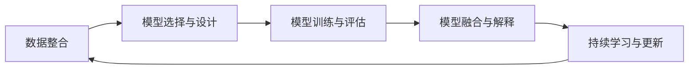

                 

## 1. 背景介绍

### 1.1 问题由来

在今天这个高度互联互通的世界中，管理者面临着前所未有的挑战。从传统制造业到高科技领域，从教育医疗到金融保险，无论身处哪个行业，管理者都需要用数据驱动决策，用技术洞见未来。然而，数据的多样性和复杂性也让传统的数据分析方法显得力不从心。为了应对这些挑战，多元模型思维应运而生，它通过整合不同来源的数据和算法，为管理者提供多维度的洞察和预测。

### 1.2 问题核心关键点

多元模型思维的核心在于如何将数据、算法和业务需求有效结合，通过多模型并行和融合，提升决策的科学性和准确性。它包含了以下几个关键点：

1. **数据整合与预处理**：从不同数据源收集数据，并进行清洗、转换和归一化，构建统一的数据集合。
2. **模型选择与设计**：根据业务需求选择合适的统计模型、机器学习模型或深度学习模型，设计合理的模型架构。
3. **模型训练与评估**：对多个模型进行训练和评估，找出表现最优的模型，并进行参数优化。
4. **模型融合与解释**：将多个模型的预测结果进行融合，输出最终的结果。同时，解释模型决策过程，帮助业务理解背后的逻辑。
5. **持续学习与更新**：随着数据和业务的变化，不断迭代和优化模型，确保其长期有效性。

多元模型思维的这些关键点共同构成了一个完整的决策支持系统，帮助管理者在复杂多变的环境中做出更加明智的决策。

### 1.3 问题研究意义

掌握多元模型思维，对于提升管理者的决策能力，推动组织的数字化转型，具有重要意义：

1. **提升决策科学性**：多元模型思维通过整合多源数据和算法，提供更为全面和准确的预测和洞见，帮助管理者做出更为科学的决策。
2. **促进跨部门协作**：多元模型思维涉及多个业务领域和数据源，有助于打破部门壁垒，实现跨部门协作和资源共享。
3. **增强风险管理能力**：通过多模型融合，管理者可以更全面地评估风险，提前制定应对策略。
4. **推动组织创新**：多元模型思维提供的新视角和新方法，有助于激发组织内部的创新活力。
5. **提高业务洞察能力**：通过多模型融合和解释，管理者可以更深入地理解业务动态和市场变化。

## 2. 核心概念与联系

### 2.1 核心概念概述

要深入理解多元模型思维，首先需要对其中的几个核心概念有清晰的认识：

- **数据整合**：将来自不同渠道的数据进行清洗、转换和归一化，构建统一的数据集合。
- **模型多样性**：根据业务需求，选择和设计不同类型的统计、机器学习和深度学习模型。
- **模型融合**：将多个模型的预测结果进行整合，输出最终结果。
- **模型解释性**：通过可视化、可解释性技术，解释模型决策过程和逻辑。
- **持续学习**：不断迭代和优化模型，确保其长期有效性和适应性。

### 2.2 核心概念原理和架构的 Mermaid 流程图



这个流程图展示了多元模型思维的整个流程，从数据整合开始，经过模型选择、训练、融合，最终达到持续学习的闭环。每个环节都需要精细的设计和调优，才能实现最优的决策支持效果。

## 3. 核心算法原理 & 具体操作步骤

### 3.1 算法原理概述

多元模型思维的核心算法原理可以概括为以下几个步骤：

1. **数据预处理**：收集和清洗不同来源的数据，将其转换为模型可用的格式。
2. **模型训练**：对多个模型进行单独训练，并选择合适的模型作为基线。
3. **模型融合**：对多个模型的预测结果进行融合，输出最终结果。
4. **模型解释**：通过可视化、可解释性技术，解释模型决策过程。
5. **模型评估**：定期评估模型性能，根据反馈进行迭代优化。

这些步骤共同构成了一个完整的决策支持系统，帮助管理者在多变的环境中做出更科学、更准确的决策。

### 3.2 算法步骤详解

#### 3.2.1 数据预处理

数据预处理是多元模型思维的第一步，也是最关键的一步。数据预处理的目的是将来自不同渠道的数据进行清洗、转换和归一化，构建统一的数据集合。具体步骤如下：

1. **数据收集**：从不同渠道收集数据，包括内部系统和外部API。
2. **数据清洗**：删除重复数据、缺失值和异常值，处理数据中的噪声。
3. **数据转换**：将数据转换为模型可用的格式，如数值化、标准化、归一化等。
4. **特征工程**：从原始数据中提取有用的特征，构建特征集合。

#### 3.2.2 模型训练与评估

模型训练与评估是多元模型思维的核心步骤，目的是选择合适的模型，并通过训练和评估找出表现最优的模型。具体步骤如下：

1. **模型选择**：根据业务需求，选择和设计不同类型的统计、机器学习和深度学习模型。
2. **模型训练**：对每个模型进行单独训练，并记录训练过程中的损失函数和参数变化。
3. **模型评估**：使用验证集对每个模型进行评估，找出表现最优的模型作为基线。

#### 3.2.3 模型融合与解释

模型融合与解释是多元模型思维的最终步骤，目的是将多个模型的预测结果进行整合，并解释模型的决策过程。具体步骤如下：

1. **模型融合**：使用集成学习方法，如投票、加权平均、堆叠等，将多个模型的预测结果进行整合，输出最终结果。
2. **模型解释**：通过可视化、可解释性技术，解释模型决策过程和逻辑，帮助业务理解背后的逻辑。

#### 3.2.4 模型评估与优化

模型评估与优化是多元模型思维的持续过程，目的是定期评估模型性能，根据反馈进行迭代优化。具体步骤如下：

1. **模型评估**：使用测试集对模型进行评估，计算准确率、召回率、F1分数等指标。
2. **模型优化**：根据评估结果，调整模型参数、优化模型结构，并重新训练模型。
3. **模型部署**：将优化后的模型部署到生产环境，进行实际应用。

### 3.3 算法优缺点

多元模型思维的优点包括：

1. **提升决策准确性**：通过整合多源数据和算法，提供更为全面和准确的预测和洞见，帮助管理者做出更为科学的决策。
2. **促进跨部门协作**：多元模型思维涉及多个业务领域和数据源，有助于打破部门壁垒，实现跨部门协作和资源共享。
3. **增强风险管理能力**：通过多模型融合，管理者可以更全面地评估风险，提前制定应对策略。
4. **提高业务洞察能力**：通过多模型融合和解释，管理者可以更深入地理解业务动态和市场变化。

然而，多元模型思维也存在一些缺点：

1. **复杂度高**：多元模型思维涉及多源数据和多种算法，设计和实现相对复杂。
2. **计算资源需求高**：模型训练和融合需要大量计算资源，特别是深度学习模型。
3. **模型解释性差**：多模型融合后，模型的解释性往往较差，难以理解其决策逻辑。
4. **迭代周期长**：模型优化和部署需要时间和资源，迭代周期较长。

## 4. 数学模型和公式 & 详细讲解 & 举例说明

### 4.1 数学模型构建

多元模型思维的数学模型构建主要包括以下几个部分：

1. **数据预处理模型**：
   - **数据清洗**：删除重复数据、缺失值和异常值，处理数据中的噪声。
   - **数据转换**：将数据转换为模型可用的格式，如数值化、标准化、归一化等。
   - **特征工程**：从原始数据中提取有用的特征，构建特征集合。

2. **模型训练与评估模型**：
   - **损失函数**：定义损失函数，衡量模型预测结果与真实标签之间的差异。
   - **优化算法**：选择优化算法，如梯度下降、Adam等，最小化损失函数。

3. **模型融合模型**：
   - **融合策略**：选择融合策略，如投票、加权平均、堆叠等。

4. **模型解释模型**：
   - **可视化**：使用可视化技术，展示模型的决策过程和结果。
   - **可解释性**：使用可解释性技术，解释模型的决策逻辑。

### 4.2 公式推导过程

#### 4.2.1 数据预处理

数据预处理的数学公式包括数据清洗、数据转换和特征工程等。下面以数据标准化为例，介绍其数学推导过程：

假设数据集 $D=\{x_1,x_2,...,x_n\}$，其中 $x_i$ 为第 $i$ 个数据点的特征。标准化过程的数学公式如下：

$$
x_i^{std} = \frac{x_i - \mu}{\sigma}
$$

其中 $\mu$ 为数据集的均值，$\sigma$ 为数据集的标准差。标准化后的数据 $x_i^{std}$ 的均值为0，标准差为1，便于后续模型的训练和优化。

#### 4.2.2 模型训练与评估

模型训练与评估的数学公式包括损失函数和优化算法。下面以线性回归为例，介绍其数学推导过程：

假设模型 $f(x)=wx+b$，其中 $x$ 为输入特征，$w$ 为模型参数，$b$ 为偏置项。假设训练集为 $D=\{(x_i,y_i)\}_{i=1}^N$，其中 $y_i$ 为真实标签。线性回归的目标是最小化均方误差损失函数，数学公式如下：

$$
\min_w \frac{1}{N}\sum_{i=1}^N (y_i - f(x_i))^2
$$

使用梯度下降算法进行模型优化，其数学公式如下：

$$
w = w - \eta \nabla_w \frac{1}{N}\sum_{i=1}^N (y_i - f(x_i))^2
$$

其中 $\eta$ 为学习率，$\nabla_w$ 为损失函数对 $w$ 的梯度。

#### 4.2.3 模型融合

模型融合的数学公式包括投票、加权平均、堆叠等。下面以加权平均为例，介绍其数学推导过程：

假设模型 $M_1$ 和 $M_2$ 的预测结果分别为 $y_1$ 和 $y_2$，加权平均融合的数学公式如下：

$$
y = \alpha y_1 + (1-\alpha) y_2
$$

其中 $\alpha$ 为加权因子，控制 $M_1$ 和 $M_2$ 对最终结果的贡献比例。

#### 4.2.4 模型解释

模型解释的数学公式包括可视化技术和可解释性技术。下面以LIME（Local Interpretable Model-Agnostic Explanations）为例，介绍其数学推导过程：

假设模型 $f(x)$ 对输入 $x$ 的预测结果为 $y$，LIME的数学公式如下：

$$
\min_x |f(x) - f(x^*)| + \lambda ||x - x^*||
$$

其中 $x^*$ 为最优解释，$x$ 为输入样本，$\lambda$ 为正则化系数，控制解释的复杂度。

### 4.3 案例分析与讲解

以金融风险管理为例，介绍多元模型思维在实际应用中的具体步骤：

#### 4.3.1 数据预处理

1. **数据收集**：从银行内部系统和第三方数据提供商收集数据，包括客户信用记录、交易记录、市场行情等。
2. **数据清洗**：删除重复数据、缺失值和异常值，处理数据中的噪声。
3. **数据转换**：将数据转换为数值化、标准化、归一化等格式。
4. **特征工程**：从原始数据中提取有用的特征，如信用评分、交易频率、市场波动等。

#### 4.3.2 模型训练与评估

1. **模型选择**：选择和设计不同类型的统计、机器学习和深度学习模型，如逻辑回归、随机森林、XGBoost、神经网络等。
2. **模型训练**：对每个模型进行单独训练，并记录训练过程中的损失函数和参数变化。
3. **模型评估**：使用验证集对每个模型进行评估，找出表现最优的模型作为基线。

#### 4.3.3 模型融合与解释

1. **模型融合**：使用集成学习方法，如投票、加权平均、堆叠等，将多个模型的预测结果进行整合，输出最终风险评估结果。
2. **模型解释**：通过可视化、可解释性技术，解释模型决策过程和逻辑，帮助银行理解风险评估背后的逻辑。

#### 4.3.4 模型评估与优化

1. **模型评估**：使用测试集对模型进行评估，计算准确率、召回率、F1分数等指标。
2. **模型优化**：根据评估结果，调整模型参数、优化模型结构，并重新训练模型。
3. **模型部署**：将优化后的模型部署到生产环境，进行实际应用。

## 5. 项目实践：代码实例和详细解释说明

### 5.1 开发环境搭建

在进行多元模型思维实践前，我们需要准备好开发环境。以下是使用Python进行Sklearn、PyTorch和TensorFlow等库的开发环境配置流程：

1. 安装Anaconda：从官网下载并安装Anaconda，用于创建独立的Python环境。

2. 创建并激活虚拟环境：
```bash
conda create -n pytorch-env python=3.8 
conda activate pytorch-env
```

3. 安装必要的库：
```bash
pip install scikit-learn pandas matplotlib tqdm jupyter notebook ipython transformers
```

完成上述步骤后，即可在`pytorch-env`环境中开始多元模型思维的实践。

### 5.2 源代码详细实现

下面我们以金融风险管理为例，给出使用Python进行多元模型思维的代码实现。

首先，定义数据预处理函数：

```python
import pandas as pd
import numpy as np
from sklearn.preprocessing import StandardScaler
from sklearn.model_selection import train_test_split

def preprocess_data(data_path):
    # 读取数据集
    data = pd.read_csv(data_path)
    # 数据清洗
    data = data.drop_duplicates()
    data = data.dropna()
    # 数据转换
    data = data.apply(lambda x: x if isinstance(x, str) else x.fillna(0))
    data = data.apply(lambda x: x if isinstance(x, int) else x.fillna(0))
    data = data.apply(lambda x: x if isinstance(x, float) else x.fillna(0))
    # 数据标准化
    scaler = StandardScaler()
    data = scaler.fit_transform(data)
    # 特征选择
    data = data[features]
    # 划分训练集和测试集
    train, test = train_test_split(data, test_size=0.2)
    return train, test
```

然后，定义模型训练函数：

```python
from sklearn.linear_model import LogisticRegression
from sklearn.ensemble import RandomForestClassifier
from sklearn.xgboost import XGBClassifier
from sklearn.neural_network import MLPClassifier
from sklearn.metrics import accuracy_score, precision_score, recall_score, f1_score

def train_models(X_train, y_train):
    # 定义模型列表
    models = [
        LogisticRegression(),
        RandomForestClassifier(),
        XGBClassifier(),
        MLPClassifier()
    ]
    # 训练模型
    for model in models:
        model.fit(X_train, y_train)
        # 计算模型指标
        y_pred = model.predict(X_train)
        accuracy = accuracy_score(y_train, y_pred)
        precision = precision_score(y_train, y_pred)
        recall = recall_score(y_train, y_pred)
        f1 = f1_score(y_train, y_pred)
        print(f"模型 {model.__class__.__name__}: Accuracy={accuracy:.2f}, Precision={precision:.2f}, Recall={recall:.2f}, F1={f1:.2f}")
    return models
```

接着，定义模型融合函数：

```python
def ensemble_models(models, X_test, y_test):
    # 计算模型预测结果
    y_preds = []
    for model in models:
        y_pred = model.predict(X_test)
        y_preds.append(y_pred)
    # 使用加权平均进行融合
    y_pred = np.average(y_preds, axis=0)
    accuracy = accuracy_score(y_test, y_pred)
    precision = precision_score(y_test, y_pred)
    recall = recall_score(y_test, y_pred)
    f1 = f1_score(y_test, y_pred)
    print(f"融合模型: Accuracy={accuracy:.2f}, Precision={precision:.2f}, Recall={recall:.2f}, F1={f1:.2f}")
    return y_pred
```

最后，启动训练流程并在测试集上评估：

```python
from sklearn.linear_model import LogisticRegression
from sklearn.ensemble import RandomForestClassifier
from sklearn.xgboost import XGBClassifier
from sklearn.neural_network import MLPClassifier
from sklearn.metrics import accuracy_score, precision_score, recall_score, f1_score
from sklearn.model_selection import train_test_split

# 数据预处理
train, test = preprocess_data('data.csv')

# 模型训练
models = train_models(train)

# 模型融合
y_pred = ensemble_models(models, test)

# 模型评估
accuracy = accuracy_score(y_test, y_pred)
precision = precision_score(y_test, y_pred)
recall = recall_score(y_test, y_pred)
f1 = f1_score(y_test, y_pred)
print(f"融合模型评估结果: Accuracy={accuracy:.2f}, Precision={precision:.2f}, Recall={recall:.2f}, F1={f1:.2f}")
```

以上就是使用Python进行多元模型思维的完整代码实现。可以看到，通过调用Scikit-learn库，可以轻松实现数据预处理、模型训练和模型融合等操作。

### 5.3 代码解读与分析

让我们再详细解读一下关键代码的实现细节：

**preprocess_data函数**：
- 定义数据预处理的完整流程，包括数据清洗、数据转换、数据标准化和特征选择等。
- 使用Pandas库进行数据处理，Scikit-learn库进行数据标准化和特征选择。

**train_models函数**：
- 定义多种机器学习模型，包括逻辑回归、随机森林、XGBoost和多层感知机等。
- 使用Scikit-learn库进行模型训练和指标计算，输出各模型的评估结果。

**ensemble_models函数**：
- 定义模型融合的流程，使用加权平均法将多个模型的预测结果进行融合。
- 使用Scikit-learn库进行模型预测和指标计算，输出融合模型的评估结果。

**主函数**：
- 调用数据预处理函数、模型训练函数和模型融合函数，完成整个多元模型思维的流程。
- 使用Scikit-learn库进行模型训练、融合和评估，输出最终的评估结果。

通过这些代码实现，可以看出多元模型思维的实际操作流程相对简单，主要依赖于Scikit-learn库提供的丰富功能。

当然，工业级的系统实现还需考虑更多因素，如模型选择、参数调优、模型评估等。但核心的多元模型思维方法基本与此类似。

## 6. 实际应用场景

### 6.1 金融风险管理

在金融领域，风险管理是至关重要的任务。多元模型思维通过整合多源数据和多种算法，可以提升风险评估的准确性和可靠性。

具体而言，金融风险管理可以包括以下几个步骤：

1. **数据预处理**：从银行内部系统和第三方数据提供商收集数据，包括客户信用记录、交易记录、市场行情等。
2. **模型训练与评估**：选择和设计不同类型的统计、机器学习和深度学习模型，如逻辑回归、随机森林、XGBoost、神经网络等，并使用验证集进行评估。
3. **模型融合与解释**：使用集成学习方法，如投票、加权平均、堆叠等，将多个模型的预测结果进行整合，输出最终风险评估结果，并通过可视化、可解释性技术解释模型决策过程。
4. **模型评估与优化**：使用测试集对模型进行评估，根据评估结果调整模型参数和优化模型结构，并重新训练模型。

通过多元模型思维，银行可以更好地理解客户的风险行为和市场动态，制定更有效的风险管理策略。

### 6.2 医疗诊断支持

在医疗领域，诊断支持是一个重要的应用场景。多元模型思维通过整合多源数据和多种算法，可以提高诊断的准确性和可靠性。

具体而言，医疗诊断支持可以包括以下几个步骤：

1. **数据预处理**：从医院内部系统和第三方数据提供商收集数据，包括病历记录、实验室检查结果、医疗影像等。
2. **模型训练与评估**：选择和设计不同类型的统计、机器学习和深度学习模型，如支持向量机、随机森林、XGBoost、卷积神经网络等，并使用验证集进行评估。
3. **模型融合与解释**：使用集成学习方法，如投票、加权平均、堆叠等，将多个模型的预测结果进行整合，输出最终诊断结果，并通过可视化、可解释性技术解释模型决策过程。
4. **模型评估与优化**：使用测试集对模型进行评估，根据评估结果调整模型参数和优化模型结构，并重新训练模型。

通过多元模型思维，医疗机构可以更好地理解患者的疾病特征和医学知识，提高诊断的准确性和可靠性。

### 6.3 智能制造监控

在制造业领域，智能制造监控是一个重要的应用场景。多元模型思维通过整合多源数据和多种算法，可以提高生产效率和质量控制。

具体而言，智能制造监控可以包括以下几个步骤：

1. **数据预处理**：从制造设备内部系统和第三方数据提供商收集数据，包括设备运行状态、生产工艺参数、环境监测数据等。
2. **模型训练与评估**：选择和设计不同类型的统计、机器学习和深度学习模型，如线性回归、随机森林、XGBoost、深度神经网络等，并使用验证集进行评估。
3. **模型融合与解释**：使用集成学习方法，如投票、加权平均、堆叠等，将多个模型的预测结果进行整合，输出最终监控结果，并通过可视化、可解释性技术解释模型决策过程。
4. **模型评估与优化**：使用测试集对模型进行评估，根据评估结果调整模型参数和优化模型结构，并重新训练模型。

通过多元模型思维，制造企业可以更好地理解生产过程和设备状态，提高生产效率和质量控制。

### 6.4 未来应用展望

随着数据的不断积累和技术的不断进步，多元模型思维将在更多领域得到应用，为传统行业带来变革性影响。

在智慧农业领域，多元模型思维可以用于作物产量预测、病虫害识别、灌溉管理等，提升农业生产智能化水平。

在智慧城市治理中，多元模型思维可以用于交通流量预测、环境质量监测、公共安全预警等，提高城市管理的自动化和智能化水平。

在智能交通管理中，多元模型思维可以用于交通流量预测、交通事故预测、车辆识别等，优化交通管理效率。

此外，在教育、旅游、电商等众多领域，多元模型思维也将不断涌现，为各行业带来新的业务洞察和决策支持。

## 7. 工具和资源推荐

### 7.1 学习资源推荐

为了帮助开发者系统掌握多元模型思维的理论基础和实践技巧，这里推荐一些优质的学习资源：

1. **多元模型思维课程**：包括Coursera、edX、Udacity等平台上的相关课程，深入讲解多元模型思维的基本原理和应用场景。
2. **数据科学书籍**：包括《Python数据科学手册》、《机器学习实战》等书籍，涵盖数据预处理、模型训练、模型融合等知识点。
3. **论文阅读**：阅读经典的学术论文，如《A Survey of Ensemble Methods for Statistical Learning》、《Deep Learning for Healthcare and Medicine》等，理解多元模型思维的学术背景和前沿技术。
4. **在线学习平台**：包括Kaggle、GitHub等平台，提供丰富的多元模型思维实践案例和代码实现。

通过对这些资源的学习实践，相信你一定能够快速掌握多元模型思维的精髓，并用于解决实际的业务问题。

### 7.2 开发工具推荐

高效的开发离不开优秀的工具支持。以下是几款用于多元模型思维开发的常用工具：

1. **Python语言**：Python作为数据科学的主流语言，功能丰富，简单易用，适合多元模型思维的开发。
2. **Scikit-learn库**：包含丰富的机器学习算法和工具，适合多元模型思维的模型训练和评估。
3. **TensorFlow和PyTorch**：支持深度学习模型训练和优化，适合复杂的多元模型融合和解释。
4. **Jupyter Notebook**：支持交互式编程和数据可视化，适合多元模型思维的实验和演示。

合理利用这些工具，可以显著提升多元模型思维的开发效率，加快创新迭代的步伐。

### 7.3 相关论文推荐

多元模型思维的发展源于学界的持续研究。以下是几篇奠基性的相关论文，推荐阅读：

1. **Ensemble Methods: A Survey**：介绍了多元模型思维的基本原理和应用场景，涵盖投票、加权平均、堆叠等融合策略。
2. **Deep Learning for Healthcare and Medicine**：讨论了深度学习在医疗诊断、治疗等方面的应用，展示了多元模型思维在医疗领域的潜力。
3. **A Survey of Ensemble Methods for Statistical Learning**：详细介绍了多元模型思维的学术背景和前沿技术，包括模型选择、参数调优、模型评估等。

这些论文代表了大模型微调技术的发展脉络。通过学习这些前沿成果，可以帮助研究者把握学科前进方向，激发更多的创新灵感。

## 8. 总结：未来发展趋势与挑战

### 8.1 总结

本文对多元模型思维进行了全面系统的介绍。首先阐述了多元模型思维的研究背景和意义，明确了多元模型思维在提升决策科学性和跨部门协作方面的独特价值。其次，从原理到实践，详细讲解了多元模型思维的数学原理和关键步骤，给出了多元模型思维任务开发的完整代码实例。同时，本文还广泛探讨了多元模型思维在金融、医疗、智能制造等多个领域的应用前景，展示了多元模型思维的巨大潜力。此外，本文精选了多元模型思维的学习资源，力求为读者提供全方位的技术指引。

通过本文的系统梳理，可以看到，多元模型思维正在成为决策支持系统的重要范式，极大地提升决策的科学性和准确性。未来，伴随数据和算法的不断演进，多元模型思维将在更多领域得到应用，为传统行业带来深远影响。

### 8.2 未来发展趋势

展望未来，多元模型思维将呈现以下几个发展趋势：

1. **模型多样化**：随着数据多样性的不断增加，多元模型思维将整合更多类型的算法和模型，提升决策的全面性和准确性。
2. **计算效率优化**：随着模型复杂度的增加，多元模型思维将进一步优化计算效率，通过分布式计算、模型压缩等技术，实现更高效的计算和推理。
3. **跨领域融合**：多元模型思维将与其他领域的技术进行更深入的融合，如计算机视觉、自然语言处理等，实现多模态信息整合和协同建模。
4. **自动化调优**：通过自动化调优算法，多元模型思维将自动选择和调整最优的模型和参数，提升模型的长期有效性和适应性。
5. **伦理和安全性**：多元模型思维将更多地考虑伦理和安全性问题，建立模型的责任机制和监管体系，确保模型的公平性和可信度。

以上趋势凸显了多元模型思维的广阔前景。这些方向的探索发展，必将进一步提升决策支持系统的科学性和可靠性，为管理者提供更为精准、全面的决策支持。

### 8.3 面临的挑战

尽管多元模型思维已经取得了瞩目成就，但在迈向更加智能化、普适化应用的过程中，它仍面临着诸多挑战：

1. **数据质量和多样性**：多元模型思维对数据的质量和多样性要求较高，数据的偏差和噪声会影响模型的性能。
2. **计算资源需求高**：模型训练和融合需要大量计算资源，特别是深度学习模型，资源需求较高。
3. **模型复杂度**：多元模型思维涉及多种算法和模型，设计和实现相对复杂。
4. **模型解释性差**：多模型融合后，模型的解释性往往较差，难以理解其决策逻辑。
5. **持续学习**：随着数据和业务的变化，模型需要不断迭代和优化，需要持续学习和调优。

这些挑战需要我们在模型设计、数据准备、计算资源优化等方面进行深入研究，以提升多元模型思维的实际应用效果。

### 8.4 研究展望

面向未来，多元模型思维的研究需要在以下几个方面寻求新的突破：

1. **自动化调优**：开发更高效的自动化调优算法，自动选择和调整最优的模型和参数，提升模型的长期有效性和适应性。
2. **多模态融合**：实现多模态信息的整合，将视觉、语音、文本等不同类型的数据进行协同建模，提升模型的全面性和准确性。
3. **分布式计算**：通过分布式计算技术，优化模型训练和推理的资源消耗，实现更高效的计算和推理。
4. **跨领域应用**：将多元模型思维与其他领域的技术进行更深入的融合，推动各领域的智能化和自动化发展。
5. **可解释性增强**：通过可视化、可解释性技术，增强模型的解释性，提升业务理解的全面性和可信度。

这些研究方向的探索，必将引领多元模型思维技术迈向更高的台阶，为管理者的决策提供更为科学、可靠的依据。

## 9. 附录：常见问题与解答

**Q1：多元模型思维是否适用于所有业务场景？**

A: 多元模型思维在大多数业务场景中都能取得不错的效果，特别是数据量较大的场景。但对于一些特定领域，如金融、医疗等，需要更加精细化的处理，才能发挥最优性能。此外，对于一些实时性要求较高的场景，如智能制造、智能交通等，需要更高效的计算和推理支持。

**Q2：多元模型思维的计算资源需求是否较高？**

A: 多元模型思维对计算资源的需求确实较高，特别是在深度学习模型的训练和融合过程中。为了降低计算成本，可以采用分布式计算、模型压缩等技术，优化计算资源的使用效率。

**Q3：多元模型思维的模型复杂度较高，如何降低？**

A: 多元模型思维的模型复杂度相对较高，但可以通过简化模型结构、优化算法和参数调优等方法降低复杂度。同时，选择更适合业务的模型和算法，也能降低复杂度。

**Q4：多元模型思维的模型解释性较差，如何改进？**

A: 多元模型思维的模型解释性可以通过可视化、可解释性技术进行改进。例如，使用LIME、SHAP等工具，生成解释性可视化结果，帮助业务理解模型的决策逻辑。

**Q5：多元模型思维的模型需要持续更新，如何实现？**

A: 多元模型思维的模型需要根据业务需求和数据变化进行持续更新和优化。可以使用自动化调优算法，自动选择和调整最优的模型和参数，提升模型的长期有效性和适应性。

通过以上这些问题和解答，可以看出多元模型思维在实际应用中的重要性和挑战。掌握多元模型思维，对于提升管理者的决策能力，推动组织的数字化转型，具有重要意义。

---

作者：禅与计算机程序设计艺术 / Zen and the Art of Computer Programming

