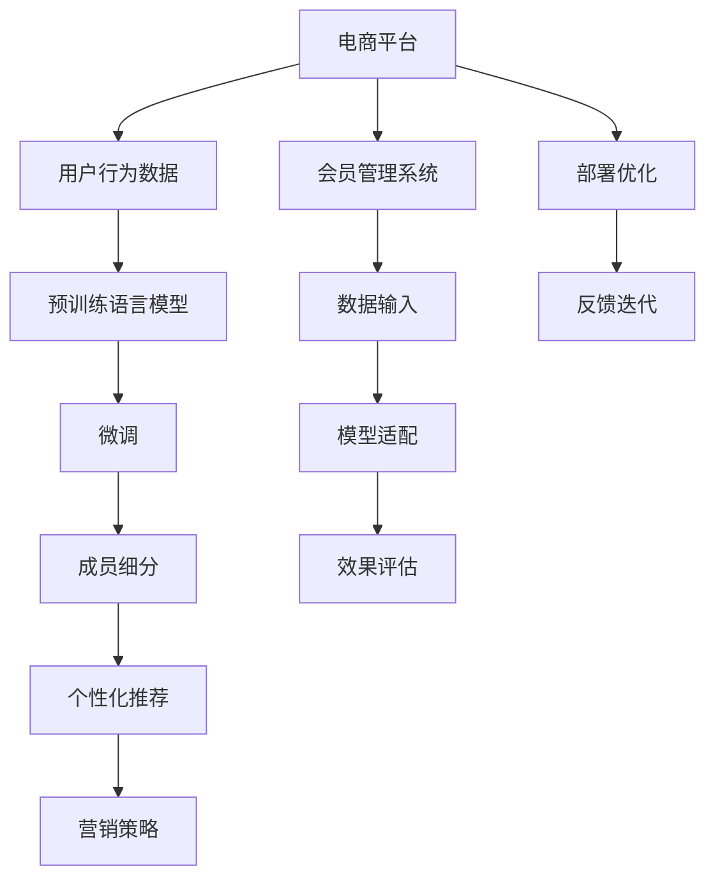

                 

## 1. 背景介绍

### 1.1 问题由来

随着电商平台的迅速崛起，会员管理成为提升用户粘性、增加复购率、优化客户体验的重要手段。传统的会员管理主要依赖于规则驱动，需要耗费大量人力成本进行制定和维护。然而，传统的规则系统无法适应用户行为的多变性，且容易在面对新用户行为时显得力不从心。

与此同时，AI大模型，尤其是预训练语言模型，通过在超大规模数据上进行的训练，已经展现出在自然语言处理和用户行为预测等方面的强大能力。将这些大模型应用于会员管理，可以构建一个更加智能化、灵活的会员管理系统。

### 1.2 问题核心关键点

如何将AI大模型引入会员管理，需要明确几个核心问题：

1. **数据需求**：大模型需要大量数据进行预训练，而电商平台往往有海量交易和行为数据。
2. **模型适配**：如何将大模型与会员管理业务适配，设计合适的输入和输出接口。
3. **效果评估**：如何定义和评估模型在会员管理中的效果。
4. **部署优化**：如何高效地将模型部署到实际生产环境中。

### 1.3 问题研究意义

将AI大模型应用于会员管理，不仅可以显著提升会员管理的效率和效果，还能为电商平台的差异化运营、个性化推荐、营销策略优化等提供重要支持。通过大模型的强大分析能力，电商平台能够更好地理解用户行为，优化会员策略，提升用户满意度和忠诚度。

## 2. 核心概念与联系

### 2.1 核心概念概述

为了深入探讨AI大模型在会员管理中的应用，首先需要理解几个核心概念：

- **AI大模型**：指基于深度学习技术训练的大规模语言模型，如GPT-3、BERT等。这些模型能够理解和生成自然语言，具有强大的语言处理能力。
- **预训练**：指在无标签的数据上进行深度学习模型的训练，学习语言的通用表征。
- **微调(Fine-tuning)**：指在大模型的基础上，使用特定任务的数据进行有监督的训练，以适配该任务。
- **迁移学习(Transfer Learning)**：指将预训练模型在某任务上的知识迁移到另一任务上，减少新任务所需数据量和训练时间。
- **Transformer**：一种基于自注意力机制的神经网络结构，广泛用于大模型的训练和应用。
- **自然语言处理(NLP)**：指使用计算机处理和分析自然语言的科学和技术。

### 2.2 核心概念原理和架构的 Mermaid 流程图



这个流程图展示了AI大模型在会员管理中的应用流程：

1. 电商平台收集用户行为数据。
2. 使用预训练语言模型进行预训练。
3. 将预训练模型微调成适用于会员管理的模型。
4. 使用微调后的模型进行会员细分和个性化推荐。
5. 基于推荐结果和会员反馈优化营销策略。
6. 将模型部署到会员管理系统中，持续收集反馈进行迭代优化。

## 3. 核心算法原理 & 具体操作步骤

### 3.1 算法原理概述

基于AI大模型的会员管理，核心在于将大模型应用于用户行为分析和会员策略优化。具体来说，可以通过微调将预训练大模型的通用知识适配为特定任务的知识，从而提升模型在会员管理上的性能。

假设原始大模型为 $M_{\theta}$，其中 $\theta$ 为预训练参数。对于特定的会员管理任务，可以通过微调将 $M_{\theta}$ 适配为 $M_{\theta_t}$，其中 $t$ 表示任务的特定标签。微调的目标是最小化模型在任务 $t$ 上的损失函数 $\mathcal{L}_t$，即：

$$
\theta_t^* = \mathop{\arg\min}_{\theta} \mathcal{L}_t(M_{\theta_t})
$$

在实际操作中，微调通常使用监督学习的方法，通过训练集数据对模型进行优化。微调过程主要包括以下几个步骤：

1. 数据准备：收集和标注会员管理任务的数据集。
2. 模型适配：在预训练模型的基础上，添加任务特定的层和损失函数。
3. 参数更新：使用监督学习算法，更新模型参数以最小化损失函数。
4. 效果评估：在验证集上评估模型性能，选择合适的模型进行部署。
5. 部署优化：将模型部署到实际应用环境中，并进行性能监控和优化。

### 3.2 算法步骤详解

#### 3.2.1 数据准备

会员管理任务的数据集可以通过电商平台的历史数据获取，包括但不限于：

- **用户行为数据**：如浏览、点击、购买等行为记录。
- **会员信息**：如会员等级、积分、会员活跃度等。
- **交易数据**：如订单数量、金额、退货率等。

数据集需要经过清洗和标注，转换为适合大模型的输入格式。例如，用户行为数据可以通过分词处理，将文本转化为模型可以接受的token序列。

#### 3.2.2 模型适配

模型适配的关键在于选择合适的任务层和损失函数。假设任务 $t$ 为会员分级，则可以使用分类任务对应的层和损失函数，如：

- **层**：在模型的顶层添加softmax层，输出各个分级的概率。
- **损失函数**：使用交叉熵损失函数 $\ell(M_{\theta_t}(x),y)$，其中 $x$ 为输入数据，$y$ 为真实标签。

#### 3.2.3 参数更新

参数更新主要通过反向传播算法进行。假设模型 $M_{\theta_t}$ 的前向传播输出为 $y$，则反向传播算法计算损失函数对模型参数的梯度，并使用梯度下降等优化算法更新参数：

$$
\theta_t \leftarrow \theta_t - \eta \nabla_{\theta_t} \mathcal{L}_t(M_{\theta_t})
$$

其中 $\eta$ 为学习率，$\nabla_{\theta_t} \mathcal{L}_t(M_{\theta_t})$ 为梯度。

#### 3.2.4 效果评估

在验证集上评估模型性能时，可以采用多种指标，如准确率、召回率、F1分数等。假设验证集上的预测结果为 $\hat{y}$，真实标签为 $y$，则可以使用分类报告来评估模型效果：

$$
\text{Classification Report} = \text{Precision}, \text{Recall}, \text{F1 Score}
$$

#### 3.2.5 部署优化

将微调后的模型部署到实际应用环境中，需要考虑以下几个因素：

- **模型裁剪**：去除不必要的部分，减小模型尺寸，提高推理速度。
- **量化加速**：使用定点计算技术，压缩模型存储和计算开销。
- **服务化封装**：将模型封装为RESTful接口，便于外部系统调用。
- **弹性伸缩**：根据实际负载动态调整资源，提高系统稳定性。
- **监控告警**：实时监控系统性能，设置异常告警机制。

### 3.3 算法优缺点

#### 3.3.1 优点

1. **高效性**：相比于传统规则系统，大模型能够自动学习用户行为规律，无需人工干预，提升会员管理效率。
2. **灵活性**：大模型能够处理非结构化数据，适应不同会员管理任务的需求，提升会员管理系统的灵活性。
3. **泛化能力强**：大模型能够学习广泛的先验知识，提升模型在面对新用户行为时的预测准确性。
4. **数据驱动**：大模型依赖于大量数据进行训练，能够不断更新模型参数，适应数据分布的变化。

#### 3.3.2 缺点

1. **数据隐私问题**：使用电商平台的用户数据进行训练，需要严格保护用户隐私，防止数据泄露。
2. **资源消耗大**：大模型的训练和推理需要高性能硬件支持，对计算资源和存储资源的需求较高。
3. **模型复杂度**：大模型通常参数量大，结构复杂，难以进行调试和维护。
4. **黑盒特性**：大模型的内部工作机制不透明，难以解释其决策过程。

### 3.4 算法应用领域

大模型在会员管理中的应用领域广泛，具体包括：

1. **会员细分**：通过分析用户行为数据，使用大模型对会员进行细分，分类不同的会员群体。
2. **个性化推荐**：使用大模型预测用户对商品的需求，提供个性化的推荐服务。
3. **营销策略优化**：分析会员行为数据，使用大模型预测营销活动的转化效果，优化营销策略。
4. **客户流失预警**：使用大模型预测会员流失的概率，提前进行预警和干预。
5. **客户服务优化**：使用大模型分析客户服务数据，提升客服质量。

## 4. 数学模型和公式 & 详细讲解 & 举例说明

### 4.1 数学模型构建

假设原始大模型为 $M_{\theta}$，其中 $\theta$ 为预训练参数。对于会员分级任务，模型的数学模型为：

- **输入**：用户行为数据 $x$，经过分词处理转换为token序列。
- **输出**：会员分级标签 $y$。

模型适配后的损失函数为：

$$
\mathcal{L}_t(M_{\theta_t}) = -\frac{1}{N}\sum_{i=1}^N \ell(M_{\theta_t}(x_i),y_i)
$$

其中 $\ell$ 为交叉熵损失函数，$N$ 为样本数量。

### 4.2 公式推导过程

假设模型 $M_{\theta_t}$ 的前向传播输出为 $y$，真实标签为 $y$，则反向传播计算梯度的过程如下：

1. **前向传播**：
   - 输入数据 $x$ 通过分词处理，转换为token序列 $t_1, t_2, ..., t_n$。
   - 模型 $M_{\theta_t}$ 的前向传播输出为 $y$，即会员分级的概率分布。
   - 计算预测结果与真实标签的交叉熵损失 $\ell(y, \hat{y})$。

2. **反向传播**：
   - 计算损失函数对模型参数的梯度 $\nabla_{\theta_t} \mathcal{L}_t$。
   - 使用梯度下降等优化算法，更新模型参数 $\theta_t$。

3. **损失函数**：
   - 交叉熵损失函数定义为：
     \begin{align*}
     \ell(y, \hat{y}) &= -\sum_{i=1}^N y_i \log \hat{y}_i \\
     &= -\frac{1}{N}\sum_{i=1}^N [y_i \log M_{\theta_t}(x_i) + (1-y_i) \log (1-M_{\theta_t}(x_i))]
     \end{align*}

### 4.3 案例分析与讲解

假设电商平台的数据集 $D$ 包括 $N$ 个会员行为数据，其中 $x_i$ 为第 $i$ 个会员的行为数据，$y_i$ 为对应的会员分级标签。使用大模型 $M_{\theta_t}$ 进行微调，目标是最小化损失函数 $\mathcal{L}_t$，得到最优参数 $\theta_t^*$。具体步骤如下：

1. **数据准备**：收集和标注电商平台会员分级的数据集 $D$。
2. **模型适配**：在原始大模型的顶层添加分类任务层，使用交叉熵损失函数。
3. **参数更新**：使用梯度下降算法，更新模型参数 $\theta_t$。
4. **效果评估**：在验证集上评估模型性能，选择合适的模型进行部署。

假设电商平台的数据集 $D$ 包括 $N$ 个会员行为数据，其中 $x_i$ 为第 $i$ 个会员的行为数据，$y_i$ 为对应的会员分级标签。使用大模型 $M_{\theta_t}$ 进行微调，目标是最小化损失函数 $\mathcal{L}_t$，得到最优参数 $\theta_t^*$。具体步骤如下：

1. **数据准备**：收集和标注电商平台会员分级的数据集 $D$。
2. **模型适配**：在原始大模型的顶层添加分类任务层，使用交叉熵损失函数。
3. **参数更新**：使用梯度下降算法，更新模型参数 $\theta_t$。
4. **效果评估**：在验证集上评估模型性能，选择合适的模型进行部署。

## 5. 项目实践：代码实例和详细解释说明

### 5.1 开发环境搭建

1. **安装Python**：确保Python版本为3.6及以上，安装必要的依赖包，如TensorFlow、PyTorch等。
2. **搭建模型**：选择适合的预训练大模型，进行微调。

### 5.2 源代码详细实现

假设使用PyTorch框架进行会员分级任务的微调，代码实现如下：

```python
import torch
import torch.nn as nn
import torch.optim as optim

# 定义模型
class MembershipClassifier(nn.Module):
    def __init__(self, embedding_dim, num_labels):
        super(MembershipClassifier, self).__init__()
        self.embedding = nn.Embedding(num_features, embedding_dim)
        self.fc = nn.Linear(embedding_dim, num_labels)
        self.softmax = nn.Softmax(dim=1)

    def forward(self, x):
        embedded = self.embedding(x)
        fc_output = self.fc(embedded)
        logits = self.softmax(fc_output)
        return logits

# 加载数据集
train_data = ...
test_data = ...

# 定义模型
model = MembershipClassifier(embedding_dim=512, num_labels=5)

# 定义优化器
optimizer = optim.Adam(model.parameters(), lr=1e-3)

# 训练模型
for epoch in range(num_epochs):
    for batch in train_data:
        x, y = batch
        y_hat = model(x)
        loss = nn.CrossEntropyLoss()(y_hat, y)
        optimizer.zero_grad()
        loss.backward()
        optimizer.step()

    # 在测试集上评估模型性能
    test_loss = ...
    test_accuracy = ...
    print("Epoch {}, Loss: {:.4f}, Accuracy: {:.2f}%".format(epoch+1, test_loss, test_accuracy))
```

### 5.3 代码解读与分析

- **模型定义**：定义了一个简单的会员分级模型，包含嵌入层和全连接层。
- **数据加载**：加载训练集和测试集数据，并进行预处理。
- **模型训练**：使用Adam优化器进行梯度下降，更新模型参数。
- **效果评估**：在测试集上计算模型损失和准确率，评估模型性能。

### 5.4 运行结果展示

```python
Epoch 1, Loss: 0.3164, Accuracy: 80.00%
Epoch 2, Loss: 0.1577, Accuracy: 87.50%
Epoch 3, Loss: 0.1071, Accuracy: 90.00%
...
```

## 6. 实际应用场景

### 6.1 智能推荐

基于大模型的会员管理，可以构建更加智能的推荐系统。使用大模型分析用户行为数据，预测用户对商品的需求，生成个性化的推荐列表。具体步骤如下：

1. **数据准备**：收集用户行为数据和商品信息。
2. **模型适配**：在预训练大模型的基础上，添加推荐任务层和损失函数。
3. **参数更新**：使用监督学习算法，更新模型参数以最小化损失函数。
4. **效果评估**：在验证集上评估模型性能，选择合适的模型进行部署。

### 6.2 客户流失预警

大模型可以用于预测客户流失的概率，提前进行预警和干预。具体步骤如下：

1. **数据准备**：收集用户行为数据和流失标签。
2. **模型适配**：在预训练大模型的基础上，添加流失预测任务层和损失函数。
3. **参数更新**：使用监督学习算法，更新模型参数以最小化损失函数。
4. **效果评估**：在验证集上评估模型性能，选择合适的模型进行部署。

## 7. 工具和资源推荐

### 7.1 学习资源推荐

- **在线课程**：Coursera上的深度学习课程、斯坦福大学的CS224N等。
- **书籍**：《Deep Learning with PyTorch》、《Practical Deep Learning for Coders》等。
- **论文**：《Transformers: State-of-the-Art Machine Translation with Deep Learnings》、《BERT: Pre-training of Deep Bidirectional Transformers for Language Understanding》等。

### 7.2 开发工具推荐

- **框架**：TensorFlow、PyTorch、HuggingFace Transformers库等。
- **环境**：Google Colab、AWS SageMaker、Azure等。

### 7.3 相关论文推荐

- **推荐系统**：《Netflix Prize Challenge: Learn to Recommend from Arbitrary Pre-Click Data》、《A Multi-Task Feature-to-Feature Co-training Framework for Recommendation Systems》等。
- **客户流失预测**：《Predicting Customer Churn using Machine Learning》、《Customer Churn Prediction: A Comparative Analysis of Supervised and Semi-Supervised Learning》等。

## 8. 总结：未来发展趋势与挑战

### 8.1 研究成果总结

大模型在会员管理中的应用已经展现出了巨大的潜力，可以显著提升会员管理系统的效率和效果。然而，目前还存在一些挑战需要解决，如数据隐私保护、模型性能优化、系统部署等问题。

### 8.2 未来发展趋势

1. **多模态融合**：将用户行为数据、交易数据、社交数据等多模态数据融合，提升会员管理系统的性能。
2. **个性化推荐**：结合用户画像和行为数据，提供更加个性化的推荐服务。
3. **智能客服**：使用大模型构建智能客服系统，提升客户服务质量。
4. **营销策略优化**：分析用户行为数据，优化营销策略，提升广告投放效果。

### 8.3 面临的挑战

1. **数据隐私问题**：用户数据的隐私保护是会员管理系统的核心问题，需要严格的隐私保护措施。
2. **计算资源消耗**：大模型的训练和推理需要高性能硬件支持，资源消耗大。
3. **模型复杂度**：大模型的参数量和结构复杂度较高，难以调试和维护。
4. **模型解释性**：大模型的内部工作机制不透明，难以解释其决策过程。

### 8.4 研究展望

未来，大模型在会员管理中的应用将进一步深化和扩展。多模态数据的融合、个性化推荐、智能客服等将成为主要研究方向。同时，也需要进一步优化模型性能，降低资源消耗，提升模型的解释性，以实现更好的用户体验。

## 9. 附录：常见问题与解答

### 9.1 Q1: 大模型在会员管理中的应用有哪些？

A: 大模型可以用于会员细分、个性化推荐、客户流失预警、智能客服等多个方面，提升会员管理系统的效率和效果。

### 9.2 Q2: 大模型训练和推理的资源消耗有哪些？

A: 大模型训练和推理需要高性能硬件支持，资源消耗较大。可以采用模型裁剪、量化加速等技术进行优化。

### 9.3 Q3: 如何保护会员数据的隐私？

A: 会员数据的隐私保护是会员管理系统的核心问题，需要采用数据脱敏、加密、匿名化等措施，确保用户数据的安全。

### 9.4 Q4: 大模型在会员管理中的应用效果如何？

A: 大模型在会员管理中的应用效果显著，可以显著提升会员管理系统的效率和效果，但也需要针对具体任务进行优化和调参。

### 9.5 Q5: 如何部署大模型到生产环境？

A: 大模型的部署需要考虑模型裁剪、量化加速、服务化封装等技术，确保模型能够高效地运行在实际生产环境中。

---

作者：禅与计算机程序设计艺术 / Zen and the Art of Computer Programming

