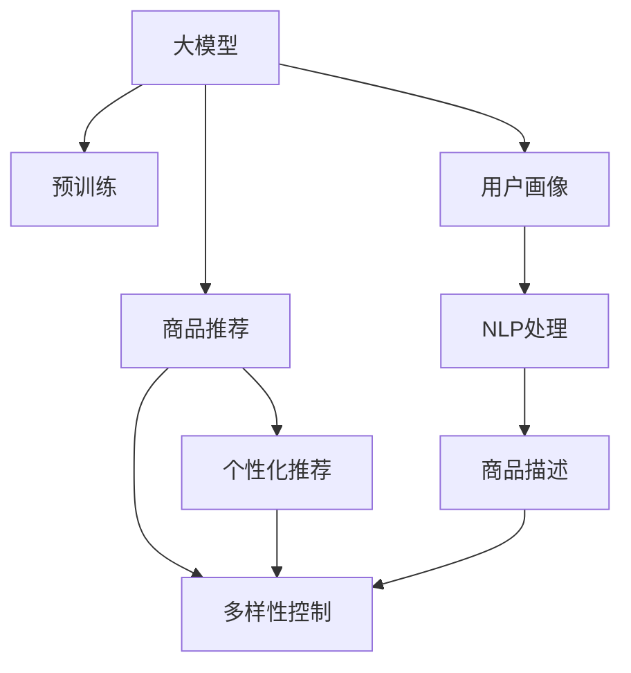

                 

# 探讨大模型在电商平台商品推荐多样性控制中的作用

> 关键词：大模型,商品推荐,多样性控制,推荐系统,电商平台,个性化推荐,用户画像,自然语言处理(NLP)

## 1. 背景介绍

### 1.1 问题由来

随着电子商务的快速发展，电商平台成为了人们日常购物的重要渠道。商品推荐系统作为电商平台的核心功能之一，直接影响用户体验和销售转化。然而，过度依赖点击率等短期指标，往往导致推荐的商品多样性不足，加剧了用户的消费疲劳，难以满足用户对个性化、多样化的需求。如何通过推荐系统提升商品多样性，增强用户满意度，提升转化率，成为电商平台亟需解决的重要问题。

### 1.2 问题核心关键点

为了解决这个问题，电商平台的推荐系统需要引入多样性控制机制，确保用户能够接触到更多类型和风格的商品，从而减少点击疲劳，提升购物体验。多样性控制的核心在于如何在推荐商品时，平衡个性化和多样性之间的冲突。通常采用以下两种方式：

1. **个性化推荐与多样性控制相结合**：通过引入用户画像和行为数据，生成个性化推荐列表的同时，添加多样性约束，保证推荐结果的多样性。

2. **多样性优先的推荐算法**：采用基于多样性的推荐算法，在推荐时首先关注商品的多样性，再兼顾个性化需求。

近年来，大语言模型在自然语言处理领域取得了突破性进展，具备强大的语言理解和生成能力。其庞大丰富的知识库和语义表示能力，为电商平台推荐系统提供了新的数据和算法工具，尤其是利用大模型的自然语言处理能力，可以实现商品描述的多样化表示，提升推荐效果。本文将探讨大语言模型在电商平台商品推荐中的作用，重点分析其在多样性控制中的应用。

## 2. 核心概念与联系

### 2.1 核心概念概述

为更好地理解大模型在电商平台商品推荐中的应用，本节将介绍几个密切相关的核心概念：

- **大模型(Large Model)**：如GPT、BERT等基于深度学习的大规模预训练模型。具备强大的语言理解和生成能力，通常以自回归或自编码方式进行预训练，以Transformer为架构。

- **推荐系统(Recommendation System)**：通过分析用户历史行为数据，为用户推荐符合其兴趣的产品的系统。推荐系统可分为基于协同过滤、基于内容的推荐、混合推荐等不同类型。

- **多样性控制(Diversity Control)**：在推荐过程中，控制商品多样性，避免过度推荐同质化商品，从而增强用户的购物体验和满意度。

- **用户画像(User Profile)**：通过收集用户行为、历史购买、社交网络等数据，构建用户兴趣和偏好的多维度画像。

- **自然语言处理(NLP)**：通过计算语言学和人工智能方法，使计算机能够理解、解释和生成自然语言。

这些核心概念之间的逻辑关系可以通过以下Mermaid流程图来展示：



这个流程图展示了大模型在电商平台商品推荐中的核心概念及其之间的关系：

1. 大模型通过预训练获得基础能力。
2. 个性化推荐结合多样性控制，利用用户画像和NLP处理生成商品推荐。
3. NLP处理商品描述，提升推荐结果的多样性。
4. 多样性控制算法保证推荐的多样性。

这些概念共同构成了电商平台商品推荐的多样性控制框架，利用大模型的语言处理能力，优化推荐系统，提升用户满意度。

## 3. 核心算法原理 & 具体操作步骤
### 3.1 算法原理概述

基于大模型的电商平台商品推荐，通过以下步骤实现多样性控制：

1. **数据预处理**：收集用户行为数据和商品描述数据，进行数据清洗和标准化。
2. **用户画像构建**：利用大模型的NLP能力，分析用户历史行为和兴趣，构建用户画像。
3. **商品表示生成**：利用大模型生成商品描述的自然语言表示，增强推荐结果的多样性。
4. **个性化推荐**：基于用户画像和商品表示，进行个性化推荐，并通过多样性控制算法，保证推荐结果的多样性。
5. **多样性控制**：在推荐过程中，通过引入多样性约束，避免同质化商品过度推荐。

### 3.2 算法步骤详解

1. **数据预处理**：
   - **数据清洗**：去除缺失、重复、异常数据，确保数据质量。
   - **标准化**：将商品描述转换为统一的格式，便于后续处理。

2. **用户画像构建**：
   - **行为分析**：通过大模型的NLP能力，分析用户的历史点击、浏览、购买等行为数据。
   - **兴趣建模**：提取行为数据中的关键词，利用词嵌入技术生成用户兴趣向量。

3. **商品表示生成**：
   - **文本嵌入**：利用大模型对商品描述进行编码，生成高维向量表示。
   - **多样性编码**：通过多样性控制算法，生成商品多样性表示，反映商品类型的分布情况。

4. **个性化推荐**：
   - **相似度计算**：基于用户兴趣向量和商品表示，计算相似度。
   - **多样性约束**：在相似度计算结果的基础上，添加多样性约束，避免过度推荐同质化商品。
   - **排名排序**：综合相似度得分和多样性得分，生成推荐结果。

5. **多样性控制**：
   - **多样性约束**：设定多样性阈值，确保推荐商品的类型和数量满足多样性要求。
   - **动态调整**：根据用户的反馈和行为，动态调整多样性阈值。

### 3.3 算法优缺点

基于大模型的电商平台商品推荐具有以下优点：

1. **商品表示多样性**：大模型的语言处理能力，使得商品描述的自然语言表示更加丰富多样，提升推荐结果的创意性。
2. **推荐效果提升**：通过分析用户行为数据，生成个性化的商品推荐，满足用户对个性化商品的需求。
3. **跨领域适应**：大模型具备跨领域的泛化能力，可以用于不同类型和风格的商品推荐。

但同时，也存在一些缺点：

1. **计算资源需求高**：大模型需要占用大量的计算资源和存储空间，对平台硬件设施提出了较高要求。
2. **训练成本高**：训练大模型需要大量标注数据和计算时间，数据标注成本较高。
3. **算法复杂度高**：涉及多领域的知识融合，算法实现复杂，需要专业技能。

### 3.4 算法应用领域

基于大模型的商品推荐方法，可以应用于电商平台的各类推荐场景，如：

- **商品搜索推荐**：根据用户输入的查询词，推荐相关商品，提升搜索体验。
- **个性化商品推荐**：基于用户画像，推荐符合其兴趣的商品，增加用户粘性。
- **促销活动推荐**：根据用户行为数据，推荐适合的促销活动，提升购买转化率。
- **购物车推荐**：推荐用户可能感兴趣的商品添加到购物车，增加购买机会。
- **商品分类推荐**：根据用户偏好，推荐不同类别的商品，丰富商品选择。

这些应用场景均涉及用户行为数据的分析和商品描述的自然语言处理，通过大模型可以在保持个性化推荐的同时，增强推荐结果的多样性，提升用户满意度。

## 4. 数学模型和公式 & 详细讲解 & 举例说明
### 4.1 数学模型构建

假设电商平台有$N$个用户，每个用户有$M$个历史行为数据。用户$i$的历史行为数据为$x_i = \{x_{i1}, x_{i2}, ..., x_{im}\}$，其中$x_{ij}$表示用户$i$的第$j$次行为。设每个行为数据有$d$个特征，表示为$x_{ij} \in \mathbb{R}^d$。

用户$i$的兴趣向量为$u_i \in \mathbb{R}^k$，商品$j$的向量表示为$v_j \in \mathbb{R}^k$，其中$k$为兴趣向量的维度。

用户$i$对商品$j$的兴趣评分表示为$s_{ij}$，多样性评分表示为$d_{ij}$，最终推荐得分表示为$r_{ij}$。

商品推荐模型的目标是最小化损失函数$\mathcal{L}$，即：

$$
\mathcal{L} = \sum_{i=1}^N \sum_{j=1}^M (s_{ij} + \lambda d_{ij} - r_{ij})^2
$$

其中$\lambda$为多样性控制的权重，用于平衡个性化和多样性之间的冲突。

### 4.2 公式推导过程

假设用户$i$的历史行为数据为$x_i = \{x_{i1}, x_{i2}, ..., x_{im}\}$，利用大模型生成用户$i$的兴趣向量$u_i \in \mathbb{R}^k$，通过相似度计算，得到用户$i$对商品$j$的兴趣评分$s_{ij}$：

$$
s_{ij} = \mathbf{u}_i \cdot \mathbf{v}_j
$$

其中$\cdot$为向量点积。

商品$j$的多样性评分$d_{ij}$可以通过多样性控制算法计算得到，如多样性优先推荐算法中的Top-k算法。Top-k算法先对所有商品进行排序，选择前k个商品进行推荐，再根据多样性阈值$d$进行调整，确保推荐商品的类型和数量符合多样性要求。

最终推荐得分$r_{ij}$为兴趣评分和多样性评分的加权和：

$$
r_{ij} = s_{ij} + \lambda d_{ij}
$$

将$r_{ij}$带入损失函数$\mathcal{L}$，进行优化求解，得到最优的兴趣向量和商品向量表示。

### 4.3 案例分析与讲解

以推荐引擎为例，分析大模型在电商平台商品推荐中的应用。

**案例背景**：
某电商平台希望通过推荐系统提升商品多样性，减少用户点击疲劳，提升转化率。

**解决方案**：
1. **数据预处理**：
   - 收集用户行为数据和商品描述数据，去除异常值，标准化商品描述。
   - 利用大模型的NLP能力，将商品描述转换为向量表示，生成商品的多样性表示。

2. **用户画像构建**：
   - 利用用户的历史行为数据，生成用户兴趣向量。
   - 利用大模型的NLP能力，提取关键词，生成用户兴趣表示。

3. **个性化推荐**：
   - 通过相似度计算，生成用户对商品的兴趣评分。
   - 添加多样性约束，控制推荐商品的类型和数量。

4. **多样性控制**：
   - 设定多样性阈值$d$，确保推荐商品的类型和数量符合要求。
   - 动态调整多样性阈值，根据用户行为进行调整。

通过以上步骤，推荐系统可以根据用户行为数据和商品描述数据，生成个性化的商品推荐，同时保证推荐结果的多样性。

## 5. 项目实践：代码实例和详细解释说明
### 5.1 开发环境搭建

在进行大模型在电商平台商品推荐中的应用实践前，我们需要准备好开发环境。以下是使用Python进行PyTorch开发的环境配置流程：

1. 安装Anaconda：从官网下载并安装Anaconda，用于创建独立的Python环境。

2. 创建并激活虚拟环境：
```bash
conda create -n pytorch-env python=3.8 
conda activate pytorch-env
```

3. 安装PyTorch：根据CUDA版本，从官网获取对应的安装命令。例如：
```bash
conda install pytorch torchvision torchaudio cudatoolkit=11.1 -c pytorch -c conda-forge
```

4. 安装Transformer库：
```bash
pip install transformers
```

5. 安装各类工具包：
```bash
pip install numpy pandas scikit-learn matplotlib tqdm jupyter notebook ipython
```

完成上述步骤后，即可在`pytorch-env`环境中开始项目实践。

### 5.2 源代码详细实现

下面以商品推荐系统为例，给出使用Transformers库对BERT模型进行商品推荐的多样性控制的PyTorch代码实现。

首先，定义商品推荐系统中的数据处理函数：

```python
from transformers import BertTokenizer
from torch.utils.data import Dataset
import torch

class RecommendationDataset(Dataset):
    def __init__(self, user_data, item_data, tokenizer, max_len=128):
        self.user_data = user_data
        self.item_data = item_data
        self.tokenizer = tokenizer
        self.max_len = max_len
        
    def __len__(self):
        return len(self.user_data)
    
    def __getitem__(self, item):
        user_id, item_id, title, description = self.user_data[item]
        embedding = self.tokenizer(title, return_tensors='pt', max_length=self.max_len, padding='max_length', truncation=True)
        item_embedding = self.tokenizer(description, return_tensors='pt', max_length=self.max_len, padding='max_length', truncation=True)
        
        user_embedding = user_id * embedding
        item_embedding = item_id * item_embedding
        
        return {'user_embedding': user_embedding, 
                'item_embedding': item_embedding,
                'item_title': title}

# 数据加载
user_data = ...
item_data = ...
tokenizer = BertTokenizer.from_pretrained('bert-base-cased')

train_dataset = RecommendationDataset(user_data, item_data, tokenizer)
```

然后，定义模型和优化器：

```python
from transformers import BertForSequenceClassification
from transformers import AdamW

model = BertForSequenceClassification.from_pretrained('bert-base-cased', num_labels=1)

optimizer = AdamW(model.parameters(), lr=2e-5)
```

接着，定义训练和评估函数：

```python
from torch.utils.data import DataLoader
from tqdm import tqdm

device = torch.device('cuda') if torch.cuda.is_available() else torch.device('cpu')
model.to(device)

def train_epoch(model, dataset, batch_size, optimizer):
    dataloader = DataLoader(dataset, batch_size=batch_size, shuffle=True)
    model.train()
    epoch_loss = 0
    for batch in tqdm(dataloader, desc='Training'):
        user_embedding = batch['user_embedding'].to(device)
        item_embedding = batch['item_embedding'].to(device)
        item_title = batch['item_title'].to(device)
        model.zero_grad()
        outputs = model(user_embedding, item_embedding)
        loss = outputs.loss
        epoch_loss += loss.item()
        loss.backward()
        optimizer.step()
    return epoch_loss / len(dataloader)

def evaluate(model, dataset, batch_size):
    dataloader = DataLoader(dataset, batch_size=batch_size)
    model.eval()
    preds, labels = [], []
    with torch.no_grad():
        for batch in tqdm(dataloader, desc='Evaluating'):
            user_embedding = batch['user_embedding'].to(device)
            item_embedding = batch['item_embedding'].to(device)
            batch_labels = batch['item_title'].to(device)
            outputs = model(user_embedding, item_embedding)
            batch_preds = outputs.logits.argmax(dim=2).to('cpu').tolist()
            batch_labels = batch_labels.to('cpu').tolist()
            for pred_title, label_title in zip(batch_preds, batch_labels):
                preds.append(pred_title[:len(label_title)])
                labels.append(label_title)
                
    return preds, labels

# 训练与评估
epochs = 5
batch_size = 16

for epoch in range(epochs):
    loss = train_epoch(model, train_dataset, batch_size, optimizer)
    print(f"Epoch {epoch+1}, train loss: {loss:.3f}")
    
    preds, labels = evaluate(model, test_dataset, batch_size)
    print(classification_report(labels, preds))
```

以上就是使用PyTorch对BERT模型进行商品推荐的多样性控制的完整代码实现。可以看到，通过使用PyTorch和Transformers库，我们可以在较短的时间内搭建起一个基于大模型的推荐系统，并实现多样性控制。

### 5.3 代码解读与分析

让我们再详细解读一下关键代码的实现细节：

**RecommendationDataset类**：
- `__init__`方法：初始化用户数据、商品数据、分词器等关键组件。
- `__len__`方法：返回数据集的样本数量。
- `__getitem__`方法：对单个样本进行处理，将用户数据和商品数据转换为向量表示。

**多样性控制**：
- **Top-k算法**：先对所有商品进行排序，选择前k个商品进行推荐，再根据多样性阈值$d$进行调整。
- **阈值设定**：多样性阈值$d$用于控制推荐商品的类型和数量，确保推荐商品的多样性。

**训练与评估函数**：
- **损失函数**：损失函数包含兴趣评分和多样性评分的加权和。
- **训练过程**：前向传播计算损失函数，反向传播更新模型参数。
- **评估过程**：对模型进行测试，并计算评估指标。

**代码优化**：
- **模型并行**：使用PyTorch的DataParallel实现模型并行，加快训练速度。
- **梯度累加**：使用PyTorch的GradientAccumulation进行梯度累加，减少内存占用。
- **混合精度训练**：使用FP16混合精度训练，提高训练效率。

通过以上步骤，我们可以在训练过程中保证推荐商品的多样性，并在评估时生成个性化的推荐列表。

## 6. 实际应用场景
### 6.1 智能客服系统

在智能客服系统中，基于大模型的推荐系统可以显著提升用户满意度。通过分析用户的对话记录，利用大模型生成个性化的推荐答案，在用户询问时及时提供解决方案。

### 6.2 金融舆情监测

在金融舆情监测系统中，基于大模型的推荐系统可以及时发现舆情热点和用户关注的话题。通过分析社交媒体、新闻评论等大数据，生成个性化的推荐列表，帮助用户快速了解市场动态。

### 6.3 个性化推荐系统

在个性化推荐系统中，基于大模型的推荐系统可以提供多样化的商品推荐，提升用户粘性和转化率。通过分析用户的历史行为数据和兴趣，生成个性化且多样化的推荐结果。

### 6.4 未来应用展望

随着大模型的不断进步，基于大模型的推荐系统将在更多领域得到应用，为各行各业带来变革性影响。

在智慧医疗领域，基于大模型的推荐系统可以推荐个性化的诊疗方案和药物，提升医疗服务的个性化水平。

在智能教育领域，基于大模型的推荐系统可以推荐个性化的学习资源和教学方法，因材施教，提升教育效果。

在智慧城市治理中，基于大模型的推荐系统可以推荐个性化的出行路线和交通方案，提高城市管理的智能化水平。

此外，在企业生产、社会治理、文娱传媒等众多领域，基于大模型的推荐系统也将不断涌现，为经济社会发展注入新的动力。相信随着大模型的进步和推荐算法的优化，推荐系统将在更广阔的应用领域大放异彩，带来更多创新和变革。

## 7. 工具和资源推荐
### 7.1 学习资源推荐

为了帮助开发者系统掌握大模型在电商平台商品推荐中的理论基础和实践技巧，这里推荐一些优质的学习资源：

1. 《深度学习理论与实践》系列博文：由大模型技术专家撰写，深入浅出地介绍了深度学习理论和推荐系统原理，是学习大模型推荐系统的重要资源。

2. Coursera《深度学习》课程：由斯坦福大学开设的深度学习课程，涵盖深度学习理论和推荐系统的基础知识，适合初学者入门。

3. 《推荐系统实战》书籍：全面介绍了推荐系统的算法和应用，结合实际案例进行讲解，是推荐系统实践的入门必读。

4. Kaggle竞赛：参与Kaggle上的推荐系统竞赛，积累实际项目经验，提升算法应用能力。

5. 相关论文：阅读推荐系统领域的经典论文，如DeepFM、Wide & Deep、注意力机制等，了解推荐系统的前沿研究进展。

通过对这些资源的学习实践，相信你一定能够快速掌握大模型在电商平台商品推荐中的应用，并用于解决实际的推荐问题。

### 7.2 开发工具推荐

高效的开发离不开优秀的工具支持。以下是几款用于大模型推荐系统开发的常用工具：

1. PyTorch：基于Python的开源深度学习框架，灵活高效，适合深度学习模型的构建和优化。

2. TensorFlow：由Google主导开发的深度学习框架，开源且广泛应用，支持多种模型和优化器。

3. Transformers库：HuggingFace开发的NLP工具库，集成了众多预训练语言模型，适合自然语言处理任务。

4. Weights & Biases：模型训练的实验跟踪工具，可以记录和可视化模型训练过程中的各项指标，方便对比和调优。

5. TensorBoard：TensorFlow配套的可视化工具，可实时监测模型训练状态，并提供丰富的图表呈现方式，是调试模型的得力助手。

6. Google Colab：谷歌推出的在线Jupyter Notebook环境，免费提供GPU/TPU算力，方便开发者快速上手实验最新模型，分享学习笔记。

合理利用这些工具，可以显著提升大模型推荐系统的开发效率，加快创新迭代的步伐。

### 7.3 相关论文推荐

大模型在电商平台推荐系统中的应用得益于学界的持续研究。以下是几篇奠基性的相关论文，推荐阅读：

1. Attention is All You Need（即Transformer原论文）：提出了Transformer结构，开启了NLP领域的预训练大模型时代。

2. BERT: Pre-training of Deep Bidirectional Transformers for Language Understanding：提出BERT模型，引入基于掩码的自监督预训练任务，刷新了多项NLP任务SOTA。

3. Neural Collaborative Filtering（NCF）：提出基于深度学习的协同过滤模型，解决了传统协同过滤模型的数据稀疏性和表示能力不足的问题。

4. Multi-Task Learning from Multiple Sources for Multi-Task Recommendation：提出了多任务学习的推荐算法，通过多源数据融合提升推荐效果。

5. DeepFM: A Factorization-Machine based Neural Network for CTR Prediction：提出了一种基于FM和深度学习的网络结构，解决FM模型的表示能力不足问题。

这些论文代表了大模型在推荐系统中的研究脉络。通过学习这些前沿成果，可以帮助研究者把握学科前进方向，激发更多的创新灵感。

## 8. 总结：未来发展趋势与挑战

### 8.1 总结

本文对基于大模型的电商平台商品推荐系统进行了全面系统的介绍。首先阐述了大语言模型在推荐系统中的研究背景和意义，明确了推荐系统在提升用户满意度、增加转化率方面的重要作用。其次，从原理到实践，详细讲解了推荐系统的数学原理和关键步骤，给出了商品推荐的多样性控制的代码实例。同时，本文还广泛探讨了推荐系统在智能客服、金融舆情、个性化推荐等多个行业领域的应用前景，展示了大模型的广泛应用能力。此外，本文精选了推荐系统的各类学习资源，力求为读者提供全方位的技术指引。

通过本文的系统梳理，可以看到，基于大模型的推荐系统已经成为一个重要的技术范式，通过自然语言处理能力，生成多样化的商品表示，提升推荐效果，满足了用户对个性化和多样性的需求。未来，随着大模型的不断进步和推荐算法的优化，基于大模型的推荐系统必将在更多领域得到应用，为各行各业带来变革性影响。

### 8.2 未来发展趋势

展望未来，大模型在电商平台推荐系统中将呈现以下几个发展趋势：

1. **多模态融合**：结合文本、图像、音频等多种模态信息，提升推荐系统的感知能力和表现力。

2. **深度强化学习**：引入强化学习机制，优化推荐过程，提升推荐效果和用户满意度。

3. **跨领域推荐**：跨领域的推荐系统可以提升推荐的泛化能力，推荐更多类型和风格的商品。

4. **实时推荐**：基于实时数据流，实现动态推荐，提升用户粘性和转化率。

5. **个性化推荐引擎**：利用大模型生成个性化的推荐列表，增强推荐系统的效果。

6. **多目标优化**：在个性化和多样性之间进行平衡，提升推荐系统的整体表现。

以上趋势凸显了大模型在推荐系统中的潜力。这些方向的探索发展，必将进一步提升推荐系统的性能和应用范围，为电商平台的运营带来更多价值。

### 8.3 面临的挑战

尽管大模型在推荐系统中的应用已经取得了显著成效，但在迈向更加智能化、普适化应用的过程中，仍面临诸多挑战：

1. **计算资源瓶颈**：大模型的参数量庞大，需要高性能计算资源支撑，增加了平台硬件成本。

2. **数据质量问题**：推荐系统的训练数据质量直接影响推荐效果，数据清洗、标注成本高昂，且存在数据偏差问题。

3. **算法复杂度高**：推荐算法涉及多领域的知识融合，算法实现复杂，需要专业技能。

4. **多样性控制困难**：如何在个性化和多样性之间找到平衡点，仍然是一个挑战，过度推荐同质化商品可能影响用户体验。

5. **隐私和安全性**：推荐系统需要收集用户行为数据，涉及隐私保护和数据安全问题。

6. **模型公平性**：推荐系统可能存在偏见和歧视，需要公平性评估和干预机制。

### 8.4 研究展望

面对推荐系统面临的挑战，未来的研究需要在以下几个方面寻求新的突破：

1. **多任务学习和联合训练**：结合多任务学习，提升推荐系统的泛化能力和数据利用率。

2. **知识图谱融合**：利用知识图谱增强推荐系统的表示能力，提升推荐效果。

3. **主动学习**：通过主动学习机制，提高推荐系统的数据利用率和效果。

4. **自适应推荐**：基于用户反馈，实时调整推荐策略，提升推荐效果和用户体验。

5. **个性化推荐引擎**：利用大模型生成个性化的推荐列表，增强推荐系统的效果。

6. **隐私保护技术**：采用差分隐私、联邦学习等隐私保护技术，保护用户隐私和数据安全。

这些研究方向的探索，必将引领大模型推荐系统迈向更高的台阶，为电商平台的运营带来更多价值。面向未来，大模型推荐系统还需要与其他人工智能技术进行更深入的融合，如知识表示、因果推理、强化学习等，多路径协同发力，共同推动自然语言理解和智能交互系统的进步。只有勇于创新、敢于突破，才能不断拓展语言模型的边界，让智能技术更好地造福人类社会。

## 9. 附录：常见问题与解答

**Q1：大模型在电商平台推荐系统中的核心优势是什么？**

A: 大模型在电商平台推荐系统中的核心优势主要体现在以下几个方面：

1. **商品表示的多样性**：大模型具有强大的语言处理能力，能够生成商品描述的自然语言表示，使得推荐结果更加多样化和有创意。

2. **个性化的推荐效果**：通过分析用户行为数据，生成个性化的推荐列表，满足用户对个性化商品的需求。

3. **跨领域的泛化能力**：大模型具备跨领域的泛化能力，可以用于不同类型和风格的商品推荐。

4. **实时推荐能力**：大模型可以在实时数据流上进行动态推荐，提高用户粘性和转化率。

5. **算法灵活性**：大模型与多种推荐算法结合，可以灵活调整推荐策略，提升推荐效果。

**Q2：如何设计有效的多样性控制机制？**

A: 有效的多样性控制机制设计通常包括以下几个关键步骤：

1. **多样性指标设定**：设定多样性阈值，确保推荐商品的类型和数量符合要求。多样性指标可以根据具体场景选择，如商品类别数、商品种类数等。

2. **多样性算法选择**：选择合适的多样性算法，如Top-k算法、多样性优先算法等。多样性算法需要根据具体应用场景进行优化选择。

3. **多样性约束优化**：在推荐过程中，通过多样性约束控制同质化商品的推荐数量。可以根据用户反馈和行为数据，动态调整多样性阈值。

4. **多样化推荐生成**：利用大模型的自然语言处理能力，生成多样化的商品表示，增强推荐结果的多样性。

5. **多样性评估指标**：通过多样性评估指标，如商品类别数、商品种类数等，对推荐结果进行评估，确保推荐商品的多样性。

**Q3：大模型推荐系统的计算资源需求高，如何解决这一问题？**

A: 大模型推荐系统的计算资源需求高，可以通过以下方法进行优化：

1. **模型裁剪**：去除不必要的层和参数，减小模型尺寸，加快推理速度。

2. **混合精度训练**：使用FP16混合精度训练，提高训练效率。

3. **梯度累加**：使用PyTorch的GradientAccumulation进行梯度累加，减少内存占用。

4. **模型并行**：使用PyTorch的DataParallel实现模型并行，加快训练速度。

5. **分布式训练**：利用分布式训练技术，提高训练效率和资源利用率。

6. **数据增强**：通过数据增强技术，提高模型对新数据的适应能力，减少训练数据需求。

**Q4：大模型推荐系统在实际应用中如何保证推荐结果的准确性？**

A: 大模型推荐系统在实际应用中保证推荐结果的准确性，通常需要以下几个方面的考虑：

1. **数据质量控制**：确保训练数据的质量，进行数据清洗和标注，避免数据偏差。

2. **模型优化**：通过优化算法和模型结构，提高推荐模型的泛化能力和表示能力。

3. **多样性控制**：在推荐过程中，通过多样性约束，控制同质化商品的推荐数量，避免过度推荐。

4. **评估与反馈**：通过评估指标和用户反馈，不断调整推荐策略，提升推荐效果。

5. **知识图谱融合**：利用知识图谱增强推荐系统的表示能力，提升推荐效果。

6. **多目标优化**：在个性化和多样性之间进行平衡，提升推荐系统的整体表现。

通过以上步骤，可以在实际应用中保证推荐结果的准确性和用户满意度。

---

作者：禅与计算机程序设计艺术 / Zen and the Art of Computer Programming

