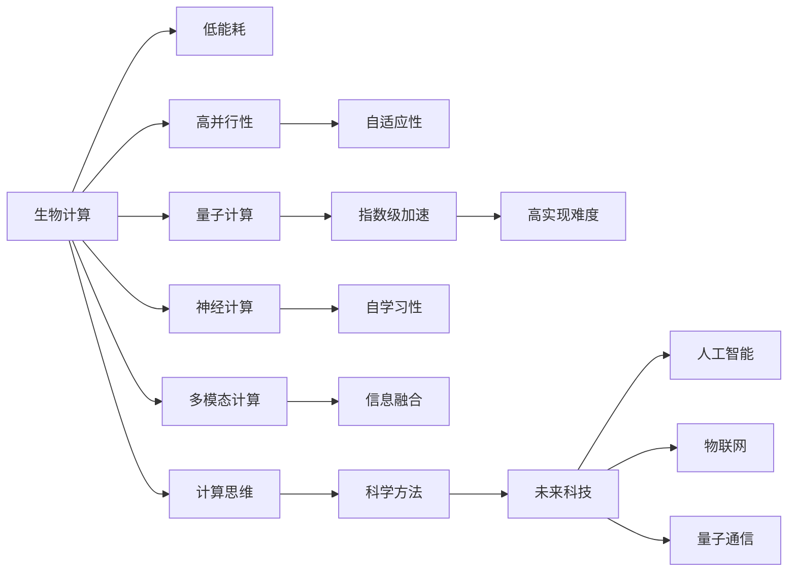

                 

# 推动科技进步的引擎：人类计算的创新力量

> 关键词：人类计算,计算范式,科学方法,创新引擎,多模态计算,量子计算,计算机科学与哲学,未来科技

## 1. 背景介绍

### 1.1 问题由来
在人类历史的长河中，计算始终作为推动科技进步的关键力量，从古代的算筹计算到现代的电子计算机，每一次计算技术的跃迁都引领了人类文明的巨大飞跃。然而，随着信息技术的飞速发展，传统计算范式的局限性也逐渐显现出来。

- **速度瓶颈**：经典计算范式依赖于电子设备的高速运行，但物理极限使得计算速度难以实现质的飞跃。
- **能耗问题**：电子计算高度依赖电力供应，能耗高、散热困难，难以适应环保要求。
- **成本制约**：高性能计算设备成本昂贵，普通用户难以负担。

为突破这些瓶颈，计算范式的创新显得尤为迫切。近年来，随着生物计算、量子计算、神经计算等新型计算范式的提出，计算技术迎来新的变革，为我们描绘了一幅充满无限可能性的未来图景。

### 1.2 问题核心关键点
计算范式的创新是科技发展的重要推动力。它不仅引领了技术突破，还推动了社会进步和人类思维方式的变革。理解计算范式的原理和应用，对于探索未来科技的发展方向至关重要。

计算范式的核心关键点包括：

1. **计算设备与介质**：不同计算范式使用的计算设备与介质各不相同，如电子设备、生物分子、光子等。
2. **算法与逻辑**：计算范式依赖于不同的算法与逻辑，如经典算法、量子算法、神经网络等。
3. **数据处理方式**：数据在计算范式中的处理方式，如串行计算、并行计算、分布式计算等。
4. **计算模型与架构**：计算范式的计算模型与架构，如冯诺依曼架构、量子计算架构等。

通过深入理解这些关键点，可以更好地把握计算范式的创新方向，指导未来的科技发展。

## 2. 核心概念与联系

### 2.1 核心概念概述

为了更好地理解计算范式的创新，我们需要了解以下几个核心概念：

- **生物计算(Biological Computing)**：利用生物分子（如DNA）进行信息处理与计算，具备低能耗、高并行性的特点。
- **量子计算(Quantum Computing)**：利用量子态进行信息处理与计算，具备指数级加速能力，但实现难度高。
- **神经计算(Neural Computing)**：模拟人脑神经元与突触的工作方式，通过神经网络进行信息处理与计算，具备自适应性和学习性。
- **多模态计算(Multimodal Computing)**：融合视觉、听觉、触觉等多种感官信息，进行综合计算，提升信息处理能力。
- **计算思维(Computational Thinking)**：一种科学方法，通过计算范式解决问题，提升逻辑思维与系统设计能力。
- **未来科技(Future Technologies)**：结合计算范式的最新发展，探索人工智能、物联网、量子通信等未来科技的应用。

这些概念之间的联系可以通过以下Mermaid流程图来展示：



这个流程图展示了不同计算范式的特点及其相互联系。

## 3. 核心算法原理 & 具体操作步骤
### 3.1 算法原理概述

不同计算范式的算法原理各不相同，但它们都遵循一个共同的逻辑：通过某种介质和设备，利用特定的算法，处理和存储信息，以实现计算任务。

以量子计算为例，其核心原理是利用量子态的叠加和纠缠，实现计算任务。量子态的叠加允许一个量子系统同时处于多个状态，从而实现了信息的并行处理；量子态的纠缠则允许不同量子系统之间的信息传递，提升了计算效率。

量子计算的典型算法包括Shor算法、Grover算法等，这些算法利用量子态的特性，实现了经典计算难以完成的复杂计算任务，如大数因式分解、数据库搜索等。

### 3.2 算法步骤详解

以量子计算为例，其典型的操作步骤包括：

1. **量子比特初始化**：将量子比特（qubit）初始化为0或1的状态。
2. **量子态制备**：通过量子门（quantum gates）对量子比特进行量子态的制备，实现量子叠加和纠缠。
3. **量子态演化**：通过量子演化过程，计算出量子态的概率幅值。
4. **量子测量**：通过量子测量过程，读取量子比特的状态，获取计算结果。

### 3.3 算法优缺点

量子计算的优点包括：

- **高计算效率**：利用量子态的叠加和纠缠，量子计算机能够高效地处理复杂计算任务。
- **并行计算能力**：量子计算机能够同时处理多个计算任务，大大提升了计算速度。
- **信息加密优势**：量子计算的不可克隆性，为信息安全提供了新思路。

但量子计算也面临以下挑战：

- **实现难度高**：量子计算依赖于复杂的光学和电子设备，实现难度较大。
- **稳定性问题**：量子态容易受到环境干扰，导致计算结果的错误。
- **资源消耗大**：量子计算需要极低温度的环境，对能源和设备的消耗较高。

### 3.4 算法应用领域

量子计算已在诸多领域展现出了巨大的潜力，主要应用包括：

- **化学计算**：利用量子计算机模拟化学反应过程，加速新药研发和材料设计。
- **密码学**：量子计算破解经典加密算法，为信息安全带来新挑战，同时推动了量子密码学的发展。
- **优化问题**：量子计算求解复杂优化问题，如供应链优化、交通流规划等。
- **机器学习**：量子计算加速神经网络训练，提升机器学习模型的效率。

## 4. 数学模型和公式 & 详细讲解 & 举例说明（备注：数学公式请使用latex格式，latex嵌入文中独立段落使用 $$，段落内使用 $)
### 4.1 数学模型构建

量子计算的数学模型基于量子力学的原理，包括量子比特、量子门和量子态等基本概念。

量子比特是量子计算的基本单位，通常用0和1表示。量子态的表示方法包括狄拉克符号和量子密度矩阵。量子门是用于量子比特操作的基本单元，通过一系列量子门的操作，可以实现量子态的演化。

### 4.2 公式推导过程

以Shor算法为例，其核心在于利用量子计算机实现大数分解。Shor算法包括两个主要步骤：

1. 对给定的大数 $n$，构造一个量子态 $|f\rangle = \sum_{x=1}^{n-1}|x\rangle|f(x)\rangle$。
2. 对 $|f\rangle$ 进行量子傅里叶变换，得到 $|f\rangle \to \frac{1}{\sqrt{n}}\sum_{a=1}^n e^{2\pi i fa/n}|a\rangle$。

通过该变换，Shor算法实现了对 $n$ 的质因数分解。

### 4.3 案例分析与讲解

以Shor算法为例，我们可以进一步分析其计算过程和优势：

- **计算效率**：Shor算法的时间复杂度为 $O(\log^3 n)$，相较于经典算法的指数级复杂度，具有显著的计算优势。
- **实现难度**：Shor算法的实现依赖于量子计算机的高精度控制和量子态的稳定保持，目前仍处于实验阶段。
- **应用场景**：Shor算法可用于密码学领域，破解经典加密算法RSA等，为信息安全带来新挑战。

## 5. 项目实践：代码实例和详细解释说明
### 5.1 开发环境搭建

要进行量子计算的实践，需要搭建相应的开发环境。以下是在Google Colab中进行量子计算开发的步骤：

1. 安装Google Colab：从官网下载并安装Google Colab，可以免费使用Google提供的GPU资源。
2. 创建虚拟环境：在Google Colab中输入以下命令创建虚拟环境，确保使用稳定的Python版本：
   ```bash
   conda create -n qc-env python=3.7
   conda activate qc-env
   ```

3. 安装量子计算库：
   ```bash
   pip install qiskit
   ```

4. 导入库：
   ```python
   from qiskit import QuantumCircuit, execute, Aer
   from qiskit.visualization import plot_histogram, plot_bloch_multivector
   from qiskit.extensions import UnitaryGate
   ```

### 5.2 源代码详细实现

以下是一个简单的量子计算代码示例，演示如何实现量子叠加和量子测量：

```python
# 创建量子电路
qc = QuantumCircuit(2)

# 添加H门，实现量子叠加
qc.h(0)
qc.h(1)

# 添加CNOT门，实现量子纠缠
qc.cx(0, 1)

# 绘制量子电路
qc.draw()

# 执行量子计算
backend = Aer.get_backend('qasm_simulator')
job = execute(qc, backend)
result = job.result()

# 读取测量结果
counts = result.get_counts()
print(counts)
```

### 5.3 代码解读与分析

在上述代码中，我们首先创建了一个包含两个量子比特的量子电路，并添加了H门和CNOT门，实现了量子叠加和量子纠缠。然后，我们通过Aer模拟器执行了量子计算，并读取了最终的测量结果。

量子叠加和纠缠是量子计算中的核心概念，通过H门和CNOT门的组合，我们能够实现多个量子比特之间的复杂计算。

## 6. 实际应用场景
### 6.1 生物计算在生物技术中的应用

生物计算利用生物分子的特性进行信息处理，具有低能耗、高并行性和自适应性等优点。例如，DNA计算和细胞计算已经在药物设计、疾病诊断等领域展现出巨大潜力。

- **药物设计**：利用DNA分子模拟药物分子与目标分子的相互作用，优化药物设计过程。
- **疾病诊断**：利用细胞计算检测病原体DNA序列，实现疾病快速诊断。

### 6.2 神经计算在智能系统中的应用

神经计算模拟人脑的神经元与突触的工作方式，通过神经网络进行信息处理与计算，具备自学习性和自适应性。神经计算已在机器学习、模式识别等领域取得重要进展。

- **图像识别**：利用神经网络进行图像分类和物体识别，提升图像处理能力。
- **语音识别**：利用神经网络进行语音信号处理，实现自然语言交互。
- **推荐系统**：利用神经网络进行用户行为分析，推荐个性化内容。

### 6.3 多模态计算在智能交互中的应用

多模态计算融合视觉、听觉、触觉等多种感官信息，进行综合计算，提升信息处理能力。多模态计算已在人机交互、智能家居等领域展现出巨大潜力。

- **智能家居**：利用多模态计算实现智能家居控制，提升生活便利性。
- **人机交互**：利用多模态计算实现自然语言理解，实现人机自然对话。
- **自动驾驶**：利用多模态计算融合视觉、雷达、激光雷达等信息，实现自主驾驶。

### 6.4 未来应用展望

随着计算范式的不断创新，未来科技将迎来更多突破。以下是对未来科技发展的几点展望：

- **量子通信**：基于量子计算的量子通信技术，实现信息的高效传输和加密。
- **人工智能**：融合生物计算、神经计算等多模态计算，实现更加智能的AI系统。
- **物联网**：利用多模态计算实现设备间的互联互通，推动智能城市建设。
- **生物计算**：在药物设计、疾病诊断等领域，实现更加高效和精确的信息处理。

## 7. 工具和资源推荐
### 7.1 学习资源推荐

为了帮助读者深入理解计算范式的原理和应用，推荐以下学习资源：

1. **《量子计算》系列课程**：MIT等名校开设的量子计算课程，涵盖量子比特、量子门、量子算法等核心内容。
2. **《生物计算》系列书籍**：介绍DNA计算、细胞计算等生物计算技术，帮助理解生物分子的计算原理。
3. **《神经计算》系列文章**：涵盖神经网络的基本概念、算法与应用，帮助理解神经计算的原理。
4. **《多模态计算》系列论文**：介绍多模态计算的基本原理和应用场景，帮助理解多模态信息融合。
5. **《计算思维》系列书籍**：涵盖计算思维的基本概念、算法与应用，帮助理解计算范式的科学方法。

通过这些学习资源，读者可以系统地掌握计算范式的原理和应用，为未来科技发展打下坚实的基础。

### 7.2 开发工具推荐

以下是几个常用的开发工具，帮助开发者进行量子计算、生物计算等领域的开发：

1. **Google Colab**：提供免费GPU资源，方便进行量子计算等高计算密集型任务。
2. **IBM Q**：提供量子计算云平台，方便进行量子算法的开发和实验。
3. **BioPython**：Python语言的量子计算库，方便进行生物计算和DNA计算。
4. **TensorFlow**：用于神经计算和机器学习的框架，支持多模态计算和深度学习。
5. **Visual Studio Code**：支持多种编程语言的集成开发环境，方便进行多模态计算的开发。

### 7.3 相关论文推荐

以下是几篇重要的相关论文，帮助读者深入理解计算范式的原理和应用：

1. **《量子计算的理论基础》**：介绍量子计算的基本概念和理论基础，帮助理解量子计算的原理。
2. **《生物计算的最新进展》**：介绍DNA计算、细胞计算等生物计算技术的最新进展，帮助理解生物分子的计算原理。
3. **《神经计算的基本原理》**：介绍神经网络的基本概念、算法与应用，帮助理解神经计算的原理。
4. **《多模态计算的最新应用》**：介绍多模态计算的基本原理和应用场景，帮助理解多模态信息融合。
5. **《计算思维的科学方法》**：介绍计算思维的基本概念、算法与应用，帮助理解计算范式的科学方法。

通过这些论文的学习，读者可以深入理解计算范式的原理和应用，为未来的科技发展提供理论支持。

## 8. 总结：未来发展趋势与挑战

### 8.1 研究成果总结

本文通过分析计算范式的原理和应用，揭示了人类计算的创新力量。计算范式的不断创新，推动了科技的进步和人类认知方式的变革。未来，随着计算范式的不断发展，人类将迈向更加智能、高效、可持续的未来。

### 8.2 未来发展趋势

未来的计算范式将呈现以下几个趋势：

1. **量子计算的突破**：量子计算将实现更大的突破，实现更多复杂计算任务的求解。
2. **生物计算的普及**：生物计算将在药物设计、疾病诊断等领域得到广泛应用。
3. **神经计算的智能化**：神经计算将推动智能系统的智能化发展，实现更高效的信息处理。
4. **多模态计算的融合**：多模态计算将实现不同感官信息的融合，提升信息处理能力。
5. **计算思维的普及**：计算思维将成为科学研究和工程技术的重要方法论。

### 8.3 面临的挑战

尽管计算范式的创新带来了巨大的潜力，但在其实现和应用过程中，仍面临诸多挑战：

1. **技术难度**：不同计算范式的实现难度各不相同，量子计算、生物计算等技术仍处于实验阶段。
2. **资源消耗**：高计算密集型任务对资源消耗较大，需考虑能源和设备的可持续发展。
3. **安全性**：计算范式在信息安全和隐私保护方面存在风险，需制定相应的安全策略。
4. **伦理问题**：计算范式在应用过程中可能带来伦理问题，需制定相应的伦理规范。
5. **人机协作**：计算范式需与人类协作，实现人机协同的智能系统。

### 8.4 研究展望

未来的研究需要从多个方向进行探索：

1. **技术突破**：推动计算范式的技术突破，实现更多复杂计算任务的求解。
2. **跨领域应用**：将计算范式应用于更多领域，推动各领域的技术创新。
3. **伦理规范**：制定相应的伦理规范，确保计算范式的应用符合人类价值观。
4. **人机协同**：实现人机协同的智能系统，提升计算范式的应用效果。

总之，未来的计算范式将继续推动科技的进步，为人类带来更多的创新和发展机遇。

## 9. 附录：常见问题与解答

**Q1: 什么是计算范式？**

A: 计算范式是指不同计算技术的基础原理和基本思路，如量子计算、生物计算、神经计算等。

**Q2: 量子计算的优势和挑战是什么？**

A: 量子计算的优势在于高计算效率和并行处理能力，能够高效地处理复杂计算任务。但实现难度高，稳定性问题突出，资源消耗大。

**Q3: 生物计算在实际应用中有哪些局限性？**

A: 生物计算的局限性在于其依赖生物分子的特性，加工精度和稳定性较难控制。同时，生物计算的实验成本较高。

**Q4: 神经计算在人工智能中的应用前景如何？**

A: 神经计算在人工智能中的应用前景广阔，能够实现更加智能的AI系统。但目前神经计算的训练复杂度较高，需要大量的计算资源。

**Q5: 多模态计算在实际应用中有哪些应用场景？**

A: 多模态计算在智能家居、人机交互、自动驾驶等领域具有广阔的应用前景，能够实现更加智能的信息处理。

**Q6: 如何理解计算思维的科学方法？**

A: 计算思维的科学方法是通过计算范式解决问题，提升逻辑思维与系统设计能力，是一种有效的科学方法论。

本文通过深入分析计算范式的原理和应用，揭示了人类计算的创新力量。计算范式的不断创新，推动了科技的进步和人类认知方式的变革。未来，随着计算范式的不断发展，人类将迈向更加智能、高效、可持续的未来。相信在未来的科技发展中，计算范式将继续扮演重要的角色，为人类带来更多的创新和发展机遇。

作者：禅与计算机程序设计艺术 / Zen and the Art of Computer Programming

