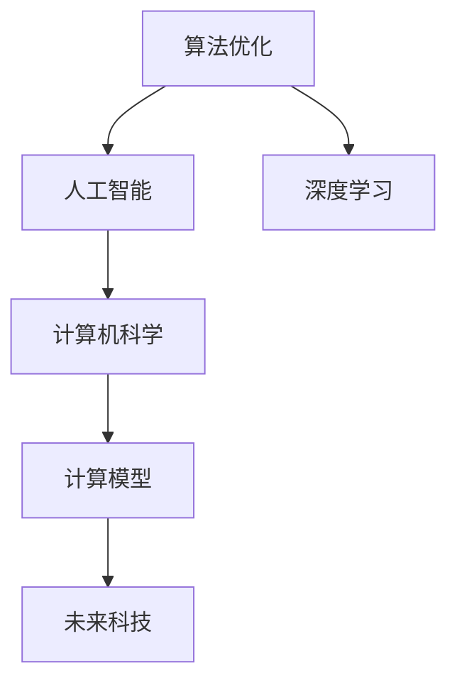

                 

# 推动科技进步的引擎：人类计算的创新力量

> 关键词：人类计算,创新力量,算法优化,人工智能,机器学习,深度学习,计算机科学,计算模型,未来科技,计算效率

## 1. 背景介绍

在现代科技的发展历程中，计算能力始终是推动人类进步的重要引擎。从早期的电子管计算机到如今的超级计算机，每一次计算技术的飞跃都伴随着新科技的诞生和旧问题的解决。人类计算的发展历程，不仅见证了科技的进步，更是反映出人类智慧和创新力量的伟大。本文将深入探讨人类计算的创新力量，以及其在当前科技领域的核心地位。

## 2. 核心概念与联系

### 2.1 核心概念概述

人类计算的核心概念主要包括：

- **算法优化**：通过改进算法来提高计算效率，减少资源消耗，从而推动科技进步。

- **人工智能**：利用机器学习和深度学习技术，赋予机器智能决策能力，解决复杂问题。

- **深度学习**：通过多层次的神经网络，让机器能够自动学习特征，并作出决策。

- **计算机科学**：研究计算机软硬件系统的设计与实现，包括算法、编程语言、系统架构等方面。

- **计算模型**：描述计算过程的数学模型，如图灵机模型、量子计算模型等。

- **未来科技**：包括人工智能、量子计算、生物计算、纳米计算等新兴技术。

这些核心概念之间的逻辑关系可以通过以下Mermaid流程图来展示：



这个流程图展示了人类计算的基本脉络：通过算法优化提升人工智能和深度学习的计算能力，而人工智能和深度学习又推动计算机科学和计算模型的发展，最终催生未来科技的创新。

## 3. 核心算法原理 & 具体操作步骤

### 3.1 算法原理概述

人类计算的进步离不开算法的创新和优化。以深度学习为例，其核心在于构建多层次的神经网络，通过反向传播算法来优化网络参数，从而提高模型的准确性和泛化能力。算法的优化不仅体现在模型结构的改进上，还体现在优化算法（如Adam、SGD等）的创新上，以及正则化、数据增强等技术的引入。

### 3.2 算法步骤详解

以深度学习为例，其核心步骤包括：

1. **数据准备**：收集和处理训练数据，包括数据清洗、归一化、划分训练集和测试集等。

2. **模型设计**：选择合适的神经网络架构，如卷积神经网络、循环神经网络、Transformer等。

3. **损失函数定义**：根据任务需求，定义合适的损失函数，如交叉熵、均方误差等。

4. **优化器选择**：选择合适的优化算法，并设置学习率、批量大小等超参数。

5. **训练过程**：通过前向传播计算损失函数，反向传播更新参数，不断迭代训练模型。

6. **模型评估**：在测试集上评估模型性能，如准确率、召回率、F1值等。

### 3.3 算法优缺点

深度学习的优点在于其强大的学习能力，能够自动学习复杂特征，适用于许多高维数据处理任务。但其缺点在于模型结构复杂，训练耗时较长，容易过拟合，且对数据质量要求较高。

### 3.4 算法应用领域

深度学习在图像识别、语音识别、自然语言处理、推荐系统等领域均有广泛应用。例如，在图像识别领域，卷积神经网络能够有效地提取图像特征，实现高精度的图像分类和目标检测。

## 4. 数学模型和公式 & 详细讲解 & 举例说明

### 4.1 数学模型构建

深度学习的核心数学模型为神经网络，其包含多个层次的神经元，每个神经元将输入数据加权求和后，通过激活函数进行非线性变换。以卷积神经网络为例，其数学模型可以表示为：

$$
f(x) = W_0 + \sum_{i=1}^n W_i h_i(x) + b
$$

其中，$f(x)$为输出，$W_0, W_i, b$为模型参数，$h_i(x)$为激活函数，$n$为层数。

### 4.2 公式推导过程

以多层感知器为例，其公式推导过程如下：

$$
y = W^{(l)} x + b^{(l)}
$$

$$
z^{(l+1)} = \sigma(W^{(l+1)} y + b^{(l+1)})
$$

其中，$x$为输入，$W^{(l)}$和$b^{(l)}$为第$l$层的权重和偏置，$\sigma$为激活函数，$z^{(l+1)}$为第$l+1$层的输出。

### 4.3 案例分析与讲解

以图像分类为例，可以使用卷积神经网络实现高精度的图像分类。模型输入为图像的像素值，输出为分类的概率分布。通过反向传播算法不断更新模型参数，使得输出分布与真实标签最接近。

## 5. 项目实践：代码实例和详细解释说明

### 5.1 开发环境搭建

以下是使用Python和TensorFlow进行深度学习项目开发的典型环境搭建步骤：

1. 安装Anaconda：从官网下载并安装Anaconda，用于创建独立的Python环境。

2. 创建并激活虚拟环境：
```bash
conda create -n tf-env python=3.8 
conda activate tf-env
```

3. 安装TensorFlow：
```bash
conda install tensorflow==2.5 -c tf
```

4. 安装必要的第三方库：
```bash
pip install numpy scipy matplotlib scikit-learn torch jupyter notebook
```

完成上述步骤后，即可在`tf-env`环境中进行深度学习开发。

### 5.2 源代码详细实现

以下是一个使用TensorFlow实现图像分类的代码示例：

```python
import tensorflow as tf
from tensorflow.keras import datasets, layers, models

# 加载数据集
(train_images, train_labels), (test_images, test_labels) = datasets.cifar10.load_data()

# 数据预处理
train_images, test_images = train_images / 255.0, test_images / 255.0

# 构建模型
model = models.Sequential()
model.add(layers.Conv2D(32, (3, 3), activation='relu', input_shape=(32, 32, 3)))
model.add(layers.MaxPooling2D((2, 2)))
model.add(layers.Conv2D(64, (3, 3), activation='relu'))
model.add(layers.MaxPooling2D((2, 2)))
model.add(layers.Conv2D(64, (3, 3), activation='relu'))
model.add(layers.Flatten())
model.add(layers.Dense(64, activation='relu'))
model.add(layers.Dense(10))

# 编译模型
model.compile(optimizer='adam',
              loss=tf.keras.losses.SparseCategoricalCrossentropy(from_logits=True),
              metrics=['accuracy'])

# 训练模型
history = model.fit(train_images, train_labels, epochs=10, 
                    validation_data=(test_images, test_labels))
```

### 5.3 代码解读与分析

**数据加载**：使用TensorFlow内置的CIFAR-10数据集，加载训练集和测试集，并进行数据归一化处理。

**模型构建**：构建卷积神经网络模型，包含卷积层、池化层、全连接层等组件，使用ReLU激活函数。

**模型编译**：设置优化器为Adam，损失函数为交叉熵损失，指标为准确率。

**模型训练**：在训练集上进行模型训练，不断更新模型参数，并通过验证集评估模型性能。

## 6. 实际应用场景

### 6.1 自动驾驶

自动驾驶是深度学习的重要应用之一，通过图像识别、目标检测、路径规划等技术，实现车辆的自主驾驶。在自动驾驶中，深度学习模型可以实时处理传感器数据，识别交通标志、行人、车辆等，从而做出安全、高效的驾驶决策。

### 6.2 医疗影像分析

深度学习在医疗影像分析中也有广泛应用，如X光片、CT扫描等医学影像的自动诊断。模型通过学习医学影像中的特征，可以准确识别肿瘤、骨折等病变，辅助医生进行诊断和治疗。

### 6.3 自然语言处理

深度学习在自然语言处理领域也有重要应用，如机器翻译、情感分析、文本生成等。例如，使用Transformer模型，可以实现高效的机器翻译，将一种语言翻译成另一种语言，极大地提高了跨语言交流的效率。

### 6.4 未来应用展望

未来，随着计算能力的提升和算法创新的加速，深度学习将在更多领域发挥重要作用。例如，量子计算有望加速深度学习模型训练，提高计算效率。生物计算、纳米计算等新兴计算方式也将为深度学习提供新的计算平台，进一步推动科技进步。

## 7. 工具和资源推荐

### 7.1 学习资源推荐

为了帮助开发者系统掌握深度学习技术，这里推荐一些优质的学习资源：

1. 《深度学习》系列书籍：由Ian Goodfellow、Yoshua Bengio、Aaron Courville等人合著，详细介绍了深度学习的基本概念、算法和应用。

2. Deep Learning Specialization（深度学习专项课程）：由Andrew Ng教授主讲的Coursera课程，涵盖了深度学习的各个方面，从基础到高级。

3. Fast.ai课程：由Jeremy Howard和Rachel Thomas等人主讲的在线课程，注重实战和动手能力，适合初学者和进阶者。

4. Arxiv预印本：深度学习领域的最新研究进展，可以快速获取前沿信息。

### 7.2 开发工具推荐

高效的深度学习开发离不开优秀的工具支持。以下是几款常用的深度学习开发工具：

1. TensorFlow：由Google主导开发的开源深度学习框架，适合大规模工程应用，具有强大的计算图能力。

2. PyTorch：Facebook开源的深度学习框架，灵活动态的计算图，适合快速迭代研究。

3. Keras：基于TensorFlow和Theano的高层API，提供了简单易用的深度学习模型构建接口。

4. Jupyter Notebook：支持Python和R语言，可以方便地进行代码编写和数据可视化。

5. Visual Studio Code：轻量级的代码编辑器，支持多种编程语言，集成了丰富的扩展插件。

### 7.3 相关论文推荐

深度学习的发展离不开学界的持续研究。以下是几篇奠基性的相关论文，推荐阅读：

1. AlexNet：ImageNet大规模视觉识别挑战赛的冠军模型，展示了深度学习在图像分类任务上的巨大潜力。

2. ResNet：通过残差连接来解决深度网络的退化问题，大幅提升了深度网络的训练深度和性能。

3. Inception：通过多分支卷积结构，提升了深度网络的特征提取能力和准确率。

4. Transformer：通过自注意力机制，提升了序列到序列模型的性能，成为当前主流的自然语言处理模型。

5. GANs：生成对抗网络，通过对抗训练，生成高质量的图像、音频等数据。

这些论文代表了深度学习技术的发展脉络，通过学习这些前沿成果，可以帮助研究者把握学科前进方向，激发更多的创新灵感。

## 8. 总结：未来发展趋势与挑战

### 8.1 总结

本文对深度学习的核心概念和应用进行了全面系统的介绍。深度学习作为人类计算的重要引擎，通过算法优化和模型创新，解决了许多复杂问题，推动了科技的进步。未来，随着计算能力和算法创新的不断提升，深度学习将在更多领域发挥重要作用，为人类社会带来深刻变革。

### 8.2 未来发展趋势

未来，深度学习技术将呈现以下几个发展趋势：

1. 计算能力提升。随着硬件设施的进步，深度学习模型的训练和推理效率将进一步提升。

2. 算法优化创新。新的优化算法和正则化方法将提升模型的训练效果和泛化能力。

3. 跨领域应用扩展。深度学习将在更多领域得到应用，如生物计算、量子计算、分子模拟等。

4. 模型解释性和鲁棒性提升。新的模型解释方法和鲁棒性算法将提高深度学习模型的透明性和安全性。

5. 数据质量提升。数据清洗、增强和标注技术将提升训练数据的质量，减少模型偏差。

6. 多模态融合。深度学习将与其他模态（如生物模态、化学模态等）结合，形成更全面、更高效的计算模型。

以上趋势展示了深度学习技术的广阔前景。这些方向的探索发展，必将进一步提升深度学习模型的性能和应用范围，为构建智能系统铺平道路。

### 8.3 面临的挑战

尽管深度学习技术已经取得了瞩目成就，但在迈向更加智能化、普适化应用的过程中，它仍面临诸多挑战：

1. 计算资源瓶颈。深度学习模型的计算量巨大，需要强大的硬件支持。如何在有限的资源下高效训练模型，仍然是一个重要问题。

2. 模型可解释性。深度学习模型通常被视为"黑盒"系统，难以解释其内部工作机制和决策逻辑。如何增强模型的可解释性，将是未来的重要研究方向。

3. 数据隐私和安全。深度学习模型需要大量数据进行训练，数据隐私和安全问题需要引起重视。如何保护数据隐私，防止模型被恶意利用，将是重要的研究课题。

4. 模型泛化能力。深度学习模型在不同数据分布上，往往容易出现过拟合或欠拟合现象。如何提升模型的泛化能力，增强模型在不同环境下的稳定性和鲁棒性，也将是重要的研究方向。

5. 模型公平性。深度学习模型容易出现偏见，导致某些群体的歧视现象。如何提升模型的公平性，减少偏见和歧视，将是未来研究的重要方向。

### 8.4 研究展望

面对深度学习面临的挑战，未来的研究需要在以下几个方面寻求新的突破：

1. 提升计算效率。通过算法优化和模型压缩，提高深度学习模型的训练和推理效率，解决计算资源瓶颈。

2. 增强模型解释性。引入新的模型解释方法和可视化技术，增强深度学习模型的透明性和可解释性。

3. 提升模型公平性。在模型训练和应用过程中，引入公平性约束和算法，减少偏见和歧视，提高模型公平性。

4. 多模态融合。将深度学习与其他模态（如生物模态、化学模态等）结合，形成更全面、更高效的计算模型。

5. 提升模型泛化能力。引入新正则化方法和自适应学习算法，提升深度学习模型的泛化能力。

6. 保护数据隐私。引入新的数据隐私保护技术，确保深度学习模型的数据安全。

这些研究方向的探索，必将引领深度学习技术迈向更高的台阶，为构建安全、可靠、可解释、可控的智能系统铺平道路。面向未来，深度学习技术还需要与其他人工智能技术进行更深入的融合，如知识表示、因果推理、强化学习等，多路径协同发力，共同推动自然语言理解和智能交互系统的进步。只有勇于创新、敢于突破，才能不断拓展深度学习模型的边界，让智能技术更好地造福人类社会。

## 9. 附录：常见问题与解答

**Q1：深度学习算法是否适用于所有领域？**

A: 深度学习算法在许多领域都有广泛应用，如图像识别、语音识别、自然语言处理等。但对于一些特定领域，如医疗、法律等，深度学习模型需要进一步优化和调整，才能达到理想的效果。

**Q2：如何提升深度学习模型的训练速度？**

A: 提升深度学习模型的训练速度，可以从以下几个方面入手：

1. 优化算法选择：选择合适的优化算法，如Adam、SGD等，并设置合适的学习率。

2. 数据增强：通过数据增强技术，扩充训练数据，减少过拟合风险。

3. 模型压缩：通过模型压缩技术，减少模型参数量，提高训练效率。

4. 分布式训练：使用分布式训练技术，利用多个GPU或TPU进行并行计算，加快训练速度。

5. 硬件升级：升级GPU或TPU等硬件设备，提高计算能力。

这些方法可以显著提升深度学习模型的训练速度，缩短模型训练时间。

**Q3：深度学习模型如何提高泛化能力？**

A: 提高深度学习模型的泛化能力，可以从以下几个方面入手：

1. 数据增强：通过数据增强技术，扩充训练数据，减少过拟合风险。

2. 正则化：引入L2正则、Dropout等正则化方法，防止模型过拟合。

3. 迁移学习：利用预训练模型，进行迁移学习，提升模型的泛化能力。

4. 对抗训练：引入对抗样本，提高模型的鲁棒性，减少泛化误差。

5. 多模型集成：训练多个模型，取平均输出，减少模型偏差，提高泛化能力。

通过这些方法，可以显著提高深度学习模型的泛化能力，提升模型在不同环境下的稳定性和鲁棒性。

**Q4：深度学习模型如何提高可解释性？**

A: 提高深度学习模型的可解释性，可以从以下几个方面入手：

1. 模型可视化：使用可视化技术，如梯度热图、激活图等，直观展示模型内部工作机制。

2. 特征提取：通过特征提取技术，将模型输出转化为易于理解的形式，如文本、图形等。

3. 可解释算法：引入可解释算法，如LIME、SHAP等，生成模型的局部解释。

4. 模型解释：在模型训练过程中，引入解释性约束，生成可解释的模型。

通过这些方法，可以显著提高深度学习模型的可解释性，增强模型的透明性和可信度。

**Q5：深度学习模型如何提高公平性？**

A: 提高深度学习模型的公平性，可以从以下几个方面入手：

1. 数据公平：在数据预处理过程中，引入公平性约束，减少数据偏见。

2. 模型公平：在模型训练过程中，引入公平性约束，减少模型偏见。

3. 算法公平：引入公平性算法，如Adversarial Debiasing、FairMix等，减少模型偏见。

4. 模型监控：在模型应用过程中，引入公平性监控机制，及时发现和纠正不公平现象。

通过这些方法，可以显著提高深度学习模型的公平性，减少偏见和歧视，提高模型的社会责任。

---

作者：禅与计算机程序设计艺术 / Zen and the Art of Computer Programming

