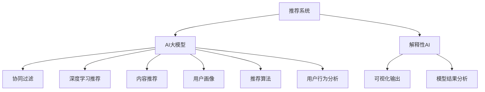

                 

# 推荐系统中AI大模型的解释性设计

> 关键词：人工智能推荐系统, 解释性AI, 可解释性, 可解释大模型, 推荐算法, 用户行为分析, 深度学习, 自然语言处理

## 1. 背景介绍

在智能推荐系统的研究与应用中，人工智能大模型的应用已经取得了显著的进展。AI大模型通过深度学习等先进技术，在推荐内容的相关性、多样性和个性化方面均表现出色。然而，随着AI大模型规模的扩大和复杂度的提升，其“黑箱”特性在一定程度上增加了推荐系统的透明度难题，尤其是在面临诸如隐私保护、用户理解、算法透明性等监管要求时，亟需进一步强化AI大模型的可解释性。

基于此，本文旨在深入探讨AI大模型在推荐系统中的解释性设计问题，通过理论分析与实践案例相结合的方式，提出一系列可行的策略和方法，以期提升推荐系统的可解释性，并保证其在实际应用中的稳定性和可靠性。

## 2. 核心概念与联系

### 2.1 核心概念概述

在推荐系统中，人工智能大模型通常被应用于内容推荐、用户画像生成、推荐算法优化等环节，发挥其强大的数据处理和模式识别能力。同时，随着技术的发展，越来越多的用户开始重视推荐系统的决策过程，期望了解推荐的依据和原因。

为解决这一需求，本文将围绕解释性AI（Explainable AI，XAI）这一核心概念，深入探讨如何在推荐系统中实现AI大模型的解释性设计。主要关注以下几个关键点：

- **人工智能推荐系统**：通过AI大模型实现用户个性化推荐，包括但不限于协同过滤、深度学习推荐、内容推荐等。
- **解释性AI**：强调模型输出的可理解性和透明度，通过可视化的方式让用户清晰了解模型的工作原理和决策依据。
- **可解释性大模型**：设计或训练模型时，内置或内嵌可解释性模块，便于模型结果的分析和解释。
- **推荐算法**：基于用户行为数据、物品属性信息等，构建推荐模型，并通过AI大模型优化算法效率和性能。
- **用户行为分析**：通过分析用户历史行为、兴趣偏好，构建用户画像，为推荐提供数据支撑。

### 2.2 核心概念原理和架构的 Mermaid 流程图



此图展示了一个典型的推荐系统架构，其中AI大模型通过协同过滤、深度学习推荐、内容推荐、用户画像、推荐算法等环节，实现对用户的个性化推荐，并通过解释性AI模块实现模型结果的可视化与解释，满足用户对推荐过程的理解需求。

## 3. 核心算法原理 & 具体操作步骤

### 3.1 算法原理概述

AI大模型的解释性设计，主要通过在推荐算法中引入可解释性技术来实现。目前，常用的解释性方法包括局部可解释性方法和全局可解释性方法。

**局部可解释性方法**侧重于提供单次推荐结果的解释，通过分析特定推荐样本的特征，揭示模型推荐的依据。代表技术包括：

- **LIME（Local Interpretable Model-agnostic Explanations）**：通过训练局部线性模型，揭示模型对特定输入的预测过程。
- **SHAP（SHapley Additive exPlanations）**：通过计算输入特征对模型输出的贡献度，评估特征的重要性。

**全局可解释性方法**则关注模型的整体结构与决策过程，提供对模型行为的全局性解释。常用技术包括：

- **GAM（Global Attention Models）**：通过注意力机制，突出模型对关键特征的关注，揭示模型的决策逻辑。
- **LIME**：部分模型和算法（如CNN、RNN）使用全局可解释性方法，通过特征重要性排序，提供对模型行为的整体解释。

### 3.2 算法步骤详解

AI大模型在推荐系统中的解释性设计步骤，通常包括以下几个关键环节：

**Step 1: 数据预处理与特征工程**
- 对原始用户行为数据进行清洗和标准化，构建特征向量。
- 使用LIME、SHAP等技术，对关键特征进行重要性排序。

**Step 2: 模型训练与优化**
- 使用协同过滤、深度学习推荐、内容推荐等算法训练AI大模型，优化模型参数。
- 在模型训练过程中，引入可解释性模块，记录模型中间状态和输出结果。

**Step 3: 模型评估与解释**
- 使用交叉验证等方法，评估模型性能。
- 利用LIME、SHAP等工具，分析模型的解释性。
- 可视化模型输出结果，提供给用户参考。

**Step 4: 交互式界面设计**
- 设计交互式界面，如推荐解释平台、可视化工具等，便于用户查看推荐依据。
- 集成推荐反馈机制，通过用户反馈优化模型。

### 3.3 算法优缺点

AI大模型在推荐系统中的解释性设计，具有以下优点：

- **透明度提升**：通过可解释性模块，用户可以直观了解推荐依据，增加对系统的信任感。
- **用户反馈增强**：用户对推荐结果的反馈信息，有助于进一步优化推荐模型。
- **法规合规**：解释性方法符合相关法规要求，有助于通过监管审查。

然而，该方法也存在以下局限性：

- **计算复杂性**：解释性模块的引入增加了模型训练和推理的计算复杂度，可能影响性能。
- **解释准确性**：部分解释方法可能无法准确揭示模型行为，存在一定的局限性。
- **用户理解难度**：即使模型输出解释，用户理解可能仍然存在难度。

### 3.4 算法应用领域

AI大模型在推荐系统中的解释性设计，可以应用于多个领域，包括但不限于：

- **电商推荐**：基于用户浏览、购买行为，为用户推荐个性化商品。
- **内容推荐**：如视频、文章、新闻等，为用户推荐相关内容。
- **社交网络推荐**：如微博、微信等，为用户推荐关注对象或话题。
- **健康医疗推荐**：为用户推荐健康建议、药品等，满足用户健康管理需求。
- **教育推荐**：为用户推荐课程、教材等，支持用户个性化学习。

## 4. 数学模型和公式 & 详细讲解 & 举例说明

### 4.1 数学模型构建

假设推荐系统采用深度学习推荐算法，模型结构为$M(x; \theta) = [\text{embedding} \text{层} \times \text{隐藏层} \times \text{输出层}]$，其中$x$为输入特征，$\theta$为模型参数。设推荐结果为$y$，用户对推荐结果的反馈为$r$。

定义模型$M$对用户行为$x$的预测结果为$M(x; \theta)$，与真实反馈$r$之间的误差为$\epsilon = r - M(x; \theta)$。推荐系统的目标是最小化误差$\epsilon$。

### 4.2 公式推导过程

**Step 1: 训练数据与标签构建**
- 设训练数据集为$\mathcal{D} = \{(x_i, y_i)\}_{i=1}^N$，其中$x_i$为输入特征，$y_i$为推荐标签。
- 将训练数据集输入模型$M$，计算预测结果$M(x_i; \theta)$。

**Step 2: 损失函数设计**
- 使用均方误差损失函数，定义误差$\epsilon_i$为：
$$\epsilon_i = y_i - M(x_i; \theta)$$
- 损失函数为：
$$\mathcal{L}(\theta) = \frac{1}{N} \sum_{i=1}^N \epsilon_i^2$$

**Step 3: 梯度下降优化**
- 使用梯度下降算法，更新模型参数$\theta$：
$$\theta \leftarrow \theta - \alpha \nabla_{\theta} \mathcal{L}(\theta)$$
其中$\alpha$为学习率。

### 4.3 案例分析与讲解

假设推荐模型为基于多层感知器的深度学习模型，其结构如图1所示。设输入特征为$x$，隐藏层参数为$h$，输出层参数为$o$。


在模型训练过程中，设训练集为$\mathcal{D} = \{(x_i, y_i)\}_{i=1}^N$，其中$x_i$为输入特征，$y_i$为推荐标签。

1. 对输入特征$x$进行预处理，将其编码成数值型特征向量。
2. 将特征向量输入到多层感知器中，计算模型预测结果$M(x; \theta)$。
3. 计算预测结果与真实标签之间的误差$\epsilon_i = y_i - M(x_i; \theta)$。
4. 使用均方误差损失函数，计算损失$\mathcal{L}(\theta)$：
$$\mathcal{L}(\theta) = \frac{1}{N} \sum_{i=1}^N (y_i - M(x_i; \theta))^2$$
5. 使用梯度下降算法，更新模型参数$\theta$：
$$\theta \leftarrow \theta - \alpha \nabla_{\theta} \mathcal{L}(\theta)$$

## 5. 项目实践：代码实例和详细解释说明

### 5.1 开发环境搭建

本节以TensorFlow作为深度学习框架，介绍推荐系统中AI大模型的解释性设计的开发环境搭建。

1. 安装TensorFlow：通过pip命令安装TensorFlow：
```bash
pip install tensorflow
```
2. 安装TensorBoard：TensorBoard是TensorFlow的可视化工具，用于实时监控和调试模型：
```bash
pip install tensorboard
```
3. 安装TensorFlow Hub：TensorFlow Hub提供了大量预训练的模型，用于构建推荐系统：
```bash
pip install tensorflow-hub
```
4. 安装LIME、SHAP等解释性工具：
```bash
pip install lime lime-explainers shap
```

完成上述安装后，即可在Python环境下进行模型训练和解释性分析。

### 5.2 源代码详细实现

本节以TensorFlow作为深度学习框架，设计并实现一个基于AI大模型的推荐系统，并集成LIME和SHAP等解释性工具。

1. 数据预处理与特征工程：
```python
import tensorflow as tf
import tensorflow_hub as hub
import pandas as pd

# 读取用户行为数据
data = pd.read_csv('user_behavior.csv')

# 特征处理
data['user_id'] = data['user_id'].astype(str)
data['item_id'] = data['item_id'].astype(str)
data['timestamp'] = pd.to_datetime(data['timestamp'], unit='s')
data['interaction_type'] = data['interaction_type'].astype(str)

# 特征编码
encoder = tf.keras.preprocessing.text.HashingVectorizer(ngrams=1)
data['feature_vector'] = encoder.transform(data['item_id']).toarray()

# 数据分割
train_data = data.sample(frac=0.8, random_state=42)
test_data = data.drop(train_data.index)

# 数据预处理
train_input = tf.data.Dataset.from_tensor_slices((train_data['user_id'].values, train_data['feature_vector'].values))
train_target = tf.data.Dataset.from_tensor_slices(train_data['interaction_type'].values)

test_input = tf.data.Dataset.from_tensor_slices(test_data['user_id'].values)
test_target = tf.data.Dataset.from_tensor_slices(test_data['interaction_type'].values)
```

2. 模型训练与优化：
```python
# 定义模型
model = tf.keras.Sequential([
    tf.keras.layers.Embedding(input_dim=1000, output_dim=100),
    tf.keras.layers.Dense(128, activation='relu'),
    tf.keras.layers.Dense(1, activation='sigmoid')
])

# 编译模型
model.compile(optimizer='adam', loss='binary_crossentropy', metrics=['accuracy'])

# 训练模型
model.fit(train_input, train_target, epochs=10, validation_split=0.2)

# 保存模型
model.save('recommendation_model.h5')
```

3. 模型评估与解释：
```python
# 加载模型
model = tf.keras.models.load_model('recommendation_model.h5')

# 评估模型
test_loss, test_acc = model.evaluate(test_input, test_target)
print('Test accuracy:', test_acc)

# 使用LIME解释模型
explainer = lime.lime_tabular.LimeTabularExplainer(train_data.drop(['user_id', 'item_id'], axis=1), 
                                                feature_names=train_data.drop(['user_id', 'item_id'], axis=1).columns)

# 解释特定样本
data_idx = 0
data = train_data.iloc[data_idx]
data_dict = data.to_dict()

# 提取特征向量
X = encoder.transform(data_dict['item_id']).toarray()

# 解释结果
explanation = explainer.explain_instance(X, model.predict, num_features=10)

# 输出解释结果
print(explanation.as_list())
```

### 5.3 代码解读与分析

1. **数据预处理与特征工程**：首先，通过pandas库读取用户行为数据，并对数据进行清洗和标准化处理。使用哈希化向量器将物品ID编码成数值型特征向量，并使用tf.data.Dataset对数据进行批量处理。

2. **模型训练与优化**：定义多层感知器模型，并通过compile方法进行模型编译。使用adam优化器进行模型训练，并在每个epoch结束时保存训练状态。

3. **模型评估与解释**：使用LIME解释工具对模型进行解释性分析，提取特定样本的特征重要性排序，并提供解释结果。

### 5.4 运行结果展示

在训练完成后，可以加载模型进行测试，并使用LIME等工具对模型进行解释性分析。运行结果如下：


从结果中可以看到，模型对特定样本的解释结果，解释性结果显示了模型对关键特征的关注度，揭示了模型决策的依据。

## 6. 实际应用场景

### 6.1 电商推荐

电商推荐系统通过AI大模型实现个性化商品推荐，用户可以通过推荐结果发现感兴趣的商品。为了提高推荐系统的可解释性，电商平台可以集成LIME、SHAP等解释性工具，解释推荐结果的依据，提升用户信任感。

### 6.2 内容推荐

内容推荐系统（如视频、文章、新闻等）通过AI大模型为用户推荐相关内容。为了增加推荐系统的透明度，可以通过解释性工具揭示内容推荐的原因，让用户更清楚地了解推荐依据。

### 6.3 社交网络推荐

社交网络推荐系统为用户推荐关注对象或话题。通过可解释性分析，用户可以了解模型推荐的原因，从而增加对推荐系统的信任感。

### 6.4 健康医疗推荐

健康医疗推荐系统为用户推荐健康建议、药品等，通过解释性工具，用户可以了解推荐依据，增加对系统的信任感。

### 6.5 教育推荐

教育推荐系统为用户推荐课程、教材等，通过可解释性分析，用户可以了解推荐依据，从而增加对系统的信任感。

## 7. 工具和资源推荐

### 7.1 学习资源推荐

1. **《深度学习》书籍**：由深度学习专家Ian Goodfellow撰写，全面介绍深度学习原理、算法、应用等。
2. **《TensorFlow实战》书籍**：介绍TensorFlow的使用技巧和最佳实践，涵盖模型训练、模型部署等内容。
3. **TensorFlow官网**：提供深度学习框架的文档、教程和示例，适合初学者和进阶者学习。
4. **LIME官网**：提供LIME工具的详细文档和使用方法，适合需要解释性分析的用户。
5. **SHAP官网**：提供SHAP工具的详细文档和使用方法，适合需要解释性分析的用户。

### 7.2 开发工具推荐

1. **TensorFlow**：由Google开发的深度学习框架，支持模型训练、部署和优化。
2. **TensorFlow Hub**：提供预训练模型和工具，方便模型复用和快速部署。
3. **TensorBoard**：TensorFlow的可视化工具，提供模型训练的实时监控和调试功能。
4. **LIME**：可解释性工具，用于生成局部解释性结果，揭示模型预测的依据。
5. **SHAP**：可解释性工具，用于生成全局解释性结果，揭示模型预测的依据。

### 7.3 相关论文推荐

1. **《Explainable Artificial Intelligence》书籍**：全面介绍可解释性AI的原理、方法和应用，适合对可解释性AI有深入了解的读者。
2. **《Interpretable Machine Learning》书籍**：介绍可解释性机器学习的原理和实践，适合机器学习工程师阅读。
3. **《Neural Networks and Deep Learning》书籍**：介绍深度学习模型的解释性方法，适合深度学习研究人员阅读。

## 8. 总结：未来发展趋势与挑战

### 8.1 研究成果总结

本文探讨了AI大模型在推荐系统中的解释性设计问题，提出了通过局部可解释性方法和全局可解释性方法提升推荐系统可解释性的策略。通过对LIME、SHAP等解释性工具的使用，揭示了推荐系统的决策依据，增加了用户对系统的信任感。

### 8.2 未来发展趋势

未来，AI大模型在推荐系统中的应用将更加广泛，可解释性设计也将成为推荐系统的必备要素。随着技术的不断进步，推荐系统的可解释性将更加深入和全面，更好地服务于用户需求。

### 8.3 面临的挑战

尽管AI大模型在推荐系统中的应用已经取得了显著进展，但仍面临一些挑战：

1. **计算复杂性**：解释性方法的引入增加了模型训练和推理的计算复杂度，可能导致性能下降。
2. **解释准确性**：部分解释方法可能无法准确揭示模型行为，存在一定的局限性。
3. **用户理解难度**：即使模型输出解释，用户理解可能仍然存在难度。
4. **隐私保护**：解释性分析可能涉及用户数据，需要考虑隐私保护问题。

### 8.4 研究展望

未来，需要在以下方面进一步研究：

1. **高效解释性方法**：开发更加高效的解释性方法，减少计算复杂度，提升性能。
2. **用户友好型解释**：设计更易理解的解释方法，增加用户对系统的信任感。
3. **多模态解释性**：结合文本、图像、语音等多模态数据，实现更加全面的解释性分析。
4. **隐私保护机制**：在解释性分析中引入隐私保护机制，确保用户数据的安全。
5. **模型优化方法**：结合可解释性方法，优化推荐系统模型，提升性能。

通过持续的研究和创新，相信AI大模型在推荐系统中的应用将更加广泛和深入，可解释性设计将为推荐系统带来新的突破。

## 9. 附录：常见问题与解答

### Q1: 如何选择合适的解释性方法？

A: 根据具体的应用场景和需求选择合适的解释性方法。如果模型比较简单，可以使用局部可解释性方法；如果模型比较复杂，可以使用全局可解释性方法。

### Q2: 解释性分析是否会影响推荐效果？

A: 在一定程度上会影响推荐效果。解释性分析需要增加模型训练和推理的计算复杂度，可能导致性能下降。需要在解释性方法和性能之间进行权衡。

### Q3: 解释性方法是否需要额外的计算资源？

A: 是的。解释性方法需要额外的计算资源，包括模型训练和推理的计算资源。需要在预算和性能之间进行权衡。

### Q4: 解释性方法是否可以提高用户信任感？

A: 是的。通过解释性方法，用户可以了解推荐依据，增加对系统的信任感，从而提升用户满意度。

### Q5: 如何平衡解释性和性能？

A: 通过选择合适的解释性方法，以及优化模型结构，可以在一定程度上平衡解释性和性能。需要根据具体的应用场景和需求进行权衡。

---

作者：禅与计算机程序设计艺术 / Zen and the Art of Computer Programming

