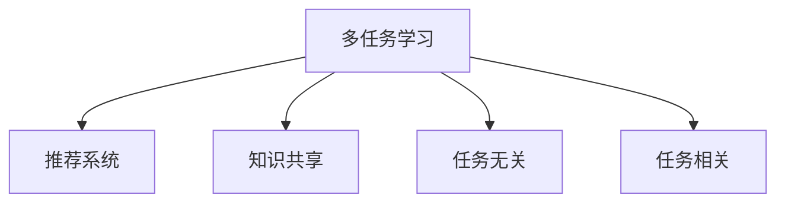

                 

# 推荐系统中的多任务学习：AI大模型的优势

## 1. 背景介绍

### 1.1 问题由来
随着人工智能技术的快速发展，推荐系统已成为互联网公司提升用户体验的重要工具。其核心思想是通过用户行为数据挖掘用户兴趣，从而推荐个性化的内容或商品。传统的推荐系统主要包括基于协同过滤和基于内容的推荐两种方法，但在实际应用中，这些方法往往存在数据稀疏、鲁棒性差等问题。

近年来，深度学习技术在推荐系统中得到了广泛应用。基于深度学习的推荐系统通过对用户行为数据和商品属性进行编码，学习用户对不同商品的兴趣度，进而生成推荐结果。然而，这种单一任务的学习方式，仍难以充分利用大数据带来的广泛知识，且模型的泛化能力有限。

基于此，多任务学习（Multi-task Learning, MTL）应运而生。它利用相关任务间的数据共享，通过联合训练多个相关任务，提升模型的泛化能力和性能。这种多任务学习范式，为推荐系统注入了新的活力。

### 1.2 问题核心关键点
多任务学习在推荐系统中的核心问题包括：
- 如何选择相关任务？
- 如何设计任务间的知识共享机制？
- 如何平衡不同任务之间的性能？
- 如何在多任务学习范式下提升推荐系统的效果？

本文将围绕这些问题，详细探讨多任务学习在推荐系统中的应用，并分析其优势。

## 2. 核心概念与联系

### 2.1 核心概念概述

为更好地理解多任务学习在推荐系统中的应用，本节将介绍几个关键概念：

- 多任务学习（Multi-task Learning, MTL）：通过联合训练多个相关任务，提升模型的泛化能力和性能。MLT可以广泛应用于迁移学习、多标签分类、多目标优化等领域。

- 推荐系统（Recommendation System）：利用用户历史行为数据，为用户推荐个性化内容或商品的系统。推荐系统广泛应用于电商、视频、音乐等场景，是NLP技术在行业中的重要应用之一。

- 知识共享（Knowledge Sharing）：在多任务学习中，通过任务间的知识传递和共享，提升模型的性能。知识共享机制可以基于参数共享、特征共享、模型共享等方式实现。

- 任务无关（Task-agnostic）：对于多个相关任务，通过共享底层表示，学习通用的语言知识，提升模型的泛化能力。

- 任务相关（Task-relevant）：对于多个相关任务，通过在不同任务上优化不同的参数，提升模型针对特定任务的性能。

这些核心概念之间的逻辑关系可以通过以下Mermaid流程图来展示：



这个流程图展示了大模型在推荐系统中的应用，并通过知识共享、任务无关和任务相关等机制，提升模型的泛化能力和性能。

## 3. 核心算法原理 & 具体操作步骤

### 3.1 算法原理概述

多任务学习在推荐系统中的应用，核心思想是通过联合训练多个相关任务，提升模型的泛化能力和性能。具体来说，多任务学习可以通过以下几个步骤实现：

1. **任务定义**：定义推荐系统中的多个相关任务，如用户兴趣预测、商品属性预测、评分预测等。
2. **模型构建**：为每个任务构建一个相关的网络模型，如使用Transformer模型。
3. **数据集划分**：将数据集划分为训练集、验证集和测试集，并对不同任务的数据集进行分割。
4. **联合训练**：联合训练多个任务模型，通过共享底层表示或不同参数的联合优化，提升模型的泛化能力和性能。
5. **任务评估**：在测试集上对每个任务进行评估，比较联合训练前后模型性能的变化。

### 3.2 算法步骤详解

#### 3.2.1 任务定义

推荐系统中的任务可以定义如下：

1. **用户兴趣预测**：预测用户对不同商品的兴趣度。可以使用用户历史行为数据，构建神经网络模型进行预测。
2. **商品属性预测**：预测商品的属性，如价格、评分、类别等。可以使用商品描述数据，构建神经网络模型进行预测。
3. **评分预测**：预测用户对商品的评分，可以使用用户行为数据和商品属性，构建神经网络模型进行预测。

#### 3.2.2 模型构建

对于每个任务，可以使用相同的神经网络模型，如Transformer模型。对于每个任务，模型的输入输出如下：

- **用户兴趣预测**：输入为用户的特征向量，输出为兴趣度的评分。
- **商品属性预测**：输入为商品描述，输出为属性向量。
- **评分预测**：输入为用户行为数据和商品属性，输出为评分向量。

#### 3.2.3 数据集划分

将数据集划分为训练集、验证集和测试集，并对不同任务的数据集进行分割。例如，可以使用交叉验证的方式，将数据集分为K份，每次使用其中一份作为验证集，其余作为训练集。

#### 3.2.4 联合训练

联合训练多个任务模型，可以通过以下两种方式实现：

1. **共享表示（共享底层）**：对于多个任务，共享模型的底层表示，学习通用的语言知识。例如，使用同一Transformer模型的编码器作为多个任务模型的共享表示。
2. **联合优化（不同参数）**：对于多个任务，使用不同的参数进行联合优化。例如，在每个任务模型上使用不同的优化器，联合优化模型的参数。

#### 3.2.5 任务评估

在测试集上对每个任务进行评估，比较联合训练前后模型性能的变化。可以使用各种评估指标，如准确率、召回率、F1-score等。

### 3.3 算法优缺点

多任务学习在推荐系统中的优势包括：

1. **提升泛化能力**：通过联合训练多个相关任务，模型可以学习通用的语言知识，提升模型的泛化能力和泛化性能。
2. **减少过拟合**：通过任务间的知识共享，可以减少模型的过拟合风险，提升模型的稳定性和鲁棒性。
3. **提升性能**：通过优化多个相关任务，可以提升模型的整体性能，尤其是在数据量较少的情况下，提升效果更加显著。

然而，多任务学习也存在一些缺点：

1. **模型复杂度增加**：联合训练多个任务模型，会导致模型复杂度增加，计算资源消耗较大。
2. **任务间知识传递困难**：不同任务之间存在差异，知识传递可能存在一定的难度。
3. **任务平衡难度大**：多任务学习需要平衡不同任务之间的性能，较难找到一个最优的参数组合。

### 3.4 算法应用领域

多任务学习在推荐系统中的应用，可以涵盖以下多个领域：

1. **电商推荐**：利用多任务学习，预测用户对不同商品的兴趣度，推荐个性化商品。
2. **视频推荐**：利用多任务学习，预测用户对不同视频的评分，推荐个性化视频。
3. **音乐推荐**：利用多任务学习，预测用户对不同音乐的评分，推荐个性化音乐。
4. **新闻推荐**：利用多任务学习，预测用户对不同新闻的兴趣度，推荐个性化新闻。
5. **游戏推荐**：利用多任务学习，预测用户对不同游戏的评分，推荐个性化游戏。

## 4. 数学模型和公式 & 详细讲解 & 举例说明

### 4.1 数学模型构建

在推荐系统中，可以使用多任务学习的数学模型如下：

设 $x$ 为输入向量， $y_1, y_2, ..., y_n$ 为不同任务的目标向量。定义 $f(x)$ 为多任务学习的模型，其输出为 $y_1, y_2, ..., y_n$。可以使用以下矩阵表示形式：

$$
\mathbf{y} = \mathbf{f}(\mathbf{x}; \theta)
$$

其中 $\theta$ 为模型参数。

### 4.2 公式推导过程

假设推荐系统中有两个相关任务：用户兴趣预测和评分预测。可以定义以下损失函数：

1. **用户兴趣预测**：$L_{1} = \sum_{i=1}^{N}(l_1 - \hat{l}_1)^2$，其中 $l_1$ 为真实标签， $\hat{l}_1$ 为预测结果。
2. **评分预测**：$L_{2} = \sum_{i=1}^{N}(l_2 - \hat{l}_2)^2$，其中 $l_2$ 为真实评分， $\hat{l}_2$ 为预测评分。

多任务学习的目标是最小化以下损失函数：

$$
L = L_1 + \lambda L_2
$$

其中 $\lambda$ 为任务间平衡系数，可以控制不同任务之间的权重要平衡。

### 4.3 案例分析与讲解

假设推荐系统中有两个相关任务：用户兴趣预测和评分预测。可以定义以下多任务学习的模型：

1. **用户兴趣预测**：$h_1(x; \theta_1) = f_1(x; \theta_1)$，其中 $f_1$ 为单任务模型。
2. **评分预测**：$h_2(x; \theta_2) = f_2(x; \theta_2)$，其中 $f_2$ 为单任务模型。

多任务学习的联合模型可以表示为：

$$
\mathbf{y} = [\mathbf{f}_1(\mathbf{x}; \theta_1), \mathbf{f}_2(\mathbf{x}; \theta_2)]
$$

其中 $\mathbf{f}_1$ 和 $\mathbf{f}_2$ 为多任务模型，分别学习用户兴趣和评分。

## 5. 项目实践：代码实例和详细解释说明

### 5.1 开发环境搭建

在进行多任务学习实践前，我们需要准备好开发环境。以下是使用Python进行TensorFlow开发的环境配置流程：

1. 安装Anaconda：从官网下载并安装Anaconda，用于创建独立的Python环境。

2. 创建并激活虚拟环境：
```bash
conda create -n tf-env python=3.8 
conda activate tf-env
```

3. 安装TensorFlow：从官网获取对应的安装命令。例如：
```bash
pip install tensorflow
```

4. 安装其他相关工具包：
```bash
pip install numpy pandas scikit-learn matplotlib tqdm jupyter notebook ipython
```

完成上述步骤后，即可在`tf-env`环境中开始多任务学习实践。

### 5.2 源代码详细实现

下面我们以电商推荐任务为例，给出使用TensorFlow进行多任务学习的PyTorch代码实现。

首先，定义多任务学习的数据处理函数：

```python
import tensorflow as tf
from tensorflow.keras import layers, models

def preprocess_data(train_data, test_data):
    # 定义数据预处理函数
    # 将数据转换为TensorFlow的Tensor对象
    # ...
    
    return train_data, test_data
```

然后，定义多任务学习的模型：

```python
def build_model():
    # 定义多任务学习模型
    # 定义多个单任务模型
    # ...
    
    return model
```

接着，定义多任务学习的优化器：

```python
def build_optimizer(model):
    # 定义多任务学习的优化器
    # 使用Adam优化器进行联合训练
    # ...
    
    return optimizer
```

最后，启动多任务学习流程：

```python
epochs = 10
batch_size = 128

# 加载数据
train_data, test_data = preprocess_data(train_data, test_data)

# 构建模型和优化器
model = build_model()
optimizer = build_optimizer(model)

# 联合训练
for epoch in range(epochs):
    # 在训练集上训练
    # 在验证集上评估
    # ...
    
    evaluate_model(model, test_data)
```

以上就是使用TensorFlow进行多任务学习的完整代码实现。可以看到，通过使用TensorFlow的Keras API，可以方便地定义多任务学习模型，进行联合训练和评估。

### 5.3 代码解读与分析

让我们再详细解读一下关键代码的实现细节：

**preprocess_data函数**：
- 定义数据预处理函数，将原始数据转换为TensorFlow的Tensor对象。
- 数据预处理可以包括数据清洗、标准化、分词等操作。
- 返回预处理后的训练集和测试集。

**build_model函数**：
- 定义多任务学习模型，包含多个单任务模型。
- 每个单任务模型可以使用相同的神经网络结构，如Transformer模型。
- 在每个单任务模型上定义不同的输出层和损失函数。

**build_optimizer函数**：
- 定义多任务学习的优化器。
- 使用Adam优化器进行联合训练，可以优化多个任务模型。
- 设置不同任务之间的权重平衡，控制不同任务之间的影响。

**训练流程**：
- 加载数据，构建模型和优化器。
- 在训练集上训练，每个epoch后对验证集进行评估，选择最优模型。
- 在测试集上评估模型性能，输出评估结果。

可以看到，TensorFlow提供的Keras API使得多任务学习的实现变得简洁高效。开发者可以将更多精力放在数据处理、模型改进等高层逻辑上，而不必过多关注底层的实现细节。

当然，工业级的系统实现还需考虑更多因素，如模型的保存和部署、超参数的自动搜索、更灵活的任务适配层等。但核心的多任务学习范式基本与此类似。

## 6. 实际应用场景

### 6.1 电商平台推荐

电商平台推荐是推荐系统应用的重要场景之一。传统的推荐系统往往只依赖用户历史行为数据进行推荐，难以捕捉到用户的潜在意图和兴趣。通过多任务学习，可以利用用户兴趣预测和商品属性预测，生成更个性化的推荐结果。

具体而言，可以收集用户的历史浏览、购买、评分等行为数据，同时收集商品的描述、价格、类别等属性数据。将数据作为输入，构建多任务学习模型，学习用户对不同商品的兴趣和评分。在推荐时，将用户行为数据和商品属性数据输入模型，生成推荐结果。

### 6.2 视频平台推荐

视频平台推荐是推荐系统应用的另一个重要场景。视频平台推荐需要考虑用户对视频的观看时长、评分、点击等行为数据，以及视频本身的内容、类别、时长等属性数据。通过多任务学习，可以利用用户行为预测和视频属性预测，生成更个性化的推荐结果。

具体而言，可以收集用户的历史观看、评分、点击等行为数据，同时收集视频的描述、时长、类别等属性数据。将数据作为输入，构建多任务学习模型，学习用户对不同视频的兴趣和评分。在推荐时，将用户行为数据和视频属性数据输入模型，生成推荐结果。

### 6.3 音乐平台推荐

音乐平台推荐是推荐系统应用的又一个重要场景。音乐平台推荐需要考虑用户对音乐的歌曲、歌手、时长等属性数据，以及用户的历史播放、评分、收藏等行为数据。通过多任务学习，可以利用用户行为预测和音乐属性预测，生成更个性化的推荐结果。

具体而言，可以收集用户的历史播放、评分、收藏等行为数据，同时收集音乐的歌曲、歌手、时长等属性数据。将数据作为输入，构建多任务学习模型，学习用户对不同音乐的兴趣和评分。在推荐时，将用户行为数据和音乐属性数据输入模型，生成推荐结果。

## 7. 工具和资源推荐

### 7.1 学习资源推荐

为了帮助开发者系统掌握多任务学习在推荐系统中的应用，这里推荐一些优质的学习资源：

1. 《深度学习在推荐系统中的应用》系列博文：由大模型技术专家撰写，深入浅出地介绍了深度学习在推荐系统中的应用，包括多任务学习在内。

2. Coursera《深度学习在推荐系统中的应用》课程：斯坦福大学开设的推荐系统课程，有Lecture视频和配套作业，带你入门推荐系统领域的基本概念和经典模型。

3. 《深度学习与推荐系统》书籍：介绍了深度学习在推荐系统中的应用，包括多任务学习在内的多个范式。

4. TensorFlow官方文档：TensorFlow的官方文档，提供了丰富的多任务学习样例代码，是上手实践的必备资料。

5. Kaggle推荐系统竞赛：通过参与推荐系统竞赛，可以了解多任务学习在实际应用中的最佳实践和优化方法。

通过对这些资源的学习实践，相信你一定能够快速掌握多任务学习在推荐系统中的应用，并用于解决实际的推荐问题。

### 7.2 开发工具推荐

高效的开发离不开优秀的工具支持。以下是几款用于多任务学习推荐的常用工具：

1. TensorFlow：由Google主导开发的开源深度学习框架，生产部署方便，适合大规模工程应用。提供了丰富的多任务学习功能，支持多任务学习模型的构建和训练。

2. PyTorch：基于Python的开源深度学习框架，灵活动态的计算图，适合快速迭代研究。提供了丰富的多任务学习库，方便构建和优化多任务学习模型。

3. Keras：由Google开发的深度学习库，简洁易用，适合初学者上手。提供了丰富的多任务学习模型和优化器，方便构建和训练多任务学习模型。

4. Weights & Biases：模型训练的实验跟踪工具，可以记录和可视化模型训练过程中的各项指标，方便对比和调优。与主流深度学习框架无缝集成。

5. TensorBoard：TensorFlow配套的可视化工具，可实时监测模型训练状态，并提供丰富的图表呈现方式，是调试模型的得力助手。

合理利用这些工具，可以显著提升多任务学习推荐的开发效率，加快创新迭代的步伐。

### 7.3 相关论文推荐

多任务学习在推荐系统中的应用源于学界的持续研究。以下是几篇奠基性的相关论文，推荐阅读：

1. Multi-Task Learning Using Uncertainty-Weighted Feature Aggregation：提出使用不确定性加权特征聚合的多任务学习方法，提升了推荐系统的性能。

2. Adaptive Multi-Task Learning for Recommender Systems：提出自适应多任务学习算法，提升推荐系统的泛化能力和性能。

3. Multi-Task Multi-Label Multi-Objective Learning with a Multi-task Group Lasso：提出多任务多标签多目标学习算法，提升推荐系统的复杂任务处理能力。

4. Meta Learning of Generalized Recommendation Networks：提出元学习推荐网络的方法，提升推荐系统的自适应能力和泛化能力。

5. Learning to Optimize for Recommendation with Multi-task Structured Prediction：提出多任务结构预测的方法，提升推荐系统的优化能力和性能。

这些论文代表了大模型在推荐系统中的多任务学习的发展脉络。通过学习这些前沿成果，可以帮助研究者把握学科前进方向，激发更多的创新灵感。

## 8. 总结：未来发展趋势与挑战

### 8.1 总结

本文对多任务学习在推荐系统中的应用进行了全面系统的介绍。首先阐述了多任务学习在推荐系统中的背景和意义，明确了多任务学习在提升模型泛化能力和性能方面的独特价值。其次，从原理到实践，详细讲解了多任务学习的数学原理和关键步骤，给出了多任务学习任务开发的完整代码实例。同时，本文还广泛探讨了多任务学习在电商平台推荐、视频平台推荐、音乐平台推荐等多个行业领域的应用前景，展示了多任务学习范式的巨大潜力。此外，本文精选了多任务学习的各类学习资源，力求为读者提供全方位的技术指引。

通过本文的系统梳理，可以看到，多任务学习在推荐系统中展示了广阔的应用前景，极大地提升了推荐系统的性能和应用范围。未来，伴随深度学习技术的发展，多任务学习必将在推荐系统中扮演越来越重要的角色。

### 8.2 未来发展趋势

展望未来，多任务学习在推荐系统中的应用将呈现以下几个发展趋势：

1. **深度模型融合**：随着深度学习模型的不断发展，未来的推荐系统将融合更多的深度学习模型，如Transformer、CNN、RNN等，提升模型的泛化能力和性能。

2. **多领域融合**：未来的推荐系统将融合更多领域的数据，如文本、图像、音频等，提升推荐系统的跨领域泛化能力。

3. **实时推荐**：未来的推荐系统将实时捕捉用户行为数据，生成实时的推荐结果，提升用户体验。

4. **个性化推荐**：未来的推荐系统将更注重个性化推荐，提升推荐系统的精准度和用户满意度。

5. **多任务多目标优化**：未来的推荐系统将优化更多目标，如点击率、转化率、广告点击率等，提升推荐系统的综合效果。

6. **多任务鲁棒性优化**：未来的推荐系统将优化模型的鲁棒性，提升模型在不同数据分布下的性能。

以上趋势凸显了多任务学习在推荐系统中的广阔前景。这些方向的探索发展，必将进一步提升推荐系统的性能和应用范围，为人工智能技术在各个领域的应用带来新的突破。

### 8.3 面临的挑战

尽管多任务学习在推荐系统中的应用已经取得了显著成效，但在迈向更加智能化、普适化应用的过程中，它仍面临诸多挑战：

1. **数据稀疏问题**：推荐系统往往需要大量的用户行为数据，但在实际应用中，用户行为数据稀疏，难以获得充足的高质量数据。

2. **过拟合问题**：多任务学习模型在联合训练时，容易发生过拟合问题，影响模型的泛化能力。

3. **模型复杂度**：多任务学习模型往往较为复杂，计算资源消耗较大，难以在大规模系统中高效部署。

4. **模型可解释性**：多任务学习模型较为复杂，难以解释其内部工作机制和决策逻辑，不利于模型的部署和维护。

5. **数据隐私问题**：推荐系统需要收集大量用户行为数据，涉及用户隐私问题，需要合理的隐私保护措施。

6. **模型鲁棒性**：推荐系统需要在不同数据分布下保持稳定性和鲁棒性，避免因数据变化导致模型性能下降。

以上挑战需要研究者不断优化模型、改进算法、完善数据管理措施，方能实现多任务学习在推荐系统中的广泛应用。

### 8.4 研究展望

面对多任务学习在推荐系统中面临的挑战，未来的研究需要在以下几个方面寻求新的突破：

1. **数据增强**：通过数据增强技术，扩充数据集，提升模型的泛化能力和性能。

2. **模型优化**：通过模型优化技术，如模型裁剪、量化加速等，提升模型的实时性和效率。

3. **模型压缩**：通过模型压缩技术，如知识蒸馏、模型剪枝等，减小模型复杂度，提升模型的可解释性和鲁棒性。

4. **隐私保护**：通过隐私保护技术，如差分隐私、联邦学习等，保护用户隐私，同时提升推荐系统的安全性。

5. **跨领域融合**：通过跨领域融合技术，提升推荐系统的跨领域泛化能力，实现多领域数据融合的推荐。

6. **实时推荐**：通过实时推荐技术，捕捉用户实时行为数据，生成实时的推荐结果，提升用户体验。

这些研究方向将引领多任务学习在推荐系统中的应用走向更加成熟和稳健。相信通过这些技术的不断优化，多任务学习必将在推荐系统中发挥更大的作用，推动人工智能技术在各个领域的广泛应用。

## 9. 附录：常见问题与解答

**Q1：多任务学习在推荐系统中的应用如何平衡不同任务之间的性能？**

A: 在多任务学习中，可以定义不同任务之间的平衡系数，控制不同任务之间的影响。例如，可以通过设定不同的损失函数权重，平衡不同任务之间的性能。另外，可以使用Dropout、正则化等技术，避免任务之间的知识传递导致性能下降。

**Q2：多任务学习中的任务无关和任务相关是什么含义？**

A: 在多任务学习中，任务无关指的是通过共享底层表示，学习通用的语言知识，提升模型的泛化能力。任务相关指的是通过在不同任务上优化不同的参数，提升模型针对特定任务的性能。任务无关和任务相关需要根据具体任务和数据特点进行平衡，以达到最优的模型性能。

**Q3：多任务学习中的知识共享机制有哪些？**

A: 在多任务学习中，知识共享机制可以基于参数共享、特征共享、模型共享等方式实现。参数共享指的是在多个任务中共享模型参数，学习通用的语言知识。特征共享指的是在多个任务中共享特征表示，提升模型的泛化能力。模型共享指的是在多个任务中共享模型结构，提升模型的通用性和可解释性。

**Q4：多任务学习在推荐系统中的应用如何提升推荐系统的泛化能力和性能？**

A: 多任务学习在推荐系统中的应用，通过联合训练多个相关任务，共享底层表示，学习通用的语言知识，提升模型的泛化能力和性能。同时，通过优化不同任务之间的参数，提升模型针对特定任务的性能。例如，在电商推荐中，联合训练用户兴趣预测和评分预测，提升模型的泛化能力和性能。

**Q5：多任务学习中的损失函数有哪些？**

A: 在多任务学习中，常用的损失函数包括交叉熵损失、均方误差损失、二元交叉熵损失等。不同的任务可以使用不同的损失函数，也可以共同定义一个综合损失函数。例如，在电商推荐中，可以使用交叉熵损失预测用户兴趣，使用均方误差损失预测评分。

这些常见问题的解答，将帮助开发者更好地理解多任务学习在推荐系统中的应用，提升其开发和实践能力。

