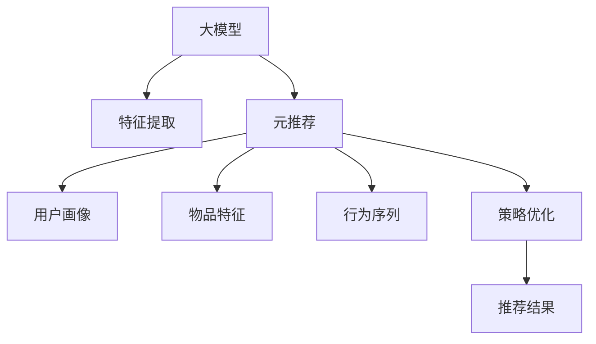

                 

# 推荐系统中的大模型元策略优化应用

## 1. 背景介绍

推荐系统在现代互联网应用中扮演着越来越重要的角色，从电商网站到社交网络，从视频平台到新闻客户端，推荐算法正在改变着用户的浏览习惯和消费决策。随着数据量的不断增长和用户偏好的日益复杂，推荐系统也在不断进化，从基于协同过滤的朴素推荐，到引入深度学习的序列推荐，再到时下流行的基于大模型的元推荐。大模型元推荐方法通过预训练大模型进行特征提取和策略优化，能够充分利用数据中的隐含信息，实现更加精准、多样化的推荐结果。

本文聚焦于大模型元推荐技术中的策略优化应用，旨在通过系统的理论分析和实践指导，帮助读者深入理解该领域的前沿技术，并应用于实际推荐场景。

## 2. 核心概念与联系

### 2.1 核心概念概述

要理解大模型元推荐，首先需要掌握以下核心概念：

- **大模型(Generative Models)**：指基于深度神经网络架构，通过大规模数据训练得到的通用模型，如BERT、GPT-3等。大模型具有强大的特征提取能力，能够学习丰富的语义和结构信息，适用于多种推荐任务。

- **元推荐(Meta-Recommendation)**：指通过构建一个通用的大模型，对推荐系统的各个组件(如用户画像、物品特征、行为序列等)进行联合训练和优化，以提升推荐模型的整体性能。元推荐能够泛化到不同的推荐场景，实现更灵活、更高效的推荐策略。

- **策略优化(Strategy Optimization)**：指在元推荐过程中，针对具体的推荐任务，优化元推荐模型的某些策略参数，以适应不同的推荐场景和用户需求。常见的策略参数包括学习率、正则化强度、采样方式等。

### 2.2 核心概念原理和架构的 Mermaid 流程图



这个流程图展示了元推荐系统的核心架构：

1. **大模型**：作为通用的特征提取器，对用户画像、物品特征和行为序列进行编码。
2. **用户画像**：通过模型抽取用户的历史行为和兴趣特征。
3. **物品特征**：对物品的元数据进行编码。
4. **行为序列**：捕捉用户行为的时间序列特征。
5. **策略优化**：根据特定推荐任务，调整模型的参数和策略。
6. **推荐结果**：通过优化策略生成推荐列表。

## 3. 核心算法原理 & 具体操作步骤

### 3.1 算法原理概述

大模型元推荐技术主要分为三个步骤：预训练、元推荐和策略优化。其核心思想是通过预训练学习到通用的特征表示，然后对元推荐模型进行微调，以适应特定的推荐场景。具体的算法原理如下：

1. **预训练阶段**：在大规模无标注数据上训练大模型，学习通用的特征表示。

2. **元推荐阶段**：在预训练模型的基础上，利用标注数据进行微调，学习用户画像、物品特征和行为序列的联合表示。

3. **策略优化阶段**：根据特定推荐任务，优化元推荐模型的策略参数，如学习率、正则化强度、采样方式等。

### 3.2 算法步骤详解

下面是元推荐和策略优化的详细步骤：

**Step 1: 数据预处理**
- 收集用户画像数据，包括用户ID、历史行为、兴趣标签等。
- 收集物品特征数据，包括物品ID、元数据、分类标签等。
- 收集行为序列数据，包括用户ID、时间戳、互动行为等。
- 对数据进行标准化和归一化处理，方便模型学习。

**Step 2: 大模型预训练**
- 使用预训练语言模型(如BERT、GPT等)对用户画像、物品特征和行为序列进行编码。
- 在预训练阶段，可以使用自监督学习任务，如语言模型掩码预测、序列重构等，增强模型的语义理解能力。
- 保存预训练模型的参数，用于后续的元推荐和策略优化。

**Step 3: 元推荐模型微调**
- 在预训练模型的基础上，使用标注数据进行元推荐模型的微调。
- 微调目标函数可以是点击率预测、转化率预测、评分预测等。
- 微调过程可以使用基于梯度的优化算法，如Adam、SGD等。

**Step 4: 策略优化**
- 针对特定推荐场景，选择适合的策略参数。
- 常见的策略参数包括学习率、正则化强度、采样方式等。
- 通过交叉验证等方法，找到最优的策略参数组合。

**Step 5: 推荐结果生成**
- 使用优化后的策略参数，生成推荐结果。
- 可以结合其他优化技术，如A/B测试、随机采样等，进一步提升推荐效果。

### 3.3 算法优缺点

大模型元推荐技术具有以下优点：

- 强泛化能力：大模型通过预训练学习到通用的特征表示，能够适应多种推荐场景。
- 高效可解释：元推荐模型和策略优化过程可解释性强，便于调整和优化。
- 灵活性高：可以根据不同的推荐场景，灵活调整策略参数，实现更加定制化的推荐。

但同时也存在一些缺点：

- 数据依赖性高：大模型依赖于大规模标注数据进行微调，数据成本较高。
- 计算复杂度高：大模型和元推荐模型的训练计算量较大，对硬件资源要求高。
- 参数复杂度高：大模型和元推荐模型包含大量参数，模型优化难度大。

### 3.4 算法应用领域

大模型元推荐技术可以广泛应用于多种推荐场景，如：

- 电商推荐：根据用户历史行为和浏览记录，推荐商品和促销活动。
- 视频推荐：根据用户观看历史和评分，推荐视频内容和频道。
- 新闻推荐：根据用户阅读历史和点击行为，推荐新闻文章和作者。
- 社交推荐：根据用户互动历史和兴趣标签，推荐好友和内容。
- 旅游推荐：根据用户旅行历史和偏好，推荐旅游目的地和活动。

## 4. 数学模型和公式 & 详细讲解 & 举例说明

### 4.1 数学模型构建

在元推荐中，通常使用二分类损失函数进行目标函数的设计。假设元推荐模型的预测结果为 $y\in\{0,1\}$，真实标签为 $t\in\{0,1\}$，则二分类交叉熵损失函数为：

$$
L(y,t) = -[t\log(y) + (1-t)\log(1-y)]
$$

其中 $y$ 为模型的预测概率。

### 4.2 公式推导过程

在二分类损失函数的基础上，我们可以推导出元推荐模型的优化目标。假设训练集为 $D=\{(x_i,y_i)\}_{i=1}^N$，其中 $x_i$ 为输入，$y_i$ 为标签，则目标函数为：

$$
\mathcal{L}(\theta) = \frac{1}{N}\sum_{i=1}^N L(y_i,\hat{y_i})
$$

其中 $\theta$ 为模型参数，$\hat{y_i}$ 为模型的预测结果。

通过梯度下降等优化算法，我们可以更新模型参数，最小化损失函数。常见的优化算法包括Adam、SGD等。

### 4.3 案例分析与讲解

以电商推荐为例，假设用户画像为 $X$，物品特征为 $I$，行为序列为 $S$。我们定义元推荐模型 $F(X,I,S)$，通过预训练大模型进行特征提取，然后利用标注数据进行微调。微调的目标函数为：

$$
\mathcal{L}(\theta) = \frac{1}{N}\sum_{i=1}^N L(y_i,F(X_i,I_i,S_i))
$$

其中 $y_i$ 为标注数据，$F(X_i,I_i,S_i)$ 为模型的预测结果。

在微调过程中，我们可以考虑加入正则化项，避免过拟合：

$$
\mathcal{L}(\theta) = \frac{1}{N}\sum_{i=1}^N L(y_i,F(X_i,I_i,S_i)) + \lambda \sum_{k=1}^K ||w_k||^2
$$

其中 $w_k$ 为模型参数，$\lambda$ 为正则化系数，$K$ 为模型参数数量。

通过上述目标函数，我们可以使用梯度下降等优化算法对模型进行微调，生成推荐结果。

## 5. 项目实践：代码实例和详细解释说明

### 5.1 开发环境搭建

在进行大模型元推荐实践前，我们需要准备好开发环境。以下是使用Python进行PyTorch开发的环境配置流程：

1. 安装Anaconda：从官网下载并安装Anaconda，用于创建独立的Python环境。

2. 创建并激活虚拟环境：
```bash
conda create -n pytorch-env python=3.8 
conda activate pytorch-env
```

3. 安装PyTorch：根据CUDA版本，从官网获取对应的安装命令。例如：
```bash
conda install pytorch torchvision torchaudio cudatoolkit=11.1 -c pytorch -c conda-forge
```

4. 安装Transformers库：
```bash
pip install transformers
```

5. 安装各类工具包：
```bash
pip install numpy pandas scikit-learn matplotlib tqdm jupyter notebook ipython
```

完成上述步骤后，即可在`pytorch-env`环境中开始元推荐实践。

### 5.2 源代码详细实现

以下是使用PyTorch实现电商推荐系统的元推荐和策略优化代码：

```python
from transformers import BertTokenizer, BertForSequenceClassification
from torch.utils.data import Dataset, DataLoader
from sklearn.metrics import roc_auc_score
import torch.nn as nn
import torch.optim as optim

# 数据准备
class RecommendationDataset(Dataset):
    def __init__(self, data, tokenizer):
        self.data = data
        self.tokenizer = tokenizer
        
    def __len__(self):
        return len(self.data)
    
    def __getitem__(self, item):
        item = self.data[item]
        user_profile = item['user_profile']
        item_id = item['item_id']
        behavior_sequence = item['behavior_sequence']
        
        encoding = self.tokenizer(user_profile, item_id, behavior_sequence, return_tensors='pt')
        user_profile_ids = encoding['input_ids']
        item_id_ids = encoding['input_ids']
        behavior_sequence_ids = encoding['input_ids']
        attention_mask = encoding['attention_mask']
        
        return {'user_profile_ids': user_profile_ids, 'item_id_ids': item_id_ids, 'behavior_sequence_ids': behavior_sequence_ids, 'attention_mask': attention_mask}

# 模型加载和优化
tokenizer = BertTokenizer.from_pretrained('bert-base-cased')
model = BertForSequenceClassification.from_pretrained('bert-base-cased', num_labels=2)
optimizer = optim.Adam(model.parameters(), lr=1e-5)
scheduler = optim.lr_scheduler.CosineAnnealingLR(optimizer, T_max=100)

# 训练函数
def train_epoch(model, data_loader, device, optimizer):
    model.to(device)
    model.train()
    epoch_loss = 0
    epoch_auc = 0
    for batch in data_loader:
        user_profile_ids = batch['user_profile_ids'].to(device)
        item_id_ids = batch['item_id_ids'].to(device)
        behavior_sequence_ids = batch['behavior_sequence_ids'].to(device)
        attention_mask = batch['attention_mask'].to(device)
        
        outputs = model(user_profile_ids, item_id_ids, behavior_sequence_ids, attention_mask=attention_mask)
        loss = outputs.loss
        auc = roc_auc_score(batch['labels'], outputs.logits)
        
        epoch_loss += loss.item()
        epoch_auc += auc
        
        loss.backward()
        optimizer.step()
        scheduler.step()
    return epoch_loss / len(data_loader), epoch_auc / len(data_loader)

# 测试函数
def evaluate(model, data_loader, device):
    model.eval()
    auc = 0
    for batch in data_loader:
        user_profile_ids = batch['user_profile_ids'].to(device)
        item_id_ids = batch['item_id_ids'].to(device)
        behavior_sequence_ids = batch['behavior_sequence_ids'].to(device)
        attention_mask = batch['attention_mask'].to(device)
        
        outputs = model(user_profile_ids, item_id_ids, behavior_sequence_ids, attention_mask=attention_mask)
        auc += roc_auc_score(batch['labels'], outputs.logits)
        
    return auc / len(data_loader)

# 加载数据和模型
train_dataset = RecommendationDataset(train_data, tokenizer)
dev_dataset = RecommendationDataset(dev_data, tokenizer)
test_dataset = RecommendationDataset(test_data, tokenizer)
model.to(device)

# 训练和评估
epochs = 5
batch_size = 16

for epoch in range(epochs):
    train_loss, train_auc = train_epoch(model, train_dataset, device, optimizer)
    dev_auc = evaluate(model, dev_dataset, device)
    
    print(f'Epoch {epoch+1}, train loss: {train_loss:.4f}, train auc: {train_auc:.4f}, dev auc: {dev_auc:.4f}')
    
print(f'Test auc: {evaluate(model, test_dataset, device):.4f}')
```

### 5.3 代码解读与分析

**数据准备**：

- `RecommendationDataset`类：用于加载和预处理数据，包括用户画像、物品特征和行为序列。
- 将数据转换为BERT可接受的格式，并使用`tokenizer`进行编码。

**模型加载和优化**：

- 使用预训练的BERT模型进行特征提取。
- 定义Adam优化器，设置学习率和学习率调度器。

**训练和评估**：

- `train_epoch`函数：对数据进行批次化处理，并在每个批次上进行前向传播和反向传播，更新模型参数。
- `evaluate`函数：在测试集上进行评估，计算AUC值。
- 训练和评估过程在每个epoch结束后输出训练和验证的AUC值。

**训练和测试过程**：

- 在训练和测试过程中，将模型和数据分别移动到GPU上。
- 使用模型在训练集上进行迭代训练，并在验证集上进行评估。
- 使用优化器和调度器调整学习率，以适应不同的训练阶段。

## 6. 实际应用场景

### 6.1 电商推荐

电商推荐是元推荐技术的重要应用场景之一。电商推荐系统通过分析用户的浏览和购买历史，推荐相关商品和促销活动，提升用户体验和销售额。

具体而言，在电商推荐中，大模型元推荐可以结合用户画像、物品特征和行为序列，进行联合训练和微调，学习用户和商品的潜在关联。通过优化模型的学习率、正则化强度、采样方式等策略参数，可以在不同的推荐场景下，生成精准、多样化的推荐结果。

### 6.2 视频推荐

视频推荐系统通过分析用户的观看历史和评分，推荐相关视频内容和频道。大模型元推荐可以融合用户画像、物品特征和行为序列，学习视频内容的多维特征，生成更加个性化的推荐结果。

在视频推荐中，可以引入视频帧的视觉特征，结合用户行为特征，进行联合训练和微调。通过优化模型的策略参数，可以在不同的推荐场景下，生成更具吸引力的推荐结果。

### 6.3 新闻推荐

新闻推荐系统通过分析用户的阅读历史和点击行为，推荐相关新闻文章和作者。大模型元推荐可以融合用户画像、物品特征和行为序列，学习新闻文章的多维特征，生成更加个性化的推荐结果。

在新闻推荐中，可以引入文章标题、摘要、分类等元数据特征，结合用户行为特征，进行联合训练和微调。通过优化模型的策略参数，可以在不同的推荐场景下，生成更具深度和广度的推荐结果。

### 6.4 未来应用展望

未来，大模型元推荐技术将会在更多领域得到应用，为各行各业带来变革性影响：

- **智慧医疗**：通过结合电子健康记录、医学文献等数据，生成个性化的诊疗建议和药物推荐。
- **智能教育**：通过分析学生的学习行为和反馈，生成个性化的学习计划和资源推荐。
- **智慧城市**：通过结合交通数据、环境数据等，生成个性化的出行建议和资源配置方案。
- **金融服务**：通过分析用户的交易记录和行为特征，生成个性化的投资建议和风险控制策略。

总之，大模型元推荐技术具有强大的泛化能力和灵活性，适用于多种推荐场景。通过不断优化模型和策略，可以生成更加精准、多样化的推荐结果，提升用户体验和业务价值。

## 7. 工具和资源推荐

### 7.1 学习资源推荐

为了帮助开发者系统掌握大模型元推荐技术，这里推荐一些优质的学习资源：

1. 《Generative Models in Recommendation Systems》系列博文：由大模型专家撰写，深入浅出地介绍了生成模型在推荐系统中的应用。

2. 《Deep Learning for Recommender Systems》课程：斯坦福大学开设的推荐系统经典课程，涵盖推荐系统的理论基础和最新进展。

3. 《Neural Networks and Deep Learning》书籍：深度学习领域的经典教材，介绍了深度神经网络的结构和应用，包括推荐系统的实现。

4. KDD论文：推荐系统领域的顶级会议，每年发布大量高质量的研究论文，是了解前沿技术的好去处。

5. GitHub开源项目：如Recommender Systems in PyTorch，提供了多种推荐算法和模型，可供参考和实践。

通过这些资源的学习实践，相信你一定能够快速掌握大模型元推荐技术的精髓，并应用于实际推荐场景。

### 7.2 开发工具推荐

高效的开发离不开优秀的工具支持。以下是几款用于大模型元推荐开发的常用工具：

1. PyTorch：基于Python的开源深度学习框架，灵活高效的计算图，适合快速迭代研究。适合构建复杂的推荐模型。

2. TensorFlow：由Google主导开发的开源深度学习框架，生产部署方便，适合大规模工程应用。

3. Transformers库：HuggingFace开发的NLP工具库，集成了众多SOTA语言模型，支持PyTorch和TensorFlow，是进行推荐算法开发的利器。

4. Weights & Biases：模型训练的实验跟踪工具，可以记录和可视化模型训练过程中的各项指标，方便对比和调优。

5. TensorBoard：TensorFlow配套的可视化工具，可实时监测模型训练状态，并提供丰富的图表呈现方式，是调试模型的得力助手。

6. Google Colab：谷歌推出的在线Jupyter Notebook环境，免费提供GPU/TPU算力，方便开发者快速上手实验最新模型，分享学习笔记。

合理利用这些工具，可以显著提升大模型元推荐任务的开发效率，加快创新迭代的步伐。

### 7.3 相关论文推荐

大模型元推荐技术的发展源于学界的持续研究。以下是几篇奠基性的相关论文，推荐阅读：

1. Attention Is All You Need：提出了Transformer结构，开启了深度学习推荐系统的预训练大模型时代。

2. Learning Deep Structured Generative Models for Recommender Systems：提出深度结构生成模型，结合协同过滤和生成模型，提高了推荐系统的性能。

3. Adversarial Autoencoders for Recommender Systems：利用对抗训练技术，增强推荐系统的鲁棒性和泛化能力。

4. AutoRec：提出Autoencoder的推荐系统框架，实现了高效的用户行为预测。

5. Neural Collaborative Filtering：提出神经网络协同过滤方法，提升了推荐系统的预测准确率和多样性。

6. Diverse Personalized Recommendation Using Multiple Generative Models：提出多生成模型推荐方法，增强了推荐系统的个性化和多样性。

这些论文代表了大模型元推荐技术的发展脉络。通过学习这些前沿成果，可以帮助研究者把握学科前进方向，激发更多的创新灵感。

## 8. 总结：未来发展趋势与挑战

### 8.1 研究成果总结

本文对大模型元推荐技术进行了全面系统的介绍，涵盖了理论原理、实践指导、实际应用和未来展望。主要成果包括：

1. 大模型元推荐技术通过预训练和微调，学习通用的特征表示，能够适应多种推荐场景。
2. 通过优化策略参数，可以实现更加精准、多样化的推荐结果。
3. 实际应用案例展示了该技术的优越性能。
4. 介绍了相关的学习资源、开发工具和前沿论文，为读者提供了全面的指导。

### 8.2 未来发展趋势

展望未来，大模型元推荐技术将呈现以下几个发展趋势：

1. **模型规模增大**：随着算力成本的下降和数据规模的扩张，预训练语言模型的参数量还将持续增长，将带来更强的泛化能力和语义理解能力。
2. **算法多样化**：除了深度神经网络，未来可能引入更多算法，如贝叶斯网络、强化学习等，增强推荐系统的灵活性和适应性。
3. **数据利用广泛化**：除了文本数据，未来可能引入更多数据类型，如图像、语音、视频等，增强推荐系统的多模态融合能力。
4. **推荐场景普适化**：大模型元推荐技术将应用于更多领域，如智慧医疗、智能教育、智慧城市等，实现跨领域泛化。
5. **实时性增强**：通过优化模型结构和计算图，将实现更高效的推理和实时推荐。

### 8.3 面临的挑战

尽管大模型元推荐技术已经取得了瞩目成就，但在迈向更加智能化、普适化应用的过程中，仍面临诸多挑战：

1. **数据成本高**：大模型元推荐技术依赖于大规模标注数据，数据成本较高。如何降低数据成本，增强数据利用效率，将成为一大挑战。
2. **模型复杂度高**：大模型和元推荐模型包含大量参数，模型优化难度大。如何优化模型结构，减少计算资源消耗，提升模型效率，将成为重要课题。
3. **鲁棒性不足**：推荐系统面对用户行为数据的变化，需要具备强鲁棒性和泛化能力。如何提升模型的鲁棒性，避免灾难性遗忘，仍需深入研究。
4. **可解释性差**：大模型元推荐系统缺乏可解释性，难以理解其内部工作机制和决策逻辑。如何提升模型的可解释性，增强用户信任，将是重要的研究方向。
5. **隐私和安全问题**：推荐系统涉及大量用户隐私数据，需要保障数据安全，避免数据滥用。如何保障数据隐私和安全，防止模型偏见和误导，将是重要的课题。

### 8.4 研究展望

面对大模型元推荐技术面临的挑战，未来的研究需要在以下几个方面寻求新的突破：

1. **优化策略参数**：结合多目标优化算法，找到最优的策略参数组合，提升推荐系统的性能。
2. **多模态融合**：融合视觉、语音、视频等多种模态数据，增强推荐系统的多维特征学习。
3. **分布式优化**：采用分布式优化算法，提高模型的训练和推理效率。
4. **实时推荐**：结合实时计算和缓存技术，实现高效的实时推荐服务。
5. **隐私保护**：采用差分隐私等技术，保护用户隐私数据的安全。
6. **可解释性增强**：引入因果推断和逻辑推理等方法，增强模型的可解释性。

这些研究方向将引领大模型元推荐技术迈向更高的台阶，为构建智能、可靠、可解释的推荐系统铺平道路。未来，大模型元推荐技术将在更多领域得到应用，为社会生产和经济生活带来深远影响。

## 9. 附录：常见问题与解答

**Q1：大模型元推荐和传统协同过滤的区别是什么？**

A: 大模型元推荐和传统协同过滤的本质区别在于特征表示的方式。传统协同过滤主要通过用户-物品的交互矩阵进行特征提取和推荐，而大模型元推荐通过预训练大模型学习通用的特征表示，能够更好地捕捉用户和物品的隐含关系。此外，大模型元推荐还结合了自然语言处理等技术，能够处理更加复杂和多样化的用户需求。

**Q2：大模型元推荐在实时推荐中面临哪些挑战？**

A: 大模型元推荐在实时推荐中面临的挑战主要包括：

1. **计算资源**：大模型元推荐模型包含大量参数，计算资源消耗大。需要在实时推荐中采用优化算法和计算图加速技术，降低计算成本。
2. **模型推理**：大模型元推荐模型需要高效的推理机制，才能实现实时推荐。需要对模型进行优化和剪枝，减少推理延迟。
3. **数据更新**：推荐系统需要实时获取和更新数据，数据量可能很大。需要采用流式处理和增量学习等技术，提升数据处理效率。
4. **模型部署**：实时推荐需要高效的模型部署和调用机制，以便快速响应用户请求。需要采用模型封装和API服务化等技术，提高部署效率。

**Q3：如何提高大模型元推荐系统的鲁棒性？**

A: 提高大模型元推荐系统的鲁棒性需要从多个方面入手：

1. **数据多样性**：在训练过程中引入多样化的数据，如不同领域、不同类型的数据，增强模型的泛化能力。
2. **正则化技术**：在模型训练过程中引入正则化技术，如L2正则、Dropout等，避免过拟合。
3. **对抗训练**：引入对抗样本训练，增强模型的鲁棒性，避免模型泛化到噪声数据上。
4. **多目标优化**：结合多目标优化算法，平衡不同指标的优化，提升模型的整体性能。
5. **特征选择**：通过特征选择技术，去除无关或冗余的特征，提升模型的鲁棒性。

通过这些方法，可以显著提高大模型元推荐系统的鲁棒性，使其在各种推荐场景下都能保持稳定和可靠的表现。

**Q4：大模型元推荐系统如何结合先验知识？**

A: 大模型元推荐系统结合先验知识的方式主要包括以下几种：

1. **知识图谱融合**：将知识图谱与自然语言处理技术结合，增强推荐系统的知识表示和推理能力。
2. **规则引擎**：引入基于规则的推荐系统，结合自然语言处理技术，生成推荐策略。
3. **专家知识整合**：结合专家知识库，如商品分类、用户画像等，生成推荐结果。
4. **因果推断**：引入因果推断技术，分析用户行为与推荐结果之间的关系，增强模型的可解释性和可信度。
5. **数据增强**：结合领域知识和专家意见，生成更多的标注数据，增强推荐系统的泛化能力。

通过这些方法，可以显著提升大模型元推荐系统的性能和可信度，使其能够更好地结合先验知识，实现更加精准和多样化的推荐。

---

作者：禅与计算机程序设计艺术 / Zen and the Art of Computer Programming

