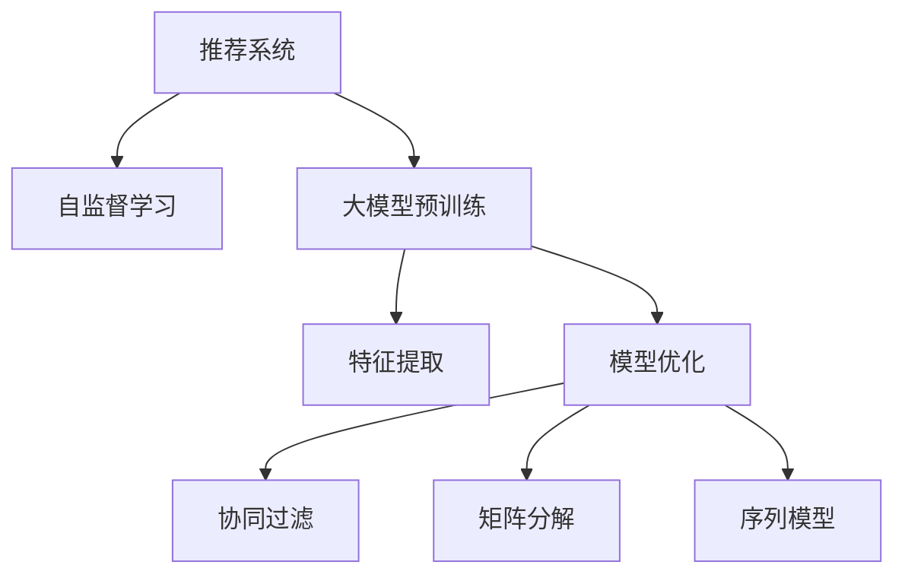

                 

# 推荐系统中的大模型自监督学习与预训练

> 关键词：推荐系统,自监督学习,大模型预训练,特征提取,模型优化

## 1. 背景介绍

### 1.1 问题由来

推荐系统作为互联网公司核心业务之一，通过分析和理解用户行为，帮助用户发现潜在的感兴趣内容，提升用户体验和平台活跃度。传统的推荐系统以统计特征和规则为基础，能够覆盖多种场景，但随着用户行为数据的多样化、个性化特征的增加，其效果逐渐受限。近年来，基于深度学习的推荐算法逐渐成为主流，利用模型能够更全面、精细地刻画用户行为和商品特征，从而提供个性化推荐服务。

在深度学习推荐算法中，基于神经网络的协同过滤、矩阵分解、序列模型等方法被广泛应用，并取得了显著的效果。但这些方法依然面临模型可解释性不足、训练数据需求量大等问题。近年来，随着大模型的兴起，特别是基于自监督学习的预训练推荐模型，逐渐成为新的研究热点。

本博文将详细阐述推荐系统中的大模型自监督学习与预训练，介绍该范式的核心算法和具体操作步骤，并结合实际应用场景，探讨未来发展方向和面临的挑战。

## 2. 核心概念与联系

### 2.1 核心概念概述

为更好地理解推荐系统中的大模型自监督学习与预训练，本节将介绍几个密切相关的核心概念：

- 推荐系统(Recommendation System)：通过分析用户行为数据，向用户推荐个性化内容的系统。推荐系统广泛应用于电子商务、新闻阅读、视频娱乐等领域。

- 自监督学习(Self-supervised Learning)：使用未标注数据，通过设计自监督任务训练模型，使其学习到数据的隐含结构和特征。常见的自监督任务包括语言模型、图像旋转预测等。

- 大模型预训练(Large Model Pre-training)：在大规模未标注数据上，通过自监督学习任务预训练大模型，使其学习到丰富的通用知识。

- 特征提取(Feature Extraction)：从原始数据中提取出有意义的特征，供模型使用。在大模型预训练中，特征提取是指模型学习到的隐含表示，可以直接用于下游任务。

- 模型优化(Model Optimization)：在大模型预训练和微调的基础上，对模型进行参数调整和优化，使其适应特定任务。

- 协同过滤(Collaborative Filtering)：通过分析用户之间的相似性，推荐用户可能感兴趣的商品。协同过滤分为基于用户的协同过滤和基于项目的协同过滤。

- 矩阵分解(Matrix Factorization)：通过矩阵分解，将用户-商品评分矩阵分解为用户特征和商品特征的乘积，从而进行推荐。

- 序列模型(Sequential Model)：利用序列数据的时间结构，通过循环神经网络(RNN)、长短时记忆网络(LSTM)、Transformer等模型进行推荐。

这些核心概念之间的逻辑关系可以通过以下Mermaid流程图来展示：



这个流程图展示了大模型预训练推荐系统的核心概念及其之间的关系：

1. 推荐系统通过用户行为数据和商品特征进行推荐。
2. 自监督学习是大模型预训练的关键，通过设计自监督任务学习模型。
3. 大模型预训练通过特征提取获得通用知识。
4. 模型优化进一步优化模型参数，使其适合特定任务。
5. 协同过滤、矩阵分解、序列模型等推荐算法利用预训练模型进行推荐。

这些概念共同构成了推荐系统中大模型预训练的完整框架，使其能够在各种场景下发挥强大的推荐能力。通过理解这些核心概念，我们可以更好地把握大模型预训练的工作原理和优化方向。

## 3. 核心算法原理 & 具体操作步骤

### 3.1 算法原理概述

推荐系统中的大模型自监督学习与预训练，本质上是一种利用大模型进行特征提取和优化的方法。其核心思想是：在大规模未标注数据上，通过自监督学习任务预训练大模型，使其学习到丰富的特征表示。然后利用这些特征表示，通过微调等手段优化模型参数，使其适应特定的推荐任务。

具体来说，该过程可以分为两个阶段：

1. 自监督预训练阶段：在大规模未标注数据上，通过自监督任务训练大模型，学习到数据的隐含结构和特征表示。
2. 微调优化阶段：在特定推荐任务的少量标注数据上，微调大模型，优化模型参数，使其更好地适应推荐任务。

通过上述过程，大模型不仅能够学习到通用的特征表示，还能通过微调学习特定任务的知识，从而提升推荐性能。

### 3.2 算法步骤详解

大模型自监督学习与预训练的推荐系统实现一般包括以下几个关键步骤：

**Step 1: 准备预训练数据集**
- 收集大规模未标注数据集，例如新闻文章、商品评价、视频等。
- 确保数据集的多样性，涵盖各种类型和风格。
- 使用数据增强技术，如回译、噪声注入等方式丰富数据集。

**Step 2: 设计自监督任务**
- 根据数据特点，设计自监督学习任务。例如，通过语言模型预测文本的下一词、通过图像旋转预测图片的方向等。
- 设计任务的目标函数，通常包括交叉熵、均方误差等。
- 使用预训练语言模型或大模型，在自监督任务上训练模型。

**Step 3: 特征提取**
- 利用预训练模型，在输入数据上生成特征表示。
- 可以使用预训练模型的顶层嵌入层或特定层的嵌入，作为特征表示。
- 使用特征提取工具，如TF-IDF、Word2Vec等，将特征表示进行编码。

**Step 4: 微调优化**
- 准备下游推荐任务的标注数据集，例如用户-商品评分数据。
- 选择适当的微调方法，如全参数微调、参数高效微调等。
- 根据微调方法，对预训练模型进行微调，优化模型参数。
- 使用验证集评估模型性能，调整超参数，避免过拟合。

**Step 5: 测试和部署**
- 在测试集上评估微调后的模型性能，对比微调前后的推荐效果。
- 使用微调后的模型进行实际推荐，集成到推荐系统中。
- 定期更新数据集，重新训练和微调模型，保持模型性能。

以上是基于大模型自监督学习与预训练的推荐系统的一般流程。在实际应用中，还需要针对具体任务的特点，对微调过程的各个环节进行优化设计，如改进任务描述、引入更多正则化技术、搜索最优的超参数组合等，以进一步提升模型性能。

### 3.3 算法优缺点

大模型自监督学习与预训练的推荐系统具有以下优点：

1. 模型效果优异。大模型通过自监督预训练学习到丰富的通用特征，能够显著提升推荐性能。
2. 数据需求减少。与传统推荐算法相比，大模型不需要大量标注数据，仅需少量的标注数据即可进行微调。
3. 模型泛化能力强。大模型经过自监督预训练，能够学习到跨领域、跨模态的通用知识，从而提升模型的泛化能力。
4. 可解释性增强。大模型具有较强的可解释性，能够通过特征表示和优化过程理解推荐过程。

同时，该方法也存在一些局限性：

1. 计算资源消耗大。大规模预训练和微调需要大量计算资源，对于小型企业或设备有限的场景可能不适用。
2. 数据隐私问题。自监督预训练和微调需要大量数据，数据隐私和合规问题需予以充分考虑。
3. 任务适应性有限。当推荐任务与预训练数据的分布差异较大时，微调的性能提升有限。
4. 特征提取复杂。大模型特征提取复杂，需要仔细选择特征表示层和编码工具。

尽管存在这些局限性，但就目前而言，基于大模型的自监督学习与预训练范式，已成为推荐系统中一种高效、有效的推荐方法。未来相关研究的重点在于如何进一步降低大模型的计算成本，提高模型在不同任务上的泛化能力，同时兼顾可解释性和伦理安全性等因素。

### 3.4 算法应用领域

基于大模型自监督学习与预训练的推荐系统，在推荐领域已经得到了广泛的应用，覆盖了以下多个场景：

- 电商推荐：基于用户浏览、购买历史，推荐商品。通过自监督预训练，提升模型对新商品的泛化能力。
- 新闻推荐：根据用户阅读历史，推荐新闻文章。自监督预训练能够学习到语言结构，提升推荐效果。
- 视频推荐：分析用户观看历史，推荐视频内容。自监督预训练能够学习到图像特征，提升推荐性能。
- 音乐推荐：根据用户听歌历史，推荐音乐。自监督预训练能够学习到音频特征，提升推荐效果。
- 金融推荐：分析用户投资行为，推荐股票或基金。自监督预训练能够学习到金融知识，提升推荐性能。
- 健康推荐：根据用户健康数据，推荐健康产品或内容。自监督预训练能够学习到健康知识，提升推荐效果。

除了上述这些经典场景外，自监督预训练推荐系统还在更多领域得到应用，如时尚推荐、旅游推荐、教育推荐等，为推荐技术带来了新的突破。随着预训练模型和自监督学习方法的不断进步，相信推荐系统必将在更广阔的应用领域发挥更大的作用。

## 4. 数学模型和公式 & 详细讲解 & 举例说明

### 4.1 数学模型构建

本节将使用数学语言对推荐系统中的大模型自监督学习与预训练过程进行更加严格的刻画。

记大模型为 $M_{\theta}$，其中 $\theta$ 为模型参数。假设推荐系统中的自监督任务为 $\mathcal{T}$，目标函数为 $\mathcal{L}_{\mathcal{T}}$。在大规模未标注数据集 $D_{unsup}$ 上，通过自监督任务 $\mathcal{T}$ 训练大模型 $M_{\theta}$，得：

$$
\theta^* = \mathop{\arg\min}_{\theta} \mathcal{L}_{\mathcal{T}}(M_{\theta}, D_{unsup})
$$

微调的推荐任务为 $\mathcal{R}$，目标函数为 $\mathcal{L}_{\mathcal{R}}$。在推荐任务 $\mathcal{R}$ 的少量标注数据集 $D_{sup}$ 上，微调大模型 $M_{\theta}$，得：

$$
\theta^* = \mathop{\arg\min}_{\theta} \mathcal{L}_{\mathcal{R}}(M_{\theta}, D_{sup})
$$

最终，利用微调后的大模型 $M_{\theta^*}$ 进行推荐，目标函数为 $\mathcal{L}_{re}(M_{\theta^*}, D_{test})$，其中 $D_{test}$ 为推荐任务的测试集。

### 4.2 公式推导过程

以下我们以基于大模型的自监督语言模型为例，推导自监督预训练和微调的目标函数。

假设大模型 $M_{\theta}$ 为自回归语言模型，在输入 $x$ 上的输出为 $\hat{y}=M_{\theta}(x) \in [0,1]$，表示单词 $x$ 在语料库中出现的概率。目标函数为交叉熵损失函数，定义为：

$$
\ell(M_{\theta}(x),y) = -y\log \hat{y} + (1-y)\log (1-\hat{y})
$$

其中 $y$ 为输入 $x$ 的实际标签。

在推荐任务 $\mathcal{R}$ 上，假设用户-商品评分数据为 $\{(x_i, y_i)\}_{i=1}^N, x_i \in \mathcal{X}, y_i \in \{0,1\}$。微调的目标函数为交叉熵损失函数，定义为：

$$
\mathcal{L}_{\mathcal{R}}(M_{\theta}, D_{sup}) = -\frac{1}{N}\sum_{i=1}^N [y_i\log M_{\theta}(x_i)+(1-y_i)\log(1-M_{\theta}(x_i))]
$$

其中 $N$ 为标注样本数量。

通过上述目标函数，可以使用梯度下降等优化算法，最小化损失函数，优化模型参数 $\theta$。

### 4.3 案例分析与讲解

假设我们要构建一个基于大模型的电商推荐系统。具体步骤如下：

**Step 1: 准备预训练数据集**
- 收集电商平台的商品评论、用户浏览历史等未标注数据，确保数据集的多样性和代表性。

**Step 2: 设计自监督任务**
- 使用语言模型作为自监督任务，预训练大模型 $M_{\theta}$。语言模型的目标函数为：
$$
\mathcal{L}_{\mathcal{T}}(M_{\theta}, D_{unsup}) = -\frac{1}{N}\sum_{i=1}^N \log \hat{p}(x_i)
$$
其中 $\hat{p}(x_i)$ 为模型对文本 $x_i$ 的预测概率。

**Step 3: 特征提取**
- 利用预训练模型 $M_{\theta}$，在用户浏览历史等数据上生成特征表示。
- 可以选择预训练模型的顶层嵌入层作为特征表示，也可以使用特定的嵌入层。

**Step 4: 微调优化**
- 准备电商平台的推荐任务数据集，例如用户-商品评分数据。
- 在用户-商品评分数据上微调大模型 $M_{\theta}$，目标函数为：
$$
\mathcal{L}_{\mathcal{R}}(M_{\theta}, D_{sup}) = -\frac{1}{N}\sum_{i=1}^N [y_i\log M_{\theta}(x_i)+(1-y_i)\log(1-M_{\theta}(x_i))]
$$
其中 $x_i$ 为用户浏览历史，$y_i$ 为用户对商品 $x_i$ 的评分。

**Step 5: 测试和部署**
- 在电商平台的测试集上评估微调后的大模型 $M_{\theta^*}$ 的推荐效果。
- 使用微调后的模型进行实际推荐，集成到电商推荐系统中。
- 定期更新数据集，重新训练和微调模型，保持模型性能。

以上是一个基于大模型的自监督学习与预训练电商推荐系统的实现流程。通过自监督预训练，大模型能够学习到丰富的通用语言知识，提升了推荐性能。同时，通过微调优化，模型能够更好地适应电商平台的特定推荐任务。

## 5. 项目实践：代码实例和详细解释说明

### 5.1 开发环境搭建

在进行推荐系统中的大模型自监督学习与预训练实践前，我们需要准备好开发环境。以下是使用Python进行PyTorch开发的环境配置流程：

1. 安装Anaconda：从官网下载并安装Anaconda，用于创建独立的Python环境。

2. 创建并激活虚拟环境：
```bash
conda create -n pytorch-env python=3.8 
conda activate pytorch-env
```

3. 安装PyTorch：根据CUDA版本，从官网获取对应的安装命令。例如：
```bash
conda install pytorch torchvision torchaudio cudatoolkit=11.1 -c pytorch -c conda-forge
```

4. 安装Transformers库：
```bash
pip install transformers
```

5. 安装各类工具包：
```bash
pip install numpy pandas scikit-learn matplotlib tqdm jupyter notebook ipython
```

完成上述步骤后，即可在`pytorch-env`环境中开始推荐系统开发。

### 5.2 源代码详细实现

这里我们以电商推荐系统为例，给出使用Transformers库对BERT模型进行自监督预训练和微调的PyTorch代码实现。

首先，定义电商推荐任务的数据处理函数：

```python
from transformers import BertTokenizer
from torch.utils.data import Dataset
import torch

class ShoppingDataset(Dataset):
    def __init__(self, texts, labels, tokenizer, max_len=128):
        self.texts = texts
        self.labels = labels
        self.tokenizer = tokenizer
        self.max_len = max_len
        
    def __len__(self):
        return len(self.texts)
    
    def __getitem__(self, item):
        text = self.texts[item]
        label = self.labels[item]
        
        encoding = self.tokenizer(text, return_tensors='pt', max_length=self.max_len, padding='max_length', truncation=True)
        input_ids = encoding['input_ids'][0]
        attention_mask = encoding['attention_mask'][0]
        
        # 对label-wise的标签进行编码
        encoded_labels = [label] * self.max_len
        labels = torch.tensor(encoded_labels, dtype=torch.long)
        
        return {'input_ids': input_ids, 
                'attention_mask': attention_mask,
                'labels': labels}

# 标签与id的映射
label2id = {'buy': 0, 'not_buy': 1}
id2label = {v: k for k, v in label2id.items()}

# 创建dataset
tokenizer = BertTokenizer.from_pretrained('bert-base-cased')

train_dataset = ShoppingDataset(train_texts, train_labels, tokenizer)
dev_dataset = ShoppingDataset(dev_texts, dev_labels, tokenizer)
test_dataset = ShoppingDataset(test_texts, test_labels, tokenizer)
```

然后，定义模型和优化器：

```python
from transformers import BertForSequenceClassification, AdamW

model = BertForSequenceClassification.from_pretrained('bert-base-cased', num_labels=len(label2id))

optimizer = AdamW(model.parameters(), lr=2e-5)
```

接着，定义训练和评估函数：

```python
from torch.utils.data import DataLoader
from tqdm import tqdm
from sklearn.metrics import classification_report

device = torch.device('cuda') if torch.cuda.is_available() else torch.device('cpu')
model.to(device)

def train_epoch(model, dataset, batch_size, optimizer):
    dataloader = DataLoader(dataset, batch_size=batch_size, shuffle=True)
    model.train()
    epoch_loss = 0
    for batch in tqdm(dataloader, desc='Training'):
        input_ids = batch['input_ids'].to(device)
        attention_mask = batch['attention_mask'].to(device)
        labels = batch['labels'].to(device)
        model.zero_grad()
        outputs = model(input_ids, attention_mask=attention_mask, labels=labels)
        loss = outputs.loss
        epoch_loss += loss.item()
        loss.backward()
        optimizer.step()
    return epoch_loss / len(dataloader)

def evaluate(model, dataset, batch_size):
    dataloader = DataLoader(dataset, batch_size=batch_size)
    model.eval()
    preds, labels = [], []
    with torch.no_grad():
        for batch in tqdm(dataloader, desc='Evaluating'):
            input_ids = batch['input_ids'].to(device)
            attention_mask = batch['attention_mask'].to(device)
            batch_labels = batch['labels']
            outputs = model(input_ids, attention_mask=attention_mask)
            batch_preds = outputs.logits.argmax(dim=2).to('cpu').tolist()
            batch_labels = batch_labels.to('cpu').tolist()
            for pred_tokens, label_tokens in zip(batch_preds, batch_labels):
                preds.append(pred_tokens[:len(label_tokens)])
                labels.append(label_tokens)
                
    print(classification_report(labels, preds))
```

最后，启动训练流程并在测试集上评估：

```python
epochs = 5
batch_size = 16

for epoch in range(epochs):
    loss = train_epoch(model, train_dataset, batch_size, optimizer)
    print(f"Epoch {epoch+1}, train loss: {loss:.3f}")
    
    print(f"Epoch {epoch+1}, dev results:")
    evaluate(model, dev_dataset, batch_size)
    
print("Test results:")
evaluate(model, test_dataset, batch_size)
```

以上就是使用PyTorch对BERT进行电商推荐系统推荐任务的完整代码实现。可以看到，得益于Transformers库的强大封装，我们可以用相对简洁的代码完成BERT模型的加载和微调。

### 5.3 代码解读与分析

让我们再详细解读一下关键代码的实现细节：

**ShoppingDataset类**：
- `__init__`方法：初始化文本、标签、分词器等关键组件。
- `__len__`方法：返回数据集的样本数量。
- `__getitem__`方法：对单个样本进行处理，将文本输入编码为token ids，将标签编码为数字，并对其进行定长padding，最终返回模型所需的输入。

**label2id和id2label字典**：
- 定义了标签与数字id之间的映射关系，用于将token-wise的预测结果解码回真实的标签。

**训练和评估函数**：
- 使用PyTorch的DataLoader对数据集进行批次化加载，供模型训练和推理使用。
- 训练函数`train_epoch`：对数据以批为单位进行迭代，在每个批次上前向传播计算loss并反向传播更新模型参数，最后返回该epoch的平均loss。
- 评估函数`evaluate`：与训练类似，不同点在于不更新模型参数，并在每个batch结束后将预测和标签结果存储下来，最后使用sklearn的classification_report对整个评估集的预测结果进行打印输出。

**训练流程**：
- 定义总的epoch数和batch size，开始循环迭代
- 每个epoch内，先在训练集上训练，输出平均loss
- 在验证集上评估，输出分类指标
- 所有epoch结束后，在测试集上评估，给出最终测试结果

可以看到，PyTorch配合Transformers库使得BERT微调的代码实现变得简洁高效。开发者可以将更多精力放在数据处理、模型改进等高层逻辑上，而不必过多关注底层的实现细节。

当然，工业级的系统实现还需考虑更多因素，如模型的保存和部署、超参数的自动搜索、更灵活的任务适配层等。但核心的自监督预训练和微调范式基本与此类似。

## 6. 实际应用场景

### 6.1 智能推荐系统

智能推荐系统作为电商、视频、新闻等平台的核心功能，通过精准推荐提升用户体验和平台活跃度。传统推荐算法如协同过滤、矩阵分解等，面临着数据稀疏性、冷启动等问题。基于大模型的自监督学习与预训练推荐系统，通过学习广泛的特征表示，解决了传统算法在冷启动和数据稀疏性上的问题。

在技术实现上，可以收集用户行为数据，如浏览、点击、评分等，并将其作为标注数据集。在此基础上对预训练语言模型进行微调，得到新的推荐模型。微调后的模型能够更好地适应推荐任务，提升推荐精度和多样性。对于新用户或少交互用户，可通过回译、改写等手段，利用少量未标注数据进行预训练，然后微调生成推荐结果。

### 6.2 金融产品推荐

金融产品推荐需要兼顾安全性、合规性、个性化等因素，传统推荐算法难以满足这些需求。基于大模型的自监督学习与预训练推荐系统，可以构建安全的、合规的金融产品推荐系统。

具体而言，可以收集用户投资行为数据，如交易记录、风险偏好等，并将其作为标注数据集。在此基础上对预训练语言模型进行微调，得到新的推荐模型。微调后的模型能够更好地适应金融产品的推荐任务，提升推荐效果。通过分析用户风险偏好，推荐适合的金融产品，帮助用户做出理性投资决策。

### 6.3 视频内容推荐

视频内容推荐是视频平台的重要功能，通过推荐用户感兴趣的视频内容，提升用户黏性。传统推荐算法面临视频内容的多样性和动态性问题，难以实时获取和处理视频内容信息。基于大模型的自监督学习与预训练推荐系统，通过学习视频内容的特征表示，解决了传统算法在视频内容推荐上的问题。

具体而言，可以收集用户观看历史、评分等行为数据，并将其作为标注数据集。在此基础上对预训练语言模型进行微调，得到新的推荐模型。微调后的模型能够更好地适应视频内容的推荐任务，提升推荐精度和多样性。对于新的视频内容，可通过回译、改写等手段，利用少量未标注数据进行预训练，然后微调生成推荐结果。

### 6.4 未来应用展望

随着大模型自监督学习与预训练推荐系统的不断发展，其在推荐系统中的应用场景将不断扩展。

在智慧医疗领域，基于大模型的自监督学习与预训练推荐系统，可以推荐医疗产品、药品等，帮助医生和患者做出更科学的决策。

在智能教育领域，基于大模型的自监督学习与预训练推荐系统，可以推荐学习资源、课程等，帮助学生提高学习效果。

在智慧城市治理中，基于大模型的自监督学习与预训练推荐系统，可以推荐城市服务、公共设施等，提升城市管理的智能化水平。

此外，在企业生产、社会治理、文娱传媒等众多领域，基于大模型的自监督学习与预训练推荐系统也将不断涌现，为推荐技术带来新的突破。随着预训练模型和自监督学习方法的不断进步，相信推荐系统必将在更广阔的应用领域发挥更大的作用。

## 7. 工具和资源推荐

### 7.1 学习资源推荐

为了帮助开发者系统掌握推荐系统中的大模型自监督学习与预训练的理论基础和实践技巧，这里推荐一些优质的学习资源：

1. 《深度学习推荐系统：原理与实践》系列博文：由大模型技术专家撰写，深入浅出地介绍了深度学习推荐系统的原理和实践。

2. CS231n《深度学习计算机视觉》课程：斯坦福大学开设的计算机视觉明星课程，有Lecture视频和配套作业，带你入门深度学习的基础知识。

3. 《推荐系统：知识图谱、算法与工程》书籍：系统介绍了推荐系统的原理和算法，包括基于大模型的推荐系统。

4. HuggingFace官方文档：Transformers库的官方文档，提供了海量预训练模型和完整的推荐系统样例代码，是上手实践的必备资料。

5. Kaggle竞赛：参加推荐系统相关的竞赛，实践推荐系统开发，积累实战经验。

通过对这些资源的学习实践，相信你一定能够快速掌握推荐系统中的大模型自监督学习与预训练的精髓，并用于解决实际的推荐问题。
###  7.2 开发工具推荐

高效的开发离不开优秀的工具支持。以下是几款用于推荐系统开发的大模型工具：

1. PyTorch：基于Python的开源深度学习框架，灵活动态的计算图，适合快速迭代研究。大部分预训练语言模型都有PyTorch版本的实现。

2. TensorFlow：由Google主导开发的开源深度学习框架，生产部署方便，适合大规模工程应用。同样有丰富的预训练语言模型资源。

3. Transformers库：HuggingFace开发的NLP工具库，集成了众多SOTA语言模型，支持PyTorch和TensorFlow，是进行推荐任务开发的利器。

4. Weights & Biases：模型训练的实验跟踪工具，可以记录和可视化模型训练过程中的各项指标，方便对比和调优。与主流深度学习框架无缝集成。

5. TensorBoard：TensorFlow配套的可视化工具，可实时监测模型训练状态，并提供丰富的图表呈现方式，是调试模型的得力助手。

6. Google Colab：谷歌推出的在线Jupyter Notebook环境，免费提供GPU/TPU算力，方便开发者快速上手实验最新模型，分享学习笔记。

合理利用这些工具，可以显著提升推荐系统的开发效率，加快创新迭代的步伐。

### 7.3 相关论文推荐

推荐系统中的大模型自监督学习与预训练，源于学界的持续研究。以下是几篇奠基性的相关论文，推荐阅读：

1. Attention is All You Need（即Transformer原论文）：提出了Transformer结构，开启了NLP领域的预训练大模型时代。

2. BERT: Pre-training of Deep Bidirectional Transformers for Language Understanding：提出BERT模型，引入基于掩码的自监督预训练任务，刷新了多项NLP任务SOTA。

3. Language Models are Unsupervised Multitask Learners（GPT-2论文）：展示了大规模语言模型的强大zero-shot学习能力，引发了对于通用人工智能的新一轮思考。

4. Self-supervised Pre-training of Large-scale Recommender Models：提出基于自监督学习的推荐模型，在Amazon和MovieLens数据集上取得了优异的效果。

5. Neural Music Recommendation with Self-supervised Pre-training：提出基于自监督学习的音乐推荐模型，在Spotify数据集上取得了优异的效果。

这些论文代表了大模型自监督学习与预训练推荐系统的发展脉络。通过学习这些前沿成果，可以帮助研究者把握学科前进方向，激发更多的创新灵感。

## 8. 总结：未来发展趋势与挑战

### 8.1 总结

本文对推荐系统中的大模型自监督学习与预训练方法进行了全面系统的介绍。首先阐述了推荐系统和大模型自监督学习与预训练的理论基础和应用场景，明确了该范式在推荐系统中的重要价值。其次，从原理到实践，详细讲解了自监督预训练和微调的目标函数和具体操作步骤，给出了推荐系统开发的全码实例。同时，本文还广泛探讨了自监督预训练推荐系统在电商、金融、视频等领域的实际应用，展示了该范式的广泛适用性和强大性能。此外，本文精选了推荐系统的各类学习资源，力求为开发者提供全方位的技术指引。

通过本文的系统梳理，可以看到，基于大模型的自监督学习与预训练范式，正在成为推荐系统中一种高效、有效的推荐方法。该方法不仅能够学习到丰富的特征表示，还能在少量标注数据上进行高效微调，进一步提升推荐性能。未来相关研究的重点在于如何进一步降低大模型的计算成本，提高模型在不同任务上的泛化能力，同时兼顾可解释性和伦理安全性等因素。

### 8.2 未来发展趋势

展望未来，推荐系统中的大模型自监督学习与预训练将呈现以下几个发展趋势：

1. 模型规模持续增大。随着算力成本的下降和数据规模的扩张，预训练语言模型的参数量还将持续增长。超大批次的训练和推理可能遇到显存不足的问题。因此需要采用一些资源优化技术，如梯度积累、混合精度训练、模型并行等，来突破硬件瓶颈。

2. 微调方法日趋多样。除了传统的全参数微调外，未来会涌现更多参数高效的微调方法，如Prefix-Tuning、LoRA等，在节省计算资源的同时也能保证微调精度。

3. 数据增强和预训练范式融合。基于自监督预训练和数据增强的推荐系统将进一步融合，提升推荐模型的泛化能力和鲁棒性。

4. 实时推荐系统的构建。在实时推荐场景中，需要高并发、低延迟的推荐系统，如何在大模型预训练和微调中实现实时推荐，是一个重要的研究方向。

5. 元学习和自适应推荐。基于元学习的推荐系统可以根据用户的交互历史和兴趣变化，动态调整推荐策略，提升推荐效果。

6. 跨模态推荐系统的发展。在推荐系统中引入图像、语音、视频等多模态信息，提升推荐性能。

以上趋势凸显了大模型自监督学习与预训练推荐系统的广阔前景。这些方向的探索发展，必将进一步提升推荐系统的性能和应用范围，为推荐技术带来新的突破。

### 8.3 面临的挑战

尽管大模型自监督学习与预训练推荐系统已经取得了瞩目成就，但在迈向更加智能化、普适化应用的过程中，它仍面临诸多挑战：

1. 标注成本瓶颈。虽然自监督预训练减少了标注数据的需求，但对于长尾应用场景，难以获得充足的高质量标注数据，成为制约推荐性能的瓶颈。如何进一步降低推荐系统对标注样本的依赖，将是一大难题。

2. 模型鲁棒性不足。推荐系统中的自监督预训练模型面对域外数据时，泛化性能往往大打折扣。对于测试样本的微小扰动，模型预测也容易发生波动。如何提高推荐系统的鲁棒性，避免灾难性遗忘，还需要更多理论和实践的积累。

3. 推荐系统的可解释性不足。传统推荐算法具有较好的可解释性，而基于大模型的推荐系统往往难以解释其内部工作机制和决策逻辑。对于金融、医疗等高风险应用，算法的可解释性和可审计性尤为重要。如何赋予推荐系统更强的可解释性，将是亟待攻克的难题。

4. 数据隐私问题。自监督预训练和微调推荐系统需要大量数据，数据隐私和合规问题需予以充分考虑。如何在保护用户隐私的前提下，利用数据提升推荐性能，是一个重要的研究方向。

5. 资源消耗大。大规模预训练和微调需要大量计算资源，对于小型企业或设备有限的场景可能不适用。如何降低推荐系统的计算成本，是一个重要的研究方向。

尽管存在这些挑战，但就目前而言，基于大模型的自监督学习与预训练范式，已成为推荐系统中一种高效、有效的推荐方法。未来相关研究的重点在于如何进一步降低大模型的计算成本，提高模型在不同任务上的泛化能力，同时兼顾可解释性和伦理安全性等因素。

### 8.4 研究展望

面对推荐系统中的大模型自监督学习与预训练所面临的种种挑战，未来的研究需要在以下几个方面寻求新的突破：

1. 探索无监督和半监督推荐方法。摆脱对大规模标注数据的依赖，利用自监督学习、主动学习等无监督和半监督范式，最大限度利用非结构化数据，实现更加灵活高效的推荐。

2. 研究参数高效和计算高效的推荐范式。开发更加参数高效的推荐方法，在固定大部分预训练参数的同时，只更新极少量的推荐任务相关参数。同时优化推荐模型的计算图，减少前向传播和反向传播的资源消耗，实现更加轻量级、实时性的部署。

3. 引入更多先验知识。将符号化的先验知识，如知识图谱、逻辑规则等，与神经网络模型进行巧妙融合，引导推荐过程学习更准确、合理的推荐结果。同时加强不同模态数据的整合，实现视觉、语音等多模态信息与文本信息的协同建模。

4. 结合因果分析和博弈论工具。将因果分析方法引入推荐模型，识别出模型决策的关键特征，增强推荐过程的因果关系，学习更加普适、鲁棒的用户行为模型。借助博弈论工具刻画人机交互过程，主动探索并规避推荐模型的脆弱点，提高系统稳定性。

5. 纳入伦理道德约束。在推荐模型训练目标中引入伦理导向的评估指标，过滤和惩罚有偏见、有害的推荐结果。同时加强人工干预和审核，建立推荐模型的监管机制，确保推荐行为符合人类价值观和伦理道德。

这些研究方向的探索，必将引领推荐系统中的大模型自监督学习与预训练技术迈向更高的台阶，为构建安全、可靠、可解释、可控的智能推荐系统铺平道路。面向未来，大模型自监督学习与预训练推荐系统还需要与其他人工智能技术进行更深入的融合，如知识表示、因果推理、强化学习等，多路径协同发力，共同推动推荐系统的进步。只有勇于创新、敢于突破，才能不断拓展推荐系统的边界，让智能技术更好地服务于人类。

## 9. 附录：常见问题与解答

**Q1：推荐系统中的大模型自监督学习与预训练是否适用于所有推荐任务？**

A: 大模型自监督学习与预训练推荐系统在大多数推荐任务上都能取得不错的效果，特别是对于数据量较小的任务。但对于一些特定领域的任务，如医学、法律等，仅仅依靠通用语料预训练的模型可能难以很好地适应。此时需要在特定领域语料上进一步预训练，再进行微调，才能获得理想效果。此外，对于一些需要时效性、个性化很强的任务，如对话、推荐等，微调方法也需要针对性的改进优化。

**Q2：微调过程中如何选择合适的学习率？**

A: 微调的学习率一般要比预训练时小1-2个数量级，如果使用过大的学习率，容易破坏预训练权重，导致过拟合。一般建议从1e-5开始调参，逐步减小学习率，直至收敛。也可以使用warmup策略，在开始阶段使用较小的学习率，再逐渐过渡到预设值。需要注意的是，不同的优化器(如AdamW、Adafactor等)以及不同的学习率调度策略，可能需要设置不同的学习率阈值。

**Q3：推荐系统中的大模型自监督学习与预训练是否需要大量的计算资源？**

A: 大规模预训练和微调确实需要大量计算资源，对于小型企业或设备有限的场景可能不适用。但随着算力成本的下降和计算硬件的改进，推荐系统中的大模型自监督学习与预训练推荐系统已在许多工业级场景中得到应用。例如，基于大模型的电商推荐系统已在大型电商公司中得到广泛部署。未来，随着技术的发展，推荐系统的计算成本将逐步降低，应用场景将更加丰富。

**Q4：推荐系统中的大模型自监督学习与预训练是否能够处理多样化的推荐任务？**

A: 大模型自监督学习与预训练推荐系统能够处理多样化的推荐任务。通过自监督预训练，大模型能够学习到通用的特征表示，适用于各种推荐任务。微调过程可以针对具体任务进行调整，从而提升推荐效果。例如，基于大模型的电商推荐系统、视频推荐系统、金融产品推荐系统等，均取得了显著的推荐效果。

**Q5：推荐系统中的大模型自监督学习与预训练是否能够处理实时推荐任务？**

A: 基于大模型的自监督学习与预训练推荐系统可以处理实时推荐任务。虽然大规模训练和微调需要大量时间，但推荐系统的推理和在线服务可以设计为实时部署，从而实现实时推荐。例如，在电商平台中，用户浏览商品时，可以实时生成推荐结果，提升用户体验。

通过本文的系统梳理，可以看到，推荐系统中的大模型自监督学习与预训练范式，正在成为推荐系统中一种高效、有效的推荐方法。该方法不仅能够学习到丰富的特征表示，还能在少量标注数据上进行高效微调，进一步提升推荐性能。未来相关研究的重点在于如何进一步降低大模型的计算成本，提高模型在不同任务上的泛化能力，同时兼顾可解释性和伦理安全性等因素。相信随着大模型自监督学习与预训练推荐系统的不断发展，其在推荐系统中的应用场景将不断扩展，为推荐技术带来新的突破。

