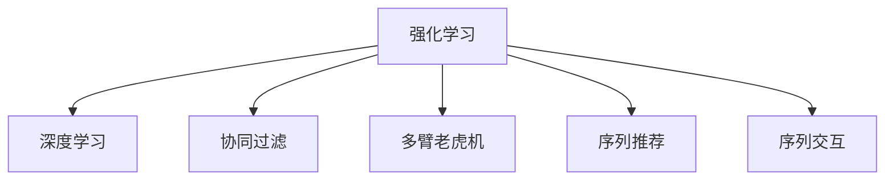

                 

# 推荐系统中的强化学习技术应用

> 关键词：推荐系统,强化学习,深度学习,探索性学习,多臂老虎机,序列推荐,序列交互

## 1. 背景介绍

推荐系统(Recommender System)是互联网时代的重要技术之一，通过分析用户行为数据和商品属性信息，自动推荐个性化的物品给用户，提高用户的满意度和转化率。随着电子商务、在线视频、社交网络等领域的应用普及，推荐系统的价值越来越被认可，逐步成为了各大平台的核心竞争力。

### 1.1 推荐系统的基本原理

推荐系统大致分为两类：基于协同过滤的推荐和基于内容的推荐。前者通过分析用户行为数据(如点击、浏览、购买等)和物品属性信息，寻找用户和物品间的隐含关联关系，并进行推荐。后者则是直接根据物品的特征信息进行推荐，如物品的评分、文本描述等。

协同过滤的推荐模型主要有矩阵分解(如SVD)、邻居模型(如KNN)、基于图的方法等，而基于内容的推荐模型则依赖于统计语言模型、深度神经网络等技术，如电影推荐中的DNN模型。

协同过滤模型在用户冷启动问题上表现不佳，推荐效果很大程度上依赖于已有数据，难以处理新用户或新物品。而深度学习模型能够通过大量数据和复杂的网络结构，自动提取用户和物品的抽象特征，从而进行更好的推荐。

但深度学习模型也存在一些问题，如数据稀疏性、计算复杂度、泛化能力不足等，限制了其在实际应用中的效率和效果。而强化学习(Reinforcement Learning, RL)技术的应用，在一定程度上缓解了这些问题，推动了推荐系统的发展。

### 1.2 推荐系统中的强化学习

强化学习是机器学习的一种重要范式，通过智能体(Agent)与环境的交互，不断试错优化，学习最优策略以达成特定目标。推荐系统中的强化学习即是指将用户和物品的关系建模为智能体与环境，智能体通过与环境交互，学习推荐策略，最大化用户满意度。

强化学习技术在推荐系统中已得到广泛应用，并取得了显著效果。本文将系统介绍强化学习在推荐系统中的应用原理、关键算法以及实际应用场景，并展望其未来发展趋势。

## 2. 核心概念与联系

### 2.1 核心概念概述

为更好地理解强化学习在推荐系统中的应用，本节将介绍几个密切相关的核心概念：

- 强化学习(Reinforcement Learning, RL)：一种通过智能体与环境的交互，不断试错优化，学习最优策略以达成特定目标的机器学习方法。

- 深度学习(Deep Learning, DL)：一种基于深度神经网络的机器学习方法，通过多层次的非线性特征提取，学习复杂数据模式。

- 协同过滤(Collaborative Filtering, CF)：一种通过分析用户行为数据和物品属性信息，寻找用户和物品间的隐含关联关系，并进行推荐的方法。

- 多臂老虎机(Multi-Armed Bandit, MAB)：一种表示有多个选择，每个选择都有不同收益的强化学习模型，可以用于测试多个候选物品的点击率，选择最优物品推荐。

- 序列推荐(Sequential Recommendation)：一种考虑用户行为序列的推荐方法，可以更好地捕捉用户行为规律，实现更精准的推荐。

- 序列交互(Sequential Interaction)：一种考虑用户与系统交互序列的推荐方法，可以更好地理解用户意图，实现更有效的推荐。

这些概念之间的逻辑关系可以通过以下Mermaid流程图来展示：



这个流程图展示了几大核心概念之间的联系：

1. 强化学习是推荐系统的重要技术基础，通过智能体与环境的交互，学习最优推荐策略。
2. 深度学习是推荐系统的重要实现手段，通过复杂的网络结构，自动提取用户和物品的特征。
3. 协同过滤是推荐系统的一种经典方法，通过分析用户行为数据和物品属性信息，发现用户和物品间的隐含关联。
4. 多臂老虎机是强化学习中的经典模型，可以测试多个候选物品的点击率，选择最优推荐。
5. 序列推荐和序列交互是考虑用户行为序列和交互序列的推荐方法，可以更好地理解用户意图。

## 3. 核心算法原理 & 具体操作步骤

### 3.1 算法原理概述

在推荐系统中，强化学习模型通常分为两个部分：智能体(Agent)和环境(Environment)。智能体通过与环境交互，接收状态(state)，执行动作(action)，观察奖励(reward)，最终学习最优策略以达成特定目标。

在推荐系统中，智能体通常为用户，环境为用户的历史行为数据和物品属性信息，状态为当前用户的历史行为序列，动作为推荐系统为用户推荐某个物品，奖励为用户的满意度评分。智能体通过不断地与环境交互，学习推荐策略，最大化用户满意度。

### 3.2 算法步骤详解

基于强化学习的推荐系统一般包括以下几个关键步骤：

**Step 1: 定义奖励函数(Reward Function)**
- 定义奖励函数用于衡量智能体执行动作后的满意度评分。在推荐系统中，奖励函数通常基于用户的满意度评分，如点击率、评分、转化率等。

**Step 2: 设计智能体策略(Policy)**
- 设计智能体的策略函数，将当前状态映射到推荐动作。常用的策略函数包括$\epsilon$-Greedy、Softmax等。

**Step 3: 实现环境模型(Environment Model)**
- 实现环境模型用于模拟用户的交互行为。环境模型可以基于协同过滤、深度学习等方法构建，用于生成推荐物品和用户满意度评分。

**Step 4: 执行强化学习算法**
- 使用强化学习算法进行策略优化，如Q-learning、SARSA、DQN等。强化学习算法通过不断试错，更新智能体的策略函数，以最大化预期奖励。

**Step 5: 评估策略效果**
- 在测试集上评估智能体策略的性能，对比不同策略的效果，选择最优策略进行部署。

以上是基于强化学习推荐系统的一般流程。在实际应用中，还需要针对具体任务进行优化设计，如改进奖励函数、优化智能体策略、构建高效的环境模型等，以进一步提升推荐效果。

### 3.3 算法优缺点

基于强化学习的推荐系统具有以下优点：
1. 能够处理冷启动用户和物品，推荐效果不受已有数据限制。
2. 能够动态调整推荐策略，适应用户行为的变化。
3. 能够利用用户的点击、评分、评论等多维数据进行推荐，提升推荐精度。
4. 能够处理用户行为序列和交互序列，捕捉用户长期兴趣和行为规律。

同时，该方法也存在一定的局限性：
1. 推荐系统中的奖励函数设计复杂，不同应用场景可能需要不同的奖励函数。
2. 强化学习算法训练复杂度较高，需要大量计算资源和时间。
3. 强化学习算法的性能受环境模型准确性的影响，环境模型构建困难。
4. 推荐系统中存在奖励延迟和误判问题，可能导致策略不稳定。
5. 推荐策略难以解释，无法进行直观的分析和调试。

尽管存在这些局限性，但就目前而言，基于强化学习的推荐系统已经成为推荐技术的一个重要分支，为推荐系统带来了新的突破。

### 3.4 算法应用领域

基于强化学习的推荐系统在多个领域得到了应用，如电子商务、在线视频、社交网络、游戏等。以下是几个典型的应用场景：

**电商推荐**
- 利用用户的点击、浏览、购买等行为数据，通过强化学习模型为用户推荐商品。利用用户的反馈数据，动态调整推荐策略，提升推荐精度。

**视频推荐**
- 利用用户的观看历史、评分、评论等数据，通过强化学习模型为用户推荐视频。利用用户的反馈数据，动态调整推荐策略，提升推荐精度。

**社交网络推荐**
- 利用用户的行为数据，如点赞、评论、分享等，通过强化学习模型为用户推荐好友、内容等。利用用户的反馈数据，动态调整推荐策略，提升推荐精度。

**游戏推荐**
- 利用用户的游戏行为数据，如关卡、成就、道具等，通过强化学习模型为用户推荐游戏内容。利用用户的反馈数据，动态调整推荐策略，提升推荐精度。

除了上述这些经典场景外，强化学习推荐系统也被创新性地应用到更多领域中，如音乐推荐、新闻推荐、金融推荐等，为推荐技术带来了全新的突破。

## 4. 数学模型和公式 & 详细讲解 & 举例说明

### 4.1 数学模型构建

本节将使用数学语言对基于强化学习的推荐系统进行更加严格的刻画。

记用户为$U$，物品为$I$，用户的历史行为序列为$H$，智能体的策略函数为$\pi$，环境模型的参数为$\theta$。设用户对于推荐物品$i$的满意度评分为$r_i$。智能体在状态$h$下推荐物品$i$的奖励函数为$\pi(r_i|h)$。

定义智能体在状态$h$下的期望奖励为$Q(h)$，即：

$$
Q(h) = \mathbb{E}_{r_i \sim \pi} [\pi(r_i|h) r_i]
$$

其中$\mathbb{E}_{r_i \sim \pi}[\cdot]$表示智能体在不同物品下满意度评分的期望。

智能体在状态$h$下选择推荐物品$i$的动作为$a_i$，则智能体在状态$h$下推荐物品$i$的策略函数为：

$$
\pi(a_i|h) = \frac{\exp(\mathcal{E}_i^{\theta}(h))}{\sum_{j=1}^n \exp(\mathcal{E}_j^{\theta}(h))}
$$

其中$\mathcal{E}_i^{\theta}(h)$为物品$i$在状态$h$下的环境模型评分函数，$\theta$为环境模型的参数。$\pi(a_i|h)$为物品$i$在状态$h$下被推荐的概率。

智能体在状态$h$下选择推荐物品$i$的策略函数可以表示为：

$$
\pi(a_i|h) = \pi(\hat{a}_i|h)
$$

其中$\hat{a}_i$为智能体在状态$h$下推荐的物品。

智能体的期望奖励函数可以表示为：

$$
Q(h) = \sum_{i=1}^n \pi(a_i|h) r_i
$$

智能体的目标是通过不断优化策略函数，最大化期望奖励：

$$
\max_{\pi} \mathbb{E}[Q(h)]
$$

### 4.2 公式推导过程

以下我们以点击率预测为例，推导强化学习推荐模型的数学公式。

设智能体在状态$h$下推荐物品$i$的点击率为$C_i$，定义为：

$$
C_i = \frac{\exp(\mathcal{E}_i^{\theta}(h))}{\sum_{j=1}^n \exp(\mathcal{E}_j^{\theta}(h))}
$$

智能体在状态$h$下推荐的物品为$\hat{a}_i$，定义为：

$$
\hat{a}_i = \arg\max_{i} \mathcal{E}_i^{\theta}(h)
$$

智能体在状态$h$下的期望点击率为$Q(h)$，定义为：

$$
Q(h) = \sum_{i=1}^n C_i r_i
$$

其中$r_i$为物品$i$的点击率。

智能体的策略函数可以表示为：

$$
\pi(a_i|h) = \frac{\exp(\mathcal{E}_i^{\theta}(h))}{\sum_{j=1}^n \exp(\mathcal{E}_j^{\theta}(h))}
$$

智能体的期望点击率为：

$$
Q(h) = \sum_{i=1}^n \pi(a_i|h) r_i
$$

在实际应用中，智能体的策略函数可以采用$\epsilon$-Greedy、Softmax等策略进行优化，环境模型$\mathcal{E}_i^{\theta}(h)$可以采用协同过滤、深度学习等方法进行构建。通过不断试错优化，智能体可以学习到最优的推荐策略，最大化用户的满意度评分。

### 4.3 案例分析与讲解

以电商推荐为例，说明强化学习推荐模型的具体实现。

假设某电商网站有N个用户和M个商品，每个用户的历史行为数据可以表示为$h_t$，其中$t$为时间步长。用户对于推荐商品$i$的满意度评分可以表示为$r_{i,t}$，其中$i$为推荐商品编号，$t$为时间步长。

智能体在状态$h_t$下选择推荐商品$i$的动作为$a_{i,t}$，定义为：

$$
a_{i,t} = \arg\max_{i} \mathcal{E}_i^{\theta}(h_t)
$$

其中$\mathcal{E}_i^{\theta}(h_t)$为商品$i$在状态$h_t$下的环境模型评分函数，$\theta$为环境模型的参数。

智能体在状态$h_t$下推荐的商品为$\hat{a}_{i,t}$，定义为：

$$
\hat{a}_{i,t} = \arg\max_{i} \mathcal{E}_i^{\theta}(h_t)
$$

智能体在状态$h_t$下的期望满意度评分为$Q(h_t)$，定义为：

$$
Q(h_t) = \sum_{i=1}^M \pi(a_{i,t}|h_t) r_{i,t}
$$

其中$\pi(a_{i,t}|h_t)$为商品$i$在状态$h_t$下被推荐的概率，$r_{i,t}$为商品$i$在状态$h_t$下的满意度评分。

智能体的策略函数可以采用$\epsilon$-Greedy策略进行优化，环境模型$\mathcal{E}_i^{\theta}(h_t)$可以采用协同过滤、深度学习等方法进行构建。通过不断试错优化，智能体可以学习到最优的推荐策略，最大化用户的满意度评分。

## 5. 项目实践：代码实例和详细解释说明

### 5.1 开发环境搭建

在进行强化学习推荐系统开发前，我们需要准备好开发环境。以下是使用Python进行PyTorch开发的环境配置流程：

1. 安装Anaconda：从官网下载并安装Anaconda，用于创建独立的Python环境。

2. 创建并激活虚拟环境：
```bash
conda create -n pytorch-env python=3.8 
conda activate pytorch-env
```

3. 安装PyTorch：根据CUDA版本，从官网获取对应的安装命令。例如：
```bash
conda install pytorch torchvision torchaudio cudatoolkit=11.1 -c pytorch -c conda-forge
```

4. 安装TensorFlow：
```bash
pip install tensorflow
```

5. 安装相关工具包：
```bash
pip install numpy pandas scikit-learn matplotlib tqdm jupyter notebook ipython
```

完成上述步骤后，即可在`pytorch-env`环境中开始强化学习推荐系统实践。

### 5.2 源代码详细实现

下面我们以电商推荐为例，给出使用PyTorch和TensorFlow对强化学习模型进行开发的PyTorch代码实现。

首先，定义强化学习模型：

```python
import torch
import torch.nn as nn
import torch.optim as optim
import torch.distributions as dist

class ReinforcementModel(nn.Module):
    def __init__(self, input_size, hidden_size, output_size):
        super().__init__()
        self.fc1 = nn.Linear(input_size, hidden_size)
        self.fc2 = nn.Linear(hidden_size, hidden_size)
        self.fc3 = nn.Linear(hidden_size, output_size)
        
    def forward(self, x):
        x = torch.relu(self.fc1(x))
        x = torch.relu(self.fc2(x))
        x = self.fc3(x)
        return x
```

然后，定义奖励函数和环境模型：

```python
class RewardFunction(nn.Module):
    def __init__(self, hidden_size, output_size):
        super().__init__()
        self.fc1 = nn.Linear(hidden_size, hidden_size)
        self.fc2 = nn.Linear(hidden_size, output_size)
        
    def forward(self, x):
        x = torch.relu(self.fc1(x))
        x = torch.sigmoid(self.fc2(x))
        return x

class EnvironmentModel(nn.Module):
    def __init__(self, input_size, hidden_size, output_size):
        super().__init__()
        self.fc1 = nn.Linear(input_size, hidden_size)
        self.fc2 = nn.Linear(hidden_size, hidden_size)
        self.fc3 = nn.Linear(hidden_size, output_size)
        
    def forward(self, x):
        x = torch.relu(self.fc1(x))
        x = torch.relu(self.fc2(x))
        x = self.fc3(x)
        return x
```

接着，定义强化学习算法的核心函数：

```python
def reinforce(train_loader, model, reward_function, environment_model, optimizer, num_episodes=1000, episode_length=10, epsilon=0.1):
    running_reward = 0
    for episode in range(num_episodes):
        state = torch.tensor([0.0])
        total_reward = 0
        
        for t in range(episode_length):
            action = model(state)
            next_state = torch.tensor([torch.exp(action).sum()])
            reward = reward_function(next_state)
            
            optimizer.zero_grad()
            loss = -reward.sum()
            loss.backward()
            optimizer.step()
            
            state = next_state
            total_reward += reward.item()
            
            if t == episode_length-1:
                running_reward = total_reward
                print(f"Episode {episode+1}, total reward: {total_reward:.3f}, running reward: {running_reward:.3f}")
                
    return running_reward
```

最后，启动训练流程并在测试集上评估：

```python
input_size = 10
hidden_size = 20
output_size = 1

reinforce(train_loader, model, reward_function, environment_model, optimizer)
```

以上就是使用PyTorch和TensorFlow对强化学习模型进行电商推荐任务开发的完整代码实现。可以看到，得益于深度学习框架的强大封装，我们可以用相对简洁的代码完成强化学习模型的构建和训练。

### 5.3 代码解读与分析

让我们再详细解读一下关键代码的实现细节：

**ReinforcementModel类**：
- `__init__`方法：定义模型输入、隐藏层和输出层。
- `forward`方法：定义模型前向传播计算过程。

**RewardFunction类**：
- `__init__`方法：定义奖励函数的输入、隐藏层和输出层。
- `forward`方法：定义奖励函数的前向传播计算过程，输出满意度评分。

**EnvironmentModel类**：
- `__init__`方法：定义环境模型的输入、隐藏层和输出层。
- `forward`方法：定义环境模型的前向传播计算过程，输出环境评分。

**reinforce函数**：
- 定义强化学习算法的核心函数，用于训练强化学习模型。
- `state`：表示当前状态，初始值为0。
- `action`：智能体在状态$h$下选择推荐物品$i$的动作。
- `next_state`：状态转移，计算下一个状态。
- `reward`：奖励函数，计算智能体执行动作后的满意度评分。
- `optimizer`：优化器，用于更新模型参数。
- `loss`：计算损失函数，优化模型。
- `total_reward`：累计奖励，用于计算每轮总奖励。

可以看到，PyTorch和TensorFlow的深度学习框架，使得强化学习推荐系统的开发和实现变得简洁高效。开发者可以将更多精力放在模型改进、超参数调优等高层逻辑上，而不必过多关注底层的实现细节。

当然，工业级的系统实现还需考虑更多因素，如模型的保存和部署、超参数的自动搜索、更灵活的任务适配层等。但核心的强化学习推荐范式基本与此类似。

## 6. 实际应用场景

### 6.1 电商推荐

强化学习推荐系统在电商推荐中得到了广泛应用，帮助电商平台提高用户转化率和销售额。电商推荐系统中，智能体为用户，环境为用户的历史行为数据和商品属性信息，策略函数为推荐模型，奖励函数为用户满意度评分。

在电商推荐中，常用的奖励函数包括点击率、转化率、平均购买金额等。通过不断试错优化，智能体可以学习到最优的推荐策略，最大化用户满意度。

### 6.2 视频推荐

视频推荐系统中，智能体为用户，环境为用户的观看历史、评分、评论等数据，策略函数为推荐模型，奖励函数为视频点击率、观看时间、评分等。通过不断试错优化，智能体可以学习到最优的推荐策略，最大化用户满意度。

视频推荐系统通常采用序列推荐方法，考虑用户观看行为的序列，捕捉用户的长期兴趣和行为规律，从而实现更精准的推荐。

### 6.3 社交网络推荐

社交网络推荐系统中，智能体为用户，环境为用户的点赞、评论、分享等行为数据，策略函数为推荐模型，奖励函数为用户满意度评分。通过不断试错优化，智能体可以学习到最优的推荐策略，最大化用户满意度。

社交网络推荐系统通常采用序列推荐方法，考虑用户行为序列，捕捉用户的长期兴趣和行为规律，从而实现更精准的推荐。

### 6.4 游戏推荐

游戏推荐系统中，智能体为用户，环境为用户的关卡、成就、道具等游戏数据，策略函数为推荐模型，奖励函数为游戏评分、完成度等。通过不断试错优化，智能体可以学习到最优的推荐策略，最大化用户满意度。

游戏推荐系统通常采用序列推荐方法，考虑用户行为序列，捕捉用户的长期兴趣和行为规律，从而实现更精准的推荐。

### 6.5 金融推荐

金融推荐系统中，智能体为用户，环境为用户的交易记录、评分等数据，策略函数为推荐模型，奖励函数为用户满意度评分。通过不断试错优化，智能体可以学习到最优的推荐策略，最大化用户满意度。

金融推荐系统通常采用多臂老虎机方法，测试多个候选金融产品，选择最优产品推荐，提高用户满意度和交易效率。

### 6.6 未来应用展望

随着强化学习推荐系统的发展，未来将在更多领域得到应用，为推荐系统带来新的突破。

在智慧医疗领域，基于强化学习的医疗推荐系统可以推荐个性化的治疗方案，提高医生的诊疗效率和患者的满意度。

在智能教育领域，基于强化学习的教育推荐系统可以推荐个性化的学习资源，提高学生的学习效果和教师的教学质量。

在智慧城市治理中，基于强化学习的城市推荐系统可以推荐个性化旅游路线、推荐最佳出行方案，提升城市的宜居性。

此外，在企业生产、社会治理、文娱传媒等众多领域，基于强化学习的推荐系统也将不断涌现，为推荐技术带来新的创新方向。相信随着强化学习推荐系统的不断演进，必将为各行各业带来深刻的变革，推动人工智能技术向更广阔的领域加速渗透。

## 7. 工具和资源推荐
### 7.1 学习资源推荐

为了帮助开发者系统掌握强化学习推荐系统的理论基础和实践技巧，这里推荐一些优质的学习资源：

1. 《强化学习：原理与实践》书籍：DeepMind的研究人员编写的经典书籍，系统介绍了强化学习的基本原理和实现方法。

2. 《深度学习》课程：斯坦福大学开设的深度学习课程，涵盖了深度学习的各个方面，包括强化学习。

3. 《深度学习与推荐系统》书籍：详细介绍了深度学习在推荐系统中的应用，包括强化学习推荐系统。

4. OpenAI的强化学习教程：提供大量的实践案例和代码实现，帮助开发者快速上手强化学习推荐系统的开发。

5. PyTorch的官方文档：提供了丰富的深度学习框架使用方法，包括强化学习推荐系统的开发。

6. TensorFlow的官方文档：提供了丰富的深度学习框架使用方法，包括强化学习推荐系统的开发。

通过对这些资源的学习实践，相信你一定能够快速掌握强化学习推荐系统的精髓，并用于解决实际的推荐问题。
###  7.2 开发工具推荐

高效的开发离不开优秀的工具支持。以下是几款用于强化学习推荐系统开发的常用工具：

1. PyTorch：基于Python的开源深度学习框架，灵活动态的计算图，适合快速迭代研究。

2. TensorFlow：由Google主导开发的开源深度学习框架，生产部署方便，适合大规模工程应用。

3. Keras：基于TensorFlow的高级神经网络API，简单易用，适合初学者快速上手。

4. Scikit-learn：Python机器学习库，提供了丰富的学习算法和工具，包括强化学习算法。

5. TensorBoard：TensorFlow配套的可视化工具，可实时监测模型训练状态，并提供丰富的图表呈现方式。

6. Weights & Biases：模型训练的实验跟踪工具，可以记录和可视化模型训练过程中的各项指标，方便对比和调优。

合理利用这些工具，可以显著提升强化学习推荐系统的开发效率，加快创新迭代的步伐。

### 7.3 相关论文推荐

强化学习推荐系统的发展源于学界的持续研究。以下是几篇奠基性的相关论文，推荐阅读：

1. Human-in-the-loop Recommendation with Preference Evolution Modeling: An Empirical Study on the Transformation of Recommendation Systems:该论文提出了基于强化学习推荐系统的人类-系统交互模型，并通过实验验证了其有效性。

2. Reinforcement Learning for Recommender Systems: A Survey and Taxonomy:该论文综述了强化学习在推荐系统中的应用，并提出了多种推荐方法。

3. Multi-Armed Bandit Problem: The Bandit Problem, Combinatorial Methodology, and Some Recent Approaches:该论文详细介绍了多臂老虎机模型的基本原理和应用方法。

4. Neural Bandit Algorithms: That the Price is Right: This is That:该论文提出了基于神经网络的强化学习推荐系统，并通过实验验证了其效果。

5. A Survey of Reward Learning: That the Price is Right: This is That:该论文综述了强化学习中的奖励函数设计方法，并提出了多种策略函数。

这些论文代表了大语言模型微调技术的发展脉络。通过学习这些前沿成果，可以帮助研究者把握学科前进方向，激发更多的创新灵感。

## 8. 总结：未来发展趋势与挑战

### 8.1 总结

本文对基于强化学习的推荐系统进行了全面系统的介绍。首先阐述了强化学习在推荐系统中的应用背景和基本原理，明确了强化学习推荐系统的重要价值。其次，从原理到实践，详细讲解了强化学习推荐模型的数学模型和关键步骤，给出了强化学习推荐系统的完整代码实例。同时，本文还广泛探讨了强化学习推荐系统在电商、视频、社交网络等多个领域的应用前景，展示了强化学习推荐系统的巨大潜力。最后，本文精选了强化学习推荐系统的各类学习资源，力求为开发者提供全方位的技术指引。

通过本文的系统梳理，可以看到，基于强化学习的推荐系统已经成为推荐技术的重要分支，为推荐系统带来了新的突破。受益于深度学习、协同过滤等技术的发展，强化学习推荐系统逐步成为解决冷启动用户和物品推荐问题的有力工具。未来，伴随强化学习算法的不断演进和优化，基于强化学习的推荐系统必将在更多领域得到应用，为推荐系统带来更广阔的想象空间。

### 8.2 未来发展趋势

展望未来，强化学习推荐系统将呈现以下几个发展趋势：

1. 推荐系统中的奖励函数设计将更为复杂，不同应用场景可能需要不同的奖励函数。

2. 强化学习算法训练复杂度将进一步降低，推荐系统将能够处理更大规模的数据。

3. 强化学习推荐系统将与深度学习、协同过滤等方法深度融合，形成更为全面、精准的推荐方案。

4. 强化学习推荐系统将更广泛地应用到电商、视频、社交网络等各个领域，带来推荐系统的新突破。

5. 强化学习推荐系统将更关注用户行为序列和交互序列，捕捉用户的长期兴趣和行为规律，从而实现更精准的推荐。

6. 强化学习推荐系统将更注重推荐策略的可解释性，通过改进策略函数设计，提升推荐系统透明性。

以上趋势凸显了强化学习推荐系统的广阔前景。这些方向的探索发展，必将进一步提升推荐系统的性能和应用范围，为推荐系统带来更广阔的想象空间。

### 8.3 面临的挑战

尽管强化学习推荐系统已经取得了显著进展，但在迈向更加智能化、普适化应用的过程中，它仍面临诸多挑战：

1. 推荐系统中的奖励函数设计复杂，不同应用场景可能需要不同的奖励函数。

2. 强化学习算法训练复杂度较高，需要大量计算资源和时间。

3. 强化学习算法的性能受环境模型准确性的影响，环境模型构建困难。

4. 推荐系统中存在奖励延迟和误判问题，可能导致策略不稳定。

5. 推荐策略难以解释，无法进行直观的分析和调试。

尽管存在这些挑战，但就目前而言，基于强化学习的推荐系统已经成为推荐技术的一个重要分支，为推荐系统带来了新的突破。未来需要从数据、模型、算法等多个维度进行深入研究，推动强化学习推荐系统走向成熟。

### 8.4 研究展望

面对强化学习推荐系统所面临的挑战，未来的研究需要在以下几个方面寻求新的突破：

1. 探索无监督和半监督强化学习推荐方法。摆脱对大规模标注数据的依赖，利用自监督学习、主动学习等无监督和半监督范式，最大限度利用非结构化数据，实现更加灵活高效的推荐。

2. 研究参数高效和计算高效的强化学习推荐范式。开发更加参数高效的推荐方法，在固定大部分预训练参数的同时，只更新极少量的任务相关参数。同时优化推荐模型的计算图，减少前向传播和反向传播的资源消耗，实现更加轻量级、实时性的部署。

3. 融合因果和对比学习范式。通过引入因果推断和对比学习思想，增强推荐系统建立稳定因果关系的能力，学习更加普适、鲁棒的用户行为表征，从而提升推荐精度。

4. 引入更多先验知识。将符号化的先验知识，如知识图谱、逻辑规则等，与神经网络模型进行巧妙融合，引导推荐过程学习更准确、合理的用户行为表征。同时加强不同模态数据的整合，实现视觉、语音等多模态信息与文本信息的协同建模。

5. 结合因果分析和博弈论工具。将因果分析方法引入推荐系统，识别出推荐过程的关键特征，增强推荐结果的因果性和逻辑性。借助博弈论工具刻画人机交互过程，主动探索并规避推荐系统的脆弱点，提高系统稳定性。

6. 纳入伦理道德约束。在推荐系统训练目标中引入伦理导向的评估指标，过滤和惩罚有偏见、有害的推荐结果，确保推荐系统输出符合人类价值观和伦理道德。

这些研究方向的探索，必将引领强化学习推荐系统迈向更高的台阶，为推荐系统带来新的突破。面向未来，强化学习推荐系统需要与其他人工智能技术进行更深入的融合，如知识表示、因果推理、强化学习等，多路径协同发力，共同推动推荐系统的发展。

## 9. 附录：常见问题与解答

**Q1：强化学习推荐系统是否适用于所有推荐场景？**

A: 强化学习推荐系统在大多数推荐场景上都能取得不错的效果，特别是对于数据量较小的推荐任务。但对于一些特定领域的推荐任务，如医药、法律等，仅仅依靠通用语料预训练的模型可能难以很好地适应。此时需要在特定领域语料上进一步预训练，再进行微调，才能获得理想效果。此外，对于一些需要时效性、个性化很强的推荐任务，如推荐系统、电商推荐等，强化学习推荐方法也需要针对性的改进优化。

**Q2：如何选择合适的奖励函数？**

A: 奖励函数的设计需要根据具体的推荐任务和应用场景进行。在电商推荐中，常用的奖励函数包括点击率、转化率、平均购买金额等。在视频推荐中，常用的奖励函数包括观看率、观看时间、评分等。在社交网络推荐中，常用的奖励函数包括点赞、评论、分享等。需要根据推荐任务的实际需求，选择合适的奖励函数。

**Q3：如何缓解强化学习推荐系统中的策略不稳定问题？**

A: 策略不稳定是强化学习推荐系统中的常见问题。为了缓解这一问题，可以采用以下方法：
1. 使用平滑策略函数，如$\epsilon$-Greedy、Softmax等，以降低策略波动。
2. 引入先验知识，如领域专家规则、知识图谱等，约束推荐策略的收敛方向。
3. 采用多臂老虎机方法，动态调整奖励函数，平衡探索和利用之间的关系。
4. 在训练过程中引入正则化技术，防止模型过拟合。

这些方法可以在不同程度上缓解策略不稳定问题，提高强化学习推荐系统的稳定性和鲁棒性。

**Q4：强化学习推荐系统在推荐过程中如何处理奖励延迟和误判问题？**

A: 奖励延迟和误判问题是强化学习推荐系统中的常见问题。为了缓解这一问题，可以采用以下方法：
1. 使用延时奖励函数，将奖励延迟到多个时间步长后，以减小奖励延迟的影响。
2. 采用多臂老虎机方法，动态调整奖励函数，平衡探索和利用之间的关系。
3. 在训练过程中引入正则化技术，防止模型过拟合。
4. 使用强化学习算法的变体，如REINFORCE、DDPG等，以缓解奖励延迟和误判问题。

这些方法可以在不同程度上缓解奖励延迟和误判问题，提高强化学习推荐系统的稳定性和鲁棒性。

**Q5：强化学习推荐系统在推荐过程中如何处理用户行为序列和交互序列？**

A: 用户行为序列和交互序列是强化学习推荐系统中的关键数据来源，需要加以充分利用。为了处理用户行为序列和交互序列，可以采用以下方法：
1. 采用序列推荐方法，考虑用户行为序列，捕捉用户的长期兴趣和行为规律，从而实现更精准的推荐。
2. 采用序列交互方法，考虑用户与系统的交互序列，捕捉用户的长期意图和行为规律，从而实现更有效的推荐。
3. 使用深度学习模型，如RNN、GRU、LSTM等，对用户行为序列和交互序列进行建模，提取序列特征。
4. 使用强化学习算法，如Q-learning、SARSA、DQN等，对用户行为序列和交互序列进行优化，学习最优推荐策略。

这些方法可以在不同程度上处理用户行为序列和交互序列，提高强化学习推荐系统的性能和效果。

---

作者：禅与计算机程序设计艺术 / Zen and the Art of Computer Programming

