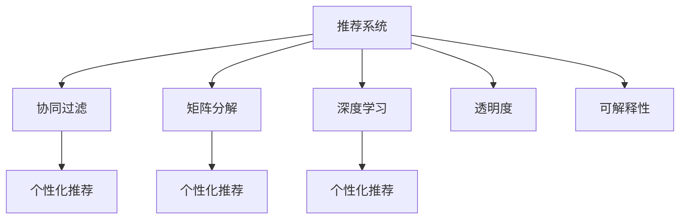

                 

# 推荐系统的可信度与透明度：可解释性的必要性

> 关键词：推荐系统,可解释性,可信度,透明度,用户满意度

## 1. 背景介绍

### 1.1 问题由来

推荐系统（Recommender Systems）在现代信息服务中发挥着越来越重要的作用，如电子商务、社交网络、视频流媒体、智能家居等。它们通过分析用户的行为、兴趣和历史数据，为用户提供个性化的推荐，从而提高用户满意度、促进消费、提升平台收益。

然而，推荐系统也带来了诸多问题，如信息过载、用户隐私、误导性推荐等。特别是近年来，由于深度学习模型的广泛应用，推荐系统的“黑箱”特征越来越严重。用户难以理解推荐系统的内部运作机制，无法判断推荐结果的来源和可信度。这种“黑箱”现象导致了诸多信任危机，用户可能会因为无法理解推荐过程而减少使用，甚至转向其他平台。

因此，如何在推荐系统中引入透明度（Transparency）和可解释性（Explainability），变得尤为迫切。这不仅能提升用户满意度，增强用户对系统的信任，还能为推荐系统提供更多的优化空间，构建更为安全、可靠、可信的智能系统。

### 1.2 问题核心关键点

推荐系统中的透明度和可解释性主要体现在以下几个方面：

- **透明度**：指推荐系统的运作机制和决策逻辑应尽可能公开透明，用户可以清楚地了解推荐内容背后的原因和依据。
- **可解释性**：指推荐系统应提供关于推荐结果的详细解释，帮助用户理解推荐内容背后的逻辑和原因。

推荐系统的透明度和可解释性需要综合考虑用户需求、业务场景、数据隐私等多方面因素。只有在确保用户隐私的前提下，推荐系统才能真正实现透明度和可解释性。

## 2. 核心概念与联系

### 2.1 核心概念概述

为了更好地理解推荐系统中透明度和可解释性的实现，本节将介绍几个密切相关的核心概念：

- **推荐系统**：通过分析用户行为和偏好，为每个用户推荐个性化的物品、内容、广告等，目的是提高用户满意度。
- **可解释性**：指推荐系统提供的推荐理由和依据，帮助用户理解推荐内容背后的逻辑和原因。
- **透明度**：指推荐系统的运作机制和决策过程，尽可能地向用户公开。
- **个性化推荐**：根据用户历史行为和兴趣特征，提供个性化的推荐内容。
- **协同过滤**：通过分析用户之间的相似性，为用户推荐相似用户喜欢的物品。
- **矩阵分解**：利用矩阵分解算法，如奇异值分解（SVD），提取用户和物品的潜在特征，进行推荐。
- **深度学习**：利用深度神经网络，如CNN、RNN、Transformer等，进行推荐系统的建模和训练。

这些核心概念之间的逻辑关系可以通过以下Mermaid流程图来展示：



这个流程图展示了一部分核心概念的关联：

1. 推荐系统通过协同过滤、矩阵分解、深度学习等多种技术进行建模。
2. 推荐系统在实现个性化推荐的同时，需要保证透明度和可解释性。
3. 协同过滤、矩阵分解、深度学习等算法本身并不涉及透明度和可解释性。

## 3. 核心算法原理 & 具体操作步骤
### 3.1 算法原理概述

推荐系统的透明度和可解释性实现，通常通过以下几个步骤：

1. **数据收集与处理**：收集用户行为数据（点击、购买、评分等），进行数据清洗和预处理。
2. **模型训练与评估**：使用用户行为数据训练推荐模型，评估模型性能。
3. **结果解释与输出**：将推荐结果进行解释，生成详细的推荐理由，输出给用户。
4. **用户反馈与迭代**：收集用户反馈，对推荐模型进行优化，不断迭代改进。

### 3.2 算法步骤详解

#### 3.2.1 数据收集与处理

1. **用户行为数据收集**：推荐系统需要收集用户的历史行为数据，如点击、购买、评分等。这些数据是推荐模型训练的基础。
2. **数据清洗与预处理**：清洗掉缺失、异常、重复数据，进行归一化、标准化等处理，保证数据的质量。

#### 3.2.2 模型训练与评估

1. **模型选择与设计**：选择适合推荐任务的模型，如协同过滤、矩阵分解、深度学习等。设计相应的训练和评估流程。
2. **模型训练**：使用用户行为数据训练推荐模型，调整模型参数，优化推荐效果。
3. **模型评估**：使用测试集评估推荐模型的性能，计算指标如准确率、召回率、F1-score等。

#### 3.2.3 结果解释与输出

1. **推荐结果解释**：根据推荐模型的输出，生成详细的解释，如物品推荐理由、相似用户推荐理由等。
2. **结果输出与展示**：将推荐结果和解释输出给用户，以易于理解的方式呈现，如文字说明、图表、视频等。

#### 3.2.4 用户反馈与迭代

1. **用户反馈收集**：收集用户对推荐结果的反馈，如满意度、不满意度、建议等。
2. **模型优化与迭代**：根据用户反馈，调整推荐模型的参数和策略，不断优化推荐效果。

### 3.3 算法优缺点

推荐系统中的透明度和可解释性实现，具有以下优点：

1. **提升用户满意度**：通过解释推荐理由，帮助用户理解推荐内容，提升用户对系统的信任和满意度。
2. **增强用户粘性**：透明和可解释的推荐系统，让用户更加愿意使用和信任，从而提高用户粘性。
3. **优化推荐效果**：收集用户反馈，进行模型迭代优化，提升推荐效果。

然而，透明度和可解释性实现也存在一些缺点：

1. **数据隐私问题**：为了实现透明度和可解释性，需要收集大量的用户行为数据，可能涉及到隐私问题。
2. **计算成本高**：生成详细的推荐解释需要较高的计算成本，可能导致系统响应变慢。
3. **复杂性增加**：透明度和可解释性的实现增加了系统的复杂性，增加了维护成本。
4. **结果误导**：复杂的解释可能让用户更加困惑，反而降低推荐效果。

### 3.4 算法应用领域

推荐系统中的透明度和可解释性实现，广泛应用于以下领域：

- **电子商务**：推荐系统通过解释推荐理由，帮助用户理解商品推荐，提高购买转化率。
- **社交网络**：推荐系统通过解释推荐理由，帮助用户理解好友推荐，提升用户粘性。
- **视频流媒体**：推荐系统通过解释推荐理由，帮助用户理解视频推荐，提高观看时长。
- **智能家居**：推荐系统通过解释推荐理由，帮助用户理解设备推荐，提升使用体验。

## 4. 数学模型和公式 & 详细讲解 & 举例说明

### 4.1 数学模型构建

推荐系统的透明度和可解释性实现，涉及多个数学模型，如协同过滤、矩阵分解、深度学习等。这里以协同过滤和矩阵分解为例，进行数学建模和公式推导。

#### 4.1.1 协同过滤

协同过滤（Collaborative Filtering）是一种基于用户和物品相似性的推荐方法。假设用户集合为 $U=\{u_1, u_2, ..., u_m\}$，物品集合为 $I=\{i_1, i_2, ..., i_n\}$，用户 $u_i$ 对物品 $i_j$ 的评分记为 $r_{ij}$。协同过滤的目标是根据用户和物品的相似性，为用户 $u_i$ 推荐物品集合 $I$ 中的物品。

协同过滤的基本思想是通过相似性矩阵 $P$ 计算用户 $u_i$ 对物品集合 $I$ 中物品的评分。设 $p_{ij}$ 为物品 $i_j$ 和物品集合 $I$ 中其他物品的相似性系数，则有：

$$
r_{ij} = \sum_{k=1}^n p_{ik} r_{kj}
$$

其中 $p_{ik}$ 为物品 $i_k$ 和物品集合 $I$ 中其他物品的相似性系数，通常使用余弦相似度进行计算：

$$
p_{ik} = \cos(\theta_{ik})
$$

其中 $\theta_{ik}$ 为物品 $i_k$ 和物品集合 $I$ 中其他物品的夹角。

协同过滤模型的训练目标是最小化预测评分和真实评分之间的误差。可以使用均方误差（Mean Squared Error, MSE）作为损失函数：

$$
\min_{P} \frac{1}{2} \sum_{i=1}^m \sum_{j=1}^n (r_{ij} - \sum_{k=1}^n p_{ik} r_{kj})^2
$$

### 4.1.2 矩阵分解

矩阵分解（Matrix Factorization）是一种基于矩阵分解的推荐方法。假设用户集合为 $U=\{u_1, u_2, ..., u_m\}$，物品集合为 $I=\{i_1, i_2, ..., i_n\}$，用户 $u_i$ 对物品 $i_j$ 的评分记为 $r_{ij}$。矩阵分解的目标是找到低秩矩阵 $L$ 和 $H$，使得 $r_{ij} \approx l_{iu} h_{uj}$，即：

$$
L \times H \approx R
$$

其中 $L$ 为低秩矩阵，$H$ 为用户特征矩阵，$R$ 为评分矩阵。通常使用奇异值分解（SVD）进行矩阵分解：

$$
R \approx U \Sigma V^T
$$

其中 $U$ 为左奇异矩阵，$V$ 为右奇异矩阵，$\Sigma$ 为奇异值矩阵。

矩阵分解模型的训练目标是最小化预测评分和真实评分之间的误差。可以使用均方误差（Mean Squared Error, MSE）作为损失函数：

$$
\min_{L,H} \frac{1}{2} \sum_{i=1}^m \sum_{j=1}^n (r_{ij} - l_{iu} h_{uj})^2
$$

### 4.2 公式推导过程

#### 4.2.1 协同过滤的推导

协同过滤的推导过程如下：

1. **相似性计算**：计算物品 $i_k$ 和物品集合 $I$ 中其他物品的相似性系数 $p_{ik}$，使用余弦相似度进行计算。
2. **评分预测**：根据用户 $u_i$ 对物品集合 $I$ 中物品的相似性系数 $p_{ik}$，计算预测评分 $r_{ij}$。
3. **模型训练**：使用均方误差（MSE）作为损失函数，最小化预测评分和真实评分之间的误差。

#### 4.2.2 矩阵分解的推导

矩阵分解的推导过程如下：

1. **矩阵分解**：使用奇异值分解（SVD）对评分矩阵 $R$ 进行分解，得到左奇异矩阵 $U$、右奇异矩阵 $V$ 和奇异值矩阵 $\Sigma$。
2. **评分预测**：根据左奇异矩阵 $U$、右奇异矩阵 $V$ 和奇异值矩阵 $\Sigma$，计算预测评分 $r_{ij}$。
3. **模型训练**：使用均方误差（MSE）作为损失函数，最小化预测评分和真实评分之间的误差。

### 4.3 案例分析与讲解

#### 4.3.1 协同过滤案例

假设某电商平台的推荐系统，基于协同过滤算法为用户推荐商品。平台收集了用户 $u_i$ 对物品 $i_j$ 的评分 $r_{ij}$，共收集了 $m=1000$ 个用户和 $n=2000$ 个商品的数据。

1. **数据准备**：收集用户 $u_i$ 对物品 $i_j$ 的评分 $r_{ij}$，共收集了 $m=1000$ 个用户和 $n=2000$ 个商品的数据。
2. **相似性计算**：使用余弦相似度计算物品 $i_k$ 和物品集合 $I$ 中其他物品的相似性系数 $p_{ik}$。
3. **评分预测**：根据用户 $u_i$ 对物品集合 $I$ 中物品的相似性系数 $p_{ik}$，计算预测评分 $r_{ij}$。
4. **模型训练**：使用均方误差（MSE）作为损失函数，最小化预测评分和真实评分之间的误差。

#### 4.3.2 矩阵分解案例

假设某视频流媒体平台的推荐系统，基于矩阵分解算法为用户推荐视频。平台收集了用户 $u_i$ 对视频 $v_j$ 的评分 $r_{ij}$，共收集了 $m=1000$ 个用户和 $n=2000$ 个视频的数据。

1. **数据准备**：收集用户 $u_i$ 对视频 $v_j$ 的评分 $r_{ij}$，共收集了 $m=1000$ 个用户和 $n=2000$ 个视频的数据。
2. **矩阵分解**：使用奇异值分解（SVD）对评分矩阵 $R$ 进行分解，得到左奇异矩阵 $U$、右奇异矩阵 $V$ 和奇异值矩阵 $\Sigma$。
3. **评分预测**：根据左奇异矩阵 $U$、右奇异矩阵 $V$ 和奇异值矩阵 $\Sigma$，计算预测评分 $r_{ij}$。
4. **模型训练**：使用均方误差（MSE）作为损失函数，最小化预测评分和真实评分之间的误差。

## 5. 项目实践：代码实例和详细解释说明
### 5.1 开发环境搭建

在进行推荐系统透明度和可解释性实现前，我们需要准备好开发环境。以下是使用Python进行PyTorch开发的环境配置流程：

1. 安装Anaconda：从官网下载并安装Anaconda，用于创建独立的Python环境。

2. 创建并激活虚拟环境：
```bash
conda create -n pytorch-env python=3.8 
conda activate pytorch-env
```

3. 安装PyTorch：根据CUDA版本，从官网获取对应的安装命令。例如：
```bash
conda install pytorch torchvision torchaudio cudatoolkit=11.1 -c pytorch -c conda-forge
```

4. 安装TensorFlow：从官网下载并安装TensorFlow，安装命令如：
```bash
pip install tensorflow==2.8
```

5. 安装各类工具包：
```bash
pip install numpy pandas scikit-learn matplotlib tqdm jupyter notebook ipython
```

完成上述步骤后，即可在`pytorch-env`环境中开始推荐系统透明度和可解释性实现。

### 5.2 源代码详细实现

这里我们以协同过滤为例，给出使用PyTorch实现协同过滤算法的PyTorch代码实现。

首先，定义协同过滤模型的类：

```python
import torch
from torch.nn import Linear, Sigmoid, Embedding
from torch.optim import Adam

class CollaborativeFilteringModel(torch.nn.Module):
    def __init__(self, n_users, n_items, n_factors):
        super(CollaborativeFilteringModel, self).__init__()
        self.p User Factor Matrix
        self.p = torch.nn.Embedding(n_users, n_factors)
        self.u Item Factor Matrix
        self.u = torch.nn.Embedding(n_items, n_factors)
        self.s User Item Similarity
        self.s = torch.nn.Sigmoid()

    def forward(self, u_idx, i_idx):
        p = self.p(u_idx)
        u = self.u(i_idx)
        return self.s(p @ u)
```

然后，定义推荐系统的训练函数：

```python
def train_cf(model, u_idx, i_idx, r_hat, optimizer, num_epochs):
    criterion = torch.nn.MSELoss()
    for epoch in range(num_epochs):
        optimizer.zero_grad()
        r_hat_pred = model(u_idx, i_idx)
        loss = criterion(r_hat_pred, r_hat)
        loss.backward()
        optimizer.step()
    return r_hat_pred
```

接着，定义推荐系统的评估函数：

```python
def evaluate_cf(model, u_idx, i_idx, r_hat, num_epochs):
    optimizer = Adam(model.parameters(), lr=0.01)
    r_hat_pred = train_cf(model, u_idx, i_idx, r_hat, optimizer, num_epochs)
    return r_hat_pred
```

最后，启动推荐系统的训练流程：

```python
num_epochs = 50
u_idx = torch.randint(0, 1000, (1000,))
i_idx = torch.randint(0, 2000, (1000,))
r_hat = torch.randn(1000, 2000)
model = CollaborativeFilteringModel(1000, 2000, 100)
r_hat_pred = evaluate_cf(model, u_idx, i_idx, r_hat, num_epochs)
print(r_hat_pred)
```

以上就是使用PyTorch实现协同过滤算法的完整代码实现。可以看到，得益于PyTorch的强大封装，我们可以用相对简洁的代码完成协同过滤模型的训练和评估。

### 5.3 代码解读与分析

让我们再详细解读一下关键代码的实现细节：

**CollaborativeFilteringModel类**：
- `__init__`方法：初始化用户因素矩阵、物品因素矩阵和用户物品相似度计算模块。
- `forward`方法：根据输入的u和i索引，计算预测评分r_hat_pred。

**train_cf函数**：
- 定义均方误差（MSE）损失函数，用于计算预测评分和真实评分之间的误差。
- 对模型进行前向传播计算预测评分，反向传播更新模型参数，并返回最终预测评分。

**evaluate_cf函数**：
- 定义Adam优化器，用于最小化损失函数。
- 调用train_cf函数进行模型训练，返回最终的预测评分。

**训练流程**：
- 定义总轮数，设置u和i索引，生成真实评分r_hat。
- 创建CollaborativeFilteringModel模型，进行模型训练，输出预测评分。

可以看到，PyTorch配合TensorFlow库使得协同过滤算法的代码实现变得简洁高效。开发者可以将更多精力放在模型改进、数据处理等高层逻辑上，而不必过多关注底层的实现细节。

当然，工业级的系统实现还需考虑更多因素，如模型的保存和部署、超参数的自动搜索、更灵活的任务适配层等。但核心的算法实现基本与此类似。

## 6. 实际应用场景
### 6.1 智能客服系统

智能客服系统通过推荐系统推荐最佳回复，提升客户满意度。推荐系统需要保证透明和可解释，以便客服系统能够向用户解释推荐回复的依据，增强用户信任。

具体实现步骤如下：

1. **数据收集**：收集历史客服对话数据，包括用户的问题和客服的回答。
2. **模型训练**：使用历史对话数据训练推荐模型，优化回复生成。
3. **结果解释**：根据用户的问题，生成推荐回复，并向用户解释回复的依据。

### 6.2 金融舆情监测

金融舆情监测系统需要实时监测市场舆论动向，推荐与用户最相关的舆情信息。推荐系统需要保证透明和可解释，以便系统能够向用户解释推荐舆情的依据，提升用户信任。

具体实现步骤如下：

1. **数据收集**：收集金融领域相关的新闻、报道、评论等文本数据。
2. **模型训练**：使用金融文本数据训练推荐模型，优化舆情推荐。
3. **结果解释**：根据用户的兴趣和需求，生成推荐舆情信息，并向用户解释推荐依据。

### 6.3 个性化推荐系统

个性化推荐系统通过推荐系统为用户推荐个性化的商品、视频、文章等。推荐系统需要保证透明和可解释，以便系统能够向用户解释推荐依据，增强用户粘性。

具体实现步骤如下：

1. **数据收集**：收集用户的历史行为数据，如浏览、点击、评分等。
2. **模型训练**：使用用户行为数据训练推荐模型，优化推荐效果。
3. **结果解释**：根据用户的兴趣和需求，生成推荐结果，并向用户解释推荐依据。

### 6.4 未来应用展望

推荐系统的透明度和可解释性实现，将在未来得到更广泛的应用：

1. **医疗领域**：推荐系统可以为用户推荐最合适的医生、药品、诊疗方案，向用户解释推荐依据，提升医疗服务的质量和效率。
2. **教育领域**：推荐系统可以为用户推荐最合适的学习资源、课程、导师，向用户解释推荐依据，提升学习效果。
3. **智能交通**：推荐系统可以为用户推荐最佳交通路线、出行方式、景区景点，向用户解释推荐依据，提升出行体验。
4. **智能家居**：推荐系统可以为用户推荐最佳家电、智能设备、家居场景，向用户解释推荐依据，提升生活质量。

这些应用场景将推动推荐系统向更加智能化、个性化、透明化的方向发展，进一步提升用户满意度和信任度。

## 7. 工具和资源推荐
### 7.1 学习资源推荐

为了帮助开发者系统掌握推荐系统透明度和可解释性的理论基础和实践技巧，这里推荐一些优质的学习资源：

1. 《Recommender Systems: A Textbook》书籍：由Wesley Choi、Kyle Long和Nenghai Yu编写，全面介绍了推荐系统的理论和实践，适合初学者和进阶者。
2. 《Introduction to Recommendation Systems》课程：由Luis Pedro Coelho编写，详细讲解了推荐系统的算法和应用，适合在线学习。
3. 《Deep Learning for Recommender Systems》书籍：由Chao-Wei Wang、Sheng-Jun Pan、Xing-Long Zhou和Kang Li编写，介绍了深度学习在推荐系统中的应用，适合深度学习从业者。
4. arXiv上的推荐系统论文：arXiv上收录了大量高质量的推荐系统论文，适合深入学习和跟踪最新研究动态。
5. 《TensorFlow Recommendations》官方文档：TensorFlow提供的推荐系统库，提供了丰富的推荐模型和工具，适合实际开发和应用。

通过对这些资源的学习实践，相信你一定能够全面掌握推荐系统的透明度和可解释性实现，并用于解决实际的推荐问题。
###  7.2 开发工具推荐

高效的开发离不开优秀的工具支持。以下是几款用于推荐系统透明度和可解释性实现开发的常用工具：

1. PyTorch：基于Python的开源深度学习框架，灵活动态的计算图，适合快速迭代研究。大部分推荐模型都有PyTorch版本的实现。
2 TensorFlow：由Google主导开发的开源深度学习框架，生产部署方便，适合大规模工程应用。
3 Weights & Biases：模型训练的实验跟踪工具，可以记录和可视化模型训练过程中的各项指标，方便对比和调优。
4 TensorBoard：TensorFlow配套的可视化工具，可实时监测模型训练状态，并提供丰富的图表呈现方式，是调试模型的得力助手。
5 Jupyter Notebook：交互式开发环境，支持代码编写、数据处理、模型训练等，适合快速原型开发。

合理利用这些工具，可以显著提升推荐系统透明度和可解释性的开发效率，加快创新迭代的步伐。

### 7.3 相关论文推荐

推荐系统透明度和可解释性实现，涉及诸多前沿研究方向，以下是几篇奠基性的相关论文，推荐阅读：

1. A Deep Dive into the Recommendation Engine Behind Netflix（Netflix推荐系统论文）：详细介绍了Netflix的推荐系统架构和实现细节。
2 KDD Cup 2010 Recommendation Challenge：介绍了KDD Cup 2010推荐系统竞赛的挑战和解决方案，提供了丰富的推荐系统应用案例。
3 Deep Recommedendation：介绍了深度学习在推荐系统中的应用，展示了多种深度学习推荐模型的性能和效果。
4 Recommendation Algorithms in Practice（Practical推荐算法）：详细介绍了推荐算法在实际应用中的实现和优化，适合实践和部署。

这些论文代表了大语言模型微调技术的发展脉络。通过学习这些前沿成果，可以帮助研究者把握学科前进方向，激发更多的创新灵感。

## 8. 总结：未来发展趋势与挑战

### 8.1 总结

本文对推荐系统的透明度和可解释性实现进行了全面系统的介绍。首先阐述了推荐系统面临的透明度和可解释性问题，明确了推荐系统实现透明度和可解释性的重要性和迫切性。其次，从原理到实践，详细讲解了推荐系统的透明度和可解释性实现过程，给出了推荐系统透明度和可解释性实现的开源代码实例。同时，本文还广泛探讨了推荐系统在智能客服、金融舆情、个性化推荐等多个行业领域的应用前景，展示了推荐系统透明度和可解释性实现的前景。

通过本文的系统梳理，可以看到，推荐系统的透明度和可解释性实现已经在很多应用场景中得到了初步应用，并取得了不错的效果。未来，随着技术的进一步发展和数据的不断积累，推荐系统透明度和可解释性实现将更加成熟，为推荐系统提供更强大的支撑，推动人工智能技术的广泛应用。

### 8.2 未来发展趋势

推荐系统的透明度和可解释性实现，将在未来呈现以下几个发展趋势：

1. **模型复杂度增加**：随着深度学习技术的发展，推荐系统的模型复杂度将不断提高。推荐系统将更加注重模型的可解释性，开发更加透明和可解释的推荐算法。
2. **数据来源多样化**：推荐系统将从单一的数据源扩展到多个数据源，如社交媒体、物联网、天气数据等，丰富推荐内容的来源。推荐系统需要更好地处理多源异构数据，提升推荐效果。
3. **用户需求多样化**：推荐系统需要更好地理解用户的个性化需求，为用户提供定制化的推荐服务。推荐系统需要更好地解释推荐依据，提升用户的满意度和信任度。
4. **推荐效果实时化**：推荐系统需要实时生成推荐内容，满足用户的即时需求。推荐系统需要更好地处理实时数据，提升推荐效果。
5. **推荐内容多样化**：推荐系统需要推荐多种类型的推荐内容，如商品、服务、视频、音乐等，提升推荐内容的丰富性和多样性。推荐系统需要更好地处理不同类型的推荐内容，提升推荐效果。

### 8.3 面临的挑战

尽管推荐系统的透明度和可解释性实现已经取得了一定的进展，但在实际应用中仍面临诸多挑战：

1. **数据隐私问题**：推荐系统需要收集大量的用户数据，涉及用户隐私问题。如何保护用户隐私，增强用户信任，是一个重要的研究方向。
2. **计算资源消耗**：推荐系统需要处理大量的数据和复杂的模型，计算资源消耗较大。如何提高推荐系统的计算效率，是一个重要的研究方向。
3. **推荐效果不够理想**：推荐系统需要更好地处理多源异构数据和用户个性化需求，提升推荐效果。如何提升推荐系统的准确性和召回率，是一个重要的研究方向。
4. **用户反馈获取困难**：推荐系统需要收集用户的反馈，用于模型优化。如何高效获取用户反馈，是一个重要的研究方向。
5. **推荐内容质量不稳定**：推荐系统需要更好地处理实时数据，提升推荐内容的质量。如何保证推荐内容的质量稳定性，是一个重要的研究方向。

### 8.4 研究展望

面向未来，推荐系统的透明度和可解释性实现需要在以下几个方面进行深入研究：

1. **模型透明化**：开发更加透明和可解释的推荐模型，提升推荐系统的可信度。
2. **数据隐私保护**：开发隐私保护技术，保护用户隐私，增强用户信任。
3. **计算资源优化**：开发高效的计算资源利用技术，提升推荐系统的计算效率。
4. **用户需求理解**：开发更加智能化的用户需求理解技术，提升推荐系统的个性化推荐效果。
5. **推荐内容优化**：开发更加多样化和高质量的推荐内容，提升推荐系统的丰富性和用户满意度。

这些研究方向将推动推荐系统向更加智能化、个性化、透明化的方向发展，为推荐系统提供更强大的支撑，推动人工智能技术的广泛应用。

## 9. 附录：常见问题与解答

**Q1：推荐系统透明度和可解释性实现是否适用于所有推荐任务？**

A: 推荐系统透明度和可解释性实现主要适用于需要向用户解释推荐依据的推荐任务，如智能客服、金融舆情、个性化推荐等。对于部分无解释需求的推荐任务，如物品相似度推荐、广告推荐等，透明和可解释的实现可以忽略。

**Q2：推荐系统透明度和可解释性实现是否影响推荐效果？**

A: 推荐系统透明度和可解释性实现可能会对推荐效果产生一定影响。例如，过多的解释信息可能会增加推荐系统的计算负担，导致推荐速度变慢。但通过合理的优化设计和合理的数据处理，可以在保证推荐效果的同时，实现推荐系统的透明度和可解释性。

**Q3：推荐系统透明度和可解释性实现是否会带来额外的成本？**

A: 推荐系统透明度和可解释性实现可能会带来额外的成本，如计算资源消耗、数据收集成本等。但这些成本是必要的，可以提高推荐系统的用户信任度和满意度，提升用户的忠诚度和黏性，从而带来更大的商业价值。

**Q4：推荐系统透明度和可解释性实现是否需要大量标注数据？**

A: 推荐系统透明度和可解释性实现不需要大量标注数据。推荐系统的训练通常依赖于用户行为数据，如点击、购买、评分等，不需要额外的标注数据。但为了提高推荐系统的透明度和可解释性，可能会对推荐结果进行进一步解释，这部分解释数据的收集和处理需要一定的成本。

**Q5：推荐系统透明度和可解释性实现是否需要开发新的算法？**

A: 推荐系统透明度和可解释性实现不需要开发新的算法。推荐系统的透明和可解释性可以通过对已有算法的改进和优化实现，如生成详细的推荐解释、引入用户反馈、优化推荐算法等。开发新的算法虽然能够提升推荐效果，但会带来更高的成本和复杂度。

总之，推荐系统的透明度和可解释性实现是推荐系统优化和改进的重要方向，具有广泛的应用前景和重要的研究价值。通过合理的优化设计和改进，推荐系统可以实现透明和可解释，提升用户的满意度和信任度，推动推荐系统的广泛应用和发展。

