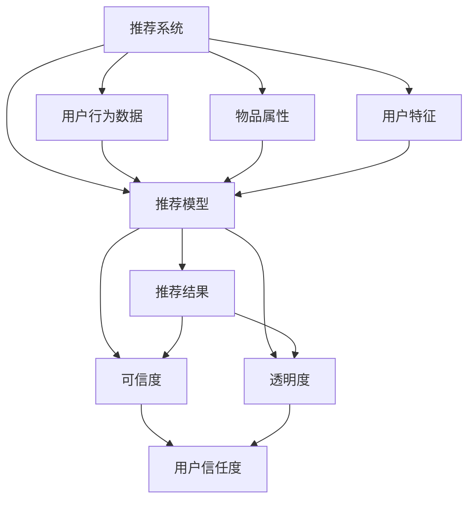

                 

# 推荐系统的可信度与透明度：可解释性的重要作用

> 关键词：推荐系统, 可信度, 透明度, 可解释性, 用户理解, 数据隐私, 决策过程

## 1. 背景介绍

随着互联网和电子商务的飞速发展，推荐系统已成为在线业务的核心引擎，广泛应用于商品推荐、新闻推荐、音乐推荐等多个场景。推荐系统通过分析用户行为数据，预测用户偏好，为用户推荐个性化内容。然而，推荐系统的高效性往往牺牲了用户对推荐结果的可信度和透明度。如何提升推荐系统的可信度与透明度，成为学术界和产业界亟需解决的课题。本文从推荐系统的可解释性出发，探讨其对可信度和透明度的重要影响，并提出解决建议。

## 2. 核心概念与联系

### 2.1 核心概念概述

为更好地理解推荐系统的可信度和透明度问题，本节将介绍几个关键概念：

- 推荐系统(Recommendation System)：一种利用用户历史行为数据、物品属性和用户特征等信息，通过计算模型预测用户对物品的偏好，并为用户推荐个性化内容的技术。
- 可信度(Trustworthiness)：推荐系统输出结果的准确性和可靠性。用户对推荐结果的信任度直接影响系统的效果和使用体验。
- 透明度(Transparency)：推荐系统决策过程的可解释性。用户理解推荐过程，有助于提升系统信赖度和使用体验。
- 可解释性(Explainability)：推荐系统输出结果的可解释程度，即用户能够理解推荐理由，明晰推荐依据。

通过理解这些核心概念，我们可以更好地把握推荐系统的工作原理和优化方向。

### 2.2 核心概念原理和架构的 Mermaid 流程图



这个流程图展示了推荐系统的核心组成及其相互关系：

1. 推荐系统通过分析用户行为数据、物品属性和用户特征，运用推荐模型预测用户对物品的偏好。
2. 推荐结果的准确性和可靠性（可信度）影响用户对系统的信任度。
3. 推荐过程的可解释性（透明度）直接影响用户理解推荐理由的难易程度。
4. 通过提升可信度和透明度，增强用户对系统的信任和依赖，提升用户满意度。

## 3. 核心算法原理 & 具体操作步骤
### 3.1 算法原理概述

推荐系统的可信度和透明度密切相关。可信度越高，推荐结果越可靠，透明度越高，用户越容易理解推荐过程。推荐系统的可解释性直接影响其可信度和透明度。以下从算法原理和操作步骤两方面展开详细说明。

### 3.2 算法步骤详解

基于协同过滤算法的推荐系统通常分为以下步骤：

1. **数据准备**：收集用户历史行为数据，物品属性和用户特征。
2. **模型训练**：运用协同过滤模型（如矩阵分解、基于图模型等）训练推荐模型。
3. **推荐生成**：根据训练好的模型预测用户对物品的评分，选择评分较高的物品作为推荐结果。
4. **可信度评估**：通过交叉验证、A/B测试等方式评估推荐模型的可信度。
5. **透明度提升**：使用可解释性方法（如模型解释器、特征贡献分析等）提升推荐过程的透明度。
6. **用户反馈收集**：收集用户对推荐结果的反馈，持续改进推荐模型。

### 3.3 算法优缺点

基于协同过滤算法的推荐系统有以下优点：

1. 数据稀疏性好：协同过滤算法基于用户行为数据，不需要过多物品属性和用户特征，可以有效处理稀疏数据。
2. 可解释性强：协同过滤算法基于用户历史行为，可以直观展示推荐理由。
3. 适用范围广：协同过滤算法适用于多种推荐场景，如商品推荐、新闻推荐等。

然而，协同过滤算法也存在以下缺点：

1. 依赖用户行为：协同过滤算法依赖用户行为数据，当用户行为稀疏或缺失时，推荐效果较差。
2. 数据冷启动问题：协同过滤算法在面对新用户和新物品时，难以进行推荐。
3. 可扩展性差：协同过滤算法在高维稀疏矩阵中难以高效存储和计算，可扩展性较差。

### 3.4 算法应用领域

推荐系统广泛应用于商品推荐、新闻推荐、音乐推荐等多个场景，以下是几个具体应用实例：

1. **商品推荐系统**：电商平台通过用户浏览历史、购买记录等行为数据，预测用户对商品的偏好，为其推荐个性化商品。
2. **新闻推荐系统**：新闻网站通过分析用户阅读历史和点击行为，推荐相关新闻文章。
3. **音乐推荐系统**：音乐平台通过分析用户听歌历史和评分，推荐相似歌曲和个性化播放列表。
4. **视频推荐系统**：视频网站通过分析用户观看历史和评分，推荐相关视频内容。

## 4. 数学模型和公式 & 详细讲解 & 举例说明

### 4.1 数学模型构建

基于协同过滤算法的推荐模型通常采用矩阵分解方法，将用户-物品评分矩阵分解为用户因子矩阵和物品因子矩阵。设用户-物品评分矩阵为 $U$，用户因子矩阵为 $A$，物品因子矩阵为 $B$，则：

$$
U \approx A \times B
$$

其中 $A \in \mathbb{R}^{m \times k}, B \in \mathbb{R}^{n \times k}, U \in \mathbb{R}^{m \times n}, k$ 为因子维度。

### 4.2 公式推导过程

矩阵分解模型可以表示为：

$$
\min_{A, B} \frac{1}{2} \|U - A \times B\|_F^2
$$

其中 $\| \cdot \|_F$ 为矩阵的 Frobenius 范数。通过最小化上述损失函数，可得：

$$
A = UB^T (\frac{B^T B + \lambda I}{B^T B + \lambda I})^{-1}, B = U^T A (\frac{A^T A + \lambda I}{A^T A + \lambda I})^{-1}
$$

其中 $\lambda$ 为正则化参数。通过上述推导，可知矩阵分解模型可以有效地预测用户对物品的评分，提升推荐系统的可信度。

### 4.3 案例分析与讲解

以Amazon商品推荐系统为例，展示推荐系统如何通过矩阵分解提升推荐效果和可信度。

Amazon商品推荐系统通过用户行为数据（如浏览、购买记录等）构建用户-物品评分矩阵 $U$。设用户 $i$ 对物品 $j$ 的评分表示为 $u_{ij}$，$U$ 的维度为 $m \times n$，其中 $m$ 为物品数量，$n$ 为用户数量。

对 $U$ 进行矩阵分解，得：

$$
A = \mathop{\arg\min}_{A} \frac{1}{2} \|U - A \times B\|_F^2
$$

其中 $A \in \mathbb{R}^{m \times k}, B \in \mathbb{R}^{n \times k}, k$ 为因子维度。通过训练得到 $A$ 和 $B$，进而预测用户对物品的评分：

$$
\hat{u}_{ij} = A_i \times B_j
$$

其中 $\hat{u}_{ij}$ 为预测评分，$A_i$ 和 $B_j$ 分别为用户 $i$ 和物品 $j$ 的因子向量。通过对比预测评分和真实评分，可以评估推荐模型的可信度。

## 5. 项目实践：代码实例和详细解释说明

### 5.1 开发环境搭建

在进行推荐系统开发前，我们需要准备好开发环境。以下是使用Python进行PyTorch开发的环境配置流程：

1. 安装Anaconda：从官网下载并安装Anaconda，用于创建独立的Python环境。

2. 创建并激活虚拟环境：
```bash
conda create -n pytorch-env python=3.8 
conda activate pytorch-env
```

3. 安装PyTorch：根据CUDA版本，从官网获取对应的安装命令。例如：
```bash
conda install pytorch torchvision torchaudio cudatoolkit=11.1 -c pytorch -c conda-forge
```

4. 安装PyTorch Lightning：用于快速搭建推荐系统模型和训练流程。
```bash
pip install pytorch-lightning
```

5. 安装各类工具包：
```bash
pip install numpy pandas scikit-learn matplotlib tqdm jupyter notebook ipython
```

完成上述步骤后，即可在`pytorch-env`环境中开始推荐系统开发。

### 5.2 源代码详细实现

我们以基于矩阵分解的协同过滤算法为例，给出使用PyTorch Lightning实现推荐系统的代码实现。

```python
import torch
import torch.nn as nn
import torch.nn.functional as F
from torch.utils.data import DataLoader
from torch import optim
from sklearn.metrics import mean_squared_error

# 用户-物品评分矩阵
U = torch.randn(1000, 1000)

# 矩阵分解模型
class MatrixFactorization(nn.Module):
    def __init__(self, n_factors=10, n_users=1000, n_items=1000):
        super().__init__()
        self.user_factors = nn.Parameter(torch.randn(n_users, n_factors))
        self.item_factors = nn.Parameter(torch.randn(n_items, n_factors))
    
    def forward(self, user_index, item_index):
        user_factors = self.user_factors[user_index]
        item_factors = self.item_factors[item_index]
        predicted_ratings = torch.matmul(user_factors, item_factors.t()).squeeze()
        return predicted_ratings

# 训练函数
def train(model, train_loader, optimizer, device):
    model.to(device)
    model.train()
    for batch in train_loader:
        user_index, item_index, true_ratings = batch
        user_index, item_index, true_ratings = user_index.to(device), item_index.to(device), true_ratings.to(device)
        predicted_ratings = model(user_index, item_index)
        loss = F.mse_loss(predicted_ratings, true_ratings)
        optimizer.zero_grad()
        loss.backward()
        optimizer.step()

# 评估函数
def evaluate(model, test_loader, device):
    model.eval()
    mse = 0
    for batch in test_loader:
        user_index, item_index, true_ratings = batch
        user_index, item_index, true_ratings = user_index.to(device), item_index.to(device), true_ratings.to(device)
        predicted_ratings = model(user_index, item_index)
        mse += mean_squared_error(predicted_ratings, true_ratings).item()
    return mse / len(test_loader)

# 数据处理
from torch.utils.data import TensorDataset

train_data = TensorDataset(torch.LongTensor(range(1000)), torch.LongTensor(range(1000)), torch.randn(1000))
train_loader = DataLoader(train_data, batch_size=64)
test_data = TensorDataset(torch.LongTensor(range(1000)), torch.LongTensor(range(1000)), torch.randn(1000))
test_loader = DataLoader(test_data, batch_size=64)

# 训练和评估
model = MatrixFactorization()
optimizer = optim.Adam(model.parameters(), lr=0.01)
device = 'cuda'
for epoch in range(10):
    train(model, train_loader, optimizer, device)
    print(f'Epoch {epoch+1}, RMSE: {evaluate(model, test_loader, device):.3f}')
```

### 5.3 代码解读与分析

让我们再详细解读一下关键代码的实现细节：

**MatrixFactorization类**：
- `__init__方法`：初始化用户因子和物品因子的维度。
- `forward方法`：将用户和物品的索引转化为因子向量，计算预测评分。

**train函数**：
- 将模型迁移到指定设备（如GPU），进入训练模式。
- 循环遍历训练数据，将用户和物品索引传递给模型，计算预测评分。
- 计算预测评分和真实评分之间的均方误差，更新模型参数。

**evaluate函数**：
- 将模型迁移到指定设备，进入评估模式。
- 循环遍历测试数据，计算预测评分和真实评分之间的均方误差，取平均值作为最终的评估结果。

**数据处理**：
- 使用TensorDataset封装训练数据和测试数据，方便模型训练和评估。
- 使用DataLoader将数据批处理，提升训练效率。

**训练和评估流程**：
- 定义模型、优化器和设备。
- 循环训练模型，每次更新参数。
- 在每个epoch结束后，评估模型性能。

可以看到，PyTorch Lightning使得推荐系统的开发变得简洁高效。开发者可以将更多精力放在模型设计和超参数调整上，而不必过多关注底层的实现细节。

## 6. 实际应用场景

### 6.1 电商推荐系统

电商推荐系统通过分析用户浏览和购买行为，为用户推荐个性化商品。推荐结果直接影响用户购买决策，因此可信度和透明度尤为重要。

推荐系统可以收集用户浏览记录、购买记录和商品属性，通过矩阵分解模型预测用户对商品的评分，选择评分较高的商品作为推荐结果。同时，可以通过生成推荐的理由（如相似商品、购买历史等）提升推荐透明度。如此构建的电商推荐系统，能大幅提升用户满意度和转化率。

### 6.2 音乐推荐系统

音乐推荐系统通过分析用户听歌历史和评分，为用户推荐相似歌曲和个性化播放列表。音乐推荐系统的高频应用场景如Spotify、QQ音乐等。

推荐系统可以收集用户听歌历史和评分，使用协同过滤模型预测用户对音乐的评分，选择评分较高的音乐作为推荐结果。同时，可以使用基于内容的推荐算法，根据音乐属性生成推荐理由，提升推荐透明度。推荐系统还可以集成音乐推荐榜、音乐评论等外生信息，增强推荐效果。

### 6.3 视频推荐系统

视频推荐系统通过分析用户观看历史和评分，为用户推荐相关视频内容。视频推荐系统如YouTube、B站等。

推荐系统可以收集用户观看历史和评分，使用协同过滤模型预测用户对视频的评分，选择评分较高的视频作为推荐结果。同时，可以使用基于内容的推荐算法，根据视频属性生成推荐理由，提升推荐透明度。推荐系统还可以集成用户评论、视频标签等外生信息，增强推荐效果。

### 6.4 未来应用展望

随着推荐系统的发展，未来的推荐技术将更加智能化、透明化和可信化。推荐系统将面向更多应用场景，为各行各业提供精准的推荐服务。

在智慧医疗领域，推荐系统可以用于推荐个性化医疗方案、药物选择等，提升医疗服务的智能化水平。

在智能教育领域，推荐系统可以用于推荐个性化学习资源、课程等，因材施教，促进教育公平，提高教学质量。

在智慧城市治理中，推荐系统可以用于推荐智能交通方案、公共服务资源等，提高城市管理的自动化和智能化水平。

此外，在企业生产、社会治理、文娱传媒等众多领域，推荐系统也将不断涌现，为经济社会发展注入新的动力。相信随着技术的不断进步，推荐系统必将在更广阔的应用领域大放异彩。

## 7. 工具和资源推荐
### 7.1 学习资源推荐

为了帮助开发者系统掌握推荐系统的理论基础和实践技巧，这里推荐一些优质的学习资源：

1. 《推荐系统基础》系列博文：由推荐系统专家撰写，深入浅出地介绍了推荐系统的工作原理、算法类型、应用场景等。

2. CS455《推荐系统》课程：斯坦福大学开设的推荐系统课程，有Lecture视频和配套作业，带你入门推荐系统领域的基本概念和经典算法。

3. 《推荐系统》书籍：经典推荐系统专著，全面介绍了推荐系统的理论基础和实践技巧，涵盖协同过滤、基于内容、混合推荐等多种算法。

4. KDD Cup推荐系统竞赛：KDD Cup竞赛为推荐系统领域提供了丰富的学习资源和挑战机会，众多经典推荐算法和模型在此得到验证。

5. ArXiv推荐系统论文：最新推荐系统论文的集散地，涵盖推荐算法、模型、应用等多个方面，具有很高的参考价值。

通过对这些资源的学习实践，相信你一定能够快速掌握推荐系统的精髓，并用于解决实际的推荐问题。

### 7.2 开发工具推荐

高效的开发离不开优秀的工具支持。以下是几款用于推荐系统开发的常用工具：

1. PyTorch：基于Python的开源深度学习框架，灵活动态的计算图，适合快速迭代研究。推荐系统常用模型如矩阵分解、深度神经网络等，都有PyTorch版本的实现。

2. TensorFlow：由Google主导开发的开源深度学习框架，生产部署方便，适合大规模工程应用。推荐系统常用模型如协同过滤、深度神经网络等，都有TensorFlow版本的实现。

3. LightFM：一个简单易用的推荐系统库，支持多种推荐算法，如协同过滤、矩阵分解、深度神经网络等，适合快速实现推荐系统原型。

4. Surprise：一个开源的推荐系统框架，提供多种推荐算法和评估指标，适合学术研究和工业实践。

5. Spark MLlib：Apache Spark推荐的机器学习库，支持分布式推荐系统开发，适合大数据场景。

合理利用这些工具，可以显著提升推荐系统的开发效率，加快创新迭代的步伐。

### 7.3 相关论文推荐

推荐系统的发展离不开学界的持续研究。以下是几篇奠基性的相关论文，推荐阅读：

1. "Collaborative Filtering for Implicit Feedback Datasets"：提出了基于矩阵分解的协同过滤算法，为推荐系统奠定基础。

2. "Learning to Rank for Information Retrieval, Recommendation and Search"：提出了基于排序学习的推荐系统算法，提升推荐效果。

3. "FNN: A Fast Item Factorization Machine for Recommendations"：提出了基于神经网络的推荐系统算法，提升推荐效果和可解释性。

4. "A Survey of Recommendation Systems Based on User-Item Similarity"：全面综述了基于协同过滤的推荐系统算法，涵盖多种推荐方法。

5. "Popularity-Aware Deep Matrix Factorization for Scalable Recommendations"：提出了基于深度神经网络的推荐系统算法，提升推荐效果和可扩展性。

这些论文代表了大规模推荐系统的发展脉络。通过学习这些前沿成果，可以帮助研究者把握学科前进方向，激发更多的创新灵感。

## 8. 总结：未来发展趋势与挑战
### 8.1 总结

本文对推荐系统的可信度和透明度问题进行了全面系统的介绍。首先阐述了推荐系统的核心概念和关键问题，明确了可信度和透明度对推荐系统的重要性。其次，从算法原理和操作步骤两方面详细讲解了推荐系统的构建过程，并给出代码实现示例。同时，本文还广泛探讨了推荐系统在电商、音乐、视频等多个行业领域的应用前景，展示了推荐系统的巨大潜力。此外，本文精选了推荐系统的学习资源和开发工具，力求为读者提供全方位的技术指引。

通过本文的系统梳理，可以看到，推荐系统的可信度和透明度直接影响其应用效果和使用体验。构建高可信度和高透明度的推荐系统，需要从模型设计、数据处理、训练评估等多个环节进行全面优化。未来，伴随推荐系统技术的不断进步，必将在更多领域得到应用，为各行各业带来变革性影响。

### 8.2 未来发展趋势

展望未来，推荐系统的可信度和透明度将呈现以下几个发展趋势：

1. 推荐系统将更加智能化。基于深度学习、知识图谱等新技术，推荐系统将更加智能化，具备更好的预测能力和推荐效果。

2. 推荐系统将更加透明化。推荐系统的决策过程将更加可解释，用户能够更加清楚地了解推荐理由，提升系统信赖度。

3. 推荐系统将更加个性化。基于用户行为数据和个性化推荐算法，推荐系统将更加精准，为用户提供更加个性化的服务。

4. 推荐系统将更加可解释化。推荐系统将更加注重可解释性，提供推荐理由，使用户能够理解推荐过程。

5. 推荐系统将更加可信化。推荐系统的可信度将通过多种手段增强，如多模型融合、推荐榜展示等，提升用户对推荐结果的信任度。

以上趋势凸显了推荐系统的未来发展方向，这些方向的探索发展，将使得推荐系统更加贴近用户需求，更好地服务于智能社会。

### 8.3 面临的挑战

尽管推荐系统已经取得了显著成效，但在迈向更加智能化、透明化和可信化的过程中，它仍面临诸多挑战：

1. 数据稀疏性问题。推荐系统依赖用户行为数据，当用户行为稀疏时，推荐效果较差。如何有效处理稀疏数据，提高推荐系统的泛化能力，仍然是一个重要问题。

2. 模型复杂度问题。深度神经网络和知识图谱等复杂模型，需要较大的计算资源和存储空间，如何提升模型效率，降低计算成本，仍需进一步探索。

3. 推荐一致性问题。推荐系统面临用户行为多样性，如何保证推荐结果的一致性和稳定性，仍需进一步优化。

4. 隐私保护问题。推荐系统依赖用户行为数据，涉及用户隐私保护。如何平衡推荐效果和隐私保护，是一个重要问题。

5. 模型鲁棒性问题。推荐系统面临异常数据和噪声干扰，如何提高模型的鲁棒性和泛化能力，仍需进一步研究。

6. 系统实时性问题。推荐系统需要实时响应用户请求，如何提升系统的实时性和可扩展性，仍需进一步探索。

以上挑战凸显了推荐系统在未来发展中需要面对的问题，这些问题需要学术界和产业界共同努力，持续研究。

### 8.4 研究展望

面对推荐系统面临的诸多挑战，未来的研究需要在以下几个方面寻求新的突破：

1. 探索更加高效的推荐算法。开发更加高效的协同过滤和基于内容的推荐算法，提升推荐系统的泛化能力和推荐效果。

2. 引入更加丰富的数据源。结合社交网络、知识图谱、用户评论等外生信息，丰富推荐系统数据源，提升推荐系统的泛化能力和鲁棒性。

3. 引入更加先进的模型。引入深度神经网络、知识图谱等先进模型，提升推荐系统的智能化和可解释性。

4. 探索更加灵活的推荐方式。引入多模型融合、推荐榜展示等灵活推荐方式，提升推荐系统的透明性和用户信赖度。

5. 引入更加严格的数据处理和隐私保护机制。引入数据清洗、噪声处理、隐私保护等技术，提升推荐系统的可靠性和隐私保护能力。

6. 引入更加高效的系统架构。引入分布式计算、缓存等技术，提升推荐系统的实时性和可扩展性。

这些研究方向将为推荐系统带来新的突破，使得推荐系统更加高效、智能、透明和可信，为各行各业带来变革性影响。面向未来，推荐系统需要从数据、算法、工程、应用等多个维度协同发力，才能真正实现智能化推荐系统的目标。

## 9. 附录：常见问题与解答

**Q1：推荐系统是否适用于所有应用场景？**

A: 推荐系统适用于大多数应用场景，但需要根据具体场景进行调整优化。例如，推荐系统在商品推荐中效果较好，但在新闻推荐、视频推荐中需要结合多种推荐算法和模型，才能获得较好的推荐效果。

**Q2：推荐系统如何处理数据稀疏性问题？**

A: 推荐系统可以通过引入矩阵分解、深度神经网络等技术，处理数据稀疏性问题。例如，基于矩阵分解的协同过滤算法可以通过分解用户-物品评分矩阵，利用隐式反馈进行推荐。

**Q3：推荐系统如何提高模型泛化能力？**

A: 推荐系统可以通过引入数据增强、对抗训练等技术，提高模型泛化能力。例如，对抗训练可以在训练过程中引入噪声数据，提升模型的鲁棒性。

**Q4：推荐系统如何保护用户隐私？**

A: 推荐系统可以通过匿名化、差分隐私等技术，保护用户隐私。例如，差分隐私可以在模型训练过程中引入噪声，保护用户数据隐私。

**Q5：推荐系统如何提高模型鲁棒性？**

A: 推荐系统可以通过引入对抗训练、数据清洗等技术，提高模型鲁棒性。例如，对抗训练可以在训练过程中引入对抗样本，提升模型的鲁棒性。

**Q6：推荐系统如何提高实时性？**

A: 推荐系统可以通过引入缓存、分布式计算等技术，提高实时性。例如，缓存可以将用户行为数据和推荐结果缓存到内存中，提升系统响应速度。

**Q7：推荐系统如何提高可解释性？**

A: 推荐系统可以通过引入模型解释器、特征贡献分析等技术，提高可解释性。例如，模型解释器可以输出模型的决策依据，使用户了解推荐过程。

这些问题的解答为推荐系统在实际应用中提供了具体的解决思路和优化方法，能够帮助开发者在实践中更好地应用推荐系统。

---

作者：禅与计算机程序设计艺术 / Zen and the Art of Computer Programming

