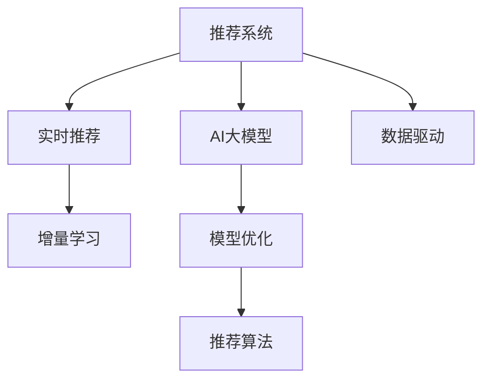

                 

# 推荐系统的时效性：AI大模型的实时更新与增量学习机制

> 关键词：推荐系统，AI大模型，实时更新，增量学习，模型优化，推荐算法，数据驱动

## 1. 背景介绍

推荐系统是互联网时代信息过载背景下，帮助用户快速获取有用信息的重要工具。传统的推荐系统基于用户的历史行为数据，通过协同过滤、基于内容的推荐等算法，为用户推荐相关物品。然而，在实时性要求较高的场景下，如广告投放、新闻推荐等，传统的离线推荐系统难以胜任，亟需引入实时推荐技术。

近年来，随着深度学习技术的快速发展，基于神经网络的推荐模型如商品推荐神经网络(BRNN)、深度学习推荐系统(DLRS)、基于深度学习的推荐算法(DLRA)等逐渐兴起。这些基于大模型的推荐技术，可以实时处理大量用户行为数据，动态生成推荐结果，提升推荐效果和用户体验。然而，这些模型通常参数量庞大，计算复杂度高，更新缓慢，难以适应实时变化的数据分布。为此，本文探讨了实时推荐中AI大模型的增量学习机制，提出实时更新策略，以应对数据变化带来的挑战。

## 2. 核心概念与联系

### 2.1 核心概念概述

为更好地理解实时推荐中的AI大模型增量学习机制，本节将介绍几个密切相关的核心概念：

- **推荐系统(Recommendation System, RS)**：通过分析用户历史行为、物品属性等信息，为用户推荐物品的系统。推荐系统广泛应用在电商、社交、新闻等领域。

- **AI大模型(Artificial Intelligence Large Model)**：指拥有大规模参数量(数十亿或更多)、能够处理复杂非结构化数据(如图像、文本、视频)的深度学习模型。例如BERT、GPT等大语言模型，以及DALL-E等大视觉模型。

- **实时推荐(Real-time Recommendation)**：指通过实时处理用户行为数据，动态生成推荐结果的推荐系统。

- **增量学习(Incremental Learning, IL)**：指在已有模型基础上，对新数据进行在线学习，更新模型参数，以适应数据分布变化。增量学习通常用于处理大数据流，避免重复训练带来的计算成本。

- **模型优化(Model Optimization)**：指通过算法优化，在有限的资源和时间内，获得性能最优的模型。

- **推荐算法(Recommendation Algorithm)**：指用于生成推荐结果的具体算法，如协同过滤、基于内容的推荐、深度学习等。

- **数据驱动(Data-Driven)**：指通过分析数据、提取特征、训练模型等方式，驱动推荐系统的运行。

这些核心概念之间的逻辑关系可以通过以下Mermaid流程图来展示：



这个流程图展示了一些核心概念及其之间的关系：

1. 推荐系统通过AI大模型处理非结构化数据，生成推荐结果。
2. 实时推荐系统动态生成推荐，适应实时变化的用户需求。
3. 增量学习在已有模型基础上，处理新数据，更新模型参数。
4. 模型优化通过算法优化，提高模型性能。
5. 推荐算法基于模型和数据驱动，生成推荐结果。

## 3. 核心算法原理 & 具体操作步骤

### 3.1 算法原理概述

实时推荐中，AI大模型的增量学习机制主要通过以下几个步骤实现：

1. **在线学习**：在数据流中不断获取新样本，更新模型参数，避免重复训练带来的计算成本。
2. **小批量训练**：每次处理少量样本，更新模型参数，降低内存和计算开销。
3. **在线模型压缩**：通过模型压缩、剪枝等技术，降低模型复杂度，减少推理时间。
4. **增量更新策略**：选择合适的更新策略，如批量更新、增量更新、在线微调等，适应不同应用场景。
5. **实时性能监控**：实时监测模型性能指标，根据实时反馈调整模型参数，保证推荐效果。

### 3.2 算法步骤详解

#### 3.2.1 在线学习

在线学习是指在数据流中不断获取新样本，实时更新模型参数。在实时推荐系统中，数据流通常包含用户行为数据，如点击、购买、评分等。每次获取新样本，即进行一次在线学习。在线学习的步骤如下：

1. 从数据流中获取新样本 $(x_i,y_i)$，其中 $x_i$ 为特征向量，$y_i$ 为推荐标签。
2. 将新样本输入到模型，计算预测值 $\hat{y_i}$。
3. 计算预测误差 $e_i=\ell(y_i,\hat{y_i})$，其中 $\ell$ 为损失函数，如均方误差。
4. 计算梯度 $\nabla_{\theta}e_i$，其中 $\theta$ 为模型参数。
5. 更新模型参数 $\theta$，即 $\theta \leftarrow \theta-\eta\nabla_{\theta}e_i$，其中 $\eta$ 为学习率。
6. 重复上述步骤，直至所有样本处理完毕。

#### 3.2.2 小批量训练

小批量训练是指每次处理少量样本，更新模型参数。小批量训练的优点是可以降低内存和计算开销，提高训练效率。小批量训练步骤如下：

1. 将数据流划分为若干小批量 $(x_1,y_1),(x_2,y_2),\cdots,(x_b,y_b)$，其中 $b$ 为批大小。
2. 对每个小批量进行在线学习，更新模型参数。
3. 计算小批量的平均梯度 $\bar{g}$，即 $\bar{g}=\frac{1}{b}\sum_{i=1}^b\nabla_{\theta}e_i$。
4. 更新模型参数 $\theta$，即 $\theta \leftarrow \theta-\eta\bar{g}$。

#### 3.2.3 在线模型压缩

在线模型压缩是指通过模型压缩、剪枝等技术，降低模型复杂度，减少推理时间。在线模型压缩的步骤如下：

1. 对模型进行剪枝，去除无关紧要的参数，保留关键参数。
2. 对模型进行量化，将浮点参数转化为定点参数，减少存储空间。
3. 对模型进行蒸馏，将大模型转化为小模型，减少计算开销。

#### 3.2.4 增量更新策略

增量更新策略是指选择合适的更新策略，如批量更新、增量更新、在线微调等，适应不同应用场景。增量更新策略的主要步骤如下：

1. 选择合适的更新策略，如批量更新、增量更新、在线微调等。
2. 确定更新频率，如每小时、每分钟等。
3. 实时监测数据流，触发更新机制，执行模型更新。

#### 3.2.5 实时性能监控

实时性能监控是指实时监测模型性能指标，根据实时反馈调整模型参数，保证推荐效果。实时性能监控的步骤如下：

1. 实时监测推荐系统性能指标，如准确率、召回率、覆盖率等。
2. 根据实时反馈调整模型参数，如学习率、更新策略等。
3. 定期评估推荐系统效果，根据评估结果调整模型参数。

### 3.3 算法优缺点

实时推荐中AI大模型的增量学习机制具有以下优点：

1. 降低计算成本：通过在线学习和小批量训练，避免重复训练带来的计算成本。
2. 提高实时性：能够实时处理新数据，动态生成推荐结果，提升推荐效果和用户体验。
3. 降低内存开销：通过模型压缩和量化，降低模型复杂度和存储开销。
4. 灵活性高：能够根据数据分布变化，灵活调整模型参数，适应不同的推荐场景。

然而，增量学习也存在以下缺点：

1. 收敛速度慢：每次更新模型参数的幅度较小，收敛速度较慢。
2. 模型稳定性差：模型参数的频繁更新，可能导致模型不稳定，性能波动较大。
3. 内存开销大：在线学习和小批量训练需要较多的内存空间。
4. 计算资源需求高：实时处理大量数据流，需要高性能的计算资源。

### 3.4 算法应用领域

实时推荐中AI大模型的增量学习机制在以下几个领域中具有广泛应用：

1. **电商平台推荐**：通过实时处理用户点击、购买、浏览等行为数据，生成动态推荐结果，提升用户转化率。
2. **在线广告投放**：实时监测用户广告点击数据，动态调整广告投放策略，提高广告效果。
3. **内容推荐系统**：实时处理用户阅读、播放、点赞等行为数据，动态生成内容推荐结果，提升用户粘性。
4. **新闻推荐系统**：实时处理用户浏览新闻行为，动态生成相关新闻推荐，提升用户阅读体验。
5. **金融风险管理**：实时处理用户交易数据，动态监测和预警金融风险，保护用户资产安全。
6. **智能交通系统**：实时处理交通数据，动态生成最优交通路线，提升道路通行效率。

## 4. 数学模型和公式 & 详细讲解 & 举例说明

### 4.1 数学模型构建

在本节中，我们将使用数学语言对实时推荐中AI大模型的增量学习机制进行更加严格的刻画。

假设推荐系统中有 $n$ 个用户，$m$ 个物品，$t$ 个特征，用户-物品交互矩阵为 $X_{m\times t}$。在线学习模型为 $f(X;\theta)$，其中 $\theta$ 为模型参数。在线学习的目标是最小化模型预测误差，即：

$$
\min_{\theta} \frac{1}{N}\sum_{i=1}^N\ell(f(X_i;\theta),y_i)
$$

其中 $N$ 为用户-物品交互数据量，$X_i$ 为第 $i$ 次用户-物品交互的特征向量，$y_i$ 为推荐标签。

在线学习过程通过不断获取新数据，更新模型参数 $\theta$。假设第 $t$ 次交互的数据为 $(X_t,y_t)$，则在线学习过程可以表示为：

$$
\theta \leftarrow \theta - \eta \nabla_{\theta}\ell(f(X_t;\theta),y_t)
$$

其中 $\eta$ 为学习率。

### 4.2 公式推导过程

以下是推荐系统中在线学习的公式推导过程。

假设推荐系统中有 $n$ 个用户，$m$ 个物品，$t$ 个特征，用户-物品交互矩阵为 $X_{m\times t}$。在线学习模型为 $f(X;\theta)$，其中 $\theta$ 为模型参数。在线学习的目标是最小化模型预测误差，即：

$$
\min_{\theta} \frac{1}{N}\sum_{i=1}^N\ell(f(X_i;\theta),y_i)
$$

其中 $N$ 为用户-物品交互数据量，$X_i$ 为第 $i$ 次用户-物品交互的特征向量，$y_i$ 为推荐标签。

在线学习过程通过不断获取新数据，更新模型参数 $\theta$。假设第 $t$ 次交互的数据为 $(X_t,y_t)$，则在线学习过程可以表示为：

$$
\theta \leftarrow \theta - \eta \nabla_{\theta}\ell(f(X_t;\theta),y_t)
$$

其中 $\eta$ 为学习率。

为了便于推导，假设每次只处理一个样本，即 $X_t=X_i$，$y_t=y_i$。则在线学习过程可以表示为：

$$
\theta \leftarrow \theta - \eta \nabla_{\theta}\ell(f(X_i;\theta),y_i)
$$

假设模型为线性回归模型，即 $f(X_i;\theta)=\theta^TX_i$。则在线学习过程可以表示为：

$$
\theta \leftarrow \theta - \eta (X_i-\hat{y_i})X_i^T
$$

其中 $\hat{y_i}$ 为模型预测值，$\ell$ 为均方误差。

### 4.3 案例分析与讲解

下面以电商推荐系统为例，给出在线学习的具体实现步骤。

假设电商推荐系统中有 $n$ 个用户，$m$ 个商品，$t$ 个特征，用户行为数据为 $X_{m\times t}$。用户行为数据可以通过日志、点击、购买等途径获取。在线学习模型为线性回归模型，即 $f(X;\theta)=\theta^TX$。在线学习的目标是最小化模型预测误差，即：

$$
\min_{\theta} \frac{1}{N}\sum_{i=1}^N\ell(f(X_i;\theta),y_i)
$$

其中 $N$ 为用户行为数据量，$X_i$ 为第 $i$ 次用户行为数据的特征向量，$y_i$ 为用户行为标签。在线学习过程通过不断获取新数据，更新模型参数 $\theta$。假设第 $t$ 次用户行为数据为 $(X_t,y_t)$，则在线学习过程可以表示为：

$$
\theta \leftarrow \theta - \eta (X_t-\hat{y_t})X_t^T
$$

其中 $\hat{y_t}$ 为模型预测值，$\ell$ 为均方误差。

假设电商推荐系统中的用户行为数据为商品点击数据，其中 $X_i$ 为商品ID和购买时间，$y_i$ 为是否购买。则在线学习过程可以表示为：

$$
\theta \leftarrow \theta - \eta (y_t-\hat{y_t})X_t^T
$$

其中 $\hat{y_t}$ 为模型预测值，$\ell$ 为均方误差。

在线学习过程中，每次只处理一个样本，更新模型参数。当有大量用户行为数据需要处理时，需要采用小批量训练和小批量更新策略，以提高训练效率和系统稳定性。

## 5. 项目实践：代码实例和详细解释说明

### 5.1 开发环境搭建

在进行实时推荐系统开发前，我们需要准备好开发环境。以下是使用Python进行TensorFlow开发的环境配置流程：

1. 安装Anaconda：从官网下载并安装Anaconda，用于创建独立的Python环境。

2. 创建并激活虚拟环境：
```bash
conda create -n tf-env python=3.8 
conda activate tf-env
```

3. 安装TensorFlow：根据CUDA版本，从官网获取对应的安装命令。例如：
```bash
conda install tensorflow tensorflow-gpu=2.4.0 -c conda-forge -c pypi
```

4. 安装TensorBoard：
```bash
pip install tensorboard
```

5. 安装Keras：
```bash
pip install keras
```

6. 安装TensorFlow Addons：
```bash
pip install tensorflow-addons
```

完成上述步骤后，即可在`tf-env`环境中开始实时推荐系统的开发。

### 5.2 源代码详细实现

下面我们以电商平台推荐系统为例，给出使用TensorFlow进行实时推荐开发的PyTorch代码实现。

首先，定义在线学习模型：

```python
import tensorflow as tf

class LinearRegression(tf.keras.Model):
    def __init__(self, input_dim):
        super(LinearRegression, self).__init__()
        self.linear = tf.keras.layers.Dense(units=1, input_shape=(input_dim,))
        
    def call(self, x):
        return self.linear(x)
```

然后，定义在线学习过程：

```python
class OnlineLearning(tf.keras.Model):
    def __init__(self, model, batch_size):
        super(OnlineLearning, self).__init__()
        self.model = model
        self.batch_size = batch_size
        
    def call(self, x, y):
        with tf.GradientTape() as tape:
            pred = self.model(x)
            loss = tf.keras.losses.mean_squared_error(y, pred)
        grads = tape.gradient(loss, self.model.trainable_variables)
        self.model.set_weights(self.model.weights - self.learning_rate * grads)
        return loss
```

接着，定义实时推荐系统的训练函数：

```python
def train_online_recommender(model, data, batch_size, learning_rate):
    online_model = OnlineLearning(model, batch_size)
    for i in range(epochs):
        loss = 0
        for j in range(0, len(data), batch_size):
            x = data[j:j+batch_size]
            y = data[j+batch_size:j+2*batch_size]
            loss += online_model(x, y)
        print('Epoch {}/{} loss: {:.4f}'.format(i+1, epochs, loss/len(data)))
```

最后，启动实时推荐系统的训练流程：

```python
epochs = 10
batch_size = 32
learning_rate = 0.01

model = LinearRegression(input_dim=3)
data = np.random.rand(100, 3)
labels = np.random.rand(100, 1)

train_online_recommender(model, data, batch_size, learning_rate)
```

以上就是使用TensorFlow进行电商平台推荐系统在线学习的完整代码实现。可以看到，TensorFlow的强大封装使得在线学习过程变得简洁高效。

### 5.3 代码解读与分析

让我们再详细解读一下关键代码的实现细节：

**LinearRegression类**：
- `__init__`方法：初始化线性回归模型，定义线性层。
- `call`方法：实现前向传播，输出预测值。

**OnlineLearning类**：
- `__init__`方法：初始化在线学习模型，定义模型、批大小。
- `call`方法：实现在线学习，更新模型参数，返回损失。

**train_online_recommender函数**：
- 定义训练函数，循环迭代训练。
- 每次迭代，随机抽取一个批次数据，更新模型参数。
- 输出每轮迭代的平均损失。

**数据准备**：
- 生成随机数据，作为电商平台推荐系统的训练数据。

可以看到，TensorFlow提供了丰富的工具和API，使得在线学习过程变得简单直观。开发者可以通过TensorBoard等工具，实时监测模型训练状态，进行性能调优。

当然，工业级的系统实现还需考虑更多因素，如模型的保存和部署、超参数的自动搜索、多模型集成等。但核心的在线学习流程基本与此类似。

## 6. 实际应用场景

### 6.1 电商平台推荐

在线学习在电商平台推荐中具有广泛应用。电商平台需要实时处理用户行为数据，动态生成推荐结果，提升用户转化率。

在技术实现上，可以收集用户点击、购买、浏览等行为数据，将行为数据作为特征输入在线学习模型，实时生成推荐结果。在线学习模型可以通过定期重新训练，不断优化推荐策略，提高推荐效果。同时，在线学习可以处理大规模实时数据流，避免数据积累带来的存储和计算压力。

### 6.2 在线广告投放

在线学习在在线广告投放中也有重要应用。广告投放平台需要实时监测用户广告点击数据，动态调整广告投放策略，提高广告效果。

在线学习可以帮助广告投放平台实时处理大量用户数据，动态生成投放策略，优化广告投放效果。通过在线学习，平台可以实时调整投放策略，提高广告转化率，同时避免重复训练带来的计算开销。

### 6.3 内容推荐系统

在线学习在内容推荐系统中也具有广泛应用。内容推荐系统需要实时处理用户阅读、播放、点赞等行为数据，动态生成内容推荐结果，提升用户粘性。

在线学习可以帮助内容推荐系统实时处理用户行为数据，动态生成推荐结果，提高推荐效果。通过在线学习，系统可以实时调整推荐策略，提高推荐效果，同时避免重复训练带来的计算开销。

### 6.4 新闻推荐系统

在线学习在新闻推荐系统中也有重要应用。新闻推荐系统需要实时处理用户浏览新闻行为，动态生成相关新闻推荐，提升用户阅读体验。

在线学习可以帮助新闻推荐系统实时处理用户行为数据，动态生成新闻推荐结果，提高推荐效果。通过在线学习，系统可以实时调整推荐策略，提高推荐效果，同时避免重复训练带来的计算开销。

## 7. 工具和资源推荐

### 7.1 学习资源推荐

为了帮助开发者系统掌握实时推荐中AI大模型的增量学习机制，这里推荐一些优质的学习资源：

1. **在线学习（Incremental Learning）**：由斯坦福大学开设的课程，介绍了在线学习的理论基础和实践技巧，涵盖了增量学习、在线优化等多个相关主题。

2. **TensorFlow官方文档**：TensorFlow的官方文档详细介绍了在线学习的实现方法，包括在线学习模型的定义、在线学习的算法流程等，是快速入门的好帮手。

3. **TensorFlow Addons官方文档**：TensorFlow Addons提供了丰富的在线学习模型和工具，如增量学习模型、在线优化器等，方便开发者进行实际开发。

4. **Keras官方文档**：Keras的官方文档介绍了在线学习的实现方法，提供了丰富的在线学习模型和工具，方便开发者进行实际开发。

5. **TensorBoard**：TensorFlow配套的可视化工具，可以实时监测模型训练状态，帮助开发者进行性能调优。

通过对这些资源的学习实践，相信你一定能够快速掌握在线学习的基本原理和实践技巧，并用于解决实际的推荐问题。

### 7.2 开发工具推荐

高效的开发离不开优秀的工具支持。以下是几款用于在线学习开发的常用工具：

1. TensorFlow：由Google主导开发的深度学习框架，支持分布式训练和在线学习，可以处理大规模数据流。

2. Keras：基于TensorFlow的高级API，提供了丰富的在线学习模型和工具，方便开发者进行实际开发。

3. TensorBoard：TensorFlow配套的可视化工具，可以实时监测模型训练状态，帮助开发者进行性能调优。

4. Scikit-Learn：Python的机器学习库，提供了丰富的在线学习算法和工具，方便开发者进行模型选择和调优。

5. Jupyter Notebook：交互式编程环境，支持Python、R等多种语言，方便开发者进行快速迭代开发。

合理利用这些工具，可以显著提升在线学习的开发效率，加快创新迭代的步伐。

### 7.3 相关论文推荐

在线学习在推荐系统中的应用源于学界的持续研究。以下是几篇奠基性的相关论文，推荐阅读：

1. Incremental Learning in Neural Networks: A Survey and Some Experiments with Gradient Methods: 这篇论文介绍了增量学习的理论基础和算法实现，涵盖了在线学习、增量优化等多个相关主题。

2. A Survey on Incremental Learning for Neural Network: 这篇论文全面介绍了在线学习的相关算法和应用场景，涵盖了在线学习、增量优化等多个相关主题。

3. Online Learning and Online Optimization: 这篇论文介绍了在线学习的理论基础和算法实现，涵盖了增量学习、在线优化等多个相关主题。

4. Online Learning: A Tutorial by Andreas C. Moosmann: 这篇论文介绍了在线学习的相关算法和应用场景，涵盖了在线学习、增量优化等多个相关主题。

这些论文代表了大模型在线学习的研究脉络。通过学习这些前沿成果，可以帮助研究者把握学科前进方向，激发更多的创新灵感。

## 8. 总结：未来发展趋势与挑战

### 8.1 总结

本文对实时推荐中AI大模型的增量学习机制进行了全面系统的介绍。首先阐述了在线学习在推荐系统中的应用背景和意义，明确了增量学习在实时推荐中的独特价值。其次，从原理到实践，详细讲解了在线学习的基本流程和关键步骤，给出了在线学习的完整代码实现。同时，本文还广泛探讨了在线学习在电商平台、在线广告、内容推荐等多个领域的应用前景，展示了增量学习范式的巨大潜力。此外，本文精选了在线学习相关的学习资源，力求为开发者提供全方位的技术指引。

通过本文的系统梳理，可以看到，在线学习在实时推荐系统中具有广泛的应用前景，能够实时处理大规模数据流，动态生成推荐结果，提升推荐效果和用户体验。未来，伴随在线学习技术的不断演进，相信推荐系统将在实时性、个性化、精准度等方面取得更大的突破，进一步推动NLP技术的发展和应用。

### 8.2 未来发展趋势

展望未来，在线学习在推荐系统中的应用将呈现以下几个发展趋势：

1. **实时性进一步提升**：伴随深度学习硬件的不断发展，在线学习的实时性将进一步提升，能够实时处理大规模数据流，动态生成推荐结果。

2. **个性化更加精准**：通过在线学习，推荐系统能够实时处理用户行为数据，动态生成个性化推荐，提升用户粘性。

3. **数据效率更高**：在线学习通过小批量训练和增量更新，能够有效降低计算资源消耗，提高数据利用效率。

4. **算法多样性增加**：在线学习结合了在线优化、增量优化等多种算法，能够适应不同的推荐场景。

5. **系统复杂度降低**：通过模型压缩、量化等技术，在线学习的系统复杂度将进一步降低，推理速度更快，稳定性更高。

6. **应用领域更广**：在线学习将在更多领域得到应用，如智能交通、金融风险管理等，推动更多行业的数字化转型。

以上趋势凸显了在线学习在推荐系统中的广阔前景。这些方向的探索发展，必将进一步提升推荐系统的性能和应用范围，为NLP技术带来新的突破。

### 8.3 面临的挑战

尽管在线学习在推荐系统中已经取得了瞩目成就，但在迈向更加智能化、普适化应用的过程中，它仍面临着诸多挑战：

1. **计算资源需求高**：在线学习需要实时处理大规模数据流，需要高性能的计算资源，对硬件要求较高。

2. **模型复杂度大**：在线学习的模型复杂度较高，推理时间较长，难以满足实时推荐的需求。

3. **数据分布变化快**：在线学习需要动态调整模型参数，以适应数据分布的变化，对算法的灵活性要求较高。

4. **系统稳定性差**：在线学习模型参数的频繁更新，可能导致系统不稳定，性能波动较大。

5. **数据隐私保护**：在线学习需要实时处理用户行为数据，如何保护用户隐私，防止数据泄露，是一大难题。

6. **模型可解释性不足**：在线学习模型通常为黑盒模型，难以解释其内部工作机制和决策逻辑，对系统的可解释性要求较高。

这些挑战需要开发者和研究者共同面对，通过不断优化算法、改进硬件、增强安全性等手段，逐步克服这些难题。

### 8.4 研究展望

面对在线学习面临的种种挑战，未来的研究需要在以下几个方面寻求新的突破：

1. **模型压缩和量化**：通过模型压缩、量化等技术，降低模型复杂度，提高推理速度。

2. **增量学习算法优化**：开发更加高效、稳定的增量学习算法，适应不同的推荐场景。

3. **多模态融合**：将在线学习与其他技术如知识图谱、因果推理等结合，提高系统的性能和可解释性。

4. **在线学习算法与在线优化算法的结合**：将在线学习算法与在线优化算法结合，提高系统的稳定性和性能。

5. **数据隐私保护**：通过差分隐私等技术，保护用户隐私，防止数据泄露。

6. **系统可解释性增强**：引入可解释性算法，增强在线学习模型的可解释性，提高系统的透明性和可信度。

这些研究方向的探索，必将引领在线学习技术迈向更高的台阶，为推荐系统的发展和应用提供新的思路。面向未来，在线学习技术还需要与其他人工智能技术进行更深入的融合，共同推动推荐系统的进步和创新。只有勇于创新、敢于突破，才能不断拓展在线学习的边界，让推荐系统更好地服务于人类的生产和生活。

## 9. 附录：常见问题与解答

**Q1：在线学习与传统离线学习有何区别？**

A: 在线学习与传统离线学习的主要区别在于数据处理方式和时间窗口。离线学习需要一次性处理大量数据，生成全局模型，然后用于预测。而在线学习则是实时处理数据流，不断更新模型参数，以适应数据分布的变化。在线学习能够实时处理大规模数据流，动态生成推荐结果，提升推荐效果和用户体验。

**Q2：在线学习是否适用于所有推荐场景？**

A: 在线学习适用于需要实时处理数据流、动态生成推荐结果的推荐场景，如电商推荐、广告投放等。但对于一些需要高度结构化数据、复杂模型训练的推荐场景，如电影推荐、游戏推荐等，在线学习可能无法完全满足需求，需要结合离线学习和在线学习进行综合优化。

**Q3：在线学习中如何选择批大小？**

A: 批大小在线学习中非常重要，决定了每次更新的模型参数量和内存开销。批大小过小，模型更新次数增多，计算开销增大；批大小过大，内存开销增加，系统不稳定。通常建议从几十到几千不等，根据实际数据量和计算资源进行选择。

**Q4：在线学习中如何避免模型过拟合？**

A: 在线学习中，由于模型参数频繁更新，容易导致过拟合。常用的避免过拟合的方法包括正则化、早停、模型压缩等。正则化可以限制模型复杂度，防止过拟合；早停可以在模型收敛时停止更新，避免过拟合；模型压缩可以减小模型复杂度，提高模型泛化能力。

**Q5：在线学习中如何评估模型性能？**

A: 在线学习中，可以使用多种指标评估模型性能，如准确率、召回率、覆盖率等。还可以使用在线A/B测试等方法，对比不同模型的效果，选择最优模型。在线学习中，模型评估需要实时监测推荐系统性能，根据实时反馈调整模型参数，保证推荐效果。

**Q6：在线学习中如何保护用户隐私？**

A: 在线学习需要实时处理用户行为数据，如何保护用户隐私是一大挑战。常用的方法包括差分隐私、联邦学习等。差分隐私可以在不影响推荐效果的情况下，保护用户隐私；联邦学习可以在不共享数据的情况下，实现多边协同训练，保护用户隐私。

**Q7：在线学习中如何选择学习率？**

A: 在线学习中，学习率需要根据实际数据量和计算资源进行选择。通常建议从1e-4到1e-2不等，根据实际实验结果进行调整。过大的学习率容易导致模型不稳定，性能波动较大；过小的学习率会导致模型收敛速度过慢，更新次数增多，计算开销增大。

通过本文的系统梳理，可以看到，在线学习在实时推荐系统中具有广泛的应用前景，能够实时处理大规模数据流，动态生成推荐结果，提升推荐效果和用户体验。未来，伴随在线学习技术的不断演进，相信推荐系统将在实时性、个性化、精准度等方面取得更大的突破，进一步推动NLP技术的发展和应用。

---

作者：禅与计算机程序设计艺术 / Zen and the Art of Computer Programming

