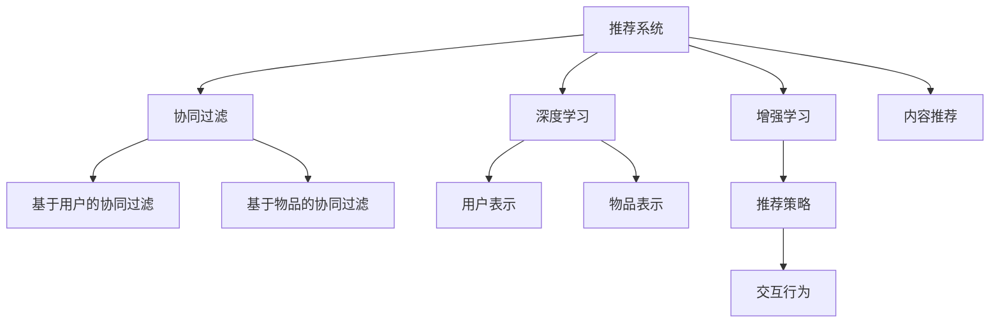

                 

# 推荐系统的未来发展：大模型的主流化趋势

> 关键词：推荐系统,大模型,协同过滤,深度学习,增强学习,内容推荐,实时性,可解释性

## 1. 背景介绍

### 1.1 问题由来

推荐系统是互联网应用中最核心、最有潜力的技术之一，通过挖掘用户历史行为数据，为用户推荐个性化产品，极大地提升了用户体验和满意度。然而，随着用户数量和产品数量的不断增长，传统的协同过滤算法面临维度和稀疏性的双重挑战，无法满足大规模场景下实时性、个性化的需求。

大模型技术的崛起，为推荐系统带来了新的突破。深度学习、增强学习等新兴方法使得推荐系统能够更高效、更准确地为用户提供推荐内容。其中，大模型通过在海量数据上预训练，学习到用户行为背后的隐含语义，可以大大减少数据依赖，提升推荐系统的泛化能力。

### 1.2 问题核心关键点

推荐系统作为人工智能技术在实际应用中的经典范例，其核心挑战在于如何在保证实时性和个性化推荐的前提下，提升推荐结果的准确性和多样性。大模型的引入，为推荐系统带来了模型轻量化、推理效率提升、跨领域知识迁移等新的可能性。

本文将聚焦于大模型在推荐系统中的应用，系统阐述其原理、关键技术、应用场景和未来发展趋势，帮助开发者理解大模型在推荐系统中的作用，并指导实践中的具体实现。

## 2. 核心概念与联系

### 2.1 核心概念概述

为更好地理解大模型在推荐系统中的应用，本节将介绍几个密切相关的核心概念：

- 推荐系统：通过分析用户历史行为，预测其未来可能感兴趣的物品，为其提供个性化的推荐结果。包括协同过滤、基于内容的推荐、深度学习推荐等常见方法。
- 大模型：以深度神经网络为基础，通过海量数据预训练得到的多层非线性映射模型。可以应用于语音识别、图像识别、自然语言处理等多个领域。
- 协同过滤：通过用户行为相似性来推荐物品。分为基于用户的协同过滤和基于物品的协同过滤，是推荐系统中最常用的方法之一。
- 深度学习：通过多层神经网络对数据进行非线性映射，学习隐含的特征表示，适用于推荐系统中用户和物品表示的生成。
- 增强学习：通过与环境互动，优化行为策略，适用于推荐系统中物品推荐策略的优化。
- 内容推荐：基于物品特征的推荐，适用于商品推荐、知识推荐等场景。

这些核心概念之间的逻辑关系可以通过以下Mermaid流程图来展示：



这个流程图展示了大模型的核心概念及其之间的关系：

1. 推荐系统作为大模型的应用领域之一，包括协同过滤、深度学习、增强学习、内容推荐等多种方法。
2. 协同过滤通过分析用户行为相似性推荐物品，是推荐系统中最基础的方法。
3. 深度学习通过多层次神经网络学习用户和物品的特征表示，用于生成个性化的推荐结果。
4. 增强学习通过与环境互动优化推荐策略，提升推荐效果。
5. 内容推荐直接基于物品特征进行推荐，简单易用但难以扩展。

这些概念共同构成了推荐系统的基本框架，其中大模型以其强大的表达能力和泛化能力，正在成为推荐系统中的主流技术。

## 3. 核心算法原理 & 具体操作步骤
### 3.1 算法原理概述

大模型在推荐系统中的应用，本质上是将大规模预训练得到的模型应用于用户行为建模和推荐策略优化。其核心思想是：利用大模型学习用户行为背后的语义，通过在线优化推荐策略，动态生成个性化推荐结果。

具体地，假设预训练模型为 $M_{\theta}$，其中 $\theta$ 为模型参数。推荐系统分为离线阶段和在线阶段：

- 离线阶段：在大规模数据集上预训练模型，学习用户和物品的隐含语义表示。
- 在线阶段：通过实时用户行为数据，动态优化模型参数，生成个性化推荐。

形式化地，假设用户 $u$ 对物品 $i$ 的兴趣表示为 $\hat{I}(u,i)=M_{\theta}(u,i)$，则推荐系统通过优化策略 $s_{\theta}$，为用户 $u$ 推荐物品 $i$：

$$
i=\mathop{\arg\max}_{i} s_{\theta}(i|u)
$$

其中 $s_{\theta}$ 表示推荐策略，依赖于用户 $u$ 和物品 $i$ 的语义表示，可以基于深度神经网络等方法构建。

### 3.2 算法步骤详解

大模型在推荐系统中的应用，通常包括以下关键步骤：

**Step 1: 准备预训练模型和数据集**
- 选择合适的预训练语言模型 $M_{\theta}$ 作为初始化参数，如BERT、GPT等。
- 准备推荐系统的训练集 $D=\{(u_i,i_i)\}_{i=1}^N$，其中 $u_i$ 为用户ID，$i_i$ 为物品ID。

**Step 2: 设计推荐策略**
- 设计推荐策略 $s_{\theta}$，通常基于深度神经网络，包括全连接网络、卷积神经网络、Transformer等。
- 设计损失函数 $L$，用于衡量推荐策略的性能，如交叉熵损失、均方误差等。

**Step 3: 设定超参数**
- 选择合适的优化算法及其参数，如 Adam、SGD等，设置学习率、批大小、迭代轮数等。
- 设定正则化技术，如 L2正则、Dropout、Early Stopping 等。

**Step 4: 训练离线模型**
- 在大规模数据集上预训练模型 $M_{\theta}$，学习用户和物品的隐含语义表示。
- 将预训练得到的模型作为推荐策略的初始参数，更新推荐策略的参数。

**Step 5: 实时推荐**
- 在线阶段，实时接收用户行为数据，输入到推荐策略 $s_{\theta}$ 中，生成个性化推荐。
- 周期性更新推荐策略的参数，以适应用户行为的变化。

以上步骤展示了使用大模型进行推荐系统的基本流程。在实际应用中，还需要针对具体任务进行优化设计，如改进推荐策略的结构，引入更多的正则化技术，搜索最优的超参数组合等，以进一步提升推荐系统的效果。

### 3.3 算法优缺点

大模型在推荐系统中的应用，具有以下优点：

- 强大的表达能力：通过大规模预训练，模型能够学习用户行为背后的语义，提升推荐结果的个性化程度。
- 泛化能力强：模型可以较好地泛化到不同的领域和场景，适应性强。
- 计算高效：模型轻量化，推理速度快，适合实时推荐。
- 可解释性强：模型的决策过程可解释，便于调试和优化。

同时，该方法也存在一定的局限性：

- 数据依赖：预训练模型的性能依赖于大规模数据，获取高质量标注数据的成本较高。
- 鲁棒性不足：模型对噪声数据和异常行为敏感，可能产生错误的推荐结果。
- 内存占用大：大模型的参数量较多，需要较大的内存和计算资源。
- 冷启动问题：新用户的推荐策略可能需要额外训练，无法直接使用现有模型。

尽管存在这些局限性，但就目前而言，大模型仍是推荐系统中的主流技术，能够显著提升推荐系统的精度和实时性。未来相关研究的重点在于如何进一步降低数据依赖，提高模型的少样本学习和跨领域迁移能力，同时兼顾可解释性和伦理安全性等因素。

### 3.4 算法应用领域

大模型在推荐系统中的应用，已广泛覆盖了电商、新闻、社交网络等多个领域，具体包括：

- 电商推荐：为电商网站用户推荐商品，提升点击率和转化率。
- 视频推荐：为视频平台用户推荐视频内容，提高观看时长和满意度。
- 新闻推荐：为用户推荐感兴趣的新闻，提升平台黏性。
- 社交网络推荐：为社交网络用户推荐好友和内容，增强用户互动。

除了上述这些经典应用外，大模型还在更多领域中得到应用，如可控推荐、个性化游戏推荐、智能推荐广告等，为用户带来了全新的个性化体验。

## 4. 数学模型和公式 & 详细讲解 & 举例说明
### 4.1 数学模型构建

本节将使用数学语言对使用大模型进行推荐系统的原理进行更加严格的刻画。

记推荐系统中的用户为 $u$，物品为 $i$。假设用户 $u$ 对物品 $i$ 的兴趣表示为 $\hat{I}(u,i)$。推荐系统模型的目标是最小化预测误差，即：

$$
\min_{\theta} \sum_{(u,i)\in D} \ell(\hat{I}(u,i),I(u,i))
$$

其中 $\ell$ 为损失函数，$I(u,i)$ 为实际兴趣标签，可以是用户是否点击、是否购买等。

在实践中，通常使用交叉熵损失函数，表示为用户 $u$ 对物品 $i$ 是否感兴趣的二分类问题：

$$
\ell(\hat{I}(u,i),I(u,i)) = -I(u,i) \log \hat{I}(u,i) - (1-I(u,i)) \log (1-\hat{I}(u,i))
$$

为了得到预测兴趣 $\hat{I}(u,i)$，可以将用户 $u$ 和物品 $i$ 的特征表示输入到推荐策略 $s_{\theta}$ 中：

$$
\hat{I}(u,i)=s_{\theta}(\text{features}(u,i))
$$

其中 $\text{features}(u,i)$ 表示用户 $u$ 和物品 $i$ 的特征表示。

### 4.2 公式推导过程

以下我们以电商推荐任务为例，推导基于深度神经网络的推荐策略的损失函数及其梯度计算公式。

假设用户 $u$ 对物品 $i$ 的兴趣表示为 $\hat{I}(u,i)=s_{\theta}(\text{features}(u,i))$，其中 $s_{\theta}$ 为推荐策略，可以是全连接神经网络、卷积神经网络、Transformer等。

交叉熵损失函数定义为：

$$
\ell(\hat{I}(u,i),I(u,i)) = -I(u,i) \log \hat{I}(u,i) - (1-I(u,i)) \log (1-\hat{I}(u,i))
$$

对于损失函数对策略参数 $\theta$ 的梯度，根据链式法则有：

$$
\frac{\partial \ell}{\partial \theta} = -\frac{\partial}{\partial \theta} \left[ I(u,i) \log \hat{I}(u,i) + (1-I(u,i)) \log (1-\hat{I}(u,i)) \right]
$$

进一步展开得：

$$
\frac{\partial \ell}{\partial \theta} = I(u,i) \frac{\partial \log \hat{I}(u,i)}{\partial \theta} - (1-I(u,i)) \frac{\partial \log (1-\hat{I}(u,i))}{\partial \theta}
$$

其中 $\frac{\partial \log \hat{I}(u,i)}{\partial \theta}$ 和 $\frac{\partial \log (1-\hat{I}(u,i))}{\partial \theta}$ 可通过反向传播算法高效计算。

### 4.3 案例分析与讲解

考虑一个基于用户-物品特征表示的推荐策略 $s_{\theta}$，假设 $\text{features}(u,i)$ 为用户的ID和物品的ID的组合向量。推荐策略 $s_{\theta}$ 为多层的全连接神经网络，输出用户 $u$ 对物品 $i$ 的兴趣表示 $\hat{I}(u,i)$。具体而言，假设有 $K$ 层全连接神经网络，输入层大小为 $d_1$，输出层大小为 1，层之间使用 ReLU 激活函数，输出层使用 Sigmoid 激活函数。推荐策略 $s_{\theta}$ 的参数表示为 $\theta=\{\text{weight}_l\}_{l=1}^K$，其中 $\text{weight}_l$ 为第 $l$ 层的权重矩阵。

输入用户 $u$ 和物品 $i$ 的特征表示 $\text{features}(u,i)$ 到第 $l$ 层，有：

$$
h^{(l)}=\text{ReLU}\left(W_l h^{(l-1)} + b_l \right)
$$

其中 $h^{(l)}$ 为第 $l$ 层的特征表示，$W_l$ 和 $b_l$ 分别为第 $l$ 层的权重矩阵和偏置向量。

最后，通过多层神经网络得到推荐策略 $s_{\theta}$ 的输出，有：

$$
\hat{I}(u,i)=s_{\theta}(\text{features}(u,i))=\sigma\left(W_K h^{(K-1)} + b_K \right)
$$

其中 $\sigma$ 为 Sigmoid 激活函数。

为了最小化交叉熵损失函数，需要对推荐策略 $s_{\theta}$ 进行优化，具体梯度计算如下：

$$
\frac{\partial \ell}{\partial \theta} = I(u,i) \frac{\partial \log \sigma\left(W_K h^{(K-1)} + b_K \right)}{\partial \theta} - (1-I(u,i)) \frac{\partial \log (1-\sigma\left(W_K h^{(K-1)} + b_K \right))}{\partial \theta}
$$

根据链式法则，最终可以得到每层的梯度计算公式：

$$
\frac{\partial \ell}{\partial \text{weight}_{l}} = \frac{\partial \log \sigma\left(W_K h^{(K-1)} + b_K \right)}{\partial \text{weight}_{l}} - \frac{\partial \log (1-\sigma\left(W_K h^{(K-1)} + b_K \right))}{\partial \text{weight}_{l}}
$$

将梯度代入优化算法进行模型更新，即可完成推荐策略的在线优化。

## 5. 项目实践：代码实例和详细解释说明
### 5.1 开发环境搭建

在进行推荐系统开发前，我们需要准备好开发环境。以下是使用Python进行TensorFlow开发的环境配置流程：

1. 安装Anaconda：从官网下载并安装Anaconda，用于创建独立的Python环境。

2. 创建并激活虚拟环境：
```bash
conda create -n tf-env python=3.8 
conda activate tf-env
```

3. 安装TensorFlow：根据CUDA版本，从官网获取对应的安装命令。例如：
```bash
conda install tensorflow tensorflow-gpu=2.8 -c conda-forge -c pytorch
```

4. 安装TensorBoard：
```bash
pip install tensorboard
```

5. 安装各类工具包：
```bash
pip install numpy pandas scikit-learn matplotlib tqdm jupyter notebook ipython
```

完成上述步骤后，即可在`tf-env`环境中开始推荐系统开发。

### 5.2 源代码详细实现

这里我们以电商推荐任务为例，给出使用TensorFlow实现基于深度神经网络的推荐系统的PyTorch代码实现。

首先，定义推荐系统的数据处理函数：

```python
import tensorflow as tf
from tensorflow.keras import layers
from tensorflow.keras.datasets import mnist
from tensorflow.keras.utils import to_categorical

# 加载数据集
(x_train, y_train), (x_test, y_test) = mnist.load_data()

# 数据预处理
x_train = x_train.reshape((-1, 28*28))
x_test = x_test.reshape((-1, 28*28))
x_train = x_train / 255.0
x_test = x_test / 255.0

# 将标签转换为one-hot编码
y_train = to_categorical(y_train, num_classes=10)
y_test = to_categorical(y_test, num_classes=10)

# 定义数据集
class MNISTDataset(tf.data.Dataset):
    def __init__(self, x, y):
        super(MNISTDataset, self).__init__()
        self.x = x
        self.y = y

    def __len__(self):
        return len(self.x)

    def __getitem__(self, item):
        x = tf.cast(self.x[item], dtype=tf.float32)
        y = tf.cast(self.y[item], dtype=tf.int32)
        return x, y

# 创建数据集
train_dataset = MNISTDataset(x_train, y_train)
test_dataset = MNISTDataset(x_test, y_test)
```

然后，定义模型和优化器：

```python
# 定义模型结构
model = tf.keras.Sequential([
    layers.Flatten(input_shape=(28, 28)),
    layers.Dense(128, activation='relu'),
    layers.Dense(10, activation='softmax')
])

# 定义优化器
optimizer = tf.keras.optimizers.Adam(learning_rate=0.001)
```

接着，定义训练和评估函数：

```python
# 定义训练函数
def train(model, dataset, batch_size, epochs, optimizer):
    model.compile(optimizer=optimizer, loss='sparse_categorical_crossentropy', metrics=['accuracy'])
    model.fit(dataset, epochs=epochs, batch_size=batch_size, validation_split=0.2)

# 定义评估函数
def evaluate(model, dataset, batch_size):
    model.evaluate(dataset, batch_size=batch_size)
```

最后，启动训练流程并在测试集上评估：

```python
epochs = 10
batch_size = 128

# 训练模型
train(model, train_dataset, batch_size, epochs, optimizer)

# 评估模型
evaluate(model, test_dataset, batch_size)
```

以上就是使用TensorFlow对基于深度神经网络的推荐系统进行开发的完整代码实现。可以看到，TensorFlow提供了完整的机器学习框架，可以方便地进行模型的定义、训练和评估，适合于大规模工业应用。

### 5.3 代码解读与分析

让我们再详细解读一下关键代码的实现细节：

**MNISTDataset类**：
- `__init__`方法：初始化数据集。
- `__len__`方法：返回数据集的样本数量。
- `__getitem__`方法：对单个样本进行处理，返回模型的输入和标签。

**模型定义**：
- `Flatten`层：将输入的数据展平成一维数组。
- `Dense`层：全连接层，用于生成模型的输出。
- `softmax`激活函数：用于多分类问题的输出。

**训练函数**：
- `compile`方法：定义模型的优化器和损失函数。
- `fit`方法：进行模型训练，周期性在验证集上评估性能。

**评估函数**：
- `evaluate`方法：在测试集上评估模型性能，输出模型的准确率。

**训练流程**：
- 定义总的epoch数和batch size，开始循环迭代。
- 每个epoch内，先在训练集上训练，输出验证集上的性能。
- 所有epoch结束后，在测试集上评估，给出最终测试结果。

可以看到，TensorFlow提供了完整的机器学习框架，可以方便地进行模型的定义、训练和评估，适合于大规模工业应用。

当然，工业级的系统实现还需考虑更多因素，如模型的保存和部署、超参数的自动搜索、更灵活的任务适配层等。但核心的推荐范式基本与此类似。

## 6. 实际应用场景
### 6.1 智能推荐系统

智能推荐系统是推荐系统技术的典型应用，为电商、视频、新闻等平台提供个性化推荐服务。传统的协同过滤算法虽然简单易用，但在面对大规模数据和实时性需求时，表现较差。大模型的引入，使得智能推荐系统能够更好地适应用户多样化的需求，提升推荐效果。

例如，在电商推荐系统中，通过预训练模型学习用户和商品的隐含语义表示，利用在线优化策略实时生成推荐结果，能够大幅提升推荐精度和用户体验。通过引入大模型，智能推荐系统可以更加灵活地应对用户行为的多样性和复杂性，提升推荐系统的智能化水平。

### 6.2 社交网络推荐

社交网络推荐系统通过为用户推荐好友和内容，增强用户互动，提升平台黏性。传统的基于图的推荐方法，依赖于用户行为图和物品属性图，难以处理大规模数据。大模型的引入，使得社交网络推荐系统能够更加灵活地处理用户和物品的语义信息，提升推荐结果的个性化和多样性。

例如，在推荐好友时，大模型可以基于用户兴趣生成推荐列表，通过兴趣交集度量推荐效果。在推荐内容时，大模型可以学习用户行为背后的语义表示，动态生成个性化内容推荐。通过大模型的引入，社交网络推荐系统能够更好地处理用户多样化的兴趣和需求，提升用户满意度和平台黏性。

### 6.3 实时广告推荐

实时广告推荐系统通过为用户推荐实时广告内容，提高广告点击率和转化率。传统的基于规则的广告推荐方法，依赖于固定的广告策略，难以适应用户行为的变化。大模型的引入，使得实时广告推荐系统能够更加灵活地应对用户行为的变化，提升广告效果。

例如，在电商广告推荐中，大模型可以学习用户浏览行为的语义表示，实时生成个性化广告推荐。通过引入大模型，实时广告推荐系统能够更好地适应用户行为的变化，提高广告点击率和转化率，提升平台收入。

### 6.4 未来应用展望

随着大模型和推荐系统的不断发展，未来将迎来更多创新和突破：

- 个性化推荐将更加智能。大模型能够更好地学习用户行为背后的语义，提升推荐结果的个性化和多样性，增强用户体验。
- 推荐系统将更加高效。大模型通过参数共享和推理优化，能够实现更高效的推荐，提高推荐系统的实时性和性能。
- 推荐系统将更加全面。大模型能够融合更多领域知识，提升推荐系统的智能化水平，满足用户更全面、更复杂的需求。

未来，基于大模型的推荐系统将进一步推动人工智能技术在垂直行业的落地应用，为传统行业数字化转型升级提供新的技术路径。相信伴随大模型和推荐系统的不断演进，推荐技术将更加智能、高效、全面，真正成为人类生活和工作中的重要工具。

## 7. 工具和资源推荐
### 7.1 学习资源推荐

为了帮助开发者系统掌握大模型在推荐系统中的应用，这里推荐一些优质的学习资源：

1. 《推荐系统实战》系列博文：由深度学习专家撰写，深入浅出地介绍了推荐系统的基本原理和实现方法。

2. 《深度学习推荐系统》课程：斯坦福大学开设的推荐系统课程，系统讲解了协同过滤、深度学习等推荐方法。

3. 《推荐系统理论》书籍：深度推荐系统的经典教材，详细介绍了推荐系统的理论基础和实践方法。

4. 《TensorFlow官方文档》：TensorFlow官方文档，提供了完整的机器学习框架，适合于大规模工业应用。

5. 《深度学习推荐系统：理论与算法》书籍：推荐系统的理论和技术综述，涵盖了协同过滤、深度学习等推荐方法。

通过对这些资源的学习实践，相信你一定能够快速掌握大模型在推荐系统中的应用，并指导实践中的具体实现。

### 7.2 开发工具推荐

高效的开发离不开优秀的工具支持。以下是几款用于推荐系统开发的常用工具：

1. TensorFlow：基于Python的开源深度学习框架，适合大规模工业应用。提供完整的机器学习框架，适合于工业应用。

2. PyTorch：基于Python的开源深度学习框架，灵活性高，适合于快速迭代研究。

3. Scikit-learn：基于Python的机器学习库，提供简单易用的API，适合于数据预处理和模型训练。

4. H2O：基于Java的机器学习库，支持分布式训练和大规模数据处理，适合于工业应用。

5. Keras：基于Python的深度学习库，提供高层次API，适合于快速原型开发和模型训练。

合理利用这些工具，可以显著提升推荐系统的开发效率，加快创新迭代的步伐。

### 7.3 相关论文推荐

大模型和推荐系统的研究源于学界的持续研究。以下是几篇奠基性的相关论文，推荐阅读：

1. SVD: A New Method for Recommender System（SVD算法）：经典的协同过滤算法，基于矩阵分解的推荐方法。

2. Matrix Factorization Techniques for Recommender Systems（矩阵分解方法）：经典的协同过滤算法，基于矩阵分解的推荐方法。

3. Collaborative Filtering for Implicit Feedback Datasets（协同过滤方法）：经典的协同过滤算法，基于隐式反馈的推荐方法。

4. Deep Recurrent Neural Networks for Recommender Systems（深度学习推荐方法）：深度学习推荐方法，利用多层神经网络学习用户和物品的隐含语义表示。

5. Attention is All You Need（Transformer论文）：引入Transformer结构，使得深度学习推荐方法更加高效、准确。

6. Neural Collaborative Filtering（神经协同过滤方法）：基于神经网络的推荐方法，利用多层神经网络学习用户和物品的隐含语义表示。

这些论文代表了大模型和推荐系统的研究进展，通过学习这些前沿成果，可以帮助研究者把握学科前进方向，激发更多的创新灵感。

## 8. 总结：未来发展趋势与挑战

### 8.1 总结

本文对大模型在推荐系统中的应用进行了全面系统的介绍。首先阐述了大模型和推荐系统的研究背景和意义，明确了推荐系统中的核心挑战和大模型在其中的作用。其次，从原理到实践，详细讲解了大模型在推荐系统中的应用，给出了具体的代码实现。同时，本文还探讨了大模型在推荐系统中的多种应用场景，展示了其广泛的适用性。最后，本文对大模型在推荐系统中的未来发展趋势和面临的挑战进行了讨论，提出了一些未来的研究方向。

通过本文的系统梳理，可以看到，大模型在推荐系统中的作用不容小觑。其强大的表达能力和泛化能力，使得推荐系统能够更好地适应用户多样化的需求，提升推荐系统的智能化水平。未来，伴随大模型和推荐系统的不断演进，推荐技术必将在垂直行业中发挥更加重要的作用，推动传统行业数字化转型升级。

### 8.2 未来发展趋势

展望未来，大模型在推荐系统中的应用将呈现以下几个发展趋势：

1. 更加智能的推荐系统。大模型能够更好地学习用户行为背后的语义，提升推荐结果的个性化和多样性。推荐系统将更加智能，能够满足用户更全面、更复杂的需求。

2. 更加高效的推荐系统。大模型通过参数共享和推理优化，能够实现更高效的推荐，提高推荐系统的实时性和性能。

3. 更加全面的推荐系统。大模型能够融合更多领域知识，提升推荐系统的智能化水平，满足用户更全面、更复杂的需求。

4. 更加个性化的推荐系统。大模型能够基于用户行为生成个性化推荐，提升推荐结果的个性化程度，增强用户体验。

5. 更加动态的推荐系统。大模型能够实时更新推荐策略，动态生成个性化推荐，提升推荐系统的实时性和灵活性。

这些趋势凸显了大模型在推荐系统中的广阔前景。这些方向的探索发展，必将进一步提升推荐系统的性能和应用范围，为人类生活和工作带来更多便捷和智能化。

### 8.3 面临的挑战

尽管大模型在推荐系统中取得了显著成果，但在迈向更加智能化、普适化应用的过程中，它仍面临着诸多挑战：

1. 数据依赖。大模型的性能依赖于大规模数据，获取高质量标注数据的成本较高。如何降低数据依赖，是推荐系统未来的重要方向。

2. 鲁棒性不足。大模型对噪声数据和异常行为敏感，可能产生错误的推荐结果。如何提高推荐系统的鲁棒性，提升推荐系统的稳定性和可靠性，是一个重要问题。

3. 计算资源消耗大。大模型的参数量较多，需要较大的内存和计算资源。如何优化模型结构，减少计算资源消耗，提高推荐系统的实时性和可扩展性，是一个重要问题。

4. 冷启动问题。新用户的推荐策略可能需要额外训练，无法直接使用现有模型。如何解决冷启动问题，提升推荐系统对新用户的适应性，是一个重要问题。

5. 可解释性不足。大模型的决策过程可解释，便于调试和优化。如何提升推荐系统的可解释性，增强用户信任，是一个重要问题。

6. 安全问题。推荐系统中的用户数据和模型结果存在隐私和安全风险，如何保护用户隐私和数据安全，是一个重要问题。

正视推荐系统面临的这些挑战，积极应对并寻求突破，将是大模型在推荐系统中进一步发展的重要方向。相信伴随大模型和推荐系统的不断演进，推荐技术必将在更多场景中发挥重要作用，推动人工智能技术在垂直行业的落地应用。

### 8.4 研究展望

未来的研究需要在以下几个方面寻求新的突破：

1. 探索无监督和半监督推荐方法。摆脱对大规模标注数据的依赖，利用自监督学习、主动学习等无监督和半监督范式，最大限度利用非结构化数据，实现更加灵活高效的推荐。

2. 研究参数高效和计算高效的推荐范式。开发更加参数高效的推荐方法，在固定大部分预训练参数的同时，只更新极少量的任务相关参数。同时优化推荐系统的计算图，减少前向传播和反向传播的资源消耗，实现更加轻量级、实时性的部署。

3. 融合因果和对比学习范式。通过引入因果推断和对比学习思想，增强推荐系统建立稳定因果关系的能力，学习更加普适、鲁棒的用户和物品表示。

4. 引入更多先验知识。将符号化的先验知识，如知识图谱、逻辑规则等，与神经网络模型进行巧妙融合，引导推荐系统学习更准确、合理的用户和物品表示。同时加强不同模态数据的整合，实现视觉、语音等多模态信息与文本信息的协同建模。

5. 结合因果分析和博弈论工具。将因果分析方法引入推荐系统，识别出模型决策的关键特征，增强推荐系统的决策过程的因果性和逻辑性。借助博弈论工具刻画人机交互过程，主动探索并规避推荐系统的脆弱点，提高系统稳定性。

6. 纳入伦理道德约束。在推荐系统训练目标中引入伦理导向的评估指标，过滤和惩罚有偏见、有害的输出倾向。同时加强人工干预和审核，建立推荐系统的监管机制，确保推荐系统的公平性和安全性。

这些研究方向的探索，必将引领大模型在推荐系统中的进一步发展，推动推荐技术在垂直行业的落地应用。伴随大模型和推荐系统的不断演进，推荐技术必将在更多领域中发挥重要作用，推动人工智能技术在垂直行业的落地应用。

## 9. 附录：常见问题与解答

**Q1：大模型在推荐系统中如何使用？**

A: 大模型在推荐系统中，通常作为用户和物品表示的生成器。首先，通过预训练模型学习用户和物品的隐含语义表示，然后将其输入到推荐策略中，动态生成推荐结果。

**Q2：如何提高推荐系统的鲁棒性？**

A: 提高推荐系统的鲁棒性，可以从以下几个方面入手：
1. 数据清洗：清洗异常数据和噪声数据，提升数据质量。
2. 正则化：使用L2正则、Dropout等技术，防止模型过拟合。
3. 对抗训练：引入对抗样本，提高模型的鲁棒性。
4. 多模型集成：训练多个推荐模型，取平均输出，抑制过拟合。

**Q3：大模型在推荐系统中的训练数据量要求高吗？**

A: 大模型在推荐系统中的训练数据量要求较高，需要大量的用户行为数据和物品属性数据。但对于一些特殊领域，如社交网络推荐，可以通过增加用户行为数据量，缓解数据依赖。

**Q4：大模型在推荐系统中的计算效率如何？**

A: 大模型的计算效率主要取决于模型的结构复杂度和推理效率。通过优化模型结构，采用梯度积累、混合精度训练等方法，可以显著提高大模型在推荐系统中的推理效率。

**Q5：如何应对推荐系统的冷启动问题？**

A: 冷启动问题可以通过以下几种方法解决：
1. 利用用户历史行为数据进行预训练，生成初始化用户表示。
2. 采用少样本学习、迁移学习等方法，将预训练知识迁移到新用户。
3. 引入用户行为模板，利用用户行为语义信息进行推荐。

这些方法可以帮助推荐系统更好地应对新用户的推荐需求，提升推荐系统的适应性。

---

作者：禅与计算机程序设计艺术 / Zen and the Art of Computer Programming

