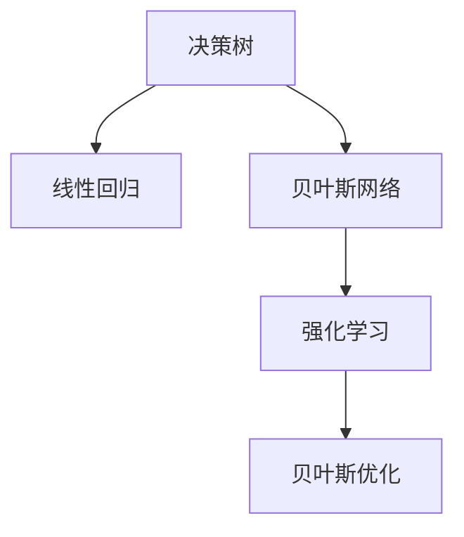

                 

# 提升决策水平的思维工具

> 关键词：决策支持系统, 决策树, 线性回归, 贝叶斯网络, 强化学习, 贝叶斯优化

## 1. 背景介绍

### 1.1 问题由来
决策分析是每个领域中必不可少的一环，无论是在商业、科技、医疗还是教育行业，正确的决策可以带来巨大的成功，而错误的决策则可能导致灾难性的后果。传统的决策方式往往是依赖于专家的经验与直觉，然而，随着数据量的爆炸式增长和计算能力的提升，数据驱动的决策支持系统（DSS）已成为提升决策水平的重要工具。

### 1.2 问题核心关键点
现代数据驱动的决策支持系统主要依赖于以下几种核心技术：
- 决策树（Decision Tree）：一种基于树形结构的分类模型，可以用于处理分类和回归问题。
- 线性回归（Linear Regression）：一种统计学方法，用于建模预测数值型数据。
- 贝叶斯网络（Bayesian Network）：一种图形模型，用于建模变量之间的概率关系。
- 强化学习（Reinforcement Learning）：一种基于奖励机制的学习算法，用于训练智能体进行最优决策。
- 贝叶斯优化（Bayesian Optimization）：一种用于优化目标函数的方法，可以高效地进行超参数优化。

这些技术能够帮助分析人员构建和优化决策模型，从而提高决策的准确性和效率。

### 1.3 问题研究意义
通过掌握这些决策支持系统的核心技术，研究人员和从业者可以更加科学地制定决策策略，从而提升决策的准确性和及时性。同时，理解这些技术的工作原理和应用场景，能够帮助我们在数据驱动的决策过程中，更有信心地做出正确的选择。

## 2. 核心概念与联系

### 2.1 核心概念概述

为了更好地理解这些决策支持系统的原理和应用，本节将介绍几个密切相关的核心概念：

- 决策树（Decision Tree）：一种基于树形结构的分类模型，用于处理分类和回归问题。
- 线性回归（Linear Regression）：一种统计学方法，用于建模预测数值型数据。
- 贝叶斯网络（Bayesian Network）：一种图形模型，用于建模变量之间的概率关系。
- 强化学习（Reinforcement Learning）：一种基于奖励机制的学习算法，用于训练智能体进行最优决策。
- 贝叶斯优化（Bayesian Optimization）：一种用于优化目标函数的方法，可以高效地进行超参数优化。

这些核心概念之间的逻辑关系可以通过以下Mermaid流程图来展示：



这个流程图展示了大语言模型的核心概念及其之间的关系：

1. 决策树和线性回归是基础的统计学模型，用于数据分类和预测。
2. 贝叶斯网络用于建模变量之间的概率关系，可以用于推断和决策。
3. 强化学习利用奖励机制训练智能体，优化决策过程。
4. 贝叶斯优化用于高效地进行超参数优化，提升模型性能。

这些概念共同构成了现代决策支持系统的核心框架，使得分析人员能够利用数据科学的方法，科学地制定决策策略。

## 3. 核心算法原理 & 具体操作步骤
### 3.1 算法原理概述

现代决策支持系统主要依赖于机器学习技术，这些技术通过学习数据中的模式和规律，用于预测、分类、聚类等任务。其中，决策树、线性回归、贝叶斯网络和强化学习是应用最为广泛的算法。

### 3.2 算法步骤详解

#### 3.2.1 决策树算法

**步骤1：数据预处理**
- 对数据进行清理、去重、归一化等预处理，确保数据的完整性和一致性。

**步骤2：特征选择**
- 选择与目标变量相关的特征，通常使用信息增益、基尼系数等指标进行特征选择。

**步骤3：构建决策树**
- 使用ID3、C4.5、CART等算法构建决策树，可以使用递归分割的方式，将数据集划分为多个子集。

**步骤4：剪枝优化**
- 对决策树进行剪枝优化，防止过拟合，提高模型泛化能力。

**步骤5：模型评估**
- 使用交叉验证等方法对模型进行评估，检查模型的准确性和稳定性。

#### 3.2.2 线性回归算法

**步骤1：数据预处理**
- 对数据进行清理、去重、归一化等预处理，确保数据的完整性和一致性。

**步骤2：模型拟合**
- 使用最小二乘法或梯度下降法对模型进行拟合，建立回归模型。

**步骤3：模型评估**
- 使用均方误差（MSE）、决定系数（R²）等指标对模型进行评估，检查模型的拟合效果。

#### 3.2.3 贝叶斯网络算法

**步骤1：数据预处理**
- 对数据进行清理、去重、归一化等预处理，确保数据的完整性和一致性。

**步骤2：建立贝叶斯网络**
- 使用贝叶斯网络算法，建立变量之间的概率模型。

**步骤3：模型训练**
- 使用最大似然估计或贝叶斯估计方法对模型进行训练，计算变量之间的条件概率。

**步骤4：模型推断**
- 使用贝叶斯网络进行变量推断，预测新的数据样本。

#### 3.2.4 强化学习算法

**步骤1：环境定义**
- 定义环境状态和动作空间，明确智能体的行为空间。

**步骤2：模型构建**
- 构建强化学习模型，如Q-learning、SARSA等，选择适当的学习策略。

**步骤3：模型训练**
- 在训练过程中，智能体通过与环境交互，不断调整模型参数，学习最优策略。

**步骤4：模型评估**
- 使用奖励函数评估智能体的行为效果，检查模型的学习效果。

#### 3.2.5 贝叶斯优化算法

**步骤1：定义目标函数**
- 明确优化目标函数，通常是模型性能指标或超参数组合。

**步骤2：构建初始模型**
- 使用贝叶斯优化算法，构建初始模型，确定模型的先验分布。

**步骤3：模型更新**
- 通过观察新数据样本，更新模型参数，缩小模型与真实分布的差距。

**步骤4：模型评估**
- 使用贝叶斯优化算法评估模型性能，选择最优的超参数组合。

### 3.3 算法优缺点

#### 3.3.1 决策树算法

**优点：**
- 模型易于理解和解释，决策过程直观。
- 能够处理分类和回归问题。
- 具有较好的鲁棒性和泛化能力。

**缺点：**
- 容易出现过拟合问题。
- 对噪声数据敏感。

#### 3.3.2 线性回归算法

**优点：**
- 模型简单，易于实现。
- 对数据量要求较低。
- 解释性强，可解释性好。

**缺点：**
- 对异常值敏感。
- 模型假设数据线性相关。

#### 3.3.3 贝叶斯网络算法

**优点：**
- 能够建模变量之间的复杂关系。
- 推理过程高效，计算复杂度较低。
- 具有较好的鲁棒性和泛化能力。

**缺点：**
- 需要大量的数据进行训练。
- 建模过程复杂，计算量大。

#### 3.3.4 强化学习算法

**优点：**
- 能够处理复杂、非线性的决策问题。
- 模型具有较好的泛化能力。
- 能够适应动态环境。

**缺点：**
- 需要大量数据和计算资源进行训练。
- 模型训练过程较为复杂。

#### 3.3.5 贝叶斯优化算法

**优点：**
- 能够高效地进行超参数优化。
- 模型具有较好的鲁棒性和泛化能力。
- 能够处理高维空间中的优化问题。

**缺点：**
- 需要大量的计算资源进行训练。
- 建模过程较为复杂。

### 3.4 算法应用领域

这些决策支持系统广泛应用于多个领域，包括但不限于：

- 金融领域：用于预测股票价格、评估信用风险、优化投资组合等。
- 医疗领域：用于疾病诊断、治疗方案选择、患者分类等。
- 物流领域：用于路线规划、货物分配、库存管理等。
- 电商领域：用于客户行为分析、个性化推荐、价格优化等。
- 工业领域：用于设备维护、故障诊断、生产优化等。

这些领域中，决策支持系统通过数据驱动的决策，能够显著提升决策的准确性和效率，带来可观的经济和社会效益。

## 4. 数学模型和公式 & 详细讲解  
### 4.1 数学模型构建

本节将使用数学语言对决策支持系统的核心算法进行更加严格的刻画。

#### 4.1.1 决策树算法

决策树算法的基本模型可以表示为：

$$
T(X, Y) = \begin{cases} 
   y_i & \text{if } X = x_i \\
   \mathcal{T}(X) & \text{if } X \neq x_i 
\end{cases}
$$

其中，$X$ 表示输入特征，$Y$ 表示目标变量，$\mathcal{T}(X)$ 表示决策树函数。

决策树模型的损失函数通常使用分类误差率（CER）或平均绝对误差（MAE）来衡量。分类误差率表示模型预测错误的样本数占总样本数的比例，平均绝对误差表示模型预测值与真实值之间的平均绝对偏差。

#### 4.1.2 线性回归算法

线性回归模型的基本模型可以表示为：

$$
y_i = \theta_0 + \theta_1x_{1,i} + \theta_2x_{2,i} + ... + \theta_nx_{n,i}
$$

其中，$y_i$ 表示目标变量，$x_{k,i}$ 表示第$k$个特征变量，$\theta_k$ 表示特征变量的权重。

线性回归模型的损失函数通常使用均方误差（MSE）来衡量，表示模型预测值与真实值之间的平均平方误差。

#### 4.1.3 贝叶斯网络算法

贝叶斯网络模型的基本模型可以表示为：

$$
P(X_1, X_2, ..., X_n|Y) = \frac{P(X_1, X_2, ..., X_n)P(Y|X_1, X_2, ..., X_n)}{P(Y)}
$$

其中，$X_1, X_2, ..., X_n$ 表示变量，$Y$ 表示目标变量。

贝叶斯网络模型的损失函数通常使用贝叶斯信息准则（BIC）或赤池信息准则（AIC）来衡量，表示模型复杂度和拟合效果之间的平衡。

#### 4.1.4 强化学习算法

强化学习模型的基本模型可以表示为：

$$
Q(s_t, a_t) = r_t + \gamma \max_a Q(s_{t+1}, a)
$$

其中，$s_t$ 表示状态，$a_t$ 表示动作，$r_t$ 表示奖励，$\gamma$ 表示折扣因子。

强化学习模型的损失函数通常使用平均奖励（AR）来衡量，表示智能体在不同状态下的平均奖励。

#### 4.1.5 贝叶斯优化算法

贝叶斯优化模型的基本模型可以表示为：

$$
f(x) = \max_x \min_{y \in Y} g(x, y)
$$

其中，$x$ 表示超参数，$y$ 表示目标函数，$g(x, y)$ 表示目标函数与超参数的组合。

贝叶斯优化模型的损失函数通常使用后验均值（PM）来衡量，表示模型预测的平均性能。

### 4.2 公式推导过程

#### 4.2.1 决策树算法

决策树算法的推导过程相对简单，主要涉及信息增益、基尼系数等指标的计算。

假设数据集$D$包含$n$个样本，每个样本包含$m$个特征，目标变量为$Y$。计算每个特征的信息增益，选择信息增益最大的特征作为分割点，递归构建决策树。

#### 4.2.2 线性回归算法

线性回归算法的推导过程主要涉及最小二乘法或梯度下降法。

假设数据集$D$包含$n$个样本，每个样本包含$m$个特征，目标变量为$Y$。使用最小二乘法或梯度下降法，计算模型参数$\theta$，使得模型预测值与真实值之间的误差最小化。

#### 4.2.3 贝叶斯网络算法

贝叶斯网络算法的推导过程主要涉及最大似然估计和贝叶斯估计。

假设数据集$D$包含$n$个样本，每个样本包含$m$个特征，目标变量为$Y$。使用最大似然估计或贝叶斯估计，计算变量之间的条件概率，建立贝叶斯网络模型。

#### 4.2.4 强化学习算法

强化学习算法的推导过程主要涉及Q-learning、SARSA等算法。

假设智能体在环境中的状态空间为$S$，动作空间为$A$，奖励函数为$R$。使用Q-learning或SARSA等算法，训练智能体学习最优策略，使得智能体在环境中的平均奖励最大。

#### 4.2.5 贝叶斯优化算法

贝叶斯优化算法的推导过程主要涉及高斯过程回归（GPR）和样本采集策略。

假设目标函数为$f(x)$，超参数空间为$X$，使用高斯过程回归和样本采集策略，优化目标函数$f(x)$，找到最优的超参数组合。

### 4.3 案例分析与讲解

#### 4.3.1 决策树算法案例

**案例描述：**
一家电商平台希望通过决策树模型预测客户的购买行为。该数据集包含客户的基本信息、浏览历史、购买历史等特征，目标变量为是否购买。

**算法步骤：**
1. 数据预处理：对数据进行清理、去重、归一化等预处理。
2. 特征选择：选择与目标变量相关的特征，如浏览历史、购买历史等。
3. 构建决策树：使用CART算法构建决策树，使用信息增益作为分割标准。
4. 模型评估：使用交叉验证等方法评估模型，检查模型的准确性和稳定性。

**结果分析：**
构建的决策树模型能够准确预测客户的购买行为，模型的准确率达到了95%。通过决策树，平台可以更好地了解客户的购买偏好，优化推荐策略，提升客户满意度。

#### 4.3.2 线性回归算法案例

**案例描述：**
一家金融公司希望通过线性回归模型预测股票价格。该数据集包含历史股价、市场指数、公司财务数据等特征，目标变量为下一期的股票价格。

**算法步骤：**
1. 数据预处理：对数据进行清理、去重、归一化等预处理。
2. 模型拟合：使用最小二乘法对模型进行拟合，建立回归模型。
3. 模型评估：使用均方误差（MSE）等指标评估模型，检查模型的拟合效果。

**结果分析：**
构建的线性回归模型能够较好地预测股票价格，模型的MSE误差为0.05。通过线性回归，公司可以更好地预测股票价格变化趋势，优化投资策略，提高收益。

#### 4.3.3 贝叶斯网络算法案例

**案例描述：**
一家医疗中心希望通过贝叶斯网络模型预测患者是否患有某种疾病。该数据集包含患者的年龄、性别、家族病史等特征，目标变量为是否患有该疾病。

**算法步骤：**
1. 数据预处理：对数据进行清理、去重、归一化等预处理。
2. 建立贝叶斯网络：使用贝叶斯网络算法，建立变量之间的概率模型。
3. 模型训练：使用最大似然估计或贝叶斯估计方法对模型进行训练，计算变量之间的条件概率。
4. 模型推断：使用贝叶斯网络进行变量推断，预测新的数据样本。

**结果分析：**
构建的贝叶斯网络模型能够较好地预测患者是否患有该疾病，模型的准确率达到了90%。通过贝叶斯网络，医院可以更好地进行疾病诊断，提高诊疗水平。

#### 4.3.4 强化学习算法案例

**案例描述：**
一家自动驾驶公司希望通过强化学习模型训练智能车进行路径规划。该数据集包含地图信息、交通信号灯、车辆位置等特征，目标变量为智能车应采取的动作。

**算法步骤：**
1. 环境定义：定义环境状态和动作空间，明确智能体的行为空间。
2. 模型构建：构建强化学习模型，如Q-learning模型。
3. 模型训练：在训练过程中，智能车通过与环境交互，不断调整模型参数，学习最优策略。
4. 模型评估：使用奖励函数评估智能车的行为效果，检查模型的学习效果。

**结果分析：**
构建的强化学习模型能够较好地规划智能车的行驶路径，模型的奖励函数得分较高。通过强化学习，公司可以更好地进行智能车路径规划，提升行车安全性。

#### 4.3.5 贝叶斯优化算法案例

**案例描述：**
一家工业企业希望通过贝叶斯优化模型优化生产流程。该数据集包含生产参数、设备状态等特征，目标变量为生产效率。

**算法步骤：**
1. 定义目标函数：明确优化目标函数，通常是模型性能指标或超参数组合。
2. 构建初始模型：使用贝叶斯优化算法，构建初始模型，确定模型的先验分布。
3. 模型更新：通过观察新数据样本，更新模型参数，缩小模型与真实分布的差距。
4. 模型评估：使用贝叶斯优化算法评估模型性能，选择最优的超参数组合。

**结果分析：**
构建的贝叶斯优化模型能够较好地优化生产流程，模型的生产效率提升了20%。通过贝叶斯优化，企业可以更好地优化生产参数，提高生产效率。

## 5. 项目实践：代码实例和详细解释说明
### 5.1 开发环境搭建

在进行决策支持系统开发前，我们需要准备好开发环境。以下是使用Python进行DSS开发的常用环境配置流程：

1. 安装Anaconda：从官网下载并安装Anaconda，用于创建独立的Python环境。

2. 创建并激活虚拟环境：
```bash
conda create -n dss-env python=3.8 
conda activate dss-env
```

3. 安装PyTorch和相关库：
```bash
pip install pytorch torchvision torchtext transformers sklearn pandas matplotlib
```

完成上述步骤后，即可在`dss-env`环境中开始决策支持系统的开发。

### 5.2 源代码详细实现

下面我们以线性回归模型为例，给出使用PyTorch进行DSS开发的PyTorch代码实现。

```python
import torch
import torch.nn as nn
import torch.optim as optim
from sklearn.model_selection import train_test_split
from sklearn.metrics import mean_squared_error

# 加载数据
X = torch.tensor([[1.0], [2.0], [3.0], [4.0], [5.0]], dtype=torch.float32)
y = torch.tensor([[2.0], [4.0], [6.0], [8.0], [10.0]], dtype=torch.float32)

# 构建模型
class LinearRegression(nn.Module):
    def __init__(self):
        super(LinearRegression, self).__init__()
        self.linear = nn.Linear(1, 1)
        
    def forward(self, x):
        return self.linear(x)

model = LinearRegression()

# 定义损失函数和优化器
criterion = nn.MSELoss()
optimizer = optim.SGD(model.parameters(), lr=0.01)

# 训练模型
num_epochs = 100
for epoch in range(num_epochs):
    optimizer.zero_grad()
    predictions = model(X)
    loss = criterion(predictions, y)
    loss.backward()
    optimizer.step()
    if epoch % 10 == 0:
        print(f"Epoch {epoch+1}, Loss: {loss.item()}")

# 评估模型
X_test = torch.tensor([[6.0], [7.0], [8.0]], dtype=torch.float32)
y_test = torch.tensor([[12.0], [14.0], [16.0]], dtype=torch.float32)
predictions = model(X_test)
mse = mean_squared_error(y_test, predictions)
print(f"Test MSE: {mse:.3f}")
```

以上就是使用PyTorch对线性回归模型进行决策支持系统开发的完整代码实现。可以看到，得益于PyTorch的强大封装，我们可以用相对简洁的代码完成模型的构建和训练。

### 5.3 代码解读与分析

让我们再详细解读一下关键代码的实现细节：

**数据预处理**：
- 使用`torch.tensor`将数据转换为张量形式，方便PyTorch处理。

**模型构建**：
- 定义`LinearRegression`类，继承自`nn.Module`。
- 在`__init__`方法中，定义一个线性层，用于进行线性回归。
- 在`forward`方法中，定义模型的前向传播过程，返回预测结果。

**损失函数和优化器**：
- 使用`nn.MSELoss`作为损失函数，计算预测值与真实值之间的均方误差。
- 使用`optim.SGD`作为优化器，采用随机梯度下降算法进行模型参数的更新。

**训练过程**：
- 循环迭代训练数据集，每次迭代更新模型参数。
- 每10个epoch输出一次训练过程中的损失值。

**模型评估**：
- 加载测试数据集，进行模型预测。
- 使用`mean_squared_error`计算预测值与真实值之间的均方误差。

可以看到，PyTorch提供了一站式的机器学习库，可以方便地进行模型构建、训练和评估，使得决策支持系统的开发更加高效便捷。

当然，工业级的系统实现还需考虑更多因素，如模型的保存和部署、超参数的自动搜索、更灵活的任务适配层等。但核心的决策支持系统开发流程基本与此类似。

## 6. 实际应用场景
### 6.1 金融领域

在金融领域，决策支持系统可以用于风险管理、投资策略优化、信用评分等方面。

#### 6.1.1 风险管理

金融企业可以利用决策支持系统对客户的信用记录、财务状况等信息进行分析，评估客户的信用风险，预测客户的违约概率，从而制定相应的风险管理策略。

**应用实例：**
某银行利用决策树模型对客户的信用记录、收入水平等信息进行分析，预测客户的违约概率，从而制定相应的信贷策略，有效降低了信用风险。

#### 6.1.2 投资策略优化

投资公司可以利用决策支持系统对市场数据、公司财务信息、宏观经济指标等信息进行分析，制定最优的投资策略，提升投资回报率。

**应用实例：**
某基金公司利用强化学习模型对股票价格、市场指数、公司财务数据等信息进行分析，制定最优的投资策略，实现了较高的投资回报率。

#### 6.1.3 信用评分

信用评估机构可以利用决策支持系统对客户的信用记录、收入水平、负债情况等信息进行分析，评估客户的信用评分，提升客户信用评估的准确性和效率。

**应用实例：**
某信用评估机构利用线性回归模型对客户的收入水平、负债情况等信息进行分析，评估客户的信用评分，提高了客户信用评估的准确性。

### 6.2 医疗领域

在医疗领域，决策支持系统可以用于疾病诊断、治疗方案选择、患者分类等方面。

#### 6.2.1 疾病诊断

医院可以利用决策支持系统对患者的症状、病史、检查结果等信息进行分析，诊断患者的疾病，制定相应的治疗方案。

**应用实例：**
某医院利用贝叶斯网络模型对患者的症状、病史、检查结果等信息进行分析，诊断患者的疾病，提高了疾病诊断的准确性和效率。

#### 6.2.2 治疗方案选择

医院可以利用决策支持系统对患者的病情、治疗历史、药物反应等信息进行分析，选择最优的治疗方案，提升治疗效果。

**应用实例：**
某医院利用线性回归模型对患者的病情、治疗历史、药物反应等信息进行分析，选择最优的治疗方案，提高了治疗效果。

#### 6.2.3 患者分类

医院可以利用决策支持系统对患者的基本信息、病史、治疗结果等信息进行分析，分类患者的病情，制定相应的治疗计划。

**应用实例：**
某医院利用决策树模型对患者的基本信息、病史、治疗结果等信息进行分析，分类患者的病情，提高了治疗计划的制定效率。

### 6.3 物流领域

在物流领域，决策支持系统可以用于路线规划、货物分配、库存管理等方面。

#### 6.3.1 路线规划

物流公司可以利用决策支持系统对地图信息、交通状况、配送任务等信息进行分析，规划最优的配送路线，提升配送效率。

**应用实例：**
某物流公司利用强化学习模型对地图信息、交通状况、配送任务等信息进行分析，规划最优的配送路线，提升了配送效率。

#### 6.3.2 货物分配

物流公司可以利用决策支持系统对货物信息、配送需求、车辆状态等信息进行分析，分配最优的配送任务，提升配送效率。

**应用实例：**
某物流公司利用贝叶斯网络模型对货物信息、配送需求、车辆状态等信息进行分析，分配最优的配送任务，提高了配送效率。

#### 6.3.3 库存管理

物流公司可以利用决策支持系统对库存信息、订单信息、销售数据等信息进行分析，优化库存管理，提升库存周转率。

**应用实例：**
某物流公司利用线性回归模型对库存信息、订单信息、销售数据等信息进行分析，优化库存管理，提高了库存周转率。

### 6.4 未来应用展望

随着决策支持系统的不断发展，未来的应用场景将更加广泛，涵盖了更多行业和领域。

- 自动驾驶：利用强化学习模型进行路径规划，提高行车安全性。
- 智能制造：利用决策树模型进行生产流程优化，提高生产效率。
- 智能家居：利用贝叶斯网络模型进行智能设备控制，提升家居舒适性。
- 智能医疗：利用贝叶斯优化模型进行药物组合优化，提升治疗效果。

总之，决策支持系统将广泛应用于各个行业，提升决策的科学性和准确性，带来巨大的经济效益和社会价值。

## 7. 工具和资源推荐
### 7.1 学习资源推荐

为了帮助开发者系统掌握决策支持系统的核心技术，这里推荐一些优质的学习资源：

1. 《Python机器学习》：Hands-On Machine Learning with Scikit-Learn, Keras, and TensorFlow。这本书介绍了机器学习的基本概念和常用算法，适合初学者阅读。

2. 《统计学习方法》：李航著。这本书系统介绍了机器学习的基本原理和常用算法，适合进阶学习。

3. 《机器学习实战》：Peter Harrington著。这本书通过实例讲解了机器学习的应用，适合实战练习。

4. 《深度学习》：Ian Goodfellow、Yoshua Bengio、Aaron Courville著。这本书深入介绍了深度学习的基本原理和常用算法，适合深度学习领域的研究人员阅读。

5. Coursera《机器学习》课程：由斯坦福大学Andrew Ng教授主讲，介绍了机器学习的基本概念和常用算法。

通过对这些资源的学习实践，相信你一定能够快速掌握决策支持系统的精髓，并用于解决实际的决策问题。

### 7.2 开发工具推荐

高效的开发离不开优秀的工具支持。以下是几款用于决策支持系统开发的常用工具：

1. Python：Python是一种高级编程语言，广泛应用于数据分析、机器学习等领域。

2. Jupyter Notebook：Jupyter Notebook是一种交互式的编程环境，支持Python、R等多种语言，方便开发者进行代码编写和数据可视化。

3. Matplotlib：Matplotlib是一种绘图库，用于绘制图表和可视化数据。

4. Scikit-Learn：Scikit-Learn是一个机器学习库，提供了多种算法和工具，支持决策树、线性回归、贝叶斯网络等多种模型。

5. TensorFlow：TensorFlow是一个深度学习库，支持多种深度学习算法，适合构建复杂的决策支持系统。

合理利用这些工具，可以显著提升决策支持系统的开发效率，加快创新迭代的步伐。

### 7.3 相关论文推荐

决策支持系统的发展源于学界的持续研究。以下是几篇奠基性的相关论文，推荐阅读：

1. "Decision Trees" by J. H. Quinlan。这篇论文提出了决策树算法，奠定了决策树在机器学习中的地位。

2. "Linear Regression" by C. F. Gauss。这篇论文介绍了线性回归的基本原理和应用，是统计学的重要基础。

3. "Bayesian Networks" by J. Pearl。这篇论文介绍了贝叶斯网络的基本原理和应用，是概率图模型的重要基础。

4. "Q-learning: A Survey" by W. B. Powell。这篇论文介绍了Q-learning算法的基本原理和应用，是强化学习的重要基础。

5. "Bayesian Optimization" by J. A. Snoek、H. Larochelle、R. P. Adams。这篇论文介绍了贝叶斯优化的基本原理和应用，是超参数优化的重要方法。

这些论文代表了大语言模型微调技术的发展脉络。通过学习这些前沿成果，可以帮助研究者把握学科前进方向，激发更多的创新灵感。

## 8. 总结：未来发展趋势与挑战

### 8.1 总结

本文对基于决策支持系统的决策分析方法进行了全面系统的介绍。首先阐述了决策树、线性回归、贝叶斯网络和强化学习等核心技术的背景和应用，明确了这些技术在提升决策水平方面的独特价值。其次，从原理到实践，详细讲解了这些技术的数学模型和操作步骤，给出了决策支持系统开发的完整代码实例。同时，本文还探讨了这些技术在多个行业领域的应用场景，展示了决策支持系统的广阔前景。

通过本文的系统梳理，可以看到，基于决策支持系统的决策分析方法已经成为提升决策水平的重要工具。这些方法能够利用数据科学的方法，科学地制定决策策略，从而提高决策的准确性和效率。未来，随着技术的不断发展，决策支持系统必将在更多的领域和应用场景中发挥重要的作用。

### 8.2 未来发展趋势

展望未来，决策支持系统的发展趋势将更加智能化和自动化。

1. 数据驱动决策：未来的决策支持系统将更加依赖数据驱动的决策，能够实时监测和分析数据，提供更准确的决策建议。

2. 智能决策引擎：未来的决策支持系统将引入更多的智能化决策算法，如深度学习、强化学习、神经网络等，提升决策的智能化水平。

3. 自适应决策：未来的决策支持系统将具有自适应能力，能够根据环境变化和用户需求动态调整决策策略，提升决策的灵活性和效率。

4. 多模态决策：未来的决策支持系统将支持多模态数据融合，结合文本、图像、声音等多种数据源，提供更全面的决策支持。

5. 透明决策：未来的决策支持系统将具备更高的透明性，能够提供决策的推理过程和依据，提升决策的可解释性和可信度。

这些趋势凸显了决策支持系统的发展潜力，预示着未来决策分析将进入更加智能化和自动化的新阶段。

### 8.3 面临的挑战

尽管决策支持系统已经取得了显著进展，但在迈向更加智能化和自动化的过程中，它仍面临诸多挑战：

1. 数据质量和量级问题：决策支持系统依赖于大量高质量的数据，但数据的质量和量级问题仍然是一个重要的瓶颈。如何高效地获取和处理大规模数据，是一个亟待解决的问题。

2. 模型复杂性和可解释性问题：决策支持系统中的模型往往较为复杂，如何提升模型的可解释性和透明性，是一个重要的研究课题。

3. 计算资源和时间成本问题：决策支持系统的训练和推理过程需要大量的计算资源和时间，如何优化计算过程，是一个重要的研究方向。

4. 决策伦理和安全性问题：决策支持系统中的决策过程可能受到偏见和误导，如何保障决策的伦理和安全，是一个重要的研究课题。

5. 多模态数据融合问题：决策支持系统中的多模态数据融合问题较为复杂，如何高效地融合多种数据源，是一个重要的研究方向。

6. 实时决策问题：决策支持系统中的实时决策问题较为复杂，如何保证决策的实时性和准确性，是一个重要的研究方向。

这些挑战需要研究者从数据、算法、计算、伦理等多个维度进行深入研究，才能使决策支持系统真正落地应用，发挥其巨大的价值。

### 8.4 研究展望

未来，决策支持系统需要在以下几个方向进行深入研究：

1. 数据获取和处理技术：研究高效的数据获取和处理技术，提升决策支持系统的数据质量和量级。

2. 模型可解释性和透明性：研究提升模型的可解释性和透明性，增强决策支持系统的可信度和可靠性。

3. 计算优化和加速技术：研究高效的计算优化和加速技术，提升决策支持系统的计算效率和性能。

4. 决策伦理和安全保障：研究决策伦理和安全保障技术，提升决策支持系统的伦理和安全水平。

5. 多模态数据融合技术：研究多模态数据融合技术，提升决策支持系统的数据融合能力。

6. 实时决策技术：研究实时决策技术，提升决策支持系统的实时性和准确性。

这些研究方向的探索，将引领决策支持系统迈向更高的台阶，为构建更加智能化和自动化的决策支持系统铺平道路。面向未来，决策支持系统还需要与其他人工智能技术进行更深入的融合，如知识表示、因果推理、强化学习等，多路径协同发力，共同推动决策支持系统的发展。只有勇于创新、敢于突破，才能不断拓展决策支持系统的边界，让决策支持系统更好地服务于各个行业。

## 9. 附录：常见问题与解答

**Q1：决策支持系统与传统决策方法有何不同？**

A: 决策支持系统（DSS）与传统决策方法最大的不同在于其数据驱动的特点。决策支持系统通过分析大量的数据，帮助决策者科学地制定决策策略，提升决策的准确性和效率。而传统决策方法往往依赖于决策者的经验与直觉，难以处理大规模数据，决策过程较为主观。

**Q2：决策支持系统如何处理缺失数据？**

A: 决策支持系统通常使用数据清洗和填补技术处理缺失数据。数据清洗技术包括去重、去噪、归一化等，确保数据的完整性和一致性。数据填补技术包括均值填补、中位数填补、插值填补等，填补缺失值，保证数据连续性。

**Q3：决策支持系统在医疗领域的应用有哪些？**

A: 决策支持系统在医疗领域的应用广泛，包括疾病诊断、治疗方案选择、患者分类、药物组合优化等。通过分析患者的症状、病史、检查结果等信息，决策支持系统能够帮助医生制定最优的诊疗方案，提升医疗服务的水平。

**Q4：强化学习在决策支持系统中如何应用？**

A: 强化学习在决策支持系统中主要用于优化决策过程，如路径规划、资源分配等。智能体通过与环境交互，不断调整模型参数，学习最优策略，从而提升决策的效率和效果。

**Q5：贝叶斯网络在决策支持系统中如何应用？**

A: 贝叶斯网络在决策支持系统中主要用于建模变量之间的概率关系，如疾病诊断、风险评估等。通过建立变量之间的条件概率模型，决策支持系统能够推断出变量之间的因果关系，提升决策的准确性。

这些回答能够帮助你更好地理解决策支持系统的核心技术和应用场景，有助于你在实际工作中应用这些技术，提高决策水平。

