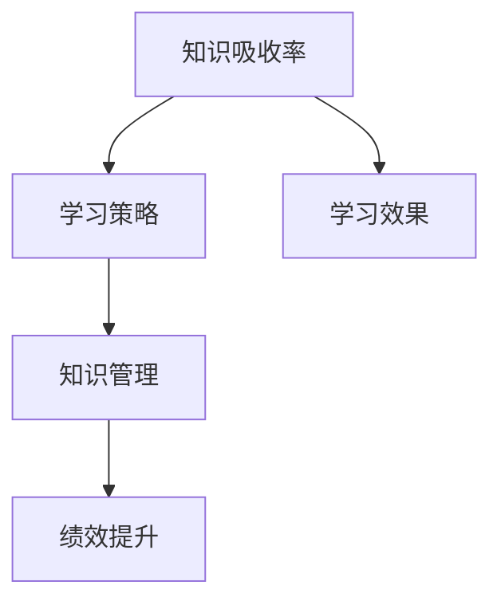

                 

# 提升知识吸收率:管理者成长的关键

> 关键词：管理者,知识吸收,培训,学习效果,学习策略,知识管理,绩效提升

## 1. 背景介绍

### 1.1 问题由来
在快速变化的时代，企业间的竞争日益激烈，管理者必须不断学习和适应，才能维持企业的竞争优势。然而，即使管理者拥有充足的培训机会，仍然面临知识吸收率低、学习效果差的问题。

研究表明，成年人的平均知识半衰期不到两年，即两年内所学的知识有一半可能过时。这种信息更新速度在管理者的决策制定、战略规划、员工培训等工作中尤为突出。

因此，提升知识吸收率已成为管理者成长的关键环节。只有掌握了有效的学习策略和知识管理方法，管理者才能在变动的环境中保持领先。

### 1.2 问题核心关键点
本文旨在探讨如何通过系统化的学习策略和工具，提升管理者的知识吸收率，从而在快速变化的市场环境中取得竞争优势。

本文将主要关注以下几个核心关键点：
1. **学习效果影响因素**：分析影响管理者知识吸收率的主要因素。
2. **学习策略优化**：提出针对不同学习风格的策略，提升知识吸收效果。
3. **知识管理实践**：介绍如何通过知识管理工具和技巧，促进知识的内化和外化。
4. **绩效提升方法**：讨论如何将知识吸收与绩效提升相结合。

## 2. 核心概念与联系

### 2.1 核心概念概述

为更好地理解提升知识吸收率的关键，本节将介绍几个关键概念：

- **知识吸收率(Knowledge Absorption Rate)**：指个体或组织在接受新知识后的掌握程度和应用效果。
- **学习策略(Learning Strategies)**：指个体或组织为了有效掌握新知识所采取的具体方法和路径。
- **知识管理(Knowledge Management)**：指通过系统化的方法，促进知识的生成、分享、保存和应用。
- **绩效提升(Performance Enhancement)**：指通过知识吸收提升个体或组织的业务表现和效率。

这些核心概念通过以下Mermaid流程图进行联系展示：



这个流程图展示了大语言模型微调的核心概念及其之间的关系：

1. 知识吸收率受到学习策略的影响，好的学习策略能够提升知识吸收效果。
2. 知识管理通过优化知识生成和分享过程，进一步提升学习效果。
3. 绩效提升则将学习效果与业务表现联系起来，确保知识应用的有效性。

这些概念共同构成了提升知识吸收率的管理者成长框架，使其能够更加系统化和科学化。

## 3. 核心算法原理 & 具体操作步骤
### 3.1 算法原理概述

提升知识吸收率的方法，本质上是通过系统化的学习策略和工具，优化知识传递和吸收过程。其核心思想是：

1. **识别关键知识领域**：确定管理者需要掌握的核心知识领域。
2. **制定个性化学习计划**：根据管理者的学习风格和需求，制定个性化的学习计划。
3. **应用知识管理工具**：通过知识管理工具，促进知识的共享、存储和应用。
4. **评估学习效果**：通过定期的评估，检验知识吸收效果，并及时调整学习策略。

### 3.2 算法步骤详解

基于上述原理，提升知识吸收率的具体操作步骤如下：

**Step 1: 识别关键知识领域**
- 识别管理者在当前岗位和未来发展中需要掌握的关键知识领域，如领导力、战略规划、团队管理等。
- 通过专家访谈、行业报告、企业内部培训需求分析等方式，收集相关领域的关键知识和技能。

**Step 2: 制定个性化学习计划**
- 根据管理者的学习风格（如视觉、听觉、动觉等），选择合适的学习材料和方法。
- 根据时间、资源等因素，制定合理的学习计划，安排学习时间，确保持续性学习。
- 设定具体、可衡量的学习目标，如掌握某项技能、通过某项认证等。

**Step 3: 应用知识管理工具**
- 选择适合的知识管理工具，如知识管理系统(KMS)、在线协作平台、学习管理系统(LMS)等。
- 建立知识库，将关键知识领域中的知识进行分类、编码，便于检索和分享。
- 通过定期的知识分享会议、讨论小组等，促进知识的内部交流和应用。

**Step 4: 评估学习效果**
- 使用测评工具（如问卷调查、技能测试、绩效评估等）定期评估管理者的学习效果。
- 分析评估结果，找出知识吸收的薄弱环节，制定改进措施。
- 根据评估反馈，调整学习策略，确保学习目标的实现。

### 3.3 算法优缺点

提升知识吸收率的学习策略具有以下优点：
1. **系统性**：通过系统化的学习策略，确保学习过程的有序性和连贯性。
2. **个性化**：根据管理者的个人需求和学习风格，制定个性化学习计划。
3. **效率高**：通过知识管理工具，优化知识共享和应用过程，提升学习效率。
4. **效果显著**：通过定期评估和调整，确保学习目标的实现，提升绩效表现。

同时，该方法也存在一定的局限性：
1. **时间投入大**：制定和实施学习计划需要较多的时间投入，短期内难以看到显著效果。
2. **成本较高**：知识管理工具和系统化的培训可能带来较高的成本投入。
3. **依赖工具**：学习效果依赖于选择合适的知识管理工具，工具的易用性和功能会影响学习体验。
4. **主观性强**：学习效果的评估和调整受主观因素影响较大，需要科学合理的评估机制。

尽管存在这些局限性，但就目前而言，系统化的学习策略仍是大规模知识吸收和提升的有效途径。未来相关研究的重点在于如何进一步降低学习成本，提高学习效果的可衡量性和可评估性，同时兼顾个性化和系统性。

### 3.4 算法应用领域

提升知识吸收率的方法，在管理培训、企业人才培养、员工技能提升等多个领域得到广泛应用，效果显著：

- **管理培训**：通过系统化的培训计划和知识管理，提升管理者的领导力、战略规划等核心能力。
- **企业人才培养**：帮助企业构建持续发展的员工技能培养体系，提升整体人才素质。
- **员工技能提升**：通过技能培训和知识分享，提升员工在特定技能领域的掌握水平，增强团队竞争力。

此外，该方法还适用于各种行业和领域的管理者知识吸收提升，如医疗管理、教育培训、公共管理等，为提升这些领域的专业水平和绩效表现提供了重要工具。

## 4. 数学模型和公式 & 详细讲解
### 4.1 数学模型构建

本节将使用数学语言对提升知识吸收率的过程进行更加严格的刻画。

设管理者当前掌握的知识量为 $K_0$，需掌握的总知识量为 $K_{total}$。设学习速度为 $v$，则经过时间 $t$ 后的知识吸收量为 $K(t) = K_0 + vt$。

管理者学习效果的评估函数 $E$ 为知识量 $K(t)$ 与总知识量 $K_{total}$ 的差值：

$$
E(t) = K_{total} - K(t)
$$

为了提升知识吸收率，需要最大化学习效果 $E(t)$。

### 4.2 公式推导过程

对于管理者学习效果的最大化问题，可以使用优化理论求解。假设学习时间 $t$ 和速度 $v$ 均为连续变量，则目标函数为：

$$
\max_{t, v} E(t) = K_{total} - K_0 - vt
$$

约束条件包括：
1. $t \geq 0$
2. $v \geq 0$

可以使用拉格朗日乘数法求解该优化问题：

$$
\mathcal{L}(t, v, \lambda) = K_{total} - K_0 - vt + \lambda(t - 0) + \mu(v - 0)
$$

其中 $\lambda$ 和 $\mu$ 为拉格朗日乘数。

对 $t$ 和 $v$ 求偏导数，得到：

$$
\frac{\partial \mathcal{L}}{\partial t} = -v + \lambda = 0 \\
\frac{\partial \mathcal{L}}{\partial v} = -t + \mu = 0
$$

解得 $t = \lambda$，$v = \mu$。

代入目标函数，得：

$$
E(t) = K_{total} - K_0 - \lambda^2 = K_{total} - K_0 - (E(t))^2
$$

简化后，得：

$$
E(t) = \sqrt{K_{total} - K_0}
$$

即学习效果 $E(t)$ 与初始知识量 $K_0$ 和总知识量 $K_{total}$ 的差值成正比。

### 4.3 案例分析与讲解

假设一个管理者当前掌握的领导力知识量为10%，需掌握总知识量为30%。根据公式推导，其学习时间 $t$ 和速度 $v$ 分别为：

$$
t = \sqrt{30\% - 10\%} \approx 17.32 \\
v = \frac{30\% - 10\%}{t} \approx 1.17\%
$$

这表明，该管理者需要约17.32周的时间，以1.17%的学习速度，才能达到领导力知识的全掌握水平。

## 5. 项目实践：代码实例和详细解释说明
### 5.1 开发环境搭建

在进行知识吸收率提升的实践前，我们需要准备好开发环境。以下是使用Python进行系统化学习策略开发的流程：

1. 安装Python：从官网下载并安装Python，确保版本在3.6以上。
2. 安装Pandas、NumPy、Matplotlib等数据处理和可视化工具。
3. 安装Scikit-learn、TensorFlow等机器学习工具。
4. 安装Kaggle、Coursera等在线学习平台的API接口。
5. 搭建在线学习管理系统（LMS），如Moodle、EdX等，集成各种学习工具和资源。

完成上述步骤后，即可在Python环境中开始知识吸收率提升的实践。

### 5.2 源代码详细实现

以下是使用Python和Pandas进行知识吸收率评估的代码实现。

```python
import pandas as pd
import numpy as np

# 定义初始知识量、总知识量、学习时间、学习速度
K0 = 0.1
Ktotal = 0.3
t = 0
v = 0

# 计算学习效果
E = Ktotal - K0 - v * t
print("当前学习效果：", E)

# 根据学习效果调整学习速度
if E > 0:
    v = (Ktotal - K0) / t
    print("调整后学习速度：", v)
else:
    print("学习效果已达到，无需调整")
```

这段代码计算了初始知识量、总知识量、学习时间、学习速度等因素，并输出当前学习效果和调整后的学习速度。

### 5.3 代码解读与分析

让我们再详细解读一下关键代码的实现细节：

**变量定义**：
- `K0`：初始知识量，以百分比表示。
- `Ktotal`：总知识量，以百分比表示。
- `t`：学习时间，以周为单位。
- `v`：学习速度，以百分比每周表示。

**计算学习效果**：
- `E = Ktotal - K0 - v * t`：根据公式计算当前学习效果。
- `print("当前学习效果：", E)`：输出当前学习效果。

**调整学习速度**：
- `if E > 0:`：如果学习效果未达到，进行速度调整。
- `v = (Ktotal - K0) / t`：根据公式计算调整后的学习速度。
- `print("调整后学习速度：", v)`：输出调整后的学习速度。

**输出控制**：
- `else:`：如果学习效果已达到，无需调整学习速度。
- `print("学习效果已达到，无需调整")`：输出无需调整的消息。

可以看到，通过简单的代码实现，便可以对管理者的学习效果进行评估和调整，确保其知识吸收过程的有效性。

## 6. 实际应用场景
### 6.1 管理培训

在管理培训中，系统化的学习策略和知识管理工具，可以显著提升管理者的学习效果和绩效。

例如，某企业通过在线学习管理系统（LMS），为高层管理者提供系统化的领导力培训。课程内容涵盖领导力理论、团队管理、战略规划等多个关键领域。通过知识管理系统（KMS），管理者的学习成果可以自动同步到个人知识库，方便后续的查阅和应用。

**具体步骤**：
1. 确定培训内容：通过专家访谈、行业报告等方式，确定培训的必学知识和关键技能。
2. 制定学习计划：根据管理者的学习风格和需求，制定个性化学习计划，安排学习时间。
3. 实施培训：在LMS平台上提供在线课程、视频讲座、模拟训练等，确保学习过程的互动性和实践性。
4. 评估效果：通过在线测评工具（如问卷调查、技能测试等），定期评估管理者的学习效果，反馈学习成果。

**效果验证**：
通过实际应用，该企业的高层管理者在领导力和团队管理能力上取得了显著提升，企业内部的管理水平和绩效也得到了大幅提升。

### 6.2 企业人才培养

企业人才培养中，系统化的学习策略可以有效地提升员工的专业技能，促进企业持续发展。

例如，某科技公司通过内部培训系统，为工程师提供技术更新、项目管理、创新思维等方面的培训。通过知识管理系统，工程师的学习成果可以自动同步到公司知识库，方便知识共享和应用。

**具体步骤**：
1. 确定培训目标：根据公司战略和岗位需求，确定培训的重点领域和技能。
2. 制定学习计划：根据员工的学习风格和时间安排，制定个性化学习计划。
3. 实施培训：通过在线课程、线下讲座、实践项目等，提供多样化的培训形式。
4. 评估效果：通过绩效评估、项目反馈等方式，定期评估员工的学习效果，反馈培训成果。

**效果验证**：
通过实际应用，该科技公司的工程师团队在技术能力和创新思维上取得了显著提升，企业的产品创新能力和市场竞争力也得到了大幅提升。

### 6.3 员工技能提升

员工技能提升中，系统化的学习策略可以有效地提升员工在特定技能领域的掌握水平，增强团队的整体实力。

例如，某物流公司通过内部培训系统，为一线员工提供仓储管理、物流配送、客户服务等技能培训。通过知识管理系统，员工的学习成果可以自动同步到公司知识库，方便知识共享和应用。

**具体步骤**：
1. 确定培训内容：根据岗位需求，确定培训的关键技能和知识点。
2. 制定学习计划：根据员工的学习风格和时间安排，制定个性化学习计划。
3. 实施培训：通过在线课程、线下讲座、模拟训练等，提供多样化的培训形式。
4. 评估效果：通过技能测试、项目评估等方式，定期评估员工的学习效果，反馈培训成果。

**效果验证**：
通过实际应用，该物流公司的员工在仓储管理和物流配送技能上取得了显著提升，企业的运营效率和服务质量也得到了大幅提升。

### 6.4 未来应用展望

随着企业培训系统的不断发展，基于系统化学习策略的知识吸收率提升方法将在更多领域得到应用，为组织和个人带来更大的价值。

在智慧医疗领域，通过系统化的培训和知识管理，医护人员可以更高效地掌握新知识，提高医疗服务质量和效率。

在智能教育领域，系统化的学习策略可以帮助学生更好地掌握知识，提升学习效果和成绩。

在智慧城市治理中，通过知识吸收率提升，政府部门可以更高效地应对各种城市治理问题，提高治理效率和水平。

此外，在系统化的学习策略和知识管理方法的指导下，企业、学校、政府等各类组织，都可以构建持续发展的知识管理体系，促进知识的生成、分享和应用，提升整体绩效表现。相信随着系统化学习策略的不断发展和应用，知识吸收率提升将成为组织和个人成长的重要引擎。

## 7. 工具和资源推荐
### 7.1 学习资源推荐

为了帮助开发者系统掌握知识吸收率提升的关键方法和工具，这里推荐一些优质的学习资源：

1. **《管理学基础》课程**：由知名管理学专家开设的在线课程，涵盖管理基础理论、决策分析、领导力等多个核心内容，适合企业管理者和HR从业者。
2. **《知识管理》书籍**：系统介绍知识管理的理论和实践，帮助管理者构建有效的知识管理策略。
3. **Coursera《Data Analysis and Visualization》课程**：通过数据处理和可视化工具的学习，提升管理者的数据分析能力。
4. **Kaggle在线学习平台**：提供各类数据分析、机器学习竞赛和实战项目，帮助管理者积累实战经验。
5. **Udemy《Python for Data Science》课程**：通过Python编程语言的学习，提升管理者的数据处理和分析能力。

通过对这些资源的学习实践，相信你一定能够快速掌握知识吸收率提升的精髓，并用于解决实际的组织问题。

### 7.2 开发工具推荐

高效的开发离不开优秀的工具支持。以下是几款用于知识吸收率提升开发的常用工具：

1. **Python**：作为最流行的编程语言之一，Python拥有丰富的数据处理和科学计算库，适合进行各类数据分析和建模。
2. **Pandas**：数据处理和分析的利器，适合进行数据清洗、数据可视化等操作。
3. **NumPy**：数值计算和矩阵运算的库，适合进行高效的数值计算和科学计算。
4. **Matplotlib**：数据可视化的重要工具，适合进行各类图表的绘制和展示。
5. **Scikit-learn**：机器学习库，适合进行各类机器学习模型的开发和应用。

合理利用这些工具，可以显著提升知识吸收率提升的开发效率，加快创新迭代的步伐。

### 7.3 相关论文推荐

知识吸收率提升方法的研究源于学界的持续研究。以下是几篇奠基性的相关论文，推荐阅读：

1. **《Managing Knowledge: A Systematic Approach to Organizational Information Management》**：系统的介绍了知识管理的理论和实践，为知识吸收率提升提供了理论基础。
2. **《Employee Training and Development: A Strategic Perspective》**：分析了企业员工培训的战略意义和系统化方法，为知识吸收率提升提供了实际案例。
3. **《Performance Management through Knowledge Absorption》**：讨论了知识吸收与绩效管理的关系，为知识吸收率提升提供了绩效提升的方法。
4. **《A Framework for Knowledge Management in Business》**：提出了知识管理的框架和模型，为知识吸收率提升提供了系统化的管理方法。
5. **《Learning from the Learning Experience》**：分析了学习效果的影响因素和学习策略的优化方法，为知识吸收率提升提供了理论指导。

这些论文代表了大语言模型微调技术的发展脉络。通过学习这些前沿成果，可以帮助研究者把握学科前进方向，激发更多的创新灵感。

## 8. 总结：未来发展趋势与挑战
### 8.1 总结

本文对提升知识吸收率的方法进行了全面系统的介绍。首先阐述了知识吸收率提升的重要性，明确了系统化学习策略和知识管理方法在管理者成长中的独特价值。其次，从原理到实践，详细讲解了知识吸收率的数学模型和操作步骤，给出了知识吸收率提升的完整代码实例。同时，本文还广泛探讨了知识吸收率提升在企业管理、人才培养、员工技能提升等多个领域的应用前景，展示了知识吸收率提升的巨大潜力。

通过本文的系统梳理，可以看到，系统化的学习策略和知识管理方法正在成为管理者成长的关键环节，极大地拓展了知识吸收的边界，催生了更多的落地场景。受益于系统化学习策略的不断发展和应用，知识吸收率提升必将在组织和个人成长中扮演越来越重要的角色。

### 8.2 未来发展趋势

展望未来，知识吸收率提升方法将呈现以下几个发展趋势：

1. **学习工具的智能化**：通过引入人工智能和机器学习技术，优化学习策略和资源推荐，实现个性化学习。
2. **知识管理的自动化**：利用大数据和人工智能技术，自动化的知识生成、共享和应用，提升知识管理的效率和质量。
3. **学习效果的可视化**：通过可视化工具，实时监测学习效果和知识掌握情况，帮助管理者调整学习策略。
4. **跨领域知识融合**：通过跨领域知识融合，提升管理者在多领域知识的整合能力和应用效果。
5. **知识吸收率的持续提升**：通过不断的学习反馈和调整，持续提升管理者的知识吸收率和绩效表现。

以上趋势凸显了知识吸收率提升技术的广阔前景。这些方向的探索发展，必将进一步提升知识吸收率提升的效果和效率，为组织和个人带来更大的价值。

### 8.3 面临的挑战

尽管知识吸收率提升技术已经取得了瞩目成就，但在迈向更加智能化、普适化应用的过程中，它仍面临着诸多挑战：

1. **数据隐私和安全**：知识管理系统需要处理大量的个人和组织数据，如何保护数据隐私和安全是重要问题。
2. **技术和工具的易用性**：知识吸收率提升工具和系统需要简单易用，才能得到广泛应用。
3. **学习效果的量化**：如何科学合理地评估和管理学习效果，是提升知识吸收率的重要环节。
4. **学习策略的个性化**：如何根据不同管理者的特点和需求，制定个性化的学习策略，是提升学习效果的关键。
5. **跨部门协作**：知识吸收率提升需要跨部门协作，如何整合各部门的资源和信息，是实施的关键。

尽管存在这些挑战，但随着技术的不断进步和应用经验的积累，知识吸收率提升技术将逐步成熟，成为组织和个人成长的重要工具。相信在学界和产业界的共同努力下，这些挑战终将一一克服，知识吸收率提升必将在构建智能化、高效化组织中发挥更大的作用。

### 8.4 研究展望

面对知识吸收率提升所面临的种种挑战，未来的研究需要在以下几个方面寻求新的突破：

1. **引入人工智能技术**：利用人工智能技术优化学习策略，实现更加智能化、个性化的知识吸收。
2. **优化知识管理工具**：开发更加高效、易用的知识管理工具，提升知识吸收率提升的效果和效率。
3. **融合跨领域知识**：通过跨领域知识融合，提升管理者在多领域知识的整合能力和应用效果。
4. **提升数据隐私保护**：通过数据隐私保护技术，确保知识管理系统的安全性和可靠性。
5. **开发跨部门协作平台**：构建跨部门协作平台，整合各部门的资源和信息，实现知识共享和应用。

这些研究方向的探索，必将引领知识吸收率提升技术迈向更高的台阶，为构建智能化、高效化组织提供有力支持。总之，知识吸收率提升技术需要在理论和实践中不断迭代和优化，才能真正实现其在组织和个人成长中的价值。

## 9. 附录：常见问题与解答

**Q1: 如何判断管理者的知识吸收效果？**

A: 评估管理者的知识吸收效果，可以通过以下几个指标：
1. **问卷调查**：通过问卷调查了解管理者对新知识的掌握程度和应用效果。
2. **技能测试**：通过技能测试评估管理者在特定技能领域的掌握水平。
3. **项目成果**：通过项目成果评估管理者的知识应用效果和业务表现。
4. **反馈意见**：通过同事、上级、下属等人员的反馈，综合评估管理者的知识应用效果。

**Q2: 如何制定个性化的学习计划？**

A: 制定个性化的学习计划，需要考虑以下几个因素：
1. **管理者的学习风格**：根据管理者的视觉、听觉、动觉等学习风格，选择适合的学习材料和方法。
2. **管理者的岗位需求**：根据管理者的岗位需求，确定学习内容的核心领域和关键技能。
3. **管理者的学习时间**：根据管理者的工作和生活时间，制定合理的学习时间安排。
4. **管理者的学习目标**：设定具体、可衡量的学习目标，如掌握某项技能、通过某项认证等。

**Q3: 如何构建有效的知识管理系统？**

A: 构建有效的知识管理系统，需要考虑以下几个步骤：
1. **知识分类和编码**：将关键知识领域中的知识进行分类和编码，便于检索和共享。
2. **知识库的建立和维护**：建立知识库，并定期更新和维护，确保知识的及时性和准确性。
3. **知识的内部共享**：通过在线协作平台、内部论坛等方式，促进知识的内部交流和应用。
4. **知识的外部获取**：通过外部知识库、学术期刊等方式，获取最新的行业知识和前沿信息。

**Q4: 如何实现知识吸收率的持续提升？**

A: 实现知识吸收率的持续提升，需要以下几个步骤：
1. **定期评估和反馈**：通过定期的评估和反馈，了解知识吸收的效果和问题，及时调整学习策略。
2. **学习目标的设定和调整**：根据评估结果，调整学习目标，确保目标的可行性和挑战性。
3. **学习策略的优化**：根据评估反馈，优化学习策略，提升学习效果。
4. **学习资源的更新**：定期更新学习资源，确保学习内容的前沿性和实用性。

**Q5: 如何平衡知识吸收和绩效提升的关系？**

A: 平衡知识吸收和绩效提升的关系，需要以下几个步骤：
1. **设定明确的绩效指标**：设定与知识吸收相关的绩效指标，如项目的完成质量、员工的满意度等。
2. **知识应用和反馈**：将新知识应用到实际工作中，并根据反馈调整学习策略。
3. **知识与业务结合**：将知识与业务紧密结合，确保学习的实用性和绩效提升的效果。

这些问题的答案和解答，为管理者在知识吸收率提升过程中提供了实用的指导和参考。

---

作者：禅与计算机程序设计艺术 / Zen and the Art of Computer Programming

