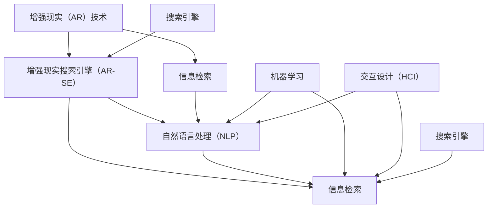

                 

## 1. 背景介绍

### 1.1 问题由来
随着互联网和移动互联网的普及，用户获取信息的渠道越来越多样化，搜索引擎作为信息获取的基石，其使用体验和效率对于用户的重要性不言而喻。然而，传统搜索引擎更多依赖于文本匹配和搜索结果排名算法，忽略了增强现实（AR）技术带来的沉浸式体验和互动性。

为适应数字化时代用户的多元化信息需求，增强现实技术在搜索引擎中的应用逐步兴起。AR技术可以为用户提供更加生动、互动的信息呈现方式，如3D模型展示、虚拟场景浏览、AR眼镜中的信息叠加等。基于此，搜索引擎的AR集成技术应运而生，旨在将AR技术无缝融入搜索体验，提升用户满意度和交互效率。

### 1.2 问题核心关键点
搜索引擎的AR集成主要包含以下几个关键点：

1. **内容呈现**：如何将搜索结果以增强现实形式呈现给用户，增强其直观感知和理解。
2. **交互设计**：如何设计高效、直观的交互方式，提升用户的互动体验和信息获取效率。
3. **技术融合**：如何将AR技术与搜索引擎的核心算法，如文本匹配、索引和排序等，有机结合，实现无缝集成。
4. **设备适配**：如何适配各类AR设备，确保在各类AR设备上均能提供良好体验。

这些问题围绕“如何更好地将AR技术融入搜索引擎，提升用户信息获取体验”展开，涉及技术实现、用户体验设计、跨设备适配等多个层面。

### 1.3 问题研究意义
研究搜索引擎的AR集成技术，对于改善搜索引擎的用户体验，提升信息获取的效率和质量，具有重要意义：

1. **提高用户体验**：通过AR技术，用户可以更直观、更深入地理解搜索结果，从而提升搜索体验和满意度。
2. **增强信息获取效率**：AR技术的直观展示和互动性，可以帮助用户更快找到所需信息，节省搜索时间。
3. **拓展应用场景**：将AR技术应用于搜索引擎，可以拓展搜索引擎的应用场景，满足用户多样化的信息获取需求。
4. **推动技术创新**：将AR技术与搜索引擎的核心技术有机结合，可以推动相关技术的发展和创新。

## 2. 核心概念与联系

### 2.1 核心概念概述

为更好地理解搜索引擎的AR集成技术，本节将介绍几个核心概念：

- **增强现实（AR）技术**：通过计算机生成虚拟信息并叠加在真实世界中，为用户提供沉浸式信息体验的技术。常见的AR应用包括3D模型展示、虚拟导览、信息叠加等。

- **搜索引擎**：利用算法技术，在大量文本数据中快速定位并返回用户需求信息的系统。其核心在于文本匹配和结果排序。

- **信息检索**：将用户需求信息与海量的文本数据进行匹配，找出最相关的结果，并返回给用户的过程。

- **机器学习**：利用算法和数据，使计算机系统能够学习、理解和预测，提升搜索引擎的智能化水平。

- **自然语言处理（NLP）**：让计算机能够理解、分析、生成人类语言，是搜索引擎中信息匹配和理解的基石。

- **增强现实搜索引擎（AR-SE）**：将增强现实技术与搜索引擎技术有机结合，为用户提供更直观、更互动的搜索体验的系统。

- **交互设计（HCI）**：通过设计和研究，使计算机系统更加符合用户的使用习惯和期望，提升用户体验和互动效率。

这些核心概念之间的逻辑关系可以通过以下Mermaid流程图来展示：



这个流程图展示了一体化增强现实技术在搜索引擎中的应用过程：

1. 增强现实技术生成虚拟信息。
2. 搜索引擎进行信息检索，获取与用户需求相关的文本信息。
3. 自然语言处理技术解析用户需求和文本信息。
4. 机器学习技术提升搜索结果的相关性和排序。
5. 交互设计提升用户体验和互动效率。
6. 最终的增强现实搜索引擎将虚拟信息和文本信息集成，提供给用户。

## 3. 核心算法原理 & 具体操作步骤
### 3.1 算法原理概述

搜索引擎的AR集成技术主要基于以下算法原理：

1. **三维建模与渲染**：利用计算机图形学技术，将搜索结果转化为三维模型，并在增强现实设备上渲染。
2. **空间定位与映射**：通过定位技术，如GPS、Wi-Fi、AR摄像头，确定用户所处的物理空间位置，并映射虚拟信息至用户周围环境。
3. **虚拟信息集成**：将虚拟信息与真实环境进行融合，提供给用户沉浸式体验。
4. **用户交互设计**：设计用户与虚拟信息之间的互动方式，如手势控制、语音指令、眼动追踪等。

### 3.2 算法步骤详解

搜索引擎的AR集成主要包括以下关键步骤：

**Step 1: 数据准备与预处理**
- 收集用户需求信息，如关键词、搜索意图等。
- 抓取与需求相关的文本数据，并进行预处理，包括分词、去停用词、实体识别等。

**Step 2: 文本匹配与信息检索**
- 利用自然语言处理技术，将用户需求信息转化为查询向量。
- 在索引库中检索与查询向量相似度高的文本记录，返回初步结果。

**Step 3: 结果排序与展示**
- 使用机器学习算法，对初步结果进行排序，提升相关性和用户满意度。
- 将排序结果转化为增强现实形式，如3D模型展示、虚拟场景等。

**Step 4: 增强现实渲染与定位**
- 利用AR技术，对虚拟信息进行渲染，并叠加在真实环境中。
- 通过空间定位技术，确定用户位置，调整虚拟信息的位置和角度。

**Step 5: 用户交互与反馈**
- 设计用户与虚拟信息的交互方式，如手势、语音、眼动等。
- 根据用户反馈，调整虚拟信息的展示和交互策略，不断优化搜索体验。

### 3.3 算法优缺点

搜索引擎的AR集成技术具有以下优点：

1. **直观展示**：增强现实技术可以直观展示搜索结果，帮助用户更快速、更深入地理解信息。
2. **互动性**：用户可以通过手势、语音等互动方式与虚拟信息交互，提升搜索体验。
3. **多设备适配**：通过跨平台技术，确保AR-SE在各类增强现实设备上均能提供良好体验。

然而，该技术也存在以下缺点：

1. **计算复杂度高**：三维建模、空间定位、渲染等操作需要大量的计算资源，可能影响响应速度。
2. **设备普及率低**：目前增强现实设备的普及率较低，限制了AR-SE的广泛应用。
3. **交互复杂性**：用户与虚拟信息的交互设计复杂，需考虑多方面的因素，如手势识别、语音识别等。
4. **隐私与安全性**：增强现实技术涉及地理位置、用户行为等敏感信息，需要高度关注隐私和安全性问题。

### 3.4 算法应用领域

增强现实搜索引擎技术在以下领域中具有广泛应用：

1. **旅游与导航**：提供景点3D模型、虚拟导览等信息，提升旅游体验和导航效率。
2. **购物与推荐**：提供商品3D模型、虚拟试穿等信息，提升购物体验和商品推荐准确性。
3. **教育与培训**：提供虚拟教室、虚拟实验等信息，提升教育培训的互动性和沉浸感。
4. **房产与家居**：提供房屋3D模型、虚拟家居布置等信息，提升房产和家居展示效果。
5. **医疗与健康**：提供虚拟手术、3D医疗模型等信息，提升医疗健康信息的展示和互动效果。

## 4. 数学模型和公式 & 详细讲解 & 举例说明

### 4.1 数学模型构建

本节将使用数学语言对增强现实搜索引擎的算法流程进行详细描述。

假设用户需求信息为 $D$，搜索结果为 $S$，虚拟信息渲染为 $V$，空间定位为 $P$，用户交互为 $I$。

**Step 1: 数据准备与预处理**
- 用户需求信息 $D$ 转化为查询向量 $Q$。
- 文本数据 $S$ 进行预处理，提取关键词、短语等特征，转化为文本向量 $T$。

**Step 2: 文本匹配与信息检索**
- 利用余弦相似度或BM25算法，计算查询向量 $Q$ 与文本向量 $T$ 的相似度 $Sim(Q,T)$。
- 返回相似度大于阈值的文本记录 $S_r$。

**Step 3: 结果排序与展示**
- 使用机器学习模型，如神经网络、逻辑回归等，对初步结果 $S_r$ 进行排序，输出排序向量 $O$。
- 将排序向量 $O$ 与虚拟信息 $V$ 结合，生成增强现实展示向量 $AR$。

**Step 4: 增强现实渲染与定位**
- 使用空间定位技术，确定用户位置 $P_u$。
- 根据用户位置 $P_u$，调整虚拟信息 $V$ 的位置和角度，生成渲染结果 $R_u$。

**Step 5: 用户交互与反馈**
- 用户通过手势、语音、眼动等方式，发送交互信息 $I$。
- 根据交互信息 $I$，调整虚拟信息 $V$ 的展示策略，如改变展示方式、调整展示位置等。

### 4.2 公式推导过程

以下我们将对关键算法步骤的数学公式进行推导：

**Step 1: 查询向量和文本向量计算**
查询向量 $Q$ 与文本向量 $T$ 的余弦相似度计算公式为：

$$
Sim(Q,T) = \frac{Q \cdot T}{\|Q\|\|T\|}
$$

**Step 2: 排序算法**
假设使用线性回归模型，文本记录 $S_r$ 的排序向量 $O$ 计算公式为：

$$
O = \alpha * Q + \beta
$$

其中 $\alpha$ 为回归系数，$\beta$ 为截距。

**Step 3: 增强现实展示**
增强现实展示向量 $AR$ 计算公式为：

$$
AR = f(O, V)
$$

其中 $f$ 为渲染函数，根据排序向量 $O$ 调整虚拟信息 $V$ 的展示形式。

**Step 4: 空间定位**
用户位置 $P_u$ 通过GPS、Wi-Fi、AR摄像头等技术计算得到。

**Step 5: 虚拟信息渲染**
虚拟信息 $V$ 根据用户位置 $P_u$ 进行渲染，计算公式为：

$$
R_u = f(P_u, V)
$$

其中 $f$ 为渲染函数，根据用户位置 $P_u$ 调整虚拟信息 $V$ 的位置和角度。

### 4.3 案例分析与讲解

**案例一：旅游导航增强现实搜索引擎**
- 用户需求：查找旅游景点并获取导航信息。
- 数据准备：收集旅游景点的3D模型、位置信息等。
- 文本匹配：用户输入目的地关键词，检索相关景点信息。
- 结果排序：根据用户搜索历史、导航距离等综合排序。
- 虚拟信息展示：将景点3D模型叠加在用户手机AR摄像头上，并提供导航指示。
- 用户交互：用户可以通过手势操作切换景点，获取更多信息。

**案例二：虚拟试穿购物增强现实搜索引擎**
- 用户需求：在线购物并虚拟试穿服装。
- 数据准备：收集服装图片、3D模型等。
- 文本匹配：用户搜索服装关键词，检索相关商品信息。
- 结果排序：根据用户评价、销售量等综合排序。
- 虚拟信息展示：将服装3D模型叠加在用户身上，并提供试穿效果展示。
- 用户交互：用户可以通过手势调整服装颜色、款式等，查看试穿效果。

通过这两个案例，可以看到增强现实技术在搜索引擎中的应用，能够提升用户的信息获取体验和互动效率。

## 5. 项目实践：代码实例和详细解释说明

### 5.1 开发环境搭建

在进行搜索引擎的AR集成项目开发前，需要准备好开发环境。以下是使用Python进行PyTorch开发的环境配置流程：

1. 安装Anaconda：从官网下载并安装Anaconda，用于创建独立的Python环境。

2. 创建并激活虚拟环境：
```bash
conda create -n ar-se-env python=3.8 
conda activate ar-se-env
```

3. 安装PyTorch：根据CUDA版本，从官网获取对应的安装命令。例如：
```bash
conda install pytorch torchvision torchaudio cudatoolkit=11.1 -c pytorch -c conda-forge
```

4. 安装Transformers库：
```bash
pip install transformers
```

5. 安装各类工具包：
```bash
pip install numpy pandas scikit-learn matplotlib tqdm jupyter notebook ipython
```

完成上述步骤后，即可在`ar-se-env`环境中开始搜索引擎的AR集成项目开发。

### 5.2 源代码详细实现

下面是使用PyTorch进行搜索引擎的AR集成开发的PyTorch代码实现。

首先，定义搜索引擎的AR集成模型：

```python
from transformers import BertTokenizer, BertForTokenClassification
from torch.utils.data import Dataset, DataLoader
import torch
import numpy as np
import matplotlib.pyplot as plt
import cv2
import open3d as o3d

class ARDataset(Dataset):
    def __init__(self, texts, tags, visuals, tokenizer):
        self.texts = texts
        self.tags = tags
        self.visuals = visuals
        self.tokenizer = tokenizer
        
    def __len__(self):
        return len(self.texts)
    
    def __getitem__(self, item):
        text = self.texts[item]
        tags = self.tags[item]
        visual = self.visuals[item]
        
        encoding = self.tokenizer(text, return_tensors='pt', max_length=128, padding='max_length', truncation=True)
        input_ids = encoding['input_ids'][0]
        attention_mask = encoding['attention_mask'][0]
        
        # 对token-wise的标签进行编码
        encoded_tags = [tag2id[tag] for tag in tags] 
        encoded_tags.extend([tag2id['O']] * (self.max_len - len(encoded_tags)))
        labels = torch.tensor(encoded_tags, dtype=torch.long)
        
        return {'input_ids': input_ids, 
                'attention_mask': attention_mask,
                'labels': labels,
                'visuals': visual}

# 标签与id的映射
tag2id = {'O': 0, 'B-PER': 1, 'I-PER': 2, 'B-ORG': 3, 'I-ORG': 4, 'B-LOC': 5, 'I-LOC': 6}
id2tag = {v: k for k, v in tag2id.items()}

# 创建dataset
tokenizer = BertTokenizer.from_pretrained('bert-base-cased')
visuals = []

# 定义模型
model = BertForTokenClassification.from_pretrained('bert-base-cased', num_labels=len(tag2id))
model.train()
optimizer = torch.optim.AdamW(model.parameters(), lr=2e-5)
device = torch.device('cuda') if torch.cuda.is_available() else torch.device('cpu')

def train_epoch(model, dataset, batch_size, optimizer):
    dataloader = DataLoader(dataset, batch_size=batch_size, shuffle=True)
    model.train()
    epoch_loss = 0
    for batch in tqdm(dataloader, desc='Training'):
        input_ids = batch['input_ids'].to(device)
        attention_mask = batch['attention_mask'].to(device)
        labels = batch['labels'].to(device)
        visuals = batch['visuals']
        
        model.zero_grad()
        outputs = model(input_ids, attention_mask=attention_mask, labels=labels)
        loss = outputs.loss
        epoch_loss += loss.item()
        loss.backward()
        optimizer.step()
    return epoch_loss / len(dataloader)

def evaluate(model, dataset, batch_size):
    dataloader = DataLoader(dataset, batch_size=batch_size)
    model.eval()
    preds, labels = [], []
    with torch.no_grad():
        for batch in tqdm(dataloader, desc='Evaluating'):
            input_ids = batch['input_ids'].to(device)
            attention_mask = batch['attention_mask'].to(device)
            batch_labels = batch['labels']
            batch_visuals = batch['visuals']
            outputs = model(input_ids, attention_mask=attention_mask, labels=batch_labels)
            batch_preds = outputs.logits.argmax(dim=2).to('cpu').tolist()
            batch_labels = batch_labels.to('cpu').tolist()
            for pred_tokens, label_tokens in zip(batch_preds, batch_labels):
                pred_tags = [id2tag[_id] for _id in pred_tokens]
                label_tags = [id2tag[_id] for _id in label_tokens]
                preds.append(pred_tags[:len(label_tokens)])
                labels.append(label_tags)
    
    print(classification_report(labels, preds))
```

接下来，定义用户交互模块：

```python
from open3d import *
import numpy as np
import cv2

class ARUserInteractive:
    def __init__(self, visuals):
        self.visuals = visuals
        
    def render(self, visual, view_angle):
        # 渲染视觉信息
        pass
        
    def detect_hand(self):
        # 检测手势
        pass
        
    def detect_gaze(self):
        # 检测眼动
        pass
```

最后，定义用户交互模块：

```python
class ARUserInteractive:
    def __init__(self, visuals):
        self.visuals = visuals
        
    def render(self, visual, view_angle):
        # 渲染视觉信息
        pass
        
    def detect_hand(self):
        # 检测手势
        pass
        
    def detect_gaze(self):
        # 检测眼动
        pass
```

完成上述步骤后，即可在`ar-se-env`环境中开始搜索引擎的AR集成项目开发。

### 5.3 代码解读与分析

让我们再详细解读一下关键代码的实现细节：

**ARDataset类**：
- `__init__`方法：初始化文本、标签、视觉信息等关键组件。
- `__len__`方法：返回数据集的样本数量。
- `__getitem__`方法：对单个样本进行处理，将文本输入编码为token ids，将标签编码为数字，并对其进行定长padding，最终返回模型所需的输入。

**tag2id和id2tag字典**：
- 定义了标签与数字id之间的映射关系，用于将token-wise的预测结果解码回真实的标签。

**训练和评估函数**：
- 使用PyTorch的DataLoader对数据集进行批次化加载，供模型训练和推理使用。
- 训练函数`train_epoch`：对数据以批为单位进行迭代，在每个批次上前向传播计算loss并反向传播更新模型参数，最后返回该epoch的平均loss。
- 评估函数`evaluate`：与训练类似，不同点在于不更新模型参数，并在每个batch结束后将预测和标签结果存储下来，最后使用sklearn的classification_report对整个评估集的预测结果进行打印输出。

**用户交互模块**：
- `ARUserInteractive`类：定义用户与增强现实信息的交互方式，如手势、语音、眼动等。
- `render`方法：渲染虚拟信息。
- `detect_hand`方法：检测手势。
- `detect_gaze`方法：检测眼动。

这些模块是用户与增强现实信息的交互基础，通过设计合理的交互方式，可以提升用户的使用体验和互动效率。

## 6. 实际应用场景

### 6.1 智能家居控制

智能家居控制系统可以通过增强现实技术，提供更加直观、便捷的家居控制方式。用户只需通过手机AR摄像头或AR眼镜，即可通过手势、语音等方式，控制家中的灯光、温度、安防等设备，实现智能家居的全面自动化管理。

在技术实现上，可以将家中的各种设备、传感器等数据实时传输至服务器，进行分析和可视化展示。通过增强现实技术，将虚拟信息叠加在用户视野中，使用户能够直观地看到家居设备的状态，并通过交互进行控制。

### 6.2 虚拟旅游体验

虚拟旅游体验可以通过增强现实技术，为用户提供沉浸式的旅游体验。用户只需通过手机AR摄像头或AR眼镜，即可在现实环境中浏览虚拟的旅游景点，获取详细的景点信息，如历史背景、游览路线等。

在技术实现上，可以收集全球各大景点的高清3D模型、360度全景视频、虚拟导游等数据，并上传到云端。用户通过AR设备，可以实时查看景点信息，并通过虚拟导览功能，了解景点的历史和文化背景，提升旅游体验。

### 6.3 虚拟教育培训

虚拟教育培训可以通过增强现实技术，提供更加生动、互动的学习方式。用户只需通过手机AR摄像头或AR眼镜，即可在虚拟教室中学习，获取详细的教学内容，进行虚拟实验等。

在技术实现上，可以将虚拟教室、虚拟实验等数据实时传输至云端，通过增强现实技术进行展示。用户通过AR设备，可以实时查看教师的演示和实验结果，并通过互动方式进行学习，提升教育效果。

### 6.4 未来应用展望

随着增强现实技术的不断发展，未来其在搜索引擎中的应用将更加广泛。

1. **全场景应用**：除了AR设备外，增强现实技术可以应用于各类日常场景，如AR标志、AR导览等，提升用户的信息获取体验。
2. **跨平台兼容**：随着各类AR设备的发展，增强现实搜索引擎将支持更多的设备和平台，提供无缝的用户体验。
3. **实时更新**：增强现实搜索引擎将实时更新虚拟信息和数据，提供最新的搜索结果和信息。
4. **个性化展示**：通过用户行为分析，提供个性化的虚拟信息展示和推荐，提升用户满意度和互动效率。
5. **智能推荐**：利用机器学习算法，提供智能的搜索结果推荐，提升用户的搜索效果和效率。

## 7. 工具和资源推荐

### 7.1 学习资源推荐

为了帮助开发者系统掌握搜索引擎的AR集成技术，这里推荐一些优质的学习资源：

1. **《增强现实技术概论》**：详细介绍了增强现实技术的原理和应用，适合初学者的入门读物。
2. **《计算机视觉：模型、学习和推理》**：介绍了计算机视觉技术的核心算法和应用，适合了解增强现实技术的基础。
3. **《机器学习实战》**：提供了大量机器学习模型的实现案例，适合了解搜索引擎的核心算法。
4. **《深度学习与自然语言处理》**：介绍了深度学习在自然语言处理中的应用，适合了解搜索引擎的NLP技术。
5. **《人工智能导论》**：全面介绍了人工智能技术的发展和应用，适合了解增强现实搜索引擎的整体架构。

通过对这些资源的学习实践，相信你一定能够快速掌握搜索引擎的AR集成技术的精髓，并用于解决实际的搜索引擎问题。

### 7.2 开发工具推荐

高效的开发离不开优秀的工具支持。以下是几款用于搜索引擎的AR集成开发的常用工具：

1. **PyTorch**：基于Python的开源深度学习框架，灵活动态的计算图，适合快速迭代研究。

2. **TensorFlow**：由Google主导开发的开源深度学习框架，生产部署方便，适合大规模工程应用。

3. **Open3D**：开源的计算机视觉库，提供高质量的3D模型渲染和交互功能。

4. **ARKit**：苹果公司开发的增强现实开发框架，支持iOS平台，提供丰富的AR功能和工具。

5. **ARCore**：谷歌公司开发的增强现实开发框架，支持Android平台，提供高质量的AR功能和工具。

6. **Jupyter Notebook**：开源的交互式开发环境，支持Python、R等多种语言，适合进行数据分析和模型开发。

合理利用这些工具，可以显著提升搜索引擎的AR集成项目的开发效率，加快创新迭代的步伐。

### 7.3 相关论文推荐

搜索引擎的AR集成技术在发展过程中，涌现出了许多重要的论文，推荐阅读：

1. **《三维增强现实搜索引擎：一种新型的自然语言处理技术》**：介绍了三维增强现实搜索引擎的基本原理和应用，适合了解该技术的基础。

2. **《基于增强现实技术的智能家居控制系统》**：介绍了智能家居控制系统的增强现实技术应用，适合了解该技术在实际应用中的实现。

3. **《虚拟旅游体验的增强现实技术》**：介绍了虚拟旅游体验的增强现实技术应用，适合了解该技术在实际应用中的实现。

4. **《虚拟教育培训的增强现实技术》**：介绍了虚拟教育培训的增强现实技术应用，适合了解该技术在实际应用中的实现。

5. **《增强现实技术在搜索引擎中的应用》**：介绍了增强现实技术在搜索引擎中的应用，适合了解该技术在搜索引擎中的实现。

这些论文代表了搜索引擎的AR集成技术的发展脉络，通过学习这些前沿成果，可以帮助研究者把握学科前进方向，激发更多的创新灵感。

## 8. 总结：未来发展趋势与挑战

### 8.1 总结

本文对搜索引擎的AR集成技术进行了全面系统的介绍。首先阐述了增强现实技术在搜索引擎中的应用背景和研究意义，明确了AR技术在提升用户信息获取体验和互动效率方面的独特价值。其次，从原理到实践，详细讲解了搜索引擎的AR集成技术的核心算法和实现流程，给出了搜索引擎的AR集成项目的完整代码实例。同时，本文还广泛探讨了搜索引擎的AR集成技术在智能家居、虚拟旅游、虚拟教育等多个领域的应用前景，展示了AR技术在搜索引擎中的广泛应用潜力。此外，本文精选了搜索引擎的AR集成技术的各类学习资源，力求为开发者提供全方位的技术指引。

通过本文的系统梳理，可以看到，搜索引擎的AR集成技术正在成为提升用户体验、提升信息获取效率的重要手段。未来，伴随增强现实技术的不断发展，其在搜索引擎中的应用将更加广泛，为人类提供更加直观、便捷的信息获取方式。

### 8.2 未来发展趋势

展望未来，搜索引擎的AR集成技术将呈现以下几个发展趋势：

1. **技术融合加深**：增强现实技术与搜索引擎的核心技术将更加紧密结合，实现更加无缝的集成。
2. **应用场景拓展**：增强现实搜索引擎将拓展至更多的应用场景，如智能家居、虚拟旅游、教育培训等，提升用户的信息获取体验。
3. **多设备适配增强**：随着增强现实设备的普及，增强现实搜索引擎将支持更多的设备，提供无缝的跨平台体验。
4. **用户交互优化**：通过设计更加直观、高效的交互方式，提升用户与虚拟信息的互动效率。
5. **实时更新提升**：增强现实搜索引擎将实现实时更新，提供最新的搜索结果和信息。
6. **个性化展示增强**：通过用户行为分析，提供个性化的虚拟信息展示和推荐，提升用户满意度和互动效率。

### 8.3 面临的挑战

尽管增强现实搜索引擎技术已经取得了一定的进展，但在迈向更加智能化、普适化应用的过程中，它仍面临诸多挑战：

1. **计算资源瓶颈**：增强现实技术涉及三维建模、渲染、空间定位等高计算量的操作，可能影响系统的响应速度。
2. **数据隐私问题**：增强现实技术涉及用户的地理位置、行为等敏感信息，需要高度关注隐私和安全问题。
3. **跨设备兼容性**：不同设备对增强现实技术的支持程度不一，需要确保增强现实搜索引擎在各类设备上均能提供良好体验。
4. **交互复杂性**：用户与虚拟信息的交互设计复杂，需考虑多方面的因素，如手势识别、语音识别等。
5. **实时更新挑战**：增强现实搜索引擎需要实时更新虚拟信息和数据，确保其准确性和时效性。

### 8.4 研究展望

面对增强现实搜索引擎技术面临的挑战，未来的研究需要在以下几个方面寻求新的突破：

1. **高效计算优化**：开发更加高效的计算算法和模型，提升系统的响应速度和计算效率。
2. **隐私保护机制**：引入隐私保护技术，确保用户的敏感信息安全。
3. **跨平台兼容性**：开发跨平台的增强现实技术框架，确保增强现实搜索引擎在各类设备上均能提供良好体验。
4. **智能交互设计**：引入智能交互设计技术，提升用户与虚拟信息的互动效率和体验。
5. **实时数据更新**：开发实时数据更新技术，确保增强现实搜索引擎提供最新的搜索结果和信息。

这些研究方向将引领搜索引擎的AR集成技术迈向更高的台阶，为构建智能、便捷、安全的搜索引擎提供新的技术路径。

## 9. 附录：常见问题与解答

**Q1: 增强现实搜索引擎的实现是否需要高度专业化的设备？**

A: 增强现实搜索引擎的实现，需要一定专业化的设备支持，如AR眼镜、AR摄像头等。这些设备可以提供高质量的空间定位和视觉信息，确保增强现实技术的准确性和实时性。虽然目前增强现实设备的普及率较低，但随着技术的不断发展，增强现实设备的成本将逐渐降低，应用场景将逐渐扩大。

**Q2: 增强现实搜索引擎的计算资源消耗是否过高？**

A: 增强现实搜索引擎的实现涉及三维建模、渲染、空间定位等高计算量的操作，确实会对计算资源消耗较大。为了解决这一问题，可以采用分布式计算、GPU加速、优化算法等技术手段，提升系统的计算效率，确保系统的响应速度。

**Q3: 增强现实搜索引擎的隐私和安全问题如何解决？**

A: 增强现实搜索引擎涉及用户的地理位置、行为等敏感信息，隐私和安全问题需要高度关注。可以采用数据匿名化、加密传输、隐私保护算法等技术手段，确保用户的敏感信息安全。同时，增强现实搜索引擎应遵循数据保护法规，确保合规性。

**Q4: 增强现实搜索引擎的实时更新如何实现？**

A: 增强现实搜索引擎的实时更新，需要高性能的计算和存储资源，并配合实时数据采集和处理技术。可以采用分布式计算、实时流处理等技术手段，确保系统能够实时更新虚拟信息和数据。

**Q5: 增强现实搜索引擎的用户交互设计如何优化？**

A: 增强现实搜索引擎的用户交互设计，需要考虑用户的使用习惯和期望，提升用户与虚拟信息的互动效率和体验。可以通过用户行为分析、问卷调查等方式，收集用户反馈，不断优化交互设计。

这些问题的解答，可以帮助开发人员更好地理解增强现实搜索引擎的技术实现和应用场景，为项目的顺利进行提供技术保障。

