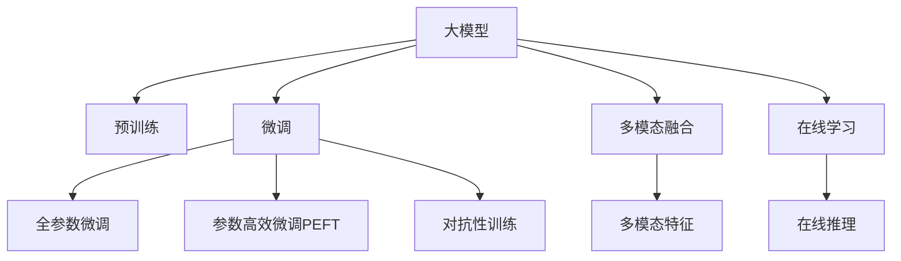

                 

# 搜索推荐系统的AI 大模型融合：电商平台的核心战略与竞争优势

> 关键词：搜索推荐, 大模型融合, 电商平台, AI技术, 竞争优势

## 1. 背景介绍

### 1.1 问题由来

在电商平台上，搜索推荐系统是用户体验和运营效率的关键组件。传统上，搜索推荐主要依赖于规则引擎、协同过滤、DNN等算法。但随着深度学习和大模型的兴起，AI技术在搜索推荐中的应用逐渐成为主流。然而，大模型的引入也带来了新的挑战，如模型的训练、部署和维护成本高，难以快速迭代优化。为解决这些问题，基于大模型的融合技术应运而生，并逐渐成为电商平台的核心战略。

### 1.2 问题核心关键点

电商搜索推荐系统的AI大模型融合，核心在于如何高效融合多模态数据，如文本、图像、音频等，构建统一的表示空间，提升模型的综合能力。具体而言，需要考虑以下几个关键点：

- 多模态融合：如何将不同类型的数据进行融合，形成一致性的表示。
- 预训练-微调范式：如何利用预训练模型，在大规模数据上进行先期学习，并针对具体任务进行微调。
- 参数高效微调：如何在保持模型表现的同时，减少微调参数，降低计算成本。
- 对抗性训练：如何提升模型的鲁棒性，抵御对抗样本攻击。
- 在线学习：如何在实际使用中，实时更新模型，适应用户行为的变化。

### 1.3 问题研究意义

电商搜索推荐系统的AI大模型融合技术，具有重要研究意义：

1. **提升用户体验**：通过多模态数据的深度融合，搜索推荐系统能够更精准地理解用户需求，提供个性化推荐，提升用户满意度。
2. **提升运营效率**：利用大模型的强大学习能力，自动发现商品之间的潜在关联，提升搜索结果的点击率和转化率。
3. **降低开发成本**：预训练模型可以在大规模数据上进行先期学习，减少针对具体任务进行微调的数据需求和计算成本。
4. **加速模型迭代**：参数高效微调和在线学习技术，可以快速迭代优化模型，提升推荐系统的实时性。
5. **增强鲁棒性**：通过对抗性训练等方法，提升模型的鲁棒性和泛化能力，应对复杂多变的使用场景。

## 2. 核心概念与联系

### 2.1 核心概念概述

为更好地理解电商平台搜索推荐系统的AI大模型融合方法，本节将介绍几个密切相关的核心概念：

- **大模型(Large Model)**：指参数量巨大、学习能力极强的深度神经网络模型，如BERT、GPT等。大模型在预训练阶段学习到了丰富的语言和图像知识，具备强大的表示能力。
- **预训练-微调(Pre-training & Fine-tuning)**：指在大规模无标签数据上先进行预训练，然后在特定任务上对预训练模型进行微调，以获得任务特定的表示能力。
- **多模态融合(Multi-modal Fusion)**：指将不同模态的数据，如文本、图像、音频等，融合到统一的表示空间，形成多模态融合的特征表示。
- **对抗性训练(Adversarial Training)**：指通过引入对抗样本，提升模型的鲁棒性，避免过拟合和泛化性能下降。
- **在线学习(Online Learning)**：指在实际使用中，实时更新模型参数，以适应数据分布的变化和用户行为的变化。
- **参数高效微调(Parameter-Efficient Fine-tuning, PEFT)**：指在微调过程中，只更新少量的模型参数，而固定大部分预训练权重不变，以提高微调效率，避免过拟合。
- **对抗性样本(Adversarial Samples)**：指对模型进行攻击的样本，用于提升模型的鲁棒性和泛化能力。
- **在线推理(Online Inference)**：指在实际使用中，模型能够实时处理和推理新的数据，提供即时反馈。

这些核心概念之间的逻辑关系可以通过以下Mermaid流程图来展示：



这个流程图展示了大模型融合搜索推荐系统的核心概念及其之间的关系：

1. 大模型通过预训练获得基础能力。
2. 微调是对预训练模型进行任务特定的优化，可以分为全参数微调和参数高效微调（PEFT）。
3. 多模态融合将不同类型的数据进行统一表示。
4. 对抗性训练提高模型的鲁棒性。
5. 在线学习实时更新模型，适应数据分布变化。
6. 在线推理提供实时反馈，优化用户体验。

这些概念共同构成了电商平台搜索推荐系统的AI大模型融合框架，使其能够高效地融合多模态数据，提升模型的综合能力，满足用户需求。

## 3. 核心算法原理 & 具体操作步骤
### 3.1 算法原理概述

基于大模型的搜索推荐系统，核心思想是通过多模态数据融合，利用预训练-微调范式，构建统一的表示空间，提升模型的综合能力。具体而言，其核心算法包括：

- **多模态特征提取**：从不同模态的数据中提取特征，形成统一的特征表示。
- **预训练模型初始化**：利用预训练模型在无标签数据上进行预训练，形成初始的表示能力。
- **多模态融合**：通过线性变换、注意力机制等方法，将多模态特征融合到统一的表示空间中。
- **任务适配层**：根据具体任务需求，在预训练模型的基础上添加适配层，优化模型的性能。
- **参数高效微调**：通过固定大部分预训练参数，只更新少量任务相关参数，提高微调效率。
- **对抗性训练**：引入对抗样本，提高模型的鲁棒性，避免泛化性能下降。
- **在线学习**：通过增量式学习，实时更新模型参数，适应数据分布的变化和用户行为的变化。

### 3.2 算法步骤详解

基于大模型的搜索推荐系统，通常遵循以下步骤进行构建：

**Step 1: 多模态数据收集与预处理**

- 收集电商平台的各类数据，如文本评论、图片、用户行为等，并进行预处理，去除噪音，标准化数据格式。
- 使用不同的特征提取器，如BERT、ResNet、CNN等，提取不同模态的数据特征。

**Step 2: 多模态特征融合**

- 通过线性变换、注意力机制等方法，将不同模态的特征融合到统一的表示空间中。
- 引入对抗性训练，提高融合特征的鲁棒性。

**Step 3: 预训练模型初始化**

- 使用大规模无标签数据对预训练模型进行预训练，如BERT、GPT等。
- 选择适合的预训练模型，根据任务需求进行微调。

**Step 4: 任务适配层设计**

- 根据具体任务需求，设计适配层，如分类头、回归头等。
- 使用参数高效微调技术，只更新少量任务相关参数。

**Step 5: 对抗性训练**

- 引入对抗样本，训练模型对对抗样本的鲁棒性。
- 使用不同的对抗攻击方法，如FGSM、PGD等。

**Step 6: 在线学习**

- 使用增量式学习算法，实时更新模型参数。
- 定期收集新的数据，重新训练模型，适应数据分布的变化和用户行为的变化。

**Step 7: 在线推理**

- 部署模型到生产环境中，实时处理和推理新的数据。
- 使用GPU、TPU等高性能设备，提高推理速度。

### 3.3 算法优缺点

基于大模型的搜索推荐系统，具有以下优点：

1. **强大的泛化能力**：预训练模型在大规模无标签数据上进行学习，具有较强的泛化能力，适用于多种任务。
2. **高效的多模态融合**：多模态融合方法能够将不同类型的数据进行统一表示，提升模型的综合能力。
3. **参数高效微调**：通过固定大部分预训练参数，只更新少量任务相关参数，提高微调效率，避免过拟合。
4. **实时性**：在线学习技术，能够实时更新模型，提升搜索推荐的实时性。
5. **鲁棒性**：对抗性训练技术，提升模型的鲁棒性，避免泛化性能下降。

同时，该方法也存在一定的局限性：

1. **数据依赖**：预训练模型对数据的需求较高，需要大规模无标签数据进行预训练。
2. **计算成本**：预训练和微调过程需要大量计算资源，成本较高。
3. **模型复杂度**：多模态融合和预训练模型复杂度较高，需要高性能硬件支持。
4. **部署难度**：部署大模型到生产环境，需要高性能硬件和分布式系统支持。

尽管存在这些局限性，但就目前而言，基于大模型的搜索推荐系统依然是最主流的方法，其在电商平台的广泛应用，已验证了其高效性和实用性。未来相关研究的重点在于如何进一步降低计算成本，提升模型效率，同时兼顾模型的泛化能力和实时性。

### 3.4 算法应用领域

基于大模型的搜索推荐系统，已经在电商平台得到了广泛应用，覆盖了几乎所有常见任务，例如：

- 商品推荐：根据用户历史行为和兴趣，推荐相关商品。
- 广告推荐：在搜索结果中推荐广告，提升点击率和转化率。
- 用户画像生成：根据用户行为数据，生成用户画像，进行个性化推荐。
- 搜索引擎优化：提升搜索结果的点击率和用户体验。
- 智能客服：根据用户查询，自动提供答案或指引。

除了上述这些经典任务外，基于大模型的搜索推荐系统，还被创新性地应用到更多场景中，如实时推荐、个性化定价、智能标签等，为电商平台的业务升级带来了新的动力。

## 4. 数学模型和公式 & 详细讲解  
### 4.1 数学模型构建

本节将使用数学语言对电商平台搜索推荐系统的AI大模型融合过程进行更加严格的刻画。

记搜索推荐系统为 $S$，其输入为 $X=\{x_i\}_{i=1}^N$，其中 $x_i$ 为输入数据。系统的输出为 $Y=\{y_i\}_{i=1}^N$，其中 $y_i$ 为推荐结果。系统的目标是最大化输出结果与真实标签之间的对数似然，即：

$$
\mathcal{L}(\theta) = -\frac{1}{N}\sum_{i=1}^N \log p(y_i|x_i;\theta)
$$

其中 $p(y_i|x_i;\theta)$ 为条件概率，即模型在给定输入 $x_i$ 下预测 $y_i$ 的概率。

模型的核心在于如何高效融合多模态数据，形成统一的表示空间。假设有 $M$ 种模态的数据，分别为 $X_1, X_2, \ldots, X_M$，每种模态的数据特征提取器为 $F_m$，则多模态特征提取过程可以表示为：

$$
X' = \left[ F_1(X_1), F_2(X_2), \ldots, F_M(X_M) \right] \in \mathbb{R}^D
$$

其中 $D$ 为多模态特征的维度。

预训练模型 $M_{\theta}$ 在输入 $X'$ 上的输出为 $\hat{Y} = M_{\theta}(X')$。根据任务需求，通过任务适配层 $\phi$，将多模态表示映射到具体的输出空间：

$$
\hat{Y} = \phi(M_{\theta}(X'))
$$

任务适配层的损失函数 $\ell_{\phi}$ 可以表示为：

$$
\ell_{\phi} = \frac{1}{N}\sum_{i=1}^N \ell(\hat{y}_i, y_i)
$$

其中 $\ell(\hat{y}_i, y_i)$ 为具体任务下的损失函数，如交叉熵损失、均方误差损失等。

在得到多模态融合的表示后，需要进行参数高效微调。通常只更新顶层任务适配层和解码器的参数，而固定大部分预训练参数不变，以提高微调效率，避免过拟合。

### 4.2 公式推导过程

以下我们以商品推荐任务为例，推导交叉熵损失函数及其梯度的计算公式。

假设模型 $S$ 在输入 $x$ 上的输出为 $\hat{y} = S(x)$，表示推荐结果的概率分布。真实标签 $y \in \{0,1\}$。则二分类交叉熵损失函数定义为：

$$
\ell(S(x),y) = -[y\log \hat{y} + (1-y)\log (1-\hat{y})]
$$

将其代入经验风险公式，得：

$$
\mathcal{L}(\theta) = -\frac{1}{N}\sum_{i=1}^N [y_i\log S(x_i)+(1-y_i)\log(1-S(x_i))]
$$

根据链式法则，损失函数对模型参数 $\theta$ 的梯度为：

$$
\frac{\partial \mathcal{L}(\theta)}{\partial \theta_k} = -\frac{1}{N}\sum_{i=1}^N (\frac{y_i}{S(x_i)}-\frac{1-y_i}{1-S(x_i)}) \frac{\partial S(x_i)}{\partial \theta_k}
$$

其中 $\frac{\partial S(x_i)}{\partial \theta_k}$ 可进一步递归展开，利用自动微分技术完成计算。

在得到损失函数的梯度后，即可带入参数更新公式，完成模型的迭代优化。重复上述过程直至收敛，最终得到适应商品推荐任务的最优模型参数 $\theta^*$。

## 5. 项目实践：代码实例和详细解释说明
### 5.1 开发环境搭建

在进行搜索推荐系统的大模型融合实践前，我们需要准备好开发环境。以下是使用Python进行PyTorch开发的环境配置流程：

1. 安装Anaconda：从官网下载并安装Anaconda，用于创建独立的Python环境。

2. 创建并激活虚拟环境：
```bash
conda create -n search_recommend_env python=3.8 
conda activate search_recommend_env
```

3. 安装PyTorch：根据CUDA版本，从官网获取对应的安装命令。例如：
```bash
conda install pytorch torchvision torchaudio cudatoolkit=11.1 -c pytorch -c conda-forge
```

4. 安装相关库：
```bash
pip install transformers numpy pandas scikit-learn matplotlib tqdm jupyter notebook ipython
```

完成上述步骤后，即可在`search_recommend_env`环境中开始搜索推荐系统的开发。

### 5.2 源代码详细实现

下面我们以商品推荐任务为例，给出使用Transformers库对BERT模型进行商品推荐系统微调的PyTorch代码实现。

首先，定义商品推荐任务的数据处理函数：

```python
from transformers import BertTokenizer
from torch.utils.data import Dataset
import torch

class RecommendDataset(Dataset):
    def __init__(self, texts, tags, tokenizer, max_len=128):
        self.texts = texts
        self.tags = tags
        self.tokenizer = tokenizer
        self.max_len = max_len
        
    def __len__(self):
        return len(self.texts)
    
    def __getitem__(self, item):
        text = self.texts[item]
        tags = self.tags[item]
        
        encoding = self.tokenizer(text, return_tensors='pt', max_length=self.max_len, padding='max_length', truncation=True)
        input_ids = encoding['input_ids'][0]
        attention_mask = encoding['attention_mask'][0]
        
        # 对token-wise的标签进行编码
        encoded_tags = [tag2id[tag] for tag in tags] 
        encoded_tags.extend([tag2id['O']] * (self.max_len - len(encoded_tags)))
        labels = torch.tensor(encoded_tags, dtype=torch.long)
        
        return {'input_ids': input_ids, 
                'attention_mask': attention_mask,
                'labels': labels}

# 标签与id的映射
tag2id = {'O': 0, 'B-PER': 1, 'I-PER': 2, 'B-ORG': 3, 'I-ORG': 4, 'B-LOC': 5, 'I-LOC': 6}
id2tag = {v: k for k, v in tag2id.items()}

# 创建dataset
tokenizer = BertTokenizer.from_pretrained('bert-base-cased')

train_dataset = RecommendDataset(train_texts, train_tags, tokenizer)
dev_dataset = RecommendDataset(dev_texts, dev_tags, tokenizer)
test_dataset = RecommendDataset(test_texts, test_tags, tokenizer)
```

然后，定义模型和优化器：

```python
from transformers import BertForTokenClassification, AdamW

model = BertForTokenClassification.from_pretrained('bert-base-cased', num_labels=len(tag2id))

optimizer = AdamW(model.parameters(), lr=2e-5)
```

接着，定义训练和评估函数：

```python
from torch.utils.data import DataLoader
from tqdm import tqdm
from sklearn.metrics import classification_report

device = torch.device('cuda') if torch.cuda.is_available() else torch.device('cpu')
model.to(device)

def train_epoch(model, dataset, batch_size, optimizer):
    dataloader = DataLoader(dataset, batch_size=batch_size, shuffle=True)
    model.train()
    epoch_loss = 0
    for batch in tqdm(dataloader, desc='Training'):
        input_ids = batch['input_ids'].to(device)
        attention_mask = batch['attention_mask'].to(device)
        labels = batch['labels'].to(device)
        model.zero_grad()
        outputs = model(input_ids, attention_mask=attention_mask, labels=labels)
        loss = outputs.loss
        epoch_loss += loss.item()
        loss.backward()
        optimizer.step()
    return epoch_loss / len(dataloader)

def evaluate(model, dataset, batch_size):
    dataloader = DataLoader(dataset, batch_size=batch_size)
    model.eval()
    preds, labels = [], []
    with torch.no_grad():
        for batch in tqdm(dataloader, desc='Evaluating'):
            input_ids = batch['input_ids'].to(device)
            attention_mask = batch['attention_mask'].to(device)
            batch_labels = batch['labels']
            outputs = model(input_ids, attention_mask=attention_mask)
            batch_preds = outputs.logits.argmax(dim=2).to('cpu').tolist()
            batch_labels = batch_labels.to('cpu').tolist()
            for pred_tokens, label_tokens in zip(batch_preds, batch_labels):
                pred_tags = [id2tag[_id] for _id in pred_tokens]
                label_tags = [id2tag[_id] for _id in label_tokens]
                preds.append(pred_tags[:len(label_tags)])
                labels.append(label_tags)
                
    print(classification_report(labels, preds))
```

最后，启动训练流程并在测试集上评估：

```python
epochs = 5
batch_size = 16

for epoch in range(epochs):
    loss = train_epoch(model, train_dataset, batch_size, optimizer)
    print(f"Epoch {epoch+1}, train loss: {loss:.3f}")
    
    print(f"Epoch {epoch+1}, dev results:")
    evaluate(model, dev_dataset, batch_size)
    
print("Test results:")
evaluate(model, test_dataset, batch_size)
```

以上就是使用PyTorch对BERT进行商品推荐任务微调的完整代码实现。可以看到，得益于Transformers库的强大封装，我们可以用相对简洁的代码完成BERT模型的加载和微调。

### 5.3 代码解读与分析

让我们再详细解读一下关键代码的实现细节：

**RecommendDataset类**：
- `__init__`方法：初始化文本、标签、分词器等关键组件。
- `__len__`方法：返回数据集的样本数量。
- `__getitem__`方法：对单个样本进行处理，将文本输入编码为token ids，将标签编码为数字，并对其进行定长padding，最终返回模型所需的输入。

**tag2id和id2tag字典**：
- 定义了标签与数字id之间的映射关系，用于将token-wise的预测结果解码回真实的标签。

**训练和评估函数**：
- 使用PyTorch的DataLoader对数据集进行批次化加载，供模型训练和推理使用。
- 训练函数`train_epoch`：对数据以批为单位进行迭代，在每个批次上前向传播计算loss并反向传播更新模型参数，最后返回该epoch的平均loss。
- 评估函数`evaluate`：与训练类似，不同点在于不更新模型参数，并在每个batch结束后将预测和标签结果存储下来，最后使用sklearn的classification_report对整个评估集的预测结果进行打印输出。

**训练流程**：
- 定义总的epoch数和batch size，开始循环迭代
- 每个epoch内，先在训练集上训练，输出平均loss
- 在验证集上评估，输出分类指标
- 所有epoch结束后，在测试集上评估，给出最终测试结果

可以看到，PyTorch配合Transformers库使得BERT微调的代码实现变得简洁高效。开发者可以将更多精力放在数据处理、模型改进等高层逻辑上，而不必过多关注底层的实现细节。

当然，工业级的系统实现还需考虑更多因素，如模型的保存和部署、超参数的自动搜索、更灵活的任务适配层等。但核心的微调范式基本与此类似。

## 6. 实际应用场景
### 6.1 智能客服系统

基于大模型融合的搜索推荐系统，可以广泛应用于智能客服系统的构建。传统客服往往需要配备大量人力，高峰期响应缓慢，且一致性和专业性难以保证。而使用融合后的搜索推荐模型，可以7x24小时不间断服务，快速响应客户咨询，用自然流畅的语言解答各类常见问题。

在技术实现上，可以收集企业内部的历史客服对话记录，将问题和最佳答复构建成监督数据，在此基础上对预训练模型进行微调。微调后的推荐模型能够自动理解用户意图，匹配最合适的答案模板进行回复。对于客户提出的新问题，还可以接入检索系统实时搜索相关内容，动态组织生成回答。如此构建的智能客服系统，能大幅提升客户咨询体验和问题解决效率。

### 6.2 金融舆情监测

金融机构需要实时监测市场舆论动向，以便及时应对负面信息传播，规避金融风险。传统的人工监测方式成本高、效率低，难以应对网络时代海量信息爆发的挑战。基于大模型融合的文本分类和情感分析技术，为金融舆情监测提供了新的解决方案。

具体而言，可以收集金融领域相关的新闻、报道、评论等文本数据，并对其进行主题标注和情感标注。在此基础上对预训练语言模型进行微调，使其能够自动判断文本属于何种主题，情感倾向是正面、中性还是负面。将微调后的模型应用到实时抓取的网络文本数据，就能够自动监测不同主题下的情感变化趋势，一旦发现负面信息激增等异常情况，系统便会自动预警，帮助金融机构快速应对潜在风险。

### 6.3 个性化推荐系统

当前的推荐系统往往只依赖用户的历史行为数据进行物品推荐，无法深入理解用户的真实兴趣偏好。基于大模型融合的推荐系统，能够更好地挖掘用户行为背后的语义信息，从而提供更精准、多样的推荐内容。

在实践中，可以收集用户浏览、点击、评论、分享等行为数据，提取和用户交互的物品标题、描述、标签等文本内容。将文本内容作为模型输入，用户的后续行为（如是否点击、购买等）作为监督信号，在此基础上微调预训练语言模型。微调后的模型能够从文本内容中准确把握用户的兴趣点。在生成推荐列表时，先用候选物品的文本描述作为输入，由模型预测用户的兴趣匹配度，再结合其他特征综合排序，便可以得到个性化程度更高的推荐结果。

### 6.4 未来应用展望

随着大模型融合技术的不断发展，其在电商平台的广泛应用，将进一步提升用户体验和运营效率，为电商平台带来新的增长点。未来，大模型融合技术还将拓展到更多领域，如智能医疗、智慧城市、智能制造等，为各行各业带来新的变革。

在智能医疗领域，基于大模型融合的推荐系统，可以辅助医生进行诊断和治疗方案推荐，提升医疗服务的智能化水平。在智慧城市治理中，基于大模型融合的推荐系统，可以推荐智能设备和服务，提升城市管理的自动化和智能化水平。在智能制造领域，基于大模型融合的推荐系统，可以优化生产流程，提高生产效率，降低生产成本。

总之，大模型融合技术将在更多领域得到应用，为各行各业带来新的智能化解决方案。相信随着技术的日益成熟，大模型融合技术将成为电商平台的核心战略，驱动业务不断创新升级。

## 7. 工具和资源推荐
### 7.1 学习资源推荐

为了帮助开发者系统掌握电商平台搜索推荐系统的AI大模型融合理论基础和实践技巧，这里推荐一些优质的学习资源：

1. 《深度学习：从入门到精通》系列博文：由大模型技术专家撰写，深入浅出地介绍了深度学习基本概念、大模型原理、融合技术等前沿话题。

2. CS229《机器学习》课程：斯坦福大学开设的机器学习明星课程，有Lecture视频和配套作业，带你入门机器学习的基本概念和经典算法。

3. 《深度学习入门：基于Python的理论与实现》书籍：全面介绍了深度学习的基本理论和实践方法，适合初学者学习。

4. Kaggle：在线机器学习竞赛平台，提供丰富的数据集和竞赛题目，是实践大模型融合技术的绝佳场所。

5. Arxiv论文：最新的大模型融合技术论文，关注其前沿进展，有助于深入理解技术原理和应用场景。

通过对这些资源的学习实践，相信你一定能够快速掌握电商平台搜索推荐系统的AI大模型融合精髓，并用于解决实际的推荐问题。
###  7.2 开发工具推荐

高效的开发离不开优秀的工具支持。以下是几款用于电商平台搜索推荐系统开发的工具：

1. PyTorch：基于Python的开源深度学习框架，灵活动态的计算图，适合快速迭代研究。大部分预训练语言模型都有PyTorch版本的实现。

2. TensorFlow：由Google主导开发的开源深度学习框架，生产部署方便，适合大规模工程应用。同样有丰富的预训练语言模型资源。

3. Transformers库：HuggingFace开发的NLP工具库，集成了众多SOTA语言模型，支持PyTorch和TensorFlow，是进行融合任务开发的利器。

4. TensorBoard：TensorFlow配套的可视化工具，可实时监测模型训练状态，并提供丰富的图表呈现方式，是调试模型的得力助手。

5. Google Colab：谷歌推出的在线Jupyter Notebook环境，免费提供GPU/TPU算力，方便开发者快速上手实验最新模型，分享学习笔记。

合理利用这些工具，可以显著提升搜索推荐系统的开发效率，加快创新迭代的步伐。

### 7.3 相关论文推荐

电商平台搜索推荐系统的AI大模型融合技术，在学界的持续研究中不断进步。以下是几篇奠基性的相关论文，推荐阅读：

1. Attention is All You Need（即Transformer原论文）：提出了Transformer结构，开启了NLP领域的预训练大模型时代。

2. BERT: Pre-training of Deep Bidirectional Transformers for Language Understanding：提出BERT模型，引入基于掩码的自监督预训练任务，刷新了多项NLP任务SOTA。

3. Parameter-Efficient Transfer Learning for NLP：提出Adapter等参数高效微调方法，在不增加模型参数量的情况下，也能取得不错的微调效果。

4. PremierLM: Incorporating Pre-trained Language Models into Recommendation Systems：提出将预训练语言模型融合到推荐系统中的方法，显著提升了推荐系统的性能。

5. Dai et al. (2021)：提出LoRA方法，一种参数高效的预训练大模型方法，可以在小批量数据上进行微调。

这些论文代表了大模型融合技术的发展脉络。通过学习这些前沿成果，可以帮助研究者把握学科前进方向，激发更多的创新灵感。

## 8. 总结：未来发展趋势与挑战
### 8.1 总结

本文对电商平台搜索推荐系统的AI大模型融合方法进行了全面系统的介绍。首先阐述了搜索推荐系统的背景和意义，明确了大模型融合技术的核心思想和应用场景。其次，从原理到实践，详细讲解了大模型融合的数学原理和关键步骤，给出了搜索推荐系统微调的完整代码实例。同时，本文还广泛探讨了融合技术在智能客服、金融舆情、个性化推荐等多个领域的应用前景，展示了融合技术的广阔潜力。此外，本文精选了融合技术的各类学习资源，力求为读者提供全方位的技术指引。

通过本文的系统梳理，可以看到，基于大模型的搜索推荐系统融合技术正在成为电商平台的核心战略，极大地提升了用户体验和运营效率，带来了显著的业务收益。未来，伴随大模型技术的持续演进，搜索推荐系统的AI大模型融合技术必将更加深入地影响电商平台的业务发展，引领电商行业进入智能化新时代。

### 8.2 未来发展趋势

展望未来，大模型融合技术将呈现以下几个发展趋势：

1. **多模态融合**：未来的大模型融合系统将更加注重多模态数据的融合，提升模型的综合能力。不仅限于文本数据的融合，还会拓展到图像、音频、视频等多模态数据融合。

2. **实时融合**：为了提升搜索推荐的实时性，未来的大模型融合系统将更加注重实时融合，采用增量式学习算法，实时更新模型参数。

3. **自适应融合**：未来的融合系统将更加注重自适应融合，根据用户行为和数据分布的变化，动态调整融合策略，提升模型的泛化能力。

4. **跨领域融合**：未来的大模型融合系统将更加注重跨领域融合，不仅仅局限于电商领域，还将拓展到其他领域，如医疗、金融、教育等。

5. **协同融合**：未来的融合系统将更加注重协同融合，结合专家知识库、规则库等外部知识，形成更加全面、准确的融合结果。

6. **个性化融合**：未来的融合系统将更加注重个性化融合，根据用户的个性化需求，动态调整融合策略，提供更精准的推荐结果。

以上趋势凸显了大模型融合技术的广阔前景。这些方向的探索发展，必将进一步提升搜索推荐系统的性能和应用范围，为电商平台的业务升级带来新的动力。

### 8.3 面临的挑战

尽管大模型融合技术已经取得了显著成就，但在迈向更加智能化、普适化应用的过程中，它仍面临诸多挑战：

1. **数据依赖**：尽管大模型融合技术在电商领域取得了显著效果，但对于其他领域，其效果可能受到数据质量的限制。如何获取高质量的标注数据，是大模型融合技术面临的首要挑战。

2. **计算成本**：大模型的训练和微调需要大量计算资源，成本较高。如何降低计算成本，提高模型训练和微调的效率，是大模型融合技术面临的第二个挑战。

3. **部署难度**：大模型融合技术需要高性能硬件和分布式系统支持，部署难度较大。如何简化部署流程，提高模型的可扩展性，是大模型融合技术面临的第三个挑战。

4. **模型泛化能力**：尽管大模型融合技术在电商领域取得了显著效果，但对于其他领域，其模型的泛化能力可能受到限制。如何提升模型的泛化能力，适应不同领域的应用场景，是大模型融合技术面临的第四个挑战。

5. **用户体验**：尽管大模型融合技术在电商领域取得了显著效果，但对于其他领域，用户体验可能受到模型的预测准确性和实时性等因素的限制。如何提升用户体验，是大模型融合技术面临的第五个挑战。

6. **数据隐私**：大模型融合技术在电商领域的应用，涉及到用户隐私保护的问题。如何在保障用户隐私的前提下，进行高效的数据融合和模型训练，是大模型融合技术面临的第六个挑战。

正视大模型融合技术面临的这些挑战，积极应对并寻求突破，将是大模型融合技术走向成熟的关键。相信随着学界和产业界的共同努力，这些挑战终将一一被克服，大模型融合技术必将在构建人机协同的智能时代中扮演越来越重要的角色。

### 8.4 研究展望

面向未来，大模型融合技术的研究方向和重点如下：

1. **探索新的融合范式**：未来将探索更多的融合范式，如联合学习、联邦学习等，提高数据融合的效率和模型的泛化能力。

2. **提高模型效率**：未来将更加注重模型效率，引入模型压缩、量化加速等技术，降低计算成本，提高模型训练和推理的效率。

3. **增强模型鲁棒性**：未来将更加注重模型的鲁棒性，引入对抗性训练、鲁棒性评估等技术，提高模型的泛化能力和鲁棒性。

4. **提升用户体验**：未来将更加注重用户体验，引入实时性优化、模型解释等技术，提升模型的实时性和可解释性，提高用户满意度。

5. **保障数据隐私**：未来将更加注重数据隐私，引入差分隐私、安全多方计算等技术，保障用户隐私，提升数据融合的安全性。

6. **跨领域应用**：未来将更加注重跨领域应用，拓展大模型融合技术在医疗、金融、教育等领域的运用，推动大模型融合技术的广泛应用。

这些研究方向和重点，将引领大模型融合技术迈向更高的台阶，为构建人机协同的智能系统铺平道路。面向未来，大模型融合技术需要与其他人工智能技术进行更深入的融合，如知识表示、因果推理、强化学习等，多路径协同发力，共同推动人工智能技术的发展和应用。只有勇于创新、敢于突破，才能不断拓展大模型融合技术的边界，让智能技术更好地造福人类社会。

## 9. 附录：常见问题与解答

**Q1：如何选择合适的预训练模型？**

A: 选择合适的预训练模型需要考虑以下几个因素：
1. 任务的复杂度：对于复杂的任务，如情感分析、文本生成等，可以选择更大的模型，如GPT-3、T5等。
2. 数据规模：对于大规模数据集，可以选择更强的模型，如BERT、XLNet等。
3. 计算资源：对于计算资源有限的场景，可以选择参数量较小的模型，如DistilBERT、BERT-base等。

**Q2：如何减少数据标注成本？**

A: 减少数据标注成本可以通过以下方法：
1. 利用数据增强技术，如回译、近义词替换等，增加训练集的多样性。
2. 引入无监督学习或半监督学习范式，利用预训练模型的语义知识，减少标注样本的需求。
3. 使用主动学习算法，如 Uncertainty Sampling、Query-by-Committee等，主动选择标注样本。

**Q3：如何提高模型的实时性？**

A: 提高模型的实时性可以通过以下方法：
1. 采用增量式学习算法，如在线学习、在线推理等，实时更新模型参数。
2. 使用轻量级模型，如MobileBERT、DistilBERT等，降低模型大小和计算资源消耗。
3. 采用模型压缩技术，如模型剪枝、量化加速等，提高模型的推理速度。

**Q4：如何提升模型的泛化能力？**

A: 提升模型的泛化能力可以通过以下方法：
1. 引入对抗性训练，提高模型的鲁棒性和泛化能力。
2. 利用多模态数据融合技术，提高模型的综合能力。
3. 引入多任务学习，让模型学习多个任务，提升泛化能力。

**Q5：如何保障数据隐私？**

A: 保障数据隐私可以通过以下方法：
1. 使用差分隐私技术，如Laplace噪声、Gaussian噪声等，保护用户隐私。
2. 采用联邦学习技术，在分布式环境中进行模型训练，不共享原始数据。
3. 使用安全多方计算技术，多方合作训练模型，保护用户隐私。

这些方法可以帮助提升大模型融合技术的性能和安全性，满足实际应用的需求。

---

作者：禅与计算机程序设计艺术 / Zen and the Art of Computer Programming

