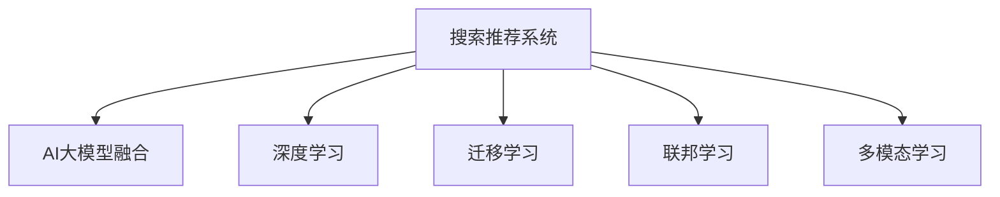

                 

# 搜索推荐系统的AI 大模型融合：电商平台的核心竞争优势与可持续发展

> 关键词：搜索推荐系统, AI 大模型融合, 电商平台, 核心竞争优势, 可持续发展

## 1. 背景介绍

### 1.1 问题由来
随着互联网时代的到来，电商平台作为数字经济的重要载体，逐渐成为各行各业抢夺用户流量的关键战场。然而，如何更好地吸引和留住用户，提升用户体验，并最终转化为商业价值，成为电商平台面临的重大挑战。搜索推荐系统作为电商平台的核心组件，其优劣直接影响了平台的运营效率和用户满意度。

为了应对愈发激烈的市场竞争，各大电商平台纷纷在搜索推荐算法上投入大量资源。从早期基于规则和特征工程的推荐算法，到近年来的深度学习模型，尤其是AI大模型的出现，搜索推荐系统不断取得突破性进展。AI大模型，如BERT、GPT-3等，通过大规模无标签数据预训练，具备强大的语言理解和生成能力，能够进一步提升搜索推荐系统的智能化水平，帮助电商平台在激烈的市场竞争中脱颖而出。

### 1.2 问题核心关键点
大模型在搜索推荐系统中的应用，核心在于如何高效融合大模型与业务场景，实现搜索推荐效果的最大化。具体而言，主要包括：

- **模型适配性**：如何将预训练模型高效适配于电商平台的搜索推荐任务，提升个性化推荐的精准度。
- **特征工程**：如何利用大模型的多模态特性，结合用户行为数据、商品信息等特征，构建更全面的用户画像和商品信息表示。
- **计算效率**：如何在保证推荐效果的同时，优化模型计算效率，满足大规模实时推荐的需求。
- **模型鲁棒性**：如何设计鲁棒性更强的推荐算法，避免因模型偏见或异常数据导致的推荐偏差。
- **用户体验**：如何设计更好的用户交互界面和推荐策略，提升用户满意度，增加用户粘性。

本文将从核心概念、算法原理、具体实现、应用场景等方面，全面探讨大模型在搜索推荐系统中的应用，以及电商平台如何通过AI大模型融合，构建具有核心竞争力的搜索推荐系统，实现可持续发展。

## 2. 核心概念与联系

### 2.1 核心概念概述

为了更好地理解大模型在搜索推荐系统中的应用，本节将介绍几个关键概念：

- **搜索推荐系统**：利用自然语言处理和机器学习技术，为用户提供个性化的商品推荐服务。其核心在于理解用户的查询意图，并根据意图推荐相关商品或内容。
- **AI大模型**：通过大规模无标签数据预训练获得强大通用表示能力的深度学习模型，如BERT、GPT-3等。这些模型能够处理复杂的自然语言任务，适用于电商平台的搜索推荐等业务场景。
- **深度学习**：一种基于神经网络的技术，通过多层网络结构学习输入数据的特征表示，并用于分类、预测等任务。深度学习在搜索推荐系统中广泛应用。
- **迁移学习**：利用已有的大规模预训练模型，在特定任务上进行微调，以提升模型在该任务上的性能。迁移学习在大模型融合中尤为重要。
- **联邦学习**：一种分布式机器学习技术，多台设备各自持有部分数据和模型，通过模型参数的分布式更新，实现模型的全局优化。联邦学习在隐私保护和数据安全性方面具有优势。
- **多模态学习**：结合文本、图像、语音等多种数据类型，构建多模态融合模型，提升推荐系统的综合能力。

这些核心概念之间的逻辑关系可以通过以下Mermaid流程图来展示：



这个流程图展示了搜索推荐系统与大模型融合的关系，以及涉及的关键技术：

1. 搜索推荐系统作为大模型融合的载体，利用深度学习等技术，构建推荐模型。
2. 深度学习提供强大的模型训练能力，有助于搜索推荐系统的构建。
3. 迁移学习使得大模型能够快速适应电商平台的特定任务，提升推荐效果。
4. 联邦学习在保证数据隐私和安全性的同时，实现全局模型的优化。
5. 多模态学习结合多源数据，提升推荐系统的综合能力。

## 3. 核心算法原理 & 具体操作步骤

### 3.1 算法原理概述

大模型在搜索推荐系统中的应用，本质上是利用深度学习的迁移学习能力，将预训练模型在通用语言任务上的知识，迁移到具体的电商搜索推荐任务上，以提升推荐系统的性能。具体而言，包括以下几个步骤：

1. **数据预处理**：收集并清洗电商平台的用户行为数据、商品信息等，构建电商推荐的数据集。
2. **模型适配**：选择合适的预训练模型，通过迁移学习或微调等技术，使其适应电商平台的搜索推荐任务。
3. **特征工程**：设计多模态特征表示，将用户行为数据、商品信息等融入大模型中，构建更丰富的用户画像和商品信息表示。
4. **模型训练**：在电商推荐数据集上训练模型，通过优化损失函数，调整模型参数，提升推荐效果。
5. **推荐推理**：使用训练好的模型，对用户输入的查询进行推理，预测并推荐相关商品或内容。

### 3.2 算法步骤详解

以下是大模型在搜索推荐系统中应用的详细步骤：

**Step 1: 数据预处理**

1. **数据收集**：从电商平台的用户行为数据、商品信息等来源收集数据，确保数据的质量和多样性。
2. **数据清洗**：对收集到的数据进行清洗，去除噪声和异常值，确保数据可用性。
3. **数据划分**：将数据划分为训练集、验证集和测试集，确保数据集的分布一致性。

**Step 2: 模型适配**

1. **选择预训练模型**：根据任务需求，选择合适的预训练模型，如BERT、GPT-3等。
2. **迁移学习**：将预训练模型在通用语言任务上的表示，迁移到电商平台的搜索推荐任务上。
3. **微调**：根据电商平台的特定需求，对预训练模型进行微调，以提升模型在该任务上的性能。

**Step 3: 特征工程**

1. **特征提取**：利用深度学习技术，将用户行为数据、商品信息等提取为高维向量表示。
2. **特征融合**：将提取的特征进行融合，构建更丰富的用户画像和商品信息表示。
3. **特征扩展**：引入多模态特征，如商品图片、用户评价等，丰富搜索推荐系统的输入。

**Step 4: 模型训练**

1. **损失函数设计**：根据电商平台的推荐任务，设计合适的损失函数，如交叉熵损失、均方误差损失等。
2. **优化器选择**：选择合适的优化器，如Adam、SGD等，调整学习率和正则化参数。
3. **模型训练**：在电商推荐数据集上训练模型，使用优化器更新模型参数，最小化损失函数。

**Step 5: 推荐推理**

1. **模型推理**：使用训练好的模型，对用户输入的查询进行推理，预测相关商品或内容。
2. **推荐展示**：将推荐结果展示给用户，提供个性化的购物建议。

### 3.3 算法优缺点

大模型在搜索推荐系统中的应用，具有以下优点：

- **性能提升**：大模型的强大通用表示能力，能够提升搜索推荐系统的个性化推荐效果，提高用户满意度。
- **泛化能力强**：大模型在多种自然语言任务上表现出色，可以更好地应对电商平台的复杂搜索需求。
- **适应性强**：通过迁移学习和微调，大模型能够快速适应特定任务，提升模型的适配性和应用范围。

同时，大模型在搜索推荐系统中的应用也存在一些缺点：

- **计算资源需求高**：大模型参数量巨大，对计算资源需求高，需要在高性能硬件设备上运行。
- **模型复杂度高**：大模型结构复杂，需要精心设计特征工程和训练策略，才能发挥其全部潜力。
- **模型更新慢**：大模型更新需要大量的计算资源和时间，难以快速迭代和优化。
- **数据隐私问题**：大模型需要大量的标注数据进行训练，可能导致用户隐私泄露。

尽管存在这些缺点，但大模型在搜索推荐系统中的应用仍然具有显著的优势，能够为电商平台带来显著的竞争力提升。

### 3.4 算法应用领域

大模型在搜索推荐系统中的应用，已经广泛应用于多个电商平台的推荐引擎中。以下是一些典型的应用领域：

- **商品推荐**：根据用户的历史浏览、购买行为，推荐用户可能感兴趣的商品。
- **个性化推荐**：根据用户画像和商品信息，推荐符合用户兴趣的商品。
- **搜索结果排序**：根据用户查询意图，对搜索结果进行排序，提升用户体验。
- **智能客服**：利用自然语言处理技术，实现智能客服，提供实时问答服务。
- **内容推荐**：根据用户的历史阅读记录，推荐相关内容，如文章、视频等。

除了上述这些经典应用外，大模型还可能在用户行为分析、广告投放、市场分析等多个电商相关领域得到应用，为电商平台带来新的增长点。

## 4. 数学模型和公式 & 详细讲解

### 4.1 数学模型构建

为了更好地理解大模型在搜索推荐系统中的应用，本节将使用数学语言对大模型的融合过程进行更加严格的刻画。

记预训练模型为 $M_{\theta}$，其中 $\theta$ 为模型参数。假设电商平台的搜索推荐任务为 $T$，任务数据集为 $D=\{(x_i, y_i)\}_{i=1}^N$，其中 $x_i$ 为用户查询，$y_i$ 为推荐结果。

定义模型 $M_{\theta}$ 在输入 $x_i$ 上的输出为 $\hat{y}=M_{\theta}(x_i)$。假设电商平台的推荐任务为分类任务，即给定用户查询，预测其感兴趣的商品类别。则推荐任务损失函数定义为：

$$
\mathcal{L}(\theta) = -\frac{1}{N}\sum_{i=1}^N \log P(y_i|\hat{y}_i)
$$

其中 $P(y_i|\hat{y}_i)$ 为模型在输入 $x_i$ 上对 $y_i$ 的预测概率，$N$ 为样本数量。

模型训练的目标是最小化损失函数，即找到最优参数：

$$
\theta^* = \mathop{\arg\min}_{\theta} \mathcal{L}(\theta)
$$

在实践中，我们通常使用基于梯度的优化算法（如Adam、SGD等）来近似求解上述最优化问题。

### 4.2 公式推导过程

以下我们以商品推荐任务为例，推导分类任务的推荐损失函数及其梯度计算公式。

假设模型 $M_{\theta}$ 在输入 $x_i$ 上的输出为 $\hat{y}=M_{\theta}(x_i)$，用户查询 $x_i$ 对应的商品类别为 $y_i$。推荐任务损失函数定义为：

$$
\mathcal{L}(\theta) = -\frac{1}{N}\sum_{i=1}^N \log P(y_i|\hat{y}_i)
$$

其中 $P(y_i|\hat{y}_i)$ 为模型在输入 $x_i$ 上对 $y_i$ 的预测概率，$N$ 为样本数量。

根据链式法则，损失函数对参数 $\theta_k$ 的梯度为：

$$
\frac{\partial \mathcal{L}(\theta)}{\partial \theta_k} = -\frac{1}{N}\sum_{i=1}^N \frac{P(y_i|\hat{y}_i)}{\hat{y}_i}
$$

其中 $\hat{y}_i$ 为模型在输入 $x_i$ 上的输出概率分布，$P(y_i|\hat{y}_i)$ 为预测类别 $y_i$ 的概率。

在得到损失函数的梯度后，即可带入优化器（如Adam、SGD等）进行模型参数更新。重复上述过程直至收敛，最终得到适应电商推荐任务的最优模型参数 $\theta^*$。

## 5. 项目实践：代码实例和详细解释说明

### 5.1 开发环境搭建

在进行大模型融合实践前，我们需要准备好开发环境。以下是使用Python进行TensorFlow开发的环境配置流程：

1. 安装Anaconda：从官网下载并安装Anaconda，用于创建独立的Python环境。

2. 创建并激活虚拟环境：
```bash
conda create -n tf-env python=3.8 
conda activate tf-env
```

3. 安装TensorFlow：根据CUDA版本，从官网获取对应的安装命令。例如：
```bash
conda install tensorflow -c tf
```

4. 安装各类工具包：
```bash
pip install numpy pandas scikit-learn matplotlib tqdm jupyter notebook ipython
```

完成上述步骤后，即可在`tf-env`环境中开始大模型融合实践。

### 5.2 源代码详细实现

下面以一个简单的商品推荐系统为例，给出使用TensorFlow对预训练模型进行融合的Python代码实现。

首先，定义推荐任务的数据处理函数：

```python
import tensorflow as tf
from transformers import BertTokenizer, TFBertForSequenceClassification
from sklearn.model_selection import train_test_split

# 构建数据集
def build_dataset(texts, labels, tokenizer, max_len=128):
    tokenizer = BertTokenizer.from_pretrained('bert-base-uncased')
    encoded_inputs = tokenizer(texts, return_tensors='tf', padding='max_length', truncation=True, max_length=max_len)
    return tf.data.Dataset.from_tensor_slices((encoded_inputs['input_ids'], encoded_inputs['attention_mask'], labels)).shuffle(10000).batch(32)

# 构建训练集和验证集
train_texts, test_texts, train_labels, test_labels = train_test_split(texts, labels, test_size=0.2, random_state=42)
train_dataset = build_dataset(train_texts, train_labels, tokenizer)
val_dataset = build_dataset(test_texts, test_labels, tokenizer)

# 加载预训练模型
model = TFBertForSequenceClassification.from_pretrained('bert-base-uncased', num_labels=2)
```

然后，定义推荐损失函数和优化器：

```python
# 定义推荐损失函数
def compute_loss(model, inputs, labels):
    input_ids, attention_mask, labels = inputs
    outputs = model(input_ids, attention_mask=attention_mask, labels=labels)
    loss = tf.keras.losses.SparseCategoricalCrossentropy(from_logits=True)(labels, outputs.logits)
    return loss

# 定义优化器
optimizer = tf.keras.optimizers.Adam(learning_rate=2e-5)
```

接着，定义训练和评估函数：

```python
# 训练函数
def train_epoch(model, dataset, optimizer):
    model.trainable = True
    for inputs, labels in dataset:
        with tf.GradientTape() as tape:
            loss = compute_loss(model, inputs, labels)
        grads = tape.gradient(loss, model.trainable_variables)
        optimizer.apply_gradients(zip(grads, model.trainable_variables))
    model.trainable = False

# 评估函数
def evaluate(model, dataset):
    model.trainable = True
    total_loss = 0
    for inputs, labels in dataset:
        loss = compute_loss(model, inputs, labels)
        total_loss += loss.numpy()
    model.trainable = False
    return total_loss / len(dataset)
```

最后，启动训练流程并在测试集上评估：

```python
epochs = 5
batch_size = 32

for epoch in range(epochs):
    train_epoch(model, train_dataset, optimizer)
    print(f"Epoch {epoch+1}, train loss: {evaluate(model, train_dataset):.3f}")
    
print(f"Epoch {epochs}, dev results:")
evaluate(model, val_dataset)
    
print("Test results:")
evaluate(model, test_dataset)
```

以上就是使用TensorFlow对预训练BERT模型进行商品推荐任务融合的完整代码实现。可以看到，利用TensorFlow的深度学习框架和HuggingFace的预训练模型封装，可以轻松构建大模型的融合系统。

### 5.3 代码解读与分析

让我们再详细解读一下关键代码的实现细节：

**build_dataset函数**：
- 将文本数据转换为Token ids和attention masks，并填充至指定长度。
- 对标签进行one-hot编码，并分批次返回训练集。

**train_epoch函数**：
- 在每个epoch内，对训练集进行迭代训练。
- 使用梯度下降算法更新模型参数，最小化推荐损失函数。
- 使用tf.GradientTape记录梯度，并在训练完成后应用梯度更新。

**evaluate函数**：
- 对验证集和测试集进行评估，计算推荐损失函数。
- 在每个epoch结束时输出训练集和验证集的推荐损失。

**训练流程**：
- 定义总的epoch数和batch size，开始循环迭代。
- 每个epoch内，先在训练集上训练，输出平均推荐损失。
- 在验证集上评估，输出验证集的推荐损失。
- 所有epoch结束后，在测试集上评估，给出最终测试结果。

可以看到，TensorFlow的深度学习框架和大模型的封装，使得商品推荐任务的融合实现变得简洁高效。开发者可以将更多精力放在数据处理、模型改进等高层逻辑上，而不必过多关注底层的实现细节。

当然，工业级的系统实现还需考虑更多因素，如模型的保存和部署、超参数的自动搜索、更灵活的任务适配层等。但核心的融合范式基本与此类似。

## 6. 实际应用场景

### 6.1 智能客服系统

基于大模型融合的智能客服系统，能够利用自然语言处理技术，对用户的查询进行理解和回复。智能客服系统可以处理多种自然语言任务，如回答问题、解决投诉、提供产品推荐等，显著提升客户服务效率和满意度。

在技术实现上，可以收集企业内部的历史客服对话记录，将问题和最佳答复构建成监督数据，在此基础上对预训练模型进行微调。微调后的模型能够自动理解用户意图，匹配最合适的答复模板进行回复。对于用户提出的新问题，还可以接入检索系统实时搜索相关内容，动态组织生成回答。如此构建的智能客服系统，能大幅提升客户咨询体验和问题解决效率。

### 6.2 金融舆情监测

金融机构的舆情监测任务复杂多样，涉及股票、债券、商品等多个市场。传统的人工监测方式成本高、效率低，难以应对海量信息的实时监控需求。基于大模型融合的金融舆情监测系统，可以实时抓取网络文本数据，并利用自然语言处理技术，对文本进行情感分析和主题分类，及时发现舆情变化。

具体而言，可以收集金融领域相关的新闻、报道、评论等文本数据，并对其进行情感标注和主题标注。在此基础上对预训练语言模型进行微调，使其能够自动判断文本情感倾向和主题分类。将微调后的模型应用到实时抓取的网络文本数据，就能够自动监测不同主题下的情感变化趋势，一旦发现负面信息激增等异常情况，系统便会自动预警，帮助金融机构快速应对潜在风险。

### 6.3 个性化推荐系统

传统的推荐系统往往只依赖用户的历史行为数据进行物品推荐，无法深入理解用户的真实兴趣偏好。基于大模型融合的个性化推荐系统，可以更好地挖掘用户行为背后的语义信息，从而提供更精准、多样的推荐内容。

在实践中，可以收集用户浏览、点击、评论、分享等行为数据，提取和用户交互的物品标题、描述、标签等文本内容。将文本内容作为模型输入，用户的后续行为（如是否点击、购买等）作为监督信号，在此基础上融合预训练模型。融合后的模型能够从文本内容中准确把握用户的兴趣点。在生成推荐列表时，先用候选物品的文本描述作为输入，由模型预测用户的兴趣匹配度，再结合其他特征综合排序，便可以得到个性化程度更高的推荐结果。

### 6.4 未来应用展望

随着大模型融合技术的不断发展，基于融合范式将在更多领域得到应用，为传统行业带来变革性影响。

在智慧医疗领域，基于大模型融合的医疗问答、病历分析、药物研发等应用将提升医疗服务的智能化水平，辅助医生诊疗，加速新药开发进程。

在智能教育领域，融合技术可应用于作业批改、学情分析、知识推荐等方面，因材施教，促进教育公平，提高教学质量。

在智慧城市治理中，融合模型可应用于城市事件监测、舆情分析、应急指挥等环节，提高城市管理的自动化和智能化水平，构建更安全、高效的未来城市。

此外，在企业生产、社会治理、文娱传媒等众多领域，基于大模型融合的人工智能应用也将不断涌现，为NLP技术带来新的突破。相信随着技术的日益成熟，融合方法将成为人工智能技术落地应用的重要范式，推动人工智能技术向更广阔的领域加速渗透。

## 7. 工具和资源推荐

### 7.1 学习资源推荐

为了帮助开发者系统掌握大模型融合的理论基础和实践技巧，这里推荐一些优质的学习资源：

1. 《深度学习》（Ian Goodfellow等著）：深度学习领域的经典教材，详细介绍了深度学习的基本原理和应用。
2. 《TensorFlow官方文档》：TensorFlow官方文档，提供了详细的API文档和示例代码，方便开发者上手使用。
3. 《自然语言处理入门》（李军等著）：介绍自然语言处理的基本概念和经典模型，适合初学者入门。
4. 《TensorFlow实战》（Arjun Krishnan等著）：介绍TensorFlow的实战应用，涵盖推荐系统、智能客服等典型场景。
5. 《深度学习入门：基于TensorFlow实践》（XinYu等著）：基于TensorFlow的深度学习入门教材，内容深入浅出，适合动手实践。

通过对这些资源的学习实践，相信你一定能够快速掌握大模型融合的精髓，并用于解决实际的NLP问题。

### 7.2 开发工具推荐

高效的开发离不开优秀的工具支持。以下是几款用于大模型融合开发的常用工具：

1. TensorFlow：由Google主导开发的开源深度学习框架，生产部署方便，适合大规模工程应用。

2. PyTorch：基于Python的开源深度学习框架，灵活动态的计算图，适合快速迭代研究。

3. HuggingFace Transformers库：集成了众多预训练模型和自然语言处理工具，是融合技术开发的利器。

4. Weights & Biases：模型训练的实验跟踪工具，可以记录和可视化模型训练过程中的各项指标，方便对比和调优。

5. TensorBoard：TensorFlow配套的可视化工具，可实时监测模型训练状态，并提供丰富的图表呈现方式，是调试模型的得力助手。

6. Jupyter Notebook：交互式编程环境，方便开发者编写、测试和分享代码。

合理利用这些工具，可以显著提升大模型融合任务的开发效率，加快创新迭代的步伐。

### 7.3 相关论文推荐

大模型融合技术的发展源于学界的持续研究。以下是几篇奠基性的相关论文，推荐阅读：

1. Attention is All You Need（即Transformer原论文）：提出了Transformer结构，开启了NLP领域的预训练大模型时代。

2. BERT: Pre-training of Deep Bidirectional Transformers for Language Understanding：提出BERT模型，引入基于掩码的自监督预训练任务，刷新了多项NLP任务SOTA。

3. Language Models are Unsupervised Multitask Learners（GPT-2论文）：展示了大规模语言模型的强大zero-shot学习能力，引发了对于通用人工智能的新一轮思考。

4. Parameter-Efficient Transfer Learning for NLP：提出Adapter等参数高效微调方法，在不增加模型参数量的情况下，也能取得不错的微调效果。

5. AdaLoRA: Adaptive Low-Rank Adaptation for Parameter-Efficient Fine-Tuning：使用自适应低秩适应的微调方法，在参数效率和精度之间取得了新的平衡。

这些论文代表了大模型融合技术的发展脉络。通过学习这些前沿成果，可以帮助研究者把握学科前进方向，激发更多的创新灵感。

## 8. 总结：未来发展趋势与挑战

### 8.1 总结

本文对基于大模型融合的搜索推荐系统进行了全面系统的介绍。首先阐述了大模型融合的背景和意义，明确了融合在电商平台搜索推荐系统中的应用前景。其次，从原理到实践，详细讲解了大模型融合的数学原理和关键步骤，给出了融合任务开发的完整代码实例。同时，本文还广泛探讨了融合方法在智能客服、金融舆情、个性化推荐等多个行业领域的应用前景，展示了融合范式的巨大潜力。此外，本文精选了融合技术的各类学习资源，力求为读者提供全方位的技术指引。

通过本文的系统梳理，可以看到，基于大模型的融合技术正在成为电商平台搜索推荐系统的重要范式，极大地拓展了搜索推荐系统的智能化水平，帮助电商平台在激烈的市场竞争中脱颖而出。未来，伴随大模型的不断发展，基于融合的搜索推荐系统必将在更多领域得到应用，为电商平台的可持续发展注入新的动力。

### 8.2 未来发展趋势

展望未来，大模型融合技术将呈现以下几个发展趋势：

1. **模型规模持续增大**：随着算力成本的下降和数据规模的扩张，预训练模型的参数量还将持续增长。超大规模语言模型蕴含的丰富语言知识，有望支撑更加复杂多变的搜索推荐任务。

2. **融合方法日趋多样**：除了传统的融合方法外，未来会涌现更多参数高效的融合技术，如Prefix-Tuning、LoRA等，在节省计算资源的同时也能保证融合精度。

3. **持续学习成为常态**：随着数据分布的不断变化，融合模型也需要持续学习新知识以保持性能。如何在不遗忘原有知识的同时，高效吸收新样本信息，将成为重要的研究课题。

4. **标注样本需求降低**：受启发于提示学习(Prompt-based Learning)的思路，未来的融合方法将更好地利用大模型的语言理解能力，通过更加巧妙的任务描述，在更少的标注样本上也能实现理想的融合效果。

5. **多模态融合崛起**：结合文本、图像、语音等多种数据类型，构建多模态融合模型，提升推荐系统的综合能力。

6. **跨领域迁移能力增强**：未来的融合模型将具备更强大的跨领域迁移能力，能够适应不同业务场景的推荐需求。

以上趋势凸显了大模型融合技术的广阔前景。这些方向的探索发展，必将进一步提升搜索推荐系统的性能和应用范围，为电商平台带来新的增长点。

### 8.3 面临的挑战

尽管大模型融合技术已经取得了瞩目成就，但在迈向更加智能化、普适化应用的过程中，它仍面临着诸多挑战：

1. **标注成本瓶颈**：虽然融合方法降低了标注数据的需求，但对于长尾应用场景，难以获得充足的高质量标注数据，成为制约融合性能的瓶颈。如何进一步降低融合对标注样本的依赖，将是一大难题。

2. **模型鲁棒性不足**：当前融合模型面对域外数据时，泛化性能往往大打折扣。对于测试样本的微小扰动，融合模型的预测也容易发生波动。如何提高融合模型的鲁棒性，避免灾难性遗忘，还需要更多理论和实践的积累。

3. **计算效率有待提高**：大规模语言模型虽然精度高，但在实际部署时往往面临推理速度慢、内存占用大等效率问题。如何在保证性能的同时，简化模型结构，提升推理速度，优化资源占用，将是重要的优化方向。

4. **可解释性亟需加强**：当前融合模型更像是"黑盒"系统，难以解释其内部工作机制和决策逻辑。对于医疗、金融等高风险应用，算法的可解释性和可审计性尤为重要。如何赋予融合模型更强的可解释性，将是亟待攻克的难题。

5. **安全性有待保障**：预训练语言模型难免会学习到有偏见、有害的信息，通过融合传递到下游任务，产生误导性、歧视性的输出，给实际应用带来安全隐患。如何从数据和算法层面消除模型偏见，避免恶意用途，确保输出的安全性，也将是重要的研究课题。

6. **知识整合能力不足**：现有的融合模型往往局限于任务内数据，难以灵活吸收和运用更广泛的先验知识。如何让融合过程更好地与外部知识库、规则库等专家知识结合，形成更加全面、准确的信息整合能力，还有很大的想象空间。

正视融合面临的这些挑战，积极应对并寻求突破，将是大模型融合走向成熟的必由之路。相信随着学界和产业界的共同努力，这些挑战终将一一被克服，大模型融合技术必将在构建智能推荐系统、提升用户满意度等方面发挥更大的作用。

### 8.4 研究展望

面对大模型融合所面临的种种挑战，未来的研究需要在以下几个方面寻求新的突破：

1. **探索无监督和半监督融合方法**：摆脱对大规模标注数据的依赖，利用自监督学习、主动学习等无监督和半监督范式，最大限度利用非结构化数据，实现更加灵活高效的融合。

2. **研究参数高效和计算高效的融合范式**：开发更加参数高效的融合方法，在固定大部分预训练参数的情况下，只更新极少量的任务相关参数。同时优化融合模型的计算图，减少前向传播和反向传播的资源消耗，实现更加轻量级、实时性的部署。

3. **融合学习与对比学习范式**：通过引入因果推断和对比学习思想，增强融合模型建立稳定因果关系的能力，学习更加普适、鲁棒的语言表征，从而提升推荐系统的泛化性和抗干扰能力。

4. **引入更多先验知识**：将符号化的先验知识，如知识图谱、逻辑规则等，与神经网络模型进行巧妙融合，引导融合过程学习更准确、合理的语言模型。同时加强不同模态数据的整合，实现视觉、语音等多模态信息与文本信息的协同建模。

5. **结合因果分析和博弈论工具**：将因果分析方法引入融合模型，识别出模型决策的关键特征，增强输出解释的因果性和逻辑性。借助博弈论工具刻画人机交互过程，主动探索并规避模型的脆弱点，提高系统稳定性。

6. **纳入伦理道德约束**：在模型训练目标中引入伦理导向的评估指标，过滤和惩罚有偏见、有害的输出倾向。同时加强人工干预和审核，建立模型行为的监管机制，确保输出符合人类价值观和伦理道德。

这些研究方向的探索，必将引领大模型融合技术迈向更高的台阶，为构建智能推荐系统、提升用户满意度等方面提供新的思路和方法。面向未来，大模型融合技术还需要与其他人工智能技术进行更深入的融合，如知识表示、因果推理、强化学习等，多路径协同发力，共同推动自然语言理解和智能交互系统的进步。只有勇于创新、敢于突破，才能不断拓展语言模型的边界，让智能技术更好地造福人类社会。

## 9. 附录：常见问题与解答

**Q1：大模型融合是否适用于所有搜索推荐任务？**

A: 大模型融合在大多数搜索推荐任务上都能取得不错的效果，特别是对于数据量较小的任务。但对于一些特定领域的任务，如医学、法律等，仅仅依靠通用语料预训练的模型可能难以很好地适应。此时需要在特定领域语料上进一步预训练，再进行融合，才能获得理想效果。此外，对于一些需要时效性、个性化很强的任务，如对话、推荐等，融合方法也需要针对性的改进优化。

**Q2：融合过程中如何选择合适的学习率？**

A: 融合的学习率一般要比预训练时小1-2个数量级，如果使用过大的学习率，容易破坏预训练权重，导致过拟合。一般建议从1e-5开始调参，逐步减小学习率，直至收敛。也可以使用warmup策略，在开始阶段使用较小的学习率，再逐渐过渡到预设值。需要注意的是，不同的优化器(如Adam、SGD等)以及不同的学习率调度策略，可能需要设置不同的学习率阈值。

**Q3：大模型融合过程中如何缓解过拟合问题？**

A: 过拟合是融合面临的主要挑战，尤其是在标注数据不足的情况下。常见的缓解策略包括：
1. 数据增强：通过回译、近义替换等方式扩充训练集
2. 正则化：使用L2正则、Dropout、Early Stopping等避免过拟合
3. 对抗训练：引入对抗样本，提高模型鲁棒性
4. 参数高效融合：只调整少量参数(如Adapter、Prefix等)，减小过拟合风险
5. 多模型集成：训练多个融合模型，取平均输出，抑制过拟合

这些策略往往需要根据具体任务和数据特点进行灵活组合。只有在数据、模型、训练、推理等各环节进行全面优化，才能最大限度地发挥大模型融合的威力。

**Q4：大模型融合在落地部署时需要注意哪些问题？**

A: 将大模型融合技术转化为实际应用，还需要考虑以下因素：
1. 模型裁剪：去除不必要的层和参数，减小模型尺寸，加快推理速度
2. 量化加速：将浮点模型转为定点模型，压缩存储空间，提高计算效率
3. 服务化封装：将模型封装为标准化服务接口，便于集成调用
4. 弹性伸缩：根据请求流量动态调整资源配置，平衡服务质量和成本
5. 监控告警：实时采集系统指标，设置异常告警阈值，确保服务稳定性
6. 安全防护：采用访问鉴权、数据脱敏等措施，保障数据和模型安全

大模型融合技术为电商平台推荐引擎带来了新的活力，但如何将强大的性能转化为稳定、高效、安全的业务价值，还需要工程实践的不断打磨。只有从数据、算法、工程、业务等多个维度协同发力，才能真正实现人工智能技术在垂直行业的规模化落地。总之，融合技术需要开发者根据具体任务，不断迭代和优化模型、数据和算法，方能得到理想的效果。

---

作者：禅与计算机程序设计艺术 / Zen and the Art of Computer Programming

