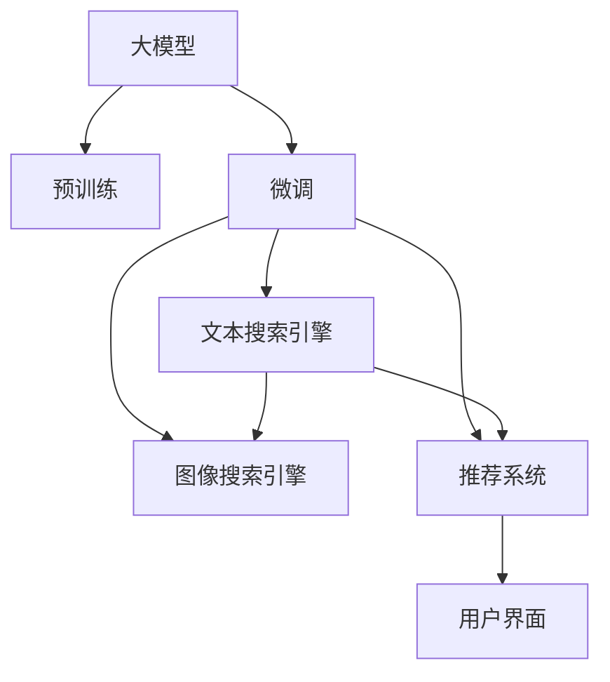

                 

# 搜索推荐系统的AI 大模型融合：电商平台的核心竞争优势与可持续发展

## 1. 背景介绍

### 1.1 问题由来

随着电子商务平台的兴起和互联网技术的不断演进，搜索引擎和推荐系统已经成为用户获取商品信息和决策支持的重要手段。然而，传统的基于规则和统计模型的搜索引擎和推荐系统，已经难以满足个性化、多模态和多场景应用的需求。近年来，基于深度学习的智能搜索引擎和推荐系统逐渐成为行业发展的趋势，其中尤以大模型（如BERT、GPT等）和预训练-微调（Fine-tuning）范式的引入为标志。

在电商平台上，基于大模型的智能搜索引擎和推荐系统，能够更加高效地处理海量用户数据，快速适应用户的个性化需求，并提供精准的搜索结果和推荐，从而提升用户体验和平台转化率。同时，这些智能系统的构建也需要考虑数据隐私、计算资源和用户体验等诸多因素，这使得大模型融合和平台优化成为电商平台实现核心竞争力和可持续发展的关键。

### 1.2 问题核心关键点

本文聚焦于电商平台中大模型的融合和优化，特别是搜索推荐系统。我们将详细探讨以下核心问题：

1. 大模型的选择与融合：电商平台如何选择合适的大模型，并将其与现有业务系统进行融合？
2. 搜索推荐系统的优化：如何在搜索推荐系统中高效应用大模型，提升系统的性能和用户体验？
3. 数据与计算资源的管理：如何在数据隐私和计算资源的限制下，实现大模型的有效部署和优化？
4. 用户体验与技术创新的平衡：如何在追求技术创新和提升用户体验之间找到最佳平衡点？
5. 平台可持续发展的策略：如何构建可持续发展的电商平台搜索推荐系统，保障长期的市场竞争力？

通过深入分析这些问题，本文将为电商平台提供一套基于大模型融合和优化的全面解决方案。

## 2. 核心概念与联系

### 2.1 核心概念概述

在探讨搜索推荐系统的大模型融合前，首先需要明确一些核心概念：

- **大模型（Large Model）**：指具有大规模参数量和复杂结构的人工智能模型，如BERT、GPT等。这些模型通过在巨量数据上进行预训练，可以学习到丰富的语言表示和知识，用于解决各种NLP任务。
- **预训练-微调（Pre-training & Fine-tuning）**：指在大规模无标签数据上进行预训练，然后在特定任务数据上进行微调（Fine-tuning），以获得任务相关的优化参数。
- **搜索引擎（Search Engine）**：指通过索引和检索技术，帮助用户快速找到所需信息的系统。
- **推荐系统（Recommendation System）**：指通过分析用户行为数据和商品属性，为用户推荐相关商品的系统。
- **多模态（Multimodal）**：指融合文本、图像、音频等多类数据，提升搜索引擎和推荐系统的感知能力和泛化能力。

这些核心概念之间的联系可以概括为：大模型通过预训练-微调范式，可以在通用和特定任务之间实现知识迁移，从而提升搜索引擎和推荐系统的性能。电商平台可以通过大模型的融合，构建更智能、高效的搜索推荐系统，提升用户体验和平台竞争力。

### 2.2 核心概念原理和架构的 Mermaid 流程图



该流程图展示了大模型在搜索引擎和推荐系统中的应用路径：

1. 大模型通过预训练获得通用的语言表示能力。
2. 将预训练模型在搜索引擎、推荐系统等特定任务上微调，提升性能。
3. 构建文本搜索引擎、图像搜索引擎和推荐系统，利用微调后的模型进行信息的检索和推荐。
4. 用户通过这些系统获取搜索结果和推荐信息。

## 3. 核心算法原理 & 具体操作步骤

### 3.1 算法原理概述

基于大模型的搜索推荐系统，其核心算法原理可以概括为：

1. **预训练**：在大型无标签语料库上，通过自监督学习任务（如掩码语言模型、对偶训练等），训练一个大规模语言模型。
2. **微调**：在特定任务数据集上，通过有监督学习任务，微调预训练模型，获得任务相关的优化参数。
3. **融合**：将微调后的模型与搜索引擎和推荐系统集成，构建智能化的搜索推荐系统。

具体来说，预训练模型的知识可以通过微调迁移到文本搜索引擎和推荐系统中，提升系统在信息检索和推荐中的准确性和相关性。同时，多模态数据的融合，进一步提升了系统的感知能力和泛化能力。

### 3.2 算法步骤详解

1. **数据准备**：收集电商平台的商品信息和用户行为数据，作为预训练和微调的数据集。
2. **模型选择与预训练**：选择合适的预训练模型（如BERT、GPT等），在无标签语料库上进行预训练。
3. **任务适配**：设计适合电商平台搜索推荐系统的微调任务，如文本匹配、商品推荐等。
4. **模型微调**：将预训练模型在任务适配数据集上进行微调，获得优化的模型参数。
5. **系统集成**：将微调后的模型集成到搜索推荐系统中，实现高效的检索和推荐。

### 3.3 算法优缺点

大模型融合在搜索推荐系统中的应用，具有以下优点：

1. **性能提升**：大模型通过预训练-微调范式，能够更好地捕捉语言和商品的复杂关系，提升系统的检索和推荐效果。
2. **泛化能力强**：大模型在通用预训练基础上，能够适应多种搜索推荐场景，具有较强的泛化能力。
3. **多模态融合**：大模型可以融合文本、图像等多类数据，提升系统的感知能力和泛化能力。

然而，大模型融合也面临以下挑战：

1. **计算资源需求高**：大模型的预训练和微调需要大量的计算资源，增加了系统部署和维护的成本。
2. **数据隐私问题**：电商平台上用户的隐私数据需要得到严格保护，大模型的训练和应用可能涉及隐私泄露问题。
3. **模型复杂度高**：大模型的复杂结构和大量参数，增加了系统优化和调优的难度。
4. **实时性要求高**：电商平台的搜索推荐系统需要实时响应用户请求，大模型的推理速度需要满足实时性的要求。

### 3.4 算法应用领域

大模型融合在搜索推荐系统中的应用，主要涵盖以下领域：

1. **文本搜索引擎**：通过微调BERT等大模型，提升文本检索的准确性和相关性，帮助用户快速找到所需的商品。
2. **图像搜索引擎**：融合视觉信息，提升图像检索的准确性和用户体验，如通过图像相似度检索推荐相关商品。
3. **推荐系统**：利用大模型的多模态融合能力，提升推荐系统的准确性和个性化，为用户推荐符合其兴趣的商品。

## 4. 数学模型和公式 & 详细讲解 & 举例说明

### 4.1 数学模型构建

在大模型的融合和优化中，数学模型的构建和推导是其核心。以文本搜索引擎为例，我们假设电商平台的商品信息可以表示为文本向量 $x$，用户的搜索查询可以表示为文本向量 $q$。文本搜索引擎的目标是找到与查询最相关的商品信息，即最大化查询与商品的相似度。

假设预训练的大模型为 $M_{\theta}$，其中 $\theta$ 为大模型的参数。设查询向量 $q$ 与商品向量 $x$ 的相似度函数为 $s(q, x)$，则文本搜索引擎的优化目标为：

$$
\max_{q \in \mathcal{Q}} s(q, x)
$$

其中 $\mathcal{Q}$ 为查询集合，$x$ 为商品信息向量。

### 4.2 公式推导过程

文本搜索引擎的相似度函数 $s(q, x)$ 可以通过预训练模型 $M_{\theta}$ 计算得到：

$$
s(q, x) = M_{\theta}(q) \cdot M_{\theta}(x)
$$

其中 $\cdot$ 表示向量点乘。

模型的损失函数为：

$$
L = -\sum_{(q, x) \in D} \log s(q, x)
$$

其中 $D$ 为训练数据集，$D$ 中的每个样本包含查询向量 $q$ 和商品向量 $x$。

通过反向传播算法，可以计算模型的梯度，更新模型参数 $\theta$：

$$
\theta \leftarrow \theta - \eta \nabla_{\theta} L
$$

其中 $\eta$ 为学习率，$\nabla_{\theta} L$ 为损失函数对模型参数的梯度。

### 4.3 案例分析与讲解

假设电商平台中有一个商品信息为 "iPhone 12"，查询为 "iPhone 2021"。使用预训练的BERT模型，计算查询向量和商品向量的相似度：

$$
s("iPhone 2021", "iPhone 12") = M_{\theta}("iPhone 2021") \cdot M_{\theta}("iPhone 12")
$$

通过优化上述相似度函数，使得模型能够更好地学习查询与商品的相似关系，提升搜索效果。

## 5. 项目实践：代码实例和详细解释说明

### 5.1 开发环境搭建

为了实现大模型在搜索推荐系统中的应用，需要搭建一套完整的开发环境。以下是搭建开发环境的基本步骤：

1. **安装Python和相关库**：
   ```bash
   conda create -n pytorch-env python=3.8 
   conda activate pytorch-env
   pip install torch torchvision torchaudio transformers datasets scikit-learn pandas
   ```

2. **配置GPU环境**：
   ```bash
   conda install pytorch torchvision torchaudio cudatoolkit=11.1 -c pytorch -c conda-forge
   ```

3. **安装相关工具**：
   ```bash
   pip install tqdm
   pip install weights-ai tensorboard
   ```

### 5.2 源代码详细实现

以下是使用Transformer库进行文本搜索的Python代码实现：

```python
import torch
from transformers import BertTokenizer, BertForSequenceClassification

tokenizer = BertTokenizer.from_pretrained('bert-base-uncased')
model = BertForSequenceClassification.from_pretrained('bert-base-uncased', num_labels=2)

def search(query, products):
    # 对查询和商品信息进行编码
    query_tokens = tokenizer.encode(query, return_tensors='pt')
    product_tokens = [tokenizer.encode(product, return_tensors='pt') for product in products]
    
    # 计算查询与商品的相似度
    query_scores = model(query_tokens).logits
    product_scores = [model(product_tokens).logits for product_tokens in product_tokens]
    
    # 获取与查询最相关的商品
    top_products = sorted(zip(products, product_scores), key=lambda x: x[1], reverse=True)
    
    return top_products
```

### 5.3 代码解读与分析

代码中，我们使用了BertTokenizer和BertForSequenceClassification这两个预训练模型，分别用于编码查询和商品信息，以及计算查询与商品的相似度。代码的核心在于计算查询向量与商品向量的点乘结果，从而得到相似度分数。最后，我们根据相似度分数对商品进行排序，返回最相关的商品列表。

## 6. 实际应用场景

### 6.1 电商平台搜索推荐系统

电商平台中，基于大模型的搜索推荐系统可以应用于以下场景：

1. **商品检索**：用户输入关键词，通过搜索引擎快速找到相关的商品。
2. **个性化推荐**：根据用户浏览历史和行为数据，推荐符合用户兴趣的商品。
3. **上下文关联推荐**：根据用户当前的浏览页面和商品，推荐上下文相关的商品。

### 6.2 多模态融合

电商平台中，多模态数据的融合可以提升搜索推荐系统的感知能力和泛化能力。例如，结合商品图片、用户画像等多类数据，进行更加精准的推荐和检索。

### 6.3 实时性和个性化

基于大模型的搜索推荐系统需要具备实时性和个性化能力，以响应用户的即时查询和个性化需求。通过优化模型结构和算法，可以在保证性能的同时，提升用户体验。

## 7. 工具和资源推荐

### 7.1 学习资源推荐

1. **《深入理解BERT预训练算法》**：介绍BERT模型的预训练和微调原理，适合初学者和进阶者学习。
2. **《深度学习与自然语言处理》**：斯坦福大学的经典课程，系统讲解深度学习在NLP中的应用，包括搜索引擎和推荐系统。
3. **《Transformer from Zero to Hero》**：介绍Transformer结构和预训练-微调范式的博客，适合深度学习入门者。

### 7.2 开发工具推荐

1. **PyTorch**：基于Python的深度学习框架，支持动态计算图和GPU加速，适合快速迭代和实验。
2. **TensorFlow**：由Google开发，支持静态计算图和GPU/TPU加速，适合大规模工程应用。
3. **Transformers库**：HuggingFace开发的NLP工具库，集成了众多预训练模型，适合微调任务开发。

### 7.3 相关论文推荐

1. **Attention is All You Need**：提出Transformer结构，开启了NLP领域的预训练大模型时代。
2. **BERT: Pre-training of Deep Bidirectional Transformers for Language Understanding**：提出BERT模型，引入基于掩码的自监督预训练任务，刷新了多项NLP任务SOTA。
3. **Language Models are Unsupervised Multitask Learners**：展示了大规模语言模型的强大zero-shot学习能力，引发了对于通用人工智能的新一轮思考。

## 8. 总结：未来发展趋势与挑战

### 8.1 研究成果总结

本文系统介绍了基于大模型融合的电商平台搜索推荐系统，探讨了其核心算法原理和具体操作步骤。通过详细讲解数学模型和公式推导，展示了搜索引擎和推荐系统在大模型融合中的应用。通过项目实践和代码实例，进一步深入分析了其实现细节和优化策略。

### 8.2 未来发展趋势

1. **更智能的预训练模型**：未来的预训练模型将更加智能，具备更强的多模态融合和泛化能力。
2. **更高效的微调方法**：未来的微调方法将更加高效，能够在低资源环境下实现性能提升。
3. **更个性化的推荐系统**：未来的推荐系统将更加个性化，能够根据用户的多样化需求进行精准推荐。
4. **更智能的搜索引擎**：未来的搜索引擎将更加智能，能够处理更复杂的查询和更多的数据类型。

### 8.3 面临的挑战

1. **计算资源限制**：大规模预训练和微调模型需要高计算资源，如何降低计算成本是一个挑战。
2. **数据隐私保护**：电商平台需要保护用户隐私，如何在隐私保护和数据利用之间找到平衡是一个挑战。
3. **模型复杂度管理**：如何管理大模型的复杂度，提升模型的实时性和可解释性是一个挑战。
4. **多模态融合技术**：如何高效地融合多模态数据，提升系统的感知能力和泛化能力是一个挑战。

### 8.4 研究展望

1. **研究多模态融合技术**：探索如何高效地融合文本、图像、音频等多类数据，提升系统的感知能力和泛化能力。
2. **研究智能推荐算法**：探索如何利用预训练-微调模型进行智能推荐，提升推荐系统的准确性和个性化。
3. **研究高效微调方法**：探索如何高效地微调大模型，提升模型的泛化能力和实时性。
4. **研究智能搜索引擎**：探索如何构建更智能的搜索引擎，处理更复杂的查询和更多的数据类型。

## 9. 附录：常见问题与解答

**Q1：大模型融合是否适用于所有电商平台？**

A: 大模型融合在电商平台中的应用具有普适性，但不同平台的业务需求和用户特性不同，需要根据具体情况进行定制。例如，在C2C电商平台上，可能需要更关注个性化推荐和用户互动；在B2B电商平台上，可能需要更关注商品匹配和查询效率。

**Q2：微调过程中如何避免过拟合？**

A: 为了避免过拟合，可以采用以下策略：
1. **数据增强**：通过回译、近义替换等方式扩充训练集。
2. **正则化**：使用L2正则、Dropout、Early Stopping等技术。
3. **对抗训练**：引入对抗样本，提高模型鲁棒性。
4. **参数高效微调**：只调整少量参数，如Adapter、Prefix等，减小过拟合风险。

**Q3：大模型融合对电商平台的运营成本有何影响？**

A: 大模型融合虽然提升了系统的性能，但也带来了较高的计算和存储成本。电商平台可以通过GPU集群、混合精度训练等技术手段，降低成本。同时，平台可以采用边缘计算等技术，将部分计算任务分布到用户端，减轻中心服务器的负担。

**Q4：如何在保证用户体验的同时，优化搜索推荐系统？**

A: 为了提升用户体验，搜索推荐系统需要具备实时性、个性化和多模态融合能力。可以通过以下策略优化系统：
1. **实时检索**：采用基于内存的数据结构，如倒排索引，提高检索速度。
2. **个性化推荐**：利用用户行为数据和商品属性，生成个性化的推荐结果。
3. **多模态融合**：结合商品图片、用户画像等多类数据，进行更加精准的推荐和检索。

---

作者：禅与计算机程序设计艺术 / Zen and the Art of Computer Programming

