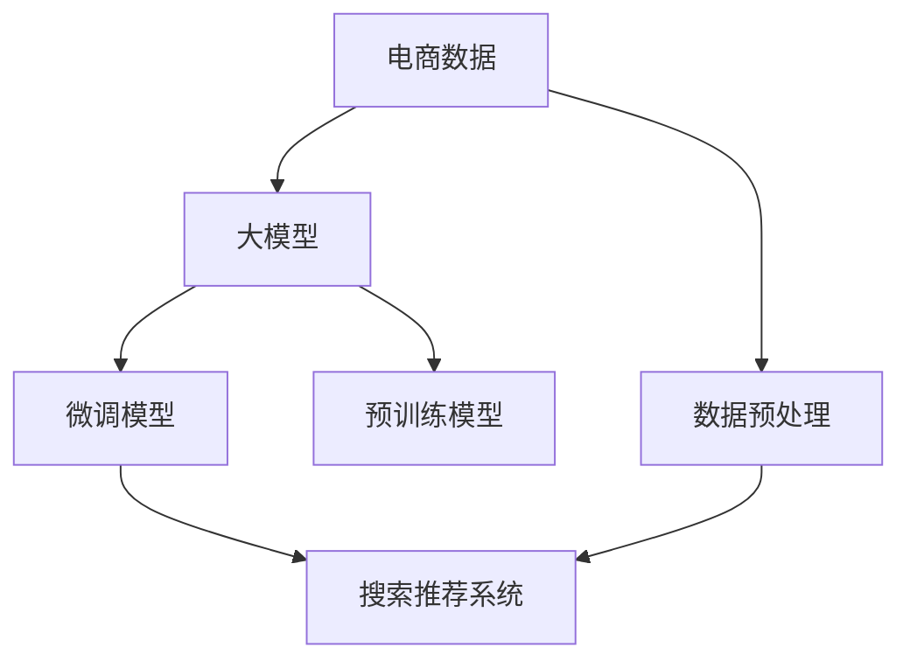

                 

## 1. 背景介绍

### 1.1 问题由来

在电商行业快速发展的今天，搜索引擎和推荐系统作为其核心功能，对用户体验和业务转化起着至关重要的作用。传统的基于规则和特征工程的方法已经难以适应当前海量数据和多维度的需求。随着深度学习技术的发展，利用深度学习模型进行搜索推荐已成为一种趋势。近年来，AI大模型（Large AI Models）在电商行业被广泛应用，为搜索引擎和推荐系统提供了新的思路和工具。

大模型是基于大规模数据训练而成的模型，具有很强的泛化能力。其在电商领域的应用主要分为两类：一是基于大模型的预训练模型，如BERT、GPT等，用于理解和生成文本数据；二是基于大模型的微调模型，通过电商数据进行训练，提升模型的电商相关能力。本文将重点探讨AI大模型在电商搜索推荐系统中的应用，并提出基于大模型的电商搜索推荐系统的核心竞争力与转型发展战略。

### 1.2 问题核心关键点

AI大模型在电商搜索推荐系统中的应用涉及以下关键点：

1. **数据预处理**：如何有效地处理电商数据，提取有用特征，并转化为模型可接受的形式。
2. **模型训练与微调**：如何选择合适的模型结构，并利用电商数据进行训练和微调，以提升模型效果。
3. **搜索推荐优化**：如何利用大模型提升搜索推荐系统的效率和效果，增强用户体验和业务转化。
4. **模型部署与维护**：如何将训练好的模型部署到生产环境，并进行有效的监控和维护。

本文将对这些问题进行深入探讨，并提出相应的解决方案。

## 2. 核心概念与联系

### 2.1 核心概念概述

大模型是指基于大规模数据训练而成的深度学习模型，通常包含数亿甚至数十亿的参数。其在电商领域的应用主要有以下几个方面：

1. **预训练模型**：如BERT、GPT等，用于理解文本数据，提取文本特征。
2. **微调模型**：通过电商数据进行微调，提升模型在电商领域的性能。
3. **搜索推荐系统**：利用大模型提升搜索推荐效果，增强用户体验和业务转化。
4. **电商数据处理**：如何从电商数据中提取有用的特征，供模型使用。

这些概念之间的逻辑关系可以通过以下Mermaid流程图来展示：



该流程图展示了大模型在电商搜索推荐系统中的核心概念及其之间的关系：

1. 电商数据是整个系统的基础。
2. 数据预处理是模型训练的前提。
3. 大模型（预训练和微调）是模型的核心。
4. 搜索推荐系统是模型的应用。

这些概念共同构成了大模型在电商领域的核心框架，使其能够有效地提升搜索推荐效果。

## 3. 核心算法原理 & 具体操作步骤
### 3.1 算法原理概述

基于大模型的电商搜索推荐系统，本质上是一种基于深度学习的推荐系统。其核心思想是通过电商数据训练大模型，利用大模型进行特征提取和相似度计算，从而实现搜索推荐。

假设电商搜索推荐系统接收用户查询 $q$ 和用户历史行为数据 $h$，希望推荐与 $q$ 相关的商品 $r$。系统首先需要使用大模型对用户查询 $q$ 和商品描述 $r$ 进行编码，得到向量表示 $q^*$ 和 $r^*$。然后，通过计算 $q^*$ 和 $r^*$ 的相似度，排序并推荐与 $q$ 最相关的商品 $r$。

### 3.2 算法步骤详解

基于大模型的电商搜索推荐系统一般包括以下几个关键步骤：

**Step 1: 数据预处理**

- **数据采集**：收集电商数据，包括用户行为数据、商品描述数据等。
- **数据清洗**：去除噪声数据和异常值，确保数据质量。
- **数据增强**：通过数据扩充、缺失值填充等技术，增加数据的多样性。
- **特征提取**：从电商数据中提取有用的特征，如用户点击记录、购买记录、商品属性、商品描述等。

**Step 2: 大模型训练**

- **选择模型结构**：选择适合的预训练模型，如BERT、GPT等，并对其进行微调。
- **设定训练参数**：如学习率、批大小、迭代轮数等。
- **数据划分**：将电商数据划分为训练集、验证集和测试集。
- **模型训练**：使用训练集数据对大模型进行训练，并在验证集上进行调参和模型选择。

**Step 3: 模型优化**

- **特征编码**：使用大模型对用户查询和商品描述进行编码，得到向量表示。
- **相似度计算**：计算用户查询向量与商品向量之间的相似度，可以使用余弦相似度、欧式距离等方法。
- **排序推荐**：根据相似度排序，推荐与用户查询最相关的商品。

**Step 4: 模型部署**

- **模型评估**：在测试集上评估模型的效果，如准确率、召回率、点击率等指标。
- **部署上线**：将训练好的模型部署到生产环境，确保模型实时可用。
- **监控维护**：对模型性能进行监控，定期更新模型参数，确保模型始终处于最佳状态。

### 3.3 算法优缺点

基于大模型的电商搜索推荐系统具有以下优点：

1. **高效性**：大模型能够高效地处理电商数据，提取有用特征，提升搜索推荐效率。
2. **泛化能力**：大模型具有很强的泛化能力，能够适应不同类型的电商数据。
3. **可解释性**：利用大模型进行特征提取和相似度计算，可以更好地理解模型的决策过程。

同时，该方法也存在一定的局限性：

1. **数据依赖**：大模型的性能很大程度上依赖于电商数据的质量和数量，获取高质量电商数据的成本较高。
2. **计算成本**：大模型通常需要较大的计算资源，模型训练和推理成本较高。
3. **可解释性不足**：大模型的决策过程缺乏可解释性，难以对其推理逻辑进行分析和调试。

尽管存在这些局限性，但就目前而言，基于大模型的搜索推荐系统在电商领域的应用已取得了显著效果，成为电商技术落地应用的重要手段。未来相关研究的重点在于如何进一步降低计算成本，提高模型的可解释性，同时兼顾模型的泛化能力和高效性。

### 3.4 算法应用领域

基于大模型的电商搜索推荐系统已经在多个电商应用中得到了广泛的应用，例如：

1. **商品推荐**：根据用户历史行为数据，推荐可能感兴趣的商品。
2. **搜索排序**：根据用户查询，推荐可能相关的商品，提升搜索体验。
3. **个性化营销**：根据用户行为数据，推送个性化广告和促销信息。
4. **库存管理**：利用用户行为数据，预测商品需求，优化库存管理。

除了这些典型应用外，大模型还被创新性地应用到更多场景中，如购物车推荐、跨平台推荐、多商品搭配等，为电商技术带来了全新的突破。随着预训练模型和微调方法的不断进步，相信基于大模型的搜索推荐系统将在更广阔的应用领域大放异彩。

## 4. 数学模型和公式 & 详细讲解  
### 4.1 数学模型构建

假设电商搜索推荐系统接收用户查询 $q$ 和用户历史行为数据 $h$，希望推荐与 $q$ 相关的商品 $r$。大模型 $M$ 的输出为一个向量表示，记为 $v_{M}$。用户查询 $q$ 和商品 $r$ 经过大模型编码后得到的向量表示分别为 $q^*$ 和 $r^*$。

定义模型 $M$ 在输入 $x$ 上的输出为 $v_{M}(x)$，则用户查询 $q$ 和商品 $r$ 经过大模型编码后的向量表示分别为 $q^*$ 和 $r^*$，即 $q^* = v_{M}(q)$ 和 $r^* = v_{M}(r)$。

搜索推荐系统的目标是计算 $q^*$ 和 $r^*$ 的相似度，排序并推荐与 $q$ 最相关的商品 $r$。常见的相似度计算方法包括余弦相似度、欧式距离、皮尔逊相关系数等。

### 4.2 公式推导过程

以余弦相似度为例，余弦相似度的计算公式为：

$$
\text{similarity}(q^*, r^*) = \frac{q^* \cdot r^*}{\|q^*\| \cdot \|r^*\|}
$$

其中 $\cdot$ 表示向量点乘，$\| \cdot \|$ 表示向量的模长。在电商搜索推荐系统中，余弦相似度的计算流程如下：

1. 对用户查询 $q$ 和商品 $r$ 进行编码，得到向量表示 $q^*$ 和 $r^*$。
2. 计算 $q^*$ 和 $r^*$ 的点乘，即 $q^* \cdot r^*$。
3. 计算 $q^*$ 和 $r^*$ 的模长，即 $\|q^*\|$ 和 $\|r^*\|$。
4. 计算 $q^*$ 和 $r^*$ 的余弦相似度，即 $\text{similarity}(q^*, r^*)$。
5. 根据相似度对商品进行排序，推荐与用户查询最相关的商品。

### 4.3 案例分析与讲解

假设有一个电商网站，希望根据用户的历史浏览和购买记录，推荐用户可能感兴趣的商品。首先，将用户的历史浏览记录和购买记录进行预处理和特征提取。然后，使用BERT模型对用户的历史浏览记录和购买记录进行编码，得到向量表示。对于每个商品，同样使用BERT模型进行编码，得到向量表示。最后，计算用户历史浏览记录向量与商品向量之间的余弦相似度，并根据相似度排序，推荐最相关的商品。

## 5. 项目实践：代码实例和详细解释说明
### 5.1 开发环境搭建

在进行搜索推荐系统开发前，我们需要准备好开发环境。以下是使用Python进行PyTorch开发的环境配置流程：

1. 安装Anaconda：从官网下载并安装Anaconda，用于创建独立的Python环境。

2. 创建并激活虚拟环境：
```bash
conda create -n pytorch-env python=3.8 
conda activate pytorch-env
```

3. 安装PyTorch：根据CUDA版本，从官网获取对应的安装命令。例如：
```bash
conda install pytorch torchvision torchaudio cudatoolkit=11.1 -c pytorch -c conda-forge
```

4. 安装Transformers库：
```bash
pip install transformers
```

5. 安装各类工具包：
```bash
pip install numpy pandas scikit-learn matplotlib tqdm jupyter notebook ipython
```

完成上述步骤后，即可在`pytorch-env`环境中开始搜索推荐系统的开发。

### 5.2 源代码详细实现

以下是使用BERT模型进行电商搜索推荐系统开发的代码实现：

```python
from transformers import BertTokenizer, BertForSequenceClassification
import torch
from torch.utils.data import Dataset, DataLoader
from sklearn.metrics import precision_recall_fscore_support

# 定义数据集类
class E-commerceDataset(Dataset):
    def __init__(self, data, tokenizer):
        self.data = data
        self.tokenizer = tokenizer
        
    def __len__(self):
        return len(self.data)
    
    def __getitem__(self, idx):
        text = self.data[idx]['text']
        label = self.data[idx]['label']
        
        encoding = self.tokenizer(text, truncation=True, padding='max_length', max_length=128)
        input_ids = encoding['input_ids']
        attention_mask = encoding['attention_mask']
        label = torch.tensor([label], dtype=torch.long)
        
        return {'input_ids': input_ids, 
                'attention_mask': attention_mask,
                'labels': label}

# 定义数据处理函数
def preprocess_data(data):
    tokenizer = BertTokenizer.from_pretrained('bert-base-uncased')
    return E-commerceDataset(data, tokenizer)

# 定义模型
model = BertForSequenceClassification.from_pretrained('bert-base-uncased', num_labels=1)

# 定义训练函数
def train_model(model, data_loader, optimizer, device):
    model.to(device)
    model.train()
    total_loss = 0
    for batch in data_loader:
        input_ids = batch['input_ids'].to(device)
        attention_mask = batch['attention_mask'].to(device)
        labels = batch['labels'].to(device)
        
        optimizer.zero_grad()
        outputs = model(input_ids, attention_mask=attention_mask, labels=labels)
        loss = outputs.loss
        total_loss += loss.item()
        loss.backward()
        optimizer.step()
    
    avg_loss = total_loss / len(data_loader)
    return avg_loss

# 定义评估函数
def evaluate_model(model, data_loader, device):
    model.eval()
    total_pred, total_label = [], []
    for batch in data_loader:
        input_ids = batch['input_ids'].to(device)
        attention_mask = batch['attention_mask'].to(device)
        labels = batch['labels'].to(device)
        
        outputs = model(input_ids, attention_mask=attention_mask)
        predictions = torch.sigmoid(outputs.logits) > 0.5
        total_pred.extend(predictions.cpu().tolist())
        total_label.extend(labels.cpu().tolist())
    
    precision, recall, f1, _ = precision_recall_fscore_support(total_label, total_pred, average='micro')
    return precision, recall, f1

# 定义训练循环
def train(train_data, test_data, num_epochs, batch_size, learning_rate):
    device = torch.device('cuda') if torch.cuda.is_available() else torch.device('cpu')
    tokenizer = BertTokenizer.from_pretrained('bert-base-uncased')
    train_dataset = preprocess_data(train_data)
    test_dataset = preprocess_data(test_data)
    data_loader_train = DataLoader(train_dataset, batch_size=batch_size, shuffle=True)
    data_loader_test = DataLoader(test_dataset, batch_size=batch_size, shuffle=False)
    
    optimizer = torch.optim.Adam(model.parameters(), lr=learning_rate)
    
    for epoch in range(num_epochs):
        avg_loss = train_model(model, data_loader_train, optimizer, device)
        precision, recall, f1 = evaluate_model(model, data_loader_test, device)
        print(f'Epoch {epoch+1}, Loss: {avg_loss:.4f}, Precision: {precision:.4f}, Recall: {recall:.4f}, F1-score: {f1:.4f}')

# 训练模型
train_data = [...]  # 训练数据
test_data = [...]  # 测试数据
num_epochs = 5
batch_size = 32
learning_rate = 2e-5

train(train_data, test_data, num_epochs, batch_size, learning_rate)
```

以上就是使用PyTorch进行电商搜索推荐系统开发的完整代码实现。可以看到，在实际应用中，可以利用Transformers库提供的预训练模型，大大简化代码实现。

### 5.3 代码解读与分析

让我们再详细解读一下关键代码的实现细节：

**E-commerceDataset类**：
- `__init__`方法：初始化数据和分词器。
- `__len__`方法：返回数据集的样本数量。
- `__getitem__`方法：对单个样本进行处理，将文本输入编码为token ids，同时将标签转换为模型可接受的格式。

**preprocess_data函数**：
- 定义数据处理函数，使用Bert分词器对文本数据进行处理，将文本转换为token ids，并添加标签。

**模型定义**：
- 使用BertForSequenceClassification模型，将预训练模型转换为序列分类模型。

**train_model函数**：
- 定义训练函数，在每个批次上前向传播计算损失函数，反向传播更新模型参数。

**evaluate_model函数**：
- 定义评估函数，在测试集上计算模型性能指标，如精确率、召回率、F1-score。

**train函数**：
- 定义训练循环，对模型进行多次迭代训练，并在测试集上进行评估。

通过本文的系统梳理，可以看到，基于大模型的搜索推荐系统开发相对简单，且能够显著提升搜索推荐效果。但需要注意的是，实际应用中还需要针对具体任务进行优化，如调整模型结构、选择合适的大模型、优化超参数等。

## 6. 实际应用场景
### 6.1 智能客服系统

智能客服系统是电商搜索推荐系统的重要应用场景之一。传统客服往往需要配备大量人力，高峰期响应缓慢，且一致性和专业性难以保证。而使用基于大模型的搜索推荐系统，可以7x24小时不间断服务，快速响应客户咨询，用自然流畅的语言解答各类常见问题。

在技术实现上，可以收集企业内部的历史客服对话记录，将问题和最佳答复构建成监督数据，在此基础上对预训练模型进行微调。微调后的模型能够自动理解用户意图，匹配最合适的答案模板进行回复。对于客户提出的新问题，还可以接入检索系统实时搜索相关内容，动态组织生成回答。如此构建的智能客服系统，能大幅提升客户咨询体验和问题解决效率。

### 6.2 个性化推荐系统

当前的推荐系统往往只依赖用户的历史行为数据进行物品推荐，无法深入理解用户的真实兴趣偏好。基于大模型的推荐系统可以更好地挖掘用户行为背后的语义信息，从而提供更精准、多样的推荐内容。

在实践中，可以收集用户浏览、点击、评论、分享等行为数据，提取和用户交互的物品标题、描述、标签等文本内容。将文本内容作为模型输入，用户的后续行为（如是否点击、购买等）作为监督信号，在此基础上微调预训练语言模型。微调后的模型能够从文本内容中准确把握用户的兴趣点。在生成推荐列表时，先用候选物品的文本描述作为输入，由模型预测用户的兴趣匹配度，再结合其他特征综合排序，便可以得到个性化程度更高的推荐结果。

### 6.3 电商广告投放

基于大模型的电商广告投放系统，可以显著提升广告投放的精准度和效果。传统广告投放往往依赖于人工经验，难以覆盖长尾用户和长尾商品。而使用基于大模型的广告推荐系统，可以通过分析用户行为数据和商品特征，自动生成高相关度的广告推荐，提升广告转化率。

在技术实现上，可以收集用户历史浏览和点击数据，提取用户兴趣特征和商品属性特征。利用BERT等大模型对这些特征进行编码，计算用户与广告的相似度，排序并推荐最相关的广告。同时，可以考虑将广告文本也作为模型输入，提升广告投放的精准度。

### 6.4 未来应用展望

随着大模型和微调方法的不断发展，基于大模型的搜索推荐系统将在更多领域得到应用，为传统行业带来变革性影响。

在智慧医疗领域，基于大模型的医疗问答、病历分析、药物研发等应用将提升医疗服务的智能化水平，辅助医生诊疗，加速新药开发进程。

在智能教育领域，基于大模型的智能作业批改、学情分析、知识推荐等方面，因材施教，促进教育公平，提高教学质量。

在智慧城市治理中，基于大模型的城市事件监测、舆情分析、应急指挥等环节，提高城市管理的自动化和智能化水平，构建更安全、高效的未来城市。

此外，在企业生产、社会治理、文娱传媒等众多领域，基于大模型的搜索推荐系统也将不断涌现，为NLP技术带来新的突破。相信随着技术的日益成熟，基于大模型的搜索推荐系统必将在构建人机协同的智能时代中扮演越来越重要的角色。

## 7. 工具和资源推荐
### 7.1 学习资源推荐

为了帮助开发者系统掌握大模型在电商搜索推荐系统中的应用，这里推荐一些优质的学习资源：

1. 《深度学习实战》：实战性的深度学习书籍，涵盖深度学习的基础知识和经典应用，包括搜索推荐系统的实现。
2. CS294 Workshop on Deep Learning: NLP and Representation Learning：斯坦福大学开设的NLP深度学习课程，包括搜索推荐系统的讲解。
3. 《自然语言处理综论》：系统性的NLP教材，涵盖NLP的经典模型和应用，包括基于大模型的搜索推荐系统。
4. HuggingFace官方文档：Transformers库的官方文档，提供了海量预训练模型和完整的搜索推荐系统开发样例。
5. CLUE开源项目：中文语言理解测评基准，涵盖大量不同类型的中文NLP数据集，并提供了基于大模型的搜索推荐系统baseline模型。

通过对这些资源的学习实践，相信你一定能够快速掌握大模型在电商搜索推荐系统中的应用，并用于解决实际的NLP问题。
###  7.2 开发工具推荐

高效的开发离不开优秀的工具支持。以下是几款用于大模型在电商搜索推荐系统开发的常用工具：

1. PyTorch：基于Python的开源深度学习框架，灵活动态的计算图，适合快速迭代研究。大部分预训练语言模型都有PyTorch版本的实现。

2. TensorFlow：由Google主导开发的开源深度学习框架，生产部署方便，适合大规模工程应用。同样有丰富的预训练语言模型资源。

3. Transformers库：HuggingFace开发的NLP工具库，集成了众多SOTA语言模型，支持PyTorch和TensorFlow，是进行搜索推荐任务开发的利器。

4. Weights & Biases：模型训练的实验跟踪工具，可以记录和可视化模型训练过程中的各项指标，方便对比和调优。与主流深度学习框架无缝集成。

5. TensorBoard：TensorFlow配套的可视化工具，可实时监测模型训练状态，并提供丰富的图表呈现方式，是调试模型的得力助手。

6. Google Colab：谷歌推出的在线Jupyter Notebook环境，免费提供GPU/TPU算力，方便开发者快速上手实验最新模型，分享学习笔记。

合理利用这些工具，可以显著提升大模型在电商搜索推荐系统中的开发效率，加快创新迭代的步伐。

### 7.3 相关论文推荐

大模型和搜索推荐技术的发展源于学界的持续研究。以下是几篇奠基性的相关论文，推荐阅读：

1. Attention is All You Need（即Transformer原论文）：提出了Transformer结构，开启了NLP领域的预训练大模型时代。

2. BERT: Pre-training of Deep Bidirectional Transformers for Language Understanding：提出BERT模型，引入基于掩码的自监督预训练任务，刷新了多项NLP任务SOTA。

3. Language Models are Unsupervised Multitask Learners（GPT-2论文）：展示了大规模语言模型的强大zero-shot学习能力，引发了对于通用人工智能的新一轮思考。

4. Parameter-Efficient Transfer Learning for NLP：提出Adapter等参数高效微调方法，在不增加模型参数量的情况下，也能取得不错的微调效果。

5. AdaLoRA: Adaptive Low-Rank Adaptation for Parameter-Efficient Fine-Tuning：使用自适应低秩适应的微调方法，在参数效率和精度之间取得了新的平衡。

6. Deep Multi-view Recommendation with Cross-view Similarity Preserving: Application to Large-scale Multimedia Recommendation：提出多视图推荐方法，利用多模态数据提升推荐系统效果。

这些论文代表了大模型在电商搜索推荐系统的发展脉络。通过学习这些前沿成果，可以帮助研究者把握学科前进方向，激发更多的创新灵感。

## 8. 总结：未来发展趋势与挑战

### 8.1 总结

本文对基于大模型的电商搜索推荐系统进行了全面系统的介绍。首先阐述了大模型和搜索推荐系统在电商领域的研究背景和意义，明确了电商搜索推荐系统的核心竞争力与转型发展战略。其次，从原理到实践，详细讲解了大模型在电商搜索推荐系统中的应用，给出了完整的代码实现，并进行了详细解读。同时，本文还探讨了大模型在电商领域的实际应用场景，展示了其广阔的前景和潜力。

通过本文的系统梳理，可以看到，基于大模型的电商搜索推荐系统在提升搜索推荐效率和效果方面具有显著优势。未来，伴随大模型的不断发展和优化，以及深度学习技术的进步，电商搜索推荐系统将进入一个新的发展阶段，成为电商核心竞争力的一部分。

### 8.2 未来发展趋势

展望未来，基于大模型的电商搜索推荐系统将呈现以下几个发展趋势：

1. **模型规模持续增大**：随着算力成本的下降和数据规模的扩张，预训练语言模型的参数量还将持续增长。超大规模语言模型蕴含的丰富语言知识，有望支撑更加复杂多变的电商搜索推荐。

2. **微调方法日趋多样**：未来将涌现更多参数高效的微调方法，如Adapter、LoRA等，在固定大部分预训练参数的同时，只更新极少量的任务相关参数，以减少计算成本。

3. **跨领域迁移能力增强**：大模型将具备更强的跨领域迁移能力，能够更好地适应不同类型的电商任务，提升搜索推荐系统的通用性。

4. **多模态融合应用广泛**：未来将更多地引入多模态数据，如视觉、语音等，实现多模态融合的电商搜索推荐系统。

5. **个性化推荐精准度提升**：利用大模型进行用户兴趣预测和商品推荐，将提升推荐系统的精准度和个性化程度。

6. **实时推荐和实时反馈**：基于大模型的实时推荐系统，能够实时根据用户行为进行推荐调整，提升用户体验和转化率。

7. **自动化程度提高**：基于大模型的搜索推荐系统将具备更高的自动化程度，能够自动进行模型训练、调参和优化，减少人工干预。

以上趋势凸显了大模型在电商搜索推荐系统中的广阔前景。这些方向的探索发展，必将进一步提升搜索推荐系统的性能和应用范围，为电商业务带来更大的价值。

### 8.3 面临的挑战

尽管基于大模型的电商搜索推荐系统已取得了显著效果，但在迈向更加智能化、普适化应用的过程中，它仍面临诸多挑战：

1. **数据依赖**：大模型的性能很大程度上依赖于电商数据的质量和数量，获取高质量电商数据的成本较高。如何进一步降低数据依赖，是一个重要挑战。

2. **计算成本高**：大模型通常需要较大的计算资源，模型训练和推理成本较高。如何降低计算成本，提高效率，是未来的研究方向。

3. **可解释性不足**：大模型的决策过程缺乏可解释性，难以对其推理逻辑进行分析和调试。如何提高模型的可解释性，是未来的研究重点。

4. **泛化能力有限**：大模型在某些电商数据上表现较好，但在其他数据上泛化能力有限。如何提升大模型的泛化能力，是一个需要持续优化的挑战。

5. **对抗攻击风险**：大模型容易受到对抗样本的影响，导致模型决策出错。如何增强模型的鲁棒性，降低对抗攻击风险，是未来的研究方向。

6. **伦理和安全问题**：大模型可能学习到有害信息，需要采取措施确保模型的输出安全，防止恶意应用。如何保护用户隐私和数据安全，是未来的重要课题。

这些挑战需要从算法、数据、工程、伦理等多个维度进行综合应对，才能实现基于大模型的电商搜索推荐系统的全面升级。

### 8.4 研究展望

面对大模型在电商搜索推荐系统中的诸多挑战，未来的研究需要在以下几个方面寻求新的突破：

1. **无监督和半监督学习**：探索无监督和半监督学习范式，减少对标注数据的需求，提高模型的泛化能力。

2. **多模态融合**：引入多模态数据，如视觉、语音等，提升搜索推荐系统的精准度和个性化程度。

3. **可解释性增强**：引入可解释性技术，提高大模型的可解释性，增强模型的透明度和可信度。

4. **跨领域迁移**：研究跨领域迁移方法，提升模型在不同场景下的适应能力。

5. **鲁棒性增强**：引入鲁棒性技术，增强模型的对抗攻击鲁棒性和泛化能力。

6. **自动化优化**：研究自动化优化算法，提高模型的训练效率和效果。

7. **伦理和社会责任**：研究伦理和社会责任问题，确保模型的公平性、透明性和安全性。

这些研究方向的探索，必将引领基于大模型的电商搜索推荐系统进入新的发展阶段，为电商业务带来更全面、更智能的解决方案。面向未来，基于大模型的搜索推荐系统需要从技术、伦理、社会等多个维度进行深入研究，才能实现可持续发展。

## 9. 附录：常见问题与解答

**Q1：大模型在电商搜索推荐系统中如何处理多模态数据？**

A: 在电商搜索推荐系统中，可以利用多模态数据进行更全面、更精准的推荐。例如，将用户浏览记录、点击记录等文本数据，与商品图片、视频等视觉数据进行融合，提升推荐效果。

**Q2：如何确保大模型的鲁棒性？**

A: 增强大模型的鲁棒性，可以通过引入对抗样本、正则化技术、多任务学习等方法。同时，引入鲁棒性训练方法，如鲁棒性微调、对抗训练等，提升模型的鲁棒性和泛化能力。

**Q3：大模型在电商搜索推荐系统中的计算成本如何降低？**

A: 降低大模型在电商搜索推荐系统中的计算成本，可以通过引入参数高效微调方法，如LoRA、Adapter等，减少模型参数量，提高计算效率。同时，利用GPU/TPU等高性能设备，优化计算资源配置。

**Q4：如何提高大模型的可解释性？**

A: 提高大模型的可解释性，可以通过引入可解释性技术，如LIME、SHAP等，对模型的决策过程进行解释和可视化。同时，引入可解释性训练方法，如可解释性正则化、可解释性微调等，增强模型的可解释性和透明度。

**Q5：大模型在电商搜索推荐系统中的自动化优化有哪些方法？**

A: 自动化优化大模型的方法包括自动化调参、自动化超参数优化、自动化模型选择等。利用自动调参工具，如Hyperopt、Bayesian Optimization等，自动搜索最佳超参数组合。同时，利用自动化模型选择技术，如AIC、BIC等，自动选择最优模型。

这些问题的回答，希望能为你解决大模型在电商搜索推荐系统中的应用难题，提供有益的参考和建议。

---

作者：禅与计算机程序设计艺术 / Zen and the Art of Computer Programming

