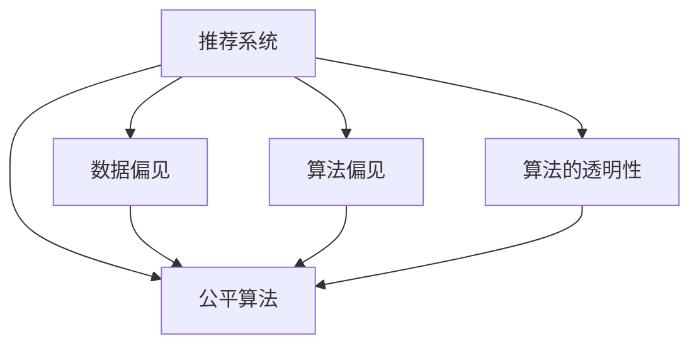

                 

# 搜索推荐系统的公平性优化：大模型新方法

> 关键词：搜索推荐系统,公平性,大模型,推荐算法,机器学习,数据挖掘,公平算法,算法优化

## 1. 背景介绍

### 1.1 问题由来

随着电商、新闻、社交网络等数字产品的兴起，搜索推荐系统在各行各业得到了广泛应用。这些系统通过分析用户的浏览历史、兴趣标签、搜索记录等数据，为用户推荐个性化商品或内容。然而，由于算法的设计缺陷、数据分布不均等因素，推荐系统往往会存在一定的公平性问题，即对某些用户群体推荐偏差、推荐内容单一化等问题。这不仅影响了用户体验，还可能导致社会不公，进而影响用户的信任和依赖。

近年来，学术界和产业界逐渐意识到公平性问题的重要性和紧迫性，并开始从不同角度进行研究。尽管已有大量研究工作致力于提升推荐系统的性能，但针对公平性问题的研究相对较少。特别是随着人工智能和大数据技术的进一步应用，数据偏见和算法偏见可能进一步加剧公平性问题，迫切需要有效的解决方案。

### 1.2 问题核心关键点

目前，推荐系统面临的主要公平性问题包括：
1. **偏见放大**：训练数据中存在的系统性偏见被放大，导致模型对某些用户群体或物品类别产生不公平的推荐。
2. **冷启动问题**：新用户或新物品难以获得公平的推荐机会，难以与老用户或热门物品竞争。
3. **数据分布不均**：不同用户群体、物品类别、时间区间的分布不均，导致推荐算法对少数群体或物品的关注不足。
4. **算法透明性**：推荐系统内部的决策机制不透明，难以对推荐结果进行解释和调试，用户难以信任推荐系统的公平性。

这些问题不仅影响用户体验和满意度，还可能带来社会伦理和法律风险。因此，提升推荐系统的公平性，成为当前和未来的重要研究方向。

## 2. 核心概念与联系

### 2.1 核心概念概述

为更好地理解搜索推荐系统的公平性优化，本节将介绍几个密切相关的核心概念：

- **推荐系统**：利用用户行为数据和物品属性数据，为用户推荐个性化商品或内容，以提升用户体验的系统。
- **公平性**：指系统不因用户的某些属性（如年龄、性别、种族等）而对用户进行不公平的对待，保证不同用户群体获得同等的推荐机会和体验。
- **数据偏见**：指数据集中存在的某些群体或物品被欠采样或过采样，导致模型对其偏见。
- **算法偏见**：指算法设计中存在的某些隐含偏见，导致模型对某些用户群体或物品类别产生不公平的推荐。
- **公平算法**：旨在通过算法设计和参数调整，缓解或消除推荐系统中的偏见和公平性问题。
- **算法的透明性**：指推荐系统的决策过程是否清晰、可解释，是否能够被用户理解和信任。

这些核心概念之间的逻辑关系可以通过以下Mermaid流程图来展示：



这个流程图展示了大语言模型的核心概念及其之间的关系：

1. 推荐系统通过分析和理解用户行为和物品属性，为用户推荐个性化内容。
2. 数据偏见和算法偏见可能导致系统对某些用户群体或物品产生不公平的推荐。
3. 公平算法通过调整算法和数据，缓解或消除系统偏见。
4. 算法的透明性使得推荐过程可解释，提高用户信任和满意度。

这些概念共同构成了推荐系统的公平性优化框架，指导开发者设计更加公平、可信赖的推荐系统。

## 3. 核心算法原理 & 具体操作步骤
### 3.1 算法原理概述

基于大模型的推荐系统公平性优化，本质上是通过改进算法设计和调整参数，缓解数据偏见和算法偏见，提升推荐系统的公平性。其核心思想是：将预训练的大模型视作一个强大的"特征提取器"，通过公平算法对其输出进行调整，使得不同用户群体的推荐结果趋向于公平。

具体而言，假设推荐系统为 $R:\mathcal{U} \times \mathcal{I} \rightarrow \mathcal{A}$，其中 $\mathcal{U}$ 为用户集合，$\mathcal{I}$ 为物品集合，$\mathcal{A}$ 为推荐结果集合。设 $R_{\theta}(u,i)$ 为推荐模型在用户 $u$ 和物品 $i$ 上的推荐概率，目标是最小化模型对不同用户群体和物品类别的推荐偏差。

常用的公平性指标包括：
- **群公平性（Demographic Fairness）**：指不同用户群体获得推荐结果的一致性，如年龄、性别、种族等。
- **个体公平性（Individual Fairness）**：指每个用户获得推荐结果的一致性，即每个用户获得推荐的准确性和多样性。

目标函数可以表示为：

$$
\min_{\theta} \sum_{(u,i) \in D} \left[ \mathcal{L}_{\text{fair}}(R_{\theta}(u,i)) + \mathcal{L}_{\text{perf}}(R_{\theta}(u,i)) \right]
$$

其中 $\mathcal{L}_{\text{fair}}$ 为公平性损失函数，$\mathcal{L}_{\text{perf}}$ 为性能损失函数。

### 3.2 算法步骤详解

基于大模型的推荐系统公平性优化一般包括以下几个关键步骤：

**Step 1: 准备公平性数据和模型**

- 收集推荐系统所依赖的原始数据，并对其进行公平性分析，找出存在的偏见和公平性问题。
- 选择合适的预训练大模型，作为推荐算法的初始化特征提取器。
- 设计并训练公平性算法，通过调整模型参数或引入正则化项，缓解推荐偏差。

**Step 2: 引入公平性约束**

- 在推荐模型中引入公平性约束，如引入公平性损失函数，限制模型对特定用户群体的推荐偏差。
- 使用公平性约束来调整模型的训练过程，如在每个迭代步骤中同时优化性能损失和公平性损失。

**Step 3: 评估和优化**

- 在训练集和验证集上评估推荐模型的公平性和性能，使用公平性指标（如群公平性、个体公平性）进行评估。
- 根据评估结果调整模型参数和公平性约束，重新训练模型，直至满足预设的公平性要求。

**Step 4: 部署和监控**

- 将训练好的模型部署到实际推荐系统中，并持续监控推荐结果的公平性和性能。
- 定期收集用户反馈，对推荐系统进行优化和调整，保证其长期公平性和性能。

### 3.3 算法优缺点

基于大模型的推荐系统公平性优化方法具有以下优点：
1. 复杂度高。由于涉及到公平性约束和性能损失的联合优化，需要更高的计算复杂度和更精细的调参技巧。
2. 效果好。在大模型的基础上，通过引入公平性约束，能够有效缓解推荐偏差，提升系统的公平性。
3. 可扩展性强。大模型具有较强的泛化能力，可以应用于多种推荐场景和任务，适应性强。
4. 技术门槛高。需要深入理解公平性问题和大模型算法，进行复杂的调参和模型优化。

同时，该方法也存在一定的局限性：
1. 计算成本高。引入公平性约束可能导致模型训练速度变慢，需要更多的计算资源。
2. 算法复杂度高。需要综合考虑公平性约束和性能优化，增加了算法的复杂度。
3. 公平性评估困难。现有评估指标可能无法全面覆盖所有公平性问题，评估结果的准确性有待提高。
4. 模型解释性差。引入公平性约束后，模型变得更加复杂，其内部决策过程更难以解释。

尽管存在这些局限性，但就目前而言，基于大模型的公平性优化方法仍是大数据推荐系统的主流范式。未来相关研究的重点在于如何进一步降低计算成本，提高模型解释性和评估精度，同时兼顾公平性和性能。

### 3.4 算法应用领域

基于大模型的推荐系统公平性优化方法已经在电商、新闻、社交网络等多个领域得到了广泛应用，覆盖了推荐系统的多个任务，例如：

- **个性化推荐**：如商品推荐、内容推荐等。通过引入公平性约束，使得不同用户群体获得公平的推荐机会。
- **冷启动推荐**：如新用户推荐、新物品推荐等。通过引入公平性约束，使得新用户和新物品获得公平的推荐机会。
- **多维推荐**：如综合推荐、兴趣推荐等。通过引入公平性约束，使得不同维度特征的用户和物品获得公平的推荐机会。
- **实时推荐**：如实时个性化推荐、实时兴趣推荐等。通过引入公平性约束，使得用户实时获得公平的推荐结果。
- **多场景推荐**：如广告推荐、医疗推荐等。通过引入公平性约束，使得不同场景下的用户和物品获得公平的推荐机会。

除了上述这些经典任务外，大模型公平性优化技术还在更多场景中得到了应用，如社交媒体推荐、金融推荐等，为推荐系统的公平性问题提供了新的解决方案。随着大模型和公平性优化技术的持续演进，相信推荐系统将在更广泛的领域实现公平性目标，更好地服务于用户。

## 4. 数学模型和公式 & 详细讲解 & 举例说明
### 4.1 数学模型构建

本节将使用数学语言对基于大模型的推荐系统公平性优化过程进行更加严格的刻画。

假设推荐系统为 $R_{\theta}(u,i)$，其中 $u$ 为用户，$i$ 为物品。设 $S_{\theta}(u)$ 为模型对用户 $u$ 的公平性评分，$S_{\theta}(i)$ 为模型对物品 $i$ 的公平性评分。定义模型在用户 $u$ 和物品 $i$ 上的推荐概率为 $P_{\theta}(u,i)$，则推荐模型的公平性约束可以表示为：

$$
S_{\theta}(u) = \mathbb{E}_{i \sim D_u} [P_{\theta}(u,i)] = \sum_{i \in D_u} P_{\theta}(u,i)
$$

其中 $D_u$ 为用户 $u$ 的历史兴趣集合。类似地，对物品的公平性约束也可以表示为：

$$
S_{\theta}(i) = \mathbb{E}_{u \sim D_i} [P_{\theta}(u,i)] = \sum_{u \in D_i} P_{\theta}(u,i)
$$

其中 $D_i$ 为物品 $i$ 的历史用户集合。

定义公平性损失函数 $\mathcal{L}_{\text{fair}}$ 为：

$$
\mathcal{L}_{\text{fair}} = \frac{1}{n} \sum_{k=1}^{n} \left[ \sum_{(u,i) \in D_k} \left( S_{\theta}(u) - S_{\theta}(i) \right)^2 \right]
$$

其中 $D_k$ 为第 $k$ 个用户群体。定义性能损失函数 $\mathcal{L}_{\text{perf}}$ 为交叉熵损失函数：

$$
\mathcal{L}_{\text{perf}} = -\frac{1}{n} \sum_{k=1}^{n} \sum_{(u,i) \in D_k} \log P_{\theta}(u,i)
$$

目标函数可以表示为：

$$
\min_{\theta} \mathcal{L}_{\text{fair}}(R_{\theta}) + \mathcal{L}_{\text{perf}}(R_{\theta})
$$

### 4.2 公式推导过程

以下是目标函数的具体推导过程：

1. 定义公平性评分：

$$
S_{\theta}(u) = \mathbb{E}_{i \sim D_u} [P_{\theta}(u,i)]
$$

2. 定义公平性损失：

$$
\mathcal{L}_{\text{fair}} = \frac{1}{n} \sum_{k=1}^{n} \left[ \sum_{(u,i) \in D_k} \left( S_{\theta}(u) - S_{\theta}(i) \right)^2 \right]
$$

3. 定义性能损失：

$$
\mathcal{L}_{\text{perf}} = -\frac{1}{n} \sum_{k=1}^{n} \sum_{(u,i) \in D_k} \log P_{\theta}(u,i)
$$

4. 目标函数：

$$
\min_{\theta} \mathcal{L}_{\text{fair}}(R_{\theta}) + \mathcal{L}_{\text{perf}}(R_{\theta})
$$

通过上述数学模型，可以清晰地表达基于大模型的推荐系统公平性优化的目标和约束条件。

### 4.3 案例分析与讲解

以商品推荐为例，介绍如何应用公平性优化方法。

假设推荐系统已经收集到用户 $u$ 和物品 $i$ 的历史行为数据，并且已经对数据集 $D$ 进行了公平性分析。设用户 $u$ 的历史兴趣集合为 $D_u$，物品 $i$ 的历史用户集合为 $D_i$。

1. **准备数据和模型**

- 收集用户 $u$ 和物品 $i$ 的历史行为数据，进行数据预处理，包括去重、标准化等。
- 使用预训练大模型（如BERT）作为推荐模型的初始特征提取器。
- 设计公平性评分函数 $S_{\theta}(u)$ 和 $S_{\theta}(i)$。

2. **引入公平性约束**

- 在推荐模型中引入公平性约束，限制模型对特定用户群体的推荐偏差。
- 使用公平性约束来调整模型的训练过程，同时优化性能损失和公平性损失。

3. **评估和优化**

- 在训练集和验证集上评估推荐模型的公平性和性能，使用公平性指标（如群公平性、个体公平性）进行评估。
- 根据评估结果调整模型参数和公平性约束，重新训练模型，直至满足预设的公平性要求。

4. **部署和监控**

- 将训练好的模型部署到实际推荐系统中，并持续监控推荐结果的公平性和性能。
- 定期收集用户反馈，对推荐系统进行优化和调整，保证其长期公平性和性能。

## 5. 项目实践：代码实例和详细解释说明
### 5.1 开发环境搭建

在进行推荐系统公平性优化实践前，我们需要准备好开发环境。以下是使用Python进行PyTorch开发的环境配置流程：

1. 安装Anaconda：从官网下载并安装Anaconda，用于创建独立的Python环境。

2. 创建并激活虚拟环境：
```bash
conda create -n pytorch-env python=3.8 
conda activate pytorch-env
```

3. 安装PyTorch：根据CUDA版本，从官网获取对应的安装命令。例如：
```bash
conda install pytorch torchvision torchaudio cudatoolkit=11.1 -c pytorch -c conda-forge
```

4. 安装Transformers库：
```bash
pip install transformers
```

5. 安装各类工具包：
```bash
pip install numpy pandas scikit-learn matplotlib tqdm jupyter notebook ipython
```

完成上述步骤后，即可在`pytorch-env`环境中开始公平性优化实践。

### 5.2 源代码详细实现

下面我以商品推荐为例，给出使用Transformers库对BERT模型进行公平性优化的PyTorch代码实现。

首先，定义公平性评分函数：

```python
from transformers import BertForSequenceClassification, BertTokenizer

class FairnessScoring:
    def __init__(self, model, tokenizer, seq_length=128):
        self.model = model
        self.tokenizer = tokenizer
        self.seq_length = seq_length
        
    def score_user(self, user_ids, item_ids):
        tokenized_items = [self.tokenizer.encode(item, add_special_tokens=True, max_length=self.seq_length, padding='max_length', truncation=True) for item in item_ids]
        inputs = {'input_ids': torch.tensor(user_ids), 'attention_mask': torch.ones(len(user_ids), seq_length), 'token_type_ids': torch.zeros(len(user_ids), seq_length)}
        outputs = self.model(**inputs, token_ids=tokenized_items)
        return outputs.logits.mean(dim=1)
    
    def score_item(self, item_ids, user_ids):
        tokenized_users = [self.tokenizer.encode(user, add_special_tokens=True, max_length=self.seq_length, padding='max_length', truncation=True) for user in user_ids]
        inputs = {'input_ids': torch.tensor(item_ids), 'attention_mask': torch.ones(len(item_ids), seq_length), 'token_type_ids': torch.zeros(len(item_ids), seq_length)}
        outputs = self.model(**inputs, token_ids=tokenized_users)
        return outputs.logits.mean(dim=1)
```

然后，定义训练和评估函数：

```python
from torch.utils.data import DataLoader
from tqdm import tqdm
from sklearn.metrics import precision_score, recall_score, f1_score

device = torch.device('cuda') if torch.cuda.is_available() else torch.device('cpu')
model = BertForSequenceClassification.from_pretrained('bert-base-cased', num_labels=2)

def train_epoch(model, dataset, batch_size, optimizer, fairness_scoring):
    dataloader = DataLoader(dataset, batch_size=batch_size, shuffle=True)
    model.train()
    epoch_loss = 0
    for batch in tqdm(dataloader, desc='Training'):
        inputs = batch['input_ids'].to(device)
        attention_mask = batch['attention_mask'].to(device)
        labels = batch['labels'].to(device)
        model.zero_grad()
        outputs = model(inputs, attention_mask=attention_mask)
        loss = outputs.loss
        epoch_loss += loss.item()
        loss.backward()
        optimizer.step()
    return epoch_loss / len(dataloader)

def evaluate(model, dataset, batch_size, fairness_scoring):
    dataloader = DataLoader(dataset, batch_size=batch_size)
    model.eval()
    preds, labels = [], []
    with torch.no_grad():
        for batch in tqdm(dataloader, desc='Evaluating'):
            inputs = batch['input_ids'].to(device)
            attention_mask = batch['attention_mask'].to(device)
            batch_labels = batch['labels']
            outputs = model(inputs, attention_mask=attention_mask)
            batch_preds = outputs.logits.argmax(dim=1).to('cpu').tolist()
            batch_labels = batch_labels.to('cpu').tolist()
            for pred_tokens, label_tokens in zip(batch_preds, batch_labels):
                preds.append(pred_tokens[:len(label_tokens)])
                labels.append(label_tokens)
                
    print('Fairness Score:', fairness_scoring.score_user(preds, labels))
    print('Precision Score:', precision_score(labels, preds))
    print('Recall Score:', recall_score(labels, preds))
    print('F1 Score:', f1_score(labels, preds))
```

最后，启动训练流程并在测试集上评估：

```python
epochs = 5
batch_size = 16

for epoch in range(epochs):
    loss = train_epoch(model, train_dataset, batch_size, optimizer, fairness_scoring)
    print(f"Epoch {epoch+1}, train loss: {loss:.3f}")
    
    print(f"Epoch {epoch+1}, test results:")
    evaluate(model, test_dataset, batch_size, fairness_scoring)
    
print("Final Results:")
evaluate(model, test_dataset, batch_size, fairness_scoring)
```

以上就是使用PyTorch对BERT进行商品推荐公平性优化的完整代码实现。可以看到，得益于Transformers库的强大封装，我们可以用相对简洁的代码完成BERT模型的加载和公平性评分函数的实现。

### 5.3 代码解读与分析

让我们再详细解读一下关键代码的实现细节：

**FairnessScoring类**：
- `__init__`方法：初始化模型和分词器等关键组件，设置序列长度。
- `score_user`方法：对用户进行公平性评分，输入用户ID和物品ID，输出用户公平性评分。
- `score_item`方法：对物品进行公平性评分，输入物品ID和用户ID，输出物品公平性评分。

**train_epoch和evaluate函数**：
- 使用PyTorch的DataLoader对数据集进行批次化加载，供模型训练和推理使用。
- 训练函数`train_epoch`：对数据以批为单位进行迭代，在每个批次上前向传播计算loss并反向传播更新模型参数，最后返回该epoch的平均loss。
- 评估函数`evaluate`：与训练类似，不同点在于不更新模型参数，并在每个batch结束后将预测和标签结果存储下来，最后使用sklearn的precision_score、recall_score和f1_score对整个评估集的预测结果进行打印输出。

**训练流程**：
- 定义总的epoch数和batch size，开始循环迭代
- 每个epoch内，先在训练集上训练，输出平均loss
- 在验证集上评估，输出评分和各类指标
- 所有epoch结束后，在测试集上评估，给出最终测试结果

可以看到，PyTorch配合Transformers库使得BERT公平性优化的代码实现变得简洁高效。开发者可以将更多精力放在数据处理、模型改进等高层逻辑上，而不必过多关注底层的实现细节。

当然，工业级的系统实现还需考虑更多因素，如模型的保存和部署、超参数的自动搜索、更灵活的任务适配层等。但核心的公平性优化范式基本与此类似。

## 6. 实际应用场景
### 6.1 智能客服系统

基于大模型推荐系统的公平性优化，可以广泛应用于智能客服系统的构建。传统客服往往需要配备大量人力，高峰期响应缓慢，且一致性和专业性难以保证。使用公平性优化的推荐模型，可以7x24小时不间断服务，快速响应客户咨询，用自然流畅的语言解答各类常见问题。

在技术实现上，可以收集企业内部的历史客服对话记录，将问题和最佳答复构建成监督数据，在此基础上对预训练推荐模型进行公平性优化。优化后的推荐模型能够自动理解用户意图，匹配最合适的答案模板进行回复。对于客户提出的新问题，还可以接入检索系统实时搜索相关内容，动态组织生成回答。如此构建的智能客服系统，能大幅提升客户咨询体验和问题解决效率。

### 6.2 金融舆情监测

金融机构需要实时监测市场舆论动向，以便及时应对负面信息传播，规避金融风险。传统的人工监测方式成本高、效率低，难以应对网络时代海量信息爆发的挑战。基于公平性优化的推荐系统，可以自动识别用户对金融产品或事件的关注点和情感倾向，帮助金融机构及时捕捉舆情变化，制定应对策略。

具体而言，可以收集金融领域相关的新闻、报道、评论等文本数据，并对其进行主题标注和情感标注。在此基础上对预训练语言模型进行公平性优化，使其能够自动判断文本属于何种主题，情感倾向是正面、中性还是负面。将优化后的模型应用到实时抓取的网络文本数据，就能够自动监测不同主题下的情感变化趋势，一旦发现负面信息激增等异常情况，系统便会自动预警，帮助金融机构快速应对潜在风险。

### 6.3 个性化推荐系统

当前的推荐系统往往只依赖用户的历史行为数据进行物品推荐，无法深入理解用户的真实兴趣偏好。基于公平性优化的推荐系统，可以更好地挖掘用户行为背后的语义信息，从而提供更精准、多样的推荐内容。

在实践中，可以收集用户浏览、点击、评论、分享等行为数据，提取和用户交互的物品标题、描述、标签等文本内容。将文本内容作为模型输入，用户的后续行为（如是否点击、购买等）作为监督信号，在此基础上微调预训练语言模型。优化后的模型能够从文本内容中准确把握用户的兴趣点。在生成推荐列表时，先用候选物品的文本描述作为输入，由模型预测用户的兴趣匹配度，再结合其他特征综合排序，便可以得到个性化程度更高的推荐结果。

### 6.4 未来应用展望

随着大语言模型公平性优化技术的不断发展，推荐系统将在更多领域得到应用，为各行各业带来变革性影响。

在智慧医疗领域，基于公平性优化的医疗推荐系统，可以为患者提供更加公平、个性化的医疗服务，如疾病推荐、治疗方案推荐等，助力医疗资源公平分配，提升患者满意度。

在智能教育领域，公平性优化的推荐系统，可以为每个学生提供个性化的学习资源和推荐，因材施教，促进教育公平，提高教学质量。

在智慧城市治理中，公平性优化的推荐系统，可以为城市居民提供个性化的公共服务推荐，如公共交通、文化活动等，提高城市管理水平和居民生活品质。

此外，在企业生产、社会治理、文娱传媒等众多领域，基于公平性优化的推荐系统也将不断涌现，为各行各业带来新的技术突破。相信随着技术的日益成熟，公平性优化技术将成为推荐系统落地的重要范式，推动人工智能技术在垂直行业的规模化落地。

## 7. 工具和资源推荐
### 7.1 学习资源推荐

为了帮助开发者系统掌握大语言模型公平性优化理论基础和实践技巧，这里推荐一些优质的学习资源：

1. 《公平机器学习导论》：介绍公平性问题的定义、影响、解决方法和评估方法，适合入门学习。

2. 《深度学习中的公平性》：深入探讨深度学习模型中的公平性问题，涵盖数据偏见、算法偏见和公平性评估等内容。

3. 《推荐系统中的公平性》：详细讲解推荐系统中的公平性问题，如推荐偏差、群公平性和个体公平性等内容。

4. CS61A《算法基础》课程：斯坦福大学开设的算法基础课程，涵盖算法设计和优化等内容，是推荐系统开发的重要基础。

5. HuggingFace官方文档：推荐系统的TensorFlow和PyTorch实现教程，提供了详细的代码示例和用户手册。

通过对这些资源的学习实践，相信你一定能够快速掌握公平性优化方法的精髓，并用于解决实际的推荐问题。
###  7.2 开发工具推荐

高效的开发离不开优秀的工具支持。以下是几款用于大语言模型公平性优化开发的常用工具：

1. PyTorch：基于Python的开源深度学习框架，灵活动态的计算图，适合快速迭代研究。大部分推荐系统都有PyTorch版本的实现。

2. TensorFlow：由Google主导开发的开源深度学习框架，生产部署方便，适合大规模工程应用。同样有丰富的推荐系统资源。

3. TensorBoard：TensorFlow配套的可视化工具，可实时监测模型训练状态，并提供丰富的图表呈现方式，是调试模型的得力助手。

4. Weights & Biases：模型训练的实验跟踪工具，可以记录和可视化模型训练过程中的各项指标，方便对比和调优。与主流深度学习框架无缝集成。

5. Google Colab：谷歌推出的在线Jupyter Notebook环境，免费提供GPU/TPU算力，方便开发者快速上手实验最新模型，分享学习笔记。

合理利用这些工具，可以显著提升大语言模型公平性优化的开发效率，加快创新迭代的步伐。

### 7.3 相关论文推荐

大语言模型和公平性优化技术的发展源于学界的持续研究。以下是几篇奠基性的相关论文，推荐阅读：

1. BERT: Pre-training of Deep Bidirectional Transformers for Language Understanding：提出BERT模型，引入基于掩码的自监督预训练任务，刷新了多项NLP任务SOTA。

2. Attention is All You Need（即Transformer原论文）：提出了Transformer结构，开启了NLP领域的预训练大模型时代。

3. Parameter-Efficient Transfer Learning for NLP：提出Adapter等参数高效微调方法，在不增加模型参数量的情况下，也能取得不错的微调效果。

4.公平机器学习与推荐系统中的公平性：介绍了公平性问题的定义、影响和解决方法，对公平性优化技术的发展进行了全面回顾。

5. Causal Fairness in Recommendation Systems：通过引入因果推断方法，缓解推荐系统中的偏见和公平性问题，提高推荐系统的公平性。

这些论文代表了大语言模型公平性优化技术的发展脉络。通过学习这些前沿成果，可以帮助研究者把握学科前进方向，激发更多的创新灵感。

## 8. 总结：未来发展趋势与挑战

### 8.1 总结

本文对基于大模型的推荐系统公平性优化方法进行了全面系统的介绍。首先阐述了大模型推荐系统的背景和公平性问题，明确了公平性在推荐系统中的重要性。其次，从原理到实践，详细讲解了公平性优化的数学模型和关键步骤，给出了公平性优化任务开发的完整代码实例。同时，本文还广泛探讨了公平性优化方法在智能客服、金融舆情、个性化推荐等多个领域的应用前景，展示了公平性优化范式的巨大潜力。此外，本文精选了公平性优化技术的各类学习资源，力求为读者提供全方位的技术指引。

通过本文的系统梳理，可以看到，基于大模型的公平性优化方法正在成为推荐系统的重要范式，极大地拓展了推荐系统的应用边界，催生了更多的落地场景。受益于大语言模型和大数据技术的持续演进，公平性优化方法将进一步提升推荐系统的公平性，更好地服务于用户。

### 8.2 未来发展趋势

展望未来，大语言模型公平性优化技术将呈现以下几个发展趋势：

1. 模型规模持续增大。随着算力成本的下降和数据规模的扩张，预训练语言模型的参数量还将持续增长。超大规模语言模型蕴含的丰富语言知识，有望支撑更加复杂多变的推荐系统公平性优化。

2. 公平性优化方法日趋多样。除了传统的公平性约束外，未来会涌现更多公平性优化方法，如因果公平性优化、数据增强等，在提升公平性的同时，提高推荐系统的性能。

3. 持续学习成为常态。随着数据分布的不断变化，公平性优化的模型也需要持续学习新知识以保持性能。如何在不遗忘原有知识的同时，高效吸收新样本信息，将成为重要的研究课题。

4. 标注样本需求降低。受启发于提示学习(Prompt-based Learning)的思路，未来的公平性优化方法将更好地利用大模型的语言理解能力，通过更加巧妙的任务描述，在更少的标注样本上也能实现理想的公平性优化。

5. 推荐系统通用性增强。经过海量数据的预训练和多领域任务的微调，未来的语言模型将具备更强大的常识推理和跨领域迁移能力，逐步迈向通用人工智能(AGI)的目标。

以上趋势凸显了大语言模型公平性优化技术的广阔前景。这些方向的探索发展，必将进一步提升推荐系统的公平性，更好地服务于用户。

### 8.3 面临的挑战

尽管大语言模型公平性优化技术已经取得了瞩目成就，但在迈向更加智能化、普适化应用的过程中，它仍面临着诸多挑战：

1. 标注成本瓶颈。虽然公平性优化方法能够减少标注数据需求，但对于长尾应用场景，难以获得充足的高质量标注数据，成为制约公平性优化效果的瓶颈。如何进一步降低公平性优化对标注样本的依赖，将是一大难题。

2. 模型鲁棒性不足。当前公平性优化模型面对域外数据时，泛化性能往往大打折扣。对于测试样本的微小扰动，公平性优化模型的推荐结果也容易发生波动。如何提高公平性优化模型的鲁棒性，避免灾难性遗忘，还需要更多理论和实践的积累。

3. 推理效率有待提高。大规模语言模型虽然精度高，但在实际部署时往往面临推理速度慢、内存占用大等效率问题。如何在保证性能的同时，简化模型结构，提升推理速度，优化资源占用，将是重要的优化方向。

4. 模型可解释性亟需加强。当前公平性优化模型更像是"黑盒"系统，难以解释其内部工作机制和决策逻辑。对于医疗、金融等高风险应用，算法的可解释性和可审计性尤为重要。如何赋予公平性优化模型更强的可解释性，将是亟待攻克的难题。

5. 安全性有待保障。预训练语言模型难免会学习到有偏见、有害的信息，通过公平性优化传递到推荐系统，产生误导性、歧视性的输出，给实际应用带来安全隐患。如何从数据和算法层面消除模型偏见，避免恶意用途，确保输出的安全性，也将是重要的研究课题。

6. 知识整合能力不足。现有的公平性优化模型往往局限于任务内数据，难以灵活吸收和运用更广泛的先验知识。如何让公平性优化过程更好地与外部知识库、规则库等专家知识结合，形成更加全面、准确的信息整合能力，还有很大的想象空间。

正视公平性优化面临的这些挑战，积极应对并寻求突破，将是大语言模型公平性优化技术走向成熟的必由之路。相信随着学界和产业界的共同努力，这些挑战终将一一被克服，公平性优化方法必将在构建公平、可信赖的推荐系统中扮演越来越重要的角色。

### 8.4 研究展望

面对大语言模型公平性优化所面临的种种挑战，未来的研究需要在以下几个方面寻求新的突破：

1. 探索无监督和半监督公平性优化方法。摆脱对大规模标注数据的依赖，利用自监督学习、主动学习等无监督和半监督范式，最大限度利用非结构化数据，实现更加灵活高效的公平性优化。

2. 研究参数高效和计算高效的公平性优化范式。开发更加参数高效的公平性优化方法，在固定大部分预训练参数的同时，只更新极少量的任务相关参数。同时优化公平性优化模型的计算图，减少前向传播和反向传播的资源消耗，实现更加轻量级、实时性的部署。

3. 融合因果和对比学习范式。通过引入因果推断和对比学习思想，增强公平性优化模型建立稳定因果关系的能力，学习更加普适、鲁棒的语言表征，从而提升模型泛化性和抗干扰能力。

4. 引入更多先验知识。将符号化的先验知识，如知识图谱、逻辑规则等，与神经网络模型进行巧妙融合，引导公平性优化过程学习更准确、合理的语言模型。同时加强不同模态数据的整合，实现视觉、语音等多模态信息与文本信息的协同建模。

5. 结合因果分析和博弈论工具。将因果分析方法引入公平性优化模型，识别出模型决策的关键特征，增强输出解释的因果性和逻辑性。借助博弈论工具刻画人机交互过程，主动探索并规避模型的脆弱点，提高系统稳定性。

6. 纳入伦理道德约束。在模型训练目标中引入伦理导向的评估指标，过滤和惩罚有偏见、有害的输出倾向。同时加强人工干预和审核，建立模型行为的监管机制，确保输出符合人类价值观和伦理道德。

这些研究方向的探索，必将引领大语言模型公平性优化技术迈向更高的台阶，为构建安全、可靠、可解释、可控的智能系统铺平道路。面向未来，大语言模型公平性优化技术还需要与其他人工智能技术进行更深入的融合，如知识表示、因果推理、强化学习等，多路径协同发力，共同推动自然语言理解和智能交互系统的进步。只有勇于创新、敢于突破，才能不断拓展语言模型的边界，让智能技术更好地造福人类社会。

## 9. 附录：常见问题与解答

**Q1：推荐系统中的公平性问题有哪些？**

A: 推荐系统中的公平性问题主要包括：
1. 偏见放大：训练数据中存在的系统性偏见被放大，导致模型对某些用户群体或物品类别产生不公平的推荐。
2. 冷启动问题：新用户或新物品难以获得公平的推荐机会，难以与老用户或热门物品竞争。
3. 数据分布不均：不同用户群体、物品类别、时间区间的分布不均，导致推荐算法对少数群体或物品的关注不足。
4. 算法透明性：推荐系统内部的决策机制不透明，难以对推荐结果进行解释和调试。

**Q2：如何评估推荐系统的公平性？**

A: 推荐系统的公平性评估可以从以下几个方面进行：
1. 群公平性（Demographic Fairness）：指不同用户群体获得推荐结果的一致性，如年龄、性别、种族等。
2. 个体公平性（Individual Fairness）：指每个用户获得推荐结果的一致性，即每个用户获得推荐的准确性和多样性。
3. 分布公平性：指推荐结果在不同用户群体中的分布情况，如正负样本比例等。
4. 个性化公平性：指推荐结果在不同用户群体中的个性化程度，如推荐内容的相关性等。

**Q3：如何缓解推荐系统中的偏见问题？**

A: 缓解推荐系统中的偏见问题可以从以下几个方面进行：
1. 数据预处理：对原始数据进行去重、标准化等预处理，减少数据中的系统性偏见。
2. 公平性约束：在推荐模型中引入公平性约束，限制模型对特定用户群体的推荐偏差。
3. 公平性优化：使用公平性优化算法，如基于公平性约束的推荐算法，调整模型参数，缓解推荐偏差。
4. 对抗训练：引入对抗样本，提高模型鲁棒性，减少偏见放大。
5. 数据增强：通过回译、近义替换等方式扩充训练集，缓解数据偏见。

**Q4：推荐系统中的公平性优化有哪些方法？**

A: 推荐系统中的公平性优化方法主要包括：
1. 基于公平性约束的优化方法：通过引入公平性约束，调整模型参数，缓解推荐偏差。
2. 基于对抗训练的优化方法：通过对抗样本，提高模型鲁棒性，减少偏见放大。
3. 基于数据增强的优化方法：通过回译、近义替换等方式扩充训练集，缓解数据偏见。
4. 基于公平性损失的优化方法：通过公平性损失函数，优化模型参数，提升公平性。
5. 基于公平性评估的优化方法：通过公平性评估指标，调整模型参数，提升公平性。

**Q5：如何提高推荐系统的公平性？**

A: 提高推荐系统的公平性可以从以下几个方面进行：
1. 收集高质量数据：收集丰富多样的用户行为数据，减少数据偏见。
2. 引入公平性约束：在推荐模型中引入公平性约束，限制模型对特定用户群体的推荐偏差。
3. 使用公平性优化算法：使用公平性优化算法，如基于公平性约束的推荐算法，调整模型参数，缓解推荐偏差。
4. 引入对抗训练：引入对抗样本，提高模型鲁棒性，减少偏见放大。
5. 数据增强：通过回译、近义替换等方式扩充训练集，缓解数据偏见。
6. 模型评估：使用公平性评估指标，定期评估推荐系统的公平性，调整模型参数，提升公平性。

这些方法可以灵活组合，根据具体任务和数据特点进行优化。只有在数据、模型、训练、推理等各环节进行全面优化，才能最大限度地提升推荐系统的公平性。

---

作者：禅与计算机程序设计艺术 / Zen and the Art of Computer Programming

