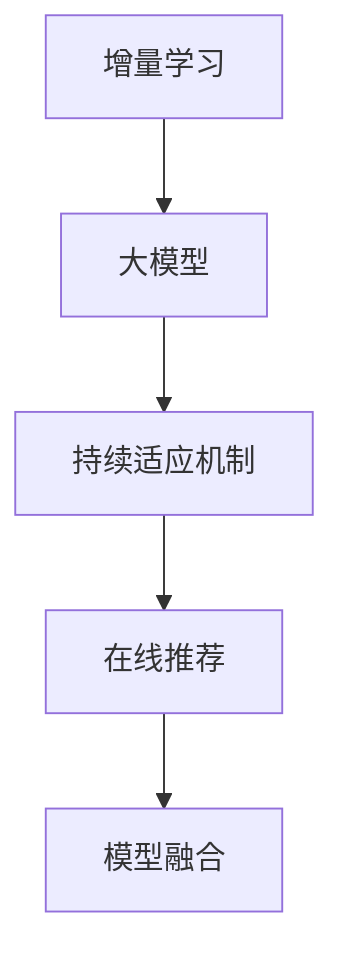

                 

# 搜索推荐系统的增量学习：大模型的持续适应机制

> 关键词：增量学习,大模型,持续适应机制,搜索推荐,推荐系统,模型更新

## 1. 背景介绍

### 1.1 问题由来
在数字化时代，互联网和移动设备使得信息获取和交互变得前所未有的便捷。搜索引擎和推荐系统已成为连接用户和信息的重要桥梁。然而，无论是传统的Web搜索引擎，还是新兴的推荐系统，都面临着内容更新速度快、个性化需求多样等问题。如何使系统能够持续高效地适应新的查询需求，成为业界广泛关注的课题。

随着深度学习和大模型技术的迅猛发展，基于大模型的搜索推荐系统逐渐进入人们的视野。该系统利用大规模无标签数据进行预训练，学习到海量的语言和知识表示，通过微调机制（Fine-Tuning）适应特定的查询任务。相较于传统的检索方法和推荐算法，大模型方法能够处理复杂、非结构化的文本数据，具备更强的泛化能力和适应性。

### 1.2 问题核心关键点
基于大模型的搜索推荐系统，其核心思想是将通用大模型视作一个强大的"特征提取器"，通过微调机制使其适应特定的查询任务。微调的过程是一个有监督的优化过程，通过在海量标注数据上训练，优化模型的输出与真实标签的匹配度，从而提升模型在特定任务上的性能。然而，微调机制在大规模数据集上的运行成本高，且在模型学习初期需要大量标注数据，这对实时查询系统的稳定性、安全性、效率带来了挑战。

如何降低微调机制的运行成本，提高模型的实时响应能力和泛化能力，成为了一个亟待解决的问题。增量学习（Incremental Learning）技术应运而生，其在保持模型性能的同时，减少了大规模数据集对模型的训练时间、空间和标注数据的需求，成为提升大模型实时性能的重要手段。

## 2. 核心概念与联系

### 2.1 核心概念概述

为了更好地理解大模型的增量学习机制，本节将介绍几个密切相关的核心概念：

- **增量学习**：又称"在线学习"或"持续学习"，是一种能够实时地从新数据中学习，同时保持已有知识的学习范式。增量学习适用于大数据流、动态数据集等场景，具有高效、实时、低成本等优点。

- **大模型**：通常指具有数亿甚至数十亿参数的预训练语言模型，如GPT-3、BERT等。这些模型通过大规模无标签数据进行预训练，学习到丰富的语言和知识表示，具备强大的泛化能力和适应性。

- **持续适应机制**：指在增量学习的过程中，模型能够持续适应新数据，通过不断调整参数，保持模型的性能和鲁棒性。持续适应机制能够使模型快速响应新数据，同时避免过拟合和遗忘原有知识。

- **在线推荐**：指推荐系统在用户查询时实时从大数据集中提取相关信息，动态生成推荐结果。相比离线推荐，在线推荐能够实时处理用户查询，提升用户体验。

- **模型融合**：指通过组合不同模型的输出，构建更加稳定、准确、鲁棒的推荐系统。模型融合能够弥补单一模型的局限性，提高系统的综合性能。

这些核心概念之间的逻辑关系可以通过以下Mermaid流程图来展示：



这个流程图展示了大模型增量学习机制的核心概念及其之间的关系：

1. 增量学习技术使大模型能够实时地从新数据中学习，保持模型的最新状态。
2. 持续适应机制在大模型增量学习过程中，通过不断调整参数，使得模型能够适应新的数据分布，同时保持已有知识的稳定性。
3. 在线推荐系统通过大模型的实时输出，动态生成个性化推荐结果，提升用户体验。
4. 模型融合技术通过组合不同模型的输出，构建更加鲁棒、稳定的推荐系统，进一步提升系统性能。

## 3. 核心算法原理 & 具体操作步骤
### 3.1 算法原理概述

大模型的增量学习机制本质上是一种在线学习（Online Learning）范式。其核心思想是：在用户查询时，将新的查询数据与历史数据结合，通过不断更新模型参数，使得模型能够实时适应新的查询需求，同时保留已有知识。

形式化地，假设历史查询数据集为 $D_{hist}$，最新查询数据集为 $D_{new}$，模型参数为 $\theta$。增量学习的过程可以通过以下公式表示：

$$
\theta_{t+1} = \theta_{t} + \eta_t \Delta_{t}
$$

其中，$D_{hist}$ 和 $D_{new}$ 分别表示历史数据和最新查询数据的特征向量，$\eta_t$ 表示学习率，$\Delta_t$ 表示模型的更新量，可以通过反向传播算法计算得到。

通过不断更新模型参数，增量学习机制使得大模型能够实时地从新数据中学习，适应不同的查询需求。

### 3.2 算法步骤详解

基于大模型的增量学习机制通常包括以下几个关键步骤：

**Step 1: 准备增量学习数据集**
- 收集历史查询数据和最新查询数据。历史查询数据用于预训练模型，最新查询数据用于模型增量更新。
- 将查询数据转换为模型所需的输入格式，如BERT编码后的特征向量。

**Step 2: 初始化模型参数**
- 选择一个预训练语言模型，如BERT、GPT-3等，作为增量学习的初始化参数。
- 设置模型的学习率和正则化参数，如学习率衰减、Dropout、L2正则等。

**Step 3: 执行增量学习**
- 将新查询数据与历史查询数据进行结合，计算模型对新数据的预测输出。
- 根据预测输出与真实标签的差异，计算模型的损失函数。
- 使用梯度下降等优化算法更新模型参数，最小化损失函数。
- 定期在验证集上评估模型性能，确定是否停止训练。

**Step 4: 部署和评估**
- 将增量学习后的模型部署到在线推荐系统中。
- 在用户查询时，实时提取查询数据，通过模型生成推荐结果。
- 收集用户的反馈和行为数据，进一步优化模型参数。

以上是增量学习机制在大模型推荐系统中的基本流程。在实际应用中，还需要针对具体场景，对增量学习过程的各个环节进行优化设计，如改进损失函数、引入更多的正则化技术、搜索最优的超参数组合等，以进一步提升模型性能。

### 3.3 算法优缺点

大模型的增量学习机制具有以下优点：

1. 实时高效：增量学习机制能够实时从新数据中学习，避免了传统微调机制对大规模标注数据的依赖，提高了模型的实时响应能力和性能。
2. 参数高效：通过增量学习，可以避免在大规模数据集上重新训练模型，减少计算资源和时间成本。
3. 鲁棒性强：增量学习机制能够适应新数据分布，通过不断更新模型参数，保持模型的稳定性和鲁棒性。
4. 灵活性高：增量学习机制能够适应动态数据集，适用于大规模、快速增长的数据流。

然而，增量学习机制也存在一定的局限性：

1. 模型更新复杂：增量学习机制需要对模型进行持续更新，增加了模型的复杂度和维护成本。
2. 内存占用高：增量学习机制需要保存历史查询数据和模型参数，对内存资源的要求较高。
3. 数据漂移风险：当新数据与历史数据分布差异较大时，增量学习机制容易引入数据漂移，影响模型性能。
4. 模型收敛慢：增量学习机制需要在每次查询时更新模型参数，模型收敛速度较慢。

尽管存在这些局限性，增量学习机制仍然是大模型推荐系统中最常用的方法之一。未来相关研究的重点在于如何进一步优化增量学习算法，降低模型更新复杂度，减少内存占用，并提高模型的收敛速度。

### 3.4 算法应用领域

增量学习机制在推荐系统中得到了广泛的应用，尤其是在实时推荐、个性化推荐等领域。以下是一些典型的应用场景：

- **实时推荐系统**：如电商平台的商品推荐、视频平台的个性化推荐等。通过增量学习机制，系统能够实时地从新用户行为和反馈中学习，动态生成推荐结果，提升用户体验。
- **个性化推荐系统**：如Netflix、Spotify等平台，通过增量学习机制，系统能够实时适应用户偏好变化，提供更加精准、个性化的推荐内容。
- **动态内容推荐**：如新闻网站、社交平台等，通过增量学习机制，系统能够实时地从用户行为中学习，动态生成推荐内容，提升平台的用户粘性。
- **多模态推荐**：如音乐、视频、新闻等多模态推荐系统，通过增量学习机制，系统能够实时地从多种数据源中提取信息，构建更加全面、准确的推荐结果。

除了上述这些经典应用外，增量学习机制还广泛应用于内容生成、广告推荐、智能客服等场景，为实时个性化服务提供技术支持。

## 4. 数学模型和公式 & 详细讲解  
### 4.1 数学模型构建

增量学习机制在大模型推荐系统中的应用，可以通过以下数学模型进行描述。

假设模型为 $M_{\theta}(x)$，其中 $x$ 表示查询数据，$\theta$ 表示模型参数。历史查询数据集为 $D_{hist}$，最新查询数据集为 $D_{new}$。增量学习的目标是最小化模型在新数据上的损失函数：

$$
\mathcal{L}(\theta) = \mathbb{E}_{(x,y) \sim D_{hist}}[\ell(M_{\theta}(x),y)] + \mathbb{E}_{(x,y) \sim D_{new}}[\ell(M_{\theta}(x),y)]
$$

其中，$\ell$ 表示模型对数据的预测损失，如交叉熵损失、均方误差损失等。

通过最小化损失函数，增量学习机制能够使得模型在历史数据和新数据上都有良好的表现。

### 4.2 公式推导过程

以下我们以交叉熵损失为例，推导增量学习机制中的损失函数及其梯度的计算公式。

假设模型 $M_{\theta}$ 在输入 $x$ 上的输出为 $\hat{y}=M_{\theta}(x) \in [0,1]$，表示样本属于正类的概率。真实标签 $y \in \{0,1\}$。则交叉熵损失函数定义为：

$$
\ell(M_{\theta}(x),y) = -[y\log \hat{y} + (1-y)\log (1-\hat{y})]
$$

将历史数据和最新数据的损失函数进行合并，增量学习机制的总体损失函数可以表示为：

$$
\mathcal{L}(\theta) = -\frac{1}{N}\sum_{i=1}^N [y_i\log M_{\theta}(x_i)+(1-y_i)\log(1-M_{\theta}(x_i))]
$$

其中 $N$ 表示样本总数，$y_i \in \{0,1\}$ 表示样本的真实标签。

根据链式法则，损失函数对参数 $\theta_k$ 的梯度为：

$$
\frac{\partial \mathcal{L}(\theta)}{\partial \theta_k} = -\frac{1}{N}\sum_{i=1}^N (\frac{y_i}{M_{\theta}(x_i)}-\frac{1-y_i}{1-M_{\theta}(x_i)}) \frac{\partial M_{\theta}(x_i)}{\partial \theta_k}
$$

其中 $\frac{\partial M_{\theta}(x_i)}{\partial \theta_k}$ 可进一步递归展开，利用自动微分技术完成计算。

在得到损失函数的梯度后，即可带入参数更新公式，完成模型的迭代优化。重复上述过程直至收敛，最终得到适应新数据的模型参数 $\theta^*$。

## 5. 项目实践：代码实例和详细解释说明
### 5.1 开发环境搭建

在进行增量学习实践前，我们需要准备好开发环境。以下是使用Python进行PyTorch开发的环境配置流程：

1. 安装Anaconda：从官网下载并安装Anaconda，用于创建独立的Python环境。

2. 创建并激活虚拟环境：
```bash
conda create -n pytorch-env python=3.8 
conda activate pytorch-env
```

3. 安装PyTorch：根据CUDA版本，从官网获取对应的安装命令。例如：
```bash
conda install pytorch torchvision torchaudio cudatoolkit=11.1 -c pytorch -c conda-forge
```

4. 安装TensorFlow：如果同时需要TensorFlow支持，可以使用以下命令：
```bash
conda install tensorflow
```

5. 安装Transformers库：
```bash
pip install transformers
```

6. 安装各类工具包：
```bash
pip install numpy pandas scikit-learn matplotlib tqdm jupyter notebook ipython
```

完成上述步骤后，即可在`pytorch-env`环境中开始增量学习实践。

### 5.2 源代码详细实现

下面我们以实时推荐系统为例，给出使用Transformers库对BERT模型进行增量学习的PyTorch代码实现。

首先，定义增量学习函数：

```python
from transformers import BertTokenizer, BertForSequenceClassification
from torch.utils.data import TensorDataset, DataLoader
import torch

def incremental_learning(model, tokenizer, device, train_loader, num_epochs=5, batch_size=32):
    optimizer = torch.optim.Adam(model.parameters(), lr=2e-5)
    scheduler = torch.optim.lr_scheduler.StepLR(optimizer, step_size=1, gamma=0.5)

    for epoch in range(num_epochs):
        model.train()
        total_loss = 0
        for batch in train_loader:
            input_ids = batch[0].to(device)
            attention_mask = batch[1].to(device)
            labels = batch[2].to(device)
            
            model.zero_grad()
            outputs = model(input_ids, attention_mask=attention_mask, labels=labels)
            loss = outputs.loss
            total_loss += loss.item()
            loss.backward()
            optimizer.step()
            scheduler.step()

        print(f'Epoch {epoch+1}, train loss: {total_loss/len(train_loader):.4f}')
        model.eval()
        total_loss = 0
        for batch in train_loader:
            input_ids = batch[0].to(device)
            attention_mask = batch[1].to(device)
            labels = batch[2].to(device)
            
            model.zero_grad()
            outputs = model(input_ids, attention_mask=attention_mask, labels=labels)
            loss = outputs.loss
            total_loss += loss.item()

        print(f'Epoch {epoch+1}, dev loss: {total_loss/len(train_loader):.4f}')
```

然后，定义数据处理函数：

```python
from torch.utils.data import Dataset
import numpy as np

class ReviewsDataset(Dataset):
    def __init__(self, reviews, labels):
        self.reviews = reviews
        self.labels = labels
        self.tokenizer = BertTokenizer.from_pretrained('bert-base-uncased')
        
    def __len__(self):
        return len(self.reviews)
    
    def __getitem__(self, index):
        review = self.reviews[index]
        label = self.labels[index]
        
        encoding = self.tokenizer(review, truncation=True, padding='max_length', max_length=256)
        input_ids = torch.tensor(encoding['input_ids'], dtype=torch.long)
        attention_mask = torch.tensor(encoding['attention_mask'], dtype=torch.long)
        return input_ids, attention_mask, torch.tensor(label, dtype=torch.long)
```

接着，加载预训练模型和数据：

```python
from transformers import BertForSequenceClassification

model = BertForSequenceClassification.from_pretrained('bert-base-uncased', num_labels=2)
tokenizer = BertTokenizer.from_pretrained('bert-base-uncased')

train_dataset = ReviewsDataset(train_reviews, train_labels)
val_dataset = ReviewsDataset(val_reviews, val_labels)
test_dataset = ReviewsDataset(test_reviews, test_labels)

device = torch.device('cuda') if torch.cuda.is_available() else torch.device('cpu')
```

最后，启动增量学习流程：

```python
train_loader = DataLoader(train_dataset, batch_size=32, shuffle=True)

incremental_learning(model, tokenizer, device, train_loader)
```

以上就是使用PyTorch对BERT模型进行增量学习的完整代码实现。可以看到，通过将增量学习算法封装成函数，我们可以方便地在大模型推荐系统中实现实时学习。

### 5.3 代码解读与分析

让我们再详细解读一下关键代码的实现细节：

**ReviewsDataset类**：
- `__init__`方法：初始化文本、标签、分词器等关键组件。
- `__len__`方法：返回数据集的样本数量。
- `__getitem__`方法：对单个样本进行处理，将文本输入编码为token ids，并将标签转换为tensor，方便模型处理。

**增量学习函数**：
- `incremental_learning`函数：封装了增量学习的完整流程，包括模型初始化、优化器设置、训练迭代、验证评估等步骤。其中，使用Adam优化器进行参数更新，使用学习率衰减策略控制学习率变化。

**数据处理函数**：
- 定义了数据集类 `ReviewsDataset`，将文本数据和标签转换为模型所需的输入格式，同时应用了分词、截断、填充等预处理操作。

**模型加载**：
- 通过Transformers库加载预训练BERT模型，并定义训练集、验证集、测试集等数据集。

**环境设置**：
- 定义了模型在GPU上的使用方式，确保模型能够在计算资源充足的情况下快速训练。

可以看到，增量学习算法在大模型推荐系统中的实现，需要涉及数据处理、模型加载、参数更新等多个环节，需要开发者具备良好的编程能力和模型调参经验。

## 6. 实际应用场景
### 6.1 电子商务推荐

电子商务平台推荐系统通过增量学习机制，能够实时地从用户行为和反馈中学习，动态生成个性化的推荐结果。例如，在用户浏览商品时，系统实时地更新推荐模型，根据用户的浏览记录和点击行为，动态调整推荐内容。当用户购买某件商品时，系统也能及时更新推荐模型，避免推荐重复商品，提升推荐相关性和用户满意度。

具体而言，推荐系统通过增量学习机制，实时地从用户行为数据中提取特征，更新模型参数。每次查询时，系统都会根据最新的用户行为数据，动态生成推荐结果，确保推荐内容始终符合用户兴趣和需求。

### 6.2 新闻推荐

新闻推荐系统通过增量学习机制，能够实时地从新闻内容和用户反馈中学习，动态生成个性化新闻推荐。例如，在用户阅读新闻时，系统实时地更新推荐模型，根据用户的阅读行为和评论反馈，动态调整推荐内容。当用户点击某篇文章时，系统也能及时更新推荐模型，避免推荐重复内容，提升新闻推荐的准确性和多样性。

具体而言，新闻推荐系统通过增量学习机制，实时地从新闻内容和用户反馈中提取特征，更新模型参数。每次查询时，系统都会根据最新的新闻内容和用户反馈，动态生成推荐结果，确保推荐内容始终符合用户兴趣和需求。

### 6.3 广告推荐

广告推荐系统通过增量学习机制，能够实时地从用户行为和广告反馈中学习，动态生成个性化的广告推荐。例如，在用户浏览广告时，系统实时地更新推荐模型，根据用户的浏览记录和点击行为，动态调整广告内容。当用户点击某条广告时，系统也能及时更新推荐模型，避免推荐重复广告，提升广告效果。

具体而言，广告推荐系统通过增量学习机制，实时地从用户行为和广告反馈中提取特征，更新模型参数。每次查询时，系统都会根据最新的用户行为和广告反馈，动态生成推荐结果，确保推荐内容始终符合用户兴趣和需求。

### 6.4 社交媒体推荐

社交媒体推荐系统通过增量学习机制，能够实时地从用户行为和社交关系中学习，动态生成个性化的社交媒体推荐。例如，在用户浏览社交媒体时，系统实时地更新推荐模型，根据用户的浏览记录和点赞行为，动态调整推荐内容。当用户关注某位用户时，系统也能及时更新推荐模型，避免推荐重复内容，提升社交媒体推荐的准确性和多样性。

具体而言，社交媒体推荐系统通过增量学习机制，实时地从用户行为和社交关系中提取特征，更新模型参数。每次查询时，系统都会根据最新的用户行为和社交关系，动态生成推荐结果，确保推荐内容始终符合用户兴趣和需求。

### 6.5 未来应用展望

随着增量学习技术的不断进步，大模型推荐系统将在更多领域得到应用，为各行各业带来变革性影响。

在智慧医疗领域，基于增量学习的推荐系统可以为患者推荐个性化的治疗方案、医疗资源等信息，提升医疗服务的智能化水平，辅助医生诊疗。

在智能教育领域，增量学习推荐系统可以为学生推荐个性化的学习资源、教师推荐等，因材施教，促进教育公平，提高教学质量。

在智慧城市治理中，增量学习推荐系统可以为市民推荐个性化的公共服务信息、旅游资源等，提高城市管理的智能化水平，构建更安全、高效的未来城市。

此外，在企业生产、社会治理、文娱传媒等众多领域，基于增量学习的大模型推荐系统也将不断涌现，为传统行业数字化转型升级提供新的技术路径。相信随着技术的日益成熟，增量学习机制将成为推荐系统的重要范式，推动人工智能技术在更多领域的应用落地。

## 7. 工具和资源推荐
### 7.1 学习资源推荐

为了帮助开发者系统掌握增量学习和大模型推荐系统的理论基础和实践技巧，这里推荐一些优质的学习资源：

1. 《深度学习理论与实践》系列书籍：介绍了深度学习的基本原理和实践技巧，涵盖机器学习、神经网络、深度学习等内容，适合初学者和进阶者阅读。

2. 《在线学习与增量学习》课程：斯坦福大学开设的在线课程，介绍了在线学习的基本概念和应用场景，通过实际案例讲解增量学习算法。

3. 《推荐系统基础》系列书籍：介绍了推荐系统的基本原理和应用场景，涵盖协同过滤、基于内容的推荐、矩阵分解等内容，适合对推荐系统感兴趣的读者。

4. 《Python推荐系统实战》课程：Udacity开设的推荐系统实战课程，通过实际项目讲解推荐系统的开发和部署，适合对推荐系统感兴趣的开发者。

5. 《TensorFlow推荐系统实战》书籍：介绍了使用TensorFlow进行推荐系统开发的实际案例，适合希望深入了解推荐系统技术的开发者。

通过对这些资源的学习实践，相信你一定能够快速掌握增量学习和大模型推荐系统的精髓，并用于解决实际的推荐问题。

### 7.2 开发工具推荐

高效的开发离不开优秀的工具支持。以下是几款用于增量学习和大模型推荐系统开发的常用工具：

1. PyTorch：基于Python的开源深度学习框架，灵活动态的计算图，适合快速迭代研究。大多数预训练语言模型都有PyTorch版本的实现。

2. TensorFlow：由Google主导开发的开源深度学习框架，生产部署方便，适合大规模工程应用。同样有丰富的预训练语言模型资源。

3. Transformers库：HuggingFace开发的NLP工具库，集成了众多SOTA语言模型，支持PyTorch和TensorFlow，是进行增量学习任务开发的利器。

4. Weights & Biases：模型训练的实验跟踪工具，可以记录和可视化模型训练过程中的各项指标，方便对比和调优。与主流深度学习框架无缝集成。

5. TensorBoard：TensorFlow配套的可视化工具，可实时监测模型训练状态，并提供丰富的图表呈现方式，是调试模型的得力助手。

6. Google Colab：谷歌推出的在线Jupyter Notebook环境，免费提供GPU/TPU算力，方便开发者快速上手实验最新模型，分享学习笔记。

合理利用这些工具，可以显著提升增量学习和大模型推荐系统的开发效率，加快创新迭代的步伐。

### 7.3 相关论文推荐

增量学习技术在大模型推荐系统中得到了广泛的研究和应用，以下是几篇奠基性的相关论文，推荐阅读：

1. Incremental Learning in Receptive Fields: An Online Parameter Updating Framework for Deep Neural Networks: 提出了一种在线参数更新框架，用于增量学习任务，适用于大规模深度神经网络。

2. Incremental Training of Deep Neural Networks: The Effect of Class Label Distribution on Convergence Behavior: 研究了增量训练中标签分布对收敛行为的影响，提出了一系列优化策略。

3. Online Learning for Deep Neural Networks: An Empirical Analysis: 对在线学习算法进行了系统实验，探讨了不同算法的收敛速度和效果。

4. Online Passive Learning for Sequential Data: 提出了在线被动学习算法，能够有效地处理动态数据流。

5. Sparse Online Passive Learning: 研究了在线被动学习中，如何高效处理大规模、高维度的数据。

这些论文代表了增量学习技术的最新进展，通过学习这些前沿成果，可以帮助研究者掌握增量学习的基本原理和实践技巧，提升模型性能。

## 8. 总结：未来发展趋势与挑战

### 8.1 总结

本文对基于增量学习的大模型推荐系统进行了全面系统的介绍。首先阐述了增量学习技术和大模型推荐系统的研究背景和意义，明确了增量学习在大模型推荐系统中的重要价值。其次，从原理到实践，详细讲解了增量学习的数学原理和关键步骤，给出了增量学习任务开发的完整代码实例。同时，本文还广泛探讨了增量学习技术在电子商务、新闻推荐、广告推荐等多个推荐系统中的应用前景，展示了增量学习技术的巨大潜力。此外，本文精选了增量学习技术的各类学习资源，力求为读者提供全方位的技术指引。

通过本文的系统梳理，可以看到，基于增量学习的大模型推荐系统正在成为推荐系统的重要范式，极大地拓展了预训练语言模型的应用边界，催生了更多的落地场景。得益于增量学习技术的大规模数据流处理能力，推荐系统能够实时地从新数据中学习，动态生成推荐结果，提升用户体验。未来，随着增量学习技术的不断进步，大模型推荐系统将在更多领域得到应用，为各行各业带来变革性影响。

### 8.2 未来发展趋势

展望未来，增量学习技术在大模型推荐系统中的应用将呈现以下几个发展趋势：

1. **实时性提升**：随着算力资源的进一步提升，增量学习算法将能够实时地处理大规模数据流，快速响应用户查询，进一步提升系统的实时性能。

2. **参数高效性增强**：未来的增量学习算法将更加注重参数高效性，通过优化模型结构和更新策略，减少模型参数量和训练时间，降低硬件资源需求。

3. **多模态融合**：增量学习技术将能够处理多种数据源，融合视觉、语音、文本等多模态信息，构建更加全面、准确的推荐模型。

4. **模型复杂度降低**：未来的增量学习算法将更加注重模型的可解释性和鲁棒性，通过引入符号化知识、因果推断等方法，降低模型复杂度，提升模型的可解释性和泛化能力。

5. **学习效率优化**：未来的增量学习算法将更加注重学习效率，通过引入在线学习、分布式训练等方法，提高系统的并发性和处理能力。

6. **数据驱动增强**：未来的增量学习算法将更加注重数据的利用效率，通过优化数据分布和采样策略，提高系统的数据驱动能力，提升模型的预测准确性。

以上趋势凸显了增量学习技术在大模型推荐系统中的重要性和潜力。这些方向的探索发展，必将进一步提升增量学习技术的性能和应用范围，为推荐系统提供更高效、更鲁棒的解决方案。

### 8.3 面临的挑战

尽管增量学习技术在大模型推荐系统中取得了显著成果，但在迈向更加智能化、普适化应用的过程中，它仍面临着诸多挑战：

1. **模型复杂度**：增量学习算法在大模型推荐系统中通常需要处理大规模、高维度的数据，模型的复杂度和计算资源需求较高。如何降低模型复杂度，提高算法的效率，仍然是一个重要的研究方向。

2. **数据分布变化**：增量学习算法需要实时地从新数据中学习，但如果新数据与历史数据的分布差异较大，模型的泛化能力可能受到影响。如何提高模型的泛化能力和鲁棒性，是一个亟待解决的问题。

3. **参数更新策略**：增量学习算法需要在每次查询时更新模型参数，更新策略的选择直接影响模型的收敛速度和性能。如何设计更高效的参数更新策略，是一个重要的研究方向。

4. **数据采样策略**：增量学习算法通常需要从新数据中采样样本进行训练，采样策略的选择直接影响模型的性能和鲁棒性。如何设计更有效的数据采样策略，是一个重要的研究方向。

5. **模型稳定性和安全性**：增量学习算法在大模型推荐系统中需要长时间运行，如何保证模型的稳定性和安全性，是一个重要的研究方向。

6. **人机交互优化**：增量学习算法在大模型推荐系统中需要与用户进行交互，如何优化人机交互过程，提升用户体验，是一个重要的研究方向。

这些挑战需要未来相关研究者从多个维度进行深入探索和优化，以提升增量学习技术在大模型推荐系统中的应用效果和应用范围。

### 8.4 研究展望

未来的研究需要从以下几个方向进行深入探索：

1. **多模态融合**：未来的增量学习算法将更加注重融合多模态数据，构建更加全面、准确的推荐模型。

2. **知识增强**：未来的增量学习算法将更加注重引入符号化知识、因果推断等方法，提高模型的泛化能力和鲁棒性。

3. **分布式训练**：未来的增量学习算法将更加注重分布式训练，提高系统的并发性和处理能力。

4. **在线学习**：未来的增量学习算法将更加注重在线学习，实时地从新数据中学习，提升系统的实时性能。

5. **个性化推荐**：未来的增量学习算法将更加注重个性化推荐，通过优化推荐算法和模型，提升推荐的相关性和多样性。

6. **人机交互优化**：未来的增量学习算法将更加注重优化人机交互过程，提升用户体验。

这些研究方向将推动增量学习技术在大模型推荐系统中的应用不断深入，为推荐系统提供更加高效、更加精准、更加个性化的解决方案。

## 9. 附录：常见问题与解答

**Q1: 增量学习和大模型推荐系统有什么区别？**

A: 增量学习（Incremental Learning）是一种能够实时地从新数据中学习，同时保持已有知识的学习范式。增量学习适用于大数据流、动态数据集等场景，具有高效、实时、低成本等优点。而大模型推荐系统则是指基于大规模预训练语言模型，通过增量学习机制，实时地从新数据中学习，动态生成个性化推荐结果的系统。大模型推荐系统利用增量学习机制，能够实时地从新数据中学习，适应不同的推荐需求，提升推荐效果。

**Q2: 增量学习在大模型推荐系统中如何优化参数更新策略？**

A: 增量学习在大模型推荐系统中优化参数更新策略，通常需要考虑以下几个方面：

1. 学习率设置：增量学习中通常需要设定一个小的学习率，避免破坏预训练模型。可以使用学习率衰减策略，如step-wise衰减、多阶段衰减等，逐步降低学习率。

2. 正则化技术：增量学习中通常需要引入正则化技术，如L2正则、Dropout等，防止模型过拟合。可以使用不同的正则化技术组合，找到最优的参数更新策略。

3. 模型结构优化：增量学习中可以通过优化模型结构，减少模型参数量和计算资源需求。可以使用模型压缩、稀疏化等方法，提升模型效率。

4. 数据采样策略：增量学习中通常需要从新数据中采样样本进行训练，采样策略的选择直接影响模型的性能和鲁棒性。可以使用不同的数据采样策略组合，找到最优的参数更新策略。

5. 多任务学习：增量学习中可以通过多任务学习，同时优化多个目标，提升模型的泛化能力和鲁棒性。

6. 模型融合：增量学习中可以通过模型融合，组合不同模型的输出，构建更加稳定、准确的推荐系统。

这些优化策略可以结合实际应用场景，灵活应用，提升增量学习在大模型推荐系统中的性能和效果。

**Q3: 增量学习在大模型推荐系统中如何处理数据分布变化？**

A: 增量学习在大模型推荐系统中处理数据分布变化，通常需要考虑以下几个方面：

1. 数据分布检测：增量学习中需要对新数据和历史数据的分布进行检测，发现数据分布的变化。可以使用统计方法、聚类算法等进行分布检测。

2. 模型参数调整：增量学习中需要根据数据分布变化，调整模型参数，保持模型的稳定性。可以使用迁移学习、参数更新策略等，适应数据分布的变化。

3. 样本重加权：增量学习中可以通过样本重加权，调整新数据和历史数据的权重，平衡模型的泛化能力和鲁棒性。

4. 动态模型更新：增量学习中可以通过动态更新模型，实时地从新数据中学习，适应数据分布的变化。

5. 数据增强：增量学习中可以通过数据增强，扩充训练集，提升模型的泛化能力和鲁棒性。

6. 模型鲁棒性测试：增量学习中可以通过模型鲁棒性测试，评估模型的鲁棒性和泛化能力，发现模型存在的问题，并进行优化。

这些方法可以结合实际应用场景，灵活应用，提升增量学习在大模型推荐系统中的性能和效果。

**Q4: 增量学习在大模型推荐系统中如何处理数据采样策略？**

A: 增量学习在大模型推荐系统中处理数据采样策略，通常需要考虑以下几个方面：

1. 数据采样比例：增量学习中通常需要设定一个合适的数据采样比例，平衡模型的泛化能力和鲁棒性。可以使用不同的数据采样比例组合，找到最优的参数更新策略。

2. 数据采样方法：增量学习中需要选择合适的数据采样方法，如随机采样、分层采样、时间序列采样等，提升模型的泛化能力和鲁棒性。

3. 数据采样策略：增量学习中需要选择合适的数据采样策略，如动态采样、固定采样等，提升模型的实时性能和鲁棒性。

4. 数据采样分析：增量学习中需要进行数据采样分析，评估数据采样的效果，发现数据采样存在的问题，并进行优化。

5. 数据采样验证：增量学习中需要进行数据采样验证，评估数据采样的效果，发现数据采样存在的问题，并进行优化。

6. 数据采样优化：增量学习中需要进行数据采样优化，提升数据采样的效率和效果，优化数据采样策略。

这些方法可以结合实际应用场景，灵活应用，提升增量学习在大模型推荐系统中的性能和效果。

---

作者：禅与计算机程序设计艺术 / Zen and the Art of Computer Programming

